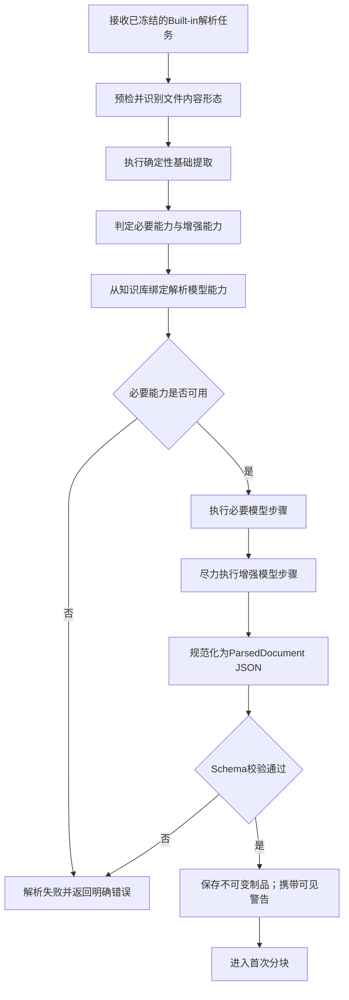
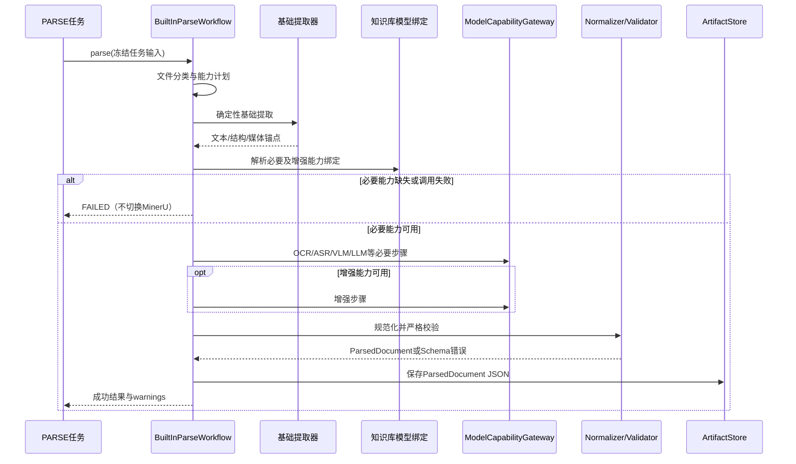
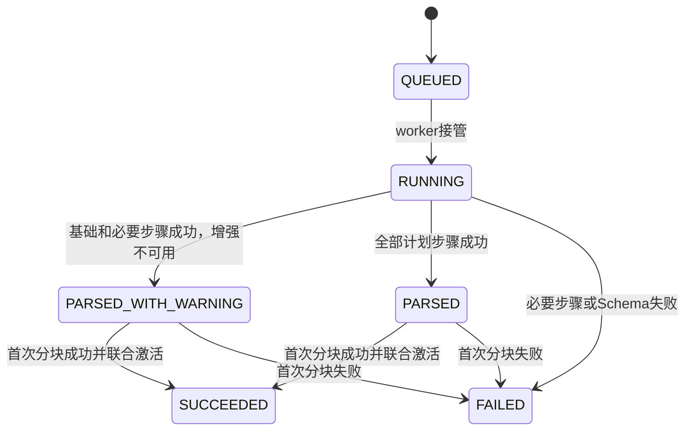

# Built-in Parser-内置解析器业务适配说明

> 文档层级：业务适配详解  
> 所属领域：文档域（`document`）  
> 适配编号：BA-DOC-001  
> 适配对象：解析器类型  
> 文档状态：已评审  
> 更新日期：2026-08-14

## 1. 适配对象与适用范围

- 适配对象：Built-in Parser，系统自有的自动解析工作流。
- 适用业务能力：BS-DOC-003 文档解析，并作为 BS-DOC-005 首次分块的上游。
- 适用产品/渠道/租户/配置：选择内置解析器的全部知识库；所需模型能力从知识库绑定解析。
- 入口场景：知识库默认内置解析器，或本次解析显式覆盖为内置解析器。
- 不适用范围：MinerU 协议；文件夹；用户直接选择 OCR/VLM/ASR 等内部步骤；模型连接管理。
- 可信度说明：目标工作流和容错规则由用户确认；当前 `Fons4AiDocumentParserAdapter` 只作现状差距证据，Tika 不是用户可见解析器。

## 2. 业务流程

图示状态：已根据用户确认补全；每种文件的具体步骤和模型提示词待技术设计。

## 3. 适配时序图

图示状态：已根据目标模型补全。

| 顺序 | 适配步骤 | 公共/特有 | 触发条件 | 协作对象 | 状态/数据影响 | 证据 |
| --- | --- | --- | --- | --- | --- | --- |
| 1 | 按冻结任务执行已选解析器 | 公共 | PARSE开始 | Task | 不重读默认 Parser | 用户确认 |
| 2 | 文件预检、分类、基础提取 | 特有 | Built-in | 基础提取器 | 产生候选结构和能力计划 | 用户确认 |
| 3 | 解析能力绑定 | 特有 | 需要模型 | 知识库域/用户域 | 只引用 Profile，不复制凭证 | 用户确认 |
| 4 | 必要/增强模型步骤 | 特有 | 能力计划 | ModelCapabilityGateway | 必要失败；增强警告 | 用户确认 |
| 5 | 规范化、校验、保存 JSON | 公共 | 解析器返回 | Normalizer/Validator/Store | 形成不可变 ParseRevision 制品 | 用户确认 |
| 6 | 首次分块 | 公共 | JSON成功 | 分块策略 | 整个PARSE成功前不激活 | 用户确认 |

## 4. 关键业务规则

| 规则编号 | 规则内容 | 触发条件 | 处理结果 | 与公共流程差异 | 状态 |
| --- | --- | --- | --- | --- | --- |
| BAR-DOC-BI-001 | 用户只选择 Built-in，不选择 OCR/VLM/ASR 等内部步骤 | 创建任务 | 系统自动生成能力计划 | 内置特有编排 | 已验证 |
| BAR-DOC-BI-002 | OCR 与 VLM 互补且显式绑定，不静默互代；兼容时同一 Profile 可绑定多个用途 | 视觉内容 | 按绑定分别调用 | 内置多能力规则 | 已验证 |
| BAR-DOC-BI-003 | 必要能力缺失、连接无效或调用失败导致 PARSE 失败 | 必要步骤 | 返回明确失败 | 不得换 MinerU | 已验证 |
| BAR-DOC-BI-004 | 增强能力不可用时保留基础结果并返回可见 warning | 增强步骤 | 降级成功 | Built-in 特有容错 | 已验证 |
| BAR-DOC-BI-005 | 模型能力集以 LLM、EMBEDDING、RERANK、ASR、VLM、OCR 为当前基础范围，可扩展，不限定仅 LLM/EMBEDDING | 模型解析 | 按能力用途绑定 | 纠正当前实现覆盖不足 | 已验证 |
| BAR-DOC-BI-006 | 结构化输出优先原生 JSON Schema，其次 JSON Object，再次提示词 JSON；系统始终严格校验 | 模型返回 | 不合格则重试或失败 | 协议优先而非厂商Adapter | 已验证 |

## 5. 状态流转

| 当前状态 | 触发动作 | 前置条件 | 目标状态 | 失败/挂起处理 | 状态 |
| --- | --- | --- | --- | --- | --- |
| QUEUED | 开始解析 | 任务可执行 | RUNNING | 可进入RETRY_WAIT | 已验证 |
| RUNNING | 解析完成 | 必要步骤与Schema成功 | 内部 parsed | 只记录中间物，不激活 | 已验证 |
| 内部 parsed | 首次分块完成 | 分块成功 | SUCCEEDED | 失败则整个任务FAILED | 已验证 |

## 6. 接口、配置与数据差异

| 类型 | 差异项 | 说明 | 证据 |
| --- | --- | --- | --- |
| 接口/协议 | ModelCapabilityGateway | 使用 OpenAI-compatible 公共子集，不为厂商逐个写 Java Adapter | 用户确认 |
| 配置 | 能力用途绑定 | LLM/EMBEDDING/RERANK/ASR/VLM/OCR 按需要解析 | 用户确认 |
| 数据字段 | capabilityPlan/trace/warnings | 精确结构开发前确认，秘密不得进入快照或日志 | 用户确认 |
| 错误码/结果码 | required capability vs enhancement | 必要错误失败；增强错误警告 | 用户确认 |

## 7. 异常、重试与补偿

| 场景 | 处理方式 | 是否重试 | 是否影响状态 | 证据状态 |
| --- | --- | --- | --- | --- |
| 必要能力未配置 | 明确失败并提示配置对应能力 | 否，配置后新任务/重试 | 是 | 已验证 |
| 模型暂时失败 | 在相同快照与解析器下有界重试 | 是 | 是 | 已验证 |
| 增强能力失败 | 记录 warning，保留基础结果 | 可选 | 是，成功带警告 | 已验证 |
| JSON Schema不合格 | 协议层重试后失败 | 是，有界 | 是 | 已验证 |
| 任意 Built-in 失败 | 不得自动调用 MinerU | 否 | 是 | 已验证 |

## 8. 技术落地索引

- 入口/API/任务：Parse API、PARSE Task。
- 应用服务：目标 ParseTaskOrchestrator/BuiltInParseWorkflow；现有 `ParseApplicationService`、`ParseTaskExecutor` 仅参考。
- 领域对象/策略/流程：DocumentParser、Normalizer、Validator、能力计划。
- Gateway/Remote/Adapter：ModelCapabilityGateway、基础提取器；当前 `Fons4AiDocumentParserAdapter` 为现状。
- Mapper/Repository：ParseRevision、Task、SourceDocument Repository。
- 测试：多格式样本、必要/增强能力、结构化输出、无回退、首次分块联合激活。

## 9. 源码证据

| 结论 | 证据路径 | 证据类型 | 状态 |
| --- | --- | --- | --- |
| 当前已有解析端口与执行器 | `common/dto/DocumentParserPort.java`、`infrastructure/task/ParseTaskExecutor.java` | 源码 | 现状参考 |
| 当前内置实现不等于目标解析器标准 | `infrastructure/parsing/Fons4AiDocumentParserAdapter.java` | 源码 | 差距证据 |
| 当前模型客户端能力不完整 | `infrastructure/client/user/LangChain4jModelClientFactory.java` | 源码 | 差距证据 |
| 目标工作流和容错规则 | 2026-08-14 对话确认 | 用户确认 | 已验证 |

## 10. 待确认事项

| 编号 | 问题 | 影响 | 建议处理 |
| --- | --- | --- | --- |
| BAQ-DOC-BI-001 | 各文件类型的基础提取器、能力计划和提示词模板 | 实现和成本 | 结合 ParsedDocument Schema 做技术设计 |
| BAQ-DOC-BI-002 | OpenAI-compatible 对 ASR/VLM/OCR 的公共子集边界 | 连接兼容性 | 官方协议契约测试后确定 |

