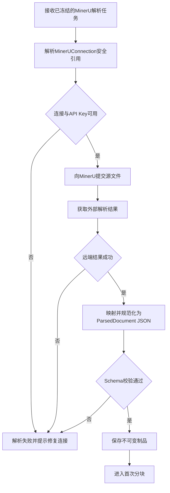
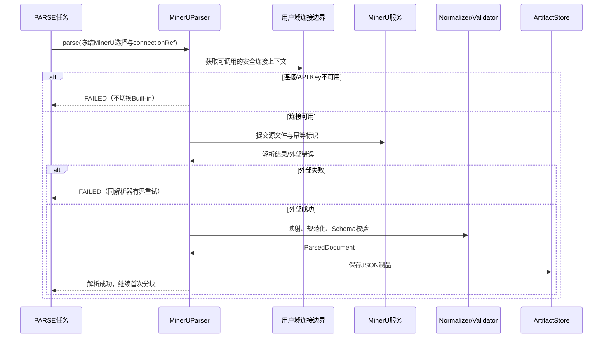
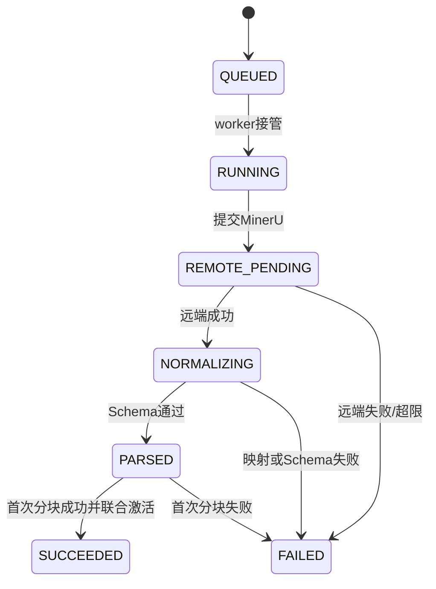

# MinerU Parser-MinerU解析器业务适配说明

> 文档层级：业务适配详解  
> 所属领域：文档域（`document`）  
> 适配编号：BA-DOC-002  
> 适配对象：解析器类型  
> 文档状态：已评审  
> 更新日期：2026-08-14

## 1. 适配对象与适用范围

- 适配对象：MinerU 外部解析服务。
- 适用业务能力：BS-DOC-004 文档解析，并作为 BS-DOC-005 首次分块上游。
- 适用产品/渠道/租户/配置：用户已创建可用 MinerUConnection，知识库默认或本次任务选择 MinerU。
- 入口场景：PARSE 任务已冻结 MinerU 选择和非秘密连接引用。
- 不适用范围：内置解析步骤、模型能力编排、厂商凭证管理、文件夹。
- 可信度说明：业务选择、凭证边界和失败规则由用户确认；MinerU 精确 API/格式能力需按选定版本验证。

## 2. 业务流程

图示状态：业务流程已确认；提交、轮询或回调形态待 MinerU 版本验证。

## 3. 适配时序图

图示状态：已根据目标模型补全；凭证仅在安全边界内使用。

| 顺序 | 适配步骤 | 公共/特有 | 触发条件 | 协作对象 | 状态/数据影响 | 证据 |
| --- | --- | --- | --- | --- | --- | --- |
| 1 | 按冻结任务执行 MinerU | 公共 | PARSE开始 | Task | 不重读默认 Parser | 用户确认 |
| 2 | 解析安全连接 | 特有 | MinerU选择 | 用户域 | 不复制 API Key | 用户确认 |
| 3 | 提交并获取解析结果 | 特有 | 连接可用 | MinerU | 关联本地任务与外部流水 | 用户确认；协议待验证 |
| 4 | 规范化与校验 | 公共 | 远端成功 | Normalizer/Validator | 形成同一 JSON Schema | 用户确认 |
| 5 | 保存并首次分块 | 公共 | Schema通过 | Store/分块策略 | 全部成功后联合激活 | 用户确认 |

## 4. 关键业务规则

| 规则编号 | 规则内容 | 触发条件 | 处理结果 | 与公共流程差异 | 状态 |
| --- | --- | --- | --- | --- | --- |
| BAR-DOC-MU-001 | MinerU 必须使用用户提供的 API Key，通过用户域 MinerUConnection 引用获取 | 每次调用 | 不在文档域复制秘密 | 外部解析器特有 | 已验证 |
| BAR-DOC-MU-002 | 平台允许上传的文件应同时是 MinerU 与 Built-in 的受理范围 | 上传前 | 不建立“某解析器不支持但仍可上传”的业务矩阵 | 无扩展名适配 | 已验证；清单待验证 |
| BAR-DOC-MU-003 | MinerU 连接、API Key、远端解析或结果 Schema 失败均使当前 PARSE 失败 | 任一异常 | 明确错误 | 不得调用 Built-in | 已验证 |
| BAR-DOC-MU-004 | 用户可修复连接或显式选择另一解析器后新建任务 | 失败后 | 新任务有新快照 | 不是自动回退 | 已验证 |
| BAR-DOC-MU-005 | MinerU 输出必须经过系统 Normalizer/Validator，外部格式不是领域标准 | 远端成功 | 产出统一 ParsedDocument JSON | 外部映射特有 | 已验证 |

## 5. 状态流转

| 当前状态 | 触发动作 | 前置条件 | 目标状态 | 失败/挂起处理 | 状态 |
| --- | --- | --- | --- | --- | --- |
| QUEUED | 调用 MinerU | 连接有效 | RUNNING/内部远端等待 | 连接错误直接失败 | 已验证 |
| 远端等待 | 收到结果 | 结果成功 | 内部规范化 | 超时进入有界重试 | 已验证 |
| 内部 parsed | 首次分块 | Schema通过 | SUCCEEDED | 失败则整个PARSE失败 | 已验证 |

## 6. 接口、配置与数据差异

| 类型 | 差异项 | 说明 | 证据 |
| --- | --- | --- | --- |
| 接口/协议 | MinerU API | 精确 URL、请求/响应、异步模式按部署版本验证 | 待技术验证 |
| 配置 | MinerUConnection引用 | 用户域持有 API Key，文档域只保存引用/快照标识 | 用户确认 |
| 数据字段 | externalRequestId/responseTrace | 用于幂等、追踪和错误定位，具体字段待设计 | 用户确认 |
| 错误码/结果码 | 远端→领域错误 | 连接/鉴权/限流/超时/解析/Schema分类 | 用户确认；映射待设计 |

## 7. 异常、重试与补偿

| 场景 | 处理方式 | 是否重试 | 是否影响状态 | 证据状态 |
| --- | --- | --- | --- | --- |
| MinerUConnection不存在/停用 | 失败并提示配置 | 否 | 是 | 已验证 |
| API Key无效 | 失败并提示修复连接，不记录密钥 | 否 | 是 | 已验证 |
| 限流/超时/临时5xx | 使用同一解析器、同一快照和幂等标识有界重试 | 是 | 是 | 已验证 |
| 永久解析错误/不合格结果 | 失败并保留安全响应摘要 | 否 | 是 | 已验证 |
| 任意 MinerU 失败 | 不得自动调用 Built-in | 否 | 是 | 已验证 |

## 8. 技术落地索引

- 入口/API/任务：Parse API、PARSE Task。
- 应用服务：ParseTaskOrchestrator、MinerUParser（目标）。
- 领域对象/策略/流程：DocumentParser、Normalizer、Validator。
- Gateway/Remote/Adapter：MinerURemote、用户域 MinerUConnectionBoundary。
- Mapper/Repository：ParseRevision、Task、SourceDocument Repository。
- 测试：MinerU 契约、鉴权/限流/超时、幂等、Schema 映射、无回退、联合激活。

## 9. 源码证据

| 结论 | 证据路径 | 证据类型 | 状态 |
| --- | --- | --- | --- |
| 当前已有公共解析端口与任务骨架 | `common/dto/DocumentParserPort.java`、`infrastructure/task/ParseTaskExecutor.java` | 源码 | 可参考 |
| MinerU 为目标解析适配 | 2026-08-14 对话确认 | 用户确认 | 已验证 |
| 精确 MinerU 协议未锁定 | 项目规则与当前知识基线 | 正式规则 | 待技术验证 |

## 10. 待确认事项

| 编号 | 问题 | 影响 | 建议处理 |
| --- | --- | --- | --- |
| BAQ-DOC-MU-001 | MinerU 部署方式、版本、提交/回调/轮询契约和受理格式 | Remote实现与任务状态 | 实现前读取对应官方契约并做契约测试 |
| BAQ-DOC-MU-002 | 外部任务取消、超时后结果到达和清理规则 | 幂等与成本 | 任务技术设计时确认 |

