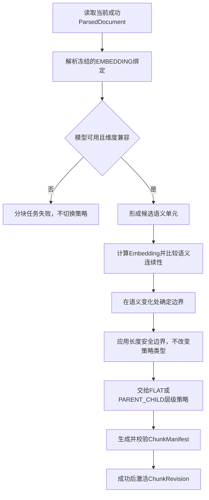
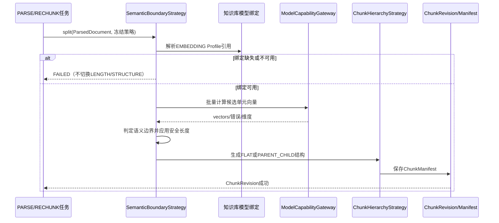
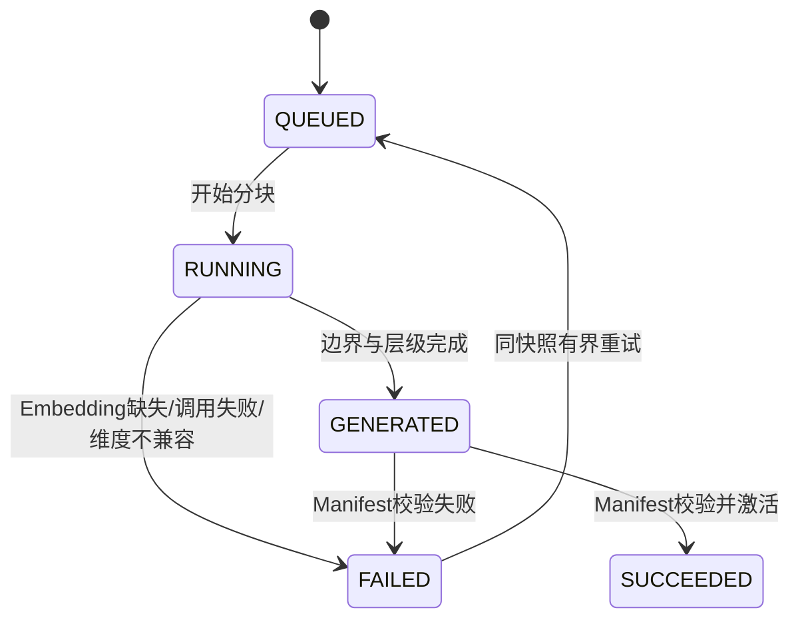

# SEMANTIC-语义分块业务适配说明

> 文档层级：业务适配详解  
> 所属领域：文档域（`document`）  
> 适配编号：BA-DOC-005  
> 适配对象：分块边界策略  
> 文档状态：已评审  
> 更新日期：2026-08-14

## 1. 适配对象与适用范围

- 适配对象：SEMANTIC 语义边界策略。
- 适用业务能力：首次分块 BS-DOC-005、重新分块 BS-DOC-006。
- 适用产品/渠道/租户/配置：显式选择 SEMANTIC，且知识库存在可用 EMBEDDING 绑定。
- 入口场景：解析 JSON 已通过校验，分块任务使用冻结的语义策略和模型引用。
- 不适用范围：LENGTH/STRUCTURE 的边界算法；FLAT/PARENT_CHILD 层级生成；发布阶段的向量生成。
- 可信度说明：依赖和失败规则由用户确认；相似度算法、阈值和安全长度待评测。

## 2. 业务流程

图示状态：目标流程已确认；具体算法和阈值待实现评测。

## 3. 适配时序图

图示状态：已补全语义策略相对公共分块骨架的特有步骤。

| 顺序 | 适配步骤 | 公共/特有 | 触发条件 | 协作对象 | 状态/数据影响 | 证据 |
| --- | --- | --- | --- | --- | --- | --- |
| 1 | 读取 ParsedDocument | 公共 | 分块开始 | ArtifactStore | 不修改解析制品 | 用户确认 |
| 2 | 解析 EMBEDDING 绑定 | 特有 | SEMANTIC | 知识库域/用户域 | 冻结非秘密 Profile 引用 | 用户确认 |
| 3 | 计算语义向量和边界 | 特有 | 模型可用 | ModelGateway | 生成语义边界 | 用户确认 |
| 4 | 应用长度安全限制 | 公共约束 | 边界过大 | Semantic策略 | 仍标记 SEMANTIC | 用户确认 |
| 5 | 应用层级策略并保存 | 公共 | 边界成功 | HierarchyStrategy/Data | 新 ChunkRevision | 用户确认 |

## 4. 关键业务规则

| 规则编号 | 规则内容 | 触发条件 | 处理结果 | 与公共流程差异 | 状态 |
| --- | --- | --- | --- | --- | --- |
| BAR-DOC-SE-001 | SEMANTIC 必须有有效 EMBEDDING 绑定 | 开始分块 | 缺失即失败 | 相比 LENGTH/STRUCTURE 新增模型依赖 | 已验证 |
| BAR-DOC-SE-002 | 调用失败或维度不兼容不得静默切 LENGTH/STRUCTURE | 模型异常 | 当前任务失败 | 禁止策略回退 | 已验证 |
| BAR-DOC-SE-003 | 长度上限只是安全边界，不把结果标记为 LENGTH 策略 | 语义块过大 | 在语义策略内受控拆分 | 保持策略可追踪 | 已验证 |
| BAR-DOC-SE-004 | 边界策略和 FLAT/PARENT_CHILD 层级策略正交组合 | 边界形成后 | 再生成层级关系 | 不由语义算法隐式决定层级 | 已验证 |
| BAR-DOC-SE-005 | 重新分块复用当前成功 ParseRevision | RECHUNK | 不重新解析 | 与首次PARSE编排不同 | 已验证 |

## 5. 状态流转

| 当前状态 | 触发动作 | 前置条件 | 目标状态 | 失败/挂起处理 | 状态 |
| --- | --- | --- | --- | --- | --- |
| QUEUED | 开始计算 | Embedding可解析 | RUNNING | 缺失直接失败 | 已验证 |
| RUNNING | 生成Manifest | 向量与维度有效 | GENERATED | 不回退其他策略 | 已验证 |
| GENERATED | 激活 | 校验通过 | SUCCEEDED | 首次PARSE需与Parse联合激活 | 已验证 |

## 6. 接口、配置与数据差异

| 类型 | 差异项 | 说明 | 证据 |
| --- | --- | --- | --- |
| 接口/协议 | ModelCapabilityGateway.EMBEDDING | 支持批量向量化和维度校验 | 用户确认 |
| 配置 | semantic params | 阈值、候选单元、安全长度待评测 | 待确认 |
| 数据字段 | embeddingProfileRef/semanticPolicySnapshot | 仅保存非秘密引用和有效策略 | 用户确认 |
| 错误码/结果码 | binding/call/dimension | 三类均为分块失败 | 用户确认 |

## 7. 异常、重试与补偿

| 场景 | 处理方式 | 是否重试 | 是否影响状态 | 证据状态 |
| --- | --- | --- | --- | --- |
| 缺少 EMBEDDING 绑定 | 明确失败并提示配置 | 否 | 是 | 已验证 |
| 模型临时错误 | 同快照有界重试 | 是 | 是 | 已验证 |
| 维度不一致 | 明确失败，不写活动修订 | 否，修复配置后再试 | 是 | 已验证 |
| 首次分块失败 | 整个 PARSE 失败，Parse/Chunk 指针均不切换 | 是 | 是 | 已验证 |
| RECHUNK失败 | 保留当前活动 ChunkRevision | 是 | 是 | 已验证 |

## 8. 技术落地索引

- 入口/API/任务：PARSE 内部分块步骤、RECHUNK Task。
- 应用服务：ParseTaskOrchestrator/RechunkApplicationService（目标）。
- 领域对象/策略/流程：SemanticBoundaryStrategy、ChunkHierarchyStrategy。
- Gateway/Remote/Adapter：ModelCapabilityGateway.EMBEDDING。
- Mapper/Repository：ChunkRevision Repository、ArtifactStore。
- 测试：绑定缺失、调用失败、维度、阈值边界、层级组合、联合激活和无策略回退。

## 9. 源码证据

| 结论 | 证据路径 | 证据类型 | 状态 |
| --- | --- | --- | --- |
| 当前已有单一分块端口/实现 | `common/dto/DocumentChunkerPort.java`、`infrastructure/parsing/LangChain4jChunkerAdapter.java` | 源码 | 现状参考，需重构 |
| 当前模型客户端提供 Embedding 候选 | `infrastructure/client/user/LangChain4jModelClientFactory.java` | 源码 | 代表性实现 |
| 两维策略与失败规则 | 2026-08-14 对话确认 | 用户确认 | 已验证 |

## 10. 待确认事项

| 编号 | 问题 | 影响 | 建议处理 |
| --- | --- | --- | --- |
| BAQ-DOC-SE-001 | 候选语义单元、相似度算法、阈值和批大小 | 质量、性能、成本 | 建立评测集后校准 |
| BAQ-DOC-SE-002 | 长度安全边界与 Parent/Child 大小关系 | 上下文完整性 | 分块技术设计时确认 |

