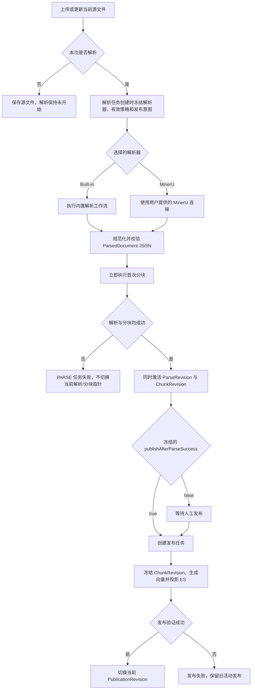
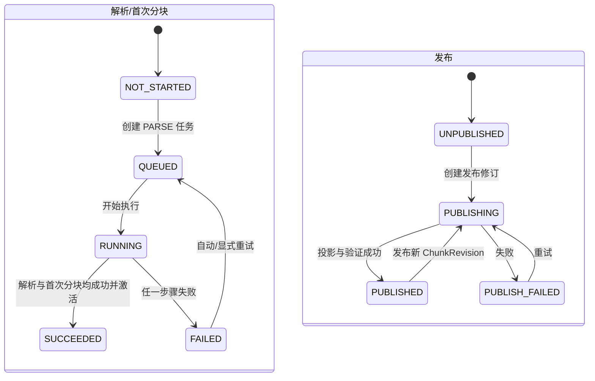

# 文档域业务文档

> 文档层级：领域级  
> 领域名称：文档域  
> 领域标识：`document`  
> 文档状态：已评审  
> 更新日期：2026-08-14

## 1. 领域职责

- 领域目标：把用户上传的当前源文件转化为可检查、可追溯、可重新处理和可发布检索的知识内容。
- 领域边界：拥有 `SourceDocument`、解析与分块修订、RAG 发布修订，以及相关处理任务、幂等、重试和 Outbox 事实。
- 不负责事项：不管理文件夹树、路径和文件夹 CRUD；不拥有知识库默认策略与模型绑定；不拥有 Workspace 授权、模型连接/档案、OKF、在线检索与问答；不把调度器、锁、MinIO SDK 或 Elasticsearch SDK 当作业务能力。
- 上游协作：知识库域提供知识库归属、默认 Parser/Chunk 策略和模型用途绑定；用户域提供授权边界、模型资源及 MinerU 连接。文件夹若存在，仅作为知识库域给出的不透明容器引用。
- 下游协作：检索域消费成功的 `PublicationRevision` 与 ES 投影；OKF 域按后续需求消费已发布或已解析内容。
- 可信度说明：本文是经 2026-08-14 用户逐项确认的目标模型。现有代码、SQL 和旧文档仅作为现状与差距证据，不自动代表目标事实。

## 2. 核心业务对象

| 对象 | 定义 | 生命周期 | 关键状态 | 状态 |
| --- | --- | --- | --- | --- |
| SourceDocument | 文档稳定身份及当前源文件元数据；不建立源文件版本链 | 上传创建、更新当前文件、下载、后续删除治理 | 当前源文件引用、解析状态、当前修订指针 | 已验证 |
| ParseRevision | 一次选定解析器与有效策略下产生的不可变解析事实 | 创建、排队、执行、成功/失败、激活 | NOT_STARTED/QUEUED/RUNNING/SUCCEEDED/FAILED | 已验证 |
| ParsedDocument | 解析后的规范 JSON 内容制品，存放于 MinIO；Markdown 仅为派生表示 | 生成、校验、不可变保存、被分块/预览消费 | schemaVersion、内容块、来源锚点、警告 | 已验证；具体 Schema 待设计 |
| ChunkRevision | 基于一个 ParseRevision 和分块策略生成的不可变分块事实 | 首次分块或重新分块、成功后激活、被发布冻结 | boundary、hierarchy、manifest、active | 已验证 |
| PublicationRevision | 冻结一个 ChunkRevision 并形成检索投影的发布事实 | 创建、发布、失败重试、成功激活 | UNPUBLISHED/PUBLISHING/PUBLISHED/PUBLISH_FAILED | 已验证 |
| ProcessingTask | PARSE、RECHUNK、PUBLISH 的异步执行与可观察事实 | QUEUED、RUNNING、RETRY_WAIT、SUCCEEDED、FAILED | taskType、idempotencyKey、attempt、error | 已验证 |
| OutboxEvent | 跨 MySQL 与外部投影的可靠事件事实 | 待投递、投递、重试、完成/失败 | eventType、aggregateId、status | 已验证 |

> 目标模型中不存在 `DocumentVersion`。历史处理结果由 ParseRevision、ChunkRevision、PublicationRevision 表达，不能反向推导出源文件版本链。

## 3. 核心业务场景

| 场景编号 | 业务能力 | 场景名称 | 触发条件 | 参与方 | 输出 | 状态 |
| --- | --- | --- | --- | --- | --- | --- |
| BS-DOC-001 | 当前文件管理 | 上传或更新当前源文件 | 用户提交平台允许上传的文件 | 用户、文档域、知识库域 | SourceDocument 与不可变源文件制品 | 已验证 |
| BS-DOC-002 | 解析编排 | 选择解析器并创建 PARSE 任务 | 自动策略或用户点击解析 | 文档域、知识库域、用户域 | 冻结解析器与有效策略的任务 | 已验证 |
| BS-DOC-003 | 文档解析 | 内置解析器解析 | 选择 Built-in Parser | 内置解析工作流、模型能力 | ParsedDocument JSON 或明确失败 | 已验证 |
| BS-DOC-004 | 文档解析 | MinerU 解析 | 选择 MinerU 且连接可用 | 文档域、用户域、MinerU | 规范化后的 ParsedDocument JSON 或明确失败 | 已验证 |
| BS-DOC-005 | 分块 | 首次分块并联合激活 | ParsedDocument 生成成功 | 文档域、模型能力 | ParseRevision 与 ChunkRevision 同步激活 | 已验证 |
| BS-DOC-006 | 分块 | 重新分块 | 已有当前成功 ParseRevision | 文档域、模型能力 | 新 ChunkRevision | 已验证 |
| BS-DOC-007 | RAG 发布 | 发布当前分块修订 | 人工发布或解析任务冻结了自动发布意图 | 文档域、模型能力、Elasticsearch | 新 PublicationRevision 与投影 | 已验证 |
| BS-DOC-008 | 任务治理 | 重试与观察处理任务 | 可重试异常或用户查看进度 | 文档域、调度支撑 | 幂等执行结果、错误与轨迹 | 已验证 |

## 4. 场景业务流程

图示状态：已根据用户确认的目标流程补全；删除和保留治理不在本流程中锁定。

## 5. 业务适配矩阵

| 业务能力 | 适配对象 | 适用场景 | 共性规则 | 差异规则 | 状态差异 | 数据差异 | 详解文档 | 是否可作为标准 | 状态 |
| --- | --- | --- | --- | --- | --- | --- | --- | --- | --- |
| 文档解析 | Built-in Parser | BS-DOC-003 | 同一解析契约、统一 JSON、无跨解析器回退 | 系统内部执行确定性提取和按需模型增强 | 必需能力缺失失败；增强能力缺失可带警告成功 | 记录内置步骤与能力使用轨迹 | `adaptations/builtin-parser-内置解析器业务适配说明.md` | 否；公共解析骨架是 | 已验证 |
| 文档解析 | MinerU | BS-DOC-004 | 同一解析契约、统一 JSON、无跨解析器回退 | 调用外部服务且需要用户 MinerU 连接 | 连接/API Key/外部调用异常均失败 | 记录外部任务/响应映射，不复制凭证 | `adaptations/mineru-parser-MinerU解析器业务适配说明.md` | 否；公共解析骨架是 | 已验证 |
| 分块边界 | LENGTH | BS-DOC-005/006 | 输出同一 ChunkRevision | 按长度边界 | 无模型依赖 | 长度参数 | 无 | 是，作为边界策略之一 | 已验证 |
| 分块边界 | STRUCTURE | BS-DOC-005/006 | 输出同一 ChunkRevision | 按标题、段落、列表、表格等结构边界 | 无模型依赖 | 结构锚点；表格拆分重复表头 | 无 | 是，且为默认边界策略 | 已验证 |
| 分块边界 | SEMANTIC | BS-DOC-005/006 | 输出同一 ChunkRevision | 使用语义相似度判断边界 | 缺少 EMBEDDING 则任务失败 | 向量/阈值相关快照 | `adaptations/semantic-chunking-语义分块业务适配说明.md` | 否；属于特定策略 | 已验证 |
| 分块层级 | FLAT | BS-DOC-005/006 | 边界策略与层级策略正交 | 每块独立 | 无父子关系 | flat chunks | 无 | 是，作为层级策略之一 | 已验证 |
| 分块层级 | PARENT_CHILD | BS-DOC-005/006 | 边界策略与层级策略正交 | Parent 保留上下文，Child 用于精确检索 | 维护父子关联 | parentId、role | 无 | 是，且为默认层级策略 | 已验证 |

## 6. 公共抽象与标准流程判定

| 类型 | 内容 | 证据 | 是否可作为标准 |
| --- | --- | --- | --- |
| 公共抽象 | 选择解析器后执行预检、解析、规范化、校验、保存 ParsedDocument，再执行首次分块 | 用户确认、产品设计、SDD | 是 |
| 公共抽象 | `DocumentParser`、`ParsedDocumentNormalizer`、`ParsedDocumentValidator` | 用户确认；现有 `DocumentParserPort` 仅作参考 | 是 |
| 公共抽象 | `ChunkBoundaryStrategy` 与 `ChunkHierarchyStrategy` 两个正交维度 | 用户确认 | 是 |
| 公共抽象 | `ModelCapabilityGateway`、`DocumentArtifactStore`、`PublicationProjectionPort` | 用户确认、现有端口参考 | 是 |
| 代表性业务适配 | Tika、LangChain4j、Fons OSS、当前 ES 实现 | 当前源码 | 否 |
| 禁止性判定 | 未知 Parser Profile 回退默认解析器、解析失败切换另一解析器、缺少 Embedding 时静默 BM25-only | 用户确认；与部分当前实现/旧文档冲突 | 否，明确禁止 |

## 7. 业务规则

| 规则编号 | 规则类型 | 规则内容 | 适用范围 | 例外/差异 | 状态 |
| --- | --- | --- | --- | --- | --- |
| BR-DOC-001 | 共性规则 | 能上传的文件必须同时可由 Built-in 与 MinerU 受理；实际解析资源缺失在执行时明确失败 | 上传与解析 | 精确格式清单在技术验证后确定 | 已验证 |
| BR-DOC-002 | 共性规则 | 解析器由知识库默认值或本次显式覆盖确定，本次覆盖不修改默认值 | PARSE 任务 | 无 | 已验证 |
| BR-DOC-003 | 禁止规则 | 已选解析器失败时不得自动切换另一解析器；换解析器必须由用户显式发起新任务 | 全部解析 | 无 | 已验证 |
| BR-DOC-004 | 共性规则 | 内置解析器必要能力缺失或调用失败则解析失败；增强能力不可用时允许带可见警告的降级成功 | 内置解析 | 能力是否必要由文件分类和工作流判定 | 已验证 |
| BR-DOC-005 | 共性规则 | 模型调用优先采用 OpenAI-compatible 公共子集；结构化输出按 JSON Schema、JSON Object、提示词 JSON 依次降级，并始终做系统 Schema 校验 | 内置解析模型步骤 | 厂商特有 API 需未来协议适配器或外部网关 | 已验证 |
| BR-DOC-006 | 共性规则 | 规范事实制品是不可变 ParsedDocument JSON；Markdown 只是可选派生物；“确定性”指固定 Schema 与生成后不可变，不承诺 LLM 重跑字节一致 | 解析产物 | 具体 Schema 待设计 | 已验证 |
| BR-DOC-007 | 共性规则 | 首次 PARSE 任务必须串联解析与首次分块，两者全部成功才切换当前 ParseRevision/ChunkRevision 指针 | 首次解析/重新解析 | 同一任务自动重试可复用未激活解析中间物 | 已验证 |
| BR-DOC-008 | 共性规则 | 重新分块独立复用当前成功 ParseRevision，不重复解析源文件 | RECHUNK | 若源文件或解析配置已变化，应显式重新解析 | 已验证 |
| BR-DOC-009 | 共性规则 | 分块边界为 LENGTH/STRUCTURE/SEMANTIC；层级为 FLAT/PARENT_CHILD；默认 STRUCTURE+PARENT_CHILD | 分块 | 长度限制是安全边界，不得静默切换策略 | 已验证 |
| BR-DOC-010 | 共性规则 | 语义分块依赖 EMBEDDING；不可用则任务失败 | SEMANTIC | 无静默回退 | 已验证 |
| BR-DOC-011 | 共性规则 | 发布必须有有效 EMBEDDING；绑定缺失、调用失败或维度不匹配均失败，并保留旧活动发布 | RAG 发布 | 仅显式标记跳过向量的 Chunk 可为空向量 | 已验证 |
| BR-DOC-012 | 共性规则 | 手动解析在 PARSE 任务创建时读取有效 autoPublish；显式操作覆盖优先，并冻结 `publishAfterParseSuccess` | 手动解析 | 任务运行中的知识库设置变化不追溯 | 已验证 |
| BR-DOC-013 | 边界规则 | 文件夹管理归知识库域；文档域不得实现文件夹层级与路径规则 | 全领域 | 可保存知识库域提供的不透明容器引用 | 已验证 |

## 8. 状态流转

图示状态：解析状态和发布状态相互独立；源文件状态亦不得合并进单一“文档状态”。WITHDRAWN 暂不纳入目标状态。

## 9. 异常分支

| 场景 | 异常 | 处理方式 | 是否影响状态 | 状态 |
| --- | --- | --- | --- | --- |
| 上传 | 文件类型不在双方共同受理能力内 | 拒绝上传并说明原因 | 是 | 已验证；清单待设计 |
| Built-in 解析 | 必要 OCR/ASR/VLM/LLM 能力未绑定或调用失败 | PARSE 任务失败，绝不切 MinerU | 是 | 已验证 |
| Built-in 解析 | 仅增强能力不可用 | 基础解析继续，成功结果携带可见警告 | 是 | 已验证 |
| MinerU 解析 | 连接不存在、API Key 无效或外部失败 | PARSE 任务失败，绝不切 Built-in | 是 | 已验证 |
| 首次分块 | 解析成功但分块失败 | 整体 PARSE 失败，不切换两个当前指针；符合快照时重试可复用中间物 | 是 | 已验证 |
| 发布 | Embedding 缺失、调用失败或维度不匹配 | 发布失败并保留旧活动发布；首次发布保持未发布 | 是 | 已验证 |
| 发布 | ES 投影失败 | 通过幂等任务与 Outbox 重试，不提前切换活动发布 | 是 | 已验证 |

## 10. 待确认事项

| 编号 | 类型 | 问题 | 影响 | 建议处理 |
| --- | --- | --- | --- | --- |
| BQ-DOC-001 | 文件能力 | Built-in 与 MinerU 共同受理的精确扩展名/MIME 清单及版本能力如何发现 | 上传校验与产品提示 | 技术设计时以能力探测和版本验证关闭 |
| BQ-DOC-002 | 数据治理 | 源文件、解析/分块/发布修订、MinIO 制品和 ES 投影的删除、保留与垃圾回收规则 | 安全、成本、历史引用 | 独立高风险治理需求 |
| BQ-DOC-003 | 容量 | 单文件大小、页数、音频时长、超时、并发和重试上限 | SLA 与资源治理 | 实现验证后校准 |

