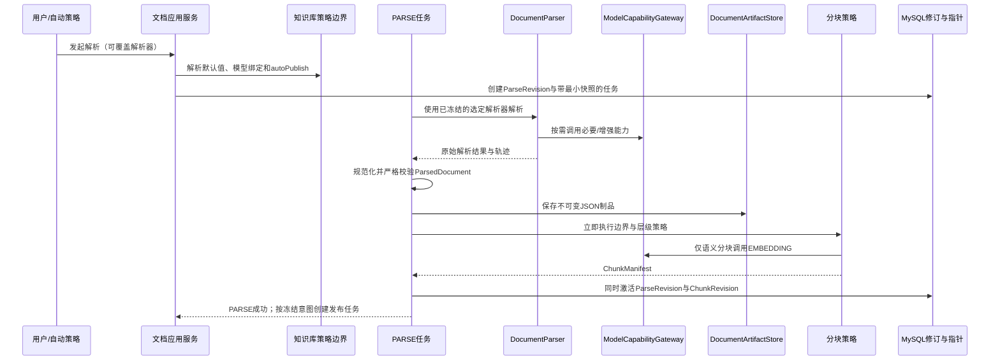
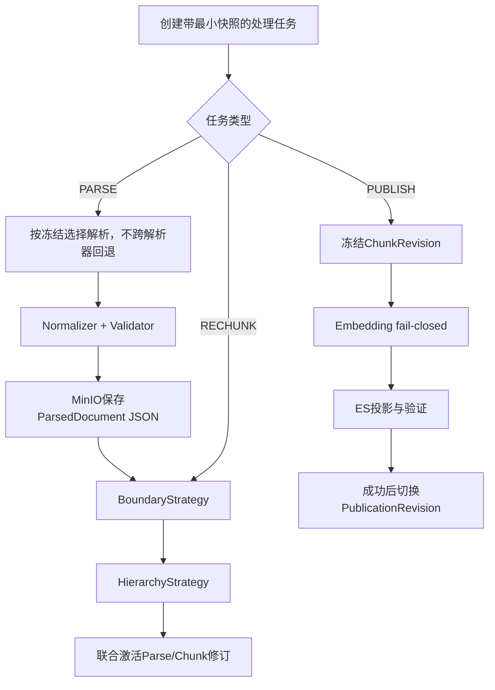

# 文档域技术文档

> 文档层级：领域级  
> 领域名称：文档域  
> 领域标识：`document`  
> 文档状态：已评审  
> 更新日期：2026-08-14

## 1. 技术职责边界

- 接入层：提供源文件上传/更新/下载、解析与重分块触发、预览、发布及任务状态查询入口。
- 应用编排层：创建带幂等键和最小快照的 PARSE、RECHUNK、PUBLISH 任务，编排异步状态、重试、联合激活和自动发布。
- 领域/策略层：解析器选择、内置解析工作流、规范化/校验、分块边界与层级策略、发布修订及活动指针规则。
- 基础设施层：MinIO 内容制品、MinerU Remote、OpenAI-compatible 模型网关、MySQL 仓储、Elasticsearch 投影和 Outbox 投递。
- 外部协作：知识库域提供有效策略/模型用途绑定；用户域提供安全连接和模型档案；检索域消费成功投影。
- 不属于本领域的技术职责：文件夹 API/树/路径、通用模型资源管理、通用调度器/分布式锁/存储 SDK、检索排序和问答。当前实现类和框架不等于目标公共抽象。

## 2. 场景技术落地

| 场景编号 | 业务能力 | 适用适配对象 | 入口/API/消息/任务 | 应用编排 | 领域对象/方法 | 数据访问 | 外部协作 | 事务边界 | 异常路径 | 验证方式 | 状态 |
| --- | --- | --- | --- | --- | --- | --- | --- | --- | --- | --- | --- |
| BS-DOC-001 | 当前文件管理 | 全部 | 文档上传/更新/下载 API | DocumentApplicationService（参考） | SourceDocument | SourceDocumentRepository | ArtifactStore、KB/授权边界 | 元数据事务与制品写入需补偿 | 校验失败不留半成品 | 集成/权限/制品校验 | 目标已验证 |
| BS-DOC-002 | 解析编排 | 全部 | Parse API/PARSE task | ParseApplicationService（参考） | ParseRevision、ProcessingTask | Parse/Task Repo | KB Policy、User Connection | 创建修订与任务同事务/Outbox | 资源预检失败明确终止 | 契约/幂等/快照测试 | 目标已验证 |
| BS-DOC-003 | 文档解析 | Built-in | PARSE task | BuiltInParseWorkflow | DocumentParser、Normalizer、Validator | Parse Repo | ModelCapabilityGateway | 制品先写、成功后联合激活 | 必要能力失败；增强能力警告 | 单元/模型契约/样本文档 | 目标已验证 |
| BS-DOC-004 | 文档解析 | MinerU | PARSE task | MinerUParser | DocumentParser、Normalizer、Validator | Parse Repo | MinerU Remote/User Connection | 同上 | 连接/鉴权/远端错误失败 | 契约/错误映射/幂等 | 目标已验证 |
| BS-DOC-005 | 首次分块 | 全部策略 | PARSE task 内部步骤 | ParseTaskOrchestrator | ChunkBoundaryStrategy、ChunkHierarchyStrategy | Chunk Repo | ModelCapabilityGateway | 与 ParseRevision 联合激活 | 分块失败则整个 PARSE 失败 | 原子切换/重试测试 | 目标已验证 |
| BS-DOC-006 | 重新分块 | 全部策略 | RECHUNK task | RechunkApplicationService | ChunkRevision | Chunk Repo | 可选 Embedding | 新修订独立提交 | 失败保留旧活动分块 | 策略/指针测试 | 目标已验证 |
| BS-DOC-007 | 发布 | 全部 | Publication API/PUBLISH task/Outbox | PublicationApplicationService（参考） | PublicationRevision | Publication/Outbox Repo | ModelGateway、ES Port | 本地事实事务+最终一致投影 | Embedding/投影失败不切指针 | Saga/Outbox/维度测试 | 目标已验证 |
| BS-DOC-008 | 任务治理 | 全部 | Scheduler/worker/task query | TaskOrchestrator | ProcessingTask | Task Repo | 通用调度支撑 | 尝试次数状态更新 | 超限终止并保留错误 | 幂等/故障注入 | 目标已验证 |

## 3. 核心调用时序

图示状态：已补全目标时序。最小快照的确切字段与存储结构在实现设计时确定。

## 4. 业务适配技术落地矩阵

| 业务能力 | 适配对象 | 入口/契约 | 应用编排 | 策略/流程/扩展点 | Adapter/Gateway/Remote | DTO/参数转换 | 状态映射 | 幂等/重试 | 适配说明 | 不得修改的公共抽象 | 状态 |
| --- | --- | --- | --- | --- | --- | --- | --- | --- | --- | --- | --- |
| 文档解析 | Built-in | DocumentParser | BuiltInParseWorkflow | 文件分类、基础提取、能力决策、规范化 | ModelCapabilityGateway | 内部结果→ParsedDocument | 必要失败/增强警告 | 同快照复用未激活中间物 | `adaptations/builtin-parser-内置解析器业务适配说明.md` | DocumentParser、JSON Schema | 已验证 |
| 文档解析 | MinerU | DocumentParser | MinerUParser | 远端提交/取回/规范化 | MinerURemote | MinerU响应→ParsedDocument | 远端异常→FAILED | 同一解析器幂等重试 | `adaptations/mineru-parser-MinerU解析器业务适配说明.md` | DocumentParser、禁止回退 | 已验证 |
| 分块边界 | LENGTH | ChunkBoundaryStrategy | ChunkWorkflow | LengthBoundaryStrategy | 无 | 参数→边界 | 失败→任务失败 | 修订级幂等 | 无 | ChunkRevision/ChunkManifest | 已验证 |
| 分块边界 | STRUCTURE | ChunkBoundaryStrategy | ChunkWorkflow | StructureBoundaryStrategy | 无 | ParsedDocument结构→边界 | 失败→任务失败 | 修订级幂等 | 无 | ChunkRevision/ChunkManifest | 已验证 |
| 分块边界 | SEMANTIC | ChunkBoundaryStrategy | ChunkWorkflow | SemanticBoundaryStrategy | ModelCapabilityGateway | 向量相似度→边界 | Embedding异常→失败 | 模型调用可重试 | `adaptations/semantic-chunking-语义分块业务适配说明.md` | 禁止静默切换策略 | 已验证 |
| 分块层级 | FLAT/PARENT_CHILD | ChunkHierarchyStrategy | ChunkWorkflow | Flat/ParentChildHierarchyStrategy | 无 | 边界块→层级块 | 失败→任务失败 | 修订级幂等 | 无 | 与边界策略正交 | 已验证 |

## 5. 公共抽象

| 公共抽象 | 作用 | 实现方 | 代码位置 | 是否标准 |
| --- | --- | --- | --- | --- |
| DocumentParser | 统一解析请求和原始解析结果，不暴露厂商协议 | Built-in、MinerU | 目标；现有 `common/dto/DocumentParserPort.java` 可参考 | 是 |
| ParsedDocumentNormalizer | 将各解析器结果归一到规范 JSON | Built-in normalizer、MinerU normalizer | 目标新增 | 是 |
| ParsedDocumentValidator | 对规范 Schema、来源锚点和必要字段做严格校验 | 系统校验器 | 目标新增 | 是 |
| ChunkBoundaryStrategy | 决定 LENGTH/STRUCTURE/SEMANTIC 边界 | 三种边界策略 | 目标；现有 `DocumentChunkerPort` 不足以表达两维 | 是 |
| ChunkHierarchyStrategy | 生成 FLAT/PARENT_CHILD 层级 | 两种层级策略 | 目标新增 | 是 |
| ModelCapabilityGateway | 按 LLM/EMBEDDING/RERANK/ASR/VLM/OCR 能力调用模型 | OpenAI-compatible 协议实现 | 目标；现有 `LangChain4jModelClientFactory` 仅覆盖部分能力 | 是 |
| DocumentArtifactStore | 保存/读取源文件、ParsedDocument、ChunkManifest 等不可变制品 | MinIO 实现 | `common/dto/DocumentArtifactStore.java`（参考） | 是 |
| PublicationProjectionPort | 写入并验证可重建检索投影 | Elasticsearch 实现 | `common/dto/PublicationProjectionPort.java`（参考） | 是 |

## 6. 代表性实现

> 下列代码只证明当前实现形态和差距，不是目标标准。

| 适配对象 | 代码位置 | 适用场景 | 特有流程 | 特有风险 |
| --- | --- | --- | --- | --- |
| 当前内置解析 | `infrastructure/parsing/Fons4AiDocumentParserAdapter.java` | 当前解析 | 使用当前解析组件生成 ParseManifest | 当前段落拆分、SourceAnchor.NONE 和默认回退不得提升为标准 |
| 当前分块 | `infrastructure/parsing/LangChain4jChunkerAdapter.java` | 当前分块 | 单一分块适配 | 未完整表达边界+层级两维 |
| 当前模型客户端 | `infrastructure/client/user/LangChain4jModelClientFactory.java` | LLM/Embedding | OpenAI-compatible 客户端创建 | 能力覆盖不完整，不能限制未来 OCR/ASR/VLM/RERANK |
| 当前发布执行器 | `infrastructure/task/PublicationTaskExecutor.java` | 发布 | 向量生成与 ES 投影 | 当前 BM25-only 路径与目标 fail-closed 冲突 |
| 当前 ES 投影 | `infrastructure/elasticsearch/ElasticsearchPublicationProjection.java` | 发布投影 | 写入 ES | Analyzer、索引形态和维度仍需技术验证 |

## 7. 技术流程图

图示状态：已根据目标模型补全。

## 8. 接口与集成契约

| 接口/集成点 | 类型 | 调用方 | 提供方 | 业务目的 | 请求关键字段 | 响应关键字段 | 鉴权/权限 | 幂等/一致性 | 异常处理 | 代码位置 | 状态 |
| --- | --- | --- | --- | --- | --- | --- | --- | --- | --- | --- | --- |
| 文档上传/更新 | HTTP | UI/调用方 | 文档域 | 保存当前源文件 | knowledgeBaseId、file、opaqueContainerRef? | documentId、currentFile | Workspace权限 | checksum/idempotencyKey；制品补偿 | 不支持类型/存储失败 | `controller/DocumentController.java`（参考） | 目标已验证 |
| 解析触发 | HTTP+Task | UI/自动策略 | 文档域 | 创建 PARSE 任务 | documentId、parserOverride?、operationOverride? | taskId、parseRevisionId | 文档写权限 | 任务创建时冻结策略 | 预检失败明确返回 | `controller/DocumentParseController.java`（参考） | 目标已验证 |
| MinerUConnection | 内部边界/HTTP | 文档域 | 用户域/MinerU | 获取安全连接并解析 | connectionRef、artifactRef | 外部结果/错误 | 不复制 API Key | 外部请求幂等标识 | 不得切 Built-in | 目标新增 | 已验证 |
| ModelCapabilityGateway | 内部协议 | 解析/分块/发布 | 用户域模型资源/兼容端点 | 按能力调用模型 | capability、profileRef、input、schema? | output、usage、trace | 凭证只在安全边界解密 | 超时重试且不改变快照 | 严格 Schema 校验 | 目标新增 | 已验证 |
| 发布投影 | 内部端口 | 发布任务 | Elasticsearch adapter | 写入可重建索引 | publicationRevisionId、chunks | projectionRef、validation | 服务鉴权 | Outbox/Saga 幂等 | 失败不切活动指针 | `common/dto/PublicationProjectionPort.java` | 已验证 |

## 9. 测试与验证

| 场景编号 | 适用适配对象 | 验证方式 | 覆盖重点 | 状态 |
| --- | --- | --- | --- | --- |
| BS-DOC-001 | 全部 | 集成/权限/制品测试 | 支持格式共同能力、当前文件、无 DocumentVersion | 待实现 |
| BS-DOC-003 | Built-in | 单元+样本+模型契约 | 文件分类、必要/增强能力、JSON Schema、警告 | 待实现 |
| BS-DOC-004 | MinerU | 契约+故障注入 | API Key、响应映射、超时、无回退 | 待实现 |
| BS-DOC-005/006 | 全部分块策略 | 参数化单元+属性测试 | 两个正交维度、表格、联合激活、复用解析修订 | 待实现 |
| BS-DOC-007 | 发布 | 集成+Saga/Outbox+故障注入 | Embedding fail-closed、维度、旧发布保留、幂等 | 待实现 |
| BS-DOC-008 | 全部 | 并发/重试测试 | 幂等键、RETRY_WAIT、尝试上限、可观察错误 | 待实现 |

## 10. 待确认事项

| 编号 | 类型 | 问题 | 影响 | 建议处理 |
| --- | --- | --- | --- | --- |
| TQ-DOC-001 | 解析能力 | 双解析器共同文件能力如何发现、缓存与对外展示 | 上传校验与兼容性 | 锁定版本后做 TV-02 验证 |
| TQ-DOC-002 | ParsedDocument | JSON Schema、Schema 演进和锚点精度 | 规范化、预览、分块 | 技术设计时定义 v1 契约 |
| TQ-DOC-003 | 快照 | 最小解析快照的字段与关系型/JSON 保存方式 | 重试一致性 | 开发前保持简约设计 |
| TQ-DOC-004 | 模型协议 | 各能力在 OpenAI-compatible 公共子集中的请求/响应映射 | OCR/ASR/VLM/结构化输出 | 用官方契约测试，不为厂商逐个写 Adapter |
| TQ-DOC-005 | 分块参数 | 长度、重叠、语义阈值、Parent/Child 限制 | 检索质量与成本 | 评测后校准，不在领域模型锁死 |
| TQ-DOC-006 | ES | Analyzer、索引拓扑、向量维度与相似度 | 发布投影 | TV-01 验证后确定 |

