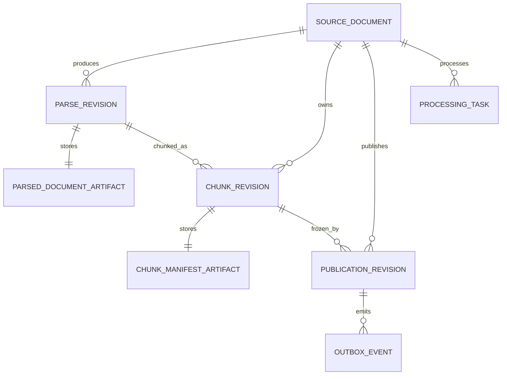
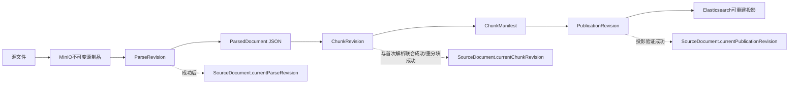

# 文档域数据文档

> 文档层级：领域级  
> 领域名称：文档域  
> 领域标识：`document`  
> 文档状态：已评审  
> 更新日期：2026-08-14

## 1. 数据职责边界

- 本领域拥有的数据：SourceDocument、ParseRevision、ChunkRevision、PublicationRevision、文档 ProcessingTask、OutboxEvent，以及它们引用的源文件和不可变内容制品。
- 外部引用数据：knowledgeBaseId、Workspace 授权上下文、Parser/Chunk 默认策略、ModelBinding/Profile 引用、MinerUConnection 引用；凭证不得复制。
- 不归属本领域的数据：文件夹实体/树/路径、WorkspaceMember、ModelConnection/Profile、OKF Bundle、QueryTrace、Elasticsearch 作为检索投影的物理所有权细节。
- 数据一致性边界：MySQL 是业务事实源，MinIO 存不可变内容，Elasticsearch 是可重建投影；活动指针只在对应步骤完整成功后切换。

## 2. 业务对象生命周期

| 业务对象 | 产生场景 | 关键状态/字段语义 | 更新场景 | 消费场景 | 终态/归档 | 状态 |
| --- | --- | --- | --- | --- | --- | --- |
| SourceDocument | BS-DOC-001 | 稳定 documentId、当前文件元数据/制品引用、三个独立状态/指针 | 更新当前文件、处理成功切指针 | 列表/详情/解析/下载 | 删除与保留待治理 | 已验证 |
| ParseRevision | BS-DOC-002 | parserType、最小非秘密快照、artifactRef、warnings、status | 任务状态与成功联合激活 | 预览、分块、追踪 | 不可变成功事实 | 已验证；字段待设计 |
| ParsedDocument | BS-DOC-003/004 | schemaVersion、结构块、SourceAnchor、trace、warning | 生成后不修改 | 预览、分块、导出 | MinIO 不可变制品 | 已验证；Schema 待设计 |
| ChunkRevision | BS-DOC-005/006 | parseRevisionId、boundary、hierarchy、manifestRef | 生成后不修改；成功切活动指针 | 预览、发布 | 不可变成功事实 | 已验证 |
| ChunkManifest | BS-DOC-005/006 | chunkId、text/content、anchor、parentId/role、skipEmbedding? | 生成后不修改 | 发布、预览 | MinIO 不可变制品 | 已验证；字段待设计 |
| PublicationRevision | BS-DOC-007 | chunkRevisionId、embeddingProfileRef/维度、projectionRef、status | 发布/重试；成功切活动指针 | 检索、引用追踪 | 不可变发布历史 | 已验证 |
| ProcessingTask | BS-DOC-002/006/007/008 | taskType、snapshotRef、idempotencyKey、attempt、error | 执行、重试、完成 | UI、运维、调度 | SUCCEEDED/FAILED | 已验证 |
| OutboxEvent | BS-DOC-007/008 | eventType、aggregateId、payload、status | 投递与重试 | 投影执行器 | 已投递/终止失败 | 已验证 |

## 3. 数据关系 ER 图

图示状态：目标逻辑关系已确认；具体表、外键和快照字段尚未设计。不存在 DocumentVersion，也不包含 Folder 实体。

## 4. 业务适配数据差异

| 业务能力 | 适配对象 | 主数据对象 | 适配特有数据 | 状态/字段映射差异 | 外部标识/流水 | 一致性风险 | 适配说明 | 状态 |
| --- | --- | --- | --- | --- | --- | --- | --- | --- |
| 文档解析 | Built-in | ParseRevision/ParsedDocument | 内部步骤轨迹、能力使用与警告 | 必要失败；增强能力可降级成功 | 模型调用 trace | LLM 输出需 Schema 校验 | `adaptations/builtin-parser-内置解析器业务适配说明.md` | 已验证 |
| 文档解析 | MinerU | ParseRevision/ParsedDocument | MinerU 连接引用、外部任务/响应摘要 | 远端状态映射到任务状态 | MinerU request/job id | 凭证泄漏、回调/轮询重复 | `adaptations/mineru-parser-MinerU解析器业务适配说明.md` | 已验证 |
| 分块边界 | SEMANTIC | ChunkRevision/Manifest | embedding profile 引用、语义参数快照 | Embedding异常即失败 | 模型调用 trace | 模型或维度漂移 | `adaptations/semantic-chunking-语义分块业务适配说明.md` | 已验证 |
| 分块边界 | LENGTH/STRUCTURE | ChunkRevision/Manifest | 长度参数或结构规则快照 | 无模型状态 | 无 | 表格/结构锚点丢失 | 无 | 已验证 |
| 分块层级 | PARENT_CHILD | ChunkManifest | parentId、role | Parent/Child 两类节点 | 无 | 父子关系断裂 | 无 | 已验证 |

## 5. 数据流转

图示状态：已补全目标数据流；三个当前指针的物理保存位置可在技术设计中调整，但语义不可合并。

## 6. SQL/DDL 参考

| 数据库/服务 | 业务模型 | 参考来源 | 数据表 | 处理状态 |
| --- | --- | --- | --- | --- |
| MySQL | SourceDocument | `fons4ai-rag2okf-service/sql/init-schema.sql`、当前 Mapper | `kb_source_document` | 仅现状参考；目标无 DocumentVersion |
| MySQL | ParseRevision | 同上 | `kb_parse_revision` | 仅现状参考；目标快照待简化设计 |
| MySQL | ChunkRevision | 同上 | `kb_chunk_revision` | 仅现状参考；目标两维策略待设计 |
| MySQL | PublicationRevision | 同上 | `kb_publication_revision` | 仅现状参考；Embedding 失败规则需改造 |
| MySQL | ProcessingTask/Outbox | 同上 | 当前 task/outbox 表 | 仅现状参考 |
| MinIO | 源文件/Manifest | `DocumentArtifactStore` 与当前实现 | 对象键 | 目标保留不可变内容语义 |
| Elasticsearch | Chunk 投影 | `ElasticsearchPublicationProjection` | 当前索引 | 可重建投影；物理结构待验证 |

## 7. 数据质量与治理

| 治理项 | 规则 | 适用对象 | 状态 |
| --- | --- | --- | --- |
| 状态一致性 | 上传、解析、发布状态分离；PARSE 与首次 Chunk 联合激活；Publication 投影成功后再激活 | SourceDocument/各Revision | 已验证 |
| 幂等数据 | 相同任务幂等键与冻结快照不得重复创建活动修订或重复切指针 | ProcessingTask/Revision | 已验证 |
| 外部流水 | MinerU 请求与 ES 投影须能关联本地 task/revision | ParseRevision/PublicationRevision | 已验证；字段待设计 |
| 字段映射 | 任何解析器结果必须经 Normalizer 与 Validator 生成同一 ParsedDocument Schema | ParsedDocument | 已验证 |
| 来源锚点 | 解析块与 Chunk 必须尽可能保留页、段、时间或媒体区域锚点；`NONE` 不能作为目标默认 | ParsedDocument/ChunkManifest | 已验证 |
| 内容不可变 | 成功保存的源制品、ParsedDocument 和 ChunkManifest 不原地修改 | MinIO 制品 | 已验证 |
| 活动指针 | 更新源文件、重新解析/分块不立即使旧活动发布失效 | SourceDocument | 已验证 |

## 8. 数据安全与合规

| 治理项 | 规则 | 适用对象 | 状态 |
| --- | --- | --- | --- |
| 敏感数据识别 | 源文件、解析文本、音频转写和图片 OCR 可能含企业敏感/个人数据 | 全部内容制品 | 已验证 |
| 传输安全 | 上传、MinerU、模型和 ES 链路使用受控安全传输；具体协议由部署验证 | 外部链路 | 待技术验证 |
| 存储加密 | MinIO/MySQL/ES 的静态加密按平台安全基线；API Key 由用户域加密持有 | 制品与凭证 | 凭证边界已验证；平台配置待验证 |
| 展示/日志脱敏 | 日志不得记录源内容全文、API Key 或模型连接秘密；错误只保留安全摘要与 traceId | 日志/任务错误 | 已验证 |
| 数据权限 | 通过知识库所属 Workspace 权限访问文档及制品 | 所有入口 | 已验证 |
| 审计与追踪 | 记录操作者、任务、解析器、非秘密快照、模型/外部 trace 与修订链 | 处理与发布 | 已验证 |
| 保留期限/删除/归档 | 尚未确认，不得根据当前实现推断级联删除或永久保留 | 全部对象与投影 | 待确认 |

## 9. 待确认事项

| 编号 | 类型 | 问题 | 影响 | 建议处理 |
| --- | --- | --- | --- | --- |
| DQ-DOC-001 | ParsedDocument | v1 JSON Schema、锚点结构、表格/图片/音频表示及演进规则 | 跨解析器兼容、分块与预览 | 技术设计时单独确认 |
| DQ-DOC-002 | 快照 | parser/profile、有效策略与模型引用的最小快照字段和存储形态 | 重试确定性与表结构 | 开发前简约设计，不复制秘密 |
| DQ-DOC-003 | 删除治理 | 各修订、MinIO 制品、ES 投影及历史引用的保留/回收顺序 | 合规、成本、可追溯性 | 独立高风险需求 |

