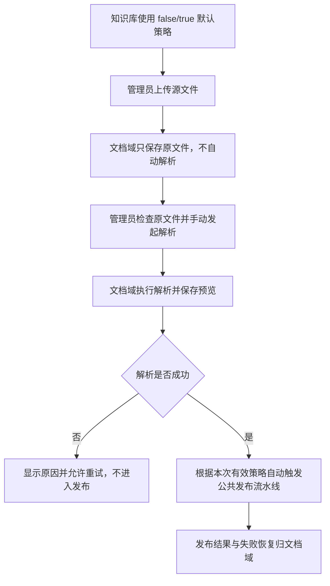
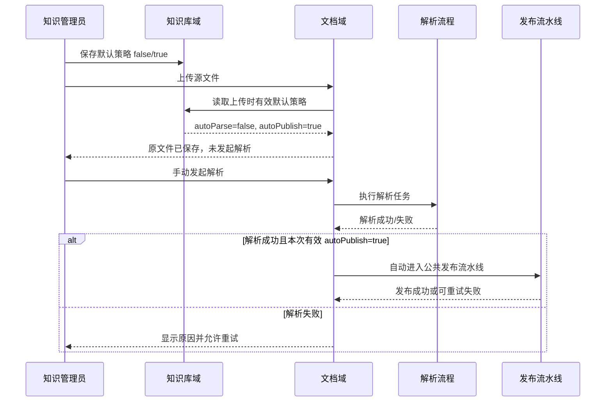
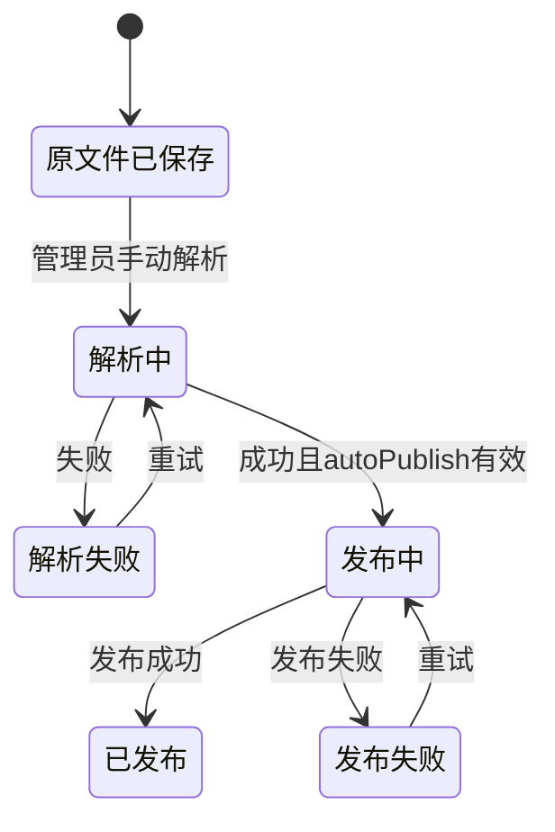

# 手动解析后自动发布-手动解析后自动发布业务适配说明

> 文档层级：业务适配详解  
> 所属领域：知识库域（`knowledge-base`）  
> 适配编号：BA-KB-002  
> 适配对象：`autoParse=false`、`autoPublish=true` 默认处理模式  
> 文档状态：已评审  
> 更新日期：2026-08-14

## 1. 适配对象与适用范围

- 适配对象：上传时不自动解析，但以后一次手动解析成功后自动进入发布流水线的默认处理模式。
- 适用业务能力：BS-KB-005 默认处理策略。
- 适用产品/渠道/租户/配置：任何允许管理员先检查原文件、再决定何时解析，同时希望解析成功后自动发布的知识库。
- 入口场景：知识库保存 `autoParse=false`、`autoPublish=true`；上传保存原文件；管理员后续手动发起解析。
- 不适用范围：解析、分块、Embedding、ES写入和发布指针切换的执行细节，这些属于文档域。
- 可信度说明：四组合来自正式产品文档并经2026-08-14用户确认；当前实体和UI拒绝该组合，因此这是已确认目标适配，不是当前已完成实现。

## 2. 业务流程

图示状态：公共业务步骤来自产品文档和用户确认；有效策略快照时点仍待确认。

## 3. 适配时序图

图示状态：已根据产品流程补全；“本次有效策略”取上传时还是解析发起时快照待确认。

| 顺序 | 适配步骤 | 公共/特有 | 触发条件 | 协作对象 | 状态/数据影响 | 证据 |
| --- | --- | --- | --- | --- | --- | --- |
| 1 | 保存原文件 | 公共 | 上传 | 文档域 | 文件可查看/下载，解析未开始 | 产品设计02 |
| 2 | 不自动创建解析任务 | 特有 | autoParse=false | 文档域 | 维持未解析 | 产品设计02+用户确认 |
| 3 | 手动发起解析 | 特有 | 管理员明确操作 | 文档域解析流程 | 进入解析状态机 | 产品设计02 |
| 4 | 解析成功后自动触发发布 | 特有 | 有效autoPublish=true | 文档域发布流水线 | 进入发布状态机 | 产品设计02+用户确认 |
| 5 | 失败不静默推进 | 公共 | 解析或发布失败 | 文档域 | 保留失败原因并允许重试 | 项目业务规则 |

## 4. 关键业务规则

| 规则编号 | 规则内容 | 触发条件 | 处理结果 | 与公共流程差异 | 状态 |
| --- | --- | --- | --- | --- | --- |
| BAR-KB-POLICY-001 | autoParse与autoPublish独立，false/true是有效组合 | 保存知识库策略 | 接受并保存该组合 | 当前实现错误拒绝 | 用户已确认 |
| BAR-KB-POLICY-002 | 上传时不自动解析 | 上传 | 仅保存原文件 | 不执行自动解析分支 | 已确认 |
| BAR-KB-POLICY-003 | 手动解析成功后自动进入公共发布流水线 | 手动解析成功 | 自动触发发布 | 相对false/false增加自动发布 | 已确认 |
| BAR-KB-POLICY-004 | 解析失败不得触发发布 | 解析失败 | 显示原因并允许重试 | 无 | 已确认 |
| BAR-KB-POLICY-005 | 设置修改不自动重处理已有文档 | 修改知识库设置 | 只影响后续明确操作 | 快照时点待确认 | 已确认 |

## 5. 状态流转

| 当前状态 | 触发动作 | 前置条件 | 目标状态 | 失败/挂起处理 | 状态 |
| --- | --- | --- | --- | --- | --- |
| 原文件已保存 | 手动解析 | 文件可用且有权限 | 解析中 | 拒绝则不改变状态 | 文档域标准 |
| 解析中 | 解析成功 | 有效autoPublish=true | 发布中 | 失败则解析失败，不发布 | 用户确认 |
| 发布中 | 发布完成 | 校验通过 | 已发布 | 失败可重试且不替换旧活动版本 | 文档域标准 |

## 6. 接口、配置与数据差异

| 类型 | 差异项 | 说明 | 证据 |
| --- | --- | --- | --- |
| 接口/协议 | 手动解析入口 | 上传不创建解析任务，后续由管理员发起 | 产品设计02 |
| 配置 | autoParse=false/autoPublish=true | 正式有效组合 | 用户确认 |
| 数据字段 | 有效策略快照 | 需要能证明解析成功时为何自动发布，保存位置待确认 | 待确认 |
| 错误码/结果码 | 当前KnowledgeBaseException/UI禁用 | 属实现偏差，不是正式规则 | KbKnowledgeBase.java/两个Vue视图 |

## 7. 异常、重试与补偿

| 场景 | 处理方式 | 是否重试 | 是否影响状态 | 证据状态 |
| --- | --- | --- | --- | --- |
| 当前系统保存false/true失败 | 明确报告实现偏差；本次建模不改代码 | 否 | 不写入策略 | 源码事实 |
| 解析失败 | 不触发发布，展示原因 | 是，手动重试 | 进入解析失败 | 已确认 |
| 发布失败 | 使用文档域公共可重试流程，不替换旧活动版本 | 是 | 进入发布失败 | 项目标准 |
| 策略在上传后被修改 | 不得静默回写历史；使用哪个快照待确认 | 待确认 | 可能影响是否发布 | 待确认 |

## 8. 技术落地索引

- 入口/API/任务：知识库创建/编辑接口；文档域手动解析入口
- 应用服务：当前 `KnowledgeBaseApplicationService`；文档域 `ParseApplicationService`/发布编排
- 领域对象/策略/流程：目标 DefaultProcessingPolicy/EffectiveProcessingPolicy
- Gateway/Remote/Adapter：WorkspaceAccessBoundary；文档域内部端口
- Mapper/Repository：当前 KbKnowledgeBaseDomainService/MyBatis
- 测试：需增加四组合领域测试和手动解析后自动发布集成测试

## 9. 源码证据

| 结论 | 证据路径 | 证据类型 | 状态 |
| --- | --- | --- | --- |
| 产品定义四种组合 | `docs/product-design/02-业务流程与状态模型.md` | 正式文档 | 已验证 |
| 用户确认false/true有效 | 2026-08-14 Q3按推荐 | 用户确认 | 已验证 |
| 当前实体拒绝false/true | `.../domain/entity/KbKnowledgeBase.java` | 源码 | 实现偏差 |
| 当前UI禁用autoPublish | `.../KnowledgeBaseSettingsView.vue`、`KnowledgeBaseListView.vue` | 源码 | 实现偏差 |

## 10. 待确认事项

| 编号 | 问题 | 影响 | 建议处理 |
| --- | --- | --- | --- |
| BAQ-KB-POLICY-001 | 手动解析读取上传时、解析发起时还是显式传入的autoPublish策略 | 可追溯与重试一致性 | 文档域建模/变更时确认 |
| BAQ-KB-POLICY-002 | 当前实现偏差按BUG还是已有功能变更处理 | 后续实施流程 | 需要修复时由对应Fons4AI技能判级 |

