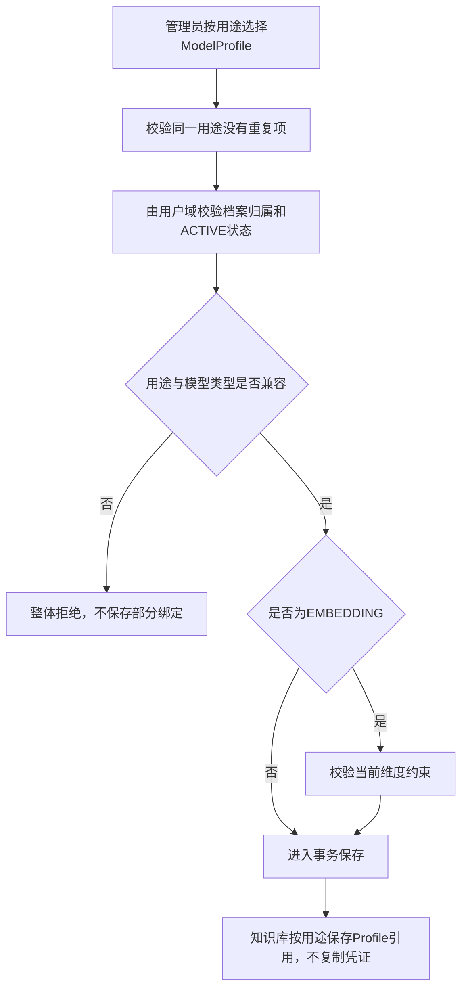
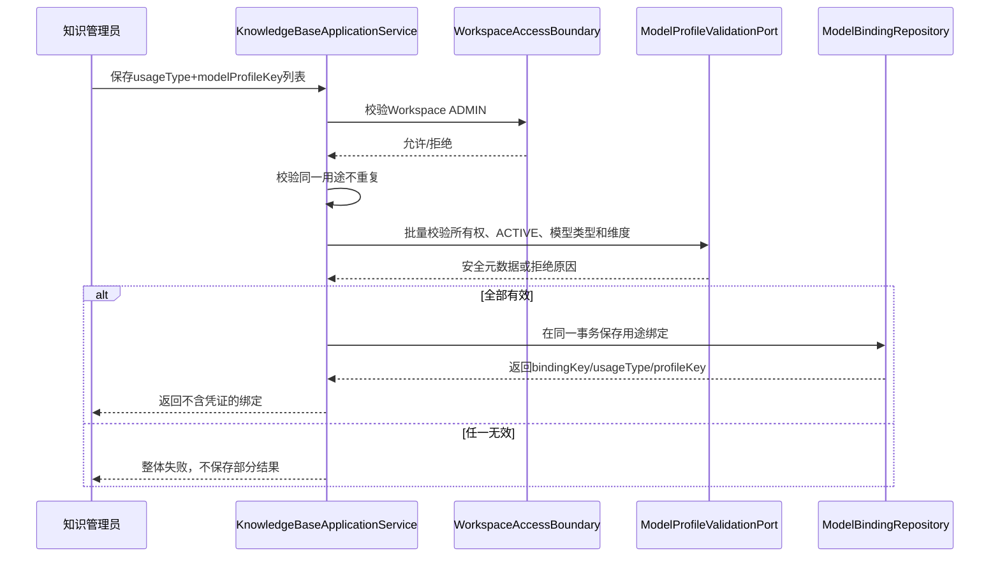
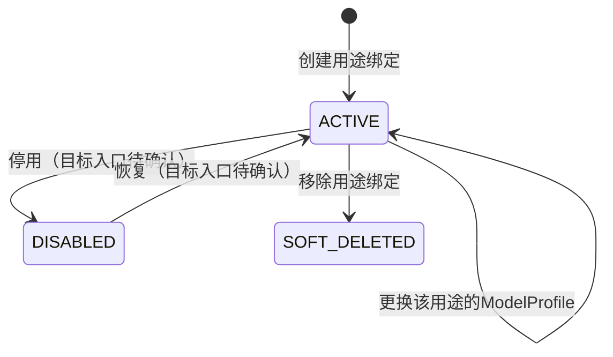

# 按用途绑定模型档案-按用途绑定模型档案业务适配说明

> 文档层级：业务适配详解  
> 所属领域：知识库域（`knowledge-base`）  
> 适配编号：BA-KB-005、BA-KB-006  
> 适配对象：ANSWER_GENERATION与EMBEDDING模型用途绑定  
> 文档状态：已评审  
> 更新日期：2026-08-14

## 1. 适配对象与适用范围

- 适配对象：知识库按业务用途引用用户域ModelProfile的绑定关系。
- 适用业务能力：BS-KB-006。
- 适用产品/渠道/租户/配置：当前个人Workspace下的ANSWER_GENERATION和EMBEDDING用途。
- 入口场景：创建知识库时保存初始绑定、编辑知识库时整体保存、独立查询/保存模型绑定、下游按用途解析模型能力。
- 不适用范围：ModelConnection、API Key、模型档案CRUD和具体Provider协议，这些属于用户域。
- 可信度说明：公共骨架经用户确认且有SDD、源码和SQL证据；“绑定先删后插”和个人Workspace所有者校验是P0代表性实现，不是永久标准。

## 2. 业务流程

图示状态：已根据当前实现和用户确认补全。

## 3. 适配时序图

图示状态：当前代码直接查询ModelProfile DomainService；图中的验证端口是目标公共抽象。

| 顺序 | 适配步骤 | 公共/特有 | 触发条件 | 协作对象 | 状态/数据影响 | 证据 |
| --- | --- | --- | --- | --- | --- | --- |
| 1 | 校验Workspace管理权限 | 公共 | 保存绑定 | 用户域 | 无权则不改数据 | 源码+用户确认 |
| 2 | 校验同用途唯一 | 公共 | 请求含多项 | 知识库域 | 重复则整体拒绝 | 源码+SQL |
| 3 | 校验档案所有权和ACTIVE | 公共 | 每个绑定项 | 用户域 | 无效则整体拒绝 | SDD+源码 |
| 4 | 校验LLM类型 | ANSWER_GENERATION特有 | 回答生成用途 | 用户域能力元数据 | 类型不符拒绝 | 源码 |
| 5 | 校验Embedding类型与维度 | EMBEDDING特有 | 向量化用途 | 用户域能力元数据 | 类型/维度不符拒绝 | 源码 |
| 6 | 保存安全引用 | 公共 | 全部校验通过 | Binding Repository | 只保存profileId，不复制凭证 | SQL+用户确认 |

## 4. 关键业务规则

| 规则编号 | 规则内容 | 触发条件 | 处理结果 | 与公共流程差异 | 状态 |
| --- | --- | --- | --- | --- | --- |
| BAR-KB-BIND-001 | ModelBinding归知识库域，ModelProfile归用户域 | 全部绑定操作 | 只跨域引用档案 | 无 | 用户已确认 |
| BAR-KB-BIND-002 | 同一知识库同一用途最多一个有效绑定 | 保存 | 重复用途整体拒绝 | 无 | 已验证 |
| BAR-KB-BIND-003 | 档案必须满足Workspace可用所有权、ACTIVE和用途类型兼容 | 保存/调用 | 不满足则fail-closed | 个人Workspace所有者规则是当前适配 | 已验证 |
| BAR-KB-BIND-004 | EMBEDDING还需满足当前投影维度约束 | 保存EMBEDDING | 维度不符拒绝 | ANSWER_GENERATION无维度校验 | 当前实现 |
| BAR-KB-BIND-005 | Binding不得复制ModelConnection或API Key | 保存/响应 | 只持有profile引用和非敏感参数 | 无 | 用户已确认 |
| BAR-KB-BIND-006 | 当前两种用途不是封闭集合 | 扩展新用途 | 需正式启用类型/Adapter/兼容规则 | 当前枚举仅代表现状 | 用户已确认 |

## 5. 状态流转

| 当前状态 | 触发动作 | 前置条件 | 目标状态 | 失败/挂起处理 | 状态 |
| --- | --- | --- | --- | --- | --- |
| 无绑定 | 保存用途绑定 | 档案校验通过 | ACTIVE | 整体拒绝 | 已实现 |
| ACTIVE | 更换档案 | 新档案校验通过 | ACTIVE | 保留事务前结果 | 业务语义已实现；当前行会重建 |
| ACTIVE | 移除用途 | ADMIN整体保存不再包含该用途 | SOFT_DELETED | 事务失败回滚 | 当前代表实现 |

## 6. 接口、配置与数据差异

| 类型 | 差异项 | 说明 | 证据 |
| --- | --- | --- | --- |
| 接口/协议 | GET/PUT `/knowledge-bases/{key}/model-bindings` | 按用途查询/整体保存，不返回凭证 | Controller/SDD |
| 配置 | ANSWER_GENERATION -> LLM | 回答生成用途类型兼容 | ModelUsageType |
| 配置 | EMBEDDING -> EMBEDDING+dims | 向量化用途增加维度校验 | ModelUsageType/ApplicationService |
| 数据字段 | knowledgeBaseId+usageType唯一 | 数据库防止同用途重复 | init-schema.sql |
| 数据字段 | modelProfileId安全引用 | 不复制owner/baseUrl/API Key | KbModelBinding/SQL |
| 错误码/结果码 | 重复用途、档案无效、维度错配 | 任一失败时整体拒绝 | Rag2OkfResultCode/ApplicationService |

## 7. 异常、重试与补偿

| 场景 | 处理方式 | 是否重试 | 是否影响状态 | 证据状态 |
| --- | --- | --- | --- | --- |
| 请求内用途重复 | 事务前拒绝 | 修正后可重试 | 否 | 已验证 |
| 档案不存在/越权/停用/类型不兼容 | 事务前fail-closed | 修正后可重试 | 否 | 已验证 |
| EMBEDDING维度不匹配 | 拒绝保存 | 修正档案后可重试 | 否 | 已验证 |
| 持久化中途失败 | 本地事务回滚 | 是 | 不保留部分绑定 | 已实现 |
| 运行时绑定缺失 | 不允许回退到平台Key；是否允许BM25-only待确认 | 待确认 | 影响发布/检索 | 文档冲突 |

## 8. 技术落地索引

- 入口/API/任务：`controller/knowledgebase/KnowledgeBaseController.java`
- 应用服务：`application/knowledgebase/KnowledgeBaseApplicationService.java`
- 领域对象/策略/流程：`KbModelBinding`、`ModelUsageType`；目标ModelProfileValidationPort
- Gateway/Remote/Adapter：用户域ModelProfile校验/能力解析边界
- Mapper/Repository：当前KbModelBindingDomainService/MyBatis
- 测试：当前后端测试树未见知识库绑定测试；前端设置视图有绑定交互测试

## 9. 源码证据

| 结论 | 证据路径 | 证据类型 | 状态 |
| --- | --- | --- | --- |
| Binding按用途引用Profile | `domain/entity/KbModelBinding.java` | 源码 | 已验证 |
| 同用途数据库唯一 | `fons4ai-rag2okf-service/sql/init-schema.sql` | 数据库当前结构 | 已验证 |
| 应用服务校验所有权/状态/类型/维度 | `application/knowledgebase/KnowledgeBaseApplicationService.java` | 源码 | 已验证 |
| ModelBinding归知识库域 | 2026-08-14 Q1/Q2按推荐 | 用户确认 | 已验证 |
| 当前用途集合不是永久标准 | 2026-08-14 Q4/Q5按推荐 | 用户确认 | 已验证 |

## 10. 待确认事项

| 编号 | 问题 | 影响 | 建议处理 |
| --- | --- | --- | --- |
| BAQ-KB-BIND-001 | 企业协作Workspace使用所有者、成员自有还是共享模型档案 | 所有权和计费 | 企业协作需求中确认 |
| BAQ-KB-BIND-002 | Binding变更是否需要版本历史 | 调用追溯与审计 | 模型治理需求中确认 |
| BAQ-KB-BIND-003 | 缺失EMBEDDING绑定的统一行为 | 发布与检索可用性 | 文档/检索领域联合确认 |

