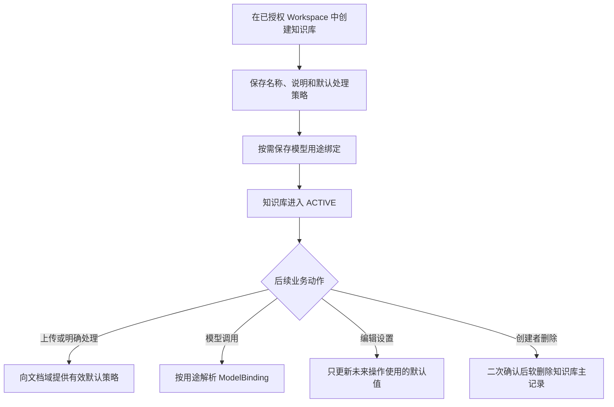
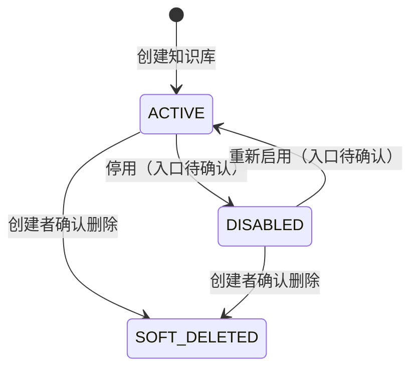

# 知识库域业务文档

> 文档层级：领域级  
> 领域名称：知识库域  
> 领域标识：`knowledge-base`  
> 文档状态：已评审  
> 更新日期：2026-08-14

## 1. 领域职责

- 领域目标：管理知识库自身生命周期、知识库级默认处理策略和按用途选择模型档案的绑定关系，为文档域、OKF 域和检索域提供稳定的知识空间上下文。
- 领域边界：拥有 `KnowledgeBase`、`DefaultProcessingPolicy` 和 `ModelBinding`；引用用户域提供的 Workspace 授权边界和 ModelProfile 能力边界。
- 不负责事项：不拥有 Workspace、成员、角色、ModelConnection 或 ModelProfile；不执行上传、解析、分块、发布、OKF 构建和检索；不定义 Parser/Chunk 的具体实现。
- 上游协作：知识管理员在已授权 Workspace 中创建、配置或删除知识库；知识用户查询有权访问的知识库。
- 下游协作：文档域读取知识库默认策略；文档域、OKF 域和检索域按用途解析模型绑定；各下游对象通过 knowledgeBaseKey/knowledgeBaseId 保持知识空间归属。
- 可信度说明：领域名称、slug、边界、核心能力、适配对象和标准判定均经 2026-08-14 用户五项逐问确认；当前实现提供代表性证据，但不等于领域标准。

## 2. 核心业务对象

| 对象 | 定义 | 生命周期 | 关键状态 | 状态 |
| --- | --- | --- | --- | --- |
| KnowledgeBase | 隶属于一个 Workspace、承载独立内容范围和默认策略的知识空间 | 创建、查询、编辑、停用候选、软删除 | ACTIVE / DISABLED / soft-deleted | ACTIVE 与软删除已实现；停用流程待确认 |
| DefaultProcessingPolicy | 新文档或明确操作使用的知识库级默认处理策略 | 创建时形成，设置修改时替换，操作执行时形成有效快照 | autoParse/autoPublish 四种组合 | 目标规则已由用户确认；一种组合存在实现偏差 |
| ModelBinding | 知识库在某一模型用途中引用的用户域 ModelProfile | 创建、按用途修改、停用/替换、随知识库治理 | ACTIVE / DISABLED | 当前 ANSWER_GENERATION/EMBEDDING 已实现 |

## 3. 核心业务场景

| 场景编号 | 业务能力 | 场景名称 | 触发条件 | 参与方 | 输出 | 状态 |
| --- | --- | --- | --- | --- | --- | --- |
| BS-KB-001 | 知识库生命周期 | 创建知识库 | ADMIN 在有效 Workspace 中提交名称和默认策略 | 知识管理员、用户域、知识库域 | ACTIVE KnowledgeBase，可选初始 ModelBinding | 已实现 |
| BS-KB-002 | 知识库生命周期 | 查询知识库列表与详情 | 用户拥有 Workspace 读取权限 | 知识用户、用户域、知识库域 | 授权范围内的摘要或详情 | 已实现 |
| BS-KB-003 | 知识库生命周期 | 编辑知识库与默认策略 | ADMIN 提交有效 revision | 知识管理员、用户域、知识库域 | 更新后的元数据、默认策略和可选绑定 | 已实现 |
| BS-KB-004 | 知识库生命周期 | 删除知识库 | 创建者通过二次确认发起删除 | 知识库创建者、知识库域 | 幂等软删除结果 | 主记录软删除已实现；跨资源治理待确认 |
| BS-KB-005 | 默认处理策略 | 为文档操作提供默认策略 | 上传或后续明确操作未完全指定本次策略 | 文档域、知识库域 | 本次操作的有效默认策略 | 公共规则已确认，快照细节部分待确认 |
| BS-KB-006 | 模型用途绑定 | 保存或查询模型绑定 | ADMIN 按用途选择可用 ModelProfile | 知识管理员、用户域、知识库域 | 同一用途至多一个有效绑定 | 已实现 |

## 4. 场景业务流程

图示状态：已根据正式文档、当前实现和用户确认补全；删除后的跨资源治理仍待确认。

## 5. 业务适配矩阵

| 业务能力 | 适配对象 | 适用场景 | 共性规则 | 差异规则 | 状态差异 | 数据差异 | 详解文档 | 是否可作为标准 | 状态 |
| --- | --- | --- | --- | --- | --- | --- | --- | --- | --- |
| 默认处理策略 | 四种自动化组合 | BS-KB-005 | 上传、解析、发布阶段解耦；本次显式选择优先 | 是否自动触发解析、解析成功后是否自动发布 | 文档域状态不同 | autoParse/autoPublish 组合 | `adaptations/manual-parse-auto-publish-手动解析后自动发布业务适配说明.md` | 单一组合否；四组合骨架是 | 用户已确认，部分实现偏差 |
| 模型用途绑定 | ANSWER_GENERATION / EMBEDDING | BS-KB-006 | 同用途唯一、所有权和状态校验、类型兼容 | 所需模型类型和维度规则不同 | Binding 当前均为 ACTIVE | usageType/modelProfileId/configJson | `adaptations/model-purpose-binding-按用途绑定模型档案业务适配说明.md` | 用途绑定骨架是；当前用途集合否 | 已实现+用户确认 |

## 6. 公共抽象与标准流程判定

| 类型 | 内容 | 证据 | 是否可作为标准 |
| --- | --- | --- | --- |
| 公共抽象 | KnowledgeBase 聚合：Workspace 归属、元数据、状态和默认策略 | SDD、源码、SQL、用户确认 | 是 |
| 公共抽象 | DefaultProcessingPolicy：autoParse/autoPublish 四种独立组合，引用 Parser Profile 并保存 Chunk Profile 快照 | 产品设计、用户确认 | 是 |
| 公共抽象 | ModelBinding：按用途引用 ModelProfile，同一用途最多一个有效绑定 | SDD、源码、SQL、用户确认 | 是 |
| 外部边界 | WorkspaceAccessBoundary：知识库域消费授权判定但不拥有成员与角色 | 用户域知识、用户确认 | 是 |
| 代表性业务适配 | 手动解析成功后自动发布 | 用户确认；当前实现不支持 | 否，为特定策略组合 |
| 代表性实现 | Java/MyBatis/Vue、软删除主记录、绑定先删后插 | 当前源码 | 否 |

## 7. 业务规则

| 规则编号 | 规则类型 | 规则内容 | 适用范围 | 例外/差异 | 状态 |
| --- | --- | --- | --- | --- | --- |
| BR-KB-001 | 共性规则 | Workspace、成员和角色归用户域；知识库域只保存归属引用并消费授权判定 | 全部知识库操作 | 无 | 用户已确认 |
| BR-KB-002 | 共性规则 | 同一 Workspace 内知识库名称不得重复 | 创建 | 当前仅应用层检查，数据库无唯一约束 | 当前实现事实，原子性待治理 |
| BR-KB-003 | 共性规则 | autoParse 与 autoPublish 独立表达解析和发布自动化，允许四种组合 | 默认处理策略 | 当前代码禁止 false/true，属于实现偏差 | 用户已确认 |
| BR-KB-004 | 共性规则 | 单次上传或明确操作可以覆盖默认选择；未显式指定时才使用知识库默认值 | 文档处理协作 | 有效快照字段和保存位置待确认 | 正式文档+用户确认 |
| BR-KB-005 | 共性规则 | 设置变化只影响未来上传或后续明确发起的操作，不自动重处理已有文档 | 设置修改 | 历史重处理必须显式发起 | 已确认 |
| BR-KB-006 | 共性规则 | ModelBinding 归知识库域；ModelProfile 归用户域，绑定不得复制凭证 | 模型用途绑定 | 无 | 用户已确认 |
| BR-KB-007 | 共性规则 | 同一知识库同一模型用途最多一个有效绑定，档案必须满足所有权、ACTIVE 和类型兼容 | 模型用途绑定 | EMBEDDING 还需满足当前维度约束 | 已实现+用户确认 |
| BR-KB-008 | 共性规则 | 只有知识库创建者可删除；删除前二次确认；重复删除幂等成功 | 删除 | 跨资源清理/保留规则待确认 | 正式需求+用户确认 |
| BR-KB-009 | 治理规则 | Parser/Chunk 的具体实现和参数不属于知识库域标准，知识库只持有 Profile 引用或配置快照 | 默认策略 | 无 | 用户已确认 |

## 8. 状态流转

图示状态：ACTIVE、DISABLED 枚举和软删除字段有源码/SQL 证据；停用与恢复的业务入口未实现，跨资源删除状态待确认。

## 9. 异常分支

| 场景 | 异常 | 处理方式 | 是否影响状态 | 状态 |
| --- | --- | --- | --- | --- |
| 创建知识库 | Workspace 不存在、无 ADMIN、名称重复、策略非法 | 拒绝创建，不留下半成数据 | 否 | 已实现 |
| 编辑知识库 | 无 ADMIN 或 revision 过期 | 拒绝更新；版本冲突返回明确结果 | 否 | 已实现 |
| 保存模型绑定 | 用途重复、档案越权/停用/类型不兼容、维度不符 | 整体拒绝，不保存部分绑定 | 否 | 已实现 |
| 删除知识库 | 非创建者删除 | 拒绝且不改变知识库 | 否 | 已实现 |
| 删除知识库 | 知识库已不存在或已软删除 | 幂等返回成功，避免泄露存在性 | 否 | 已实现 |
| 手动解析后自动发布 | 当前 UI/实体拒绝 false/true | 记录实现偏差，不把限制写成标准 | 否 | 待后续变更处理 |

## 10. 待确认事项

| 编号 | 类型 | 问题 | 影响 | 建议处理 |
| --- | --- | --- | --- | --- |
| BQ-KB-001 | 删除治理 | 软删除知识库后，文档、MinIO 内容、ES 投影、OKF、评测和历史引用如何清理、冻结或保留 | 数据安全、成本、可追溯性 | 独立高风险需求/数据治理设计 |
| BQ-KB-002 | 状态 | DISABLED 的业务含义、可执行动作和恢复条件尚未定义 | 状态机、权限、下游行为 | 后续生命周期变更时确认 |
| BQ-KB-003 | 规划能力 | Retrieval Profile 和 OKF 启用开关何时进入知识库核心配置 | 数据和接口扩展 | 对应领域需求启动时确认 |
| BQ-KB-004 | 策略快照 | 手动解析时 autoPublish 使用上传时快照、解析发起时快照还是显式操作参数 | 历史可追溯与行为一致性 | 文档域建模或变更需求中确认 |
| BQ-KB-005 | 模型缺失 | 缺少 EMBEDDING 绑定时发布应失败还是降级为 BM25-only | 发布标准与可检索能力 | 文档域/检索域建模时关闭冲突 |

