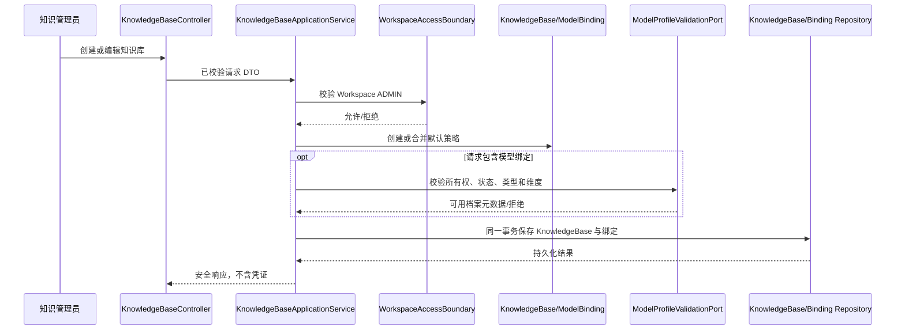
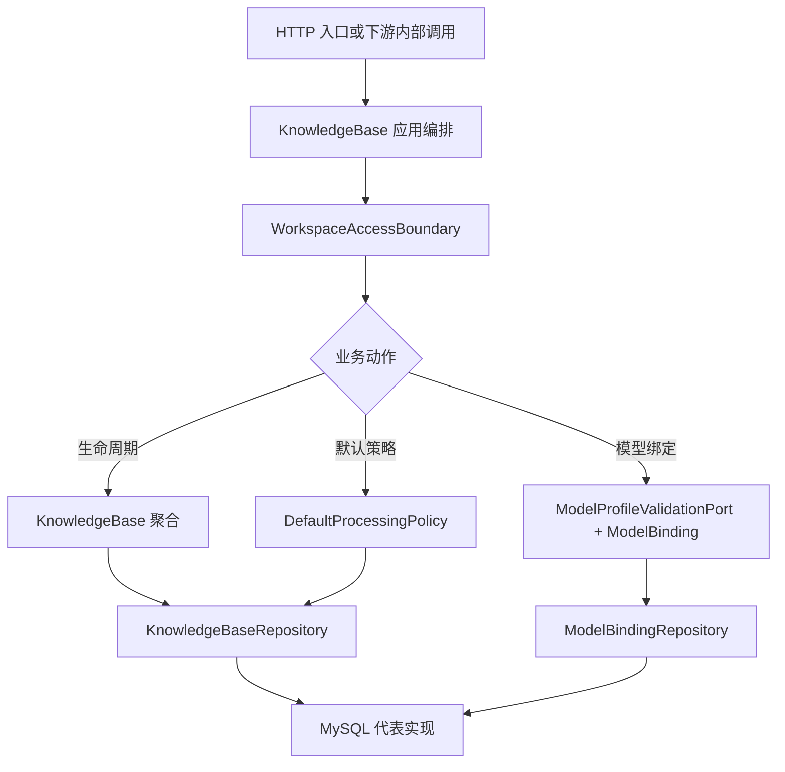

# 知识库域技术文档

> 文档层级：领域级  
> 领域名称：知识库域  
> 领域标识：`knowledge-base`  
> 文档状态：已评审  
> 更新日期：2026-08-14

## 1. 技术职责边界

- 接入层：提供知识库列表、创建、详情、编辑、删除和模型用途绑定 HTTP 契约；不直接执行业务规则。
- 应用编排层：编排当前用户、Workspace 授权、知识库持久化、乐观锁和模型档案校验；创建/编辑与绑定保存使用本地事务。
- 领域/策略层：承载 KnowledgeBase 创建/更新规则、DefaultProcessingPolicy 组合规则、ModelBinding 用途唯一和类型兼容规则。
- 基础设施层：MySQL/MyBatis-Plus 持久化是当前代表性实现；不属于领域标准。
- 外部协作：通过用户域取得当前身份、Workspace 授权和 ModelProfile 校验；向文档域提供默认策略和知识库上下文。
- 不属于本领域的技术职责：Workspace/成员仓储、模型凭证解密、文档任务、Parser/Chunk 实现、ES 投影、OKF 构建和检索编排。

## 2. 场景技术落地

| 场景编号 | 业务能力 | 适用适配对象 | 入口/API/消息/任务 | 应用编排 | 领域对象/方法 | 数据访问 | 外部协作 | 事务边界 | 异常路径 | 验证方式 | 状态 |
| --- | --- | --- | --- | --- | --- | --- | --- | --- | --- | --- | --- |
| BS-KB-001 | 创建 | 全部 | `POST /workspaces/{workspaceKey}/knowledge-bases` | KnowledgeBaseApplicationService | `KbKnowledgeBase.create` | KbKnowledgeBaseDomainService/KbModelBindingDomainService | 当前用户、Workspace、ModelProfile | KnowledgeBase+初始绑定单 MySQL 事务 | 无权限、重名、非法策略/绑定 | 当前源码+前端契约；后端测试缺失 | 已实现 |
| BS-KB-002 | 查询 | 全部 | GET 列表/详情 | KnowledgeBaseApplicationService | 读取 KnowledgeBase/Binding | DomainService/MyBatis | Workspace 授权、用户查询 | 只读 | 不存在/越权返回安全错误 | 前端 API/视图测试 | 已实现 |
| BS-KB-003 | 编辑 | 全部 | `PATCH /knowledge-bases/{key}` | KnowledgeBaseApplicationService | `KbKnowledgeBase.applyUpdate` | DomainService/MyBatis | Workspace 授权、ModelProfile | 主记录+可选绑定单事务 | revision 冲突、绑定校验失败 | 当前源码；后端测试缺失 | 已实现 |
| BS-KB-004 | 删除 | 创建者 | `DELETE /knowledge-bases/{key}` | KnowledgeBaseApplicationService | 创建者规则 | `removeById` 逻辑删除 | 当前用户 | 单表写入 | 非创建者拒绝；不存在幂等成功 | 前端 real-integration 契约 | 主记录已实现，跨资源待确认 |
| BS-KB-005 | 默认策略 | 四种组合 | 内部读取/文档操作 | 目标 DefaultProcessingPolicyPort | KnowledgeBase 默认策略 | KnowledgeBase Repository | 文档域 | 读取或快照事务待设计 | false/true 被当前实现错误拒绝 | 文档+用户确认 | 目标规则已确认 |
| BS-KB-006 | 模型绑定 | 用途绑定 | GET/PUT model-bindings | KnowledgeBaseApplicationService | KbModelBinding/ModelUsageType | DomainService/MyBatis | ModelProfile 校验 | 整体替换单事务 | 重复用途、越权、停用、类型/维度错配 | 当前源码；后端测试缺失 | 已实现 |

## 3. 核心调用时序

图示状态：当前代码直接依赖用户域 DomainService；图中的 Boundary/Port 是经用户确认的公共目标抽象，不表示已有同名接口。

## 4. 业务适配技术落地矩阵

| 业务能力 | 适配对象 | 入口/契约 | 应用编排 | 策略/流程/扩展点 | Adapter/Gateway/Remote | DTO/参数转换 | 状态映射 | 幂等/重试 | 适配说明 | 不得修改的公共抽象 | 状态 |
| --- | --- | --- | --- | --- | --- | --- | --- | --- | --- | --- | --- |
| 默认策略 | 手动解析后自动发布 | 文档操作内部契约 | 目标 DefaultProcessingPolicyPort + 文档域编排 | EffectiveProcessingPolicy | Workspace 授权/文档域 | 上传或操作级覆盖参数 | 状态归文档域 | 任务幂等归文档域 | `adaptations/manual-parse-auto-publish-手动解析后自动发布业务适配说明.md` | 四组合骨架、设置不追溯 | 目标已确认，当前实现偏差 |
| 模型绑定 | ANSWER_GENERATION | ModelBinding GET/PUT | KnowledgeBaseApplicationService | ModelUsageType -> LLM | ModelProfileValidationPort（目标） | ModelBindingItem/Response | Binding ACTIVE | 同用途唯一，整体保存 | `adaptations/model-purpose-binding-按用途绑定模型档案业务适配说明.md` | 按用途引用、零凭证复制 | 已实现 |
| 模型绑定 | EMBEDDING | 同上 | 同上 | ModelUsageType -> EMBEDDING + dims | 同上 | 同上 | Binding ACTIVE | 同用途唯一，整体保存 | 同上 | 按用途引用、零凭证复制 | 已实现 |

## 5. 公共抽象

| 公共抽象 | 作用 | 实现方 | 代码位置 | 是否标准 |
| --- | --- | --- | --- | --- |
| KnowledgeBase | 管理知识库身份、Workspace 归属、状态和默认策略 | `KbKnowledgeBase` 代表实现 | `domain/entity/KbKnowledgeBase.java` | 是，概念标准；类不是标准 |
| DefaultProcessingPolicy | 表达四种自动化组合及 Profile 引用/快照 | 当前散落在实体字段；目标独立值对象/端口 | 当前 `KbKnowledgeBase`、请求 DTO | 是，目标抽象 |
| ModelBinding | 按用途引用 ModelProfile | `KbModelBinding` 代表实现 | `domain/entity/KbModelBinding.java` | 是，概念标准；类不是标准 |
| WorkspaceAccessBoundary | 校验用户是否可读/管理知识库 | 当前 UserWorkspaceAggregate/WorkspaceDomainService | `KnowledgeBaseApplicationService.java` | 是，目标跨域边界 |
| ModelProfileValidationPort | 校验档案所有权、状态、类型和维度 | 当前逻辑内嵌在应用服务 | `KnowledgeBaseApplicationService.java` | 是，目标跨域端口 |
| KnowledgeBaseRepository | 持久化知识库聚合 | 当前 KbKnowledgeBaseDomainService/MyBatis | `domain/service/KbKnowledgeBaseDomainService.java` | 是，目标端口 |

## 6. 代表性实现

> 代表性实现只能作为样例，不得直接写成标准流程。

| 适配对象 | 代码位置 | 适用场景 | 特有流程 | 特有风险 |
| --- | --- | --- | --- | --- |
| Java/MyBatis 知识库应用服务 | `application/knowledgebase/KnowledgeBaseApplicationService.java` | CRUD、授权、绑定 | 应用服务直接调用用户域与 MyBatis DomainService | 跨域耦合、规则散落 |
| KbKnowledgeBase 实体 | `domain/entity/KbKnowledgeBase.java` | 创建/编辑 | 实体工厂与 applyUpdate 校验 | 错误禁止 false/true 组合 |
| 绑定先删后插 | KnowledgeBaseApplicationService.persistBindings | 整体保存绑定 | 逻辑删除全部旧绑定后重新创建 | 审计连续性、并发和业务 key 变化 |
| 创建者软删除 | KnowledgeBaseApplicationService.deleteKnowledgeBase | 删除 | `removeById` 仅软删除主记录 | 下游对象与投影治理未闭合 |
| Vue 设置页 | `fons4ai-rag2okf-ui/src/views/knowledge-bases/KnowledgeBaseSettingsView.vue` | 配置默认策略 | autoParse 关闭时禁用 autoPublish | 与确认的四组合规则冲突 |

## 7. 技术流程图

图示状态：公共技术骨架已确认；当前实现尚未完全形成 Repository/Port 分层。

## 8. 接口与集成契约

| 接口/集成点 | 类型 | 调用方 | 提供方 | 业务目的 | 请求关键字段 | 响应关键字段 | 鉴权/权限 | 幂等/一致性 | 异常处理 | 代码位置 | 状态 |
| --- | --- | --- | --- | --- | --- | --- | --- | --- | --- | --- | --- |
| `/workspaces/{workspaceKey}/knowledge-bases` GET | HTTP | UI | 知识库域 | 分页查询 | workspaceKey/page/size | 摘要、ownerUserKey、canDelete | KNOWLEDGE_USER | 只读 | 不暴露越权空间 | KnowledgeBaseController | 已实现 |
| 同路径 POST | HTTP | UI | 知识库域 | 创建知识库 | name/description/默认策略/bindings | KnowledgeBaseResponse | ADMIN | 主记录+初始绑定单事务 | 失败回滚 | 同上 | 已实现 |
| `/knowledge-bases/{key}` GET/PATCH | HTTP | UI | 知识库域 | 查询/编辑 | key/revision/可变字段 | 详情和绑定 | USER/ADMIN | PATCH 乐观锁 | 版本冲突明确失败 | 同上 | 已实现 |
| `/knowledge-bases/{key}` DELETE | HTTP | UI | 知识库域 | 删除 | key | 空成功结果 | 仅创建者 | 不存在幂等成功 | 非创建者拒绝 | 同上 | 主记录已实现 |
| `/knowledge-bases/{key}/model-bindings` GET/PUT | HTTP | UI | 知识库域 | 查询/整体保存用途绑定 | usageType/modelProfileKey | 不含凭证的绑定 | USER/ADMIN | 同用途唯一；PUT 单事务 | 整体校验失败 | 同上 | 已实现 |
| WorkspaceAccessBoundary | 内部端口 | 知识库域 | 用户域 | Workspace 授权 | user/workspace/action | allow/deny | fail-closed | 只读 | 统一拒绝 | 目标抽象 | 当前以内嵌调用代表 |
| ModelProfileValidationPort | 内部端口 | 知识库域 | 用户域 | 校验档案能力 | owner/profile/type/dims | 安全元数据 | 所有权+ACTIVE | 只读 | fail-closed | 目标抽象 | 当前以内嵌调用代表 |

## 9. 测试与验证

| 场景编号 | 适用适配对象 | 验证方式 | 覆盖重点 | 状态 |
| --- | --- | --- | --- | --- |
| BS-KB-001/002/003 | CRUD/设置 | 后端单元+API 集成 | 权限、重名、四组合、事务、乐观锁 | 当前后端测试树未见知识库域测试，待补齐 |
| BS-KB-004 | 创建者删除 | 前端 API/视图/real-integration + 后端集成 | 二次确认、创建者、幂等、逻辑删除、跨资源行为 | 前端契约已有；后端跨资源验证待补齐 |
| BS-KB-005 | 四种策略组合 | 领域单元+文档域集成 | false/true 组合、显式覆盖、快照不追溯 | 当前实现与目标冲突，待后续变更验证 |
| BS-KB-006 | 模型用途绑定 | 领域+事务+越权集成 | 用途唯一、所有权、ACTIVE、类型、维度、零凭证返回 | 当前源码有规则，当前后端测试待补齐 |

## 10. 待确认事项

| 编号 | 类型 | 问题 | 影响 | 建议处理 |
| --- | --- | --- | --- | --- |
| TQ-KB-001 | 分层 | WorkspaceAccessBoundary、ModelProfileValidationPort 和 Repository 尚未形成独立端口 | 跨域耦合与可测性 | 后续有授权的重构/变更处理 |
| TQ-KB-002 | 并发 | 名称唯一仅应用层先查，数据库无 `(workspace_id,name)` 唯一约束 | 并发创建重复名称 | 数据结构变更需 SDD/CR 确认 |
| TQ-KB-003 | 删除 | 当前只软删除主记录，没有跨资源 Saga/Outbox 或保留策略 | 孤儿数据、索引泄露、恢复 | 高风险删除治理需求 |
| TQ-KB-004 | 策略 | 有效处理策略快照的形成时点和持久化位置未关闭 | 手动解析、审计、重试 | 文档域建模时确认 |
| TQ-KB-005 | 测试 | 当前后端测试树没有知识库域特征测试 | 规则偏差缺少回归护栏 | 修复/变更前先补测试 |

