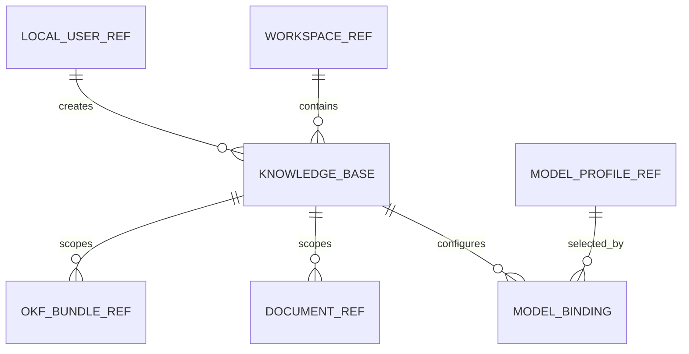
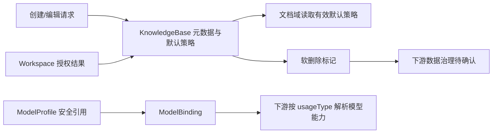

# 知识库域数据文档

> 文档层级：领域级  
> 领域名称：知识库域  
> 领域标识：`knowledge-base`  
> 文档状态：已评审  
> 更新日期：2026-08-14

## 1. 数据职责边界

- 本领域拥有的数据：KnowledgeBase 主数据、默认处理策略字段/快照、知识库模型用途绑定。
- 外部引用数据：workspaceId、ownerUserId 和 modelProfileId 分别引用用户域 Workspace、LocalUser 和 ModelProfile；只保存引用，不复制成员、角色、连接或凭证。
- 不归属本领域的数据：Workspace/Member、ModelConnection/Profile、SourceDocument 与各 Revision、MinIO 内容、ES 投影、OKF Bundle、QueryTrace 和评测数据。
- 数据一致性边界：创建/编辑 KnowledgeBase 与本次提交的 ModelBinding 在同一 MySQL 本地事务内；文档处理、模型调用和删除后的跨资源数据不在该事务内。

## 2. 业务对象生命周期

| 业务对象 | 产生场景 | 关键状态/字段语义 | 更新场景 | 消费场景 | 终态/归档 | 状态 |
| --- | --- | --- | --- | --- | --- | --- | --- |
| KnowledgeBase | BS-KB-001 | key 不可枚举；workspaceId 归属；ownerUserId 创建者；ACTIVE/DISABLED；version 乐观锁 | 元数据、默认策略、状态候选 | 列表/详情、文档/OKF/检索上下文 | 当前逻辑删除；跨资源归档待确认 | 主记录已验证 |
| DefaultProcessingPolicy | BS-KB-001/003 | autoParse/autoPublish、parserProfile、chunkProfileJson | 设置编辑；操作时形成有效策略 | 文档上传/解析/分块/发布编排 | 被新默认值替代，历史操作快照不应回写 | 字段已实现；四组合部分偏差 |
| ModelBinding | BS-KB-001/006 | bindingKey、knowledgeBaseId、usageType、modelProfileId、configJson、ACTIVE/DISABLED | 按用途替换/停用候选 | 模型能力解析 | 当前整体保存会逻辑删除旧行 | 已验证，治理语义部分待确认 |

## 3. 数据关系 ER 图

图示状态：WORKSPACE_REF、LOCAL_USER_REF、MODEL_PROFILE_REF 和下游 REF 仅表示跨域引用；对应数据不归知识库域所有。

## 4. 业务适配数据差异

| 业务能力 | 适配对象 | 主数据对象 | 适配特有数据 | 状态/字段映射差异 | 外部标识/流水 | 一致性风险 | 适配说明 | 状态 |
| --- | --- | --- | --- | --- | --- | --- | --- | --- |
| 默认处理策略 | 仅保存/手动处理 | KnowledgeBase | false/false | 不自动创建解析/发布任务 | 无 | 后续手动操作使用何时的快照 | 业务适配矩阵 | 已确认 |
| 默认处理策略 | 手动解析后自动发布 | KnowledgeBase | false/true | 手动解析成功后触发发布 | 文档任务标识归文档域 | 当前实体无法保存该组合 | `adaptations/manual-parse-auto-publish-手动解析后自动发布业务适配说明.md` | 目标已确认，当前偏差 |
| 默认处理策略 | 自动解析、人工发布 | KnowledgeBase | true/false | 自动解析成功后等待人工发布 | 文档任务标识归文档域 | 设置快照与任务输入一致性 | 业务适配矩阵 | 已实现 |
| 默认处理策略 | 自动解析并发布 | KnowledgeBase | true/true | 解析成功后自动进入发布 | 文档任务/Outbox 归文档域 | 跨域最终一致性归文档域 | 业务适配矩阵 | 已实现 |
| 模型绑定 | ANSWER_GENERATION | ModelBinding | usageType + LLM profileId | 需要 LLM 类型 | profileKey 为接口标识 | 越权/停用/类型漂移 | `adaptations/model-purpose-binding-按用途绑定模型档案业务适配说明.md` | 已实现 |
| 模型绑定 | EMBEDDING | ModelBinding | usageType + Embedding profileId | 需要 Embedding 类型和当前维度 | profileKey 为接口标识 | 维度变化影响既有投影 | 同上 | 已实现，缺失绑定行为待确认 |

## 5. 数据流转

图示状态：主数据和绑定流转有当前实现证据；有效策略快照与删除后跨资源流转部分待确认。

## 6. SQL/DDL 参考

| 数据库/服务 | 业务模型 | 参考来源 | 数据表 | 处理状态 |
| --- | --- | --- | --- | --- |
| MySQL | KnowledgeBase + DefaultProcessingPolicy | `fons4ai-rag2okf-service/sql/init-schema.sql`、实体、Mapper | `kb_knowledge_base` | 当前结构已验证；不生成新 DDL |
| MySQL | ModelBinding | 同上 | `kb_model_binding` | 当前结构已验证；同知识库同用途唯一 |
| 用户域 MySQL | Workspace/LocalUser/ModelProfile | 当前 SQL，仅作外部引用 | `kb_workspace`、`kb_user`、`kb_model_profile` | 不归本领域 |
| 文档/检索存储 | 下游文档、MinIO、ES 投影 | 项目数据架构 | 多表/对象/索引 | 删除协作待确认，不归本领域 |

## 7. 数据质量与治理

| 治理项 | 规则 | 适用对象 | 状态 |
| --- | --- | --- | --- |
| 状态一致性 | status 与逻辑删除含义必须区分；DISABLED 不是 deleted | KnowledgeBase/Binding | 字段存在，业务入口待确认 |
| 幂等数据 | knowledgeBaseKey/bindingKey 唯一；同知识库同 usageType 唯一；重复删除幂等 | KnowledgeBase/Binding | SQL+源码已验证 |
| 名称唯一 | 同 Workspace 名称业务上唯一 | KnowledgeBase | 应用层已实现，数据库原子约束待确认 |
| 字段映射 | API 的 workspaceKey/profileKey 转为内部 workspaceId/modelProfileId，响应不暴露数据库主键和凭证 | 跨域引用 | 已验证 |
| 配置快照 | chunkProfileJson 是知识库当前默认快照；文档任务必须保存执行时所用输入而非回读可变默认值 | Policy/下游任务 | 原则已确认，完整落地待文档域验证 |
| 金额/日期/状态口径 | 本域无金额；created/updated 为 DATETIME(3)；状态使用显式字符串枚举，不依赖 ordinal | 全部对象 | 当前 SQL 事实 |
| 外部流水 | 本域不拥有文档任务、Outbox 或 Provider 流水；只保存知识库和绑定业务 key | 全部对象 | 已确认边界 |

## 8. 数据安全与合规

| 治理项 | 规则 | 适用对象 | 状态 |
| --- | --- | --- | --- |
| 敏感数据识别 | 知识库名称/描述可能包含内部主题信息；ModelBinding 不得包含 API Key | KnowledgeBase/Binding | 已确认 |
| 传输安全 | 所有知识库接口依赖已认证会话和 Workspace 权限；安全传输由项目级基础设施保证 | HTTP 链路 | 权限已实现，传输运行态待验证 |
| 存储加密 | 本域不保存模型凭证；知识库描述当前无字段级加密要求 | Binding/KnowledgeBase | 已验证/不适用 |
| 展示/日志脱敏 | 响应只返回 profileKey 等安全引用，不返回 modelProfileId、密文或明文 Key | ModelBinding API | 已验证 |
| 数据权限 | 读取需有效 Workspace 成员；管理需 ADMIN；删除额外要求创建者 | KnowledgeBase | 已确认+已实现 |
| 审计与追踪 | created/updated/version 提供基础追踪；设置修改、绑定变更和删除的完整操作者审计尚未定义 | KnowledgeBase/Binding | 部分实现 |
| 保留期限/删除/归档 | 当前知识库主记录逻辑删除；关联内容、投影、OKF、历史引用和恢复期限待治理 | 全部下游引用 | 待确认，高风险 |

## 9. 待确认事项

| 编号 | 类型 | 问题 | 影响 | 建议处理 |
| --- | --- | --- | --- | --- |
| DQ-KB-001 | 删除治理 | 知识库删除后的保留期、恢复、级联清理和历史引用展示 | 合规、泄露、成本、追溯 | 独立数据治理需求 |
| DQ-KB-002 | 唯一性 | 是否增加 `(workspace_id,name)` 数据库唯一约束以及逻辑删除后的名称复用规则 | 并发和重建 | 数据变更前正式设计 |
| DQ-KB-003 | 快照 | DefaultProcessingPolicy 的操作级快照对象、字段和保存位置 | 审计、重试、手动解析 | 文档域设计/建模确认 |
| DQ-KB-004 | 绑定历史 | 绑定变更需要原位更新、版本化历史还是逻辑删除重建 | 审计和运行时可追溯 | 模型治理需求确认 |
| DQ-KB-005 | 规划字段 | Retrieval Profile 与 OKF 启用开关是否进入 KnowledgeBase 主数据或独立策略对象 | 表结构和接口 | 对应新需求时确认 |

