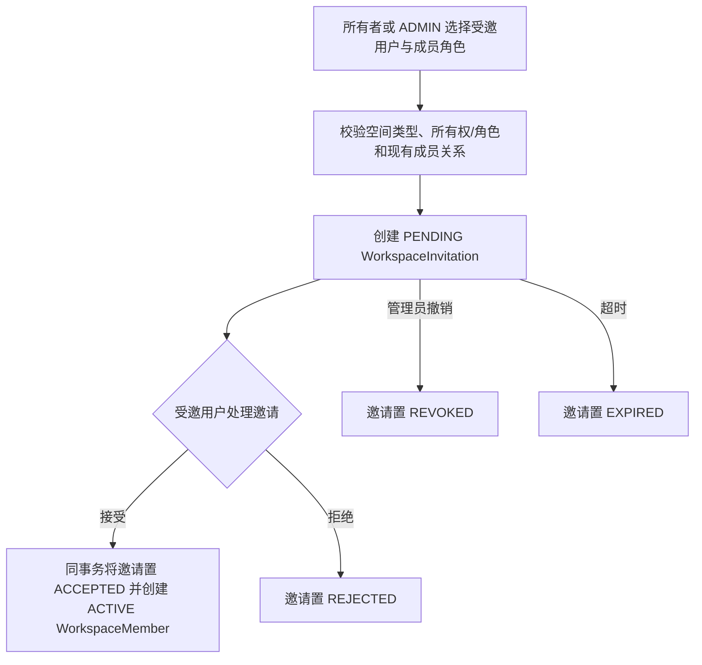
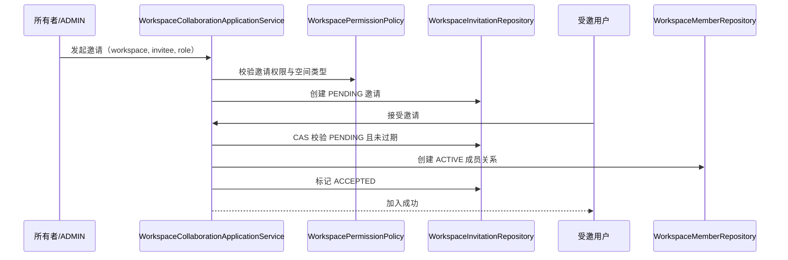
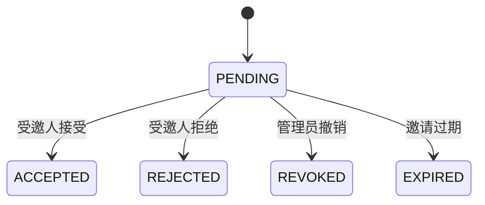

# 协作空间-协作空间邀请业务适配说明

> 文档层级：业务适配详解  
> 所属领域：用户域（`user`）  
> 适配编号：BA-USER-003  
> 适配对象：协作空间邀请  
> 文档状态：待补充  
> 更新日期：2026-08-13

## 1. 适配对象与适用范围

- 适配对象：可邀请其他已注册用户加入的 Workspace，最终类型名待 SDD 确认。
- 适用业务能力：BS-USER-004、BS-USER-005。
- 适用产品/渠道/租户/配置：多用户协作 Workspace。
- 入口场景：所有者或 ADMIN 邀请用户、受邀用户处理邀请。
- 不适用范围：PERSONAL 个人空间默认不邀请其他成员。
- 可信度说明：领域边界、邀请与成员分离、所有权+角色双层模型已由用户确认；当前无源码、API 或 DDL，本文不宣称已实现。

## 2. 业务流程

图示状态：目标骨架已经用户确认；时效、通知和重复规则待 SDD。

## 3. 适配时序图

图示状态：步骤来自用户确认的骨架；CAS 为预防并发重复接受的技术建议，正式契约待 SDD。

| 顺序 | 适配步骤 | 公共/特有 | 触发条件 | 协作对象 | 状态/数据影响 | 证据 |
| --- | --- | --- | --- | --- | --- | --- |
| 1 | 校验 Workspace 所有权或 ADMIN 角色 | 公共 | 发起邀请 | WorkspacePermissionPolicy | 无 | 用户确认 |
| 2 | 创建独立邀请 | 特有 | 通过校验 | WorkspaceInvitation | PENDING | 用户确认 |
| 3 | 受邀人接受 | 特有 | PENDING 且未过期 | Invitation/Member | ACCEPTED + ACTIVE Member | 用户确认 |

## 4. 关键业务规则

| 规则编号 | 规则内容 | 触发条件 | 处理结果 | 与公共流程差异 | 状态 |
| --- | --- | --- | --- | --- | --- |
| BAR-USER-WS-001 | PERSONAL 空间默认不允许邀请 | 发起邀请 | 拒绝 | 空间类型差异 | 用户已确认 |
| BAR-USER-WS-002 | 邀请不是成员关系 | 创建邀请 | 只写 Invitation | 协作适配特有 | 用户已确认 |
| BAR-USER-WS-003 | 只有接受邀请才创建成员 | 邀请处理 | 原子创建 Member | 协作适配特有 | 用户已确认 |
| BAR-USER-WS-004 | 所有者是唯一身份，ADMIN 可多人 | 高风险动作 | 单独校验 ownerUserId | 公共所有权规则 | 用户已确认 |

## 5. 状态流转

| 当前状态 | 触发动作 | 前置条件 | 目标状态 | 失败/挂起处理 | 状态 |
| --- | --- | --- | --- | --- | --- |
| PENDING | 接受 | 受邀用户本人、未过期、非成员 | ACCEPTED | 不创建重复 Member | 骨架已确认 |
| PENDING | 拒绝 | 受邀用户本人 | REJECTED | 不创建 Member | 骨架已确认 |
| PENDING | 撤销 | 所有者/ADMIN | REVOKED | 后续接受失败 | 骨架已确认 |
| PENDING | 过期 | 超过 expiresAt | EXPIRED | 后续接受失败 | 骨架已确认 |

## 6. 接口、配置与数据差异

| 类型 | 差异项 | 说明 | 证据 |
| --- | --- | --- | --- |
| 接口/协议 | 邀请创建、列表、接受、拒绝、撤销 | URL 和请求字段待 SDD | 待确认 |
| 配置 | 邀请时效和通知渠道 | 不在本次建模中假定 | 待确认 |
| 数据字段 | invitationKey/workspaceId/inviter/invitee/role/status/expiresAt | 候选字段，非 DDL | 用户确认+架构推导 |
| 错误码/结果码 | 无权、重复邀请、已是成员、邀请过期 | 具体错误码待 SDD | 待确认 |

## 7. 异常、重试与补偿

| 场景 | 处理方式 | 是否重试 | 是否影响状态 | 证据状态 |
| --- | --- | --- | --- | --- |
| 并发接受 | 仅一次可从 PENDING 成功转移 | 否 | 是 | 待 SDD |
| 通知失败 | 是否保留 PENDING 邀请待确认 | 待确认 | 待确认 | 待确认 |
| 成员创建失败 | 邀请不得转 ACCEPTED | 可重试 | 是 | 用户确认的原子语义 |

## 8. 技术落地索引

- 入口/API/任务：待 SDD
- 应用服务：WorkspaceCollaborationApplicationService（目标）
- 领域对象/策略/流程：WorkspaceInvitation、WorkspaceMember、WorkspacePermissionPolicy
- Gateway/Remote/Adapter：NotificationPort（是否需要待确认）
- Mapper/Repository：WorkspaceInvitationRepository、WorkspaceMemberRepository（目标）
- 测试：状态机、并发接受、越权、过期、重复成员集成测试

## 9. 源码证据

| 结论 | 证据路径 | 证据类型 | 状态 |
| --- | --- | --- | --- |
| 当前只有 ACTIVE/DISABLED WorkspaceMember | `WorkspaceMemberStatus.java`、`KbWorkspaceMember.java` | 源码 | 已验证 |
| 企业空间和成员管理曾被延期 | `知识库文档生命周期-技术设计说明书.md` | 正式文档 | 已验证 |
| 邀请独立于成员，接受后创建成员 | 2026-08-13 用户确认 | 用户确认 | 已验证 |

## 10. 待确认事项

| 编号 | 问题 | 影响 | 建议处理 |
| --- | --- | --- | --- |
| BAQ-USER-WS-001 | TEAM 还是 ENTERPRISE 作为协作空间类型 | 数据与 UI | SDD 确认 |
| BAQ-USER-WS-002 | 邀请是按已注册 userKey 还是 email | 隐私、防枚举和通知 | SDD 确认 |
| BAQ-USER-WS-003 | 邀请时效、撤销权限和重复邀请唯一性 | 状态机和 DDL | SDD 确认 |
