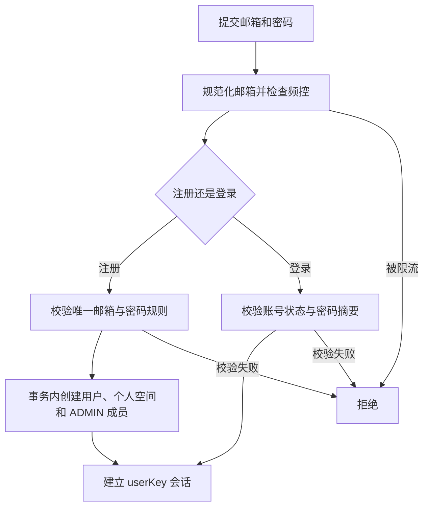
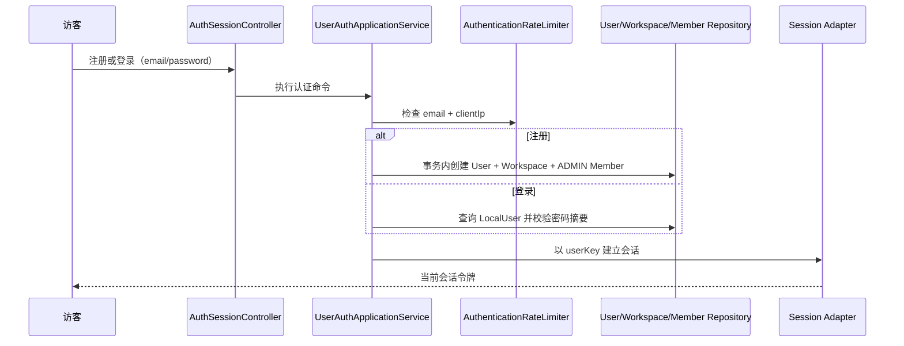
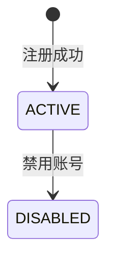

# 邮箱密码-邮箱密码认证业务适配说明

> 文档层级：业务适配详解  
> 所属领域：用户域（`user`）  
> 适配编号：BA-USER-001  
> 适配对象：邮箱密码认证  
> 文档状态：已评审  
> 更新日期：2026-08-13

## 1. 适配对象与适用范围

- 适配对象：Rag2OKF 本地邮箱+密码注册与登录。
- 适用业务能力：BS-USER-001、BS-USER-002。
- 适用产品/渠道/租户/配置：Rag2OKF 全部本地用户。
- 入口场景：`POST /auth/registration`、`POST /auth/login`、`POST /auth/logout`。
- 不适用范围：手机号、OIDC、SSO、远程账号映射。
- 可信度说明：正式 SDD、当前源码和用户确认一致；用户明确选择将它固定为唯一认证标准。

## 2. 业务流程

图示状态：已根据源码和 SDD 补全。

## 3. 适配时序图

图示状态：已根据当前实现补全。

| 顺序 | 适配步骤 | 公共/特有 | 触发条件 | 协作对象 | 状态/数据影响 | 证据 |
| --- | --- | --- | --- | --- | --- | --- |
| 1 | 规范化邮箱 | 特有 | 登录/注册 | UserAuthApplicationService | email 作唯一标识 | SDD + 源码 |
| 2 | 校验密码摘要 | 特有 | 登录 | PasswordHasher | 不写明文 | SDD + 源码 |
| 3 | 原子开通个人空间 | 特有 | 注册 | User/Workspace/Member Repository | 三对象创建 | SDD + 源码 |
| 4 | 建立 userKey 会话 | 公共 | 认证成功 | Session Adapter | 会话生效 | SDD + 源码 |

## 4. 关键业务规则

| 规则编号 | 规则内容 | 触发条件 | 处理结果 | 与公共流程差异 | 状态 |
| --- | --- | --- | --- | --- | --- |
| BAR-USER-001 | email 是规范化后全局唯一的登录标识 | 注册/登录 | 以 email 定位账号 | 邮箱密码特有 | 已验证 |
| BAR-USER-002 | 密码只保存不可逆随机盐摘要 | 注册/改密 | 不存储明文 | 邮箱密码特有 | 已验证 |
| BAR-USER-003 | 错误邮箱、错误密码和禁用账号不泄漏账号存在性 | 登录失败 | 统一失败 | 安全规则 | 正式 SDD 已确认，当前结果码需评审 |
| BAR-USER-004 | 注册开通的三对象必须原子成功 | 注册 | 失败全回滚 | 本项目特有初始化 | 已设计 |

## 5. 状态流转

| 当前状态 | 触发动作 | 前置条件 | 目标状态 | 失败/挂起处理 | 状态 |
| --- | --- | --- | --- | --- | --- |
| 无 | 注册 | 唯一邮箱和有效密码 | ACTIVE | 全部回滚 | 已设计 |
| ACTIVE | 禁用 | 管理权限待后续需求 | DISABLED | 会话应被终止 | 状态已有实现 |

## 6. 接口、配置与数据差异

| 类型 | 差异项 | 说明 | 证据 |
| --- | --- | --- | --- |
| 接口/协议 | `Authentication: Bearer <token>` | 当前会话传递方式 | CR-011 + 实施报告 |
| 配置 | remember-me timeout | 当前配置项 | UserAuthApplicationService |
| 数据字段 | email/password_hash/user_key | 邮箱密码认证特有 | init-schema.sql |
| 错误码/结果码 | 统一认证失败 | 不应可枚举用户存在性 | SDD BR-013/014 |

## 7. 异常、重试与补偿

| 场景 | 处理方式 | 是否重试 | 是否影响状态 | 证据状态 |
| --- | --- | --- | --- | --- |
| 登录失败 | 记录频控，不建立会话 | 由用户再次提交 | 否 | 已验证 |
| 注册事务失败 | 回滚 User/Workspace/Member | 可重新注册 | 否 | 已设计 |
| 事务成功但会话建立失败 | 保留完整账号，用户可登录 | 是 | 否 | SDD 已确认 |

## 8. 技术落地索引

- 入口/API/任务：`controller/user/AuthSessionController.java`
- 应用服务：`application/user/UserAuthApplicationService.java`
- 领域对象/策略/流程：`KbUser`、`KbWorkspace`、`KbWorkspaceMember`；领域规则待继续收敛
- Gateway/Remote/Adapter：`AuthenticationRateLimiter`、Sa-Token 适配
- Mapper/Repository：当前 DomainService/MyBatis，目标改为 Repository
- 测试：历史存在认证和安全测试，当前已被删除

## 9. 源码证据

| 结论 | 证据路径 | 证据类型 | 状态 |
| --- | --- | --- | --- |
| 注册创建三对象 | `application/user/UserAuthApplicationService.java` | 源码 | 已验证 |
| LocalUser 密码摘要不可回显 | `domain/entity/KbUser.java` | 源码 | 已验证 |
| 邮箱密码是唯一标准 | 2026-08-13 用户确认 | 用户确认 | 已验证 |

## 10. 待确认事项

| 编号 | 问题 | 影响 | 建议处理 |
| --- | --- | --- | --- |
| BAQ-USER-EMAIL-001 | 密码修改/找回流程尚未建模 | 账号生命周期 | 新需求 SDD |
| BAQ-USER-EMAIL-002 | 当前实现对 email 的大小写规范化需重新代码评审 | 唯一性和登录一致性 | 重构阶段补特征测试 |
