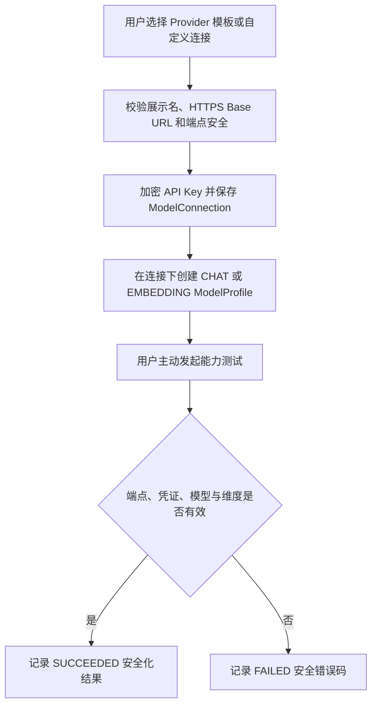
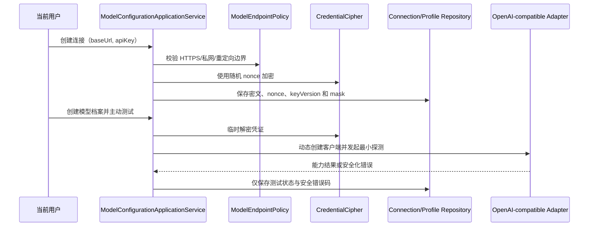
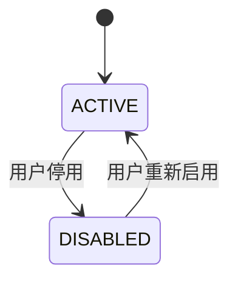

# OpenAI-compatible-模型资源业务适配说明

> 文档层级：业务适配详解  
> 所属领域：用户域（`user`）  
> 适配编号：BA-USER-004  
> 适配对象：OpenAI-compatible 模型调用协议  
> 文档状态：已评审  
> 更新日期：2026-08-13

## 1. 适配对象与适用范围

- 适配对象：用户级 OpenAI-compatible Provider 连接和 CHAT/EMBEDDING 模型档案。
- 适用业务能力：BS-USER-006。
- 适用产品/渠道/租户/配置：用户在设置中维护的自有 Provider。
- 入口场景：创建/更新/删除连接与档案，替换 API Key，主动测试。
- 不适用范围：知识库 ModelBinding、全局共享凭证、其他协议。
- 可信度说明：有正式 SDD、当前源码和初始 SQL 证据；仅作为代表性协议适配。

## 2. 业务流程

图示状态：已根据源码与 SDD 补全。

## 3. 适配时序图

图示状态：已根据当前实现补全。

| 顺序 | 适配步骤 | 公共/特有 | 触发条件 | 协作对象 | 状态/数据影响 | 证据 |
| --- | --- | --- | --- | --- | --- | --- |
| 1 | 校验出站端点 | 公共安全骨架 | 创建/调用 | EndpointPolicy | 不安全则拒绝 | SDD + 源码 |
| 2 | 加密并掩码化 API Key | 公共安全骨架 | 创建/换 Key | CredentialCipher | 写密文不写明文 | SDD + 源码 |
| 3 | 构建 OpenAI-compatible 客户端 | 特有 | 模型调用/测试 | Protocol Adapter | 不持久明文 | 源码 |
| 4 | 记录安全化测试结果 | 公共 | 用户主动测试 | Repository | TestStatus/ErrorCode | SDD + 源码 |

## 4. 关键业务规则

| 规则编号 | 规则内容 | 触发条件 | 处理结果 | 与公共流程差异 | 状态 |
| --- | --- | --- | --- | --- | --- |
| BAR-USER-MODEL-001 | 连接和档案仅属于创建用户 | 所有 CRUD/测试/解析 | 越权则拒绝 | 公共所有权规则 | 已验证 |
| BAR-USER-MODEL-002 | API Key 零明文持久、回显和日志 | 创建/换 Key/调用 | 仅保存密文和 mask | 公共安全规则 | 已验证 |
| BAR-USER-MODEL-003 | 不存在全局模型或 API Key 回退 | 档案缺失/停用/越权 | fail-closed | 公共安全规则 | 已验证 |
| BAR-USER-MODEL-004 | Provider 模板只是连接初始值 | 创建连接 | 不创建独立领域对象 | OpenAI-compatible 适配规则 | 用户已确认 |

## 5. 状态流转

| 当前状态 | 触发动作 | 前置条件 | 目标状态 | 失败/挂起处理 | 状态 |
| --- | --- | --- | --- | --- | --- |
| ACTIVE | 停用 | 当前所有用户 | DISABLED | 下游解析 fail-closed | 已验证 |
| DISABLED | 启用 | 当前所有用户 | ACTIVE | 连接/档案仍需调用时校验 | 已有状态语义 |

## 6. 接口、配置与数据差异

| 类型 | 差异项 | 说明 | 证据 |
| --- | --- | --- | --- |
| 接口/协议 | OPENAI_COMPATIBLE | 当前唯一协议实现 | ModelProtocolType + 源码 |
| 配置 | baseUrl、timeout、retry、temperature、dimensions | 按 Connection/Profile 存储受控快照 | 源码 + SQL |
| 数据字段 | ciphertext/nonce/keyVersion/mask | 凭证存储差异 | init-schema.sql |
| 错误码/结果码 | 401/429/timeout/维度错配/端点不安全 | 只存安全化结果 | SDD + 实施报告 |

## 7. 异常、重试与补偿

| 场景 | 处理方式 | 是否重试 | 是否影响状态 | 证据状态 |
| --- | --- | --- | --- | --- |
| 端点不安全 | 调用前拒绝 | 否 | 测试可记 FAILED | 已验证 |
| Provider 临时失败 | 返回安全化错误 | 由用户/下游业务决定 | 测试可记 FAILED | 已验证 |
| 密钥配置缺失 | 不创建/不解密，绝不回退 | 否 | 否 | 已验证 |

## 8. 技术落地索引

- 入口/API/任务：`controller/ModelConfigurationController.java`
- 应用服务：`application/model/ModelConfigurationApplicationService.java`
- 领域对象/策略/流程：`KbModelConnectionEntity`、`KbModelProfile`；所有权规则待收敛
- Gateway/Remote/Adapter：`CredentialCipher`、`ModelEndpointPolicy`、`ModelClientFactory`
- Mapper/Repository：当前 DomainService/MyBatis，目标改为 Repository
- 测试：历史存在 AES-GCM、EndpointPolicy、ClientFactory、ApplicationService 测试，当前已删除

## 9. 源码证据

| 结论 | 证据路径 | 证据类型 | 状态 |
| --- | --- | --- | --- |
| Connection 持有加密凭证 | `domain/entity/KbModelConnectionEntity.java` | 源码 | 已验证 |
| Profile 只引用 Connection，不复制凭证 | `domain/entity/KbModelProfile.java` | 源码 | 已验证 |
| OpenAI-compatible 只是代表性协议适配 | 2026-08-13 用户确认 | 用户确认 | 已验证 |

## 10. 待确认事项

| 编号 | 问题 | 影响 | 建议处理 |
| --- | --- | --- | --- |
| BAQ-USER-MODEL-001 | 第二个协议实现尚未出现 | 公共 SPI 缺少横向验证 | 实际接入时深挖 |
| BAQ-USER-MODEL-002 | RERANK、文档理解、OKF 提取的档案类型 | 数据与能力校验 | 对应业务需求时确认 |
