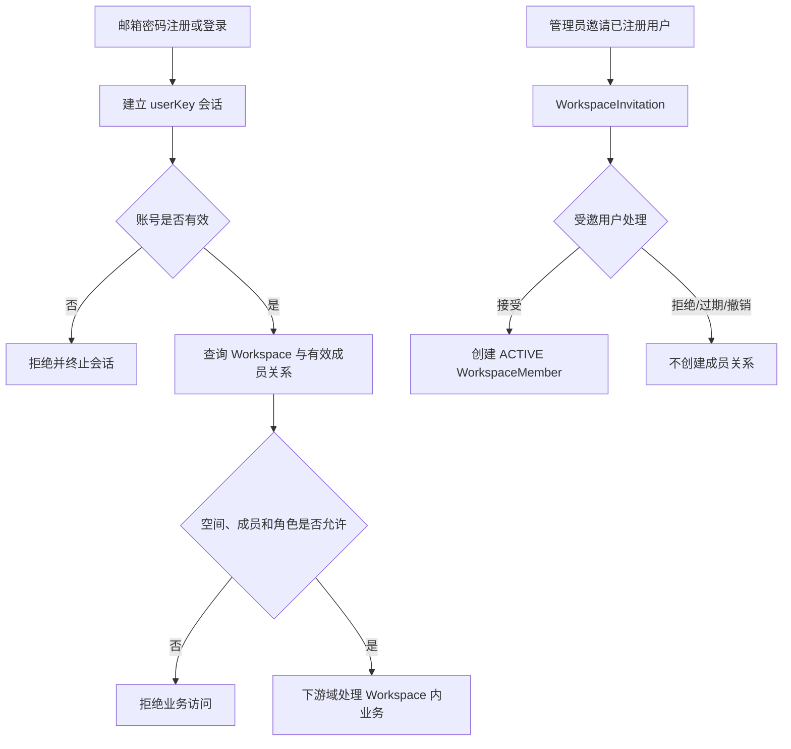
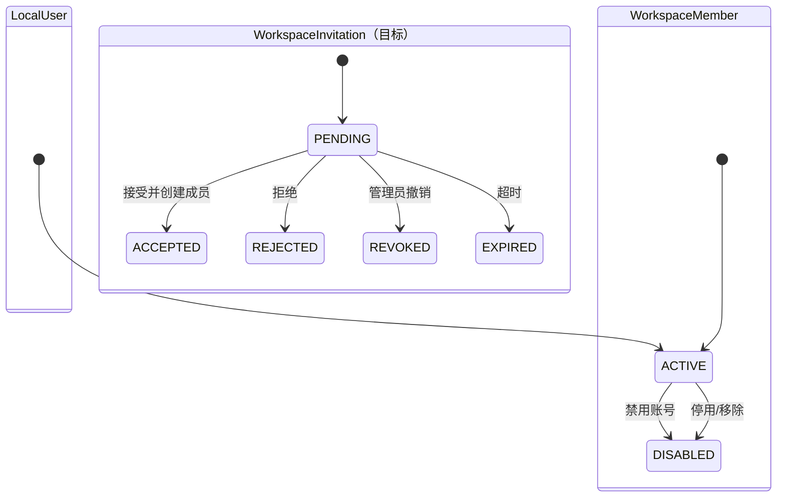

# 用户域业务文档

> 文档层级：领域级  
> 领域名称：用户域  
> 领域标识：`user`  
> 文档状态：已评审  
> 更新日期：2026-08-13

## 1. 领域职责

- 领域目标：管理 Rag2OKF 本地用户身份、邮箱密码认证、会话、个人资料、Workspace、成员协作、角色授权以及用户拥有的模型资源。
- 领域边界：`LocalUser`、`Workspace`、`WorkspaceMember`、`WorkspaceInvitation`、`ModelConnection`、`ModelProfile` 由用户域拥有。
- 不负责事项：不管理 KnowledgeBase 内容与生命周期；不拥有知识库模型用途绑定；不决定模型在回答、向量化、OKF 等场景中的业务用途。
- 上游协作：用户通过注册、登录、资料维护、Workspace 管理和模型资源管理入口触发本领域。
- 下游协作：向知识库域、文档域、OKF 域和检索域提供当前身份、Workspace 访问判定、模型档案校验与受控模型解析端口。
- 可信度说明：边界与标准判定来自 2026-08-13 用户逐问确认；邮箱密码、个人空间初始化和 OpenAI-compatible 模型资源有源码与 SDD 证据；Workspace 邀请属已确认目标能力，当前尚未实现。

## 2. 核心业务对象

| 对象 | 定义 | 生命周期 | 关键状态 | 状态 |
| --- | --- | --- | --- | --- |
| LocalUser | Rag2OKF 本地账号与不可变身份 | 注册创建，资料和密码可变 | ACTIVE / DISABLED | 已验证 |
| Workspace | 用户协作与业务资源的归属、隔离边界 | 注册产生个人空间，后续可创建协作空间 | ACTIVE / DISABLED | 边界已确认，协作能力待实现 |
| WorkspaceMember | 已生效的用户与 Workspace 角色关系 | 创建、角色调整、停用 | ACTIVE / DISABLED | 已验证 |
| WorkspaceInvitation | 用户加入协作空间前的邀请过程 | 发出、接受/拒绝/撤销/过期 | PENDING / ACCEPTED / REJECTED / REVOKED / EXPIRED | 目标标准已确认，待设计实现 |
| ModelConnection | 用户拥有的模型服务连接和加密凭证 | 创建、换 Key、测试、停用、删除 | ACTIVE / DISABLED | 已验证 |
| ModelProfile | 基于连接创建的可复用模型能力配置 | 创建、调参、测试、停用、删除 | ACTIVE / DISABLED | 已验证 |

## 3. 核心业务场景

| 场景编号 | 业务能力 | 场景名称 | 触发条件 | 参与方 | 输出 | 状态 |
| --- | --- | --- | --- | --- | --- | --- | --- |
| BS-USER-001 | 邮箱密码认证 | 用户注册 | 未注册邮箱提交有效密码 | 访客、用户域 | LocalUser + 个人 Workspace + ADMIN 成员关系 + 会话 | 已实现 |
| BS-USER-002 | 邮箱密码认证 | 用户登录与注销 | 有效本地账号 | 用户、用户域 | `userKey` 会话或会话终止 | 已实现 |
| BS-USER-003 | 用户资料 | 查看与修改本人资料 | 已登录且账号有效 | 用户、用户域 | 安全资料快照 | 已实现 |
| BS-USER-004 | Workspace 协作 | 邀请用户加入协作空间 | Workspace 管理员发起邀请 | 所有者/管理员、受邀用户、用户域 | 邀请结果；接受后产生成员关系 | 目标能力待实现 |
| BS-USER-005 | Workspace 授权 | 校验空间访问权 | 下游业务访问 Workspace 资源 | 下游域、用户域 | 允许或拒绝 | 已实现，策略待收敛 |
| BS-USER-006 | 模型资源管理 | 管理连接、凭证与模型档案 | 已登录用户配置自有模型 | 用户、用户域、模型 Provider | 可复用且受控的 ModelProfile | 已实现 |

## 4. 场景业务流程

图示状态：认证与授权骨架已有实现证据；邀请分支是用户已确认的目标标准，尚未实现。

## 5. 业务适配矩阵

| 业务能力 | 适配对象 | 适用场景 | 共性规则 | 差异规则 | 状态差异 | 数据差异 | 详解文档 | 是否可作为标准 | 状态 |
| --- | --- | --- | --- | --- | --- | --- | --- | --- | --- |
| 认证 | 邮箱密码 | BS-USER-001/002 | 唯一邮箱、密码摘要、失败防枚举 | 当前无其他认证方式 | ACTIVE/DISABLED | email/password_hash | `adaptations/email-password-邮箱密码认证业务适配说明.md` | 是，用户已确认为唯一标准 | 已验证 |
| Workspace | 个人空间 | BS-USER-001/005 | 空间状态、所有权、成员关系同时判定 | 注册时原子创建，默认不邀请他人 | ACTIVE/DISABLED | PERSONAL + owner + ADMIN member | 无 | 否，为特定空间类型 | 已验证 |
| Workspace | 协作空间 | BS-USER-004/005 | 空间状态、所有权、成员关系同时判定 | 邀请独立于成员关系 | 邀请五态；成员两态 | WorkspaceInvitation + WorkspaceMember | `adaptations/collaborative-workspace-协作空间邀请业务适配说明.md` | 否，为空间类型适配 | 目标标准已确认 |
| 模型资源 | OpenAI-compatible | BS-USER-006 | 用户所有权、凭证加密、安全测试、无全局回退 | 协议端点与参数差异 | 连接/档案 ACTIVE/DISABLED | protocol/baseUrl/ciphertext/profile | `adaptations/openai-compatible-模型资源业务适配说明.md` | 否，为代表性协议适配 | 已验证 |

## 6. 公共抽象与标准流程判定

| 类型 | 内容 | 证据 | 是否可作为标准 |
| --- | --- | --- | --- |
| 公共抽象 | 邮箱密码校验 -> `userKey` 会话 -> Workspace 业务授权 | 正式 SDD、源码、用户确认 | 是 |
| 公共抽象 | Workspace 所有权 + 成员角色双层模型 | 用户确认 | 是 |
| 公共抽象 | 邀请接受后创建成员关系 | 用户确认 | 是，但实现细节待 SDD |
| 公共抽象 | ModelConnection + ModelProfile + 协议/凭证/测试端口 | 正式 SDD、源码、用户确认 | 是 |
| 代表性业务适配 | OpenAI-compatible Provider 模型连接 | 当前单协议实现 | 否 |
| 不得作为标准 | Sa-Token、Redis 频控、MyBatis Mapper、AES-GCM 具体实现 | 当前技术实现 | 否 |

## 7. 业务规则

| 规则编号 | 规则类型 | 规则内容 | 适用范围 | 例外/差异 | 状态 |
| --- | --- | --- | --- | --- | --- |
| BR-USER-001 | 共性规则 | 邮箱是规范化后全局唯一的登录标识，邮箱密码是唯一认证标准 | 认证 | 其他方式须走需求变更 | 用户已确认 |
| BR-USER-002 | 共性规则 | 密码只保存带随机盐的不可逆摘要，不回显、不记录 | 认证 | 无 | 已验证 |
| BR-USER-003 | 共性规则 | 登录成功只证明身份，不直接授予 Workspace 业务权限 | 全部业务访问 | 无 | 已验证 |
| BR-USER-004 | 共性规则 | Workspace 与 WorkspaceMember 归用户域；下游域仅引用空间标识并请求授权判定 | 跨域协作 | 无 | 用户已确认 |
| BR-USER-005 | 共性规则 | Workspace 有唯一所有者；所有者同时是 ADMIN，但高风险动作必须单独校验所有权 | Workspace | 不得仅凭 ADMIN 删除/移交空间 | 用户已确认 |
| BR-USER-006 | 共性规则 | 角色权限使用显式策略，不依赖枚举顺序 | Workspace | 无 | 用户已确认 |
| BR-USER-007 | 共性规则 | WorkspaceInvitation 与 WorkspaceMember 分离，邀请接受后才创建生效成员关系 | Workspace 协作 | 个人空间默认不允许邀请 | 用户已确认 |
| BR-USER-008 | 共性规则 | ModelConnection 和 ModelProfile 归用户；ModelBinding 归知识库 | 模型资源 | 无 | 用户已确认 |
| BR-USER-009 | 共性规则 | 知识库域不得读取或解密 API Key，只能经受控端口校验或解析模型能力 | 跨域模型调用 | 无 | 用户已确认 |

## 8. 状态流转

图示状态：LocalUser 和 WorkspaceMember 两态有当前源码证据；WorkspaceInvitation 五态为用户已确认的目标骨架，转移条件和超时参数待 SDD。

## 9. 异常分支

| 场景 | 异常 | 处理方式 | 是否影响状态 | 状态 |
| --- | --- | --- | --- | --- |
| 登录 | 邮箱不存在、密码错误或账号禁用 | 统一失败语义，不建立会话，记录频控 | 否 | 已验证 |
| 注册 | 邮箱重复或事务失败 | 不留下半成用户/Workspace/成员数据 | 否 | 已设计，当前实现使用本地事务 |
| Workspace 授权 | 账号、空间或成员关系无效 | 拒绝访问；账号无效时终止会话 | 可能 | 已验证 |
| 邀请 | 重复邀请、邀请过期、受邀人已是成员 | 不创建重复成员关系 | 是 | 待 SDD |
| 模型资源 | 越权、凭证错误、端点不安全、模型能力不匹配 | fail-closed，只返回安全化错误 | 测试状态可变 | 已验证 |

## 10. 待确认事项

| 编号 | 类型 | 问题 | 影响 | 建议处理 |
| --- | --- | --- | --- | --- |
| BQ-USER-001 | 业务 | 协作空间类型最终命名为 TEAM 还是 ENTERPRISE | 枚举、UI、数据迁移 | 邀请功能 SDD 时确认 |
| BQ-USER-002 | 业务 | 邀请标识、时效、通知渠道与重复邀请规则 | 邀请状态机和数据结构 | 邀请功能 SDD 时确认 |
| BQ-USER-003 | 业务 | 所有权移交、所有者退出和最后一名 ADMIN 约束 | 高风险状态转移 | 协作空间 SDD 时确认 |
| BQ-USER-004 | 业务 | 账号注销、Workspace 删除、凭证删除的保留期 | 合规与引用完整性 | 数据治理需求中确认 |
