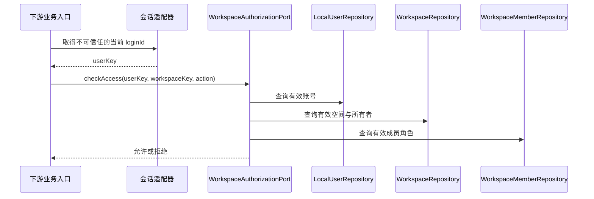
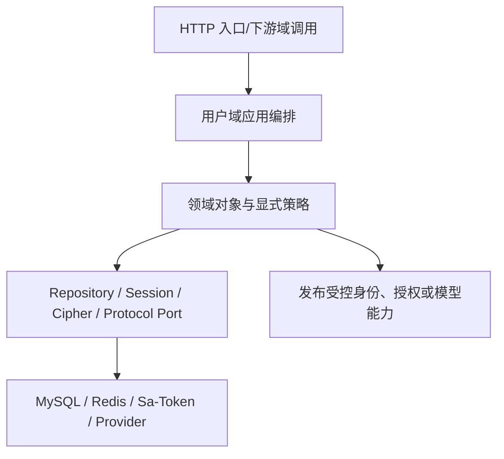

# 用户域技术文档

> 文档层级：领域级  
> 领域名称：用户域  
> 领域标识：`user`  
> 文档状态：已评审  
> 更新日期：2026-08-13

## 1. 技术职责边界

- 接入层：提供注册、登录、注销、个人资料、Workspace 协作和模型资源 HTTP 契约；不直接返回持久化实体。
- 应用编排层：编排认证、注册原子开通、资料更新、邀请、成员管理、授权判定和模型资源管理。
- 领域/策略层：承载邮箱规范化与唯一性、账号状态、Workspace 所有权、成员角色、邀请状态机、模型资源所有权和凭证安全规则。
- 基础设施层：MySQL/Mapper、Sa-Token、Redis 频控、密码编码、凭证加密、HTTP 模型客户端与端点安全实现。
- 外部协作：知识库域经 `WorkspaceAuthorizationPort`、`ModelProfileValidationPort`、`ModelCapabilityResolutionPort` 等端口协作；名称为建模目标抽象，当前代码尚未完全形成。
- 不属于本领域的技术职责：KnowledgeBase Repository、文档处理、ES 投影、OKF 构建、检索编排与知识库 `ModelBinding` 持久化。

## 2. 场景技术落地

| 场景编号 | 业务能力 | 适用适配对象 | 入口/API/消息/任务 | 应用编排 | 领域对象/方法 | 数据访问 | 外部协作 | 事务边界 | 异常路径 | 验证方式 | 状态 |
| --- | --- | --- | --- | --- | --- | --- | --- | --- | --- | --- | --- |
| BS-USER-001 | 注册 | 邮箱密码 + 个人空间 | `POST /auth/registration` | UserAuthApplicationService | LocalUser/Workspace/WorkspaceMember 创建规则 | 目标 Repository | 密码摘要、频控、会话 | 三对象单 MySQL 事务，提交后建会话 | 重复邮箱、弱密码、频控、回滚 | 单元+事务集成 | 已实现，分层待收敛 |
| BS-USER-002 | 登录/注销 | 邮箱密码 | `POST /auth/login`、`/logout` | UserAuthApplicationService | LocalUser 有效性 | 目标 LocalUserRepository | 密码校验、频控、会话 | 登录时间更新为本地事务 | 统一认证失败 | 单元+Web 契约 | 已实现 |
| BS-USER-004 | Workspace 邀请 | 协作空间 | 待 SDD | WorkspaceCollaborationApplicationService（目标） | WorkspaceInvitation/WorkspaceMember | 目标 Repository | 通知渠道待确认 | 接受邀请与创建成员关系同事务 | 过期、撤销、并发接受 | 状态机+并发集成 | 目标待实现 |
| BS-USER-005 | Workspace 授权 | 全部 Workspace | 下游内部端口 | WorkspaceAuthorizationService（目标） | 账号/空间/成员/角色/所有权策略 | 目标 Repository | 会话适配器 | 只读判定 | fail-closed | 单元+越权集成 | 当前 WorkspaceAccessPolicy 已实现部分规则 |
| BS-USER-006 | 模型资源 | OpenAI-compatible | `/model-connections`、`/model-profiles` | ModelConfigurationApplicationService | ModelConnection/ModelProfile/所有权策略 | 目标 Repository | Cipher/EndpointPolicy/ProtocolAdapter/Probe | 单资源本地事务 | 越权、SSRF、凭证错误、能力错配 | 单元+安全契约 | 已实现，分层待收敛 |

## 3. 核心调用时序

图示状态：业务判定已根据正式文档、当前源码和用户确认补全；Repository/Port 名称为目标架构，不表示当前已有对应类。

## 4. 业务适配技术落地矩阵

| 业务能力 | 适配对象 | 入口/契约 | 应用编排 | 策略/流程/扩展点 | Adapter/Gateway/Remote | DTO/参数转换 | 状态映射 | 幂等/重试 | 适配说明 | 不得修改的公共抽象 | 状态 |
| --- | --- | --- | --- | --- | --- | --- | --- | --- | --- | --- | --- |
| 认证 | 邮箱密码 | `/auth/*` | UserAuthApplicationService | EmailPasswordAuthenticationPolicy（目标） | PasswordHasher/RateLimiter/SessionAdapter | Login/Registration Command | UserStatus | 邮箱唯一；重复登录建立当前会话 | `adaptations/email-password-邮箱密码认证业务适配说明.md` | LocalUser 不可变 userKey；认证与 Workspace 授权分层 | 已验证 |
| Workspace | 协作空间 | 待 SDD | WorkspaceCollaborationApplicationService（目标） | InvitationStateMachine/ExplicitPermissionPolicy | NotificationPort（待确认） | Invitation Command/Response | InvitationStatus/MemberStatus | 邀请唯一与接受 CAS 待设计 | `adaptations/collaborative-workspace-协作空间邀请业务适配说明.md` | 邀请与成员分离；所有权与角色分离 | 目标已确认 |
| 模型资源 | OpenAI-compatible | `/model-*` | ModelConfigurationApplicationService | ModelProtocolAdapter/ModelCapabilityProbe | Cipher/EndpointPolicy/HTTP Client | Connection/Profile Request/Response | Connection/Profile/TestStatus | 用户内名称唯一；调用临时解密 | `adaptations/openai-compatible-模型资源业务适配说明.md` | 所有权、零明文回显、无全局回退 | 已验证 |

## 5. 公共抽象

| 公共抽象 | 作用 | 实现方 | 代码位置 | 是否标准 |
| --- | --- | --- | --- | --- |
| CurrentIdentityPort | 获得当前 userKey，不携带业务角色 | Sa-Token 代表实现 | 当前 `CurrentUserContext`/`SaTokenCurrentUserContext` | 是（目标抽象） |
| WorkspaceAuthorizationPort | 按 Workspace 和显式动作判定访问 | WorkspaceAccessPolicy 代表实现 | `infrastructure/identity/WorkspaceAccessPolicy.java` | 是（需移出 infrastructure 业务策略） |
| PasswordHasher | 密码摘要和校验 | 当前 PasswordEncoder | `common/utils/PasswordEncoder.java` | 是 |
| AuthenticationRateLimiter | 登录/注册频控 | Redis 代表实现 | `infrastructure/identity/AuthenticationRateLimiter.java` | 是 |
| CredentialCipher | 凭证加解密 | AES-GCM 代表实现 | `common/dto/CredentialCipher.java` | 是 |
| ModelProtocolAdapter | 根据协议创建受控模型客户端 | OpenAI-compatible 代表实现 | 当前 `ModelClientFactory`/`LangChain4jModelClientFactory` | 是（目标改名/拆分） |
| ModelProfileValidationPort | 向知识库域校验所有权、状态和类型 | 当前未独立 | 逻辑散落于 KnowledgeBaseApplicationService/ModelUsagePolicy | 是（目标） |
| ModelCapabilityResolutionPort | 受控解析短生命周模型调用能力 | UserModelResolver 代表实现 | `common/dto/UserModelResolver.java` | 是 |

## 6. 代表性实现

| 适配对象 | 代码位置 | 适用场景 | 特有流程 | 特有风险 |
| --- | --- | --- | --- | --- |
| Sa-Token 会话 | `UserAuthApplicationService`、`Rag2OkfStpInterface` | 登录/注销/当前身份 | userKey 作为 loginId | 不得把全局 role 当 Workspace 角色 |
| Redis 频控 | `RedisAuthenticationRateLimiter` | 登录与注册 | 按邮箱和 IP 窗口限制 | Redis 故障策略需 fail-closed |
| OpenAI-compatible | `LangChain4jModelClientFactory`、`ModelEndpointPolicy` | 模型连接/档案/测试 | 动态构建客户端、拒绝重定向和私网 | SSRF、DNS 重绑、凭证泄漏 |

## 7. 技术流程图

图示状态：目标分层已根据用户确认和现有代码偏差补全，不表示已完成重构。

## 8. 接口与集成契约

| 接口/集成点 | 类型 | 调用方 | 提供方 | 业务目的 | 请求关键字段 | 响应关键字段 | 鉴权/权限 | 幂等/一致性 | 异常处理 | 代码位置 | 状态 |
| --- | --- | --- | --- | --- | --- | --- | --- | --- | --- | --- | --- |
| `/auth/login` | HTTP | UI | 用户域 | 登录 | email/password/rememberMe | token | 公开+频控 | 不创建业务数据 | 统一失败 | `controller/user/AuthSessionController.java` | 已实现 |
| `/auth/registration` | HTTP | UI | 用户域 | 开通账号与个人空间 | email/password/displayName | token | 公开+频控 | email 唯一+三对象原子创建 | 失败无半成数据 | 同上 | 已实现 |
| `/users/me` | HTTP | UI | 用户域 | 资料查看/修改 | displayName/avatar/preference | 安全资料 | 当前有效用户 | 局部更新 | 非法资料拒绝 | `controller/user/UserProfileController.java` | 已实现 |
| WorkspaceAuthorizationPort | 内部端口 | 下游域 | 用户域 | Workspace 资源授权 | userKey/workspaceKey/action | allow/deny | fail-closed | 只读 | 拒绝统一语义 | 目标，当前为 WorkspaceAccessPolicy | 部分实现 |
| ModelProfileValidationPort | 内部端口 | 知识库域 | 用户域 | 校验档案可用性 | owner/profileKey/requiredType | valid/invalid metadata | 所有权 | 只读 | fail-closed | 目标 | 待收敛 |
| ModelCapabilityResolutionPort | 内部端口 | 文档/检索/OKF 编排 | 用户域 | 受控获得模型能力 | owner/profileKey/type | 短生命周客户端/描述 | 所有权+状态 | 不缓存明文 Key | fail-closed | 当前 UserModelResolver | 已有代表实现 |

## 9. 测试与验证

| 场景编号 | 适用适配对象 | 验证方式 | 覆盖重点 | 状态 |
| --- | --- | --- | --- | --- |
| BS-USER-001/002 | 邮箱密码 | 单元+Web+安全集成 | 唯一性、密码摘要、频控、失败防枚举、会话 | 历史测试已被删除，当前需重建 |
| BS-USER-004/005 | Workspace 协作 | 状态机+并发+越权集成 | 邀请与成员分离、所有权、显式权限 | 待 SDD/实现 |
| BS-USER-006 | OpenAI-compatible | 单元+安全契约 | AES-GCM、SSRF、redirect、所有权、零回显、模型类型 | 历史测试已被删除，当前需重建 |

## 10. 待确认事项

| 编号 | 类型 | 问题 | 影响 | 建议处理 |
| --- | --- | --- | --- | --- |
| TQ-USER-001 | 技术 | WorkspaceInvitation API、唯一键、CAS 和通知端口尚未设计 | 协作实现 | 新需求 SDD |
| TQ-USER-002 | 技术 | 当前测试树已删除 | 代码重构无回归护栏 | 重构前先恢复用户域特征测试 |
| TQ-USER-003 | 技术 | 当前 Maven 运行时使用 JDK 8，项目要求 Java 21 | 构建验证 | 固定 JAVA_HOME/toolchain |
| TQ-USER-004 | 技术 | 协议适配是继续扩展 LangChain4j factory 还是建立独立协议 SPI | 模型资源扩展 | 新协议接入时确认 |
