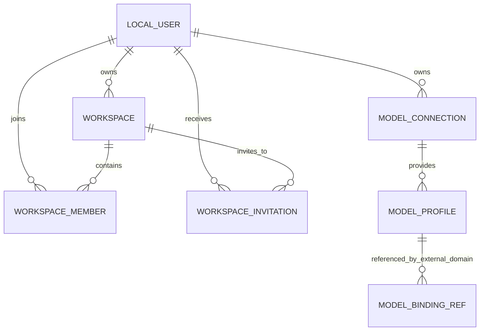
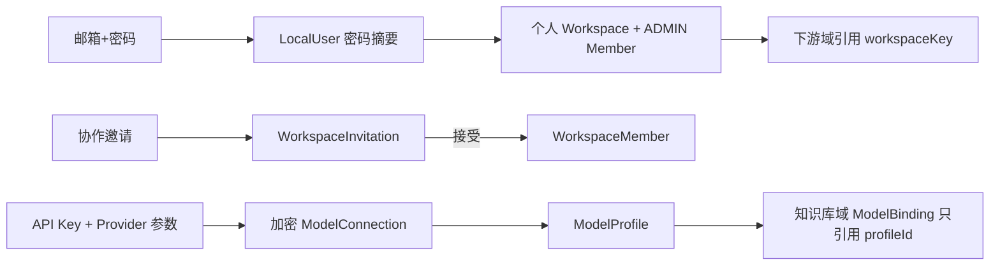

# 用户域数据文档

> 文档层级：领域级  
> 领域名称：用户域  
> 领域标识：`user`  
> 文档状态：已评审  
> 更新日期：2026-08-13

## 1. 数据职责边界

- 本领域拥有的数据：LocalUser、Workspace、WorkspaceMember、WorkspaceInvitation（目标）、ModelConnection、ModelProfile 和会话/认证频控运行数据。
- 外部引用数据：KnowledgeBase 的 workspaceId/workspaceKey 引用；ModelBinding 的 modelProfileId 引用。
- 不归属本领域的数据：KnowledgeBase、SourceDocument、Parse/Chunk/Publication Revision、KnowledgeConcept、QueryTrace、ModelBinding。
- 数据一致性边界：注册时 LocalUser + 个人 Workspace + ADMIN WorkspaceMember 单事务；邀请接受与 WorkspaceMember 创建应单事务；模型凭证与连接元数据同事务更新。

## 2. 业务对象生命周期

| 业务对象 | 产生场景 | 关键状态/字段语义 | 更新场景 | 消费场景 | 终态/归档 | 状态 |
| --- | --- | --- | --- | --- | --- | --- | --- |
| LocalUser | BS-USER-001 | userKey 不可变；email 唯一；passwordHash 敏感；ACTIVE/DISABLED | 资料、密码、最后登录、禁用 | 认证与全域授权 | 注销/保留期待确认 | 已验证 |
| Workspace | BS-USER-001/004 | workspaceKey 不可枚举；ownerUserId 唯一所有者；类型/状态 | 名称、状态、所有权移交 | 下游所有 Workspace 隔离 | 删除规则待确认 | 所有权已确认 |
| WorkspaceMember | BS-USER-001/004 | workspaceId + userId 唯一；role；ACTIVE/DISABLED | 角色变更、停用/恢复 | Workspace 授权 | 停用保留待确认 | 已验证 |
| WorkspaceInvitation | BS-USER-004 | 邀请人、受邀人、空间、预期角色、过期时间和五态 | 接受/拒绝/撤销/过期 | 协作开通和审计 | 保留期待确认 | 目标待实现 |
| ModelConnection | BS-USER-006 | ownerUserId；protocol/baseUrl；密文/nonce/keyVersion/mask；ACTIVE/DISABLED | 连接资料、换 Key、测试结果 | ModelProfile 与受控模型解析 | 有引用时不得删除 | 已验证 |
| ModelProfile | BS-USER-006 | ownerUserId/connectionId/type/modelName/parameters/status | 调参、停用、测试 | 知识库 ModelBinding 引用 | 被绑定时不得删除 | 已验证 |

## 3. 数据关系 ER 图

图示状态：WorkspaceInvitation 为已确认目标数据；MODEL_BINDING_REF 仅表示知识库域的外部引用，不归用户域拥有。

## 4. 业务适配数据差异

| 业务能力 | 适配对象 | 主数据对象 | 适配特有数据 | 状态/字段映射差异 | 外部标识/流水 | 一致性风险 | 适配说明 | 状态 |
| --- | --- | --- | --- | --- | --- | --- | --- | --- |
| 认证 | 邮箱密码 | LocalUser | email/passwordHash/passwordChangedAt | 邮箱不表示已验证所有权 | 无外部身份 | 并发重复邮箱 | `adaptations/email-password-邮箱密码认证业务适配说明.md` | 已验证 |
| Workspace | 个人空间 | Workspace/Member | PERSONAL，owner 同时 ADMIN | 注册时直接 ACTIVE | 无 | 用户/空间/成员半成数据 | 无 | 已验证 |
| Workspace | 协作空间 | Workspace/Invitation/Member | invitationKey/inviter/invitee/role/expiresAt | 邀请五态；成员两态 | 通知流水待确认 | 并发接受与重复成员 | `adaptations/collaborative-workspace-协作空间邀请业务适配说明.md` | 待设计 |
| 模型资源 | OpenAI-compatible | ModelConnection/Profile | baseUrl/protocol/parameters/encrypted API Key | 连接/档案/测试状态 | Provider 无持久外部流水 | 凭证与 nonce 必须一致更新 | `adaptations/openai-compatible-模型资源业务适配说明.md` | 已验证 |

## 5. 数据流转

图示状态：已根据当前数据和用户确认补全。

## 6. SQL/DDL 参考

| 数据库/服务 | 业务模型 | 参考来源 | 数据表 | 处理状态 |
| --- | --- | --- | --- | --- |
| MySQL | LocalUser | `fons4ai-rag2okf-service/sql/init-schema.sql` | `kb_user` | 已有当前结构 |
| MySQL | Workspace/Member | 同上 | `kb_workspace`、`kb_workspace_member` | 已有当前结构；归属修正为用户域 |
| MySQL | WorkspaceInvitation | 用户确认 | 待设计 | 不生成 DDL，待 SDD |
| MySQL | ModelConnection/Profile | 当前 SQL + SDD | `kb_model_connection`、`kb_model_profile` | 已有当前结构 |
| MySQL | ModelBinding | 当前 SQL + 用户确认 | `kb_model_binding` | 表存在，但数据所有权归知识库域 |
| Redis | 会话/频控 | Sa-Token/Redis 配置 | 运行 key | 技术实现，非 MySQL 主数据 |

## 7. 数据质量与治理

| 治理项 | 规则 | 适用对象 | 状态 |
| --- | --- | --- | --- |
| 状态一致性 | 邀请状态不得复用成员状态；接受后才有 ACTIVE Member | Invitation/Member | 用户已确认 |
| 幂等数据 | 规范化 email 唯一；workspaceId+userId 唯一；用户内连接名称唯一 | User/Member/Connection | 部分已由 SQL 约束 |
| 外部流水 | Provider 测试只保存安全化结果，不保存完整外部错误 | ModelConnection/Profile | 已验证 |
| 字段映射 | KnowledgeBase 只引用 workspaceId；ModelBinding 只引用 modelProfileId，不复制 owner 或凭证 | 跨域引用 | 用户已确认 |
| 金额/日期/状态口径 | 本域无金额；所有时间使用统一时区存储策略（具体待项目规则）；状态按显式枚举 | 全部对象 | 时区待确认 |

## 8. 数据安全与合规

| 治理项 | 规则 | 适用对象 | 状态 |
| --- | --- | --- | --- |
| 敏感数据识别 | email、passwordHash、API Key 密文/nonce/keyVersion、token 为敏感数据 | User/Connection/Session | 已验证 |
| 传输安全 | 模型端点只允许受控 HTTPS；token 仅通过认证头传递 | 会话/模型调用 | 已设计，运行态待验证 |
| 存储加密 | 密码不可逆摘要；API Key 使用带随机 nonce 的认证加密；主密钥不入库 | User/Connection | 已验证 |
| 展示/日志脱敏 | 密码、摘要、token、密文和 nonce 零回显/零日志；API Key 仅显示不可逆 mask | UI/API/日志 | 已验证 |
| 数据权限 | 连接/档案只能由所有用户管理；Workspace 资源由所有权+成员角色判定 | Workspace/Model resources | 已确认 |
| 审计与追踪 | 高风险的所有权移交、成员变更、凭证替换应记录操作者和时间，不记录敏感值 | Workspace/Connection | 部分实现，完整审计待设计 |
| 保留期/删除/归档 | 当前不得在有下游引用时直接删除空间、连接或档案；最终保留期待确认 | 全部主对象 | 部分已验证 |

## 9. 待确认事项

| 编号 | 类型 | 问题 | 影响 | 建议处理 |
| --- | --- | --- | --- | --- |
| DQ-USER-001 | DDL | WorkspaceInvitation 字段、索引、唯一性和审计字段 | 邀请并发与追踪 | 邀请功能 SDD 时设计，本次不生成 SQL |
| DQ-USER-002 | 字段语义 | 协作空间最终类型值 | 数据迁移与兼容 | 新需求中确认 |
| DQ-USER-003 | 治理 | 账号、邀请、成员历史、凭证的保留和删除期 | 合规 | 独立数据治理需求 |
| DQ-USER-004 | 数据冲突 | 项目级数据文档仍标记 Workspace 归知识库域 | 长期知识一致性 | 后续显式运行知识汇总统一回写 |
