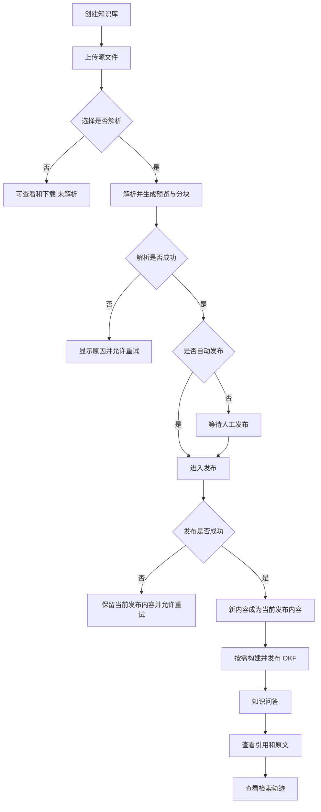

# 项目业务架构文档

> 文档层级：项目级
> 文档状态：初稿
> 更新日期：2026-07-31

## 1. 项目业务定位

- 一句话定位：可追溯、可观察的企业知识库与知识工程平台，提供文档工程、RAG 混合检索、OKF 知识工程和企业级知识管理能力。
- 核心业务目标：让用户看见知识如何被解析、发布、检索、引用和组织成 OKF Knowledge Bundle；证明系统不是只有聊天界面的 RAG Demo，原始文档、解析结果、检索投影和 OKF 知识层边界清楚。
- 主要业务参与方：知识管理员（创建/配置/上传/解析/发布/OKF 构建）、知识用户（问答/查看引用/反馈）。
- 演示业务领域：金融贷款产品、准入政策、业务流程和申请材料（使用合成或公开数据，不使用真实客户隐私）。
- 不在本项目范围内的业务：真实风控决策执行、真实授信建议、复杂组织架构和字段级权限、风控业务 Agent。

## 2. 业务领域总览

| 领域 | 领域职责 | 核心业务能力 | 上游/下游 | 状态 |
| --- | --- | --- | --- | --- |
| 知识库域 | 工作空间隔离、知识库 CRUD、autoParse/autoPublish 配置、默认策略 | 工作空间隔离、知识库管理、默认处理策略 | 下游：文档域 | 已确认 |
| 文档域 | 上传、更新、解析、分块、发布流水线、版本不可变性、ES 投影 | 文件上传与更新、文档解析、分块策略、发布流水线 | 上游：知识库域、用户域；下游：OKF 域、检索域 | 已确认 |
| OKF 域 | 概念提取、跨文档归并、人工确认、Bundle 发布、知识地图 | OKF 概念提取、Bundle 管理、知识地图、OKF 导出 | 上游：文档域；下游：检索域 | 已确认 |
| 检索域 | BM25+向量+RRF+重排、拒答、引用、Query Trace、评测 | 混合检索、引用与拒答、Query Trace、评测与门禁 | 上游：文档域、OKF 域 | 已确认 |
| 用户域 | 邮箱注册/登录、密码摘要、Sa-Token 会话、本地权限、工作空间成员 | 邮箱密码认证、本地权限、会话管理 | 下游：知识库域、文档域 | 已确认 |

## 3. 项目级业务流程

图示状态：已根据事实补全。来源于 `01-产品需求与MVP范围.md` 核心业务闭环和 `02-业务流程与状态模型.md` 状态模型。

### 三维度独立状态

文件状态：AVAILABLE / ARCHIVED / DELETED
解析状态：NOT_STARTED / QUEUED / PARSING / SUCCEEDED / FAILED
RAG 发布状态：UNPUBLISHED / PUBLISHING / PUBLISHED / PUBLISH_FAILED / WITHDRAWN

三个维度不能合并成单一的"文档状态"。

## 4. 跨领域协作

| 协作链路 | 参与领域 | 触发场景 | 关键业务规则 | 状态 |
| --- | --- | --- | --- | --- |
| 上传与解析 | 知识库域 -> 文档域 | 管理员上传文件并选择解析 | autoParse 决定是否自动触发解析；解析只操作 MySQL 和 MinIO，不写 ES | 已确认 |
| 解析与发布 | 文档域内部 | 解析成功后自动或人工发布 | autoPublish 决定是否自动触发；自动发布和人工发布复用同一流水线 | 已确认 |
| 重新分块与发布 | 文档域内部 | 管理员调整分块策略 | 重新分块只替换解析侧分块；当前已发布内容在新分块重新发布成功前保持可用 | 已确认 |
| OKF 构建 | 文档域 -> OKF 域 | 管理员发起 OKF 构建 | OKF 从已解析 ParseRevision 构建，与文档 RAG 发布解耦；候选允许来自已解析但尚未发布的文档 | 已确认 |
| OKF 与问答 | OKF 域 -> 检索域 | 知识用户提问 | Concept 召回 -> 关系扩展 -> 原文 Chunk 召回 -> RRF/重排 -> 基于原文回答并引用 | 已确认 |
| 引用与历史版本 | 检索域 -> 文档域 | 知识用户查看引用 | 回答引用绑定本次使用的 PublicationRevision；旧回答不自动跳转新版本 | 已确认 |
| 认证与授权 | 用户域 -> 知识库域/文档域 | 所有业务操作 | Sa-Token 登录身份 + 本地用户状态 + Workspace Member + 本地角色决定业务权限 | 已确认 |

## 5. 项目级业务规则

| 规则编号 | 规则 | 适用范围 | 证据来源 | 状态 |
| --- | --- | --- | --- | --- |
| BR-001 | 原文件保存、文档解析和知识发布是三个独立步骤，不能合并成一个状态 | 全生命周期 | 产品文档 02-业务流程 | 已确认 |
| BR-002 | 未选择解析的文件只提供查看和下载，不生成解析结果、分块或发布知识 | 上传但不解析 | 产品文档 02-业务流程 | 已确认 |
| BR-003 | 自动发布只有在解析成功后才可触发，解析失败时不得进入发布 | 自动处理 | 产品文档 02-业务流程 | 已确认 |
| BR-004 | 普通上传不按文件名或内容自动合并，相同名称的文件可以作为两个独立文档存在 | 普通上传 | SDD 需求 REQ-004 | 已确认 |
| BR-005 | "更新文件"替换前端当前文件，但系统必须保留可追溯的不可变内容版本；P0 不向用户展示版本号和历史入口 | 更新文件 | SDD 需求 REQ-005 | 已确认 |
| BR-006 | 重新分块属于破坏性派生数据重建，必须先弹窗确认，取消后不得改变任何现有分块 | 重新分块 | SDD 需求 REQ-010 | 已确认 |
| BR-007 | 重新分块删除的是解析侧当前分块；当前已发布内容在新分块重新发布成功前保持可用 | 已发布文档重新分块 | SDD 需求 REQ-011 | 已确认 |
| BR-008 | 新发布失败不得替换当前已发布内容，也不得让两个发布结果同时生效 | 发布与重新发布 | SDD 需求 REQ-009 | 已确认 |
| BR-009 | 发布是可重试、幂等的 Saga/Outbox 流程，不是简单修改 PUBLISHED 状态 | 发布流水线 | 产品文档 02-业务流程 | 已确认 |
| BR-010 | OKF 属于某一个知识库，不能脱离知识库；默认不允许跨知识库 ConceptRelation | OKF 构建 | 产品文档 04-OKF 知识层 | 已确认 |
| BR-011 | OKF 与文档 RAG 发布解耦；统一从 Parsed Document 提取，不要求文档已发布 | OKF 构建 | 产品文档 04-OKF 知识层 | 已确认 |
| BR-012 | LLM 只生成结构化候选，Java 渲染最终 OKF；不能把整个大知识库一次性塞给 LLM | OKF 概念提取 | 产品文档 04-OKF 知识层 | 已确认 |
| BR-013 | 回答引用必须绑定本次实际使用的版本（PublicationRevision），旧回答不能自动跳转到新文档版本 | 引用与历史版本 | 产品文档 02-业务流程 | 已确认 |
| BR-014 | 证据不足时拒答；回答需要引用本次使用的证据；引用校验失败不返回未校验答案 | 知识问答 | 产品文档 03-技术方案 | 已确认 |
| BR-015 | 所有降级必须写入 QueryTrace，不能静默发生 | 检索与问答 | 产品文档 03-技术方案 | 已确认 |
| BR-016 | Rag2OKF 负责本地账号查询和密码校验；密码只能保存为带随机盐的不可逆摘要 | 登录与注册 | SDD 需求 BR-013 | 已确认 |
| BR-017 | 登录成功只证明当前用户身份；知识库业务权限仍由本地账号状态、Workspace Member 和本地角色决定 | 全部业务操作 | SDD 需求 BR-014 | 已确认 |
| BR-018 | 知识库设置变化只影响后续上传或后续明确发起的操作，不自动批量重处理已有文档 | 设置修改 | SDD 需求 BR-011 | 已确认 |
| BR-019 | Elasticsearch 不能成为唯一事实来源，ES 投影是可重建的检索投影 | 存储边界 | 产品文档 02-业务流程 | 已确认 |
| BR-020 | P0 不提供撤回或历史回退入口，也不允许通过其他管理操作隐式模拟撤回 | 发布管理 | SDD 需求 BR-010 | 已确认 |

## 6. 业务适配风险

| 业务能力 | 适配类型 | 典型实现 | 风险 | 是否需要领域建模 |
| --- | --- | --- | --- | --- |
| 文档解析 | Parser Profile | NATIVE_TIKA、MinerU | 可能把单解析器误判为标准；解析质量影响下游 | 是 |
| 分块策略 | Chunk Profile | markdown-header、recursive | 可能把单策略误判为标准；参数影响检索质量 | 是 |
| 发布流水线 | 流程 | Saga/Outbox | 跨资源最终一致性；失败恢复复杂 | 是 |
| OKF 概念提取 | 模型/模板 | 金融概念类型模板（Product/Policy/Rule/Procedure/Material/Definition） | LLM 输出约束；跨文档归并；来源绑定 | 是 |
| 混合检索 | Retrieval Profile | BM25_BASELINE、VECTOR_BASELINE、HYBRID_RRF、HYBRID_RRF_RERANK | 可能把单 Profile 误判为标准；模型未确定 | 是 |
| 认证 | 策略 | 邮箱密码 + Sa-Token | 自有认证；密码安全；频控防枚举 | 是 |
| 本地权限 | 角色 | KNOWLEDGE_USER、KNOWLEDGE_ADMIN | 权限边界；不能信任浏览器传入 | 是 |

## 7. 待确认事项

| 编号 | 问题 | 影响 | 建议处理 |
| --- | --- | --- | --- |
| BQ-001 | 主 LLM/Embedding/Reranker/OKF 概念提取模型未确定 | 检索域、OKF 域适配 | 留待 TV-03/TV-05 技术验证后确认 |
| BQ-002 | ES 中文 Analyzer、向量相似度算法、量化策略未确定 | 检索域适配 | 留待 TV-01 技术验证后确认 |
| BQ-003 | Tika 与 MinerU 的明确适用类型、扫描 PDF 是否进入 P0 | 文档域适配 | 留待 TV-02 技术验证后确认 |
| BQ-004 | OKF Candidate 是否拆分 ReviewStatus 与 ValidationStatus | OKF 域状态模型 | 留待 OKF 领域建模确认 |
| BQ-005 | 撤回发布后是否自动回退到上一 PublicationRevision | 文档域流程 | 当前 P0 延期撤回功能，后续版本设计 |
| BQ-006 | 全局知识问答（多知识库范围）是否进入 P0 | 检索域范围 | 当前 P0 只做知识库内问答，全局跨库延期 |
