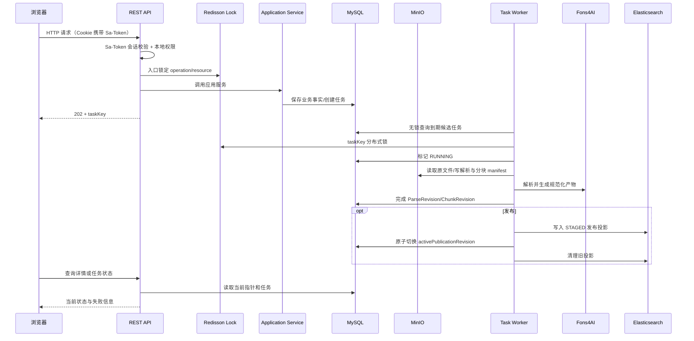

# 项目技术架构文档

> 文档层级：项目级
> 文档状态：初稿
> 更新日期：2026-07-31

## 1. 技术架构总览

- 技术栈：Java 21、Spring Boot 3.5.8、Vue 3、TypeScript 5.8、LangChain4j、MyBatis/MyBatis-Plus、Sa-Token、Redisson、Fons4Cloud（Auth/Lock/DB/File/Elasticsearch/Nacos）、Fons4AI（RAG Common/LangChain4j）
- 存储栈：MySQL（业务事实）、MinIO（不可变内容与大对象）、Elasticsearch 8.18.x（可重建检索投影）、Redis（Sa-Token 会话、频控、Redisson 分布式锁）
- 模块结构：`fons4ai-rag2okf-service`（后端服务）+ `fons4ai-rag2okf-ui`（前端应用）
- 主要运行入口：Spring Boot `KnowledgeEngineApplication`；前端 Vue 3 Vite 应用
- 核心技术模式：DDD-lite（interfaces/application/domain/infrastructure）、Saga/Outbox（发布流水线）、分布式锁（Redisson）、幂等键（Idempotency-Key）、版本化物理索引与别名（ES）
- 外部依赖：Redis、MySQL、MinIO、Elasticsearch；MinerU 可选（Parser Profile 启用时）；认证不依赖外部服务

## 2. 模块职责

| 模块 | 职责 | 主要领域 | 关键入口 | 状态 |
| --- | --- | --- | --- | --- |
| `fons4ai-rag2okf-service/interfaces/rest` | Controller、请求响应模型 | 全部领域 | REST API `/knowledge/api/v1` | 待实现 |
| `fons4ai-rag2okf-service/application` | 用例编排、事务边界、查询服务 | 全部领域 | ApplicationService | 待实现 |
| `fons4ai-rag2okf-service/domain` | 聚合、值对象、规则、端口 | 全部领域 | Domain Model | 待实现 |
| `fons4ai-rag2okf-service/infrastructure` | MySQL、Sa-Token、Redis/Lock、密码摘要、MinIO、ES、Fons4AI、任务 worker | 全部领域 | Repository/Adapter | 待实现 |
| `fons4ai-rag2okf-ui` | 浏览器应用、V4 视觉、三主题 | 前端 | Vue 3 SPA | 待实现 |

后端使用 DDD-lite，领域对象不依赖 MyBatis、MinIO、Elasticsearch 或 LangChain4j 类型；这些依赖只出现在基础设施适配器。

## 3. 项目级调用链

图示状态：已根据事实补全。来源于 SDD 技术设计说明书 2.1 核心异步链路。

### 服务形态与运行态

- 模块形态：独立可运行服务，内部包含 HTTP API 与后台 worker。
- 服务标识：`fons4ai-rag2okf-service`；端口由 `server.port` 配置。
- 配置来源：`local/test/prod` profile；本地配置文件 + Nacos；凭证只从环境或密钥管理注入。
- 注册发现：接入 Fons4Cloud Nacos Starter。
- 健康检查：Spring Boot Actuator liveness/readiness。
- 核心运行链路：HTTP/BFF + MySQL 持久任务 + Fons4Cloud 分布式锁 worker；worker 与 API 可同进程部署。

## 4. 公共技术模式

| 技术模式 | 适用场景 | 公共抽象 | 典型实现 | 注意事项 |
| --- | --- | --- | --- | --- |
| DDD-lite | 后端整体架构 | interfaces/application/domain/infrastructure 分层 | 领域对象不依赖基础设施类型 | 当前为设计目标，待实现验证 |
| Saga/Outbox | 发布流水线 | PublicationApplicationService | 可重试、幂等；ES 暂存写入 -> 校验 -> 激活指针 | 自动发布和人工发布必须复用同一流水线 |
| 分布式锁 | 并发控制 | Fons4Cloud Redisson Lock | 入口锁 operation/resource；taskKey 级别锁 | 不使用 MySQL 行锁抢任务 |
| 幂等键 | 重复提交防护 | Idempotency-Key | 相同用户、资源、动作和 key 返回原任务 | 上传/更新/解析/重新分块/发布均支持 |
| 乐观并发 | 设置与指针操作 | revision 字段 | 冲突返回 HTTP 409 | 更新设置和当前指针操作携带 revision |
| 版本化索引与别名 | ES 索引管理 | kb-chunk-v{n} + read/write 别名 | 模型/Mapping 变化时新建物理索引并切换别名 | 普通发布使用增量写入 |
| 不可变版本 | 文档内容版本 | DocumentVersion | 每次成功上传/更新得到不可变版本 | P0 前端隐藏版本概念 |

## 5. 多实现技术扩展点

| 扩展点 | 业务能力 | 实现类型 | 公共抽象 | 实现目录 | 风险 |
| --- | --- | --- | --- | --- | --- |
| Parser Profile | 文档解析 | Strategy | ParserProfile（NATIVE_TIKA、MINERU 等） | 待实现 | 解析质量影响下游；Tika 与 MinerU 适用类型待 TV-02 确认 |
| Chunk Profile | 文档分块 | Strategy | ChunkProfile（strategy/chunkSize/overlap/titleLevel） | 待实现 | 参数影响检索质量；待 TV-03 校准 |
| Retrieval Profile | 混合检索 | Strategy | RetrievalProfile（BM25_BASELINE/VECTOR_BASELINE/HYBRID_RRF/HYBRID_RRF_RERANK） | 待实现 | 模型未确定；待 TV-03 确认默认 Profile |
| OKF 概念模板 | OKF 概念提取 | Template | 金融概念类型模板（Product/Policy/Rule/Procedure/Material/Definition） | 待实现 | LLM 输出约束；跨文档归并复杂 |
| 认证组件 | 用户认证 | Adapter | LocalAccountRepository/PasswordHasher/SaTokenAuthTemplate/Rag2OkfStpInterface | 待实现 | 自有认证；密码安全；频控防枚举 |
| Embedding 模型 | 向量化 | Strategy | Fons4AI SPI | 待实现 | 模型未确定；待 TV-03 确认 |
| Reranker 模型 | 重排 | Strategy | Fons4AI SPI | 待实现 | 模型未确定；待 TV-03 确认 |

## 6. 项目级非功能约束

| 约束 | 说明 | 当前状态 |
| --- | --- | --- |
| 幂等 | 上传/更新/解析/重新分块/发布支持 Idempotency-Key；相同幂等键重复执行结果一致 | 设计已确认，待实现验证 |
| 事务 | MySQL 事务保证本地一致性；发布使用 Saga/Outbox 跨资源最终一致性 | 设计已确认，待实现验证 |
| 日志与追踪 | 保存 createdBy/updatedBy、task、revision、hash、parser trace 和 publication pointer；不记录文件正文、密码、token、凭证 | 设计已确认，待实现验证 |
| 安全 | 工作空间隔离；密码摘要不可逆；Sa-Token Cookie HttpOnly+Secure+SameSite；登录统一错误防枚举；频控 | 设计已确认，待实现验证 |
| 降级 | Embedding 失败退化为 BM25；BM25 失败退化为向量；Reranker 失败使用 RRF；LLM 失败返回证据或明确失败；所有降级写入 QueryTrace | 设计已确认，待实现验证 |
| 隔离与清理 | 测试使用独立数据库/schema、MinIO 前缀和 ES 索引前缀 | 设计已确认，待实现验证 |

## 7. 待确认事项

| 编号 | 问题 | 影响 | 建议处理 |
| --- | --- | --- | --- |
| TQ-001 | 主 LLM/Embedding/Reranker 模型未确定 | 检索域、OKF 域扩展点 | 留待 TV-03 技术验证后确认 |
| TQ-002 | ES 中文 Analyzer、向量相似度算法、量化策略未确定 | 检索域 ES 索引设计 | 留待 TV-01 技术验证后确认 |
| TQ-003 | Tika 与 MinerU 的明确适用类型未确定 | 文档域 Parser Profile | 留待 TV-02 技术验证后确认 |
| TQ-004 | 单文件大小、页数、解析超时、并发容量阈值未确定 | 文档域非功能约束 | 留待实现验证后校准 |
| TQ-005 | ES 是否单索引多租户还是按规模拆分 | 检索域索引策略 | 留待 TV-01 技术验证后确认 |
| TQ-006 | dense_vector 字段何时加入 ES 索引 | 检索域 ES 索引演进 | 当前 P0 首发只形成 BM25 文本投影；后续 RAG SDD 选择模型后创建 kb-chunk-v2 |
