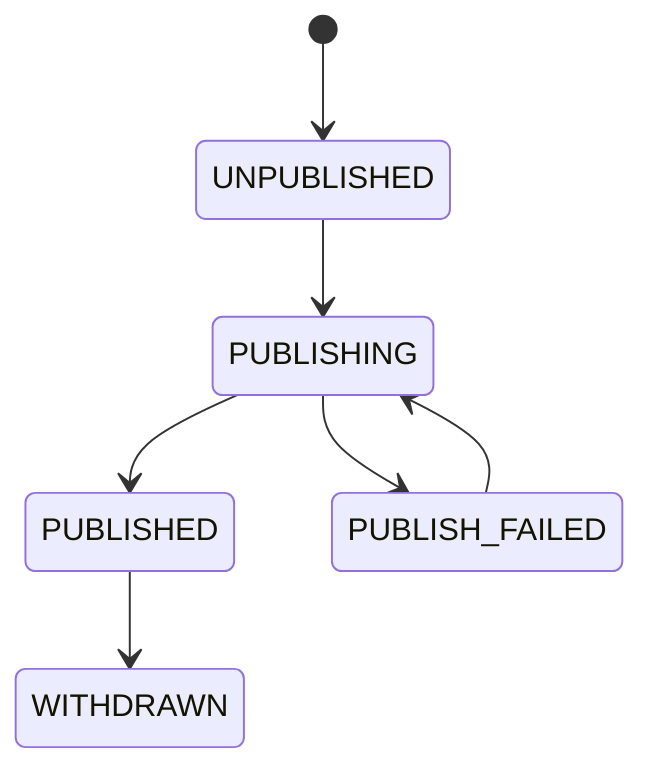
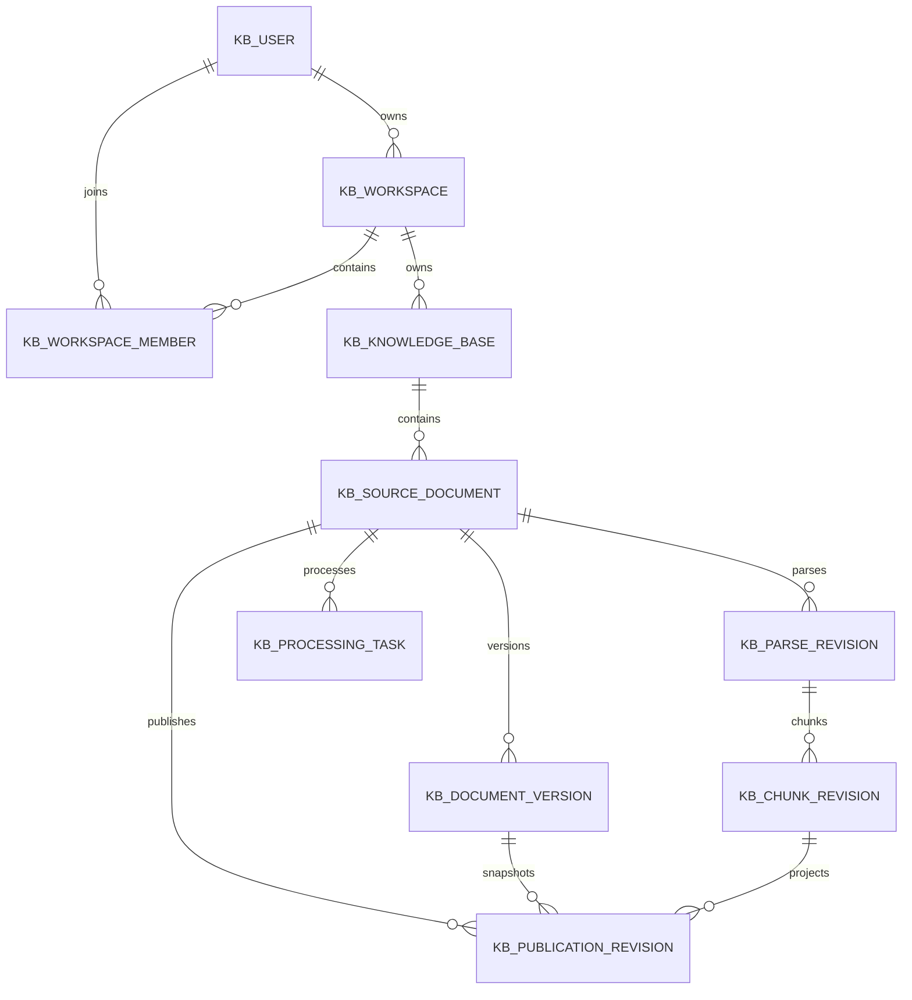
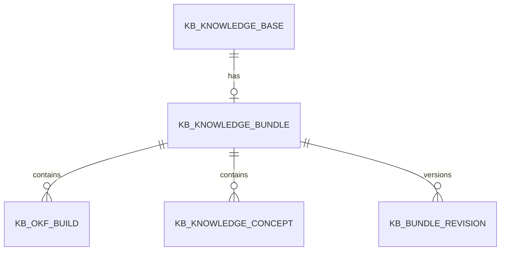
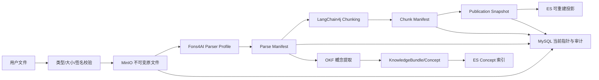

# 项目数据架构文档

> 文档层级：项目级
> 文档状态：初稿
> 更新日期：2026-07-31

## 1. 数据架构定位

- 数据架构目标：明确 MySQL（业务事实）、MinIO（不可变内容）、Elasticsearch（可重建检索投影）三者存储边界，确保 ES 不是唯一事实来源，原始文档是证据，Parsed Block 是结构化解析结果，OKF Concept 是知识库级派生知识，Chunk 与向量是可重建的检索投影。
- 核心数据主线：用户文件 -> MinIO 不可变原文件 -> MySQL 业务事实与指针 -> Fons4AI 解析 -> Parse Manifest -> Chunk Manifest -> Publication Snapshot -> ES 可重建投影。
- 当前数据可信度：SDD 技术设计已确认 11 张 MySQL 表目标结构、MinIO 对象结构和 ES 索引设计；项目尚无源码，所有结构为待实现目标。
- 不在本阶段展开的内容：具体 DDL 不在本阶段生成；模型/Mapping/切分策略重大变化时的索引演进细节留待领域建模。

## 2. 核心业务对象

| 业务对象 | 归属领域 | 业务含义 | 创建来源 | 主要状态 | 消费方 | 可信状态 |
| --- | --- | --- | --- | --- | --- | --- |
| LocalUser | 用户域 | Rag2OKF 本地登录账号 | 用户注册 | ACTIVE | 知识库域、文档域 | 设计已确认 |
| Workspace | 知识库域 | 本地数据隔离边界 | 注册自动创建个人空间 | ACTIVE | 知识库域、文档域 | 设计已确认 |
| WorkspaceMember | 用户域 | 用户到工作空间角色映射 | 注册自动创建 ADMIN | ACTIVE | 知识库域、文档域 | 设计已确认 |
| KnowledgeBase | 知识库域 | 有独立文档、设置和权限范围的知识空间 | 管理员创建 | ACTIVE | 文档域、OKF 域、检索域 | 设计已确认 |
| SourceDocument | 文档域 | 文档逻辑身份和所有"当前"指针 | 管理员上传 | parse_status + publish_status | 文档域、OKF 域、检索域 | 设计已确认 |
| DocumentVersion | 文档域 | 每次成功上传/更新得到的不可变内容版本 | 系统在后台产生 | 不可变 | 文档域、检索域 | 设计已确认 |
| ParseRevision | 文档域 | 不可变解析结果及轨迹 | 解析任务产生 | NOT_STARTED/QUEUED/PARSING/SUCCEEDED/FAILED | 文档域、OKF 域 | 设计已确认 |
| ChunkRevision | 文档域 | 当前解析侧可替换分块集合 | 解析成功或重新分块后产生 | 不可变（按 revision 替换） | 文档域、检索域 | 设计已确认 |
| PublicationRevision | 文档域 | 发布快照和 ES 投影元数据 | 发布任务产生 | UNPUBLISHED/PUBLISHING/PUBLISHED/PUBLISH_FAILED/WITHDRAWN | 检索域 | 设计已确认 |
| ProcessingTask | 文档域 | 异步命令、进度、崩溃恢复元数据 | 用户操作或自动设置触发 | QUEUED/RUNNING/SUCCEEDED/FAILED | 文档域 | 设计已确认 |
| OutboxEvent | 文档域 | 事务内记录后续清理、自动发布与投影事件 | 事务内写入 | PENDING/PUBLISHED | 文档域 | 设计已确认 |
| KnowledgeBundle | OKF 域 | 某个知识库的可移植知识快照 | OKF 构建产生 | 绑定 BundleRevision | OKF 域、检索域 | 设计已确认 |
| KnowledgeConcept | OKF 域 | 面向人和 Agent 的独立知识单元 | OKF 概念提取产生 | PENDING/CONFIRMED/MERGED/EXCLUDED/BLOCKED | OKF 域、检索域 | 设计已确认 |
| OKFBuild | OKF 域 | OKF 构建任务 | 管理员发起 | CREATED/EXTRACTING/CONSOLIDATING/REVIEW_READY/PUBLISHING/PUBLISHED/FAILED | OKF 域 | 设计已确认 |
| QueryTrace | 检索域 | 检索轨迹记录 | 知识问答产生 | 不可变 | 检索域 | 设计已确认 |
| AnswerEvidence | 检索域 | 回答引用证据 | 知识问答产生 | 不可变 | 检索域 | 设计已确认 |

## 3. 业务对象生命周期

| 业务对象 | 创建时机 | 关键状态变化 | 终态 | 主要写入方 | 主要读取方 | 风险 |
| --- | --- | --- | --- | --- | --- | --- |
| SourceDocument | 管理员上传 | parse_status: NOT_STARTED->QUEUED->PARSING->SUCCEEDED/FAILED；publish_status: UNPUBLISHED->PUBLISHING->PUBLISHED/PUBLISH_FAILED | DELETED | 文档域 | 文档域、OKF 域、检索域 | 三维度状态不能合并 |
| DocumentVersion | 每次成功上传/更新 | 不可变，无状态变化 | 不可变 | 文档域 | 文档域、检索域 | 更新失败不切换当前指针 |
| ParseRevision | 解析任务执行 | NOT_STARTED->QUEUED->PARSING->SUCCEEDED/FAILED | FAILED 可重试 | 文档域 worker | 文档域、OKF 域 | 解析失败不能静默视为成功 |
| ChunkRevision | 解析成功或重新分块 | 不可变（按 revision 替换当前指针） | 旧 revision 被清理 | 文档域 worker | 文档域、检索域 | 重新分块只替换解析侧，不影响当前发布 |
| PublicationRevision | 发布任务执行 | UNPUBLISHED->PUBLISHING->PUBLISHED/PUBLISH_FAILED | WITHDRAWN（P0 延期） | 文档域 worker | 检索域 | 新版失败不影响旧版；不能两个同时生效 |
| OKFBuild | 管理员发起 | CREATED->EXTRACTING->CONSOLIDATING->REVIEW_READY->PUBLISHING->PUBLISHED | FAILED | OKF 域 | OKF 域 | 任一阶段失败进入 FAILED |
| KnowledgeConcept | OKF 概念提取 | PENDING->CONFIRMED/MERGED/EXCLUDED/BLOCKED | CONFIRMED 或 EXCLUDED | OKF 域 | OKF 域、检索域 | 状态只表示构建进度，不代表知识可信等级 |

图示状态：已根据事实补全。PublicationRevision 发布状态流转。

## 4. 项目级 ER 关系

图示状态：已根据事实补全。来源于 SDD 技术设计说明书 4.7 ER 设计。

OKF 域 ER 关系（后续领域建模补充）：

## 5. 跨领域数据流

图示状态：已根据事实补全。来源于 SDD 技术设计说明书 4.3 数据流设计，并补充 OKF 数据流。

## 6. 数据所有权与事实源

| 数据对象 | 事实源领域 | 允许写入方 | 只读消费方 | 同步/冗余说明 | 状态 |
| --- | --- | --- | --- | --- | --- |
| LocalUser | 用户域 | 用户域（注册/登录服务） | 知识库域、文档域 | MySQL 主数据 | 设计已确认 |
| Workspace | 知识库域 | 知识库域、用户域（注册创建个人空间） | 文档域、检索域 | MySQL 主数据 | 设计已确认 |
| KnowledgeBase | 知识库域 | 知识库域 | 文档域、OKF 域、检索域 | MySQL 主数据 | 设计已确认 |
| SourceDocument | 文档域 | 文档域 | OKF 域、检索域 | MySQL 主数据；当前指针由文档域管理 | 设计已确认 |
| DocumentVersion | 文档域 | 文档域（上传/更新） | 检索域 | MinIO 不可变内容 + MySQL 元数据 | 设计已确认 |
| ParseRevision | 文档域 | 文档域（解析 worker） | OKF 域 | MinIO Manifest + MySQL 元数据 | 设计已确认 |
| ChunkRevision | 文档域 | 文档域（分块 worker） | 检索域 | MinIO Manifest + MySQL 元数据 | 设计已确认 |
| PublicationRevision | 文档域 | 文档域（发布 worker） | 检索域 | MySQL 元数据 + ES 投影（可重建） | 设计已确认 |
| ES Chunk 投影 | 文档域 | 文档域（发布 worker） | 检索域 | ES 是可重建投影，不是事实源 | 设计已确认 |
| KnowledgeConcept | OKF 域 | OKF 域 | 检索域 | MySQL 主数据 + ES Concept 索引（可重建） | 设计已确认 |
| QueryTrace | 检索域 | 检索域 | 无 | MySQL 摘要 + MinIO 大型调试数据 | 设计已确认 |
| AnswerEvidence | 检索域 | 检索域 | 无 | MySQL 主数据；绑定历史 PublicationRevision | 设计已确认 |
| Sa-Token 会话 | 用户域 | 用户域（Sa-Token Redis DAO） | 全部领域 | Redis 会话；token 不进入 MySQL/日志/前端存储 | 设计已确认 |

## 7. 一致性与补偿风险

| 场景 | 涉及对象 | 一致性要求 | 幂等/补偿方式 | 风险等级 | 待确认问题 |
| --- | --- | --- | --- | --- | --- |
| 发布流水线 | PublicationRevision + ES 投影 + MySQL 指针 | 跨资源最终一致性 | Saga/Outbox；ES 暂存写入 -> 校验 -> 原子切换指针；新版失败保留旧版 | 高 | ES Bulk 部分失败处理；激活前失败恢复 |
| 重新分块 | ChunkRevision + PublicationRevision | 解析侧分块可替换，发布侧不受影响 | 新分块先写临时 manifest，成功后原子切换 ChunkRevision；失败时发布指针不变 | 高 | 旧 Chunk Manifest 清理时机 |
| OKF 构建 | OKFBuild + KnowledgeConcept + BundleRevision | 跨文档归并一致性 | 逐文档 Map -> 知识库级 Consolidation；候选不自动合并 | 高 | LLM 输出约束失败处理 |
| 文件更新 | DocumentVersion + SourceDocument 指针 | 不可变版本 + 当前指针切换 | 新版本写入成功且事务成功时切换；失败不切换 | 中 | 并发更新冲突 |
| 注册事务 | LocalUser + Workspace + WorkspaceMember | 原子创建三对象 | 单个 MySQL 事务；email 唯一索引处理并发重复 | 中 | 事务成功但会话建立失败的恢复 |
| 引用与历史版本 | AnswerEvidence + PublicationRevision | 引用绑定历史版本，不自动跳转 | 旧回答显示提示，分别提供查看当时版本和最新版本 | 中 | 旧版本永久删除后显示"来源已删除" |

## 8. 数据治理规则

| 规则 | 适用对象 | 说明 | 状态 |
| --- | --- | --- | --- |
| DDL 可信源 | 所有持久化对象 | 不从实体/Mapper 推断 DDL；DDL 在实现阶段 T005 隔离迁移验证后写入 `.specify/sql/` | 已验证 |
| 状态字段解释 | 核心状态对象 | 三维度状态（文件/解析/发布）必须能独立解释业务进度 | 待确认 |
| 数据所有权 | 核心业务对象 | MySQL 是事实源，ES 是可重建投影；必须明确事实源，不把同步副本写成主数据 | 待确认 |
| 密码安全 | kb_user.password_hash | 只保存带随机盐的不可逆摘要；明文不得持久化、返回或记录 | 已确认 |
| 会话安全 | Sa-Token 会话 | token 不进入 MySQL、日志或前端持久化存储 | 已确认 |
| 日志脱敏 | 所有日志 | 不记录文件正文、完整邮箱、密码、密码摘要、token、凭证和第三方完整错误 | 已确认 |
| 对象存储安全 | MinIO 原文件 | 私有 bucket；对象 key 只使用系统生成 key；鉴权下载 | 已确认 |
| 旧版本保留 | DocumentVersion/ParseRevision/ChunkRevision/PublicationRevision | 旧版本默认保留，除非执行明确的永久删除操作 | 已确认 |

## 9. DDL/SQL 参考状态

| 数据库/服务 | 业务模型 | 参考来源 | 处理状态 |
| --- | --- | --- | --- |
| MySQL | kb_user 等 11 张表 | SDD 技术设计说明书 4.6 MySQL 目标结构 | 设计已确认，待实现阶段 T003 生成初始迁移 |
| Redis | Sa-Token 会话、认证频控、Redisson Lock | SDD 技术设计说明书 4.5 Redis 认证目标结构 | 设计已确认，待实现验证 |
| MinIO | knowledge-engine 私有 bucket | SDD 技术设计说明书 4.8 MinIO 对象结构 | 设计已确认，待实现验证 |
| Elasticsearch | kb-chunk-v1 + 读写别名 | SDD 技术设计说明书 4.9 ES 索引 | 设计已确认，待 TV-01 验证后锁定 |

说明：本技能不创建、复制、导入或更新 `.specify/sql/**/*.sql`。本章节只记录已有可信设计或数据库 MCP 事实的参考状态。当前项目尚无源码和已执行迁移，所有结构为 SDD 技术设计建议，待实现阶段验证。
