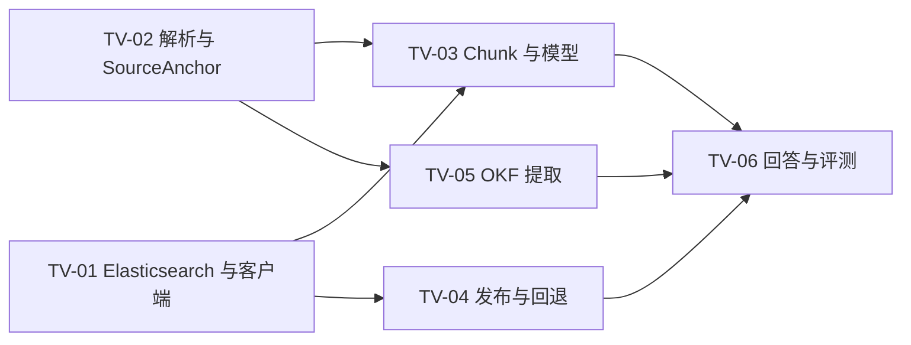

# P0 路线图与技术验证计划

> 状态：候选方案，等待确认。本文只定义实施顺序、验证实验和准入条件，不代表已经授权编码。

## 1. 路线图目标

P0 不是做出所有知识库能力，而是完成一个可演示、可评测、可解释的金融知识工程闭环：

```text
知识库创建
→ 文件上传
→ 解析与原文定位
→ 发布检索索引
→ 混合检索与引用问答
→ OKF 提取、确认与发布
→ 黄金数据集评测
```

完成后应能证明：

- 系统不是只有聊天界面的 RAG Demo；
- 原始文档、解析结果、检索投影和 OKF 知识层边界清楚；
- 回答可以追溯到历史文档版本和原文位置；
- BM25、向量、RRF 和 Rerank 的效果可以被量化比较；
- OKF 能从知识库材料生成，并通过来源绑定供人和 Agent 使用；
- 技术能力通过 Fons4AI SPI 保持可插拔，而不是绑定单一厂商 SDK。

## 2. 范围控制

### 2.1 P0 必须形成闭环

- 单 Workspace、知识管理员和知识用户；
- 知识库创建及 `autoParse`、`autoPublish` 配置；
- PDF、DOCX、Markdown、TXT 上传和原文件查看；
- Parser Profile、解析预览、SourceAnchor 和重新解析；
- 文档版本、ParseRevision、PublicationRevision；
- Parent/Child Chunk、BM25、向量、RRF、Rerank；
- 知识库内问答、证据不足拒答、引用与 Query Trace；
- 知识库级 OKF Build、人工确认、BundleRevision 和导出；
- 20 个 Smoke 用例及可比较的 Evaluation Run；
- V4 亮色、暗色和跟随系统主题。

### 2.2 只验证、不产品化

- Parser、Embedding、Reranker 候选对比；
- Elasticsearch 目标版本、中文分词、向量参数和索引容量；
- 解析与检索性能基线；
- LLM Judge 与人工评分一致性；
- 降级链路和失败注入。

验证代码如果未来获准实施，必须作为独立 Spike 保存结果，不直接演变成无测试的生产实现。

### 2.3 明确延期

- 多 Agent、AgentScope、沙箱和工具执行；
- 风控决策执行和真实授信建议；
- Neo4j、复杂图计算和全局知识图谱；
- 复杂组织、字段级权限和企业连接器；
- 信任等级、新鲜度与冲突自动治理；
- OKF 导入、Git 双向同步和 Attested Computation；
- 扫描件人工 OCR 校正和 Parsed Block 在线编辑。

这些能力属于后续业务 Agent 或 P1/P2，不进入知识库 P0。

## 3. 风险优先的技术验证

技术验证在正式功能实现之前执行。每个实验必须有固定样本、基线、候选、结果记录和明确结论。

### TV-01：Elasticsearch 目标版本与统一客户端

**要回答的问题**

- 从 7.17 升级到哪个受支持版本；
- 官方 Java Client 是否覆盖索引、别名、BM25、向量检索和批量写入；
- Search SPI 能否隐藏 ES 版本差异；
- 中文分词采用哪套组合；
- Parent/Child 采用应用层关联字段还是 ES join/nested。

**候选实验**

```text
Analyzer：官方分析器组合 vs 第三方中文分析器
检索：BM25 vs Vector vs Hybrid RRF
索引：扁平 Child + parentId vs nested/join
客户端：统一 elasticsearch-java
```

**推荐倾向**

- 以 Fons4Cloud 已验证的 `elasticsearch-java` 8.18.8 为客户端基线，首轮验证 8.18.x 同 minor 服务端，优先精确对齐 8.18.8；
- 优先扁平 Child 文档加 `parentId`，Parent 通过应用层批量回查；
- RRF 先放应用层，保证算法可解释并降低 ES 版本耦合；
- 服务端目标 patch 只在制品可用性、插件、客户端和部署环境验证后锁定；
- 禁止新旧 ES Client 长期并存。

**通过条件**

- 20 个 Smoke 用例可完成四种 Retrieval Profile 对比；
- 权限、知识库、版本和发布状态过滤 100% 正确；
- 索引别名切换和旧版本回退可验证；
- Java Client 无阻塞性功能缺口。

### TV-02：文档解析与 SourceAnchor

**要回答的问题**

- Tika 与 MinerU 分别适合哪些文档；
- PDF 页码、标题路径和区域坐标能否稳定保留；
- DOCX、Markdown、TXT 如何形成统一 Parsed Document；
- 表格跨页、合并单元格和列表结构的质量上限。

**样本集**

- 原生文本 PDF；
- 包含复杂表格的 PDF；
- DOCX 制度文件；
- Markdown/TXT FAQ；
- 一份低质量扫描 PDF 仅用于判断是否延期，不要求 P0 解决。

**通过条件**

- 所有支持格式能生成统一 Block Schema；
- 原生 PDF 的页码定位和高亮链路可闭环；
- 表格失败不会静默变成错误文本；
- Parser Profile 选择和失败原因可以追踪。

### TV-03：Chunk、Embedding 与 Reranker

**要回答的问题**

- Parent/Child 大小和重叠范围；
- 中文金融术语的 Embedding 召回能力；
- Reranker 的质量增益是否覆盖延迟和成本；
- 表格、规则清单和普通段落是否需要不同切分策略。

**固定比较**

```text
固定 Parser + 固定 20 个 Smoke 用例
BM25_BASELINE
VECTOR_BASELINE
HYBRID_RRF
HYBRID_RRF_RERANK
```

每轮只改变一个参数。记录 Recall@20、MRR@10、nDCG@10、P95 延迟和单次成本。

**通过条件**

- 选出一个 Embedding 候选和一个备用候选；
- 明确 Reranker 是否进入默认 Profile；
- Parent/Child 默认参数有数据依据；
- 模型切换不改变业务层对象和 API。

### TV-04：发布 Saga、幂等与回退

**要回答的问题**

- MySQL、MinIO、Embedding 和 ES 跨资源流程如何失败恢复；
- 重复消息和重复点击是否产生重复索引；
- 新版本发布失败时旧版本是否继续服务；
- 撤回后是否回到上一版。

**失败注入点**

- Chunk Manifest 保存后失败；
- Embedding 批次中途失败；
- ES Bulk 部分失败；
- 校验通过但激活前失败；
- 激活成功但 Outbox 确认失败。

**通过条件**

- 相同幂等键重复执行结果一致；
- 不产生同时激活的两个 PublicationRevision；
- 新版失败不影响旧版检索；
- MySQL 的活动版本与 ES 可见版本能够对账。

### TV-05：OKF 提取、合并与来源绑定

**要回答的问题**

- 金融概念模板是否足以覆盖首批文档；
- 逐文档提取后如何进行跨文档合并；
- 相同名称、不同版本的规则是否会被错误合并；
- LLM 输出如何受 Schema 约束并绑定 SourceAnchor。

**最小样本**

- 5～8 份存在重复概念和版本差异的文档；
- 人工标注 Product、Policy、Eligibility Rule、Procedure、Material 和 Definition；
- 至少包含一组“同名但不同条件”和一组“新旧制度”。

**通过条件**

- 发布 Concept 的来源绑定有效率 100%；
- 合并只产生建议，不自动破坏不同版本语义；
- Java 可以确定性生成并校验 OKF Bundle；
- Concept 检索可以回到原始文档证据。

### TV-06：回答、引用、拒答与评测

**要回答的问题**

- 引用是否绑定本次使用的历史 PublicationRevision；
- 无答案、越界和证据冲突时能否正确拒答；
- Query Trace 是否足以解释失败；
- LLM Judge 与人工评分是否基本一致。

**通过条件**

- 引用 ID 与 SourceAnchor 可解析率 100%；
- 旧回答查看时不会静默跳到最新版；
- 确定性门禁不依赖 LLM Judge；
- 20 个 Smoke 用例可以输出阶段指标和失败聚类。

## 4. 技术验证顺序



推荐执行波次：

1. 第一波：TV-01 与 TV-02，先消除基础设施和解析结构风险；
2. 第二波：TV-03、TV-04 与 TV-05，分别验证检索质量、发布一致性和知识提取；
3. 第三波：TV-06，组装完整问答、引用和评测闭环；
4. 每一波完成后形成 ADR/Spike Report，失败结论同样必须保留。

## 5. P0 实施阶段

技术验证通过并获得实现授权后，按以下阶段推进。

### M0：设计冻结与演示数据

**交付物**

- 产品、业务、技术、OKF 和评测方案确认；
- 12～20 份公开或合成金融文档；
- 20 个 Smoke 黄金用例；
- 模型和基础设施候选清单；
- P0 验收标准。

**退出条件**：最终决策门通过。当前项目仍处在 M0。

### M1：工程基座与知识库

**交付物**

- Fons4AI 模块边界和 Search/Model/Parser SPI；
- KnowledgeBase、配置、最小 Workspace 和角色；
- MySQL、MinIO、ES 的基础连接与健康检查；
- 异步任务、Outbox、幂等和审计骨架；
- V4 应用壳和主题 Token。

**验收重点**：领域对象不依赖具体 ES 或模型 SDK。

### M2：文档生命周期

**交付物**

- 上传、原文件查看、版本；
- 手动/自动解析；
- Parsed Document、SourceAnchor 和解析预览；
- 手动/自动发布、撤回、失败重试；
- PublicationRevision 与索引别名切换。

**验收重点**：上传、解析、发布三个状态完全独立；发布失败不污染旧版本。

### M3：可引用 RAG

**交付物**

- 四种 Retrieval Profile；
- Parent/Child、RRF、Rerank 和条件式问题改写；
- 证据充分性、拒答、带引用回答；
- Query Trace、降级记录和原文定位；
- 检索实验室。

**验收重点**：同一问题可解释地比较不同 Profile；答案引用可以定位历史证据。

### M4：OKF 知识层

**交付物**

- OKF Build、候选提取、关系和合并建议；
- 人工确认、ConceptRevision、BundleRevision；
- Concept 索引、目录、列表、局部图谱和原文联动；
- OKF v0.2 兼容子集校验与 ZIP 导出。

**验收重点**：Concept 不脱离知识库，发布 Concept 必须有有效来源。

### M5：评测、质量门禁与作品化

**交付物**

- Evaluation Dataset、Run、Result 和 Baseline Comparison；
- 质量链路带、失败聚类和用例明细；
- 120 个完整黄金用例；
- 性能、成本、降级和失败恢复报告；
- 架构图、演示脚本和可复现实验说明。

**验收重点**：作品能够证明为什么选择当前 Parser、Embedding、Reranker 和 Retrieval Profile。

## 6. 纵向切片策略

每个阶段优先完成一条真实链路，再扩充格式和页面：

```text
1 个知识库
+ 1 份原生 PDF
+ 1 次人工解析
+ 1 次人工发布
+ BM25 基线
+ 1 个带引用答案
+ 1 个 Query Trace
```

该最小链路稳定后，再加入 DOCX、自动化、向量检索、Rerank、OKF 和批量评测。这样能够尽早发现版本、来源和存储边界错误。

## 7. 最终决策门

只有以下四个 Gate 全部通过，才建议进入 SDD 和编码。

### Gate A：产品范围

- [ ] P0 只做知识库内问答，不把全局跨库问答作为必选能力；
- [ ] P0 不实现真实风控决策；
- [ ] P0 必须包含 OKF 和最小评测闭环；
- [ ] 首个演示领域固定为小微企业贷款制度知识。

### Gate B：业务与数据模型

- [ ] 上传、解析、发布独立状态确认；
- [ ] DocumentVersion、ParseRevision、PublicationRevision 三层版本确认；
- [ ] OKF 属于知识库并与 RAG 发布解耦；
- [ ] MySQL、MinIO、Elasticsearch 存储边界确认；
- [ ] 撤回和历史引用规则确认。

### Gate C：技术基线

- [ ] Elasticsearch 目标版本和官方 Java Client 通过 TV-01 确认；
- [ ] Parser Profile 与 P0 支持格式通过 TV-02 确认；
- [ ] Embedding、Reranker 和默认 Retrieval Profile 通过 TV-03 确认；
- [ ] 发布 Saga 和回退语义通过 TV-04 确认；
- [ ] OKF 模板和抽取流程通过 TV-05 确认；
- [ ] 回答、引用和评测链路通过 TV-06 确认。

### Gate D：质量与执行授权

- [ ] 20 个 Smoke 用例和候选阈值确认；
- [ ] 无真实客户隐私和真实授信数据；
- [ ] 硬门禁、降级和失败提示确认；
- [ ] P0 验收标准和作品演示脚本确认；
- [ ] 用户明确发出“进入 SDD”或“开始实现”的指令。

## 8. 当前尚需用户决策

### 推荐直接采用

1. P0 只提供知识库内问答；全局跨库问答延期。
2. 首批数据使用公开材料结构的合成金融文档，不使用公司真实制度。
3. 撤回发布后不自动选择历史版本；由管理员明确选择“仅撤回”或“回退到指定版本”。
4. OKF 支持筛选后的批量确认，但不提供无条件“一键确认全部”。
5. 20 个 Smoke 用例先行，验证完成后再扩充到 120 个。

### 必须通过实验决定

1. Elasticsearch 目标版本；
2. 中文 Analyzer；
3. Parser Profile 映射；
4. Embedding 与 Reranker 模型；
5. Chunk 大小、TopK、RRF 和拒答阈值；
6. 候选性能和质量门禁数值。

## 9. 阶段停止条件

在最终决策门通过前：

- 可以继续调研、补充方案、准备合成样本设计和制作原型；
- 可以定义 Spike 实验，但不能编写或执行产品功能实现；
- 不能因为路线图已完成而默认获得编码授权；
- 下一步应逐项确认“推荐直接采用”的五个决策，然后设计首批金融样本文档集。
