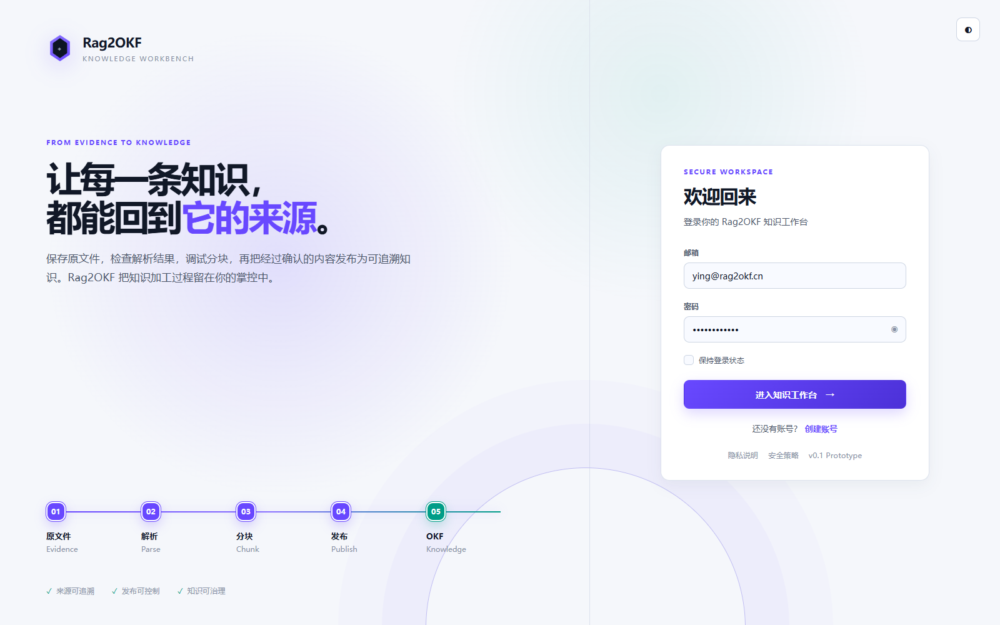
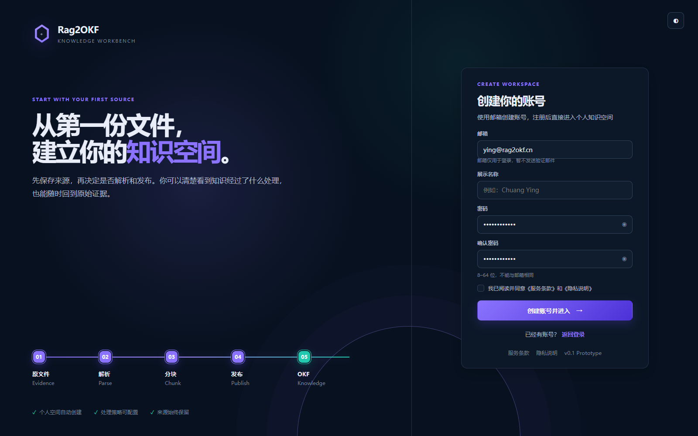
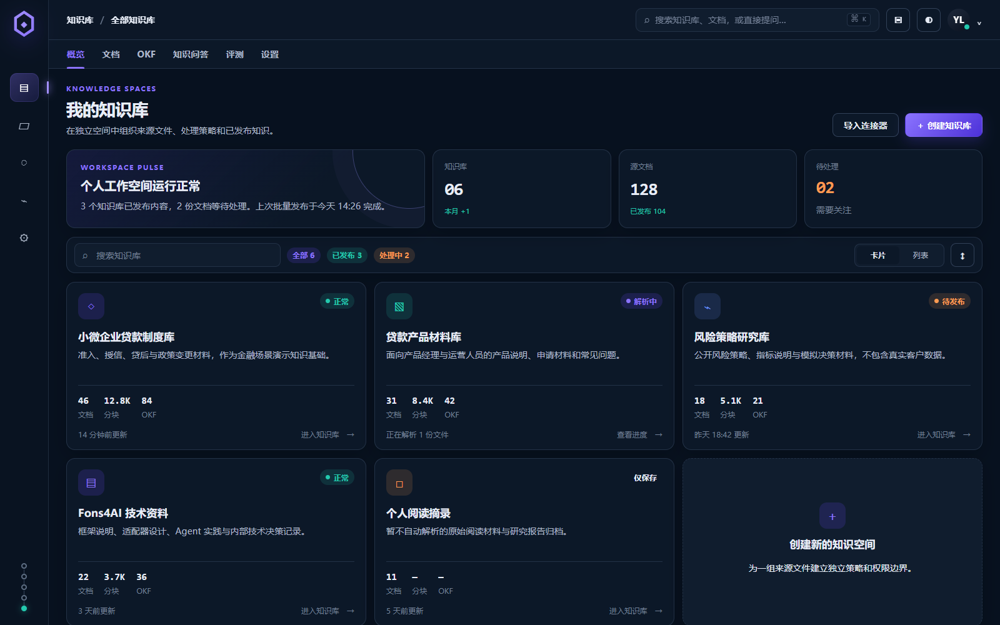
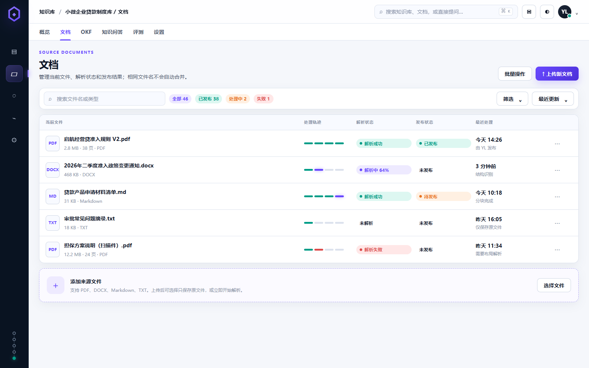
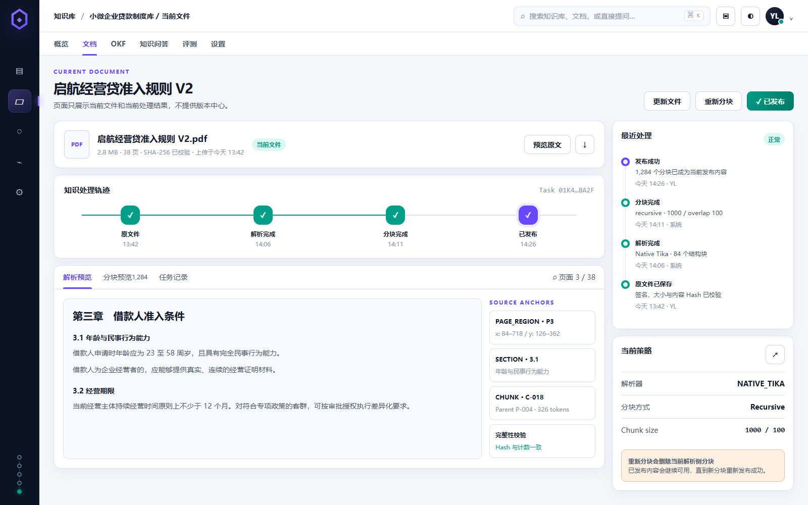
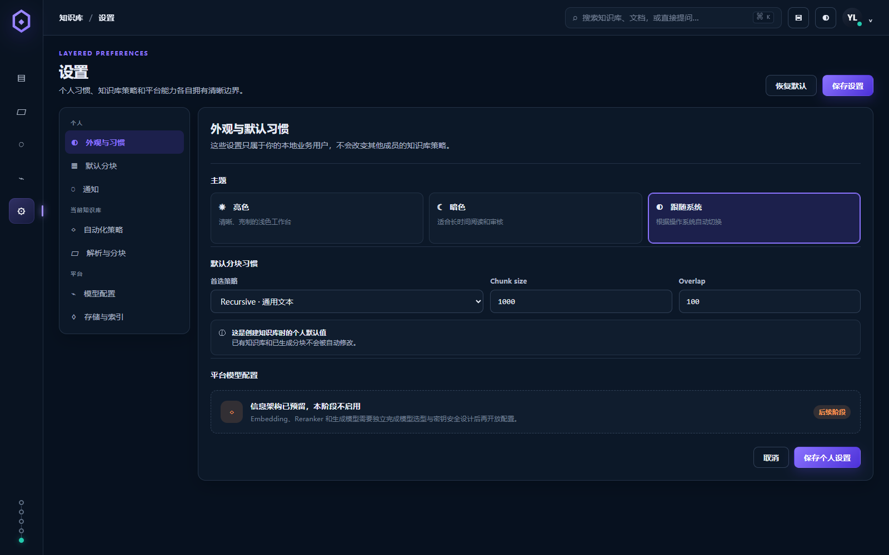
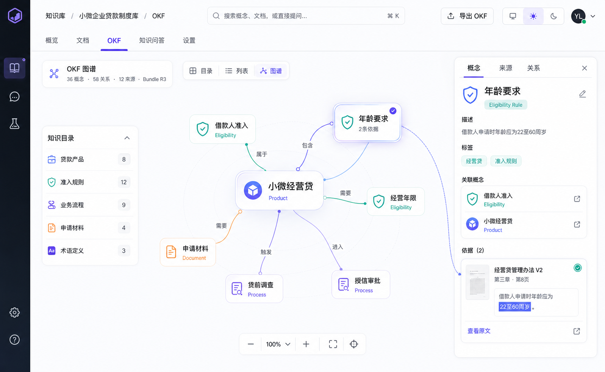
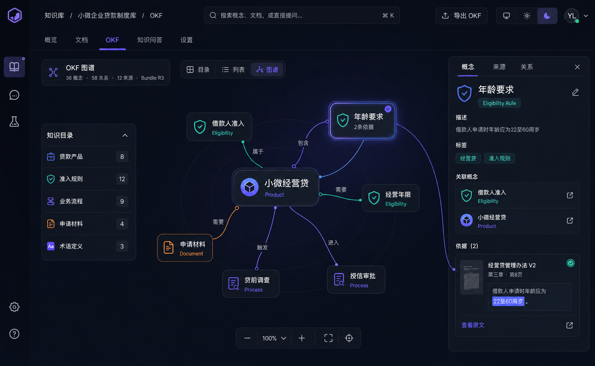
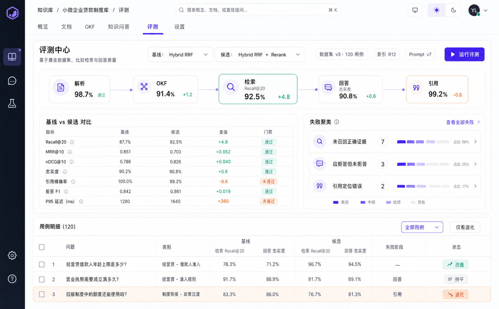
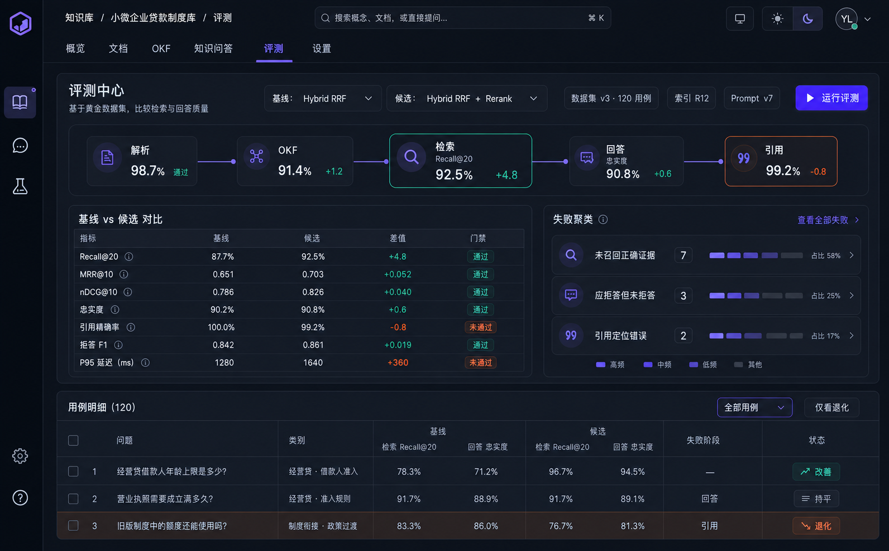

# Rag2OKF 产品设计资料

> 当前阶段：业务调研、方案设计与原型设计。业务方案和技术方案正式确认前，禁止进入功能编码。

本目录集中维护个人/企业知识库项目当前已经讨论并收敛的需求、业务流程、技术方案、OKF 知识层方案、评测方案和视觉原型，避免决策只存在于聊天记录中。

## 当前基线

- 产品定位：可追溯、可观察的企业知识库与知识工程平台。
- 演示领域：金融贷款产品、准入政策、业务流程和申请材料。
- 技术路线：Java + Fons4AI + LangChain4j + Fons4Cloud Auth/Lock + Redis + MySQL + MinIO + Elasticsearch。
- OKF 定位：从属于某一个知识库的派生知识层，不是全局独立功能。
- 视觉基线：采用 V4 Spatial AI Knowledge Workspace，支持亮色、暗色和跟随系统三种主题模式。
- 实现状态：尚未授权编码。

## 文档索引

| 文档 | 说明 |
|---|---|
| [01-产品需求与MVP范围.md](01-产品需求与MVP范围.md) | 产品定位、用户、功能地图、MVP 和延期范围 |
| [02-业务流程与状态模型.md](02-业务流程与状态模型.md) | 上传、解析、发布、OKF 构建、版本和引用流程 |
| [03-技术方案与关键决策.md](03-技术方案与关键决策.md) | 技术栈、存储边界、发布流水线和检索链路 |
| [04-OKF知识层方案.md](04-OKF知识层方案.md) | OKF 生成、概念模板、向量化、发布和产品归属 |
| [05-决策记录与待确认事项.md](05-决策记录与待确认事项.md) | 已确认决策、延期内容和后续决策门 |
| [06-评测体系与黄金数据集.md](06-评测体系与黄金数据集.md) | 分层评测、金融黄金数据集、质量门禁和评测运行模型 |
| [07-P0路线图与技术验证计划.md](07-P0路线图与技术验证计划.md) | P0 阶段、技术 Spike、依赖顺序和最终决策门 |
| [08-金融演示语料与Smoke用例设计.md](08-金融演示语料与Smoke用例设计.md) | 虚构金融事实字典、16 份源文件和首批 20 个 Smoke 用例 |
| [09-样本文档内容规格与证据锚点.md](09-样本文档内容规格与证据锚点.md) | 逐文件章节蓝图、统一模板、证据优先级和 SourceAnchor 规范 |
| [10-OKF构建审核与发布交互方案.md](10-OKF构建审核与发布交互方案.md) | OKF 候选裁决、来源核验、批量操作、发布门禁和交互原型 |
| [11-TV实验矩阵与结果记录模板.md](11-TV实验矩阵与结果记录模板.md) | ES、Parser、模型、发布、OKF 和回答六类技术实验矩阵 |
| [12-TV01-Elasticsearch连接验证方案.md](12-TV01-Elasticsearch连接验证方案.md) | 与 Fons4Cloud 8.18.8 客户端基线一致的连接、索引、BM25、向量和 Alias 验证设计 |

## V4 原型

### 完整应用原型

- [可交互 HTML 原型](prototypes/v4/rag2okf-v4-prototype.html)
- 页面范围：登录、注册、知识库主页、文档列表、文档详情、个人中心、分层设置。
- 每个页面均已输出 1600 × 1000 的亮色和暗色评审图。













### 亮色主题



### 暗色主题



### 评测中心





### OKF 构建审核


主题模式建议使用：

```text
SYSTEM  跟随操作系统
LIGHT   亮色
DARK    暗色
```

## 文档维护规则

1. 已确认事实与候选方案分开记录，不能把讨论中的建议写成最终决策。
2. 新决策需要同步修改相关专题文档和决策记录。
3. 原型发生视觉方向变更时新建版本，不覆盖历史方案。
4. Elasticsearch、模型和解析器等具体版本在验证前不得提前锁死。
5. 未收到明确实现确认前，只允许继续调研、设计、评测方案和原型工作。
