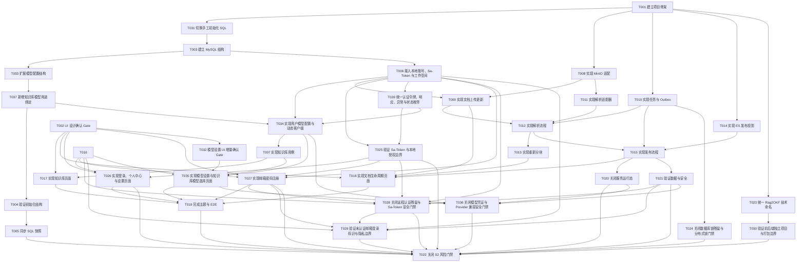

# 知识库文档生命周期任务规划

> 功能标识：`knowledge-base-document-lifecycle`
> SDD 等级：`S2`
> 来源需求：`spec/features/20260731/知识库文档生命周期-需求说明书.md`
> 来源技术设计：`spec/features/20260731/知识库文档生命周期-技术设计说明书.md`
> 文档状态：pending
> 创建日期：2026-07-31
> 更新日期：2026-08-07

## 1. 任务概览

- 总任务数：61。
- 核心路径：T001 → T031 → T003 → T033 → T037 → T006 → T039 → T034 → T007 → T009 → T010 → T012 → T015 → T024 → T020 → T036 → T022。
- 风险任务：T006/T027/T028/T029（邮箱、密码、Sa-Token 会话与未验证邮箱安全边界）、T009（跨 MySQL/MinIO 一致性）、T010/T024（Redisson 多实例互斥）、T015（跨 MySQL/ES 发布切换）、T033/T034/T036/T037（API Key、SSRF、动态模型、用途绑定和跨用户隔离）、T022（S2 风险门禁）。
- 阻塞任务：T002 UI Gate 已通过；T032 的模型配置 UI 增量 Gate 只阻塞 T035，不阻塞后端模型配置实现。
- 可并行分组：
  - T032 与 T031/T003/T008 可并行；
  - T011 与 T014 可在 T010 前后独立开发适配器；
  - T017 与后端后续风险验证可并行。
- Mock/临时实现闭环：无；解析器与存储均使用正式端口和可替换测试替身，不交付未关闭 Mock。
- 可运行服务闭环：有，见 T001、T020、T022。
- DDL/数据结构任务：有，见 T003～T005、T014、T033、T037；完整初始结构包含 `kb_user`、`kb_model_connection`、`kb_model_profile`、`kb_model_binding` 等 14 张表。
- 运行初始化 DML/Seed 任务：不生成固定 Seed；T004 验证“邮箱密码注册原子创建本地用户与个人 Workspace”并记录 DML/Seed 不适用。
- 数据设计与治理任务：有，见 T021。
- 前端实现门禁：T002 已通过；模型设置页面 T035 必须等待 T032 获得用户确认或用户明确选择跳过。

### 1.1 任务依赖图

## 2. 实现确认门禁

- 状态：等待用户确认。
- 本任务规划完成后必须暂停，不得自动执行 T001～T037。
- 规划产物不等于实现授权。
- 用户明确确认执行且未指定任务 ID 时，默认执行全部未完成任务。
- 用户指定任务 ID 时，只执行指定任务及其尚未完成的必要依赖；如果依赖未获授权，先报告。
- “下一步是什么”“继续看”“看看”等不明确指令不得视为实现确认。
- T002 完成文档不等于 UI Gate 关闭；必须记录用户确认或用户明确选择跳过。Rag2OKF 登录、注册、个人中心和设置页必须使用自有邮箱账号体系与页面，不得借用外部认证页面规避该 Gate。
- CR-015 建议使用 `执行 T055-T061` 只授权前端交互优化；未指定任务 ID 的“执行”会选择全部未完成任务，包含 CR-014/T047～T054。

## 3. 任务列表

- [x] T001 建立知识引擎项目骨架与启动入口
  - 通俗解释: 完成后仓库中具有可独立编译的 Java 后端项目和可独立构建的 Vue 前端项目，不再只是设计文档目录。
  - AC: AC-001、AC-003、AC-023、AC-025、AC-026、AC-030、AC-031
  - 来源: 技术设计说明书 §1.2、§2.2～§2.3、D-001、D-008～D-011
  - Files: `fons4ai-rag2okf-service/pom.xml`; `fons4ai-rag2okf-service/src/main/java/com/fons/cloud/ai/rag2okf/Rag2OkfApplication.java`; `fons4ai-rag2okf-ui/package.json`; `fons4ai-rag2okf-ui/index.html`; `fons4ai-rag2okf-ui/src/main.ts`
  - Depends: 无
  - Verification: 分别在后端项目根执行 Maven 聚焦构建、在前端项目根执行类型检查和 Vite 构建；确认仓库根不存在聚合 `pom.xml` 或根 `package.json`，两个项目的启动与测试入口均可被各自构建工具识别。
  - Quality: 仓库根不参与 Maven/Node 构建；后端保持依赖最小化并纳入 `fons4cloud-auth-satoken`、Spring Security Crypto、Common Cache/Lock/Redisson；不得引入 Auth Service API、Communication API 或 Dubbo 认证依赖；遵循 DDD-lite 分层；前端不引入未批准 UI 框架。
  - Done: 两个独立项目骨架、版本属性、测试入口和目录边界齐备；后端 JAR 与前端 `dist/` 可分别构建，仓库根无聚合构建文件。

- [x] T002 [P] 输出 UI 设计方案并等待用户确认
  - 通俗解释: 完成后用户能先确认 Rag2OKF 自有登录/注册页、应用外壳、知识库与文档页面、个人中心、分层设置和重新分块弹窗，再决定是否进入页面编码。
  - AC: AC-003、AC-004、AC-005、AC-009、AC-010、AC-011、AC-012、AC-013、AC-014、AC-017、AC-019、AC-020、AC-023、AC-025、AC-027、AC-029、AC-030、AC-031、AC-032
  - 来源: 技术设计说明书 §9.1
  - Files: `spec/features/20260731/design/知识库文档生命周期-UI设计.md`; `prototypes/v4/`
  - Depends: 无
  - Verification: 由用户确认邮箱密码登录/注册、暂不发送验证邮件说明、应用外壳、知识库、文档列表/详情、个人中心、知识库设置、全局设置的信息架构和关键交互，以及登录失败/限流、三主题、版本隐藏和敏感信息边界；或明确选择跳过。
  - Quality: 延续 V4 视觉基线并遵循前端职责与 DDD-lite 后端边界；登录/注册页面不展示 Sa-Token、密码摘要或内部认证实现，不暗示邮箱已验证；不提供未实现的忘记密码入口；全部业务页面归属 Rag2OKF。
  - Done: UI 设计确认 Gate 已记录为“通过”“有条件通过”或“用户明确跳过”；未确认时 T017～T019、T026～T027 保持未开始。

- [x] T003 建立 MySQL 初始化结构、实体与 Repository
  - 通俗解释: 完成后本地业务用户、知识库、文档当前指针、不可变版本、解析/分块/发布 Revision、任务和 Outbox 有正式持久化结构。
  - AC: AC-001、AC-003、AC-004、AC-008、AC-009、AC-010、AC-017、AC-021、AC-022、AC-023、AC-024、AC-026、AC-028、AC-029
  - 来源: 技术设计说明书 §4.6、§4.7、§4.10
  - Files: `fons4ai-rag2okf-service/sql/init-schema.sql`; `fons4ai-rag2okf-service/src/main/java/com/fons/cloud/ai/rag2okf/infrastructure/persistence/`; `fons4ai-rag2okf-service/src/test/java/com/fons/cloud/ai/rag2okf/infrastructure/persistence/`
  - Depends: T001、T031
  - Verification: 在隔离 MySQL 容器中通过 JDBC 执行手工初始化 SQL，检查 11 张表、`kb_user.email` 规范化唯一约束、`password_hash/password_changed_at`、不存在邮箱验证字段、成员关系、任务恢复字段、业务唯一键、组合索引、乐观锁字段和 Repository 基础读写；确认 `kb_source_document.parse_status` 默认值为 `NOT_STARTED`（与技术设计 §7.1 状态图一致）。
  - Quality: 结构以技术设计表清单为准；实体复用 `CommonEntity`，遵循 DDD-lite Repository 端口，禁止从实体反向猜测 DDL。
  - Done: 手工初始化 SQL、实体、Mapper/Repository 与聚焦测试一致，11 张表无遗漏且任务表不包含数据库抢锁语义。

- [x] T004 确认初始化 SQL 执行状态与初始化策略（已关闭：用户豁免）
  - 通俗解释: 完成后能证明新结构可在隔离环境完整创建，并确认系统不依赖固定账号或 Seed 脚本。
  - AC: AC-001、AC-003、AC-023、AC-026、AC-034
  - 来源: CR-009；技术设计说明书 §4.10、§5.1
  - Files: `fons4ai-rag2okf-service/src/test/java/com/fons/cloud/ai/rag2okf/infrastructure/persistence/KnowledgePersistenceMySqlIT.java`; `fons4ai-rag2okf-service/src/test/java/com/fons/cloud/ai/rag2okf/application/workspace/WorkspaceProvisioningServiceTest.java`
  - Depends: T037
  - 关闭说明: 用户已明确要求不执行此任务；2026-08-03 按用户授权关闭。既有 MySQL MCP 只读复核可作为当前 14 表结构的参考证据，但本任务所要求的隔离容器自动化和首次登录幂等验证未补做，不能将本状态用作发布门禁证据。
  - Verification: 在全新 MySQL 容器通过 JDBC 执行 `sql/init-schema.sql` 并只读检查 14 张表、索引和约束；并发提交大小写不同但规范化后相同的 email 注册时只创建一个本地账号、一个个人 Workspace 和一条管理员成员关系，且密码只保存摘要；模型连接/档案和独立用途绑定结构符合 T033/T037。
  - Quality: 只在隔离测试环境执行，遵循 DDD-lite 用例边界；明确记录运行初始化 DML/Seed 数据“不适用”，不写真实账号、连接或密钥。
  - Done: 初始化 SQL 执行状态有自动化证据；首次登录幂等验证通过；不存在待执行的固定 Seed。

- [x] T005 同步 SQL 当前结构快照（已关闭：用户豁免）
  - 通俗解释: 完成后项目中的 SQL 结构说明与已验证的手工初始化 SQL 保持一致，后续 Agent 不需要从 Java 实体猜表。
  - AC: AC-003、AC-009、AC-023、AC-034
  - 来源: CR-009；技术设计说明书 §4.6、§4.10
  - Files: `.specify/sql/knowledge_engine/knowledge_document_lifecycle.sql`
  - Depends: T004
  - 关闭说明: 用户已明确要求不执行此任务；2026-08-03 按用户授权关闭。未创建 `.specify/sql/knowledge_engine/knowledge_document_lifecycle.sql`，当前唯一结构事实仍为 `fons4ai-rag2okf-service/sql/init-schema.sql`；本关闭不表示 SQL 快照验证已完成，也不能用作发布门禁证据。
  - Verification: 对照已通过的初始化 SQL 与隔离 MySQL schema 导出，确认快照覆盖所有表、字段、索引和约束且不包含工具信息或环境连接信息。
  - Quality: SQL 快照只记录已验证现状，不承载业务实现；结构治理任务不适用 DDD-lite 代码检查。
  - Done: 当前结构快照与手工初始化 SQL 一致，来源和验证日期明确。

- [x] T006 接入本地邮箱密码、Sa-Token 会话与工作空间隔离
  - 通俗解释: 完成后已注册用户可通过 Rag2OKF 自身邮箱密码登录，Sa-Token 维护会话，知识库按本地成员关系和角色授权；新账号、个人 Workspace 和管理员成员关系由 T027 独占创建。
  - AC: AC-001、AC-002、AC-026、AC-027、AC-028、AC-029
  - 来源: 技术设计说明书 §3.2、§3.3、§5.1、§8.2、D-009；CR-010
  - Files: `fons4ai-rag2okf-service/src/main/java/com/fons/cloud/ai/rag2okf/controller/AuthSessionController.java`; `fons4ai-rag2okf-service/src/main/java/com/fons/cloud/ai/rag2okf/controller/UserProfileController.java`; `fons4ai-rag2okf-service/src/main/java/com/fons/cloud/ai/rag2okf/application/identity/AuthenticationApplicationService.java`; `fons4ai-rag2okf-service/src/main/java/com/fons/cloud/ai/rag2okf/application/identity/UserProfileApplicationService.java`; `fons4ai-rag2okf-service/src/main/java/com/fons/cloud/ai/rag2okf/infrastructure/identity/SpringSecurityPasswordHasher.java`; `fons4ai-rag2okf-service/src/main/java/com/fons/cloud/ai/rag2okf/infrastructure/identity/AuthenticationRateLimiter.java`; `fons4ai-rag2okf-service/src/main/java/com/fons/cloud/ai/rag2okf/infrastructure/security/Rag2OkfStpInterface.java`; `fons4ai-rag2okf-service/src/main/java/com/fons/cloud/ai/rag2okf/domain/user/`; `fons4ai-rag2okf-service/src/test/java/com/fons/cloud/ai/rag2okf/security/`
  - Depends: T003
  - Verification: 覆盖邮箱规范化、正确/错误密码、未注册/禁用账号、登录频控、注销、Redis 会话过期、踢下线、`Authentication: Bearer <token>`、本人资料白名单，以及管理员、知识用户和无成员关系用户的越权；注册开通原子性由 T027 覆盖。
  - Quality: Sa-Token loginId 固定使用 userKey；必须提供业务 `StpInterface`；密码使用 DelegatingPasswordEncoder 摘要，完整邮箱/密码明文/摘要/token 不进入日志、响应或浏览器持久化；不得存在 Auth/Communication Dubbo 调用。
  - Done: 已注册本地账号校验、Sa-Token 会话、当前用户资料与工作空间授权 API、权限与安全集成测试全部通过；不实现注册或账号/Workspace/Member 开通。

- [x] T007 实现知识库创建、列表与设置用例
  - 通俗解释: 完成后管理员可创建和修改知识库及自动解析/发布默认设置，普通用户可查看但不能修改。
  - AC: AC-003、AC-004
  - 来源: 技术设计说明书 §3.3、§3.4、§6
  - Files: `fons4ai-rag2okf-service/src/main/java/com/fons/cloud/ai/rag2okf/domain/knowledgebase/`; `fons4ai-rag2okf-service/src/main/java/com/fons/cloud/ai/rag2okf/application/knowledgebase/`; `fons4ai-rag2okf-service/src/main/java/com/fons/cloud/ai/rag2okf/controller/KnowledgeBaseController.java`; `fons4ai-rag2okf-service/src/test/java/com/fons/cloud/ai/rag2okf/application/knowledgebase/`
  - Depends: T006、T034
  - Verification: 创建、分页查询、编辑设置、`ANSWER_GENERATION`/`EMBEDDING` 用途唯一绑定、档案所有权/ACTIVE/类型兼容校验和并发 revision 冲突测试通过；修改设置后旧文档和旧任务输入不变化。
  - Quality: 配置值对象集中校验 chunk 参数，遵循 DDD-lite 聚合边界；避免 Controller 承载业务规则。
  - Done: API 契约、领域规则、持久化和测试覆盖 AC-003/004/034/035，模型设置通过独立用途绑定保存当前用户有权使用的档案引用。

- [x] T008 [P] 实现 MinIO 产物存储与文件安全校验
  - 通俗解释: 完成后系统可安全保存、读取和删除原文件及 manifest，并阻止路径穿越、空文件和伪造类型。
  - AC: AC-005、AC-006、AC-007、AC-014
  - 来源: 技术设计说明书 §4.2、§4.8、§8.2
  - Files: `fons4ai-rag2okf-service/src/main/java/com/fons/cloud/ai/rag2okf/domain/artifact/DocumentArtifactStore.java`; `fons4ai-rag2okf-service/src/main/java/com/fons/cloud/ai/rag2okf/infrastructure/artifact/FonsOssDocumentArtifactStore.java`; `fons4ai-rag2okf-service/src/main/java/com/fons/cloud/ai/rag2okf/application/document/FileValidationPolicy.java`; `fons4ai-rag2okf-service/src/test/java/com/fons/cloud/ai/rag2okf/infrastructure/artifact/`
  - Depends: T001
  - Verification: 使用 MinIO 测试容器验证流式上传/下载、hash、系统对象 key、对象 metadata、失败清理和私有访问；文件类型/大小/签名边界测试通过。
  - Quality: 复用 Fons4Cloud `OssStoreService`，遵循 DDD-lite 端口适配；日志不输出正文、凭证或完整内部地址。
  - Done: 原文件和 manifest 读写契约稳定，安全与故障测试通过。

- [x] T009 实现新文档上传、更新文件与原文件访问
  - 通俗解释: 完成后普通上传始终产生独立文档，“更新文件”只切换当前文件且后端保留不可变版本，页面所需 DTO 不暴露版本历史。
  - AC: AC-005、AC-006、AC-007、AC-008、AC-009、AC-010、AC-013、AC-014
  - 来源: 技术设计说明书 §3.4、§5.2、§5.3、D-004
  - Files: `fons4ai-rag2okf-service/src/main/java/com/fons/cloud/ai/rag2okf/domain/document/`; `fons4ai-rag2okf-service/src/main/java/com/fons/cloud/ai/rag2okf/application/document/`; `fons4ai-rag2okf-service/src/main/java/com/fons/cloud/ai/rag2okf/controller/DocumentController.java`; `fons4ai-rag2okf-service/src/test/java/com/fons/cloud/ai/rag2okf/application/document/`
  - Depends: T003、T006、T008
  - Verification: 同名普通上传两次得到不同 documentKey；更新成功切换当前文件，更新失败/并发冲突保留旧指针；响应和路由无版本列表/回退；授权下载可用。
  - Quality: 文件与数据库采用显式补偿，遵循 DDD-lite 聚合和事务边界；不得把对象存储当业务事实来源。
  - Done: 上传、更新、预览/下载、补偿与契约测试覆盖 AC-005～010/013/014。

- [x] T010 实现 ProcessingTask、Fons4Cloud 分布式锁、幂等与 Outbox 引擎
  - 通俗解释: 完成后解析、重新分块和发布可以异步执行，刷新页面仍能查询进度，重复提交不会产生多个生效结果。
  - AC: AC-011、AC-017、AC-023、AC-024
  - 来源: 技术设计说明书 §5.7、§7.3、§8.3、D-005
  - Files: `fons4ai-rag2okf-service/src/main/java/com/fons/cloud/ai/rag2okf/domain/task/`; `fons4ai-rag2okf-service/src/main/java/com/fons/cloud/ai/rag2okf/application/task/`; `fons4ai-rag2okf-service/src/main/java/com/fons/cloud/ai/rag2okf/infrastructure/task/TaskCandidateScheduler.java`; `fons4ai-rag2okf-service/src/main/java/com/fons/cloud/ai/rag2okf/infrastructure/task/DistributedLockedTaskExecutor.java`; `fons4ai-rag2okf-service/src/test/java/com/fons/cloud/ai/rag2okf/task/`
  - Depends: T003
  - Verification: 多实例同时扫描同一任务时只有一个 taskKey 锁执行；覆盖 waitTime=0、watchdog、AOP 代理、Redis 故障 fail-closed、deadline 恢复、Idempotency-Key、重试退避、重启恢复和 Outbox 至少一次投递。
  - Quality: 禁止 MySQL `FOR UPDATE`、`SKIP LOCKED` 或行锁抢任务；锁入口必须是独立 Spring Bean 的 public 方法；MySQL 只保存状态、幂等和恢复事实；worker 不占用 HTTP 线程。
  - Done: 任务 API、Redisson worker、Outbox、幂等、故障恢复和多实例并发测试全部通过，数据库锁残留为零。

- [x] T011 [P] 实现 Fons4AI 解析、SourceAnchor 与 Parent/Child 分块适配器
  - 通俗解释: 完成后支持文件可通过明确 Parser Profile 生成可追溯解析产物和父子分块，不会伪造页码或静默切换解析器。
  - AC: AC-011、AC-012、AC-014
  - 来源: 技术设计说明书 §5.4、D-003、D-006
  - Files: `fons4ai-rag2okf-service/src/main/java/com/fons/cloud/ai/rag2okf/domain/parsing/`; `fons4ai-rag2okf-service/src/main/java/com/fons/cloud/ai/rag2okf/infrastructure/parsing/Fons4AiDocumentParserAdapter.java`; `fons4ai-rag2okf-service/src/main/java/com/fons/cloud/ai/rag2okf/infrastructure/parsing/LangChain4jChunkerAdapter.java`; `fons4ai-rag2okf-service/src/test/java/com/fons/cloud/ai/rag2okf/infrastructure/parsing/`
  - Depends: T008
  - Verification: TXT、Markdown、DOCX、文本 PDF 样例产生 ParseTrace、block、anchor 和 parent/child chunk；provider 不可用、空产物与无页码场景语义正确。
  - Quality: 复用 Fons4AI Parser SPI 与 LangChain4j Splitter，遵循 DDD-lite 端口适配；不新增第二套解析框架。
  - Done: Parser Profile（NATIVE_TIKA/MINERU_LAYOUT 映射）、ParseManifest/ChunkManifest schema、SourceAnchor NONE 降级、recursive/markdown-header 分块与空产物拒绝测试全部通过（13 个测试，覆盖 AC-003/011/012/014）。

- [x] T012 实现解析任务、预览与失败重试
  - 通俗解释: 完成后管理员可手动或自动解析当前文件，查看处理状态、结构化内容、来源定位、分块预览和明确失败原因。
  - AC: AC-006、AC-011、AC-012、AC-013、AC-014、AC-023、AC-024
  - 来源: 技术设计说明书 §3.3、§5.4、§7.1
  - Files: `fons4ai-rag2okf-service/src/main/java/com/fons/cloud/ai/rag2okf/application/parsing/`; `fons4ai-rag2okf-service/src/main/java/com/fons/cloud/ai/rag2okf/controller/DocumentParseController.java`; `fons4ai-rag2okf-service/src/main/java/com/fons/cloud/ai/rag2okf/infrastructure/task/ParseTaskExecutor.java`; `fons4ai-rag2okf-service/src/test/java/com/fons/cloud/ai/rag2okf/application/parsing/`
  - Depends: T009、T010、T011
  - Verification: 手动/自动触发共用流程；状态依次可观察；成功切换当前 Parse/Chunk；失败保留原文件和旧发布、可重试；SKIP 不返回伪解析数据。
  - Quality: Revision 写入与当前指针切换同事务，遵循 DDD-lite 用例与策略；错误消息安全化。
  - Done: 解析、预览、状态、失败与重试端到端后端测试通过。

- [x] T013 实现重新分块确认与解析侧分块替换
  - 通俗解释: 完成后管理员明确确认后可以只重建分块；成功时删除旧解析侧分块，失败或取消不影响当前发布内容。
  - AC: AC-019、AC-020、AC-021、AC-023、AC-024
  - 来源: 技术设计说明书 §3.4、§5.5、D-003
  - Files: `fons4ai-rag2okf-service/src/main/java/com/fons/cloud/ai/rag2okf/application/chunking/RechunkApplicationService.java`; `fons4ai-rag2okf-service/src/main/java/com/fons/cloud/ai/rag2okf/controller/RechunkController.java`; `fons4ai-rag2okf-service/src/main/java/com/fons/cloud/ai/rag2okf/infrastructure/task/RechunkTaskExecutor.java`; `fons4ai-rag2okf-service/src/test/java/com/fons/cloud/ai/rag2okf/application/chunking/`
  - Depends: T012
  - Verification: confirmed=false 拒绝、取消无请求；revision 冲突返回 409；成功切换新 ChunkRevision 并清理旧 manifest；失败保留旧解析侧当前分块和 active publication。
  - Quality: 通过临时新产物 + CAS 替换降低破坏风险，遵循 DDD-lite RechunkPolicy；技术补偿不暴露成历史回退功能。
  - Done: 确认、并发、成功清理、失败补偿与旧发布稳定性测试通过。

- [x] T014 [P] 建立 Elasticsearch V1 索引与发布投影适配器
  - 通俗解释: 完成后发布分块可以写入带工作空间、文档、Revision 和来源定位的可重建 BM25 索引。
  - AC: AC-016、AC-017、AC-018、AC-021、AC-022、AC-024
  - 来源: 技术设计说明书 §4.9、§5.6、D-002、D-007
  - Files: `fons4ai-rag2okf-service/src/main/resources/elasticsearch/kb-chunk-v1-mapping.json`; `fons4ai-rag2okf-service/src/main/java/com/fons/cloud/ai/rag2okf/domain/publication/PublicationProjectionPort.java`; `fons4ai-rag2okf-service/src/main/java/com/fons/cloud/ai/rag2okf/infrastructure/elasticsearch/ElasticsearchPublicationProjection.java`; `fons4ai-rag2okf-service/src/test/java/com/fons/cloud/ai/rag2okf/infrastructure/elasticsearch/`
  - Depends: T001、T008
  - Verification: 在隔离 ES 8.18.x 容器创建物理索引和读写别名，bulk 写入、count/hash 校验、按 publicationRevisionKey 删除与 workspace 字段映射测试通过。
  - Quality: 只使用 Fons4Cloud 官方客户端模块，遵循 DDD-lite 端口；V1 不创建未确认维度的 dense_vector，不重新引入 Easy-ES。
  - Done: Mapping、别名 bootstrap、投影端口、bulk/cleanup 测试和版本兼容检查通过。

- [x] T015 实现发布 Saga 与当前发布指针切换
  - 通俗解释: 完成后解析成功内容可人工或自动发布；新发布失败时旧内容继续可用，成功后只有新内容成为当前发布。
  - AC: AC-015、AC-016、AC-017、AC-018、AC-021、AC-022、AC-023、AC-024
  - 来源: 技术设计说明书 §5.6、§7.2、§8.3
  - Files: `fons4ai-rag2okf-service/src/main/java/com/fons/cloud/ai/rag2okf/domain/publication/`; `fons4ai-rag2okf-service/src/main/java/com/fons/cloud/ai/rag2okf/application/publication/PublicationApplicationService.java`; `fons4ai-rag2okf-service/src/main/java/com/fons/cloud/ai/rag2okf/infrastructure/task/PublicationTaskExecutor.java`; `fons4ai-rag2okf-service/src/test/java/com/fons/cloud/ai/rag2okf/application/publication/`
  - Depends: T010、T012、T014
  - Verification: 未解析发布被拒绝；人工/自动行为一致；ES 部分失败、DB CAS 冲突和清理失败不切旧指针；成功后 active publication 唯一；重复请求复用任务。
  - Quality: MySQL 是唯一当前发布事实，遵循 DDD-lite PublicationPolicy/Saga；任何补偿不得撤回旧发布。
  - Done: 首次发布、重新发布、故障注入、并发与 Outbox 清理测试通过。

- [x] T016 完成 REST 契约与错误码回归
  - 通俗解释: 完成后前端可依赖稳定的 `/knowledge/api/v1` 接口、统一异步响应和安全错误语义。
  - AC: AC-001、AC-002、AC-003、AC-005、AC-009、AC-011、AC-014、AC-015、AC-017、AC-019、AC-023、AC-024、AC-026、AC-027、AC-029、AC-031～AC-036
  - 来源: 技术设计说明书 §3
  - Files: `fons4ai-rag2okf-service/src/main/java/com/fons/cloud/ai/rag2okf/controller/`; `fons4ai-rag2okf-service/src/main/java/com/fons/cloud/ai/rag2okf/controller/endpoint/`; `fons4ai-rag2okf-service/src/test/java/com/fons/cloud/ai/rag2okf/controller/Rag2OkfApiContractTest.java`
  - Depends: T007、T009、T012、T013、T015、T034
  - Verification: OpenAPI/契约快照覆盖 email/password 登录、邮箱密码注册、Provider 模板/连接、模型档案、模型测试、知识库模型选择、注销、当前用户与业务路径，以及 202/400/401/403/409/429/500、Idempotency-Key、`Authentication: Bearer <token>`、`R<T>` 统一响应、统一认证和模型错误码；确认任何响应不包含 API Key/密文/nonce。
  - Quality: DTO 与领域对象隔离，遵循 DDD-lite 接口边界；统一错误映射，不在 Controller 重复业务判断。
  - Done: 全部接口契约和错误码测试通过，前端调用模型可生成或手写保持一致。

- [x] T017 实现 Rag2OKF 应用壳层、知识库列表与设置页面
  - 通俗解释: 完成后用户可在 Rag2OKF 自有 V4 风格工作台中切换工作空间、查看/创建知识库并编辑自动处理设置。
  - AC: AC-001、AC-002、AC-003、AC-004、AC-025、AC-030
  - 来源: 技术设计说明书 §9.1
  - Files: `fons4ai-rag2okf-ui/src/layouts/Rag2OkfAppShell.vue`; `fons4ai-rag2okf-ui/src/views/knowledge-bases/`; `fons4ai-rag2okf-ui/src/stores/workspace.ts`; `fons4ai-rag2okf-ui/src/api/knowledge-bases.ts`; `fons4ai-rag2okf-ui/src/views/knowledge-bases/__tests__/`
  - Depends: T002、T007、T016
  - Verification: 管理员/知识用户权限显示、创建/编辑、设置只影响后续的提示、加载/空/错误状态与响应式布局测试通过。
  - Quality: 复用组件和 Design Token，前端状态分层清晰；遵循 DDD-lite 后端契约边界，不在 UI 复制服务端权限规则作为唯一防线。
  - Done: 页面与已确认 UI 方案一致，Vitest 与关键交互测试通过。

- [x] T018 实现文档生命周期与任务状态页面
  - 通俗解释: 完成后管理员可上传、更新、解析、查看预览、重新分块、发布和重试，同时页面始终只展示当前文件。
  - AC: AC-005、AC-006、AC-007、AC-008、AC-009、AC-010、AC-011、AC-012、AC-013、AC-014、AC-015、AC-016、AC-017、AC-018、AC-019、AC-020、AC-021、AC-022、AC-023、AC-024、AC-025
  - 来源: 技术设计说明书 §9.1.1、§9.1.2
  - Files: `fons4ai-rag2okf-ui/src/views/documents/`; `fons4ai-rag2okf-ui/src/components/document/`; `fons4ai-rag2okf-ui/src/api/documents.ts`; `fons4ai-rag2okf-ui/src/router/index.ts`; `fons4ai-rag2okf-ui/src/layouts/Rag2OkfAppShell.vue`; `fons4ai-rag2okf-ui/src/views/documents/__tests__/`
  - Depends: T002、T016、T040
  - Verification: 同名上传仍显示两条文档；更新后只显示新当前文件且无版本入口；状态轮询/恢复、预览、失败重试、重新分块 danger Modal、旧发布保持提示和权限禁用测试通过。
  - Quality: 页面严格遵循已确认 UI 设计与后端 DDD-lite 契约；取消重新分块不发请求，状态不用颜色作为唯一表达。
  - Done: 文档列表/详情/上传/设置/弹窗和任务状态完整可操作，组件测试通过。

- [x] T019 完成三主题、可访问性与前端端到端验证
  - 通俗解释: 完成后知识库页面在亮色、暗色和跟随系统主题下保持现代、清晰和可键盘操作。
  - AC: AC-002、AC-010、AC-019、AC-020、AC-025
  - 来源: 技术设计说明书 §9.1.3、§10.1
  - Files: `fons4ai-rag2okf-ui/src/styles/tokens.css`; `fons4ai-rag2okf-ui/src/composables/useTheme.ts`; `fons4ai-rag2okf-ui/e2e/knowledge-document-lifecycle.spec.ts`; `fons4ai-rag2okf-ui/e2e/theme-visual.spec.ts`
  - Depends: T017、T018、T026、T035
  - Verification: Playwright 在三主题和主要 viewport 执行核心链路、键盘焦点、对比度辅助检查和视觉快照；确认无版本/回退/撤回入口。
  - Quality: Design Token 单一来源，遵循前端组件边界和 DDD-lite 后端契约；视觉差异必须人工审查，不盲目更新快照。
  - Done: 三主题视觉回归、键盘路径、核心 E2E 和人工 UI 一致性复核通过。

- [x] T020 补齐服务运行配置并验证注册、健康与核心链路
  - 通俗解释: 完成后服务可以在隔离环境启动、被路由和健康探测，并完成一个上传到发布的最小真实链路。
  - AC: AC-003、AC-005、AC-011、AC-017、AC-023、AC-026、AC-027、AC-031～AC-036
  - 来源: 技术设计说明书 §2.2、§8.4
  - Files: `fons4ai-rag2okf-service/src/main/resources/application.yml`; `fons4ai-rag2okf-service/src/main/resources/application-local.yml`; `fons4ai-rag2okf-service/src/test/java/com/fons/cloud/ai/rag2okf/runtime/Rag2OkfRuntimeIT.java`; `spec/features/20260731/reports/知识库文档生命周期-实施报告.md`
  - Depends: T015、T016、T034
  - Verification: 使用 Redis/Redisson、MySQL、MinIO、ES 和本地 Mock OpenAI-compatible Provider 启动服务，验证配置加载、健康、邮箱密码注册/登录、模型连接/档案测试、Sa-Token 会话、认证频控、分布式锁、上传→解析→发布→状态查询；确认无 Auth/Communication Dubbo、邮件服务 stub 或应用全局模型凭证；P0 不接入 Nacos，使用本地配置文件 + 环境变量。
  - Quality: 区分容器集成证据与真实环境暂缓项，遵循 DDD-lite 运行边界；配置不含真实密钥，外部连接验证不被倒置为 SDD 前置条件。
  - Done: 启动、健康、核心 HTTP API 和外部依赖写入证据已记录；无法验证的真实环境项明确标为暂缓而非伪通过。

- [x] T021 验证字段映射、工作空间安全与数据泄露边界
  - 通俗解释: 完成后可以证明文件名、类型、状态、SourceAnchor 和发布投影映射正确，越权用户与日志都拿不到不该看到的内容。
  - AC: AC-001、AC-002、AC-007、AC-012、AC-014、AC-021、AC-022、AC-024、AC-027、AC-028、AC-029、AC-032、AC-035、AC-036
  - 来源: 技术设计说明书 §4.2、§4.4、§8.2
  - Files: `fons4ai-rag2okf-service/src/test/java/com/fons/cloud/ai/rag2okf/data/ArtifactMappingIT.java`; `fons4ai-rag2okf-service/src/test/java/com/fons/cloud/ai/rag2okf/security/KnowledgeDataSecurityIT.java`; `fons4ai-rag2okf-service/src/test/resources/samples/`
  - Depends: T015、T034
  - Verification: 用两个虚构账号验证完整邮箱在非本人输出和日志中脱敏、password/API Key 明文零日志、password_hash 和 API Key 密文只存在于专用持久字段且不进响应、Sa-Token 零日志/零前端持久化、模型连接/档案跨用户 403/404、文件映射、跨空间授权下载和正文无越权泄露。
  - Quality: 数据口径只来自技术设计，遵循 DDD-lite 端口与访问策略；不编造生产金融合规结论。
  - Done: 字段映射和数据安全自动化检查通过，无未授权明文输出。

- [x] T022 关闭 S2 风险门禁并建立服务级 Evidence Matrix
  - 通俗解释: 完成后可以用完整证据判断功能是否真的可交付，而不是只凭编译通过。
  - AC: AC-001～AC-036
  - 来源: 技术设计说明书 §10
  - Files: `spec/features/20260731/checklists/知识库文档生命周期-S2风险检查清单.md`; `spec/features/20260731/reports/知识库文档生命周期-实施报告.md`; `spec/features/20260731/知识库文档生命周期-任务规划.md`
  - Depends: T005、T019、T020、T021、T024、T025、T026、T027、T028、T029、T030、T036
  - Verification: 执行后端/前端构建、单测、Sa-Token/Redis/MySQL/MinIO/ES/Mock Provider 容器或隔离集成、邮箱规范化与未验证边界、密码/API Key/Bearer token/SSRF 安全、模型 fail-closed、分布式锁并发/故障注入、E2E、视觉与安全回归；Evidence Matrix 覆盖构建、测试、启动、健康、核心链路、外部依赖写入、DDL 状态、UI Gate、人工 Review 和暂缓项。
  - Quality: 按 AC 和风险逐项给出 L1/L2/L3 证据，遵循 DDD-lite/领域模型复核；不得以“记录未验证”代替发布门禁关闭。
  - Done: Spec Review、Code Review、UI Gate、S2 风险清单和 Evidence Matrix 均有结论；只有发布必需项闭合后才标记全部任务完成。

- [x] T023 应用 Rag2OKF 技术命名并关闭旧命名残留
  - 通俗解释: 完成后仓库、后端 Maven 项目、Spring 服务、Java 根包和前端包统一使用 `fons4ai-rag2okf`，不会混用旧项目名。
  - AC: AC-023、AC-025
  - 来源: CR-001
  - Files: `fons4ai-rag2okf-service/pom.xml`; `fons4ai-rag2okf-service/src/main/java/com/fons/cloud/ai/rag2okf/`; `fons4ai-rag2okf-service/src/main/resources/application.yml`; `fons4ai-rag2okf-ui/package.json`; `../.idea/misc.xml`; `../.idea/encodings.xml`; `../.idea/compiler.xml`
  - Depends: T001
  - Verification: 检查 Maven artifactId、`spring.application.name`、Java package、前端 package name 和构建产物名；除 CR 历史说明和本任务验证表达外，搜索确认不存在旧仓库、模块、服务或 Java 根包技术命名残留。
  - Quality: 仅调整技术标识，遵循 DDD-lite 既有包结构；不改变 API 基础路径、领域对象、表名、ES 索引、业务文案或 AC。
  - Done: 新命名构建与运行配置一致，非历史说明中的旧技术命名残留为零；独立产品展示名仍保持待后续设计。

- [x] T024 关闭数据库锁残留并验证 Fons4Cloud 分布式锁门禁
  - 通俗解释: 完成后所有写命令、任务和 Outbox 都在统一的 Redisson 锁入口下互斥，MySQL 不再承担抢锁职责。
  - AC: AC-017、AC-023、AC-024
  - 来源: CR-002；技术设计说明书 §5.7、§5.8、D-005
  - Files: `fons4ai-rag2okf-service/src/main/java/com/fons/cloud/ai/rag2okf/infrastructure/task/DistributedLockedTaskExecutor.java`; `fons4ai-rag2okf-service/src/main/java/com/fons/cloud/ai/rag2okf/infrastructure/lock/`; `fons4ai-rag2okf-service/src/test/java/com/fons/cloud/ai/rag2okf/concurrency/DistributedLockIT.java`
  - Depends: T010、T015
  - Verification: 启动两个服务实例并发提交和扫描相同任务，证明只执行一次；验证 waitTime=0、watchdog、Redis 中断、JVM 中止后的 deadline 恢复和 Outbox eventKey 互斥；静态扫描不得出现 `FOR UPDATE`、`SKIP LOCKED` 或数据库行锁抢任务。
  - Quality: 使用 Fons4Cloud `@DistributeLock`/`LockService`，锁入口必须经 Spring AOP 代理；锁 key 不含完整邮箱、文件名或 token；Redis 故障 fail-closed，禁止回退 MySQL 锁。
  - Done: 多实例、故障恢复和静态禁用项证据齐备；MySQL 仅保留状态、幂等、heartbeat/deadline 和 CAS。

- [x] T025 验证 Sa-Token 登录身份与 Rag2OKF 本地授权边界
  - 通俗解释: 完成后可以证明 Sa-Token 只维护登录态，邮箱密码、用户资料、成员关系和知识库角色都由 Rag2OKF 自己维护。
  - AC: AC-001、AC-002、AC-026、AC-027、AC-028、AC-029、AC-031、AC-032
  - 来源: CR-002；技术设计说明书 §3.2、§5.1、D-009
  - Files: `fons4ai-rag2okf-service/src/test/java/com/fons/cloud/ai/rag2okf/auth/SaTokenAuthenticationBoundaryIT.java`; `fons4ai-rag2okf-service/src/test/java/com/fons/cloud/ai/rag2okf/security/LocalAuthorizationIT.java`; `fons4ai-rag2okf-service/src/test/java/com/fons/cloud/ai/rag2okf/security/AuthSensitiveFieldTest.java`
  - Depends: T006、T016、T021
  - Verification: 覆盖有效/无效邮箱密码、禁用账号、注册、频控、注销、会话过期、踢下线、Sa-Token 默认权限实现替换、登录但无成员仍拒绝，以及邮箱/密码/摘要/token 零越界。
  - Quality: Sa-Token 不承担账号查询或密码匹配；生产只能使用 `Rag2OkfStpInterface`；业务授权只信任 localUser/member/localRole；仅接受 `Authentication: Bearer <token>`，不读取 Cookie，且不得保留 CSRF token 机制。
  - Done: 本地凭证认证、Sa-Token 会话和业务授权边界均有自动化证据，无远程 Auth 残留或敏感字段越界。

- [x] T026 实现 Rag2OKF 登录、个人中心与分层设置页面
  - 通俗解释: 完成后用户不依赖 Fons4Cloud 页面，就能在 Rag2OKF 自有界面登录、维护本地资料与偏好，并区分个人、知识库和平台设置。
  - AC: AC-025、AC-026、AC-027、AC-029、AC-030
  - 来源: CR-002；技术设计说明书 §9.1、D-010
  - Files: `fons4ai-rag2okf-ui/src/views/auth/LoginView.vue`; `fons4ai-rag2okf-ui/src/views/profile/ProfileView.vue`; `fons4ai-rag2okf-ui/src/views/settings/`; `fons4ai-rag2okf-ui/src/stores/session.ts`; `fons4ai-rag2okf-ui/src/api/auth.ts`; `fons4ai-rag2okf-ui/src/views/__tests__/`
  - Depends: T002、T016、T025
  - Verification: 邮箱密码登录成功/失败/限流、会话过期跳转、退出、本人只读邮箱、个人资料/主题/默认分块偏好和知识库设置分层在三主题与主要 viewport 下通过组件/E2E 测试；模型设置页面由 T035 单独实现。
  - Quality: 全部页面由 Rag2OKF 前端提供；不把 email、password、passwordHash 或 Sa-Token 写入 localStorage/sessionStorage；不展示邮箱已验证状态，不提供未实现的忘记密码入口。
  - Done: 页面与用户确认原型一致，登录到知识库的完整路径、个人中心和分层设置均可用，三主题和敏感信息门禁通过。

- [x] T027 实现邮箱密码注册入口与注册页面
  - 通俗解释: 完成后新用户可以在 Rag2OKF 自有页面使用邮箱和密码创建本地账号，无需邮件验证即可直接进入自动创建的个人知识空间。
  - AC: AC-031、AC-032
  - 来源: CR-003～CR-005；技术设计说明书 §3.3、§4.2、§4.6、§9.1
  - Files: `fons4ai-rag2okf-service/src/main/java/com/fons/cloud/ai/rag2okf/controller/RegistrationController.java`; `fons4ai-rag2okf-service/src/main/java/com/fons/cloud/ai/rag2okf/application/identity/RegistrationApplicationService.java`; `fons4ai-rag2okf-service/src/main/java/com/fons/cloud/ai/rag2okf/infrastructure/identity/SpringSecurityPasswordHasher.java`; `fons4ai-rag2okf-service/src/main/java/com/fons/cloud/ai/rag2okf/infrastructure/identity/AuthenticationRateLimiter.java`; `fons4ai-rag2okf-ui/src/views/auth/RegisterView.vue`; `fons4ai-rag2okf-ui/src/api/auth.ts`; `fons4ai-rag2okf-service/src/test/java/com/fons/cloud/ai/rag2okf/registration/`; `fons4ai-rag2okf-ui/src/views/auth/__tests__/`
  - Depends: T002、T006、T016、T025
  - Verification: 覆盖邮箱 trim/整体小写/格式/最大长度与唯一性、密码 8～64 位/不得同邮箱/两次一致、IP/邮箱窗口限流、大小写变体并发重复注册、事务回滚、会话建立失败、本地账号/个人空间原子创建、不发送验证邮件和亮暗主题注册页 E2E。
  - Quality: 使用 DelegatingPasswordEncoder，完整邮箱/password/confirmPassword/passwordHash/token 不进入日志或前端持久化；账号/Workspace/Member 同事务；页面不出现 Sa-Token 或密码摘要说明，并明确邮箱暂未验证。
  - Done: 邮箱密码注册、频控、原子 provisioning、安全测试与用户确认的注册原型一致；成功后直接进入个人知识空间，失败不留下半成数据，也不创建邮箱验证状态。

- [x] T028 关闭远程认证残留并验证 Sa-Token 安全门禁
  - 通俗解释: 完成后知识库只依赖自身邮箱密码和 Sa-Token 会话，不再暗中调用外部认证、短信或邮件服务，并具备可验证的密码与 Bearer token 安全边界。
  - AC: AC-026、AC-027、AC-028、AC-029、AC-031、AC-032
  - 来源: CR-004；技术设计说明书 §3.1～§3.3、§4.4～§4.6、§8.2、D-009
  - Files: `fons4ai-rag2okf-service/pom.xml`; `fons4ai-rag2okf-service/src/main/resources/application.yml`; `fons4ai-rag2okf-service/src/main/java/com/fons/cloud/ai/rag2okf/infrastructure/security/`; `fons4ai-rag2okf-service/src/test/java/com/fons/cloud/ai/rag2okf/security/SaTokenSecurityGateIT.java`; `fons4ai-rag2okf-service/src/test/java/com/fons/cloud/ai/rag2okf/security/RemoteAuthResidueTest.java`
  - Depends: T006、T016、T021、T025、T027
  - Verification: 依赖树与静态扫描确认无 Auth Service API、Communication API、认证 Dubbo adapter、registration-code/email-verification/refresh endpoint、clientSecret、手机号/验证码字段、邮件发送依赖、双重会话、Cookie token 读取和 CSRF token 残留；验证 BCrypt 摘要随机盐、`R<T>` 错误统一、频控、`Authentication: Bearer <token>`、会话过期、注销和禁用账号踢下线。
  - Quality: 只使用 `fons4cloud-auth-satoken` 对外能力，不绕过封装直接散落 `StpUtil`；PasswordHasher、StpInterface 和安全配置集中；默认空权限 Bean 不得在生产生效。
  - Done: 远程认证、短信、邮件、Cookie token 和 CSRF 残留为零，密码、会话、频控、权限和敏感信息门禁全部有自动化证据。

- [x] T029 验证未认证邮箱登录标识与隐私边界
  - 通俗解释: 完成后可以证明邮箱只是唯一登录账号，系统不会发验证邮件、不会假装已经确认邮箱所有权，也不会把邮箱误用于找回密码或身份判断。
  - AC: AC-026、AC-027、AC-029、AC-031、AC-032
  - 来源: CR-005；技术设计说明书 §3.2～§3.3、§4.2、§4.4～§4.6、§8.2、R-015
  - Files: `fons4ai-rag2okf-service/src/test/java/com/fons/cloud/ai/rag2okf/identity/EmailLoginIdentifierPolicyTest.java`; `fons4ai-rag2okf-service/src/test/java/com/fons/cloud/ai/rag2okf/security/UnverifiedEmailBoundaryIT.java`; `fons4ai-rag2okf-ui/src/views/auth/__tests__/EmailRegistrationBoundary.spec.ts`; `fons4ai-rag2okf-ui/e2e/email-registration.spec.ts`
  - Depends: T006、T016、T021、T027、T028
  - Verification: 验证 trim/整体小写/格式/254 字符边界、大小写不敏感唯一性、登录统一错误、注册冲突不确认既有用户身份、零邮件发送调用、零邮箱验证字段/接口/徽标、零密码找回和安全通知入口；本人资料可读完整邮箱，日志和非本人输出使用脱敏邮箱。
  - Quality: 邮箱只作为未核验所有权的登录标识；不得建立 `email_verified`/`verified_at`，不得引入邮件发送依赖，不得从邮箱推导实名身份或可联系性；完整邮箱不进入日志、指标标签和分布式锁 key；复核 DDD-lite 边界，规范化和值约束归属用户域，日志脱敏与频控归属基础设施适配层。
  - Done: 邮箱规范化、唯一性、隐私、UI 文案和未验证能力边界都有自动化证据，产品与接口均不暗示邮箱所有权已确认。

- [x] T030 验证前后端独立项目与打包边界
  - 通俗解释: 完成后可以证明仓库根只是源码和设计容器，后端能够独立产出 JAR，前端能够独立产出供 Nginx 托管的静态资源。
  - AC: AC-023、AC-025
  - 来源: CR-006；技术设计说明书 §1.1～§1.2、§2.3、D-011
  - Files: `fons4ai-rag2okf-service/pom.xml`; `fons4ai-rag2okf-ui/package.json`; `fons4ai-rag2okf-ui/index.html`; `spec/features/20260731/reports/知识库文档生命周期-实施报告.md`
  - Depends: T001、T023
  - Verification: 静态检查仓库根不存在 `pom.xml`/`package.json`；分别从后端和前端项目根执行 package/build；检查后端可执行 JAR、前端 `dist/index.html` 与带 hash 静态资源；确认前端产物未嵌入后端 JAR。
  - Quality: 不引入根 Maven Reactor、Node Workspace 或把前端资源复制到后端 `resources/static`；前后端可独立构建、缓存、发布和回滚，生产通过 Nginx 同源反向代理汇聚；本任务不改变领域模型，DDD-lite 检查仅确认构建结构未反向耦合 domain/application/infrastructure 分层。
  - Done: 双项目根、双构建入口和双产物均有自动化证据，仓库根聚合构建文件与前端入后端包残留为零。

- [x] T031 移除 Flyway 并切换为手工初始化 SQL
  - 通俗解释: 完成后新环境由部署人员手工执行一份完整初始化 SQL，应用启动不改表，自动化测试会验证这份 SQL 确实能创建知识库所需结构。
  - AC: AC-003、AC-009、AC-023
  - 来源: CR-007；技术设计说明书 §4.6、§4.10、D-012
  - Files: `fons4ai-rag2okf-service/pom.xml`; `fons4ai-rag2okf-service/sql/init-schema.sql`; `fons4ai-rag2okf-service/src/main/resources/db/migration/V1__init_knowledge_engine.sql`; `fons4ai-rag2okf-service/src/test/java/com/fons/cloud/ai/rag2okf/infrastructure/persistence/KnowledgeSchemaContractTest.java`; `fons4ai-rag2okf-service/src/test/java/com/fons/cloud/ai/rag2okf/infrastructure/persistence/KnowledgePersistenceMySqlIT.java`
  - Depends: T001
  - Verification: Maven 依赖树和源码扫描不含 Flyway、`flyway_schema_history` 与 `db/migration`；结构契约测试读取 `sql/init-schema.sql`；隔离 MySQL 测试通过 JDBC 执行同一脚本并验证 11 张表、关键约束和 Mapper CRUD；确认应用启动链路不执行 DDL。
  - Quality: 初始化 SQL 只有一个事实来源，不复制为 `schema.sql`；应用与生产运行账号不承担 DDL；测试执行器只负责分隔和执行 SQL，不实现自定义版本管理；遵循 DDD-lite，DDL 交付位于项目级 `sql/`，持久化适配器仍位于 infrastructure。
  - Done: POM 无 Flyway，初始化 SQL 已移动，测试改为 JDBC 复用同一脚本，不生成 Flyway 历史表，应用启动无结构变更行为。

- [x] T032 [P] 输出模型设置 UI 增量方案并等待用户确认
  - 通俗解释: 完成后用户可以先确认 Provider 连接、模型档案、API Key 替换、连接测试和知识库模型选择的页面结构，再决定是否实现。
  - AC: AC-025、AC-030、AC-033、AC-034、AC-036
  - 来源: CR-008、CR-009；技术设计说明书 §9.1；`design/知识库文档生命周期-UI设计.md`
  - Files: `spec/features/20260731/design/知识库文档生命周期-UI设计.md`; `docs/product-design/prototypes/v4/rag2okf-v4-prototype.html`; `docs/product-design/prototypes/v4/`
  - Depends: T002
  - Verification: 用户确认模型设置主从布局、五类模板、Base URL/API Key 表单、只替换不回显、CHAT/EMBEDDING 档案、测试费用提示、知识库按用途绑定回答生成/向量化模型、未来用途扩展表现、三主题和响应式状态；或明确选择跳过。
  - Quality: 延续已确认 V4，不把设置页做成通用表格后台；API Key 无显示原值按钮，错误不展示内部 IP/URL 解析和异常栈；不暗示模板自带模型或免费额度。
  - Done: 模型设置增量 UI Gate 已记录为“通过”“有条件通过”或“用户明确跳过”；未确认时 T035 保持未开始。

- [x] T033 扩展模型配置数据结构与手工初始化 SQL
  - 通俗解释: 完成后数据库可以安全区分用户的 Provider 连接与文本/向量化模型档案，初始化脚本仍然只有一份；知识库模型选择关系由 T037 单独建立。
  - AC: AC-033、AC-034、AC-036
  - 来源: CR-008；技术设计说明书 §4.2～§4.7、D-013
  - Files: `fons4ai-rag2okf-service/sql/init-schema.sql`; `fons4ai-rag2okf-service/src/main/java/com/fons/cloud/ai/rag2okf/infrastructure/persistence/entity/`; `fons4ai-rag2okf-service/src/main/java/com/fons/cloud/ai/rag2okf/infrastructure/persistence/mapper/`; `fons4ai-rag2okf-service/src/test/java/com/fons/cloud/ai/rag2okf/infrastructure/persistence/`
  - Depends: T003、T031
  - Verification: 更新完整初始化 SQL并新增 `kb_model_connection`、`kb_model_profile`；验证所有权/业务唯一键/索引/API Key 密文字段/Mapper CRUD，且 `kb_knowledge_base` 不包含固定模型字段；SQL 中不存在明文 Key、固定 Seed 或 Flyway。
  - Quality: 只更新单一 `sql/init-schema.sql`，不生成第二份 schema；实体复用 `CommonEntity`，凭证字段不进入通用 DTO；不从 Java 类反推 DDL，按技术设计目标结构实现。
  - Done: Provider 连接与模型档案结构在初始化 SQL、实体、Mapper 和结构测试中一致，并为 T037 的独立绑定表提供稳定引用。

- [x] T034 实现用户模型配置、安全凭证与动态 LangChain4j Client
  - 通俗解释: 完成后用户可以保存自己的厂商连接和模型名，Rag2OKF 会安全使用这组配置测试文本/向量模型，不再依赖系统全局模型。
  - AC: AC-033、AC-034、AC-035、AC-036
  - 来源: CR-008；技术设计说明书 §3.3、§4.4、§5.9、§8.2、D-013
  - Files: `fons4ai-rag2okf-service/src/main/java/com/fons/cloud/ai/rag2okf/domain/entity/ModelBinding.java`; `fons4ai-rag2okf-service/src/main/java/com/fons/cloud/ai/rag2okf/domain/service/ModelUsagePolicy.java`; `fons4ai-rag2okf-service/src/main/java/com/fons/cloud/ai/rag2okf/application/model/`; `fons4ai-rag2okf-service/src/main/java/com/fons/cloud/ai/rag2okf/infrastructure/model/`; `fons4ai-rag2okf-service/src/main/java/com/fons/cloud/ai/rag2okf/controller/ModelConfigurationController.java`; `fons4ai-rag2okf-service/src/test/java/com/fons/cloud/ai/rag2okf/application/model/`; `fons4ai-rag2okf-service/src/test/java/com/fons/cloud/ai/rag2okf/infrastructure/model/`; `fons4ai-rag2okf-service/src/test/java/com/fons/cloud/ai/rag2okf/model/`
  - Depends: T006、T037
  - Verification: 覆盖模板/自定义连接、CHAT/EMBEDDING 档案、按 `usageType` 解析唯一有效绑定、用途/模型类型兼容矩阵、AES-GCM 加解密与错误 key version、Key 替换、两用户越权、动态 `baseUrl/apiKey/modelName`、Mock Provider Chat/Embedding、401/429/timeout/维度不匹配、零全局 fallback；SSRF 测试覆盖 IPv4/IPv6 私网、loopback、link-local、重定向和 DNS 重绑定。
  - Quality: 使用 DDD-lite ModelConnection/ModelProfile/ModelBinding 和端口；所有权、ModelUsagePolicy 与 EndpointPolicy 集中；不允许任意请求头/路径/脚本；不把 Client 或明文 Key 放入 Redis/全局 Bean；日志和异常不得包含 Key、Authorization、prompt 或厂商原始响应。
  - Done: Provider/档案 API、CredentialCipher、EndpointPolicy、UserModelResolver、ModelClientFactory 和安全测试通过，应用配置与源码不存在可运行的全局模型 Key。

- [x] T035 实现模型设置与知识库模型选择页面
  - 通俗解释: 完成后用户可以在已确认的 V4 页面中管理自己的模型连接和档案，并为知识库选择文本模型与向量化模型。
  - AC: AC-025、AC-030、AC-033、AC-034、AC-035、AC-036
  - 来源: CR-008、CR-009；技术设计说明书 §9.1；T032 UI Gate
  - Files: `fons4ai-rag2okf-ui/src/views/settings/models/`; `fons4ai-rag2okf-ui/src/components/model/`; `fons4ai-rag2okf-ui/src/api/models.ts`; `fons4ai-rag2okf-ui/src/views/knowledge-bases/`; `fons4ai-rag2okf-ui/src/views/settings/models/__tests__/`; `fons4ai-rag2okf-ui/e2e/model-settings.spec.ts`
  - Depends: T007、T016、T032、T034
  - Verification: 模板预填、自定义 Base URL、Key 创建/替换、保存后掩码、CHAT/EMBEDDING 档案、测试费用提示、安全化结果、按用途展示回答生成/向量化绑定、不兼容档案禁选、缺失/停用引导、两用户不可见和三主题/响应式/E2E 测试通过；浏览器存储和 DOM 快照无 Key。
  - Quality: 严格复用 V4 Token 和 T032 确认布局；不提供显示原 Key、复制原 Key或任意 Header 编辑器；前端权限不是唯一安全防线；不把厂商图标和模板写死为业务枚举之外的调用逻辑。
  - Done: 页面与 UI Gate 一致，用户模型配置到知识库用途绑定形成完整可操作路径，新增用途不依赖知识库固定字段，组件/E2E/敏感信息扫描通过。

- [x] T036 关闭模型凭证、出站访问与 Provider 兼容安全门禁
  - 通俗解释: 完成后可以证明用户的 API Key 不会泄露，自定义地址不能访问受保护内网，并且常见厂商模板和自定义协议失败时不会偷偷换模型。
  - AC: AC-033、AC-034、AC-035、AC-036
  - 来源: CR-008、CR-009；技术设计说明书 §8.2、§10.3、R-016～R-020
  - Files: `fons4ai-rag2okf-service/src/test/java/com/fons/cloud/ai/rag2okf/security/ModelCredentialSecurityGateIT.java`; `fons4ai-rag2okf-service/src/test/java/com/fons/cloud/ai/rag2okf/model/OpenAiCompatibleProviderContractTest.java`; `fons4ai-rag2okf-ui/e2e/model-settings.spec.ts`; `spec/features/20260731/checklists/知识库文档生命周期-S2风险检查清单.md`; `spec/features/20260731/reports/知识库文档生命周期-实施报告.md`
  - Depends: T020、T021、T034、T035
  - Verification: 使用 Mock Provider 完成模板契约、Chat/Embedding 请求、Key 轮换、401/429/timeout、跨用户、用途绑定唯一/兼容/缺失、零固定知识库模型字段、零明文/密文响应与日志、SSRF/DNS/redirect 防护、无 `langchain4j.open-ai.*` 全局 Key 和 fail-closed 扫描；真实厂商仅由用户在页面自愿测试，不把真实 Key 写入测试。
  - Quality: 证据区分官方模板事实、Mock 契约与用户真实连接；不得在报告保存 Base URL 私有地址、完整错误或凭证；未验证厂商不标记完全兼容。
  - Done: R-016～R-020 和 AC-033～AC-036 有自动化/人工 Gate 证据，API Key、SSRF、用途绑定、跨用户和 fallback 风险全部关闭后才能进入 T022。

- [x] T037 新增知识库模型独立用途绑定结构
  - 通俗解释: 完成后知识库通过独立关系按用途选择模型，后续增加重排、视觉理解或 OKF 提取模型时不再修改知识库主表。
  - AC: AC-034、AC-035
  - 来源: CR-009；技术设计说明书 §3.3～§3.4、§4.2、§4.5～§4.7、§5.9、D-013
  - Files: `fons4ai-rag2okf-service/sql/init-schema.sql`; `fons4ai-rag2okf-service/src/main/java/com/fons/cloud/ai/rag2okf/domain/entity/ModelBinding.java`; `fons4ai-rag2okf-service/src/main/java/com/fons/cloud/ai/rag2okf/infrastructure/persistence/entity/ModelBindingEntity.java`; `fons4ai-rag2okf-service/src/main/java/com/fons/cloud/ai/rag2okf/infrastructure/persistence/mapper/ModelBindingMapper.java`; `fons4ai-rag2okf-service/src/test/java/com/fons/cloud/ai/rag2okf/model/ModelBindingPersistenceIT.java`; `.specify/sql/knowledge_engine/knowledge_document_lifecycle.sql`
  - Depends: T033
  - Verification: 更新未执行的完整初始化 SQL，新增 `kb_model_binding`，确认 `kb_knowledge_base` 没有固定模型字段；隔离 MySQL 共创建 14 张表，并验证 bindingKey、同知识库同 usageType 唯一、模型档案索引、并发原位更新、所有权和用途/模型类型兼容矩阵；T004 确认执行状态后由 T005 同步 SQL 当前结构快照。
  - Quality: `ModelBinding` 与 `ModelUsagePolicy` 遵循 DDD-lite，绑定表不复制 owner/API Key；`usage_type` 使用受控应用枚举且不设数据库 CHECK，新增用途必须同时提供 Client Adapter 和兼容测试；不从实体/Mapper 反推 DDL。
  - Done: 14 表目标初始化 SQL、独立绑定实体/Mapper/Repository 和结构测试一致；固定模型字段残留为零，T004/T005 可继续关闭 DDL 执行与快照门禁。

- [x] T038 验证认证与注册职责边界
  - 通俗解释: 完成后可以证明登录不会创建新账号或个人空间，注册才是唯一的账号开通入口，避免重复创建和安全规则分叉。
  - AC: AC-026、AC-027、AC-028、AC-029、AC-031、AC-032
  - 来源: CR-010
  - Files: `fons4ai-rag2okf-service/src/test/java/com/fons/cloud/ai/rag2okf/security/AuthenticationRegistrationBoundaryTest.java`
  - Depends: T006、T027
  - Verification: 自动化验证 `AuthSessionController` 与登录应用服务只校验既有本地账号并建立/注销会话；仅注册控制器和注册应用服务可以创建本地用户、个人 Workspace 与管理员成员关系，且注册事务提交后才建立会话。
  - Quality: 使用 DDD-lite 分层测试验证职责边界；不得通过反射或字符串断言替代真实应用服务行为，不记录邮箱、密码、摘要或 token。
  - Done: 登录与注册开通入口的唯一性、事务边界和敏感信息边界均有自动化证据。

- [x] T039 统一认证令牌、响应报文、异常端点与状态枚举
  - 通俗解释: 完成后，用户从登录响应取得 token，并在后续请求中显式携带 `Authentication: Bearer <token>`；所有认证和资料接口都返回统一报文，错误不再散落在各个 Controller 中，状态判断也不再依赖容易拼错的字符串。
  - AC: AC-026、AC-027、AC-028、AC-029
  - 来源: CR-011；技术设计说明书 §3.2、§3.3、§8.1
  - Files: `fons4ai-rag2okf-service/src/main/java/com/fons/cloud/ai/rag2okf/controller/AuthSessionController.java`; `fons4ai-rag2okf-service/src/main/java/com/fons/cloud/ai/rag2okf/controller/UserProfileController.java`; `fons4ai-rag2okf-service/src/main/java/com/fons/cloud/ai/rag2okf/controller/endpoint/`; `fons4ai-rag2okf-service/src/main/java/com/fons/cloud/ai/rag2okf/application/identity/AuthenticationApplicationService.java`; `fons4ai-rag2okf-service/src/main/java/com/fons/cloud/ai/rag2okf/application/identity/UserProfileApplicationService.java`; `fons4ai-rag2okf-service/src/main/java/com/fons/cloud/ai/rag2okf/domain/entity/KbUserEntity.java`; `fons4ai-rag2okf-service/src/main/java/com/fons/cloud/ai/rag2okf/domain/entity/KbWorkspaceEntity.java`; `fons4ai-rag2okf-service/src/main/java/com/fons/cloud/ai/rag2okf/domain/entity/KbWorkspaceMemberEntity.java`; `fons4ai-rag2okf-service/src/main/java/com/fons/cloud/ai/rag2okf/domain/user/`; `fons4ai-rag2okf-service/src/main/java/com/fons/cloud/ai/rag2okf/infrastructure/security/`; `fons4ai-rag2okf-service/src/main/resources/application.yml`; `fons4ai-rag2okf-service/src/test/java/com/fons/cloud/ai/rag2okf/`
  - Depends: T006
  - Verification: 自动化验证 `POST /auth/login` 返回 `R<T>` 且仅在 data 中返回 token；`POST /auth/logout`、`GET/PATCH /users/me` 始终返回 `R<T>`；仅 `Authentication: Bearer <token>` 可恢复会话，Cookie、缺失 token、错误前缀和无效 token 均不能通过；`/auth/csrf`、CSRF token、拦截器和 Controller 本地异常处理残留为零；401/403/429/400/500 统一由异常端点返回 `R<T>` 且不泄露账号、频控或堆栈细节；用户、工作空间、成员状态以及空间类型和角色均通过枚举映射与测试覆盖。
  - Quality: 复用 Fons4Cloud `R<T>`、`ResultCode` 与全局异常处理语义；Controller 只承担 HTTP 入参/出参转换，禁止 `ResponseEntity`、本地 `@ExceptionHandler`、手写字符串状态比较和直接 `Enum.valueOf`；Sa-Token 只从 `Authentication` Header 读取，token 不记录到日志、MySQL、异常消息或浏览器持久化存储；不变更 MySQL VARCHAR 代码值、表结构、Redis 频控 key 或会话 TTL 语义。
  - Done: 认证 API 契约、统一响应、异常端点、Bearer Header、枚举状态映射及回归测试全部通过，且现有 Controller 保持 `com.fons.cloud.ai.rag2okf.controller` 包位置。

- [x] T040 补齐文档列表、当前文件令牌与最近任务摘要契约
  - 通俗解释: 完成后文档页面刷新仍能获取同一知识库下的当前文件、处理状态、失败原因和最近任务；管理员可以用不可展示的当前文件令牌安全更新文件，但页面始终不出现版本概念。
  - AC: AC-005、AC-009、AC-010、AC-011、AC-014、AC-017、AC-018、AC-023、AC-024
  - 来源: CR-012；技术设计说明书 §3.3、§3.4
  - Files: `fons4ai-rag2okf-service/src/main/java/com/fons/cloud/ai/rag2okf/application/document/DocumentApplicationService.java`; `fons4ai-rag2okf-service/src/main/java/com/fons/cloud/ai/rag2okf/application/task/TaskApplicationService.java`; `fons4ai-rag2okf-service/src/main/java/com/fons/cloud/ai/rag2okf/common/request/`; `fons4ai-rag2okf-service/src/main/java/com/fons/cloud/ai/rag2okf/common/response/`; `fons4ai-rag2okf-service/src/main/java/com/fons/cloud/ai/rag2okf/controller/DocumentController.java`; `fons4ai-rag2okf-service/src/test/java/com/fons/cloud/ai/rag2okf/application/document/`; `fons4ai-rag2okf-service/src/test/java/com/fons/cloud/ai/rag2okf/controller/`
  - Depends: T009、T010、T012、T013、T015、T016
  - Verification: 验证同一知识库分页列表只返回当前文件数据、同名文档保留两条记录、跨知识库/无成员查询拒绝、`currentFileToken` 可完成 CAS 更新但响应和页面 DTO 无版本列表；刷新后返回最近任务并可查询/重试；发布失败且存在 active publication 时返回保留提示字段；检查无 N+1 查询实现和无 DDL 变更。
  - Quality: 复用 `R<T>`、`PageResponse`、MyBatis-Plus 和现有 `WorkspaceAccessPolicy`；Controller 只做协议适配，应用服务批量组装当前文件和任务摘要；令牌仅用于并发控制，不展示、不持久化到浏览器、不写入日志，不泄露 object key、payload、执行实例或历史版本。
  - Done: 文档应用服务聚焦测试与解析应用服务聚焦测试通过；前端已基于正式契约完成 T018。Controller 的完整 MockMvc 契约回归留待 T020。

- [x] T041 调整 D-007 约束与向量化范围声明
  - 通俗解释: 把"不做向量化"改为"发布时同步做向量化"，并记录变更依据。
  - AC: AC-015、AC-016、AC-017、AC-018、AC-021、AC-022
  - 来源: CR-013；技术设计说明书 D-007、§5.6、非目标清单
  - Files: `spec/features/20260731/知识库文档生命周期-技术设计说明书.md`
  - Depends: 无
  - Verification: D-007 条目从 BM25-only 更新为 BM25+dense_vector；非目标清单移除"文档向量化执行"；CR-013 记录含决策依据（发布时同步执行+阻塞发布+单维度 dims=1024+模型由登录用户配置）。
  - Quality: 不改动其他设计约束；CR 记录格式与 CR-001～CR-012 一致；决策依据完整可追溯。

- [x] T042 ES mapping 加 dense_vector 与 dims 注入
  - 通俗解释: ES 索引加向量字段，维度从配置读，启动时检查一致。
  - AC: AC-016、AC-022
  - 来源: CR-013；技术设计说明书 D-007、§5.6
  - Files: `fons4ai-rag2okf-service/src/main/resources/elasticsearch/kb-chunk-v1-mapping.json`; `fons4ai-rag2okf-service/src/main/java/com/fons/cloud/ai/rag2okf/infrastructure/elasticsearch/ElasticsearchPublicationProjection.java`; `fons4ai-rag2okf-service/src/main/resources/application.yml`
  - Depends: T041
  - Verification: mapping JSON 含 `vector`(dense_vector, index=true, similarity=cosine)；`bootstrapIndex` 从 `rag2okf.embedding.dims` 读取并注入 dims；启动校验 mapping dims==配置值，不一致启动失败；application.yml 加 `rag2okf.embedding.dims: 1024`。
  - Quality: dims 注入不硬编码；不重新引入 Easy-ES；复用官方 ElasticsearchClient；strict dynamic 不破坏。

- [x] T043 知识库 EMBEDDING 绑定维度校验
  - 通俗解释: 用户给知识库绑向量化模型时，维度必须和系统一致，否则不让绑。
  - AC: AC-033、AC-034
  - 来源: CR-013；技术设计说明书 §3.5 模型配置
  - Files: `fons4ai-rag2okf-service/src/main/java/com/fons/cloud/ai/rag2okf/application/model/ModelConfigurationApplicationService.java`
  - Depends: T041
  - Verification: 维度匹配绑定成功；不匹配返回明确错误码；跨用户隔离不变；现有绑定不受影响。
  - Quality: 复用 `ModelConfigurationApplicationService` 校验逻辑；错误码符合统一规范；绑定表不复制 owner/API Key。

- [x] T044 发布流程接入向量化（embedProjections）
  - 通俗解释: 发布时先用用户的向量化模型算向量，再写到 ES，失败就发布失败。
  - AC: AC-015、AC-016、AC-017、AC-018、AC-021、AC-022
  - 来源: CR-013；技术设计说明书 §5.6
  - Files: `fons4ai-rag2okf-service/src/main/java/com/fons/cloud/ai/rag2okf/infrastructure/task/PublicationTaskExecutor.java`; `fons4ai-rag2okf-service/src/main/java/com/fons/cloud/ai/rag2okf/application/model/ModelClientFactory.java`
  - Depends: T042、T043
  - Verification: 向量化成功→ES 含 vector；embedding 失败→发布失败旧发布保持；skipEmbedding chunk vector=null；维度不匹配→FatalFailure；Mock EmbeddingModel 单测通过。
  - Quality: 不注册全局 EmbeddingModel Bean；apiKey 调用栈暂存不持久化；复用 `ModelClientFactory`；不破坏现有发布 Saga（CAS 指针切换、Outbox 清理）。

- [x] T045 向量化单元测试与契约回归
  - 通俗解释: 给向量化逻辑补全测试，确保不破坏现有功能。
  - AC: AC-016、AC-017、AC-018、AC-022
  - 来源: CR-013
  - Files: `fons4ai-rag2okf-service/src/test/java/com/fons/cloud/ai/rag2okf/infrastructure/task/PublicationTaskExecutorTest.java`; `fons4ai-rag2okf-service/src/test/java/com/fons/cloud/ai/rag2okf/infrastructure/elasticsearch/ElasticsearchPublicationProjectionTest.java`; `fons4ai-rag2okf-service/src/test/java/com/fons/cloud/ai/rag2okf/controller/Rag2OkfApiContractTest.java`
  - Depends: T044
  - Verification: 测试覆盖向量化成功/失败阻塞/skipEmbedding/维度不匹配；Mock EmbeddingModel 不真实调 LLM；回归现有 172 项测试不退化。
  - Quality: 测试不依赖真实 ES/LLM；lenient stubbing 避免不必要的 stub 异常。

- [x] T046 文档更新与实施报告
  - 通俗解释: 更新文档反映向量化改动。
  - AC: 无新增
  - 来源: CR-013
  - Files: `spec/features/20260731/知识库文档生命周期-技术设计说明书.md`; `spec/features/20260731/知识库文档生命周期-任务规划.md`; `spec/features/20260731/reports/知识库文档生命周期-实施报告.md`
  - Depends: T041、T042、T043、T044、T045
  - Verification: 技术设计说明书 §5.6 加向量化步骤；ES 字段清单加 vector；任务规划标记 T041-T045 完成；实施报告追加章节。
  - Quality: 不创建新文档文件，只更新已有；文档与代码一致。

- [x] T047 DDL 草案：删版本表、合并文件字段到文档表、加 folder_path
  - 通俗解释: 删除 kb_document_version 表，把文件元数据直接合并到 kb_source_document，并新增 folder_path 字段。
  - AC: AC-037、AC-038、AC-041
  - 来源: CR-014
  - Files: `fons4ai-rag2okf-service/sql/migrations/20260806-cr014-merge-version-and-folder.sql`; `fons4ai-rag2okf-service/sql/init-schema.sql`
  - Depends: 无（T031 已完成，init-schema.sql 为唯一结构事实来源）
  - Verification: DDL 草案删除 kb_document_version 表；kb_source_document 新增 object_key/original_filename/content_type/file_extension/size_bytes/sha256/file_token/folder_path/upload_actor_id，删除 current_document_version_id；kb_parse_revision 删除 document_version_id 和相关索引；kb_publication_revision 删除 document_version_id；init-schema.sql 同步更新为 13 张表。
  - Quality: DDL 不含 MCP 标识；agent 不直接执行 DDL；folder_path 默认 '/' 兼容根级。

- [x] T048 删除 Version 实体/Mapper/DomainService，合并字段到 SourceDocument
  - 通俗解释: 删除 KbDocumentVersionEntity 等代码，把文件字段加到 KbSourceDocumentEntity 上。
  - AC: AC-041
  - 来源: CR-014
  - Files: `KbSourceDocumentEntity.java`; `KbDocumentVersionEntity.java`(删除); `KbDocumentVersionMapper.java`(删除); `KbDocumentVersionDomainServiceImpl.java`(删除); `DocumentDetailResponse.java`; `DocumentListResponse.java`
  - Depends: T047
  - Verification: KbSourceDocumentEntity 包含 9 个新字段，不再有 currentDocumentVersionId；Version 相关类已删除；编译通过。
  - Quality: 删除的类无其他引用残留；响应 DTO 从 document 取值而非 version。

- [x] T049 重写上传/更新/下载链路（去版本表）
  - 通俗解释: 上传文件直接写文档表，更新文件覆盖字段并删旧 MinIO 对象，下载从文档表取 objectKey。
  - AC: AC-041
  - 来源: CR-014
  - Files: `DocumentApplicationService.java`; `DocumentController.java`; `FonsOssDocumentArtifactStore.java`; `DocumentArtifactStore.java`
  - Depends: T048
  - Verification: 上传不再创建 Version 行；更新文件用 fileToken CAS 校验后覆盖 Document 字段，先传新对象再删旧对象；下载从 Document.objectKey 读取；MinIO 路径去掉 versions/{versionKey} 段。
  - Quality: 更新文件时清空 parse/chunk 指针但保留 active_publication_revision_id；fileToken 每次更新重新生成。

- [x] T050 适配解析链路（versionKey -> documentKey）
  - 通俗解释: 解析任务从文档表直接取文件信息，不再加载 Version。
  - AC: AC-041
  - 来源: CR-014
  - Files: `ParseApplicationService.java`; `ParseTaskPayload.java`; `ParseTaskExecutor.java`; `Fons4AiDocumentParserAdapter.java`; `ParseManifest.java`; `KbParseRevisionEntity.java`
  - Depends: T049
  - Verification: ParseTaskPayload 用 documentKey 替代 documentVersionId/versionKey；ParseRevision 创建时不设 documentVersionId；ParserAdapter 用 documentKey 构造 ArtifactReference；ParseManifest 字段改名；编译和单元测试通过。
  - Quality: 幂等键从 versionKey 改为 documentKey；payload 快照仍冻结 documentKey 保证重试一致。

- [x] T051 适配发布链路（versionKey -> documentKey + ES 字段）
  - 通俗解释: 发布任务从文档表直接取文件信息，ES 投影字段同步改名。
  - AC: AC-041
  - 来源: CR-014
  - Files: `PublicationApplicationService.java`; `PublicationTaskPayload.java`; `PublicationTaskExecutor.java`; `PublicationManifest.java`; `PublicationProjectionPort.java`; `ElasticsearchPublicationProjection.java`; `KbPublicationRevisionEntity.java`
  - Depends: T050
  - Verification: PublicationTaskPayload 用 documentKey 替代 documentVersionId/versionKey；PublicationRevision 创建时不设 documentVersionId；ES 投影字段从 documentVersionKey 改为 documentKey；PublicationManifest 字段改名；编译和单元测试通过。
  - Quality: 重新分块链路零改动（不依赖 document_version）；ES mapping 字段同步更新。

- [x] T052 新增文件夹路径与批量上传 API
  - 通俗解释: 后端新增 folder_path 支持，上传/列表按文件夹筛选，新增批量上传端点。
  - AC: AC-037、AC-038、AC-039
  - 来源: CR-014
  - Files: `DocumentController.java`; `DocumentApplicationService.java`; `documents.ts`
  - Depends: T049
  - Verification: 上传文档支持 folder_path 参数（不传默认 '/'）；列表按 folder_path 精确匹配筛选；批量上传端点接收多文件+相对路径，自动写入 folder_path；单次限制 50 文件/200MB。
  - Quality: folder_path 校验不含 '..' 和 null 字符；批量上传为单文件上传的复用；部分失败时已成功文件不回滚。

- [x] T053 前端文件夹树视图与批量上传交互
  - 通俗解释: 文档工作台增加文件夹导航、面包屑和批量上传入口。
  - AC: AC-037、AC-038、AC-039、AC-040
  - 来源: CR-014
  - Files: `DocumentsView.vue`; `documents.ts`
  - Depends: T052
  - Verification: 文件夹列表从文档 folder_path 去重聚合渲染；点击文件夹切换列表；面包屑显示完整路径；上传时可选目标文件夹；批量上传使用 webkitdirectory，显示文件列表和路径预览。
  - Quality: UI 设计待用户确认；不引入版本/回退/撤回入口；超大文件夹前端预检并提示限制。

- [x] T054 测试验证与实施报告
  - 通俗解释: 全量回归测试并更新文档。
  - AC: AC-037～AC-041
  - 来源: CR-014
  - Files: 后端测试; 前端测试; E2E 测试; `知识库文档生命周期-技术设计说明书.md`; `知识库文档生命周期-实施报告.md`
  - Depends: T053
  - Verification: 后端测试覆盖上传/更新/下载/解析/发布去版本表链路+文件夹路径+批量上传；前端 E2E 覆盖创建文件夹->上传->导航->批量上传完整链路；回归现有测试不退化；技术设计和实施报告更新。
  - Quality: 测试不依赖真实 MinIO/ES；文档与代码一致。

- [x] T055 建立前端交互基础组件与统一格式化
  - 通俗解释: 完成后各页面使用相同的表单反馈、弹窗、空状态、状态标签、分页和时间/文件大小格式，不再各自实现一套容易漂移的交互。
  - AC: AC-025、AC-042、AC-043、AC-045
  - 来源: CR-015；技术设计说明书 §9.1.4
  - Files: `fons4ai-rag2okf-ui/src/components/ui/`; `fons4ai-rag2okf-ui/src/utils/formatters.ts`; `fons4ai-rag2okf-ui/src/styles/tokens.css`; 对应组件单元测试
  - Depends: T019
  - Verification: 覆盖 Dialog/Drawer 的标题关联、初始焦点、Tab 约束、Esc 与焦点返回；覆盖 page/action/field/success/conflict 反馈；覆盖分页边界、非法时间、相对/绝对时间、B/KB/MB/GB、未知状态和空值；在三主题及 reduced-motion 下检查焦点和对比。
  - Quality: 复用 Vue 组合式能力和浏览器 `Intl`，不新增 UI 框架；Design Token 为颜色与间距单一来源；组件名称和按钮文案面向用户动作，状态不只靠颜色；公共类型、属性、事件和非显然焦点逻辑有语义注释。
  - Done: 共享组件和格式化工具测试通过，至少一个示例页面完成接入，组件 API 可覆盖后续页面且无敏感值持久化能力。

- [x] T056 优化认证、个人资料与常规设置表单
  - 通俗解释: 完成后登录、注册、个人资料、偏好和知识库设置会提供字段级校验、明确保存状态、未保存提醒和可恢复错误；注册条款必须由用户真实勾选。
  - AC: AC-025、AC-029～AC-032、AC-042、AC-045、AC-046
  - 来源: CR-015；技术设计说明书 §9.1.4
  - Files: `fons4ai-rag2okf-ui/src/views/auth/LoginView.vue`; `fons4ai-rag2okf-ui/src/views/auth/RegisterView.vue`; `fons4ai-rag2okf-ui/src/views/profile/ProfileView.vue`; `fons4ai-rag2okf-ui/src/views/settings/PersonalSettingsView.vue`; `fons4ai-rag2okf-ui/src/views/knowledge-bases/KnowledgeBaseSettingsView.vue`; 对应单元测试
  - Depends: T026、T027、T035、T055
  - Verification: 覆盖邮箱/密码/确认密码/条款字段校验、显示密码、429 和安全化认证失败；保存按钮仅在 dirty+valid 时可用，错误保留输入、编辑后清除旧成功提示；主题预览在取消/失败时恢复；知识库参数范围、依赖与 409 冲突可理解；离开脏表单有确认。
  - Quality: 不改变认证、资料、偏好或知识库 API；不在前端持久化密码或令牌；条款字段只由真实控件产生；只禁用当前动作；技术字段使用中文业务文案并保留原安全边界。
  - Done: 五类页面的聚焦测试通过，重复提交为零，表单错误不清空整页，密码在提交/取消/卸载后清理，键盘完成主路径。

- [x] T057 优化模型设置反馈与敏感输入边界
  - 通俗解释: 完成后模型连接、档案和 Key 替换各自显示保存结果，模板加载失败不会遮蔽已有配置，取消操作会立即清空 API Key，测试费用提示靠近测试按钮。
  - AC: AC-025、AC-033～AC-036、AC-042、AC-045、AC-046
  - 来源: CR-015；技术设计说明书 §9.1.4
  - Files: `fons4ai-rag2okf-ui/src/views/settings/ModelSettingsView.vue`; `fons4ai-rag2okf-ui/src/api/models.ts`; `fons4ai-rag2okf-ui/src/views/settings/__tests__/ModelSettingsView.spec.ts`
  - Depends: T035、T055
  - Verification: 模板/连接/档案加载和错误状态相互隔离；创建、编辑、替换 Key 与测试均有独立 pending/error/success；快速双击只提交一次；取消、关闭、保存成功和卸载均清空 Key；状态中文映射、Base URL 复制/截断、费用提示和键盘浮层路径通过。
  - Quality: 不回显、不记录、不持久化 API Key；不展示厂商原始敏感错误；CHAT/EMBEDDING 切换清理不适用字段；真实厂商调用只由用户主动触发，自动化继续使用 Mock Provider。
  - Done: 模型设置单元与安全边界测试通过，任一局部操作失败不替换整页内容，敏感输入清理断言通过。

- [x] T058 优化知识库与文档列表、分页和上传交互
  - 通俗解释: 完成后列表总数、翻页和状态数据真实一致，搜索明确只筛选当前页；上传在抽屉内完成文件预检、选择预览、局部反馈和成功恢复。
  - AC: AC-003、AC-005～AC-008、AC-025、AC-037～AC-040、AC-043、AC-045
  - 来源: CR-015；技术设计说明书 §9.1.4
  - Files: `fons4ai-rag2okf-ui/src/views/knowledge-bases/KnowledgeBaseListView.vue`; `fons4ai-rag2okf-ui/src/views/documents/DocumentsView.vue`; `fons4ai-rag2okf-ui/src/api/knowledge-bases.ts`; `fons4ai-rag2okf-ui/src/api/documents.ts`; 对应单元测试
  - Depends: T053、T055
  - Verification: 总数使用 `total`，上一页/下一页和末页边界正确，当前页筛选标签与无结果文案准确；真实空数据/筛选无结果/错误/加载骨架分离；卡片可键盘导航且内嵌操作不误触；上传展示文件名/类型/大小/目标文件夹/解析方式并在抽屉内显示预检或提交错误；无可靠进度时不展示虚假百分比。
  - Quality: 不新增搜索 API 或一次性抓取全部分页；复用 CR-014 文件夹与批量上传交互；不引入版本/回退/撤回入口；取消脏上传前确认，成功后刷新当前页和总数。
  - Done: 知识库与文档列表单元测试通过，分页/空态/上传错误归属和键盘卡片路径可观察，未加载数据不被计入当前页筛选结果。

- [x] T059 修正文档详情动作反馈与任务轮询
  - 通俗解释: 完成后解析、发布、重新分块和更新文件只刷新相关区域，动作状态和失败恢复清楚，后台轮询会按任务真实状态启动、停止且不重叠。
  - AC: AC-011～AC-024、AC-025、AC-042、AC-044、AC-045
  - 来源: CR-015；技术设计说明书 §9.1.4
  - Files: `fons4ai-rag2okf-ui/src/views/documents/DocumentDetailView.vue`; `fons4ai-rag2okf-ui/src/components/document/DocumentStatusRail.vue`; `fons4ai-rag2okf-ui/src/views/documents/__tests__/DocumentDetailView.spec.ts`
  - Depends: T054、T055
  - Verification: 首屏 loading 与后台刷新分离；发起新任务后立即判断并启动轮询，终态/路由变化/卸载停止；慢请求下无重叠；轮询期间主内容不消失；每个动作独立 pending，重试按钮重试原动作，重新加载仅刷新；原始 task/status 枚举转换为安全中文；禁用动作显示原因；更新文件与 danger Modal 键盘路径通过。
  - Quality: 不改变后端任务状态机、幂等或 CAS；轮询控制器可测试、单飞并清理定时器；处理轨迹只表达真实上传/解析/发布事实，未知状态中性呈现；预览浮层在移动端不遮挡主操作。
  - Done: fake timers、延迟请求和组件卸载测试通过，无整页周期闪烁、重叠请求或定时器泄漏，核心生命周期动作回归通过。

- [x] T060 收敛应用外壳导航与真实状态表达
  - 通俗解释: 完成后账户菜单可点击、可键盘和触摸操作，设置导航与当前页面一致，失效入口和过时文案不再伪装成可用功能。
  - AC: AC-025、AC-030、AC-045、AC-047
  - 来源: CR-015；技术设计说明书 §9.1.4
  - Files: `fons4ai-rag2okf-ui/src/layouts/Rag2OkfAppShell.vue`; `fons4ai-rag2okf-ui/src/router/index.ts`; `fons4ai-rag2okf-ui/src/styles/tokens.css`; 外壳单元/E2E 测试
  - Depends: T055
  - Verification: 账户按钮显式开关菜单，点击外部/Esc 关闭并返回焦点；鼠标、Tab 和触摸均可进入个人资料/使用偏好/模型配置；当前路由只有一个 active；已开放文档入口不再显示“后续开放”；无功能的搜索/Workspace 切换隐藏或明确禁用；设置入口无伪步骤编号；三主题和移动端无溢出。
  - Quality: 结构元素必须表达真实层级或状态；不新增不可工作的入口；导航文案使用用户可理解的动作和对象；保留现有路由兼容性和权限判断。
  - Done: 应用外壳键盘/触摸/路由测试通过，导航与实际能力一致，处理状态轨迹不固定展示错误 active 步骤。

- [x] T061 完成交互回归、三主题与可访问性验证
  - 通俗解释: 完成后可以证明本轮优化在桌面和移动端、亮色/暗色/跟随系统主题下都可稳定使用，并且不会破坏既有安全与文档生命周期流程。
  - AC: AC-002、AC-005～AC-036、AC-042～AC-047
  - 来源: CR-015；技术设计说明书 §10.1、§10.2
  - Files: `fons4ai-rag2okf-ui/src/**/__tests__/`; `fons4ai-rag2okf-ui/e2e/knowledge-document-lifecycle.spec.ts`; `fons4ai-rag2okf-ui/e2e/theme-visual.spec.ts`; `spec/features/20260731/reports/知识库文档生命周期-实施报告.md`
  - Depends: T054、T056、T057、T058、T059、T060
  - Verification: 执行前端 typecheck、Vitest 和 Playwright；E2E 覆盖登录/注册条款、设置保存与放弃、模型 Key 取消清理、知识库/文档分页和上传、解析/发布轮询、Dialog 键盘路径、账户菜单、三主题与主要 viewport；视觉差异人工审查，不盲目更新快照。
  - Quality: 自动化不使用真实 API Key、MinIO 或模型厂商；敏感字段零前端持久化；保留用户输入与局部错误；检查 visible focus、文本对比、reduced-motion 和无控制台未处理异常；实施报告只记录真实执行证据。
  - Done: 聚焦测试、全量前端回归和人工 UI 一致性复核通过；若环境阻塞 Playwright，任务保持未完成并记录阻塞证据，不以更新快照替代验证。

| AC | 覆盖任务 | 主要验证 |
| --- | --- | --- |
| AC-001 | T003、T004、T006、T016、T017、T021、T022、T025 | 本地用户与工作空间隔离集成测试 |
| AC-002 | T006、T016、T017、T019、T021、T022、T025 | 本地用户/成员/角色越权测试 |
| AC-003 | T007、T016、T017、T020、T022、T031 | 知识库创建 API/UI 与初始化结构 |
| AC-004 | T007、T017、T022、T035 | 设置快照不追溯测试 |
| AC-005 | T008、T009、T016、T018、T020、T022 | SKIP 上传、下载、页面状态 |
| AC-006 | T009、T012、T018、T022 | 本次解析选择与默认设置 |
| AC-007 | T008、T009、T018、T021、T022 | 文件边界与无成功记录 |
| AC-008 | T009、T018、T022 | 同名普通上传新文档 |
| AC-009 | T009、T016、T018、T022、T031 | 更新文件 CAS 与指针结构 |
| AC-010 | T009、T018、T019、T022 | 无版本/历史/回退入口 |
| AC-011 | T010、T012、T016、T018、T020、T022 | 异步状态机 |
| AC-012 | T011、T012、T018、T021、T022 | Parse/Anchor/Chunk 预览 |
| AC-013 | T009、T012、T018、T022 | 未解析不伪造结果 |
| AC-014 | T008、T009、T011、T012、T016、T018、T021、T022 | 安全错误和重试 |
| AC-015 | T015、T016、T018、T022 | 未解析发布门禁 |
| AC-016 | T014、T015、T018、T022 | 人工/自动统一流程 |
| AC-017 | T010、T014、T015、T016、T018、T020、T022、T024 | 唯一运行发布和状态 |
| AC-018 | T014、T015、T018、T022 | 新发布失败保留旧内容 |
| AC-019 | T013、T016、T018、T019、T022 | danger Modal 与确认契约 |
| AC-020 | T013、T018、T019、T022 | 取消无副作用、确认后执行 |
| AC-021 | T013、T014、T015、T018、T021、T022 | active publication 独立 |
| AC-022 | T014、T015、T018、T021、T022 | 成功 CAS、失败保旧 |
| AC-023 | T010、T012、T013、T015、T016、T018、T020、T022、T023、T024、T030、T031 | 持久任务、分布式锁恢复、服务命名、独立打包与 DDL 交付边界 |
| AC-024 | T010、T012、T013、T014、T015、T016、T018、T021、T022、T024 | 分布式锁、幂等、唯一约束、并发 |
| AC-025 | T002、T017、T018、T019、T022、T023、T026、T030 | 三主题、视觉/可访问性、前端包命名与静态产物 |
| AC-026 | T001、T003、T004、T006、T016、T020、T022、T025、T026、T028、T029、T039 | 本地邮箱密码登录、Sa-Token 会话 |
| AC-027 | T002、T006、T016、T020、T021、T022、T025、T026、T028、T029、T039 | 未注册邮箱/错误密码/禁用/限流统一失败且无会话 |
| AC-028 | T003、T006、T021、T022、T025、T028、T039 | Sa-Token 登录身份与本地业务授权分层 |
| AC-029 | T002、T003、T006、T016、T021、T022、T025、T026、T028、T029、T039 | 本人只读邮箱、其他输出脱敏与密码/会话敏感边界 |
| AC-030 | T001、T002、T017、T019、T022、T026 | Rag2OKF 自有页面与统一应用外壳 |
| AC-031 | T001、T002、T003、T006、T016、T020、T022、T025、T027、T028、T029 | 邮箱密码注册、无验证邮件、本地账号/个人空间单事务和会话 |
| AC-032 | T002、T003、T006、T016、T020、T021、T022、T025、T027、T028、T029 | 重复邮箱/弱密码/限流/事务失败、无验证状态与敏感信息边界 |
| AC-033 | T016、T020、T022、T032、T033、T034、T035、T036 | Provider 模板/自定义连接、模型测试和安全错误 |
| AC-034 | T004、T005、T007、T016、T022、T032、T033、T034、T035、T036、T037 | 文本/向量化档案、知识库用途绑定与唯一/兼容约束 |
| AC-035 | T007、T016、T020、T021、T022、T034、T035、T036、T037 | 缺失/停用/越权/用途误配/厂商失败时 fail-closed 且无全局 fallback |
| AC-036 | T016、T020、T021、T022、T032、T033、T034、T035、T036 | API Key 加密、替换、零回显/日志/前端持久化 |
| AC-037 | T047、T052、T053 | 文件夹路径支持与按路径筛选 |
| AC-038 | T047、T052、T053 | 上传文档选择目标文件夹 |
| AC-039 | T047、T052、T053 | 批量上传本地文件夹自动保留目录结构 |
| AC-040 | T052、T053、T054 | 文档列表按文件夹层级展示与导航 |
| AC-041 | T047、T048、T049、T050、T051、T054 | 删除版本表，文件元数据合并到文档表，更新文件直接覆盖 |
| AC-042 | T055、T056、T057、T059、T061 | 表单视图状态、局部反馈、冲突和重复提交 |
| AC-043 | T055、T058、T061 | `total` 分页、当前页筛选、统一格式和空态 |
| AC-044 | T059、T061 | 文档任务局部刷新、单飞轮询与生命周期清理 |
| AC-045 | T055～T061 | Dialog/Drawer 焦点、Esc、焦点返回和脏数据确认 |
| AC-046 | T056、T057、T061 | 条款显式同意、密码/API Key 清理和费用提示 |
| AC-047 | T060、T061 | 账户菜单、路由选中态和真实能力导航 |

## 5. 执行顺序与暂停点

1. 用户明确授权实现后，先执行 T001。
2. T002 的原 UI Gate 已通过；T032 只负责 CR-008 模型设置增量原型，未关闭前不得执行 T035，其他非 UI 任务可继续。
3. T004 只在隔离实现/测试环境验证 DDL，不把 MySQL、MinIO 或 ES 连接验证重新定义为需求/设计前置条件。
4. T035 必须等待 T032 Gate 关闭；T019 和 T022 最终关闭依赖 T035/T036。
5. 真实厂商 API Key 只由用户在页面自愿测试，不写入自动化测试、配置或报告；自动化使用 Mock Provider。
6. T037 必须在 T034/T004 之前完成，确保动态解析和结构验证只面向独立用途绑定，不实现固定知识库模型字段。
7. T022 只有在实现、测试、运行态和人工 Gate 证据齐备后完成。
8. CR-015 的文档列表和详情改造必须等待 CR-014/T053～T054 关闭；T055～T057、T060 可在不覆盖 CR-014 文件的前提下先行。
9. CR-015 只授权前端交互一致性；若实现发现需要新增服务端搜索、上传进度或公共 API 字段，必须停止并返回变更规划。

## 6. S2 质量门禁

| 门禁 | 关闭条件 |
| --- | --- |
| Spec Review | 需求、设计、任务 AC 全覆盖；无未授权范围扩张 |
| 领域模型 | Version/Parse/Chunk/Publication 指针与 Revision 规则有单元/集成测试 |
| DDL | 手工初始化 SQL 由 JDBC 在隔离 MySQL 成功执行，实际结构、执行状态与 SQL 快照一致；应用启动不执行 DDL |
| 对象一致性 | MinIO 失败补偿与孤儿清理有故障注入证据 |
| 发布一致性 | ES 部分失败、CAS 冲突和清理延迟均不改变旧 active publication |
| 认证与权限安全 | 本地密码摘要 + Sa-Token 会话；业务 StpInterface 和 user/member/role + ownership 越权测试通过；密码/token 无越界 |
| 分布式锁 | 多实例互斥、watchdog、Redis 故障和崩溃恢复通过；MySQL 抢锁语句为零 |
| 注册安全 | 规范化邮箱唯一、密码摘要、登录/注册频控、Bearer token、失败无半成数据、邮箱枚举防护和未验证邮箱边界通过 |
| 模型凭证与出站安全 | API Key AES-GCM、只替换不回显、跨用户隔离、SSRF/DNS/redirect 防护、零全局模型 fallback 与 Mock Provider 契约通过 |
| 模型用途绑定 | 独立 `kb_model_binding`、同知识库同用途唯一、用途/模型类型兼容、固定知识库模型字段残留为零 |
| UI Gate | T002 基线和 T032 模型设置增量均由用户确认或明确跳过；实现与确认方案一致 |
| 前端交互安全 | 条款显式同意，密码/API Key 取消和卸载清理，局部错误不泄露敏感信息，前端持久化敏感值为零 |
| 前端交互一致性 | 分页/格式化单一来源，轮询无重叠且可终止，Dialog 键盘路径和三主题/移动端回归通过 |
| 运行态 | 启动、健康、核心 API、外部依赖隔离写入有证据或明确暂缓 |
| Evidence Matrix | 所有 AC、风险和人工 Gate 有证据等级与结论 |

## 7. 版本修订记录

| 日期 | 变更编号 | 说明 |
| --- | --- | --- |
| 2026-07-31 | CR-001 | 项目技术名调整为 `fons4ai-rag2okf`，同步模块、服务、Java 根包规划并新增 T023 |
| 2026-07-31 | CR-002 | 移除 MySQL 锁方案并改用 Fons4Cloud 分布式锁；明确 Auth Dubbo、本地用户和自有页面边界，新增 T024～T026 |
| 2026-07-31 | CR-003 | 新增手机号验证码注册页与注册 BFF/频控规划，登录页移除底层认证说明，新增 T027 |
| 2026-07-31 | CR-004 | 认证改为本地账号密码 + fons4cloud-auth-satoken，重构 T001～T006/T016/T020～T022/T025～T027 并新增 T028 |
| 2026-07-31 | CR-005 | 登录标识调整为规范化邮箱，更新认证与页面任务并新增 T029 验证未认证邮箱边界 |
| 2026-07-31 | CR-006 | 仓库根改为非构建目录，后端与前端作为独立项目根并新增 T030 打包边界验证 |
| 2026-07-31 | CR-007 | 移除 Flyway 设计，改为单一手工初始化 SQL；新增 T031 并将其作为 T003 前置 |
| 2026-07-31 | CR-008 | 新增用户级模型配置、13 表目标结构、知识库模型绑定、动态客户端和 API Key/SSRF 门禁；追加 T032～T036 |
| 2026-07-31 | CR-009 | 将知识库固定模型字段改为独立用途绑定，目标结构调整为 14 张表；追加 T037 并重排模型任务依赖 |
| 2026-08-03 | CR-010 | 收敛 T006/T027 的认证与注册职责：T006 仅负责登录、会话、授权与资料基础能力，注册开通由 T027 独占 |
| 2026-08-03 | CR-011 | 认证协议改为 `Authentication: Bearer <token>`，统一 `R<T>`、异常端点与认证/工作空间状态枚举，新增 T039 |
| 2026-08-05 | CR-012 | 补齐文档列表与刷新后的当前文件/任务摘要契约，新增 T040，并将 T018 改为依赖该前置契约 |
| 2026-08-05 | CR-013 | 补齐文档向量化执行：发布时同步写入 dense_vector，D-007 从 BM25-only 调整为 BM25+dense_vector，单维度约束（dims=1024），模型由登录用户配置；追加 T041～T046 |
| 2026-08-06 | CR-014 | 知识库新增文件夹层级与目录结构保留：新增 kb_document_folder 表、文档文件夹关联、批量上传 API 和前端文件夹树视图；追加 T047～T054 |
| 2026-08-07 | CR-015 | 统一表单反馈、分页与格式化、任务轮询、浮层可访问性、敏感输入清理和真实导航；追加 T055～T061 |
