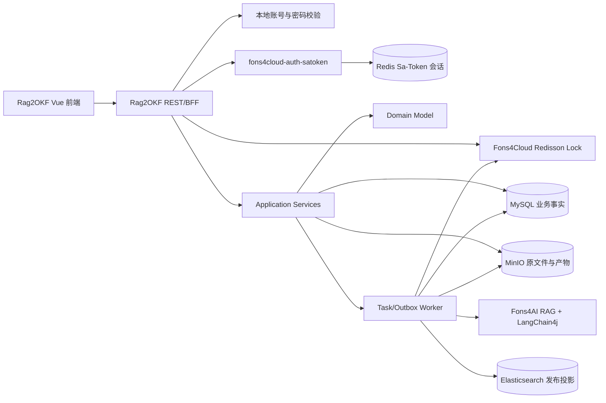
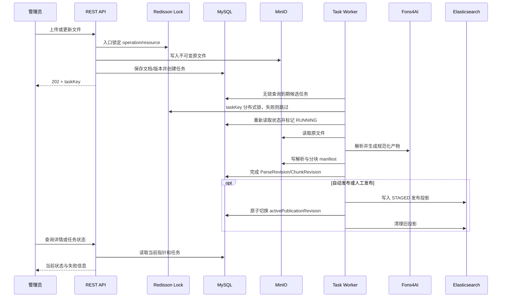
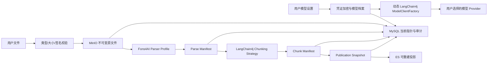
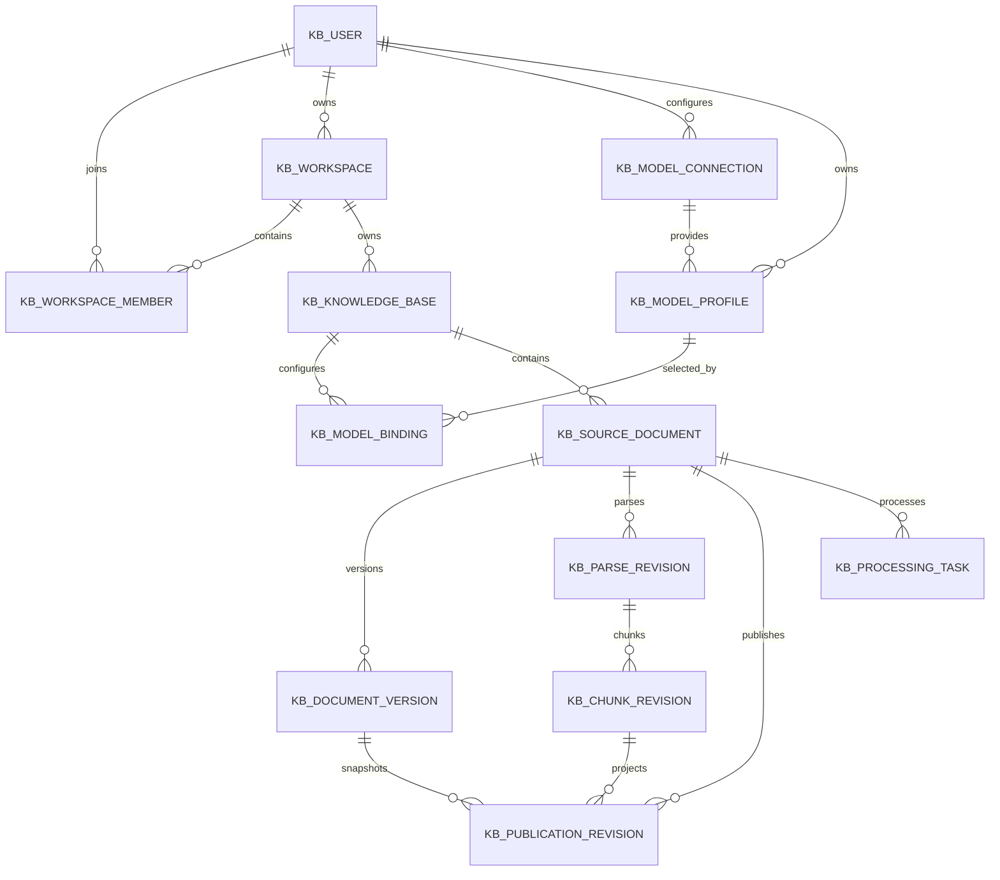
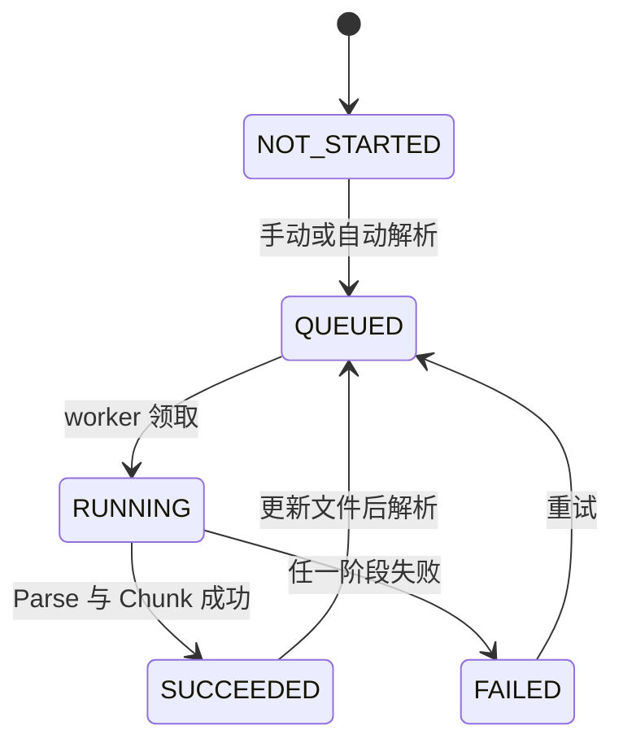
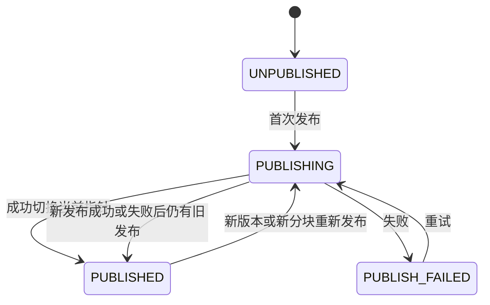

# 知识库文档生命周期技术设计说明书

> 功能标识：`knowledge-base-document-lifecycle`
> SDD 等级：`S2`
> 来源需求：`spec/features/20260731/知识库文档生命周期-需求说明书.md`
> 文档状态：已设计，待任务规划与实现确认
> 创建日期：2026-07-31
> 更新日期：2026-08-05

## 1. 设计概要

- 功能描述：交付知识库创建、用户模型配置、文件上传与更新、可选解析、分块预览、重新分块、发布及失败重试的第一个完整纵向切片。
- 影响模块：新建 Rag2OKF 后端服务与自有 Web 前端、本地邮箱密码认证、Sa-Token 会话与鉴权、用户模型 Provider/档案与加密凭证、MySQL 业务结构、Redis 会话与分布式锁、MinIO 对象结构、Elasticsearch 文档发布投影。
- 关键技术点：`fons4cloud-auth-satoken` 独立认证能力、规范化邮箱登录标识、本地密码摘要、用户级 OpenAI-compatible Provider、动态 LangChain4j Chat/Embedding Client、API Key 应用层加密、Base URL SSRF 防护、Fons4Cloud/Redisson 分布式锁、不可变文档内容版本、解析与分块分离、可重试异步任务、Outbox、发布指针切换。
- 依赖关系：Fons4Cloud Auth Sa-Token/Common Lock/Common DB Datasource/Common DB Core/Common File/Common Elasticsearch/Common SkyWalking 模块，Spring Security Crypto，Fons4AI RAG Common/RAG LangChain/Agent LangChain 模块，MySQL、Redis、MinIO、Elasticsearch 8.18.x。
- 非目标：问答检索、混合检索、OKF、评测中心、撤回发布、历史版本 UI、版本回退、企业共享模型凭证和复杂企业组织权限；本轮建立用户模型配置、测试、知识库绑定、动态调用边界与发布时同步向量化（CR-013 扩展）。
- SDD 等级理由：涉及新服务、新 UI、公共 HTTP 认证与模型配置契约、密码/API Key 安全、14 张 MySQL 表、用户可控出站地址、Redis 会话与锁、对象存储布局、Elasticsearch 索引以及跨资源最终一致性，属于 S2。

### 1.1 技术栈与交付画像

| 项目事实 | 已确认结论 | 证据或原因 |
| --- | --- | --- |
| 项目形态 | 单仓库内两个独立构建项目：后端服务 + 前端应用 | 用户确认仓库根目录不是 Maven/Node 项目，后端目录和前端目录分别是项目根 |
| 主要语言与运行时 | Java 21、Spring Boot 3.5.8；Vue 3、TypeScript 5.8、Node.js | Fons4Cloud、Fons4AI 与 `fons4cloud-admin-ui` 仓库事实 |
| 构建与测试入口 | 在 `fons4ai-rag2okf-service` 独立执行 Maven；在 `fons4ai-rag2okf-ui` 独立执行 npm/Vite/Vitest/Playwright | 用户确认的双项目边界与现有技术栈 |
| 交付入口 | 后端独立 JAR/镜像；前端独立 `dist/`/Nginx 镜像 | 前后端分开打包、同一版本发布编排 |
| 独立可运行服务 | 是 | 用户已确认知识库为独立项目并接入 Fons4Cloud |
| 页面/交互型交付物 | 是 | 需求 AC-003～AC-036 |
| 数据结构变更 | 是 | 新增 MySQL、MinIO 与 Elasticsearch 结构 |

### 1.2 模块与包结构

```text
fons4ai-rag2okf/
├── docs/                              # 产品与原型资料，仓库根不是构建项目
├── spec/                              # SDD 产物
├── fons4ai-rag2okf-service/           # 独立 Maven 后端项目根
│   ├── pom.xml
│   └── src/main/java/com/fons/cloud/ai/rag2okf/
│       ├── controller/             # Controller，仅做 HTTP 编排
│       ├── application/            # 用例编排、事务边界、查询服务
│       ├── domain/                 # 聚合、值对象、规则、端口
│       └── infrastructure/         # MySQL、Sa-Token、Redis/Lock、密码摘要、MinIO、ES、Fons4AI、任务 worker
└── fons4ai-rag2okf-ui/                # 独立 Node/Vite 前端项目根
    ├── package.json
    └── src/
        ├── api/
        ├── components/
        ├── composables/
        ├── stores/
        ├── styles/
        └── views/
```

后端使用 DDD-lite。领域对象不依赖 MyBatis、MinIO、Elasticsearch 或 LangChain4j 类型；这些依赖只出现在基础设施适配器。

仓库根目录不得生成聚合 `pom.xml`、根 `package.json` 或把两个项目合并为单一构建 Reactor。共享版本通过各项目自身依赖属性、锁文件和发布版本号对齐，不通过仓库根构建文件耦合。

## 2. 架构与调用链路

- 涉及入口：浏览器、Rag2OKF REST API、后台任务 worker。
- 涉及模块：本地账号、密码校验、Sa-Token 会话、注册、工作空间、知识库、文档、解析、分块、发布、任务、授权。
- 涉及服务：单个知识引擎服务，内部模块化；P0 不拆微服务。
- 涉及领域对象：LocalUser、Workspace、KnowledgeBase、SourceDocument、DocumentVersion、ParseRevision、ChunkRevision、PublicationRevision、ProcessingTask。
- 涉及数据访问：MySQL Mapper/Repository、Redis 会话与 Redisson 锁、Fons4Cloud `OssStoreService`、官方 Elasticsearch Java Client。
- 外部依赖：Redis、MySQL、MinIO、Elasticsearch；MinerU 仅在相应 Parser Profile 被启用时使用。认证不依赖外部服务。
- 调用链路：Rag2OKF 自有登录/注册页调用本服务；服务在 MySQL 校验/创建本地账号，通过 `SaTokenAuthTemplate` 建立会话，并由本地 `StpInterface` 提供角色权限；同步业务 API 在分布式锁入口内校验、保存事实和创建任务；后台 worker 在任务级分布式锁内执行解析、分块和发布。



### 2.1 核心异步链路



### 2.2 服务形态与运行态设计

- 模块形态：`fons4ai-rag2okf-service` 是独立可运行 Maven 项目，内部包含 HTTP API 与后台 worker。
- 启动入口：Spring Boot `Rag2OkfApplication`；Maven 命令必须在后端项目根目录执行。
- 服务标识与监听端口：`fons4ai-rag2okf-service`；端口由 `server.port` 配置，仓库不硬编码环境端口。
- 运行环境与配置来源：`local/test/prod` profile；本地配置文件 + 环境变量；MinIO/数据库/ES 凭证只从环境或密钥管理注入。
- 注册发现：P0 不接入注册中心，使用本地配置；后续如需服务发现可引入 Nacos。
- 健康检查：Spring Boot Actuator 提供 liveness/readiness；外部依赖健康只作为运行态观测，不作为 SDD 进入门禁。
- 链路追踪：通过 `fons4cloud-common-skywalking` 接入 SkyWalking，作为运行态观测手段，不作为 SDD 进入门禁。
- 核心运行链路：HTTP/BFF + MySQL 持久任务 + Fons4Cloud 分布式锁 worker；worker 与 API 可同进程部署，后续可按相同任务协议独立扩容。
- 外部依赖：Redis/Redisson、MySQL、MinIO、Elasticsearch；解析器可选 MinerU。认证会话由 `fons4cloud-auth-satoken` 在本服务内完成。
- 隔离与清理：测试使用独立数据库/schema、MinIO 前缀和 ES 索引前缀；集成测试结束只清理本次测试前缀。
- 暂缓项：实际环境地址、凭证和连接验证在实现集成阶段完成。

### 2.3 构建、打包与部署边界

- 后端：在 `fons4ai-rag2okf-service` 执行 Maven 构建，产出独立可执行 JAR，生产环境可进一步构建后端容器镜像。
- 前端：在 `fons4ai-rag2okf-ui` 执行 npm/Vite 构建，产出独立 `dist/`，由 Nginx 静态托管或构建独立 Nginx 镜像。
- 仓库根：只承担源码、SDD 和文档组织，不执行 Maven Reactor 或 Node Workspace 聚合构建。
- 生产入口：Nginx 同源提供前端静态资源，并将 `/knowledge/api/v1/` 反向代理到后端服务；客户端显式携带认证头，CORS 只允许已批准的前端来源和 `Authentication` 请求头。
- 发布策略：前后端可独立构建和回滚，但一次产品发布使用同一 release version/commit 记录兼容组合。
- 缓存与上传：`index.html` 不长期缓存，带内容 hash 的静态资源长期缓存；Nginx 的上传大小和超时必须覆盖后端文件限制。

## 3. API / RPC / 消息契约设计

### 3.1 通用约定

- 基础路径：`/knowledge/api/v1`。
- 业务主键：对外使用不可枚举的 `workspaceKey`、`knowledgeBaseKey`、`documentKey` 和 `taskKey`，不暴露数据库自增 ID。
- 响应信封：沿用 Fons4Cloud `R<T>`；异步命令成功受理返回 HTTP 202。
- 幂等：上传、更新、解析、重新分块、发布命令支持 `Idempotency-Key`；相同用户、资源、动作和 key 返回原任务。
- 并发：更新设置和当前指针操作携带 `revision`；冲突返回 HTTP 409。
- 数据隔离：工作空间从当前用户成员关系解析，客户端传入 key 只作为目标选择，不能作为授权依据。
- 会话：登录或注册成功后在 `R<SessionTokenResponse>.data.token` 返回 Sa-Token 原始令牌；后续受保护请求必须携带 `Authentication: Bearer <token>`。Sa-Token 仅从该请求头读取令牌，不读取或写入 Cookie；令牌不进入 MySQL、日志或浏览器持久化存储。由于浏览器不会自动附带该请求头，移除 Cookie 场景专用的 CSRF token、拦截器和端点；仍必须使用 HTTPS、受限 CORS 与防 XSS 措施。
- 认证边界：Rag2OKF 自己查询本地账号并校验密码摘要，成功后调用 `SaTokenAuthTemplate.login(userKey)`；Sa-Token 负责会话状态和接口认证，本地用户状态、成员关系和角色决定业务授权。

### 3.2 认证与本地权限

| 本地角色 | 用途 |
| --- | --- |
| `KNOWLEDGE_USER` | 查看有成员关系的工作空间、知识库、文档、原文件和状态 |
| `KNOWLEDGE_ADMIN` | 包含读取，并可创建/编辑知识库、上传、更新、解析、重新分块、发布和重试 |

Sa-Token `loginId` 固定使用不可变 `userKey`。Rag2OKF 实现业务 `StpInterface`，按 `userKey` 查询有效本地用户、Workspace Member 与本地角色；默认空权限实现不能直接用于生产。任何接口都不能信任浏览器传入的 userKey、role 或 workspaceKey。

认证组件边界：

- `LocalAccountRepository`：按规范化 email 查找本地账号；
- `PasswordHasher`：封装 Spring Security `DelegatingPasswordEncoder`，新密码使用 `{bcrypt}` 摘要并保留未来算法升级能力；
- `SaTokenAuthTemplate`：登录、登出、会话校验、取得当前 userKey 与踢下线；
- `Rag2OkfStpInterface`：从本地成员关系和角色加载权限；
- `AuthenticationRateLimiter`：按 email hash + IP hash 限制登录失败和批量注册；
- 原始密码只存在于请求处理内存，完成摘要/匹配后不再保留，不进入 DTO 回显、日志、事件、MySQL 明文字段或前端存储。

### 3.3 接口列表

| 接口名称 | 方法 | 路径 | 权限 | 描述 | AC |
| --- | --- | --- | --- | --- | --- |
| 登录 | POST | `/auth/login` | 匿名、限流 | 校验本地邮箱密码，建立 Sa-Token 会话并在 `R<T>` 中返回 token | AC-026、AC-027 |
| 注册并进入 | POST | `/auth/registration` | 匿名、限流 | 原子创建本地账号、个人空间和管理员成员关系，建立 Sa-Token 会话 | AC-031、AC-032 |
| 注销 | POST | `/auth/logout` | 已登录 | 从 `Authentication: Bearer <token>` 识别并注销当前 Sa-Token 会话，返回 `R<Void>` | AC-026 |
| 当前用户 | GET | `/users/me` | 已登录 | 返回 Rag2OKF 本地业务资料、偏好和工作空间摘要 | AC-029 |
| 更新当前用户 | PATCH | `/users/me` | 已登录 | 更新本地展示资料和偏好，不修改认证凭证 | AC-029 |

#### 认证响应、异常端点与状态枚举

- `POST /auth/login` 成功返回 `R<SessionTokenResponse>`，其中 `data.token` 为后续 `Authentication: Bearer <token>` 所需的原始 token；`POST /auth/logout` 返回 `R<Void>`。`GET/PATCH /users/me` 同样必须返回 `R<T>`，不再直接返回 DTO 或使用空响应体。
- Sa-Token 配置固定为 `token-name=Authentication`、`token-prefix=Bearer`、`is-read-header=true`、`is-read-cookie=false`；登录 token 通过响应体返回，服务端不依赖响应 Cookie 或自动写入认证头。
- Controller 不再声明本地 `@ExceptionHandler`。认证失败、频控、未认证、无权限、参数校验和未预期异常统一交由项目异常端点处理，并按 Fons4Cloud `WebMvcGlobalExceptionHandler` 的 `R<T>` 语义返回；认证相关错误分别保持 401、403、429、400、500 的 HTTP 状态和不泄露内部原因的错误码。
- 认证与工作空间链路中的 `kb_user.status`、`kb_workspace.status`、`kb_workspace_member.status`、`workspace_type` 和 `local_role` 在 Java 侧必须映射为领域枚举。持久化仍使用既有 VARCHAR 代码值，不变更表、字段、索引或历史数据；禁止以字符串字面量或 `Enum.valueOf` 直接承担状态判断。
| 工作空间列表 | GET | `/workspaces` | USER/ADMIN | 返回当前用户有权访问的工作空间 | AC-001 |
| 知识库列表 | GET | `/workspaces/{workspaceKey}/knowledge-bases` | USER/ADMIN | 分页查询知识库 | AC-001 |
| 创建知识库 | POST | `/workspaces/{workspaceKey}/knowledge-bases` | ADMIN | 创建知识库及处理设置 | AC-003 |
| 知识库详情 | GET | `/knowledge-bases/{knowledgeBaseKey}` | USER/ADMIN | 查询基础信息和设置 | AC-003 |
| 编辑知识库 | PATCH | `/knowledge-bases/{knowledgeBaseKey}` | ADMIN | 编辑信息与默认处理设置 | AC-004 |
| 文档列表 | GET | `/knowledge-bases/{knowledgeBaseKey}/documents` | USER/ADMIN | 分页查询当前文件、当前状态和最近任务摘要 | AC-005、AC-010、AC-023 |
| 上传新文档 | POST | `/knowledge-bases/{knowledgeBaseKey}/documents` | ADMIN | multipart 上传；始终创建新文档 | AC-005～AC-008 |
| 文档详情 | GET | `/documents/{documentKey}` | USER/ADMIN | 当前文件、当前状态、当前文件更新令牌和最近任务摘要 | AC-009～AC-014、AC-023 |
| 更新文件 | POST | `/documents/{documentKey}/files` | ADMIN | 使用当前文件更新令牌创建后台新版本并切换当前文件 | AC-009、AC-010 |
| 下载原文件 | GET | `/documents/{documentKey}/file` | USER/ADMIN | 鉴权后流式下载当前原文件 | AC-005、AC-014 |
| 发起解析 | POST | `/documents/{documentKey}/parse` | ADMIN | 创建或复用解析任务 | AC-006、AC-011、AC-014 |
| 解析预览 | GET | `/documents/{documentKey}/parse-preview` | USER/ADMIN | 返回结构化 block 与 SourceAnchor 分页 | AC-012、AC-013 |
| 分块预览 | GET | `/documents/{documentKey}/chunks` | USER/ADMIN | 返回当前解析侧分块分页 | AC-012、AC-013 |
| 重新分块 | POST | `/documents/{documentKey}/rechunk` | ADMIN | 明确确认后重建当前解析侧分块 | AC-019～AC-021 |
| 发起发布 | POST | `/documents/{documentKey}/publish` | ADMIN | 对当前成功分块创建发布任务 | AC-015～AC-018、AC-022 |
| 任务详情 | GET | `/tasks/{taskKey}` | USER/ADMIN | 查询进度、结果和安全化错误 | AC-011、AC-017、AC-023 |
| 重试任务 | POST | `/tasks/{taskKey}/retry` | ADMIN | 根据原输入快照创建下一次尝试 | AC-014、AC-018、AC-024 |
| Provider 模板列表 | GET | `/model-provider-templates` | 已登录 | 返回内置模板的厂商、协议、常见 Base URL 和提示，不返回任何 Key | AC-033 |
| Provider 连接列表 | GET | `/model-connections` | 已登录 | 只返回当前用户连接、状态、Base URL 和 Key 掩码 | AC-033、AC-036 |
| 创建 Provider 连接 | POST | `/model-connections` | 已登录 | 保存用户提供的厂商、Base URL 和加密 API Key | AC-033、AC-036 |
| 编辑 Provider 连接 | PATCH | `/model-connections/{connectionKey}` | 所有者 | 修改显示信息/Base URL/status；仅显式提交新 Key 时替换密文 | AC-033、AC-036 |
| 测试模型档案 | POST | `/model-profiles/{profileKey}/test` | 所有者 | 使用该档案和连接执行最小实际 Chat/Embedding 请求 | AC-033、AC-035 |
| 模型档案列表 | GET | `/model-profiles` | 已登录 | 返回当前用户的文本/向量化模型档案 | AC-034 |
| 创建模型档案 | POST | `/model-profiles` | 已登录 | 在本人连接下创建 `CHAT` 或 `EMBEDDING` 档案 | AC-034 |
| 编辑模型档案 | PATCH | `/model-profiles/{profileKey}` | 所有者 | 修改模型名称、维度提示、参数和状态 | AC-034、AC-035 |
| 查询知识库模型绑定 | GET | `/knowledge-bases/{knowledgeBaseKey}/model-bindings` | USER/ADMIN | 返回按用途组织的模型档案绑定，不返回凭证 | AC-034 |
| 保存知识库模型绑定 | PUT | `/knowledge-bases/{knowledgeBaseKey}/model-bindings` | ADMIN | 按用途整体校验并更新绑定；同一用途最多一个有效绑定 | AC-034、AC-035 |

#### 邮箱密码登录

1. 前端向 `/auth/login` 提交 email、password 和可选 rememberMe；密码字段禁止回显或记录。
2. 服务端对 email 执行 trim、整体转小写和格式校验，先执行 IP + email hash 频控，再使用固定耗时的统一失败路径查找账号并匹配密码摘要。
3. 邮箱未注册、密码错误、状态不可用或超过限制均返回统一登录失败，不建立会话。
4. 校验成功后清除失败计数，调用 `SaTokenAuthTemplate.login(userKey)`；rememberMe 只改变允许的会话 TTL，读取当前 token 并封装为 `R<SessionTokenResponse>` 返回。
5. 后续请求必须携带 `Authentication: Bearer <token>`；服务端从请求头恢复 userKey，再交给 `WorkspaceAccessPolicy` 执行业务授权。令牌不写入 Cookie、MySQL、日志或浏览器持久化存储。

#### 邮箱密码注册

1. 前端向 `/auth/registration` 提交 email、password、confirmPassword、displayName 和 termsAccepted。
2. 服务端对 email 执行 trim、整体转小写，校验最大 254 字符与标准邮箱格式；校验密码 8～64 位且不能与邮箱相同、两次密码一致、条款已同意，并按 IP + email hash 执行频控和分布式锁。
3. 通过 `PasswordHasher` 生成带算法标识和随机盐的摘要；原始 password/confirmPassword 不进入持久化对象。
4. 单个 MySQL 事务创建 `kb_user`、PERSONAL Workspace 和 ADMIN Member；email 唯一索引处理大小写不同但规范化后相同的并发重复注册。
5. 事务提交成功后调用 `SaTokenAuthTemplate.login(userKey)` 建立会话并进入知识库主页。
6. 事务失败不建立会话；如果事务已成功但会话建立失败，账号和个人空间保留为完整一致状态，用户可重新登录。
7. P0 不发送验证邮件、不保存邮箱验证状态，也不提供手机号、第三方注册或密码找回；邮箱只作为登录标识，不能证明邮箱所有权。

#### 用户模型连接与模型档案

- Provider 连接请求包含 `templateCode`、`providerName`、`displayName`、`baseUrl`、`apiKey`；`apiKey` 只在创建或显式轮换时接收，响应固定返回 `apiKeyConfigured=true`、掩码和更新时间。
- 模型档案请求包含 `connectionKey`、`modelType=CHAT|EMBEDDING`、`modelName`、可选 `dimensions` 和受控参数；P0 不允许用户提交任意请求头、任意路径或脚本。
- 模板只预填，不锁死配置：

| 模板代码 | 厂商 | 协议 | 常见 Base URL | 说明 |
| --- | --- | --- | --- | --- |
| `ALIYUN_DASHSCOPE` | 阿里云百炼 | OpenAI-compatible | `https://dashscope.aliyuncs.com/compatible-mode/v1` | 地域/专属 Workspace 域名可由用户替换，Key 必须与域名地域匹配 |
| `VOLCENGINE_ARK` | 火山方舟 | OpenAI-compatible | `https://ark.cn-beijing.volces.com/api/v3` | 用户填写实际推理接入点/模型 ID |
| `TENCENT_HUNYUAN` | 腾讯混元 | OpenAI-compatible | `https://api.hunyuan.cloud.tencent.com/v1` | 用户填写控制台 API Key 和可用模型名 |
| `ZHIPU_BIGMODEL` | 智谱 BigModel | OpenAI-compatible | `https://open.bigmodel.cn/api/paas/v4` | 用户填写开放平台 API Key 和模型名 |
| `CUSTOM_OPENAI_COMPATIBLE` | 自定义 | OpenAI-compatible | 用户填写 | 默认仅允许 HTTPS 公网地址，私有地址需要部署侧白名单 |

- 模板不保存示例 Key，不自动选择模型。厂商当前 URL 依据各自官方文档，具体地域、模型能力和计费由用户确认。
- 删除正在被知识库引用的档案返回 409；停用后保留引用但相关模型操作 fail-closed。轮换 Key 后新调用只使用新密文。
- 模型档案测试是最小真实请求，可能产生厂商费用；UI 必须在测试按钮附近提示。`CHAT` 发送无业务数据的固定短文本，`EMBEDDING` 发送固定短文本并校验向量非空/维度。

### 3.4 关键接口详情

#### 创建/编辑知识库

```json
{
  "name": "个人金融知识库",
  "description": "金融贷款演示知识",
  "autoParse": true,
  "autoPublish": false,
  "parserProfile": "NATIVE_TIKA",
  "chunkProfile": {
    "strategy": "markdown-header",
    "chunkSize": 1000,
    "overlap": 100,
    "titleLevel": 3
  },
  "modelBindings": [
    {
      "usageType": "ANSWER_GENERATION",
      "modelProfileKey": "01J_CHAT_PROFILE"
    },
    {
      "usageType": "EMBEDDING",
      "modelProfileKey": "01J_EMBED_PROFILE"
    }
  ],
  "revision": 0
}
```

- `autoPublish=true` 时必须同时允许解析；上传本次明确选择不解析时不触发发布。
- 设置仅形成后续操作默认快照，不批量修改已有任务或产物。
- `modelBindings` 按用途保存到独立绑定关系；P0 要求 `ANSWER_GENERATION` 对应 `CHAT` 档案、`EMBEDDING` 对应 `EMBEDDING` 档案。
- 所有模型档案必须属于当前个人 Workspace 所有者且为 ACTIVE；知识库主记录不复制模型引用、Base URL 或凭证。
- 当前 BM25 发布不调用模型；档案引用为后续向量化、RAG 和 OKF 提供统一入口。
- 错误码：`KB_NAME_REQUIRED`、`KB_CHUNK_PROFILE_INVALID`、`MODEL_PROFILE_REQUIRED`、`MODEL_PROFILE_FORBIDDEN`、`KB_CONCURRENT_MODIFICATION`。

#### 文档列表、详情与当前文件令牌

- `GET /knowledge-bases/{knowledgeBaseKey}/documents?page=0&size=20` 返回 `R<PageResponse<DocumentSummaryResponse>>`；按文档最近更新时间倒序分页，`page` 从 0 开始，`size` 默认 20、最大 100。查询必须先按当前用户校验知识库 `KNOWLEDGE_USER` 成员关系，不能仅使用浏览器提供的 `knowledgeBaseKey` 过滤。
- `DocumentSummaryResponse` 与 `GET /documents/{documentKey}` 的文档主体都只返回当前可见数据：`documentKey`、`displayName`、`currentFile(filename/contentType/size)`、`parseStatus`、`publishStatus`、`hasActivePublication`、`latestTask` 和 `updated`。不返回版本号、版本列表、历史文件、对象 key 或数据库 ID。
- `latestTask` 可为 null；非空时仅包含最近更新的处理任务 `taskKey`、`taskType`、`status`、`stage`、`progress`、`attempt`、`maxAttempts`、`errorCode`、`errorMessage`、`updated`。它用于刷新后恢复状态轮询和失败重试，不返回 payload、执行实例、租约或内部堆栈。
- `currentFileToken` 是当前文件的不可展示并发令牌。它仅由管理员在 `POST /documents/{documentKey}/files` 的 `expectedCurrentFileToken` 字段回传，服务端映射到当前不可变文件版本 key 执行 CAS；页面不得展示、命名或解释为“版本”，也不得通过它访问历史文件。令牌不属于凭证，不写入日志或浏览器持久化存储。
- 当 `publishStatus=PUBLISH_FAILED` 且 `hasActivePublication=true` 时，页面必须显示“新发布失败，当前已发布内容仍可用”；当前发布内容仍以 MySQL active publication 指针为唯一事实。
- 列表实现应批量读取当前文件与最近任务，避免按文档逐条查询产生 N+1；不新增表、字段、索引、对象存储结构或任务状态。

#### 上传新文档/更新文件

- Content-Type：`multipart/form-data`。
- 字段：`file`、`parseMode=DEFAULT|PARSE|SKIP`。
- 更新接口还要求 `expectedCurrentFileToken`，用于避免两个更新请求互相覆盖；它是前端不可展示的当前文件并发令牌，不构成版本列表能力。
- 受理响应：

```json
{
  "documentKey": "01J...",
  "currentFile": {
    "filename": "贷款政策.md",
    "contentType": "text/markdown",
    "size": 12345
  },
  "taskKey": "01J...",
  "parseStatus": "QUEUED",
  "publishStatus": "UNPUBLISHED"
}
```

- 普通上传不按文件名或内容哈希合并；哈希只用于完整性与审计。
- 更新失败时不切换 `current_document_version_id`。
- 错误码：`FILE_TYPE_UNSUPPORTED`、`FILE_TOO_LARGE`、`FILE_EMPTY`、`FILE_SIGNATURE_MISMATCH`、`DOCUMENT_UPDATE_CONFLICT`、`OBJECT_STORE_WRITE_FAILED`。

#### 重新分块

```json
{
  "confirmed": true,
  "expectedChunkRevisionKey": "01J...",
  "chunkProfile": {
    "strategy": "recursive",
    "chunkSize": 800,
    "overlap": 80,
    "titleLevel": 3
  }
}
```

- `confirmed` 非 true 直接拒绝，前端取消时不调用接口。
- 只允许基于当前成功的 ParseRevision 执行。
- 新分块先写临时 manifest，成功后原子切换当前 ChunkRevision，再删除旧解析侧 manifest；失败时当前发布指针始终不变。
- 错误码：`RECHUNK_CONFIRMATION_REQUIRED`、`PARSE_NOT_SUCCEEDED`、`CHUNK_REVISION_CONFLICT`、`CHUNK_PROFILE_INVALID`。

#### 发布

```json
{
  "expectedChunkRevisionKey": "01J..."
}
```

- 自动发布与人工发布都调用同一 `PublicationApplicationService`。
- 发布以 ChunkRevision 快照为输入；发布开始后的重新分块不会改变该次任务输入。
- 错误码：`CHUNK_NOT_READY`、`PUBLICATION_ALREADY_RUNNING`、`PUBLICATION_PROJECTION_FAILED`、`PUBLICATION_CONFLICT`。

#### 任务状态

```json
{
  "taskKey": "01J...",
  "taskType": "PARSE",
  "status": "RUNNING",
  "progress": 45,
  "stage": "NORMALIZE_BLOCKS",
  "attempt": 1,
  "errorCode": null,
  "errorMessage": null,
  "createdAt": "2026-07-31T10:00:00+08:00",
  "updatedAt": "2026-07-31T10:00:08+08:00"
}
```

错误响应不包含对象存储地址、凭证、堆栈、数据库语句或第三方原始响应。

## 4. 数据模型与 DDL 影响

### 4.1 数据影响判断

| 检查项 | 是否涉及 | 处理要求 |
| --- | --- | --- |
| 持久化数据新增、修改、删除或查询 | 是 | 新增生命周期业务事实、用户模型配置、加密凭证和任务数据 |
| 外部数据入库、出库、同步、对账或报表 | 是 | 用户文件进入 MinIO，发布投影进入 ES |
| 字段映射、日期、状态、流水号或客户标识 | 是 | 统一业务 key、状态、revision 和时间字段；不保存真实金融客户标识 |
| 敏感数据、权限、安全、审计或保留期限 | 是 | 工作空间隔离、原文件授权下载、API Key 应用层加密、日志脱敏、审计字段 |
| 跨系统、跨服务、跨库或第三方数据流转 | 是 | MySQL、MinIO、ES、可选解析服务和用户选择的模型 Provider |

### 4.2 字段映射契约

| 来源数据项 | 目标数据项 | 转换规则 | 空值/异常规则 | 安全要求 | 状态 |
| --- | --- | --- | --- | --- | --- |
| 原始文件名 | `original_filename` | 去除路径，只保留安全显示名；对象 key 不使用原名作为目录 | 空或含控制字符拒绝 | 防路径穿越、响应头编码 | 已确认 |
| 文件流 | MinIO original object | 流式写入并计算 SHA-256 | 空文件、超限或签名不匹配拒绝 | 私有 bucket、鉴权下载 | 已确认 |
| MIME/扩展名 | `content_type/file_extension` | 白名单与文件签名组合校验 | 不一致时拒绝或进入明确失败 | 不信任浏览器 MIME | 已确认 |
| 解析器 Document | Parse Manifest | 规范化为 block、metadata、ParseTrace | 不产生伪造页码；未知定位标记为 TEXT_OFFSET | 产物私有 | 设计建议-待评审 |
| TextSegment | Chunk Manifest | 生成 parent/child、顺序、hash 与 SourceAnchor | 空分块不发布 | 内容按工作空间隔离 | 设计建议-待评审 |
| Chunk Manifest | ES Chunk Projection | 写入文本、过滤字段、来源定位与发布 key | 批量写入部分失败则整次发布失败 | 强制 workspace/kb 过滤 | 设计建议-待评审 |
| 登录/注册邮箱 | `kb_user.email` | trim、整体转小写，最大 254 字符并按邮箱格式校验 | 格式非法拒绝；规范化值唯一冲突返回不确认既有用户身份的注册失败 | 登录错误不暴露邮箱注册状态；除本人资料外对外输出脱敏 | 已确认 |
| 注册密码 | `kb_user.password_hash` | `DelegatingPasswordEncoder` 生成 `{bcrypt}` 随机盐摘要 | 8～64 位、不得与规范化邮箱相同；摘要失败回滚事务 | 明文禁止日志/持久化/回显，摘要禁止 API 返回 | 已确认 |
| 确认密码 | 不持久化 | 与 password 使用常量时间安全比较前的等值校验 | 不一致拒绝注册 | 仅存在于请求处理内存 | 已确认 |
| 注册页展示名称 | `kb_user.display_name` | trim 后按长度和字符规则校验 | 空值使用安全默认显示名 | 本地业务字段，不同步到认证服务 | 已确认 |
| Provider 模板/Base URL | `kb_model_connection.provider_code/base_url` | 模板预填后统一规范化；去除尾部多余 `/`，禁止 userinfo/query/fragment | 非绝对 HTTPS、公网解析失败或命中受限地址时拒绝 | 防 SSRF、DNS 重绑定和重定向 | 已确认 |
| 用户 API Key | `kb_model_connection.api_key_ciphertext/api_key_nonce/key_version` | 服务端使用部署密钥执行 AES-256-GCM 加密；掩码独立保存 | 空 Key 拒绝；解密或鉴别失败则连接不可用 | 明文仅短暂存在于请求/调用内存，不进入日志、事件和响应 | 已确认 |
| 用户模型名称 | `kb_model_profile.model_name` | trim 后保存厂商实际模型 ID，不做平台内置映射 | 空值拒绝；能力由档案测试验证 | 不把模型名误当凭证 | 已确认 |
| 知识库模型选择 | `kb_model_binding.usage_type/model_profile_id` | 按用途绑定当前个人工作空间所有者的 ACTIVE 档案；同一知识库同一用途最多一个有效绑定 | 越权、停用、用途与模型类型不兼容或缺失时拒绝保存/调用 | 防跨用户凭证使用与能力误配 | 已确认 |

### 4.3 数据流设计



### 4.4 数据安全与合规设计

| 检查项 | 设计结论 | 验证方式 |
| --- | --- | --- |
| 敏感数据识别 | 密码/API Key 明文属于高敏凭证，密码摘要、API Key 密文和会话 token 属于安全数据；P0 演示仍禁止真实客户、征信、银行卡和授信语料 | 认证/模型日志断言、样本审查、上传提示 |
| 传输安全 | 网关到浏览器使用 TLS；内网依赖按部署规范启用 TLS | 配置检查与集成测试 |
| 存储加密 | API Key 使用 AES-256-GCM 应用层信封格式加密，部署主密钥/KMS 引用不进入数据库；其他内容依赖环境级静态加密 | 密文不可逆读取测试、错误主密钥测试、部署检查 |
| 展示/日志脱敏 | 不记录文件正文、完整邮箱、密码、密码摘要、API Key、token、Authorization 请求头和第三方完整错误；API Key 只显示固定掩码 | 日志/响应/异常链断言与审查 |
| 数据权限 | Sa-Token 登录身份 + Rag2OKF 本地用户状态 + workspace membership/local role | 越权集成测试 |
| 认证、注册与会话 | Rag2OKF 校验本地密码摘要；Sa-Token Redis DAO 保存会话；Redis 同时保存短生命周期登录/注册频控窗口 | 注册、登录、注销、限流、过期与踢下线测试 |
| 出站模型访问 | Base URL 默认只允许 HTTPS 公网地址；解析全部 A/AAAA 结果并拒绝 loopback、link-local、private、reserved、multicast，禁止自动重定向；私网 Provider 只能由部署侧不可被用户覆盖的 allowlist 开放 | Mock DNS/HTTP 服务、IPv4/IPv6/重定向/DNS 重绑定测试 |
| 凭证权限 | 连接和档案只允许所有者读写；知识库通过独立用途绑定保存档案引用，任何 DTO/任务/Outbox 不携带密文或明文 Key | 两用户越权、序列化和日志扫描 |
| 审计与追踪 | 保存 createdBy/updatedBy、task、revision、hash、parser trace 和 publication pointer | 数据查询测试 |
| 保留期限/删除/归档 | P0 不提供业务删除；旧版本与旧发布记录保留，解析侧被替换分块按任务清理 | 无删除 API 检查、清理任务测试 |
| 法规或公司治理要求 | 本项目仅使用虚构金融语料，不宣称满足生产金融合规 | 交付说明审查 |

### 4.5 结构变更详设

| 数据源/服务 | 结构对象 | 变更类型 | 现状证据 | 目标状态 | 风险 |
| --- | --- | --- | --- | --- | --- |
| MySQL | `kb_user`、`kb_workspace`、`kb_model_connection`、`kb_model_profile`、`kb_model_binding` 等 14 张表 | 新增 | 目标项目当前无业务结构；T003 候选 11 表尚未在 MySQL 执行 | 保存本地账号、加密模型凭证、模型档案、用途绑定、权限、事实、指针、任务与 Outbox | 高 |
| Redis | Sa-Token 会话、认证频控与 Redisson Lock key | 新增 | Fons4Cloud Common Cache/Lock 已提供 Redis/Redisson；目标项目尚无业务 key | 保存会话、登录/注册窗口并承担入口互斥 | 高 |
| MinIO | `knowledge-engine` 私有 bucket 路径 | 新增 | Fons4Cloud 已有 `OssStoreService` 与 MinIO 实现 | 保存不可变原文件和 manifest | 中 |
| Elasticsearch | `kb-chunk-v1` + 读写别名 | 新增 | Fons4Cloud 已统一官方 ES 客户端 | 保存可重建 BM25 发布投影 | 中 |

所有目标结构均为新建，当前结构证据来自尚未执行的 T003 候选初始化 SQL；不存在生产数据或已确认现状。字段和索引需在实现任务 T003/T031/T033/T037 中形成包含 14 张表的完整初始化 SQL，并由隔离 MySQL 测试验证。

Redis 认证目标结构：

| Key 模式 | 值 | TTL | 写入方 | 安全要求 | 状态 |
| --- | --- | --- | --- | --- | --- |
| Sa-Token 原生 key（前缀由 `sa-token.token-name` 决定） | token/session/login 状态 | 按会话策略 | Sa-Token Redis DAO | token 不进入日志、MySQL 或前端持久化存储 | 仓库能力已验证，配置待实现 |
| `rag2okf:auth:login:email:{emailHash}` | 连续登录失败次数 | 15 分钟 | AuthenticationRateLimiter | email 使用服务端 salt hash，不存明文 | 设计建议-待实现验证 |
| `rag2okf:auth:login:ip:{ipHash}` | 单来源登录窗口次数 | 10 分钟 | AuthenticationRateLimiter | IP 只存 hash，防止批量猜测 | 设计建议-待实现验证 |
| `rag2okf:auth:registration:ip:{ipHash}` | 单来源注册窗口次数 | 1 小时 | AuthenticationRateLimiter | 原子计数，响应不返回内部阈值 | 设计建议-待实现验证 |

频控 key 只承担短期攻击防护；账号状态和密码摘要的事实来源是 MySQL。

### 4.6 MySQL 目标结构

所有表统一包含 `id BIGINT AUTO_INCREMENT`、`created`、`updated`、`deleted`、`version`；实体继承 Fons4Cloud `CommonEntity`。外部业务 key 使用 `CHAR(26)` ULID 并建立唯一索引。P0 不使用数据库外键，由应用服务和测试保证关系，避免未来拆分和批量清理受限。

| 表 | 核心字段 | 关键索引/约束 | 用途 |
| --- | --- | --- | --- |
| `kb_user` | `user_key`、`email`、`password_hash`、`display_name`、`avatar_url`、`status`、`preference_json`、`last_login_at`、`password_changed_at` | UK(`user_key`)，UK(`email`)，IDX(`status`,`updated`) | Rag2OKF 本地邮箱登录账号、密码摘要、资料和偏好；不保存密码明文、会话 token 或邮箱验证状态 |
| `kb_workspace` | `workspace_key`、`name`、`workspace_type`、`owner_user_id`、`status` | UK(`workspace_key`)，UK(`workspace_type`,`owner_user_id`) | 本地数据隔离边界；P0 支持个人空间，预留企业空间 |
| `kb_workspace_member` | `workspace_id`、`user_id`、`local_role`、`status` | UK(`workspace_id`,`user_id`)，IDX(`user_id`,`status`) | 本地业务用户到工作空间角色映射 |
| `kb_knowledge_base` | `knowledge_base_key`、`workspace_id`、`name`、`description`、`auto_parse`、`auto_publish`、`parser_profile`、`chunk_profile_json`、`status` | UK(`knowledge_base_key`)，IDX(`workspace_id`,`status`,`updated`) | 知识库默认处理策略；不保存固定模型字段 |
| `kb_source_document` | `document_key`、`knowledge_base_id`、`display_name`、`current_document_version_id`、`current_parse_revision_id`、`current_chunk_revision_id`、`active_publication_revision_id`、`parse_status`、`publish_status` | UK(`document_key`)，IDX(`knowledge_base_id`,`updated`)，IDX(`active_publication_revision_id`) | 文档逻辑身份和所有“当前”指针 |
| `kb_document_version` | `version_key`、`source_document_id`、`object_key`、`original_filename`、`content_type`、`file_extension`、`size_bytes`、`sha256`、`upload_actor_id` | UK(`version_key`)，IDX(`source_document_id`,`created`)，UK(`object_key`) | 每次成功上传/更新得到的不可变内容版本 |
| `kb_parse_revision` | `parse_revision_key`、`source_document_id`、`document_version_id`、`parser_profile_json`、`parser_trace_json`、`manifest_object_key`、`anchor_manifest_object_key`、`block_count`、`status`、`error_code`、`error_message` | UK(`parse_revision_key`)，IDX(`source_document_id`,`created`)，IDX(`document_version_id`,`status`) | 不可变解析结果及轨迹 |
| `kb_chunk_revision` | `chunk_revision_key`、`source_document_id`、`parse_revision_id`、`chunk_profile_json`、`manifest_object_key`、`parent_count`、`child_count`、`content_hash`、`status` | UK(`chunk_revision_key`)，IDX(`source_document_id`,`created`)，IDX(`parse_revision_id`,`status`) | 当前解析侧可替换分块集合 |
| `kb_publication_revision` | `publication_revision_key`、`source_document_id`、`document_version_id`、`parse_revision_id`、`chunk_revision_id`、`manifest_object_key`、`projection_index`、`projection_count`、`status`、`trigger_type`、`error_code`、`error_message`、`published_at` | UK(`publication_revision_key`)，IDX(`source_document_id`,`created`)，IDX(`status`,`updated`) | 发布快照和 ES 投影元数据 |
| `kb_processing_task` | `task_key`、`workspace_id`、`knowledge_base_id`、`source_document_id`、`task_type`、`input_revision_key`、`idempotency_key`、`status`、`stage`、`progress`、`attempt`、`max_attempts`、`next_run_at`、`execution_owner`、`heartbeat_at`、`execution_deadline`、`error_code`、`error_message`、`payload_json` | UK(`task_key`)，UK(`source_document_id`,`task_type`,`idempotency_key`)，IDX(`status`,`next_run_at`)，IDX(`source_document_id`,`created`) | 异步命令、进度、崩溃恢复元数据、重试与幂等；不承担分布式锁 |
| `kb_outbox_event` | `event_key`、`aggregate_type`、`aggregate_key`、`event_type`、`payload_json`、`status`、`attempt`、`next_run_at`、`published_at` | UK(`event_key`)，IDX(`status`,`next_run_at`) | 事务内记录后续清理、自动发布与投影事件 |
| `kb_model_connection` | `connection_key`、`owner_user_id`、`provider_code`、`provider_name`、`display_name`、`protocol_type`、`base_url`、`api_key_ciphertext`、`api_key_nonce`、`key_version`、`api_key_mask`、`status`、`last_test_status`、`last_test_at`、`last_test_error_code` | UK(`connection_key`)，UK(`owner_user_id`,`display_name`)，IDX(`owner_user_id`,`status`,`updated`) | 用户级 Provider 连接与加密 API Key；不保存明文 |
| `kb_model_profile` | `profile_key`、`owner_user_id`、`connection_id`、`model_type`、`model_name`、`dimensions`、`parameters_json`、`status`、`last_test_status`、`last_test_at`、`last_test_error_code` | UK(`profile_key`)，UK(`owner_user_id`,`connection_id`,`model_type`,`model_name`)，IDX(`owner_user_id`,`model_type`,`status`) | 用户可复用的文本或向量化模型档案 |
| `kb_model_binding` | `binding_key`、`knowledge_base_id`、`usage_type`、`model_profile_id`、`config_json`、`status` | UK(`binding_key`)，UK(`knowledge_base_id`,`usage_type`)，IDX(`model_profile_id`,`status`)，IDX(`knowledge_base_id`,`status`) | 知识库按用途选择模型档案；避免每新增模型用途就修改知识库表 |

#### `kb_user` 认证字段目标定义

> 以下为尚未实施的新系统目标结构描述，不是可执行 DDL。当前不存在存量表、迁移或生产数据；CR-005 的用户确认是邮箱登录标识和密码认证语义依据，具体类型由手工初始化 SQL 和隔离测试最终验证。

| 字段 | 业务含义 | 目标类型 | 必填/默认 | 键或索引 | 写入方/初始化 | 安全等级 | 状态 |
| --- | --- | --- | --- | --- | --- | --- | --- |
| `user_key` | 不可变用户业务标识，同时作为 Sa-Token loginId | `CHAR(26)` | 必填 | 唯一 | 注册服务生成 ULID | 内部 | 已确认 |
| `email` | 登录邮箱规范化值 | `VARCHAR(254)` | 必填 | 唯一 | 注册服务 trim 并整体转小写 | 个人数据/账号标识 | 已确认 |
| `password_hash` | 带算法标识和随机盐的密码摘要 | `VARCHAR(255)` | 必填 | 不建索引 | PasswordHasher 生成 `{bcrypt}` 摘要 | 高敏安全数据 | 已确认 |
| `display_name` | 用户展示名称 | `VARCHAR(64)` | 必填 | 不建唯一 | 注册请求或安全默认名 | 一般个人数据 | 已确认 |
| `status` | 账号是否允许登录与参与授权 | `VARCHAR(20)` | `ACTIVE` | 与更新时间组合索引 | 注册服务初始化 | 安全控制 | 已确认 |
| `last_login_at` | 最近一次成功登录时间 | `DATETIME(3)` | 可空 | 不单独索引 | 登录成功后更新 | 审计 | 已确认 |
| `password_changed_at` | 当前密码摘要生效时间 | `DATETIME(3)` | 必填 | 不建索引 | 注册时初始化 | 审计 | 已确认 |

- 邮箱验证状态：P0 不创建 `email_verified`、`verified_at` 或验证码字段，不接入邮件发送服务；邮箱仅是未核验所有权的登录标识。
- 兼容与初始化：尚未实施，不存在 `username` 或远程 `auth_account_id` 存量数据迁移；T003/T031 直接生成 CR-005 后的完整初始结构。
- 回滚：实现前可回退设计；实现后只能关闭注册/登录入口并恢复已审核版本，禁止把密码摘要转换或导出为明文。
- SQL 快照：实现阶段 T005 在隔离初始化验证后写入 `.specify/sql/knowledge_engine/knowledge_document_lifecycle.sql`；当前不得从本表格生成“已验证现状”快照。

#### 模型连接与档案字段目标定义

> 以下目标结构来自用户对 Provider、Base URL、模型名称和 API Key 的明确要求。当前候选初始化 SQL 尚未包含这些字段，且从未在 MySQL 执行；实现阶段由 T033 更新完整初始化 SQL，再由 T004/T005 验证和同步快照。

`kb_model_connection`：

| 字段 | 业务含义 | 目标类型 | 必填/默认 | 键或索引 | 写入方/初始化 | 安全等级 | 状态 |
| --- | --- | --- | --- | --- | --- | --- | --- |
| `connection_key` | 不可枚举连接标识 | `CHAR(26)` | 必填 | 唯一 | 应用生成 ULID | 内部 | 已确认 |
| `owner_user_id` | 连接所有者 | `BIGINT` | 必填 | 与名称/状态组合索引 | 当前登录用户解析 | 权限边界 | 已确认 |
| `provider_code` | 内置模板或 CUSTOM 代码 | `VARCHAR(40)` | 必填 | 不单独唯一 | 模板选择 | 一般 | 已确认 |
| `provider_name` | 用户可识别的厂商名 | `VARCHAR(80)` | 必填 | 不建索引 | 模板预填或用户输入 | 一般 | 已确认 |
| `display_name` | 当前用户下的连接名称 | `VARCHAR(80)` | 必填 | 与 owner 唯一 | 用户输入 | 一般 | 已确认 |
| `protocol_type` | 调用协议 | `VARCHAR(32)` | `OPENAI_COMPATIBLE` | 不建索引 | 系统/模板 | 技术配置 | 已确认 |
| `base_url` | 模型 API 根地址 | `VARCHAR(512)` | 必填 | 不建索引 | 模板预填或用户输入 | 出站安全配置 | 已确认 |
| `api_key_ciphertext` | AES-GCM 密文 | `VARBINARY(2048)` | 必填 | 不建索引 | CredentialCipher | 高敏安全数据 | 已确认 |
| `api_key_nonce` | 每次加密随机 nonce | `VARBINARY(32)` | 必填 | 不建索引 | CredentialCipher | 高敏安全数据 | 已确认 |
| `key_version` | 部署主密钥版本 | `VARCHAR(32)` | 必填 | 不建索引 | CredentialCipher | 安全元数据 | 已确认 |
| `api_key_mask` | 仅供界面识别的固定掩码 | `VARCHAR(32)` | 必填 | 不建索引 | 保存时派生，不可反推 | 脱敏数据 | 已确认 |
| `status` | 连接是否允许调用 | `VARCHAR(20)` | `ACTIVE` | 与 owner/updated 组合索引 | 用户操作 | 安全控制 | 已确认 |
| `last_test_status/at/error_code` | 最近一次安全化测试结论 | status/time/code | 可空 | 不单独索引 | 测试用例 | 审计 | 已确认 |

`kb_model_profile`：

| 字段 | 业务含义 | 目标类型 | 必填/默认 | 键或索引 | 写入方/初始化 | 安全等级 | 状态 |
| --- | --- | --- | --- | --- | --- | --- | --- |
| `profile_key` | 不可枚举档案标识 | `CHAR(26)` | 必填 | 唯一 | 应用生成 ULID | 内部 | 已确认 |
| `owner_user_id` | 档案所有者 | `BIGINT` | 必填 | 组合索引 | 从连接所有者复制并校验 | 权限边界 | 已确认 |
| `connection_id` | 所属 Provider 连接 | `BIGINT` | 必填 | 业务唯一键组成 | 用户选择本人连接 | 权限边界 | 已确认 |
| `model_type` | `CHAT` 或 `EMBEDDING` | `VARCHAR(24)` | 必填 | 业务唯一键/组合索引 | 用户选择 | 能力契约 | 已确认 |
| `model_name` | 厂商实际模型 ID | `VARCHAR(160)` | 必填 | 业务唯一键组成 | 用户输入 | 技术配置 | 已确认 |
| `dimensions` | Embedding 输出维度提示 | `INT` | 可空 | 不建索引 | 用户输入并由测试校验 | 索引兼容元数据 | 已确认 |
| `parameters_json` | 温度、超时、最大重试等受控参数 | `JSON` | `{}` | 不建索引 | 白名单 DTO | 技术配置 | 已确认 |
| `status` | 档案是否允许被选择/调用 | `VARCHAR(20)` | `ACTIVE` | 与 owner/type 组合索引 | 用户操作 | 安全控制 | 已确认 |
| `last_test_status/at/error_code` | 最近一次模型能力测试结论 | status/time/code | 可空 | 不单独索引 | 模型测试用例 | 审计 | 已确认 |

`kb_model_binding`：

| 字段 | 业务含义 | 目标类型 | 必填/默认 | 键或索引 | 写入方/初始化 | 安全等级 | 状态 |
| --- | --- | --- | --- | --- | --- | --- | --- |
| `binding_key` | 不可枚举绑定标识 | `CHAR(26)` | 必填 | 唯一 | 应用生成 ULID | 内部 | 已确认 |
| `knowledge_base_id` | 绑定所属知识库 | `BIGINT` | 必填 | 与用途唯一、组合索引 | 知识库设置用例 | 权限边界 | 已确认 |
| `usage_type` | 模型在知识库中的用途 | `VARCHAR(40)` | 必填 | 与知识库唯一 | 应用白名单 | 能力契约 | 已确认 |
| `model_profile_id` | 当前用途选中的模型档案 | `BIGINT` | 必填 | 与状态组合索引 | 管理员选择兼容档案 | 权限边界 | 已确认 |
| `config_json` | 当前用途的非敏感受控参数 | `JSON` | `{}` | 不建索引 | 白名单 DTO | 技术配置 | 已确认 |
| `status` | 绑定是否有效 | `VARCHAR(20)` | `ACTIVE` | 与知识库/档案组合索引 | 知识库设置用例 | 安全控制 | 已确认 |

- P0 `usage_type` 允许 `ANSWER_GENERATION` 与 `EMBEDDING`；后续可以在应用白名单和对应 Client Adapter 就绪后启用 `RERANK`、`DOCUMENT_UNDERSTANDING`、`OKF_EXTRACTION`，无需修改知识库表结构。
- `usage_type` 不设置数据库 CHECK 枚举，避免每增加用途都执行 DDL；应用层使用受控枚举、用途与 `model_type` 兼容矩阵和契约测试约束，不接受任意字符串。
- 同一知识库同一用途只维护一行并原位更新 `model_profile_id/config_json/status`；P0 不通过逻辑删除制造同用途重复记录。
- 所有权通过 `knowledge_base.workspace.owner_user_id` 与 `model_profile.owner_user_id` 联合校验；绑定表不重复保存 `owner_user_id`。

- 加密主密钥：来自部署 Secret/KMS，至少 256 bit，不进入仓库、MySQL、响应、日志或前端；`key_version` 用于未来轮换，P0 不提供用户侧导出。
- 迁移/回填：当前没有已部署结构或存量连接；完整初始化 SQL 直接生成 14 表目标结构，不生成生产 `ALTER TABLE`。若候选 11 表脚本已经被个人环境手工执行，需重建该未发布环境或在实现前另行确认变更 SQL。
- 删除/保留：被有效绑定引用的连接/档案禁止删除；允许停用。P0 不提供彻底删除凭证历史的 UI，后续账号删除与合规清理另行设计。

#### 关键结构规则

- `kb_source_document.current_document_version_id` 只在新对象写入成功且数据库事务成功时切换。
- `current_parse_revision_id` 必须属于当前 DocumentVersion；文件更新后旧解析结果不再作为前端当前结果。
- `current_chunk_revision_id` 必须属于当前 ParseRevision。
- `active_publication_revision_id` 可以引用旧 DocumentVersion，用于更新或重新分块期间继续提供旧发布内容。
- `auto_publish=true` 不改变上述指针规则，只改变成功解析后的任务触发方式。
- `error_message` 只保存安全化摘要，长度受限；完整异常仅进入受控日志且不含正文和凭证。
- `kb_user.email` 使用规范化值并全局唯一；P0 不保存邮箱验证状态；`password_hash` 只允许认证应用服务写入且不得出现在通用用户 DTO。
- Sa-Token `loginId` 使用 `user_key`；业务权限必须通过 `kb_workspace_member.user_id` 查询，不能从登录状态直接推导管理员权限。
- `kb_model_connection.owner_user_id` 和 `kb_model_profile.owner_user_id` 必须一致；`kb_model_binding` 只能关联知识库个人 Workspace 所有者的 ACTIVE 档案。
- `api_key_ciphertext`、`api_key_nonce`、`key_version` 只能由凭证适配器访问；通用 Mapper DTO、任务 payload 和 Outbox 均不得序列化这些字段。
- `kb_model_binding` 的用途绑定改变时只影响未来操作；不得自动重处理文档。向量化模型/维度变化的重新索引由后续 RAG SDD 负责。
- `kb_processing_task` 的 heartbeat/deadline 是崩溃恢复证据，不是 MySQL 锁，也不得使用 `SELECT ... FOR UPDATE`、`SKIP LOCKED` 或行锁抢任务。

### 4.7 ER 设计



### 4.8 MinIO 对象结构

Bucket：`knowledge-engine`，必须私有。

```text
workspaces/{workspaceKey}/knowledge-bases/{knowledgeBaseKey}/
  documents/{documentKey}/
    versions/{versionKey}/original
    parses/{parseRevisionKey}/parsed-manifest.json
    parses/{parseRevisionKey}/source-anchor-manifest.json
    chunks/{chunkRevisionKey}/chunk-manifest.json
    publications/{publicationRevisionKey}/publication-manifest.json
```

- 对象 key 只使用系统生成 key，不拼接未经净化的文件名。
- 原文件名放在对象 metadata 与 MySQL 中。
- Manifest 写入临时 key 后再以完成标记和数据库指针切换生效；`OssStoreService` 当前没有 rename/copy 契约，因此完整性依赖内容 hash、完成对象 key 和数据库状态，不依赖目录原子移动。
- 旧解析侧 Chunk Manifest 在新 ChunkRevision 成功切换后删除；被 PublicationRevision 引用的发布 manifest 不删除。

### 4.9 Elasticsearch 索引

物理索引：`kb-chunk-v1`；别名：`kb-chunk-read`、`kb-chunk-write`。

| 字段 | 类型 | 用途 |
| --- | --- | --- |
| `chunkKey` | keyword | 分块唯一标识 |
| `workspaceKey`、`knowledgeBaseKey`、`documentKey` | keyword | 权限和范围过滤 |
| `publicationRevisionKey` | keyword | 与 MySQL 当前发布指针绑定 |
| `documentVersionKey`、`parseRevisionKey`、`chunkRevisionKey` | keyword | 追溯 |
| `parentChunkKey` | keyword | Parent/Child 关联 |
| `chunkLevel` | keyword | `PARENT` / `CHILD` |
| `ordinal` | integer | 文档内顺序 |
| `rawText` | text，index=false | 调试与追溯，是否保留可在实现评审时缩减 |
| `displayText` | text | 展示与 BM25 |
| `embeddingText` | text，index=false | 向量化输入文本，发布时同步生成 `vector` |
| `vector` | dense_vector，dims=1024，index=true，similarity=cosine | 发布时同步写入的向量，用于 V2 RAG kNN 检索（CR-013） |
| `titlePath` | keyword + text | 结构过滤与检索 |
| `sourceLocatorType` | keyword | PAGE_REGION / PAGE / SECTION / TEXT_OFFSET |
| `pageNumber` | integer | PDF 页码，可空 |
| `startOffset`、`endOffset` | integer | 文本偏移，可空 |
| `contentHash` | keyword | 完整性与幂等 |
| `schemaVersion` | keyword | 投影 schema 版本 |

V1 索引同步保存 `dense_vector` 向量（CR-013 调整，详见 D-007）：发布时使用知识库绑定的 EMBEDDING 模型计算向量并写入 `vector` 字段，单维度约束 `dims=1024`；向量化失败阻塞发布（RetryableFailure）。`skipEmbedding` 标记的 chunk 的 `vector` 为 null。混合检索在后续 RAG SDD 通过同一索引的 BM25+kNN 实现，无需创建 `kb-chunk-v2`。

后续检索必须通过 MySQL `active_publication_revision_id` 集合解析当前发布版本，再以 `publicationRevisionKey` 过滤 ES；不能只依赖 ES 中容易短暂滞后的 active 标记。

### 4.10 SQL/DDL 与初始化影响

- 是否涉及持久化结构变化：是。
- DDL 证据状态：目标项目为新结构；本设计为用户已授权的新功能设计，不代表现网存量结构。
- 结构详设位置：§4.5～§4.9。
- SQL 当前结构快照：`.specify/sql/knowledge_engine/knowledge_document_lifecycle.sql`，由 T005 在 14 表结构通过隔离 MySQL 验证后新增/更新；当前仍无已验证快照。
- 初始化 SQL 位置：实现阶段在 `fons4ai-rag2okf-service/sql/init-schema.sql` 维护一份完整脚本，由用户、DBA 或部署流程在新环境手工执行。
- 应用启动边界：应用启动不自动创建或修改表，不引入 Flyway，不建立 `flyway_schema_history`；生产运行账号原则上不授予 DDL 权限。
- 测试执行边界：隔离 MySQL 测试通过 JDBC 执行同一份 `sql/init-schema.sql`，不得复制为另一份 `schema.sql` 或测试专用 DDL。
- 后续结构变化：已部署环境需要变更表结构时必须新建 CR 并交付单独审核的手工变更 SQL；完整初始化 SQL同步反映最新新建环境结构，但不得把修改初始化脚本当作已部署环境的升级机制。
- 执行型 DDL：本设计阶段不生成。
- 回滚思路：P0 不设计业务回退；数据库部署失败由未发布环境重建或备份恢复处理，禁止以业务 API 模拟回退。
- 运行初始化：不要求固定账号或工作空间 Seed。首次自助注册在单个事务内创建 `kb_user`、个人 Workspace 与管理员成员关系；企业 Workspace 和成员管理延期。
- 认证/权限初始化：不依赖 Fons4Cloud Auth 权限资源 DML；Rag2OKF 实现 `StpInterface`，从自身账号状态、成员关系和角色提供权限。

## 5. 核心逻辑设计

### 5.1 注册、登录与工作空间

1. 自助注册在规范化 `email` 分布式锁内校验唯一性和密码规则，生成 `userKey` 与密码摘要；锁 key 只使用服务端 salt hash。
2. 单个 MySQL 事务创建本地 `kb_user`、`workspace_type=PERSONAL` 的 Workspace 和 `KNOWLEDGE_ADMIN` Member；任一步失败整体回滚。
3. 事务提交后调用 `SaTokenAuthTemplate.login(userKey)` 建立登录态；会话失败不破坏已经完整提交的账号与个人空间。
4. 后续登录按规范化 email 查询账号、匹配密码摘要并校验 ACTIVE 状态，成功后使用同一 userKey 建立会话。
5. `Rag2OkfStpInterface` 和 `WorkspaceAccessPolicy` 只从当前本地用户、有效 Member 和本地角色计算权限。
6. 查询只返回当前本地用户有效成员关系覆盖的 Workspace；企业 Workspace 的创建与成员管理不在 P0 UI 中。

### 5.2 上传新文档

1. 在命令入口按 `localUserKey + knowledgeBaseKey + Idempotency-Key` 获取 Fons4Cloud 分布式锁；获取失败直接返回“操作处理中”，不进入 MySQL 锁等待。
2. 校验本地 ADMIN 角色、成员关系、知识库归属、文件大小、扩展名、MIME 和文件签名。
3. 生成 documentKey、versionKey 和 taskKey。
4. 流式上传原文件到最终不可变对象 key，并计算 hash。
5. MySQL 事务创建 SourceDocument、DocumentVersion、当前指针和必要任务/Outbox。
6. 若数据库事务失败，补偿删除本次对象；删除失败记录清理事件。
7. `parseMode=SKIP` 时状态为 NOT_STARTED/UNPUBLISHED；否则创建 PARSE 任务。
8. 同名文件不查询、不合并，天然生成新的 documentKey。

### 5.3 更新文件

1. 校验 `expectedCurrentVersionKey` 与当前指针。
2. 上传新不可变对象并创建 DocumentVersion。
3. 事务内 CAS 切换 `current_document_version_id`，清空当前 Parse/Chunk 指针并设置新处理状态。
4. 不修改 `active_publication_revision_id`，因此旧发布内容继续可用。
5. 根据本次 parseMode 与知识库默认设置创建解析任务。
6. P0 响应和 UI 永远不返回 version 序号、历史数组或回退动作。

### 5.4 解析与首次分块

1. Scheduler 只用普通查询读取到期候选任务，不使用 MySQL 行锁、`FOR UPDATE` 或 `SKIP LOCKED`。
2. 候选任务交给独立 Spring Bean `DistributedLockedTaskExecutor`；其公共执行入口使用 Fons4Cloud `@DistributeLock(scene="rag2okf:task-execute", keyExpression="#taskKey", waitTime=0)`。
3. 未取得锁的实例立即跳过；取得锁的实例在锁内重新读取任务，只有 QUEUED/RETRY_WAIT 或满足恢复条件的 RUNNING 任务才可继续。
4. 任务进入 RUNNING 后写 execution owner、heartbeat 和 deadline；这些字段只用于观察和崩溃恢复，不承担互斥。
5. 根据任务输入快照读取指定 DocumentVersion 原文件。
6. 构建 Fons4AI `DocumentParseRequest`，由 `DocumentParserSelector` 显式选择 Native Tika 或 MinerU。
7. 通过 `LangChain4jDocumentParserFacade.parseWithTrace` 获取 Document 与 ParseTrace。
8. `ParsedArtifactAssembler` 将结果规范化为 Parse Manifest 和 SourceAnchor Manifest；来源定位缺失时不伪造页码。
9. 使用 `LangChain4jDocumentSplitter` 和应用层 Parent/Child 组装策略生成 Chunk Manifest。
10. 写入 MinIO 并验证 hash/count。
11. 事务内创建 ParseRevision、ChunkRevision，切换当前指针，完成任务。
12. 若知识库自动发布且本次允许解析，写入发布 Outbox；人工发布与自动发布共用同一服务。

默认 Parser Profile：

| Profile | 适用范围 | 行为 |
| --- | --- | --- |
| `NATIVE_TIKA` | TXT、Markdown、DOCX、文本型 PDF | 默认，不静默切换其他 provider |
| `MINERU_LAYOUT` | 需要布局识别的 PDF/DOCX | 显式选择；provider 不可用时明确失败 |

默认 Chunk Profile 使用现有 Fons4AI 候选值：`recursive / 1000 / overlap 100`；Markdown 可选择 `markdown-header / titleLevel 3`。这些是可配置起点，不是质量结论。

### 5.5 重新分块

1. API 要求 `confirmed=true` 和当前 ChunkRevision key。
2. 任务只读取当前成功 Parse Manifest，不重复调用解析器。
3. 在新对象 key 构建 Chunk Manifest 并完成校验。
4. 事务内 CAS 切换 `current_chunk_revision_id`。
5. 切换成功后删除旧解析侧 Chunk Manifest；失败时通过清理 Outbox 重试。
6. 当前 `active_publication_revision_id` 全程不变；旧发布 ES 投影不删除。
7. 若新分块构建失败，任务进入 FAILED，旧解析侧分块保持当前，避免失败造成调试数据无端丢失；再次成功后才执行物理替换。

这属于技术失败补偿，不是面向用户的历史版本回退功能。

### 5.6 发布与当前内容切换

1. 校验当前 ChunkRevision 成功且没有同一文档 RUNNING 的发布任务。
2. 创建不可变 PublicationRevision，复制必要 manifest 快照。
3. **发布时同步向量化（CR-013，D-007）**：`EmbeddingProjectionService` 从知识库 EMBEDDING 绑定解析用户配置的模型，使用 `ModelClientFactory` 创建动态 `EmbeddingModel`，批量计算 `embeddingText != null` 的分块向量并填充到 `ChunkProjection.vector`。无 EMBEDDING 绑定时降级 BM25-only（vector 全为 null）；`skipEmbedding` chunk 的 vector 为 null。向量化失败阻塞发布：维度不匹配返回 FatalFailure，模型调用临时故障返回 RetryableFailure，均不切指针、不写 ES。
4. 批量写入 `kb-chunk-write`，所有文档携带 publicationRevisionKey 和 vector（如有），初始视为 STAGED。
5. 校验 ES 写入数量和 contentHash；任何部分失败均将本次发布标记 FAILED。
6. MySQL 事务内 CAS 切换 `active_publication_revision_id` 并完成 PublicationRevision。
7. 写 Outbox 异步删除或退休旧 PublicationRevision 的 ES 投影。
8. 后续消费者只接受 MySQL 当前指针对应的 publicationRevisionKey，因此清理延迟不会产生两个同时生效的结果。
9. 首次发布失败保持未发布；重新发布失败保持旧指针和旧内容。

### 5.7 任务幂等与重试

- 同一 `Idempotency-Key` 返回原 taskKey。
- Worker 调度查询不加数据库锁；执行互斥以 `taskKey` 的 Fons4Cloud/Redisson 分布式锁为唯一锁机制。
- 分布式锁覆盖整个任务执行入口，`waitTime=0`；默认不配置固定 `expireTime`，使用 Redisson watchdog 自动续期，避免长解析被固定过期时间提前释放。
- 锁入口必须位于独立 Spring Bean 的 public 方法，禁止同类自调用绕过 AOP。
- 锁内仍需重新读取任务状态并执行条件状态更新；这是幂等与状态机校验，不是 MySQL 锁。
- JVM 崩溃后由 Redisson 释放锁；扫描器依据 heartbeat/executionDeadline 识别遗留 RUNNING 任务，并在同一 taskKey 分布式锁内恢复到 QUEUED/RETRY_WAIT。
- 任务输入引用不可变 Version/Parse/Chunk key，不读取执行时可能已变化的“当前”内容。
- 重试创建新的 attempt 但复用逻辑 operation key；成功结果通过唯一约束和 CAS 只生效一次。
- 上传/更新本体不由后台任务重放文件流；对象写入失败由客户端重新提交。
- 自动发布事件以 `chunkRevisionKey` 为幂等输入，人工提交同一 revision 时复用现有任务。
- Redis 不可用时命令入口和 worker 对需要互斥的写操作失败关闭，不得回退到 MySQL 行锁；只读查询在不依赖会话恢复的前提下按运行策略降级。

### 5.8 分布式锁入口矩阵

| 入口 | scene | key | 持锁范围 | 竞争失败 |
| --- | --- | --- | --- | --- |
| 上传/更新/解析/重新分块/发布命令 | `rag2okf:command:{type}` | 本地用户 + 资源 key + idempotency key | 命令校验、任务创建与必要指针事务 | 返回处理中/原 taskKey |
| Worker 任务执行 | `rag2okf:task-execute` | taskKey | 整个任务执行方法，由 watchdog 续期 | 跳过本轮候选 |
| Outbox 事件分发 | `rag2okf:outbox-dispatch` | eventKey | 事件读取、处理和状态落库 | 跳过本轮候选 |
| 遗留 RUNNING 任务恢复 | `rag2okf:task-recover` | taskKey | 重新校验 deadline 并变更恢复状态 | 跳过本轮恢复 |

锁 key 必须使用系统生成 key、规范化 operation key 或服务端 salt hash，不包含原文件名、完整邮箱、token 等敏感值。

### 5.9 用户模型解析与动态调用

1. Controller 只接收连接/档案业务 key 或知识库 `usageType`；`CurrentUser` 提供 userKey，应用服务校验所有权和 ACTIVE 状态。
2. `UserModelResolver` 根据知识库与 `usageType` 加载唯一有效的 `ModelBinding`，再加载模型档案与 Provider 连接，形成不含明文 Key 的 `ResolvedModelDescriptor`；显式档案测试不经过知识库绑定，但仍校验所有权。
3. `CredentialCipher` 在调用前使用部署主密钥解密 API Key；明文只存在于当前调用栈内，不进入任务 payload、缓存、事件或日志。
4. `ModelClientFactory` 使用 LangChain4j `OpenAiChatModel`/`OpenAiStreamingChatModel` 或 `OpenAiEmbeddingModel` builder 动态设置 `baseUrl`、`apiKey`、`modelName`、timeout 和受控参数；业务代码不得注入全局 `ChatModel`/`EmbeddingModel` 作为 fallback。
5. 调用结束后只记录 providerCode、profileKey、modelName、耗时、token/向量维度、结果码和 request correlation id；不记录 prompt、响应正文或 Authorization。
6. P0 不以 Spring Boot `langchain4j.open-ai.*` 配置创建可运行平台模型。模型 Client 不注册为跨用户单例 Bean，也不进入 Redis/分布式缓存。
7. 异步任务未来只保存 profileKey 与非敏感配置修订；任务执行时使用该修订并解析当前有效凭证。轮换 Key 立即作用于新调用，修改模型名只影响修改后新建任务。

模型调用失败分类：

| 场景 | 错误码 | 行为 |
| --- | --- | --- |
| 未配置/引用缺失 | `MODEL_PROFILE_REQUIRED` | fail-closed，指向设置页 |
| 同一用途出现重复有效绑定 | `MODEL_BINDING_CONFLICT` | 拒绝解析并记录安全化配置错误 |
| 用途与模型类型不兼容 | `MODEL_USAGE_INCOMPATIBLE` | 拒绝保存或调用，不尝试其他模型 |
| 非本人连接/档案 | `MODEL_PROFILE_FORBIDDEN` | 403，不泄露对象是否存在 |
| Base URL 被出站策略拒绝 | `MODEL_ENDPOINT_REJECTED` | 不发起网络请求 |
| Key 解密/版本失败 | `MODEL_CREDENTIAL_UNAVAILABLE` | 不重试，不暴露密文信息 |
| 厂商 401/403 | `MODEL_AUTH_FAILED` | 返回统一提示，可替换 Key |
| 限流/超时/5xx | `MODEL_PROVIDER_UNAVAILABLE` | 按受控重试策略处理，测试接口直接返回安全摘要 |
| 能力/维度不匹配 | `MODEL_CAPABILITY_MISMATCH` | 档案测试失败，不允许用于相关后续操作 |

## 6. 领域建模与业务规则落地

| 业务规则/行为 | 归属对象 | 实现方式 | 验证方式 |
| --- | --- | --- | --- |
| 普通上传始终新建文档 | `DocumentApplicationService` | 不执行同名查重；每次生成新 documentKey | 集成测试 |
| 更新文件创建不可变版本 | `SourceDocument` | `switchCurrentVersion` CAS，不覆盖旧 Version | 单元 + 集成 |
| 未解析不可发布 | `PublicationPolicy` | 要求当前 Parse/Chunk SUCCEEDED | 单元测试 |
| 设置不追溯已有文档 | `KnowledgeBaseSettings` | 任务创建时复制 profile 快照 | 集成测试 |
| 重新分块需确认 | API + `RechunkPolicy` | confirmed 与 expected revision 双校验 | 契约测试 |
| 重新处理不影响当前发布 | `SourceDocument` | Parse/Chunk 指针与 ActivePublication 指针分离 | 状态机测试 |
| 新发布成功才替换旧发布 | `PublicationApplicationService` | ES 校验后 CAS 当前发布指针 | 故障注入测试 |
| 自动/人工发布语义一致 | `PublicationApplicationService` | triggerType 仅用于审计，共用流程 | 参数化测试 |
| 工作空间隔离 | `WorkspaceAccessPolicy` | local user status + member/local role + aggregate ownership | 越权测试 |
| 本地账号认证与业务授权分层 | `AuthenticationApplicationService` / `LocalUser` / `Rag2OkfStpInterface` | 密码校验只建立 userKey 会话，Workspace Member/角色决定业务权限 | 登录、注册与越权测试 |
| 用户模型配置归属 | `ModelConnection` / `ModelProfile` / `UserModelAccessPolicy` | 连接和档案 owner 校验，知识库只引用所有者 ACTIVE 档案 | 两用户越权与停用测试 |
| 知识库模型用途绑定 | `ModelBinding` / `ModelUsagePolicy` | 同一知识库同一用途唯一；用途与模型类型按兼容矩阵校验 | 唯一约束、并发更新与不兼容类型测试 |
| 所有模型调用使用用户设置 | `UserModelResolver` / `ModelClientFactory` | 动态构建 LangChain4j 客户端，无全局模型 fallback | 配置解析、静态扫描和 Mock Provider 契约测试 |
| API Key 保密 | `CredentialCipher` | AES-GCM 加密、只替换不回显、调用前短暂解密 | 密文/响应/日志/异常断言 |
| 并发任务互斥 | `DistributedLockedTaskExecutor` | Fons4Cloud 分布式锁 + 状态机幂等 | 多实例并发测试 |

- DDD-lite 判断：生命周期与当前指针规则进入领域层；纯 CRUD 查询与 DTO 转换保留在应用/接口层。
- 核心领域对象：KnowledgeBase、SourceDocument、ProcessingTask。
- 应用服务职责：跨聚合用例编排、事务、Outbox、基础设施端口调用。
- 贫血模型例外：Revision、Member 和 Outbox 可使用记录型实体，不承载复杂行为。
- 基础设施依赖边界：领域层只定义 `DocumentArtifactStore`、`DocumentParserPort`、`ChunkerPort`、`PublicationProjectionPort` 等端口。

## 7. 状态流转设计

### 7.1 解析状态



### 7.2 发布状态



当已有发布内容的新任务失败时，文档聚合的对外 `publishStatus` 仍为 `PUBLISHED`，同时返回 `latestPublicationAttemptStatus=PUBLISH_FAILED` 和失败原因，避免把“旧内容仍可用”误显示为整体未发布。

### 7.3 任务状态

| 当前状态 | 动作 | 目标状态 | 失败处理 | 幂等 |
| --- | --- | --- | --- | --- |
| QUEUED | 在 taskKey 分布式锁内开始执行 | RUNNING | 未取得锁保持 QUEUED | 分布式锁 + 状态条件更新 |
| RUNNING | 心跳 | RUNNING | deadline 过期后在恢复锁内重新排队 | execution owner |
| RUNNING | 完成 | SUCCEEDED | 写结果与状态同事务 | operation key |
| RUNNING | 可重试失败 | RETRY_WAIT | 指数退避 + 上限 | attempt |
| RETRY_WAIT | 到期 | QUEUED | 超限转 FAILED | taskKey |
| RUNNING | 不可重试失败 | FAILED | 展示安全错误 | 终态 |

P0 不提供 CANCELLED、WITHDRAWN 或 ROLLED_BACK 业务状态。

## 8. 异常、安全、事务与性能

### 8.1 异常处理

| 异常场景 | 处理方式 | 用户可见结果 | 日志要求 |
| --- | --- | --- | --- |
| 文件不支持/超限/签名不符 | 上传前拒绝 | 明确规则与原因 | 不记录正文 |
| MinIO 写失败 | 不创建成功文档，必要时补偿清理 | 上传失败，可重试 | taskKey、对象 key hash |
| 数据库切换冲突 | 返回 409 | 提示刷新后重试 | expected/actual revision |
| 解析器不可用 | Parse FAILED | 显示 provider 不可用 | provider、trace，不含凭证 |
| 解析产物不完整 | 不切换当前 Parse | 显示解析失败 | block/count/hash |
| ES 部分写入失败 | Publication FAILED，清理 STAGED | 旧发布仍可用 | bulk failure 摘要 |
| Outbox 清理失败 | 重试，不影响当前指针 | 无需阻塞用户 | eventKey、attempt |
| 邮箱未注册/密码错误/账号不可用 | 401，不创建会话 | 统一“邮箱或密码不正确” | traceId、email hash、错误分类，不记完整邮箱或密码 |
| 登录尝试过于频繁 | 429，不执行密码匹配或建立会话 | 稍后重试 | IP/email hash 与限流维度 |
| 注册邮箱冲突/弱密码/事务失败 | 400/409/429/500，不建立会话 | 更换邮箱或密码后重试，不确认既有用户身份 | traceId、错误分类，不记完整邮箱、密码或摘要 |
| Redis/Redisson 不可用 | 需要互斥的写命令和 worker 失败关闭 | 稍后重试 | scene、key hash、traceId |
| 无权限/跨工作空间 | 403 或 404 防枚举 | 无权限 | localUserKey、resourceKey |

### 8.2 安全与权限

- 认证：Rag2OKF 使用 `PasswordHasher` 校验本地密码摘要；`fons4cloud-auth-satoken` 只负责会话、登录校验、Token 管理和权限扩展，不包含账号存储或密码匹配。
- 会话：Sa-Token 会话持久化到 Redis；登录/注册在 `R<SessionTokenResponse>` 返回 token，受保护请求仅接受 `Authentication: Bearer <token>`，注销清除当前会话，禁用账号时踢下线全部会话。Cookie、CSRF token 与 CSRF 拦截器不适用。
- 权限：`Rag2OkfStpInterface`、本地 `kb_user` 状态、`WorkspaceAccessPolicy`、成员关系与 local role 共同负责业务授权；Sa-Token 默认空权限实现不得用于生产。
- 数据校验：文件白名单、大小、签名、文件名净化、JSON 配置 schema 和数值边界。
- 敏感信息脱敏：MySQL 保存规范化邮箱和密码摘要；只有当前本人资料接口可返回完整只读邮箱，其他响应和日志对邮箱脱敏，且不保存/返回密码、密码摘要、Sa-Token、MinIO 凭证、内部 URL、堆栈和正文。
- 未验证邮箱边界：P0 不发送验证邮件、不建立验证状态，不得使用登录邮箱执行密码找回、安全通知、实名判断或邮箱所有权证明。
- 防注入/越权：MyBatis 参数绑定；ES 查询构造器；对象 key 仅使用系统 key；所有文档查询必须连接 knowledgeBase/workspace ownership。
- 下载：后端鉴权后流式返回，设置安全的 `Content-Disposition`、`X-Content-Type-Options` 和 CSP；不返回永久公开 URL。

### 8.3 事务与一致性

- 事务边界：单次 MySQL 聚合变更与 Outbox 同事务；MinIO/ES 不加入分布式事务。
- 一致性模型：MySQL 为事实来源，MinIO 与 ES 为带 hash 的外部产物/投影；使用 Saga + Outbox 最终一致。
- 并发控制：跨实例互斥只使用 Fons4Cloud/Redisson 分布式锁；MySQL 只使用 `CommonEntity.version` 乐观并发校验、expected key、任务唯一约束和当前指针 CAS，不使用行锁作为互斥方案。
- 会话一致性：Sa-Token Redis DAO 是登录态来源；账号禁用或密码未来变更时必须踢下线现有会话，注销直接结束当前会话，不再维护远程 refresh token。
- 缓存一致性：除认证会话外 P0 不引入业务缓存；状态直接读 MySQL。未来当前发布集合缓存必须以 Outbox 失效。
- MQ/事件一致性：P0 使用数据库 Outbox + 同服务 worker，不强制 Kafka；后续可将相同事件契约接入 Fons4Cloud MQ。
- 失败补偿：对象孤儿清理、STAGED ES 投影清理、deadline 超时任务恢复、Outbox 重试；任何补偿均不改变旧 active publication。

### 8.4 性能与容量候选

这些值是实现阶段的可配置初始门槛，不是产品承诺：

| 项目 | 初始候选 | 验证方式 |
| --- | --- | --- |
| 单文件大小 | 50 MiB | 边界上传测试 |
| PDF 页数 | 500 页；无法快速识别时由解析器二次拒绝 | 样本测试 |
| 解析超时 | 10 分钟 | worker 超时、watchdog 与恢复测试 |
| 单工作空间上传并发 | 5 | 限流集成测试 |
| 单实例解析并发 | 2 | 压测校准 |
| 单实例发布并发 | 2 | ES bulk 压测校准 |
| 列表/详情 P95 | 本地依赖条件下 500 ms 内 | API 基准测试 |
| 任务受理响应 | 2 秒内返回 taskKey，不等待解析/发布 | API 集成测试 |

- 查询性能：知识库与文档列表走组合索引；任务查询走 sourceDocument/status 索引。
- ES 写入：按字节数和条数分批 bulk，不一次加载整个大文件全部 chunk 到内存。
- 限流：Rag2OKF 用户级限制 + 服务内工作空间并发配额。
- MinIO：上传、下载与解析均使用流式接口。

## 9. 技术决策

### D-001：P0 采用模块化单体

- 选择：一个后端服务内包含 API 与 worker。
- 原因：降低部署与一致性复杂度，同时用端口和任务契约保留拆分能力。
- 替代方案：从一开始拆文档、解析、发布微服务。
- 影响：单服务需通过 worker 并发隔离避免解析占满 HTTP 线程。

### D-002：MySQL 为事实来源，ES 只是发布投影

- 选择：当前发布由 MySQL 指针判定。
- 原因：避免 ES 短暂状态或重建影响业务真相。
- 替代方案：仅用 ES active 字段或每文档独立别名。
- 影响：后续检索需解析 active publication key 集合。

### D-003：解析、分块和发布使用独立 Revision

- 选择：ParseRevision 不可变；ChunkRevision 可重建；PublicationRevision 为稳定快照。
- 原因：满足重新分块删除解析侧分块但旧发布保持可用。
- 替代方案：解析结果、chunk 和索引共用一个状态。
- 影响：增加表和指针，但状态语义清楚。

### D-004：前端隐藏版本，后端保留不可变 DocumentVersion

- 选择：普通上传新建文档；只有“更新文件”创建同一文档的新 Version。
- 原因：遵循用户已确认方案 A，并保留未来演进能力。
- 替代方案：同名自动合并或 P0 暴露完整版本中心。
- 影响：API 不返回版本列表，测试必须确保旧 Version 没有可达 UI。

### D-005：MySQL 持久任务 + Fons4Cloud 分布式锁 + Outbox，P0 不强制 MQ

- 选择：MySQL 保存任务状态和 Outbox，Fons4Cloud Common Lock/Redisson 在命令与 worker 入口提供跨实例互斥。
- 原因：任务状态需要持久、可观察和可恢复，但 MySQL 行锁不适合包围长时间解析；框架已有可复用的分布式锁。
- 替代方案：Kafka/RabbitMQ 作为首版必需依赖。
- 影响：Redis/Redisson 成为 P0 必需运行依赖；锁不可用时写操作失败关闭，不回退到 MySQL 锁。

### D-006：使用 Fons4AI LangChain4j RAG 路径

- 选择：`fons4ai-rag-common` + `fons4ai-rag-langchain`；解析器显式 profile，分块使用 LangChain4j。
- 原因：符合项目技术栈方向，并复用现有 Parser SPI、Trace 和分块能力。
- 替代方案：本项目自建解析器体系或同时维护 Spring AI 与 LangChain4j 两条路径。
- 影响：规范化 SourceAnchor 与 Parent/Child 组装仍由知识引擎适配器负责。

### D-007：发布投影锁定 BM25 + dense_vector schema（CR-013 调整）

- 选择：V1 索引同时保存文本、追溯字段与 `dense_vector` 向量，发布时同步写入向量。
- 原因：CR-013 扩展范围，发布时同步向量化，为 V2 RAG 混合检索铺路；单维度约束 `dims=1024`，模型由登录用户配置。
- 替代方案：BM25-only（原 V1，已废弃）；多维度多物理索引（V2 评估）。
- 影响：发布流程增加 `embedProjections` 步骤；向量化失败阻塞发布（RetryableFailure）；知识库绑定 EMBEDDING 模型时校验 `dimensions==1024`；混合检索在后续 RAG SDD 通过同一索引的 BM25+kNN 实现。

### D-008：P0 UI 沿用 V4 视觉基线

- 选择：Vue 3 + TypeScript + Vite + Pinia + Ant Design Vue；通过 Design Token 实现亮/暗/系统主题。
- 原因：与 Fons4Cloud 管理端技术栈一致，且 V4 已获用户确认。
- 替代方案：另起 React 或重做视觉体系。
- 影响：新增页面在实现前需要一次 UI 结构确认，但不要求重新推翻 V4。

### D-009：使用 Fons4Cloud 独立 Sa-Token 能力，Rag2OKF 自建邮箱账号与授权

- 选择：依赖 `fons4cloud-auth-satoken`，由 Rag2OKF 自己保存规范化邮箱和密码摘要、校验凭证并提供 `StpInterface`；Sa-Token 负责 Redis 会话、登录校验、Token 管理和踢下线。
- 原因：用户明确不接入 `fons4cloud-auth` 服务；仓库现有独立模块正面向“不接入认证服务与网关的单点应用”，与本项目形态一致。
- 替代方案：继续通过 Auth/Communication Dubbo 使用统一认证和短信注册，或直接引入原生 Sa-Token 并绕过 Fons4Cloud 封装。
- 影响：移除 Auth/Communication Dubbo、远程 token 和短信频控；`kb_user` 成为账号事实来源并新增 email/password_hash；P0 不接入邮件服务、不保存邮箱验证状态；Redis 只保留 Sa-Token 会话、认证频控和分布式锁。

### D-010：所有业务页面由 Rag2OKF 自有前端提供

- 选择：登录、应用外壳、知识库、文档、个人中心和设置页面全部位于 `fons4ai-rag2okf-ui`。
- 原因：Rag2OKF 拥有独立账号与业务体系，信息架构、业务设置和用户体验需要独立演进。
- 替代方案：复用 Fons4Cloud 管理页面并只嵌入知识库模块。
- 影响：T002 UI Gate 必须补齐邮箱密码登录/注册原型；页面不展示 Sa-Token 等实现名词，并明确暂不发送验证邮件。

### D-011：仓库根不参与构建，前后端独立打包

- 选择：`fons4ai-rag2okf-service` 和 `fons4ai-rag2okf-ui` 分别作为 Maven 与 Node/Vite 项目根；仓库根不放聚合 `pom.xml` 或根 `package.json`。
- 原因：前后端技术栈、构建缓存、发布节奏和回滚单元不同；前端最终由 Nginx 托管，后端独立运行。
- 替代方案：仓库根 Maven 聚合、把前端 `dist` 打入后端 JAR，或根 Node Workspace。
- 影响：构建、CI 和部署必须分别进入两个项目目录；生产通过 Nginx 同源汇聚，不通过单一构建产物耦合。

### D-012：数据库结构采用手工初始化 SQL，不引入 Flyway

- 选择：在后端项目 `sql/init-schema.sql` 维护一份完整初始化脚本，由部署责任方手工执行；应用启动不执行 DDL，测试通过 JDBC 对隔离 MySQL 执行同一份脚本。
- 原因：用户明确不需要结构版本管理工具；当前为未部署新系统，没有存量数据库或版本历史，单一 SQL 能以更低复杂度满足新环境初始化和自动化验证。
- 替代方案：Flyway 版本化迁移、Spring Boot `schema.sql` 自动初始化，或生产应用启动时自建表。
- 影响：移除 Flyway 依赖和历史表；部署清单必须包含初始化 SQL 执行步骤；未来已部署结构变化需要独立 CR、手工变更 SQL 与执行确认，不能依赖应用自动升级。

### D-013：模型调用采用用户级配置、用途绑定与动态 LangChain4j Client

- 选择：用户维护 Provider 连接与 `CHAT`/`EMBEDDING` 模型档案；知识库通过独立 `ModelBinding` 按用途选择档案，不在知识库表保存固定模型字段；运行时使用 LangChain4j OpenAI-compatible builder 动态创建客户端，所有模型调用 fail-closed，不提供应用全局模型或平台 API Key fallback。
- 原因：符合用户自带模型账户与费用的产品边界；LangChain4j 已提供可配置 `baseUrl`、`apiKey`、`modelName` 的 Chat/Embedding builder，可用一个协议适配多数厂商。
- 替代方案：每家厂商独立 SDK/Adapter、应用配置一个全局模型，或平台托管统一 Key。
- 影响：新增用户模型配置与用途绑定数据、页面、API Key 应用层加密、SSRF 防护、动态客户端工厂和契约测试；未来增加 Rerank、文档理解或 OKF 提取用途不再修改知识库表，但仍需增加对应模型类型、Client Adapter 与兼容矩阵。

### 新增依赖与抽象

- 新增生产依赖：Fons4Cloud Auth Sa-Token/Common Lock/Common DB Datasource/Common DB Core/Common File/Common Elasticsearch/Common SkyWalking；Spring Security Crypto；Fons4AI RAG Common/RAG LangChain/Agent LangChain；Redis/Redisson 由 Common Cache/Lock 统一提供；连接池使用 Druid（由 Common DB Datasource 传递），ORM 使用 MyBatis-Plus（由 Common DB Core 提供 `CommonEntity` 基类和全局配置）。
- 数据库结构工具：不引入 Flyway 等版本管理工具；保留 MySQL JDBC，测试使用 JDBC/Testcontainers 执行项目级手工初始化 SQL。
- 新增测试依赖：Testcontainers MySQL/Elasticsearch 与通用 MinIO 容器。
- 新增抽象：LocalAccountRepository、EmailNormalizer、PasswordHasher、AuthenticationRateLimiter、Rag2OkfStpInterface、ArtifactStore、ParserPort、ChunkerPort、PublicationProjectionPort、WorkspaceAccessPolicy、DistributedLockedTaskExecutor、ModelConnectionRepository、ModelProfileRepository、ModelBindingRepository、ModelUsagePolicy、CredentialCipher、ModelEndpointPolicy、UserModelResolver、ModelClientFactory。
- 模型依赖策略：复用现有 `langchain4j-open-ai-spring-boot-starter` 传递的 OpenAI 模块，但只使用 plain builder 动态创建 Client；不配置可运行的 `langchain4j.open-ai.*` 全局模型 Bean。
- 不采用：MySQL 行锁/`FOR UPDATE SKIP LOCKED` 抢任务、Easy-ES、RHLC、向量库作为事实来源、P0 Kafka 强依赖、同名自动合并、业务回退接口、解析器静默 fallback。

### 9.1 前端页面与交互设计

#### 9.1.1 信息架构

```text
Rag2OKF
├── 登录页
├── 注册页
└── 自有应用外壳
    ├── 工作空间切换
    ├── 知识库
    │   ├── 知识库列表
    │   └── 知识库详情
    │       ├── 文档
    │       │   ├── 文档列表
    │       │   ├── 上传新文档
    │       │   └── 文档详情
    │       │       ├── 当前文件
    │       │       ├── 解析预览
    │       │       ├── 分块预览
    │       │       └── 处理记录
    │       └── 知识库设置
    ├── 个人中心
    └── 设置
        ├── 个人偏好
        ├── 默认分块习惯
        └── 模型配置
            ├── Provider 连接
            ├── 文本/向量化模型档案
            └── 连接测试与 Key 轮换
```

OKF 未来仍位于知识库内部，但不属于本 SDD 页面。

#### 9.1.2 页面清单

| 页面/组件 | 关键内容 | 明确不显示 |
| --- | --- | --- |
| 登录页 | Rag2OKF 品牌、邮箱、密码、保持登录、登录状态、创建账号入口 | Sa-Token、底层认证框架、内部服务地址、未实现的找回密码入口 |
| 注册页 | 邮箱、密码、确认密码、展示名称、密码规则、“暂不发送验证邮件”说明、条款确认、返回登录 | 手机号、验证码、邮箱验证码、Sa-Token、密码摘要、内部服务地址 |
| 应用外壳 | 导航、Workspace 切换、主题切换、当前用户菜单 | 认证服务权限资源管理 |
| 知识库列表 | 名称、描述、文档数、当前设置摘要、最近更新、创建入口 | OKF 一级入口 |
| 创建/编辑 Drawer | 名称、描述、自动解析、自动发布、Parser/Chunk Profile、回答生成与向量化用途绑定 | 已有文档批量重处理、API Key |
| 文档列表 | 当前文件名、类型、解析状态、发布状态、最近处理、操作 | 版本号、历史版本 |
| 上传 Dialog | 拖放区、格式/限制、解析选择、默认设置提示 | 同名合并提示 |
| 文档详情 | 当前文件卡片、状态时间线、预览 Tabs、更新/解析/发布操作 | 版本列表、回退、撤回 |
| 重新分块 Modal | 删除并重建提示、当前/新参数摘要、明确确认 | 模糊的普通确认文案 |
| 任务状态组件 | stage、进度、失败原因、重试 | 技术堆栈和内部 URL |
| 知识库设置页 | 自动化与默认 Parser/Chunk Profile、只影响后续操作的提示 | 隐式批量执行 |
| 个人中心 | 头像、本人完整登录邮箱只读值、展示名、本地业务资料、最近登录、主题偏好 | 邮箱验证徽标、密码、密码摘要、token、内部安全字段 |
| 模型设置页 | Provider 连接卡片、厂商模板、自定义 Base URL、API Key 新建/替换、CHAT/EMBEDDING 档案、连接测试与安全状态 | API Key 原值、Authorization、内部异常栈、其他用户配置 |
| 知识库模型绑定组件 | 按用途展示回答生成与向量化绑定、兼容档案选择和测试状态；后续用途可追加行 | API Key、固定数据库字段名、不兼容模型档案 |

#### 9.1.3 现代化 V4 落地规则

- 使用 12 栏响应式内容区、可收起侧栏、顶部 Workspace/主题切换。
- 大面积背景、浮层、卡片、边框和状态使用 Design Token，不在组件内散落颜色值。
- 亮色主题保持低对比背景与清晰层级；暗色主题不用纯黑，使用冷灰/深蓝层次。
- 状态同时使用图标、文本和颜色；失败原因靠近失败状态，不只用 Toast。
- 文档详情以“当前文件”和“处理轨迹”为主轴，不制造版本中心视觉暗示。
- 重新分块是 danger Modal；主按钮文字为“删除并重新生成分块”，取消不发请求。
- 自动发布开启时，在自动解析关闭或本次跳过解析场景展示依赖说明。
- Provider 模板以品牌中性的可选择卡片呈现；选择后预填厂商和 Base URL，模型名仍由用户填写。API Key 输入只在创建/替换时出现，保存后显示“已配置 + 掩码 + 更新时间”。
- “测试模型”明确提示可能产生少量厂商费用；结果只展示成功、认证失败、地址不可用、能力不匹配等安全化状态。
- 知识库模型设置按用途渲染绑定行，P0 为“回答生成”和“向量化”；页面提交 `usageType + modelProfileKey`，不假定知识库对象存在固定模型字段。
- UI 实现前先提交登录页、邮箱密码注册页、应用外壳、知识库列表、文档列表/详情、个人中心、知识库设置、模型设置的低/中保真结构稿，由用户确认其符合 V4；CR-008/CR-009 新增的模型配置与用途绑定增量需通过 T032 UI Gate 后才能实现模型设置页面。

## 10. 验证策略、AC 映射与风险

### 10.1 验证策略

| 验证对象 | 验证方式 | 覆盖 AC |
| --- | --- | --- |
| 本地账号、密码摘要、Sa-Token 会话 | PasswordHasher 单元测试、Redis 集成测试、注册/登录/注销/踢下线/频控测试 | AC-026～AC-029、AC-031、AC-032 |
| 权限与工作空间隔离 | Spring 集成测试、越权契约测试 | AC-001、AC-002、AC-028 |
| 知识库设置 | 应用服务与 API 测试 | AC-003、AC-004 |
| 上传/更新/原文件 | MySQL + MinIO Testcontainers 集成测试 | AC-005～AC-010 |
| 解析与分块 | Fons4AI 适配器单元测试、样本文档集成测试 | AC-011～AC-014 |
| 发布切换 | MySQL + ES Testcontainers、故障注入 | AC-015～AC-018、AC-021、AC-022 |
| 重新分块 | 状态机、对象清理和并发测试 | AC-019～AC-022 |
| 任务幂等与锁 | 多实例并发、Redisson 锁竞争/watchdog/崩溃恢复测试 | AC-023、AC-024 |
| 主题与页面 | Vitest、Playwright、视觉回归与键盘检查 | AC-025、AC-030～AC-032 |
| 用户模型配置 | MySQL/Mock Provider 集成、AES-GCM、两用户越权、SSRF/DNS/redirect、零 fallback 与三主题 E2E | AC-033～AC-036 |

### 10.2 AC 映射

| AC | 技术实现 | 验证方式 |
| --- | --- | --- |
| AC-001 | LocalUser + Membership 查询与所有 Repository workspace 过滤 | 两用户多 workspace 集成测试 |
| AC-002 | 本地 user status/local role + WorkspaceAccessPolicy | UI 权限 + 403 测试 |
| AC-003 | KnowledgeBase 聚合与创建 API | API 集成测试 |
| AC-004 | 设置快照，不扫描已有文档 | 更新设置后检查旧任务输入 |
| AC-005 | parseMode SKIP、MinIO 原文件、NOT_STARTED | 上传与下载测试 |
| AC-006 | parseMode/default 解析任务 | 参数化 API 测试 |
| AC-007 | 类型/大小/签名校验和补偿 | 边界与故障注入 |
| AC-008 | 每次生成新 documentKey | 同名两次上传测试 |
| AC-009 | 不可变 Version + CAS 当前指针 | 更新成功/失败测试 |
| AC-010 | DTO 与路由不返回历史版本 | 契约快照 + UI 测试 |
| AC-011 | ProcessingTask 状态机 | worker 集成测试 |
| AC-012 | Parse/Anchor/Chunk Manifest 查询 | 样本文档预览测试 |
| AC-013 | 无当前 Parse 时返回空状态与解析动作 | API + UI 测试 |
| AC-014 | 安全错误摘要和 retry | 解析失败注入 |
| AC-015 | PublicationPolicy 门禁 | 单元 + API 测试 |
| AC-016 | 人工/自动共用 PublicationApplicationService | 参数化测试 |
| AC-017 | 发布唯一运行任务与当前指针 | 并发提交测试 |
| AC-018 | 失败不切 active pointer | ES 失败注入 |
| AC-019 | Rechunk Modal 与 confirmed 契约 | Playwright + API 测试 |
| AC-020 | 取消无请求，确认后新建任务并替换 manifest | UI + 对象存储测试 |
| AC-021 | ActivePublication 指针独立 | 重新分块进行中查询测试 |
| AC-022 | 校验成功后 CAS 切换，失败保留旧指针 | 发布 Saga 测试 |
| AC-023 | 任务持久化、分布式锁执行与 GET status | 刷新/重启/锁释放恢复测试 |
| AC-024 | Idempotency-Key、Redisson entry lock、唯一约束、operation key | 多实例重复提交并发测试 |
| AC-025 | 主题 token、视觉回归、可访问性 | Playwright 三主题测试 |
| AC-026 | LocalAccountRepository + EmailNormalizer + PasswordHasher + SaTokenAuthTemplate | 邮箱密码登录成功、`R<T>` token 返回与 `Authentication: Bearer <token>` 会话集成测试 |
| AC-027 | 统一失败响应 + AuthenticationRateLimiter | 未注册邮箱/错误密码/禁用/限流均无会话且不枚举 |
| AC-028 | Sa-Token 身份与本地 Workspace 授权分层 | 已登录无成员/低角色越权测试 |
| AC-029 | LocalUser profile/preference API | 本人只读邮箱、其他输出脱敏、字段白名单和日志测试 |
| AC-030 | Rag2OKF 自有登录/业务/个人/设置页面 | 路由、应用外壳、三主题 E2E 与 UI Gate |
| AC-031 | EmailNormalizer + 本地账号/Workspace/ADMIN Member 单事务 + Sa-Token login | 邮箱注册成功、规范化唯一、无邮件发送、密码摘要与个人空间集成测试 |
| AC-032 | 邮箱格式 + 密码规则 + 唯一约束 + Redis 频控 + 事务回滚 | 大小写重复邮箱/弱密码/不一致/429/事务失败/无验证状态与敏感信息测试 |
| AC-033 | ProviderTemplateCatalog + ModelConnection + 模型测试 API | 模板/自定义、真实最小请求、错误安全化和费用提示测试 |
| AC-034 | ModelProfile + ModelBinding + ModelUsagePolicy | CHAT/EMBEDDING 档案、用途唯一、类型兼容、所有权、保存与页面选择测试 |
| AC-035 | UserModelResolver + ModelClientFactory fail-closed | 缺失/停用/越权/厂商失败且零全局 fallback 测试 |
| AC-036 | CredentialCipher + DTO 白名单 + 日志脱敏 | AES-GCM、Key 替换、零回显/零日志/零前端持久化和错误密钥测试 |

### 10.3 风险与回滚

| 编号 | 风险 | 影响 | 处理方式 |
| --- | --- | --- | --- |
| R-001 | Tika 不能为所有格式提供精确 SourceAnchor | 引用定位质量不足 | locatorType 明确降级，不伪造页码；MinerU 显式 Profile |
| R-002 | MinIO/DB 跨资源无原子事务 | 孤儿对象或半成状态 | 先对象后事实、补偿删除、Outbox 清理 |
| R-003 | ES bulk 部分成功 | 新旧发布混杂 | STAGED + count/hash 校验，MySQL 指针最后切换 |
| R-004 | P0 隐藏版本导致误解 | 用户不知更新语义 | 文案使用“更新当前文件”，保留后台审计但不显示版本中心 |
| R-005 | 数据库任务扫描吞吐受限 | 大规模解析积压 | 普通候选查询 + taskKey 分布式锁、并发配额、可水平扩容；后续接 Fons4Cloud MQ |
| R-006 | Embedding 维度未确认 | 无法交付向量检索 | 本 SDD 锁定 BM25 投影，后续 V2 索引迁移 |
| R-007 | Sa-Token 登录状态被错误当作知识库业务权限 | 严重越权 | `Rag2OkfStpInterface` 与 WorkspaceAccessPolicy 只从本地成员/角色授权 |
| R-008 | 默认容量阈值不适合真实文件 | 拒绝过多或资源耗尽 | 参数化、样本压测并在实现阶段校准 |
| R-009 | Redis/Redisson 故障或锁切面失效 | 重复执行或写入口不可用 | fail-closed、独立 public 锁入口 Bean、AOP 测试、状态幂等与唯一约束 |
| R-010 | 密码明文、摘要或 Sa-Token 泄露 | 账号接管 | DelegatingPasswordEncoder、Bearer token 最小返回面、字段白名单、MySQL/日志/响应断言 |
| R-011 | 邮箱密码接口被暴力尝试或批量注册 | 账号攻击和资源滥用 | IP + email hash 多维频控、统一失败、规范化邮箱唯一约束 |
| R-012 | 注册事务或会话建立部分失败 | 半成账号或首次体验失败 | 账号/Workspace/Member 单事务；事务提交后才登录；会话失败允许重新登录 |
| R-013 | Sa-Token 默认空权限实现被误用于生产 | 登录用户绕过或缺失业务授权 | 显式提供 Rag2OkfStpInterface、启动期 Bean 唯一性断言和越权测试 |
| R-014 | Bearer token 被跨站滥用或被脚本窃取 | 未授权操作或账号接管 | 只从 `Authentication` 请求头读取、HTTPS、受限 CORS、禁止浏览器持久化存储、CSP/XSS 防护与 token 零日志 |
| R-015 | 未验证邮箱被误填、冒用或被当作已确认联系方式 | 无法证明邮箱所有权，可能误导后续找回或通知能力 | 页面明确说明未验证；不提供验证徽标、邮件找回、安全通知或身份推断；未来启用验证必须另立 CR |
| R-016 | 模型 API Key 明文、密文或 Authorization 泄露 | 用户账户被滥用和产生费用 | AES-GCM、部署密钥分离、只替换不回显、DTO/日志/异常断言 |
| R-017 | 用户 Base URL 触发 SSRF/DNS 重绑定/重定向 | 探测或访问内网敏感服务 | HTTPS 公网默认策略、全地址检查、禁重定向、部署侧 allowlist、Mock DNS 安全测试 |
| R-018 | OpenAI-compatible 厂商行为差异 | 模型调用或流式/Embedding 解析失败 | 只承诺 Chat/Embedding 公共子集、模板元数据、最小真实档案测试、统一错误 |
| R-019 | 模型档案变化破坏向量兼容 | 已发布向量维度或语义空间不一致 | 当前不执行向量化；修改只影响未来任务，后续 RAG SDD 负责重新向量化与 ES V2 索引 |
| R-020 | 固定模型字段或用途/模型类型误配 | 新增 Rerank/视觉/OKF 模型时频繁改表，或运行时调用错误协议 | 独立 `kb_model_binding`、用途唯一约束、兼容矩阵、按 usageType 解析和 fail-closed |

### 10.4 知识同步影响

- 是否需要知识同步：否。
- 原因：本轮按用户要求完成 SDD 设计，不自动触发项目知识治理；实现验证完成后再决定是否汇总到项目知识基线。
- SQL 知识快照：无，目标结构尚未实现。
- 知识同步标记：`Knowledge Sync Needed: no`。

## 11. 证据清单

| 关键结论 | 证据来源 | 证据等级 | 状态 |
| --- | --- | --- | --- |
| 普通上传新文档、更新文件隐藏版本 | 用户确认 + 正式需求 BR-004/BR-005 | L3 | 已验证 |
| 重新分块保留当前发布内容 | 用户确认 + AC-019～AC-022 | L3 | 已验证 |
| P0 不提供撤回和回退 | 用户确认 + BR-010 | L3 | 已验证 |
| 使用 Fons4Cloud 与 Fons4AI/LangChain4j | 用户确认 + 两仓库依赖 | L3/L2 | 已验证 |
| 使用 Fons4Cloud 独立 Sa-Token 能力 | 用户确认 + `fons4cloud-auth-satoken` POM/源码 | L3/L2 | 已验证 |
| 独立模块只提供会话/登录状态/Token/踢下线，不负责密码校验 | `SaTokenAuthTemplate` 源码与模块说明 | L2 | 已验证 |
| 独立模块会话持久化复用 Common Cache Redis | `fons4cloud-auth-satoken/pom.xml` | L2 | 已验证 |
| Fons4Cloud 分布式锁基于 Redisson 并支持注解/LockService | `DistributeLock`、`DistributeLockAspect`、`RedissonLockServiceImpl` | L2 | 已验证 |
| Fons4Cloud MyBatis 实体约定 | `CommonEntity`、`BaseEntity` | L2 | 已验证 |
| Fons4Cloud 提供 MinIO 抽象 | `OssStoreService`、`MinioOssStoreService` | L2 | 已验证 |
| ES 使用官方客户端与 8.18.x 基线 | `docs/product-design/03-技术方案与关键决策.md` 与框架仓库 | L2 | 已验证 |
| Fons4AI 提供 Parser SPI、Trace 和 LangChain4j Splitter | `fons4ai-rag-common`、`fons4ai-rag-langchain` 源码 | L2 | 已验证 |
| Rag2OKF 自建邮箱密码、安全会话、业务用户和页面；P0 不发送验证邮件 | 用户确认方案 A 与 CR-005 | L3 | 已验证 |
| 14 张 MySQL 表与目标字段 | 用户模型配置及独立用途绑定确认 + 本技术设计；新系统不存在已执行结构 | L1/L3 | 设计建议-待实现验证 |
| BM25+dense_vector V1 发布投影（CR-013 调整） | 单维度 dims=1024 约束 + 用户配置 EMBEDDING 模型 + 发布时同步向量化 | L1/L2 | 设计建议-待实现验证 |
| LangChain4j 可按 baseUrl/apiKey/modelName 动态构建 Chat/Embedding Client | [LangChain4j OpenAI-compatible](https://docs.langchain4j.dev/integrations/language-models/openai-compatible/)、[Embedding](https://docs.langchain4j.dev/integrations/embedding-models/open-ai/)；本地 1.11.0 依赖 | L2 | 已验证 |
| 常见厂商 OpenAI-compatible Base URL | [阿里云百炼](https://help.aliyun.com/en/model-studio/base-url)、[火山方舟](https://www.volcengine.com/docs/82379/1795150)、[腾讯混元](https://cloud.tencent.com/document/product/1729/111007)、[智谱 BigModel](https://docs.bigmodel.cn/cn/guide/develop/openai/introduction) | L2 | 已验证，运行时仍需用户测试 |
| 模型配置、API Key 和知识库绑定均由当前用户提供 | 用户明确确认 | L3 | 已验证 |
| 容量与超时初始值 | 需求允许技术设计提出候选 | L1 | 待实现校准 |

## 12. 版本修订记录

| 日期 | 变更编号 | 说明 |
| --- | --- | --- |
| 2026-07-31 | CR-001 | 项目技术名调整为 `fons4ai-rag2okf`，同步仓库、模块、服务和 Java 根包规划；业务范围与 AC 不变 |
| 2026-07-31 | CR-002 | 并发互斥改为 Fons4Cloud/Redisson 分布式锁；明确 Auth Dubbo 仅负责认证，Rag2OKF 自建业务用户、权限、会话和全部业务页面 |
| 2026-07-31 | CR-003 | 新增 Rag2OKF 手机号验证码注册页与 BFF 契约，注册成功后建立本地用户、个人空间和会话；登录页移除底层认证说明 |
| 2026-07-31 | CR-004 | 认证改为 Rag2OKF 本地账号密码 + fons4cloud-auth-satoken；移除 Auth/Communication Dubbo、短信验证码和双重会话 |
| 2026-07-31 | CR-005 | 唯一登录标识由用户名调整为规范化邮箱；邮箱密码登录注册且不发送验证邮件、不建立邮箱验证状态 |
| 2026-07-31 | CR-006 | 修正项目构建边界：仓库根不是 Maven/Node 项目，后端与前端目录分别独立构建和打包 |
| 2026-07-31 | CR-007 | 移除 Flyway 设计，改为单一手工初始化 SQL；应用启动不执行 DDL，隔离 MySQL 测试通过 JDBC 复用同一脚本 |
| 2026-07-31 | CR-008 | 新增用户级模型 Provider/档案、知识库模型绑定、动态 LangChain4j 客户端、厂商模板和 API Key/SSRF 安全设计 |
| 2026-07-31 | CR-009 | 将知识库固定模型字段改为独立 `kb_model_binding` 用途关系，目标结构调整为 14 张表并预留后续模型用途扩展 |
| 2026-08-03 | CR-011 | 认证接口采用 `/auth/login`、`/auth/logout` 和 `Authentication: Bearer <token>`；统一 `R<T>`、集中异常端点并以领域枚举替换认证与工作空间链路的字符串状态判断 |
| 2026-08-05 | CR-012 | 补齐文档列表、当前文件更新令牌和最近任务摘要契约，并使文档更新/下载路由与当前服务实现收敛；不新增版本展示或数据结构变更 |
| 2026-08-05 | CR-013 | D-007 从 BM25-only 调整为 BM25+dense_vector：发布时同步写入向量（单维度 dims=1024），向量化失败阻塞发布；模型由登录用户配置；非目标清单移除"文档向量化执行"；§4.9 ES 字段清单新增 `vector` 字段 |
