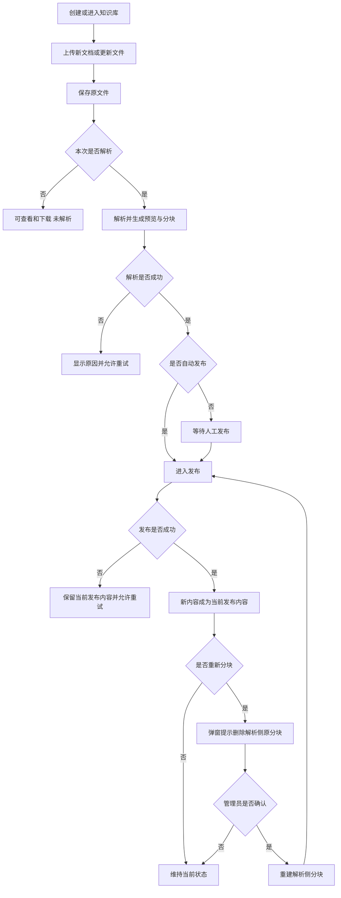

# 知识库文档生命周期需求说明书

> 功能标识：`knowledge-base-document-lifecycle`
> 版本：V1.7.0
> 文档状态：已确认
> 创建日期：2026-07-31
> 更新日期：2026-08-03

## 一句话说明

为知识管理员提供从创建知识库、上传和更新文件，到解析、重新分块和发布的完整文档管理流程，并保证处理失败或重新分块期间不会静默影响当前已发布知识。

## 需求澄清摘要

### 已确认内容

| 序号 | 澄清问题 | 已确认结论 | 影响范围 |
| --- | --- | --- | --- |
| Q1 | V4 原型覆盖范围是否足以进入 SDD | V4 作为视觉基线已完成；首个 SDD 聚焦知识库与文档生命周期，缺失页面在本需求和后续设计中定义 | 范围、页面、验收 |
| Q2 | P0 是否包含发布撤回和历史回退 | P0 不设计撤回和回退功能 | 范围、状态、验收 |
| Q3 | 已发布文档重新分块期间如何提供知识 | 重新分块只替换解析侧派生分块；当前已发布内容继续可用，新分块重新发布成功后才替换当前发布内容 | 流程、可用性、验收 |
| Q4 | 普通上传与同名文件如何形成文档 | 普通上传始终创建新文档，相同文件名不会自动合并 | 上传规则、数据口径 |
| Q5 | P0 如何处理文件更新与版本概念 | 前端提供“更新文件”，只展示当前文件和当前处理状态；后端保留不可变版本能力，但 P0 不展示版本号、版本列表或历史版本 | 交互、兼容、范围 |
| Q6 | 知识库账号与用户体系如何建立 | Rag2OKF 使用邮箱作为唯一登录标识，并自行维护密码、会话、业务用户、工作空间成员和业务角色，不依赖外部统一认证服务 | 身份边界、权限、安全 |
| Q7 | 登录、个人中心和设置等页面由谁提供 | 全部业务页面由 Rag2OKF 自己设计和实现，不复用 Fons4Cloud 的业务页面 | 页面范围、原型、验收 |
| Q8 | P0 是否需要自助注册，采用哪种方式 | 需要 Rag2OKF 自有注册页；使用邮箱、密码、确认密码和展示名称注册，注册后直接建立个人工作空间与会话；P0 不发送验证邮件，也不建立邮箱已验证状态 | 注册、认证、页面、安全 |
| Q9 | Rag2OKF 使用的文本和向量化模型由谁配置 | 所有模型调用必须使用当前用户维护的 Provider 连接与模型档案；用户提供厂商、Base URL、模型名称和 API Key，系统不内置可运行的全局模型或平台密钥；提供常见厂商模板降低配置成本 | 模型设置、知识库设置、密钥安全、调用边界 |
| Q10 | 知识库如何保存不同用途的模型选择 | 使用独立的知识库模型绑定关系，按用途关联模型档案；知识库本身不保存固定的文本/向量模型字段，P0 启用回答生成和向量化两种用途，并为后续重排、视觉理解和 OKF 提取预留扩展 | 模型绑定、数据结构、接口兼容 |

已接受的澄清问题数量：10。

### 待确认内容

- 无。

## 背景与目标

- 背景：当前项目需要建立可追溯、可发布的个人/企业知识库基础能力，后续问答、OKF 和评测都依赖稳定的文档生命周期。
- 当前问题：仅保存文件无法区分原文件、解析结果、分块结果和已发布知识，也无法可靠处理自动化、失败重试和重新分块。
- 目标：让知识管理员明确控制文件是否解析、何时发布，并能查看处理状态、失败原因和当前结果；系统在重新处理或失败时保持已发布知识稳定可用。
- 不做会怎样：后续检索与 OKF 无法确认使用了哪份内容，重新分块可能造成知识短暂缺失或不可追溯替换。

## 需求范围

### 本次包含

- 登录后进入有权限的工作空间和知识库范围；
- Rag2OKF 自有邮箱密码登录页、邮箱密码注册页、会话入口、本地账号与业务用户、个人中心和设置页；
- 知识库创建、列表、编辑和基础配置；
- 用户级模型 Provider 连接、文本模型与向量化模型档案，以及知识库按用途对模型档案的独立绑定；
- 阿里云百炼、火山方舟、腾讯混元、智谱 BigModel 和 OpenAI-compatible 自定义模板；
- 模型配置连通性测试、API Key 替换和脱敏展示；
- `autoParse` 与 `autoPublish` 配置，以及默认解析和分块策略；
- PDF、DOCX、Markdown、TXT 文件上传；
- 原文件查看和下载；
- 上传时选择本次是否解析，或使用知识库默认设置；
- 手动解析、自动解析、解析预览、失败原因和重试；
- 解析结构、来源定位和分块调试预览；
- 手动发布、自动发布、发布失败原因和重试；
- 在已有文档上执行“更新文件”，前端始终只展示当前文件和当前状态；
- 重新分块前的风险提示、用户确认、分块重建和重新发布；
- 异步处理进度、结果和失败反馈；
- 亮色、暗色和跟随系统主题下的页面一致性。

### 本次不包含

- 发布撤回和历史版本回退；
- 前端版本号、版本列表、历史版本查看和版本对比；
- 知识问答、回答引用和 Query Trace；
- 文档向量化执行、向量检索和混合检索；本轮只建立用户模型配置、知识库绑定和动态调用边界；
- OKF 构建、审核、发布和知识地图；
- 评测中心和检索实验室；
- 扫描件人工 OCR 校正和解析结果在线编辑；
- 网页、数据库或第三方系统连接器；
- 复杂组织架构、字段级权限和多级审核；
- 手机号/短信验证码、验证邮件、邮箱验证码、第三方登录、忘记密码和管理员创建账号；
- 真实客户隐私、真实征信数据和真实授信决策材料；
- 在需求或技术设计开始前验证 MySQL、Elasticsearch 等运行环境连接。

## 角色与场景

| 角色或参与方 | 使用场景 | 触发条件 | 期望结果 |
| --- | --- | --- | --- |
| 知识管理员 | 创建和配置知识库 | 需要建立一个新的知识主题空间 | 获得可上传文件并配置自动处理方式的知识库 |
| 知识管理员 | 上传但暂不解析 | 文件当前只需保存和查看 | 文件可查看、下载，但不进入发布知识 |
| 知识管理员 | 自动或手动解析文件 | 文件需要参与后续发布 | 能看到解析进度、结构预览、分块预览和失败原因 |
| 知识管理员 | 发布解析成功的文件 | 文件内容已经检查并可供后续检索 | 发布成功后形成当前可用知识；失败时显示原因并可重试 |
| 知识管理员 | 更新已有文件 | 需要用新内容替换当前文件 | 前端展示更新后的当前文件，不暴露内部版本概念 |
| 知识管理员 | 调整分块策略并重新分块 | 当前分块不适合检索或回答 | 确认风险后重建分块，当前已发布知识在重新发布成功前保持可用 |
| 知识用户 | 使用后续知识能力 | 管理员已发布文件 | 只能间接受到当前成功发布内容的影响，不接触管理操作 |
| 已注册用户 | 登录 Rag2OKF | 输入已注册邮箱和有效密码 | 建立安全会话，并进入有成员关系的工作空间 |
| 已注册用户 | 维护个人资料和偏好 | 已进入个人中心或设置页 | 只维护展示资料与偏好，密码摘要和会话凭证不可见 |
| 新用户 | 注册并创建个人知识空间 | 输入格式有效且未被占用的邮箱、符合规则的密码与展示名称并同意服务条款 | 原子建立本地账号、个人工作空间和会话，并直接进入个人工作空间；不发送验证邮件 |

## 需求列表

| 需求编号 | 需求内容 | 优先级 | 关联场景 | 关联验收 |
| --- | --- | --- | --- | --- |
| REQ-001 | 用户通过 Rag2OKF 自有邮箱和密码登录；登录后只能进入自己有权访问的工作空间和知识库，业务权限由本地账号状态、成员关系和角色决定 | P0 | 登录与权限 | AC-001、AC-002、AC-026、AC-027、AC-028 |
| REQ-002 | 知识管理员可以创建、查看和编辑知识库，并配置自动解析、自动发布、默认解析策略和默认分块策略 | P0 | 创建知识库 | AC-003、AC-004 |
| REQ-003 | 知识管理员可以上传支持格式的文件，并在本次上传中选择是否解析；不解析时仍可查看和下载原文件 | P0 | 上传文件 | AC-005、AC-006、AC-007 |
| REQ-004 | 普通上传始终创建新文档，相同文件名不会被自动识别为已有文档或自动合并 | P0 | 上传文件 | AC-008 |
| REQ-005 | 知识管理员可以在已有文档上执行“更新文件”；前端只展示当前文件和当前处理状态，不显示版本概念 | P0 | 更新文件 | AC-009、AC-010 |
| REQ-006 | 系统支持手动和自动解析，明确展示排队、处理中、成功和失败状态，并提供解析结果、来源定位和分块调试预览 | P0 | 文档解析 | AC-011、AC-012、AC-013 |
| REQ-007 | 解析失败必须显示可理解的失败原因并允许重试，不能把失败文件静默视为解析成功 | P0 | 解析失败 | AC-014 |
| REQ-008 | 只有解析成功的文件才能发布；手动发布和自动发布遵循相同结果与失败语义 | P0 | 发布知识 | AC-015、AC-016 |
| REQ-009 | 发布过程必须展示处理中、成功和失败状态；发布失败时保留当前已发布内容，并允许管理员重试 | P0 | 发布失败 | AC-017、AC-018 |
| REQ-010 | 重新分块前必须通过弹窗说明原解析侧分块将被删除并重建，只有管理员明确确认后才执行 | P0 | 重新分块 | AC-019、AC-020 |
| REQ-011 | 已发布文档重新分块期间继续使用当前已发布内容；新分块只有重新发布成功后才能替换当前发布内容 | P0 | 重新分块与重新发布 | AC-021、AC-022 |
| REQ-012 | 上传、解析、重新分块和发布等异步操作必须可观察，重复提交和重试不能产生多个同时生效的发布结果 | P0 | 异步处理 | AC-023、AC-024 |
| REQ-013 | 页面必须遵循 V4 视觉基线，并支持亮色、暗色和跟随系统主题 | P0 | 所有管理页面 | AC-025 |
| REQ-014 | Rag2OKF 必须维护独立的登录账号、受保护的密码凭证、用户资料、状态、偏好和工作空间成员关系；密码明文不得被保存、返回或记录 | P0 | 用户体系与个人中心 | AC-026、AC-028、AC-029 |
| REQ-015 | 登录页、注册页、知识库页面、个人中心和分层设置页均由 Rag2OKF 设计并交付；Fons4Cloud 不提供这些业务页面 | P0 | 页面归属与信息架构 | AC-025、AC-030 |
| REQ-016 | 新用户可以在 Rag2OKF 自有注册页使用邮箱和密码创建本地账号；邮箱仅作为登录标识，不发送验证邮件、不代表邮箱所有权已经核验；注册成功后系统直接建立个人工作空间和安全会话 | P0 | 自助注册 | AC-031、AC-032 |
| REQ-017 | 已登录用户可以创建和维护自己的模型 Provider 连接，选择常见厂商模板或 OpenAI-compatible 自定义配置，并提供显示名称、厂商、Base URL 和 API Key | P0 | 模型设置 | AC-033、AC-035、AC-036 |
| REQ-018 | 用户可以在自己的 Provider 连接下分别配置文本模型和向量化模型档案，模型名称由用户填写；知识库必须按模型用途建立独立绑定，P0 至少支持回答生成与向量化，不使用固定模型字段、系统全局模型或其他用户的配置 | P0 | 模型与知识库设置 | AC-034、AC-035 |
| REQ-019 | Rag2OKF 使用用户配置的 Base URL、API Key 和模型名称进行测试与后续模型调用；API Key 只能替换、不能回显，配置无效或不可用时明确失败且不得静默回退 | P0 | 模型调用与凭证安全 | AC-033、AC-035、AC-036 |

## 业务规则

| 规则编号 | 规则内容 | 适用场景 | 例外或边界 |
| --- | --- | --- | --- |
| BR-001 | 原文件保存、文档解析和知识发布是三个独立步骤，不能合并成一个状态 | 全生命周期 | 自动处理只代表自动触发，仍需分别展示结果 |
| BR-002 | 未选择解析的文件只提供查看和下载，不生成解析结果、分块或发布知识 | 上传但不解析 | 后续可由管理员手动解析 |
| BR-003 | 自动发布只有在解析成功后才可触发，解析失败时不得进入发布 | 自动处理 | 无 |
| BR-004 | 普通上传不按文件名或内容自动合并，相同名称的文件可以作为两个独立文档存在 | 普通上传 | 无 |
| BR-005 | “更新文件”替换前端当前文件，但系统必须保留可追溯的不可变内容版本；P0 不向用户展示版本号和历史入口 | 更新文件 | 历史版本查看延期 |
| BR-006 | 更新文件后的解析和发布仍分别遵守知识库默认配置以及本次操作选择 | 更新文件 | 无 |
| BR-007 | 重新分块属于破坏性派生数据重建，必须先弹窗确认，取消后不得改变任何现有分块 | 重新分块 | 无 |
| BR-008 | 重新分块删除的是解析侧当前分块；当前已发布内容在新分块重新发布成功前保持可用 | 已发布文档重新分块 | 从未发布的文档没有线上内容需要保留 |
| BR-009 | 新发布失败不得替换当前已发布内容，也不得让两个发布结果同时生效 | 发布与重新发布 | 首次发布失败时保持未发布 |
| BR-010 | P0 不提供撤回或历史回退入口，也不允许通过其他管理操作隐式模拟撤回 | 发布管理 | 后续版本另行设计 |
| BR-011 | 知识库设置变化只影响后续上传或后续明确发起的操作，不自动批量重处理已有文档 | 设置修改 | 管理员可逐个发起重新解析或重新分块 |
| BR-012 | 用户必须在知识库上下文中管理文档，不能在一个知识库中访问另一个知识库的原文件或处理结果 | 权限与隔离 | 无 |
| BR-013 | Rag2OKF 负责本地账号查询和密码校验；密码只能保存为带随机盐的不可逆摘要，登录和注册请求中的密码明文只能在本次请求内短暂使用 | 登录与注册 | 禁止明文存储、日志记录、响应返回或可逆加密保存密码 |
| BR-014 | 登录成功只证明当前用户身份；知识库业务权限仍由本地账号状态、Workspace Member 和本地角色决定 | 全部业务操作 | 未建立成员关系的登录用户仍不能访问目标知识库 |
| BR-015 | P0 自助注册使用全局唯一的规范化邮箱、密码、确认密码和展示名称；邮箱 trim 后整体转小写，密码与确认密码必须一致且满足规则，并且不得与邮箱相同 | 自助注册 | 不发送验证邮件，不保存 `email_verified` 等验证状态；手机号和第三方账号注册延期 |
| BR-016 | 重复邮箱注册、弱密码、密码校验失败或请求过于频繁时不得建立会话；注册事务失败时不得留下缺少个人工作空间的半成账号 | 登录与注册 | 登录使用统一错误防止枚举；注册冲突提示不得确认该邮箱归属于某个既有用户 |
| BR-017 | Provider 连接和模型档案归当前用户所有；P0 个人工作空间中的知识库只能通过模型用途绑定引用其所有者可用的模型档案 | 模型配置与知识库设置 | 企业工作空间共享凭证与成员代付模式延期单独设计 |
| BR-018 | 厂商模板只预填协议、厂商和常见 Base URL，不内置 API Key，不把示例模型名称当作系统默认；用户必须确认实际模型名称 | 新建 Provider/模型档案 | Base URL 可因地域、工作空间专属域名或厂商升级而由用户修改 |
| BR-019 | API Key 创建后只显示掩码和更新时间；查看接口不返回可解密值，修改时必须提交新值完整替换 | API Key 管理 | 不支持找回原 Key；遗失时由用户在厂商侧轮换后重新填写 |
| BR-020 | 模型配置测试和后续模型调用必须按知识库绑定解析用户配置；配置缺失、停用、越权、解密失败或厂商调用失败时明确失败，不允许回退到应用配置、平台 Key、其他用户配置或不同模型 | 所有模型调用 | 本轮不执行文档向量化，但后续 RAG/OKF 必须复用本规则 |
| BR-021 | 修改模型档案只影响未来新发起的操作，不静默重跑既有文档；未来变更向量化模型或维度时必须明确触发重新向量化和索引兼容流程 | 设置修改 | 当前 BM25 发布内容不因模型设置修改而变化 |
| BR-022 | 一个知识库对同一模型用途最多保留一个有效绑定；修改模型选择时更新该用途绑定，不修改知识库主记录，也不自动重处理既有文档 | 知识库模型设置 | P0 启用 `ANSWER_GENERATION` 与 `EMBEDDING`；`RERANK`、`DOCUMENT_UNDERSTANDING`、`OKF_EXTRACTION` 等用途后续按能力启用 |

## 业务流程

### 主要流程

1. 新用户可以使用全局唯一的规范化邮箱和符合规则的密码注册；系统不发送验证邮件，成功后原子获得本地账号、个人工作空间与安全会话。
2. 知识管理员创建知识库并设置自动解析、自动发布以及默认处理策略。
3. 管理员上传文件，并决定本次是否解析。
4. 系统先保存原文件；若不解析，流程结束于“可查看、可下载、未解析”。
5. 若需要解析，系统展示处理进度，并在成功后提供解析结构、来源定位和分块调试预览。
6. 若启用自动发布，解析成功后自动开始发布；否则等待管理员人工发布。
7. 发布成功后形成当前可用知识；发布失败时展示失败原因并保留原有可用结果。
8. 管理员可以在已有文档上执行“更新文件”，随后按相同解析和发布规则处理新内容。
9. 管理员可以调整分块策略并重新分块；确认警告后重建解析侧分块，重新发布成功后再替换当前发布内容。

### 异常或分支

- 文件格式不支持、文件损坏或超过限制时，上传失败并显示明确原因，不创建可误认为成功的文档。
- 解析失败时保留原文件，显示失败阶段和原因，可调整解析策略后重试。
- 发布失败时保留解析结果和当前已发布内容，显示失败原因并允许重试。
- 重新分块弹窗被取消时，不删除原分块、不触发处理任务。
- 更新文件失败时，前端继续展示更新前的当前文件，不出现半更新状态。
- 用户无权限时，不展示或执行知识库及文档管理操作。
- 邮箱格式非法或已不可用于注册、密码不符合规则、两次密码不一致、注册过于频繁或注册事务失败时，不建立会话，也不留下半成账号或孤立工作空间。

### 流程图

## 业务数据口径

### 数据影响判断

| 检查项 | 是否涉及 | 说明 |
| --- | --- | --- |
| 新增、修改、删除或查询持久化数据 | 是 | 涉及知识库、原文件、解析结果、分块、处理记录和发布结果 |
| 外部数据入库、出库、同步、对账或报表 | 是 | 用户文件进入系统，原文件可以查看和下载 |
| 字段映射、金额、日期、状态、流水号或客户标识 | 是 | 需要统一知识库、文档、处理任务和发布状态；不处理金融业务金额或真实客户标识 |
| 密码、邮箱、API Key、证件号、银行卡、合同、地址、交易流水等敏感数据 | 是 | 登录和注册会处理个人邮箱与密码；模型设置会处理第三方 API Key，Key 必须加密保存且不得回显；知识语料仍不得包含真实客户或真实金融敏感数据 |
| 跨系统、跨服务、跨库或第三方数据流转 | 是 | 文件、解析结果和发布知识会进入不同处理环节；模型测试和未来调用会把必要输入发送到用户选择的模型厂商 |

### 关键数据口径

| 业务对象/数据项 | 用户能理解的含义 | 来源或产生方式 | 单位/格式/状态口径 | 本次是否变化 | 是否关键 | 确认状态 |
| --- | --- | --- | --- | --- | --- | --- |
| 知识库 | 一个有独立文档、设置和权限范围的知识空间 | 知识管理员创建 | 名称、描述、自动处理设置 | 是 | 是 | 已确认 |
| 原文件 | 用户上传且可查看、下载的证据文件 | 普通上传或更新文件 | PDF、DOCX、Markdown、TXT | 是 | 是 | 已确认 |
| 当前文件 | 前端当前展示和处理的文件内容 | 首次上传或最近一次成功更新 | 不显示版本号和历史列表 | 是 | 是 | 已确认 |
| 文档内容版本 | 系统为每次成功上传或更新保留的不可变内容记录 | 系统在后台产生 | P0 不向用户显示版本概念 | 是 | 是 | 已确认 |
| 解析状态 | 文件当前是否已完成结构化解析 | 解析任务产生 | 未开始、排队、处理中、成功、失败 | 是 | 是 | 已确认 |
| 解析结果 | 从原文件得到的标题、段落、列表、表格、图片说明和来源定位 | 解析成功后产生 | 只读预览；失败不得生成伪成功结果 | 是 | 是 | 已确认 |
| 分块结果 | 为后续检索准备的可重建内容片段 | 解析成功或重新分块后产生 | 重新分块确认后删除解析侧原分块并重建 | 是 | 是 | 已确认 |
| 发布状态 | 文档内容是否已经成为当前可用知识 | 发布任务产生 | 未发布、发布中、已发布、发布失败 | 是 | 是 | 已确认 |
| 当前发布内容 | 后续知识能力当前可以使用的稳定内容 | 最近一次发布成功后产生 | 新发布失败或重新分块期间继续保留旧内容 | 是 | 是 | 已确认 |
| 处理任务 | 上传、解析、重新分块或发布的进度记录 | 用户操作或自动设置触发 | 排队、处理中、成功、失败，可重试 | 是 | 是 | 已确认 |
| 本地账号 | Rag2OKF 内用于登录、承载资料、状态和偏好的用户身份 | 用户使用邮箱自助注册 | 规范化邮箱全局唯一；账号状态不直接等于知识库角色 | 是 | 是 | 已确认 |
| 登录邮箱 | 用户注册和登录时使用的唯一账号标识 | 用户输入，系统 trim 后整体转小写 | 最大 254 字符、格式有效、全局唯一；P0 未验证邮箱所有权 | 是 | 是 | 已确认 |
| 密码凭证 | 用于校验用户登录密码的安全凭证 | 注册时由密码生成，登录时只做匹配 | 只保存带随机盐的不可逆摘要；明文不得持久化、返回或记录 | 是 | 是 | 已确认 |
| Provider 连接 | 用户可复用的一组模型厂商访问配置 | 用户选择模板或自定义填写 | 厂商、Base URL、API Key 状态；只属于当前用户 | 是 | 是 | 已确认 |
| 模型档案 | 文本或向量化模型的可选择配置 | 用户在 Provider 连接下填写 | 类型为文本/向量化，模型名称由用户提供；向量维度可选记录 | 是 | 是 | 已确认 |
| 模型 API Key | Rag2OKF 调用用户所选模型厂商的访问凭证 | 用户输入或替换 | 只加密保存；页面和 API 只返回掩码，不支持读取原值 | 是 | 是 | 已确认 |
| 知识库模型绑定 | 当前知识库在某一模型用途中应使用哪个模型档案 | 知识库管理员从本人可用档案中选择 | 按用途独立绑定；P0 为回答生成和向量化，同一用途最多一个有效绑定；缺失时相关模型操作不可执行 | 是 | 是 | 已确认 |

## 影响说明

| 影响对象 | 影响说明 |
| --- | --- |
| 知识管理员 | 新增知识库配置、文件上传、更新、解析、重新分块、发布、预览和重试流程 |
| 知识用户 | 后续只使用成功发布的稳定知识，不受重新分块和发布失败的静默影响 |
| 既有 V4 原型 | 保留视觉和主题基线，新增知识库列表、文档管理、解析预览和发布状态页面定义 |
| Rag2OKF 前端 | 提供自有邮箱密码登录/注册页、应用外壳、个人中心和分层设置页 |
| Rag2OKF 认证体系 | 自主管理账号、密码校验、会话和知识库业务权限，不依赖外部统一认证服务 |
| Rag2OKF 模型体系 | 自主管理用户 Provider 连接、模型档案、知识库模型选择与加密凭证；不依赖应用全局模型配置 |
| 模型厂商 | 仅在用户主动测试配置或后续模型能力执行时接收必要请求；厂商可用性、计费和数据政策由用户选择承担 |
| 新用户 | 通过邮箱和密码注册，成功后直接进入个人工作空间；不会收到验证邮件 |
| 后续知识问答 | 获得可追溯、可稳定切换的当前发布内容，但本需求不实现问答 |
| 后续 OKF | 未来只能基于解析成功的文档构建，本需求不实现 OKF |
| 运行环境 | 数据库和检索服务连接验证属于实现与集成验证，不是进入需求或技术设计的前置条件 |

## 验收标准

- AC-001：Given 用户已登录且拥有某工作空间访问权限，when 用户进入知识库平台，then 只显示其有权访问的知识库。关联需求：REQ-001。
- AC-002：Given 登录用户是知识用户而非知识管理员，when 尝试创建知识库、上传、解析、重新分块或发布，then 管理入口不可用且操作被拒绝。关联需求：REQ-001。
- AC-003：Given 知识管理员填写知识库名称、描述和处理设置，when 创建知识库，then 知识库出现在列表中并显示已保存设置。关联需求：REQ-002。
- AC-004：Given 管理员修改知识库自动解析、自动发布或默认处理策略，when 保存设置，then 新设置只影响未来上传或后续明确发起的处理，不自动重处理已有文档。关联需求：REQ-002。
- AC-005：Given 管理员选择一个受支持格式文件，when 上传并选择“不解析”，then 文件上传成功且可查看、下载，解析状态为未开始、发布状态为未发布。关联需求：REQ-003。
- AC-006：Given 管理员选择一个受支持格式文件，when 上传并选择解析，then 系统保存原文件并根据本次选择或知识库默认设置进入解析。关联需求：REQ-003。
- AC-007：Given 文件格式不支持、文件损坏或超过已配置限制，when 管理员上传，then 系统拒绝上传并显示明确原因，不生成成功文档记录。关联需求：REQ-003。
- AC-008：Given 知识库中已有同名文件，when 管理员再次通过普通上传提交同名文件，then 系统创建一个独立文档，不自动合并或覆盖原文档。关联需求：REQ-004。
- AC-009：Given 管理员在已有文档中选择“更新文件”，when 新文件成功保存，then 页面展示新文件作为当前文件，并按本次处理选择继续。关联需求：REQ-005。
- AC-010：Given 文档已被更新一次或多次，when 管理员查看文档页面，then 页面不显示版本号、版本列表、历史版本或回退入口。关联需求：REQ-005。
- AC-011：Given 文件需要解析，when 解析任务执行，then 页面依次展示排队或处理中状态，并最终进入成功或失败状态。关联需求：REQ-006。
- AC-012：Given 文件解析成功，when 管理员查看解析结果，then 可以查看结构化内容、来源定位和分块调试预览。关联需求：REQ-006。
- AC-013：Given 文件选择不解析，when 管理员查看文档详情，then 不显示伪造的解析结果或分块，并提供手动解析入口。关联需求：REQ-006。
- AC-014：Given 解析任务失败，when 管理员查看文档，then 页面显示失败阶段和可理解原因，原文件仍可查看，并允许重新解析。关联需求：REQ-007。
- AC-015：Given 文件尚未解析成功，when 管理员尝试发布，then 发布操作不可执行并说明需要先解析。关联需求：REQ-008。
- AC-016：Given 文件解析成功，when 人工发布或自动发布被触发，then 两种方式进入相同发布流程并产生一致的状态和结果。关联需求：REQ-008。
- AC-017：Given 文件正在发布，when 管理员查看文档，then 页面显示发布中状态，重复操作不会产生多个同时生效的发布结果。关联需求：REQ-009。
- AC-018：Given 新发布任务失败且文档已有当前发布内容，when 管理员继续使用系统或选择重试，then 当前发布内容保持可用，页面显示失败原因和重试入口。关联需求：REQ-009。
- AC-019：Given 文档已有解析侧分块，when 管理员发起重新分块，then 弹窗明确提示原分块将被删除并重建。关联需求：REQ-010。
- AC-020：Given 重新分块确认弹窗已显示，when 管理员取消，then 原分块和当前发布内容均不发生变化；when 管理员确认，then 系统才开始删除解析侧原分块并重建。关联需求：REQ-010。
- AC-021：Given 已发布文档正在重新分块或等待重新发布，when 后续知识能力读取当前发布内容，then 仍使用重新分块前的已发布内容。关联需求：REQ-011。
- AC-022：Given 新分块已生成，when 重新发布成功，then 新分块对应内容成为唯一当前发布内容；when 重新发布失败，then 旧发布内容继续可用。关联需求：REQ-011。
- AC-023：Given 上传、解析、重新分块或发布是异步操作，when 管理员刷新页面或稍后返回，then 可以看到任务当前状态、完成结果或失败原因。关联需求：REQ-012。
- AC-024：Given 同一操作被重复提交或失败后重试，when 系统处理请求，then 不产生重复的当前文件、重复分块集合或多个同时生效的发布结果。关联需求：REQ-012。
- AC-025：Given 用户选择亮色、暗色或跟随系统主题，when 使用知识库列表、文档管理、解析预览和设置页面，then 页面布局、状态语义、焦点和文本对比保持一致且可识别。关联需求：REQ-013。
- AC-026：Given 用户在 Rag2OKF 登录页提交已注册邮箱和有效密码，when 规范化邮箱对应的本地密码校验通过且账号状态正常，then 系统通过统一响应返回登录令牌；后续请求使用 `Authentication: Bearer <token>` 访问其有权访问的工作空间。关联需求：REQ-001、REQ-014。
- AC-027：Given 邮箱未注册、密码错误、账号不可用或登录尝试超过限制，when 用户尝试登录，then 系统不创建有效会话，并通过统一响应显示不泄露邮箱注册状态和内部信息的错误。关联需求：REQ-001。
- AC-028：Given 用户已经登录但没有目标工作空间成员关系或管理员角色，when 访问或管理目标知识库，then 系统仍按本地业务权限拒绝操作。关联需求：REQ-001、REQ-014。
- AC-029：Given 已登录用户进入个人中心，when 查看或修改资料与偏好，then 仅本人上下文可以查看只读登录邮箱，其他输出和日志按规则脱敏；系统只读写允许修改的本地业务字段，不展示密码摘要、会话凭证或邮箱验证状态。关联需求：REQ-014。
- AC-030：Given 用户访问 Rag2OKF，when 使用登录、注册、知识库、个人中心和设置功能，then 页面均由 Rag2OKF 自有前端提供，并在统一应用外壳和三主题视觉体系下工作。关联需求：REQ-015。
- AC-031：Given 新用户输入格式有效且未被占用的邮箱、符合规则且两次一致的密码、展示名称并同意服务条款，when 在 Rag2OKF 注册页提交，then 系统规范化邮箱并原子创建本地账号、个人工作空间和管理员成员关系，不发送验证邮件，直接建立安全会话并进入知识库主页。关联需求：REQ-016。
- AC-032：Given 邮箱格式非法或已不可用于注册、密码不符合规则、两次密码不一致、请求过于频繁或注册事务失败，when 用户提交注册，then 系统不建立有效会话、不留下半成账号或孤立工作空间，也不建立邮箱验证状态，并显示明确但不确认既有用户身份的错误。关联需求：REQ-016。
- AC-033：Given 已登录用户选择厂商模板或 OpenAI-compatible 自定义配置并填写 Base URL 与 API Key，when 保存并发起连接测试，then Rag2OKF 使用本次用户配置访问目标服务，返回不含凭证和厂商原始敏感信息的成功或失败结果。关联需求：REQ-017、REQ-019。
- AC-034：Given 用户已经创建可用 Provider 连接和文本/向量化模型档案，when 创建或编辑知识库模型设置，then 系统按 `ANSWER_GENERATION` 与 `EMBEDDING` 用途分别保存当前用户有权使用的模型档案绑定，同一知识库同一用途最多一个有效绑定；页面展示用途、厂商与模型名称但不展示 API Key。关联需求：REQ-018。
- AC-035：Given 知识库未配置所需模型、引用了已停用档案、档案不属于当前用户或目标厂商不可用，when 发起模型测试或未来模型处理，then 操作明确失败并指向模型设置，不使用应用全局模型、其他用户配置或其他模型兜底。关联需求：REQ-017～REQ-019。
- AC-036：Given 用户已经保存 API Key，when 再次查看、编辑、记录日志或获取错误结果，then 原 API Key 不被返回、记录或写入前端持久化；只有提交新 Key 才能替换旧值，旧密文不再用于新调用。关联需求：REQ-017、REQ-019。

## 质量要求

- 性能：上传和异步处理必须及时反馈已受理状态；列表、详情和任务状态查询应满足日常管理操作的响应体验，具体容量和时间阈值在技术设计中给出验证方案并在实现阶段校准。
- 安全：知识库、原文件、解析结果、处理状态和模型配置必须按本地用户、工作空间成员与角色隔离；密码明文不得持久化、返回或记录，密码摘要不得通过页面或 API 暴露；模型 API Key 必须加密保存、只允许替换且不得回显、记录或写入前端持久化；用户自定义 Base URL 必须防止服务端请求伪造；会话令牌不得进入 MySQL、日志或前端持久化存储；登录和注册必须限制暴力尝试并防止邮箱枚举；P0 演示不得使用真实金融敏感数据。
- 兼容：后端保留不可变内容版本能力，P0 前端隐藏版本概念；未来增加版本列表和回退时不得破坏现有普通上传与“更新文件”语义。
- 可用性：解析、发布或重新分块失败必须可见、可定位、可重试；新处理失败不能静默替换当前已发布内容。
- 可访问性：关键操作支持键盘焦点、明确标签和非颜色唯一状态表达；亮暗主题均满足可读性要求。
- 可追溯性：管理员能够区分原文件、解析结果、分块结果和当前发布内容，并看到异步处理结果。

## 风险与待确认

### 风险

- 文件解析质量会影响后续分块与发布，但解析器选型和真实质量验证属于技术设计与实现阶段。
- P0 隐藏版本概念后，更新文件必须避免让用户误解为直接覆盖且无法追溯。
- 重新分块同时涉及解析侧派生内容和当前发布内容，若边界实现错误可能造成知识短暂缺失。
- 自动解析和自动发布需要与人工操作保持相同规则，避免出现两套行为。
- P0 不验证邮箱所有权，存在用户误填或冒用他人邮箱作为登录标识的风险；产品必须明确说明邮箱未验证，并禁止把它用于密码找回、通知或身份凭据。
- API Key 泄露会导致用户模型账户被滥用或产生费用，必须进行应用层加密、脱敏、最小权限和日志断言。
- 用户可填写 Base URL 会产生 SSRF、DNS 重绑定和重定向到内网的风险；默认仅允许 HTTPS 公网地址，私有地址只能由部署侧白名单显式开放。
- 厂商协议虽标记 OpenAI-compatible，模型能力、Embedding 参数、错误格式和流式行为仍可能不同，模板必须经过契约测试且不能承诺完全兼容。

### 假设

- V4 已作为视觉基线确认，不要求在 SDD 前补齐全部页面高保真原型。
- P0 在 Rag2OKF 本地使用知识管理员和知识用户两个业务角色，不直接复用认证服务角色，不引入复杂组织权限。
- P0 自助注册只启用邮箱和密码；邮箱 trim 后整体转小写、最大 254 字符且全局唯一，密码使用 8～64 位且不能与邮箱相同；验证邮件、手机号、第三方登录和密码找回延期。
- 数据库、对象存储和检索服务的连接与健康验证在实现/集成阶段执行，不阻塞需求和技术设计。
- P0 模型配置归个人用户所有，个人工作空间知识库只能引用所有者档案；企业共享 Provider、额度分摊和成员可见性延期。
- 厂商模板只提供经官方文档核对的常见 Base URL 和协议提示，模型名称、API Key、地域及计费账户由用户确认。

### 待确认

- 单文件大小、页数、解析超时和并发容量阈值由技术设计提出候选值，并在实现验证后校准，不阻塞当前业务需求。
- 具体解析策略、分块参数和检索投影参数由技术设计定义可配置边界，不阻塞当前业务需求。

## 版本修订记录

| 日期 | 版本 | 说明 |
| --- | --- | --- |
| 2026-07-31 | V1.0.0 | 初始化正式需求说明书，确认 P0 隐藏版本概念、延期撤回/回退及重新分块期间保留当前发布内容 |
| 2026-08-03 | V1.7.0 | CR-011：认证改为 `Authentication: Bearer <token>`，登录成功返回令牌；认证相关接口统一采用 `R<T>`、集中异常端点和枚举状态语义 |
| 2026-07-31 | V1.1.0 | 明确 Fons4Cloud 仅通过 Dubbo 提供认证能力，Rag2OKF 自建业务用户、权限、登录、个人中心与设置页面 |
| 2026-07-31 | V1.2.0 | 新增 Rag2OKF 手机号验证码注册页与注册成功后的本地用户、个人工作空间和会话建立流程 |
| 2026-07-31 | V1.3.0 | CR-004 改为 Rag2OKF 自有账号密码认证与注册，使用独立会话能力，不再依赖外部 Auth/Communication 服务 |
| 2026-07-31 | V1.4.0 | CR-005 将唯一登录标识调整为邮箱；采用邮箱密码登录注册，P0 不发送验证邮件、不建立邮箱已验证状态 |
| 2026-07-31 | V1.5.0 | CR-008 新增用户级 Provider 连接、文本/向量化模型档案、知识库模型绑定、厂商模板和 API Key 安全规则 |
| 2026-07-31 | V1.6.0 | CR-009 将知识库固定模型字段改为独立的按用途模型绑定，P0 启用回答生成与向量化并预留后续模型用途扩展 |
