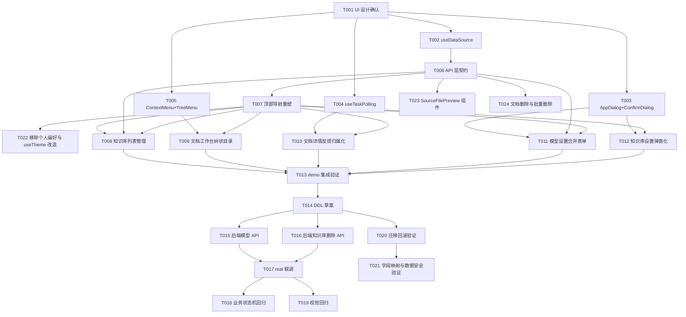

# 前端交互体系重设计任务规划

> 功能标识：`frontend-interaction-redesign`
> 版本：V1.0.0
> SDD 等级：S2
> 创建日期：2026-08-07
> 实现确认状态：`pending`
> 关联需求说明书：`spec/features/20260807/前端交互体系重设计-需求说明书.md`
> 关联技术设计说明书：`spec/features/20260807/前端交互体系重设计-技术设计说明书.md`

## 任务总览

本规划共 24 个任务，按依赖顺序分为 7 批：

1. **UI 设计确认**（T001）：确认技术设计中的页面方案
2. **前端基础组件**（T002-T005，可并行）：演示数据切换、弹窗组件、轮询 composable、树状/右键组件
3. **API 层契约与外壳**（T006-T007）：前端 API 契约定义、顶部导航重塑；T022（可并行）：移除个人偏好页面与 useTheme 改造；T023（可并行）：SourceFilePreview 组件与源文件预览 API；T024（可并行）：文档列表删除与批量删除
4. **核心页面重设计**（T008-T012）：知识库列表、文档工作台、文档详情、模型设置、知识库设置
5. **集成验证**（T013）：demo 模式全交互流验证
6. **后端数据结构与 API**（T014-T016）：DDL 草案、模型 API 合并、知识库删除 API
7. **联调与回归**（T017-T021）：real 模式联调、业务状态机回归、视觉回归、迁移回滚验证、字段映射与数据安全合规验证

可并行组：T002、T003、T004、T005 互不依赖，可并行执行。

---

## 任务清单

- [x] T001 确认前端交互体系 UI 设计方案
  - 通俗解释: 在动手写代码前，先和用户确认技术设计说明书中的页面信息架构、布局方案、操作流和反馈策略，避免实现后大改。
  - AC: AC-001, AC-006, AC-014
  - 来源: 技术设计说明书 §2.2、§5.1、§5.8
  - Files: spec/features/20260807/前端交互体系重设计-技术设计说明书.md
  - Depends: 无
  - Verification: 给定技术设计说明书已生成，当逐项确认页面清单（知识库列表、文档工作台、文档详情、模型设置、知识库设置）、顶部导航布局、中央弹窗模式、信息密度规则后，用户明确确认方案可行或提出调整；调整后的方案同步回技术设计说明书的版本修订记录。
  - Quality: 确认覆盖所有 18 条 AC 对应的页面落点；确认敏感信息（API Key）展示策略延续只显示掩码；确认三主题与响应式不回退。
  - Done: 用户确认技术设计方案可行，或调整后方案已回写技术设计说明书；后续页面实现任务以此为基线。
  - 专业工作流: 无

- [x] T002 [P] 实现演示数据切换机制与 mock 数据
  - 通俗解释: 让前端能用演示数据走通全部交互，不依赖后端，交互满意后再切换真实接口。
  - AC: AC-015
  - 来源: 技术设计说明书 §3.3、§5.6 BR-006
  - Files: fons4ai-rag2okf-ui/src/composables/useDataSource.ts; fons4ai-rag2okf-ui/src/api/mock/knowledge-bases.ts; fons4ai-rag2okf-ui/src/api/mock/documents.ts; fons4ai-rag2okf-ui/src/api/mock/models.ts; fons4ai-rag2okf-ui/src/composables/__tests__/useDataSource.spec.ts
  - Depends: T001
  - Verification: 给定环境变量 `VITE_RAG2OKF_DATA_SOURCE=demo`，当调用 `useDataSource()` 后，`isDemo` 返回 true；当 api 层函数检测到 demo 模式时返回本地 mock 数据，不发起网络请求；当切换为 real 模式时，走真实 `http.request`；demo mock 不写入 localStorage 真实 key。
  - Quality: mock 数据结构忠实模拟真实接口响应（KnowledgeBaseSummary 含 ownerUserKey/canDelete、ModelConfig 合并后结构、DocumentSummary）；切换不污染真实数据；运行时开关刷新后回归环境变量默认值。
  - Done: useDataSource composable 可用；demo 模式下知识库/文档/模型 API 返回 mock 数据；real 模式走真实请求；单元测试覆盖切换逻辑。
  - 专业工作流: 无

- [x] T003 [P] 升级 AppDialog 并新增 ConfirmDialog 组件
  - 通俗解释: 让所有新增和编辑操作统一用页面中央弹窗，破坏性操作有专门的确认弹窗。
  - AC: AC-006, AC-007
  - 来源: 技术设计说明书 §5.2、§5.6
  - Files: fons4ai-rag2okf-ui/src/components/ui/AppDialog.vue; fons4ai-rag2okf-ui/src/components/ui/ConfirmDialog.vue; fons4ai-rag2okf-ui/src/components/ui/index.ts; fons4ai-rag2okf-ui/src/components/ui/__tests__/AppDialog.spec.ts; fons4ai-rag2okf-ui/src/components/ui/__tests__/ConfirmDialog.spec.ts
  - Depends: T001
  - Verification: 给定 AppDialog 打开，当传入 `size="lg"` 时弹窗宽度对应大尺寸；当传入 `persistent` 时点击遮罩不关闭；当按 Esc 时弹窗关闭且焦点返回触发元素；当有未保存内容时提示用户。给定 ConfirmDialog 打开（danger 样式），当用户点击确认时触发 confirm 事件，点击取消时关闭不触发。
  - Quality: DDD-lite 检查：组件为纯展示层，不含业务规则，弹窗的打开/关闭状态由调用方管理；延续现有 AppDialog 焦点陷阱实现；ConfirmDialog 基于 AppDialog 组合；三主题下 danger 样式语义一致；键盘可访问（Tab/Enter/Esc）。
  - Done: AppDialog 支持 size 和 persistent prop；ConfirmDialog 组件可用并导出；组件测试覆盖焦点、Esc、遮罩、确认/取消流程。
  - 专业工作流: 无

- [x] T004 [P] 实现 useTaskPolling composable
  - 通俗解释: 让文档异步任务（解析、发布、重新分块）的进度刷新只在任务运行时进行，终态自动停止，不遮蔽整页。
  - AC: AC-013
  - 来源: 技术设计说明书 §5.4
  - Files: fons4ai-rag2okf-ui/src/composables/useTaskPolling.ts; fons4ai-rag2okf-ui/src/composables/__tests__/useTaskPolling.spec.ts
  - Depends: T001
  - Verification: 给定任务状态为 QUEUED，当 start() 被调用后，首次轮询在 2s 后执行；每次轮询间隔 ×1.5，上限 15s；当任务状态变为 SUCCEEDED 或 FAILED 时轮询停止；当组件卸载时定时器清理；当重叠请求发生时复用进行中的 Promise（单飞）。
  - Quality: DDD-lite 检查：轮询策略（退避、终态判断、单飞）为领域规则封装在 composable 中，视图只消费回调数据不包含轮询控制逻辑；指数退避系数与上限可配置；onUpdate 回调只更新传入数据，不触发整页重渲染；无内存泄漏（定时器与监听器清理）。
  - Done: useTaskPolling 可用；单元测试覆盖退避、终态停止、单飞、卸载清理；DocumentDetailView 可接入替换固定 setInterval。
  - 专业工作流: 无

- [x] T005 [P] 实现 ContextMenu 与 TreeMenu 组件
  - 通俗解释: 让知识库目录能右键创建，文档列表能以树状结构展示目录层级。
  - AC: AC-010, AC-011
  - 来源: 技术设计说明书 §5.5
  - Files: fons4ai-rag2okf-ui/src/components/ui/ContextMenu.vue; fons4ai-rag2okf-ui/src/components/ui/TreeMenu.vue; fons4ai-rag2okf-ui/src/components/ui/index.ts; fons4ai-rag2okf-ui/src/components/ui/__tests__/ContextMenu.spec.ts; fons4ai-rag2okf-ui/src/components/ui/__tests__/TreeMenu.spec.ts
  - Depends: T001
  - Verification: 给定 TreeMenu 传入嵌套 FolderNode 数据，当渲染时递归展示目录层级，可展开收起；给定在目录区域右键，当触发 contextmenu 事件时，ContextMenu 弹出含"新建目录"选项；当点击"新建目录"时触发对应事件。
  - Quality: TreeMenu 递归渲染层级正确；ContextMenu 定位跟随鼠标；移动端无右键时兼容（按钮入口补充）；三主题下样式一致。
  - Done: ContextMenu 和 TreeMenu 组件可用并导出；组件测试覆盖递归渲染、展开收起、右键触发、选项点击。
  - 专业工作流: 无

- [x] T006 实现前端 API 层合并契约
  - 通俗解释: 让前端 API 层支持合并后的模型配置单步接口和知识库删除接口，为页面重设计提供数据层基础。
  - AC: AC-008, AC-003, AC-004, AC-005
  - 来源: 技术设计说明书 §3.1、§3.2
  - Files: fons4ai-rag2okf-ui/src/api/models.ts; fons4ai-rag2okf-ui/src/api/knowledge-bases.ts; fons4ai-rag2okf-ui/src/api/__tests__/models.spec.ts; fons4ai-rag2okf-ui/src/api/__tests__/knowledge-bases.spec.ts
  - Depends: T002
  - Verification: 给定 models.ts 重写为 ModelConfig 契约，当调用 listModelConfigs() 时返回 ModelConfig[]；当调用 createModelConfig(input) 时 POST /model-configs；当调用 deleteKnowledgeBase(key) 时 DELETE /knowledge-bases/{key}；KnowledgeBaseSummary 含 ownerUserKey 和 canDelete 字段。
  - Quality: 旧的两步式 API（createModelConnection/createModelProfile）移除；API Key 只在创建或替换时提交，更新其他字段不提交；demo 模式下走 mock，real 模式走 http.request。
  - Done: models.ts 导出 ModelConfig 类型和单步 CRUD 函数；knowledge-bases.ts 导出 deleteKnowledgeBase 和扩展后的 KnowledgeBaseSummary；API 层测试覆盖契约。
  - 专业工作流: 无

- [x] T007 重塑 Rag2OkfAppShell 为顶部导航并实现动态面包屑
  - 通俗解释: 废弃左侧轨道和上下文栏，改为顶部导航，主导航为 logo 首页、知识库、搜索 disabled、聊天 disabled，移除 OKF/问答/评测占位，面包屑反映真实层级。
  - AC: AC-001, AC-002
  - 来源: 技术设计说明书 §2.2、§5.1
  - Files: fons4ai-rag2okf-ui/src/layouts/Rag2OkfAppShell.vue; fons4ai-rag2okf-ui/src/layouts/__tests__/Rag2OkfAppShell.spec.ts
  - Depends: T006
  - Verification: 给定用户已登录，当查看应用顶部时，看到顶部导航栏（logo 首页图标、知识库可用，搜索 disabled、聊天 disabled，无 OKF/问答/评测占位）；当切换路由时，导航选中态与当前页面一致（知识库相关路由高亮"知识库"）；evidence-rail 和 contextbar 不再渲染。
  - Quality: 顶部导航只展示真实可用能力或明确的不可用状态（搜索/聊天 disabled），不展示无对应功能的普通占位；三主题下导航样式一致；窄屏导航降级；键盘可访问。
  - Done: Rag2OkfAppShell 移除 evidence-rail 和 contextbar；topbar 改造为顶部导航；导航项为 logo 首页、知识库、搜索 disabled、聊天 disabled；导航选中态计算正确；外壳测试覆盖导航项与选中态。
  - 专业工作流: 无

- [x] T022 [P] 移除个人偏好页面并改造 useTheme 为 localStorage 持久化
  - 通俗解释: 移除个人偏好设置页面及其路由，主题切换改为 topbar 独立按钮 + localStorage 缓存，不再依赖后端 preferenceJson。
  - AC: AC-019
  - 来源: 技术设计说明书 §5.1 useTheme 改造、§8.5 兼容性
  - Files: fons4ai-rag2okf-ui/src/composables/useTheme.ts; fons4ai-rag2okf-ui/src/views/settings/PersonalSettingsView.vue; fons4ai-rag2okf-ui/src/router/index.ts; fons4ai-rag2okf-ui/src/layouts/Rag2OkfAppShell.vue
  - Depends: T007
  - Verification: 给定 useTheme 改造完成，当用户在 topbar 点击主题切换按钮时，主题在 light → dark → system 循环切换，localStorage 键 `rag2okf.theme` 同步更新；当用户刷新或重新打开页面时，主题沿用 localStorage 缓存值；当访问路由 `/settings/personal` 时，路由不存在或重定向；PersonalSettingsView.vue 文件已删除；默认分块大小和重叠量配置不再出现在任何页面。
  - Quality: DDD-lite 检查：主题持久化（localStorage 读写）为基础设施关注点封装在 useTheme composable 内，视图只调用 setTheme 不直接操作 localStorage；loadTheme 容错（无缓存默认 system、非法值默认 system）；移除 PersonalSettingsView 不影响账号菜单其他入口；不再调用后端 `PUT /users/me/preference` 保存主题；三主题切换在 light/dark/system 下视觉一致。
  - Done: PersonalSettingsView.vue 删除；路由 `/settings/personal` 移除；useTheme 改为 localStorage 持久化（键 `rag2okf.theme`）；topbar 主题切换按钮直接调用 setTheme；默认分块参数移除；主题切换后刷新沿用缓存。
  - 专业工作流: 无

- [x] T023 [P] 新增 SourceFilePreview 组件与源文件预览 API
  - 通俗解释: 新增一个按文件格式分组件渲染的源文件预览组件，支持图片/PDF/Markdown/TXT/DOCX，并扩展 API 层获取源文件内容。
  - AC: AC-020
  - 来源: 技术设计说明书 §3.3 文档管理 API 扩展、§5.5 源文件预览区
  - Files: fons4ai-rag2okf-ui/src/components/document/SourceFilePreview.vue; fons4ai-rag2okf-ui/src/api/documents.ts; fons4ai-rag2okf-ui/src/components/document/__tests__/SourceFilePreview.spec.ts
  - Depends: T006
  - Verification: 给定 SourceFilePreview 组件接收 contentType 和 blobUrl，当 contentType 为 image/* 时用 `` 渲染；当为 application/pdf 时用 `<iframe>` 渲染；当为 text/markdown 时用 markdown-it 转 HTML 渲染；当为 text/plain 时用 `<pre>` 渲染（限制 100KB）；当为 DOCX 时用 mammoth.js 转 HTML 渲染；当为不支持的格式时显示下载链接；给定 API 层调用 getSourceContent(documentKey)，返回 { blobUrl, contentType, filename }。
  - Quality: DDD-lite 检查：渲染策略选择（contentType → 组件）为纯展示逻辑封装在组件内，不含业务规则；markdown-it 和 mammoth.js 按需引入（动态 import 避免首屏加载）；blobUrl 在组件卸载时 revokeObjectURL 释放内存；大文件 TXT 限制前 100KB 避免卡顿；DOCX 转换失败时降级为下载链接；三主题下预览样式一致。
  - Done: SourceFilePreview 组件实现 5 种格式渲染 + 不支持格式下载链接；documents.ts 新增 getSourceContent 函数；markdown-it 和 mammoth.js 依赖引入；组件测试覆盖各格式渲染和降级。
  - 专业工作流: 无

- [x] T024 [P] 重塑 DocumentsView 支持文档删除与批量删除
  - 通俗解释: 让文档列表页支持管理操作，用户可以勾选文档单个或批量删除，删除必须二次确认。
  - AC: AC-024, AC-014
  - 来源: 技术设计说明书 §5.10 文档列表管理操作
  - Files: fons4ai-rag2okf-ui/src/views/documents/DocumentsView.vue; fons4ai-rag2okf-ui/src/views/documents/__tests__/DocumentsView.spec.ts; fons4ai-rag2okf-ui/src/api/documents.ts
  - Depends: T003, T006, T009
  - Verification: 给定用户在文档列表页，当每行有 checkbox 可勾选，顶部有全选 checkbox；给定用户勾选一个或多个文档，当点击"批量删除"时弹出 ConfirmDialog 显示选中数量，确认后执行删除并从列表移除；给定用户点击单行操作菜单的"删除"，当弹出 ConfirmDialog 时，确认后执行删除；删除操作有独立 loading/error/success 反馈，不冻结整页；demo 模式下删除即时移除 mock 数据，real 模式调用 deleteDocument/batchDeleteDocuments API。
  - Quality: DDD-lite 检查：勾选状态（selectedKeys）为视图状态，删除操作的业务语义（软删除+ES 清理）在后端，视图只编排交互；删除操作独立 ActionState（loading/error/success），不使用全局锁；批量删除失败时返回成功和失败列表，部分成功的从列表移除，失败的可重试；删除二次确认用 ConfirmDialog（danger + persistent）；三主题下管理操作样式一致；文档列表信息密度合理（树状目录 + 文档表格 + 管理操作）。
  - Done: DocumentsView 新增 checkbox 勾选机制和批量操作栏；单行操作菜单含删除；单个删除和批量删除均二次确认；documents.ts 新增 deleteDocument 和 batchDeleteDocuments 函数；删除反馈归属化；视图测试覆盖勾选、单个删除、批量删除、二次确认。
  - 专业工作流: 无

- [x] T008 [P] 重塑 KnowledgeBaseListView 支持重命名与删除
  - 通俗解释: 让用户在知识库列表页直接重命名或删除知识库，删除必须二次确认且仅创建者可执行。
  - AC: AC-003, AC-004, AC-005, AC-014
  - 来源: 技术设计说明书 §5.6、§5.8
  - Files: fons4ai-rag2okf-ui/src/views/knowledge-bases/KnowledgeBaseListView.vue; fons4ai-rag2okf-ui/src/views/knowledge-bases/__tests__/KnowledgeBaseListView.spec.ts
  - Depends: T003, T006, T007
  - Verification: 给定用户是知识库创建者（canDelete=true），当点击卡片操作菜单时，看到重命名和删除选项；当点击重命名时弹出 AppDialog，输入新名称后列表即时更新；当点击删除时弹出 ConfirmDialog（danger），输入知识库名称确认后删除，取消则不删除；给定非创建者（canDelete=false），删除入口不可见。
  - Quality: 删除二次确认输入名称防止误删；前端 canDelete 控制可见性，服务端二次校验；操作反馈归属到触发位置（局部 ref）；卡片右上角操作菜单提升操作密度；三主题一致。
  - Done: KnowledgeBaseListView 卡片支持操作菜单；重命名用 AppDialog；删除用 ConfirmDialog 输入名称确认；非创建者无删除入口；视图测试覆盖重命名与删除流程。
  - 专业工作流: 无

- [x] T009 重塑 DocumentsView 为树状目录与右键创建
  - 通俗解释: 让文档工作台的目录以树状结构展示，用户可以右键创建目录，文档列表按目录层级组织。
  - AC: AC-010, AC-011, AC-014
  - 来源: 技术设计说明书 §5.5、§5.8
  - Files: fons4ai-rag2okf-ui/src/views/documents/DocumentsView.vue; fons4ai-rag2okf-ui/src/views/documents/__tests__/DocumentsView.spec.ts; fons4ai-rag2okf-ui/src/utils/folderTree.ts; fons4ai-rag2okf-ui/src/utils/__tests__/folderTree.spec.ts
  - Depends: T005, T007
  - Verification: 给定用户在知识库页面，当右键点击目录区域时，出现"新建目录"选项，输入目录名后目录创建成功并暂存到 localStorage；给定知识库已有目录结构，当查看文档列表时，文档以树状结构展示目录层级，可展开收起；当切换目录时，文档列表按 folderPath 过滤。
  - Quality: 目录树构建（buildFolderTree）从文档 folderPath 聚合 ∪ localStorage 暂存；暂存 key 延续 `rag2okf_folders_{kbKey}` 不变；移动端无右键时保留按钮入口；树状展示信息密度合理。
  - Done: DocumentsView 用 TreeMenu 展示目录树；右键创建目录用 ContextMenu；buildFolderTree 工具函数可用；视图测试覆盖右键创建、树状展示、目录切换。
  - 专业工作流: 无

- [ ] T010 重塑 DocumentDetailView 反馈归属化、局部刷新、源文件预览与解析进度
  - 通俗解释: 让文档详情页的操作反馈停留在触发位置，不再整页冻结；异步任务进度局部刷新，终态自动停止；详情页左侧直接展示源文件内容（图片/PDF/Markdown/TXT/DOCX），右侧并排展示分块详情；解析中显示进度条并禁用解析按钮，解析失败后允许再次解析。
  - AC: AC-012, AC-013, AC-018, AC-020, AC-021, AC-022, AC-023
  - 来源: 技术设计说明书 §5.3、§5.4、§5.5、§7.3
  - Files: fons4ai-rag2okf-ui/src/views/documents/DocumentDetailView.vue; fons4ai-rag2okf-ui/src/views/documents/__tests__/DocumentDetailView.spec.ts; fons4ai-rag2okf-ui/src/api/documents.ts
  - Depends: T004, T007, T024
  - Verification: 给定用户触发解析操作，当操作进行中时，只有解析按钮 disabled，发布和重新分块按钮不受影响；当操作完成时，反馈停留在解析按钮附近；给定任务处于运行态，当后台刷新时，只更新相关区域不遮蔽整页；当任务进入终态时刷新停止；当切换文档时轮询清理；给定用户点击文档进入详情页，当源文件为图片/PDF/Markdown/TXT/DOCX 时，左侧直接展示源文件内容；给定文档已有分块结果，右侧并排展示分块详情（分块列表、内容、来源定位）；给定用户点击解析，当任务处于排队或处理中时，解析按钮禁用且显示进度条或"解析中"文案；给定文档解析失败，当用户查看详情时，显示失败原因且解析按钮可用，可再次发起解析。
  - Quality: DDD-lite 检查：ActionState 将操作反馈（应用层关注点）与业务状态机（领域层）分离，视图只编排反馈状态不修改业务规则；移除单一 submitting 全局锁，改为每动作独立 ActionState（loading/error/success）；useTaskPolling 替换固定 setInterval；onUpdate 回调更新 document + chunk preview + parse preview；解析按钮 disabled 由 parseStatus 驱动（QUEUED/RUNNING 时禁用），非 submitting 锁；源文件预览渲染策略按 contentType 分组件（见 §5.5）；DOCX 用 mammoth.js 转换，复杂排版可能有损需提示用户；业务状态机不变（parse_status/publish_status 枚举与流转不变）。
  - Done: DocumentDetailView 移除全局 submitting；解析/发布/重新分块各独立 ActionState；轮询用 useTaskPolling；刷新覆盖 document + chunk + parse；左侧 SourceFilePreview 组件展示源文件内容；右侧分块详情并排展示；解析进度条（progress 或"解析中"）；解析失败后解析按钮可用；视图测试覆盖反馈归属、局部刷新、源文件预览、分块并排、解析进度、失败可重试。
  - 专业工作流: 无

- [x] T011 重塑 ModelSettingsView 为合并表单
  - 通俗解释: 让用户用一个中央弹窗表单填完模型所有字段（基础信息 + 高级参数），不再分连接和档案两步。
  - AC: AC-008, AC-009, AC-014
  - 来源: 技术设计说明书 §5.7、§3.1
  - Files: fons4ai-rag2okf-ui/src/views/settings/ModelSettingsView.vue; fons4ai-rag2okf-ui/src/views/settings/__tests__/ModelSettingsView.spec.ts
  - Depends: T003, T006, T007
  - Verification: 给定用户点击新增模型，当打开表单时，在一个 AppDialog 中看到所有字段（模板、厂商、显示名、Base URL、API Key、模型类型、模型名称）；当展开高级参数时，看到上下文窗口长度、超时秒数、温度、向量维度（EMBEDDING 时）；当提交时调用 createModelConfig 单步 API。
  - Quality: DDD-lite 检查：表单校验规则（API Key 必填、模型类型约束）提取到 composable 或 util，视图不内嵌业务规则；模型配置的领域概念（连接+档案合并）在 API 层体现，视图只做表单呈现；基础信息与高级参数分组呈现（高级参数折叠区域）；API Key 新增时必填，编辑时不显示原值（只显示 mask），通过"替换 Key"独立入口；测试按钮结果归属到对应配置；移除旧的连接列表+档案堆叠布局。
  - Done: ModelSettingsView 用单列表 + AppDialog 合并表单；表单含基础信息与高级参数分组；API Key 处理延续只替换不回显；视图测试覆盖新增、编辑、测试流程。
  - 专业工作流: 无

- [x] T012 重塑 KnowledgeBaseSettingsView 为弹窗化
  - 通俗解释: 让知识库设置的编辑操作用中央弹窗完成，配置与操作不再跨页分离。
  - AC: AC-006, AC-014
  - 来源: 技术设计说明书 §5.2、§5.8
  - Files: fons4ai-rag2okf-ui/src/views/knowledge-bases/KnowledgeBaseSettingsView.vue; fons4ai-rag2okf-ui/src/views/knowledge-bases/__tests__/KnowledgeBaseSettingsView.spec.ts
  - Depends: T003, T007
  - Verification: 给定用户在知识库设置页点击编辑某项配置，当操作触发时，弹出 AppDialog（中央），不再用右侧抽屉；当保存时配置更新，反馈停留在触发位置；模型绑定下拉为空时提供直达模型设置的入口。
  - Quality: 移除自实现的 drawer-backdrop，统一用 AppDialog；操作反馈归属化（局部 ref）；模型绑定与模型设置的跨页跳转收敛（直达入口）；三主题一致。
  - Done: KnowledgeBaseSettingsView 编辑操作用 AppDialog；移除 drawer-backdrop；模型绑定空时有直达模型设置入口；视图测试覆盖编辑与保存流程。
  - 专业工作流: 无

- [ ] T013 验证 demo 模式全交互流集成
  - 通俗解释: 在 demo 模式下走通从导航到知识库管理、文档处理、模型配置的完整交互，确认交互满意后再进入后端阶段。
  - AC: AC-001, AC-014, AC-015, AC-016, AC-017
  - 来源: 技术设计说明书 §3.3、§10.2
  - Files: fons4ai-rag2okf-ui/src/__tests__/demo-integration.spec.ts
  - Depends: T008, T009, T010, T011, T012
  - Verification: 给定环境变量 VITE_RAG2OKF_DATA_SOURCE=demo，当用户依次执行：顶部导航切换 → 创建知识库 → 进入文档工作台 → 右键创建目录 → 上传文档（demo）→ 进入文档详情查看反馈 → 配置模型（demo），then 每步交互流畅、反馈清晰、无整页冻结；切换为 real 模式后 demo 数据不残留。
  - Quality: demo mock 忠实模拟真实接口响应结构；三主题下交互一致；键盘可访问；响应式不回退。
  - Done: 集成测试覆盖 demo 模式完整交互流；交互体验经用户确认满意；demo/real 切换无数据残留。
  - 专业工作流: 无

- [ ] T014 规划后端 DDL 草案与迁移 SQL
  - 通俗解释: 把模型表合并和知识库创建者字段的结构变更写成迁移 SQL 草案，供 DBA 或部署人员审核执行。
  - AC: AC-008, AC-004, AC-005
  - 来源: 技术设计说明书 §4.5、§4.6
  - Files: spec/features/20260807/ddl-changes/20260807-merge-model-tables.sql; spec/features/20260807/ddl-changes/20260807-kb-owner-user-id.sql
  - Depends: T013
  - Verification: 给定技术设计说明书 §4.5.2 目标结构，当生成迁移 SQL 时，包含 CREATE TABLE kb_model_config（按字段表）、INSERT FROM kb_model_connection JOIN kb_model_profile（数据迁移）、ALTER TABLE kb_model_binding 改名外键、ALTER TABLE kb_knowledge_base ADD owner_user_id + 回填 UPDATE；迁移 SQL 为非执行型草案，标注由部署人员执行。
  - Quality: 迁移 SQL 引用技术设计的目标结构定义，不让实施者临场推断；包含多 profile 共享 connection 的 display_name 冲突处理（追加 -{model_type} 后缀）；包含回滚思路（反向迁移）；分批提交建议（每批 100 条）。
  - Done: 迁移 SQL 草案生成于 spec/features/20260807/ddl-changes/；包含模型表合并、binding 外键调整、知识库创建者字段与回填；标注执行权限属于部署人员；未执行生产 DDL。
  - 专业工作流: 无

- [ ] T015 实现后端模型配置 API 合并
  - 通俗解释: 让后端提供合并后的模型配置单步 CRUD API，替代原来的两步式连接+档案接口。
  - AC: AC-008, AC-009
  - 来源: 技术设计说明书 §3.1、§4.3
  - Files: fons4ai-rag2okf-service/src/main/java/.../model/ModelConfigController.java; fons4ai-rag2okf-service/src/main/java/.../model/ModelConfigService.java; fons4ai-rag2okf-service/src/main/java/.../model/ModelConfigRepository.java; fons4ai-rag2okf-service/src/test/java/.../model/ModelConfigControllerTest.java
  - Depends: T014
  - Verification: 给定后端已执行 kb_model_config 迁移，当调用 GET /model-configs 时返回当前用户的 ModelConfig[]；当调用 POST /model-configs 时创建单条配置（含连接+档案+高级参数）；当调用 PATCH /model-configs/{key} 时更新配置（API Key 不提交时不替换）；当调用 POST /model-configs/{key}/test 时执行模型测试；API Key 加密存储，只返回掩码。
  - Quality: DDD-lite 检查：加密、SSRF 校验等业务规则放在领域服务层，Controller 只做编排；ModelConfig 作为领域对象封装状态与校验，避免贫血模型；API Key 延续 AES-GCM 加密（api_key_ciphertext + nonce + key_version）；只返回 apiKeyMask 不回显原值；SSRF 校验 base_url；乐观锁 version 冲突返回 409；旧的两步式 API（/model-connections, /model-profiles）移除或标记废弃。
  - Done: 后端模型配置 API 单步 CRUD 可用；API Key 加密存储与掩码返回；测试 API 可用；后端测试覆盖 CRUD 与权限隔离。
  - 专业工作流: 无

- [ ] T016 实现后端知识库删除 API 与列表扩展
  - 通俗解释: 让后端支持删除知识库（仅创建者可删）和列表返回创建者标识，为前端管理操作提供接口。
  - AC: AC-003, AC-004, AC-005
  - 来源: 技术设计说明书 §3.2、§4.5.4、§6.2
  - Files: fons4ai-rag2okf-service/src/main/java/.../knowledgebase/KnowledgeBaseController.java; fons4ai-rag2okf-service/src/main/java/.../knowledgebase/KnowledgeBaseService.java; fons4ai-rag2okf-service/src/test/java/.../knowledgebase/KnowledgeBaseControllerTest.java
  - Depends: T014
  - Verification: 给定后端已执行 kb_knowledge_base.owner_user_id 回填，当调用 DELETE /knowledge-bases/{key} 时，服务端校验 owner_user_id === session.userId，匹配则软删除（deleted=1），不匹配返回 403；当调用 GET /workspaces/{key}/knowledge-bases 时，响应每项含 ownerUserKey 和 canDelete 字段。
  - Quality: 删除权限双重校验（前端 canDelete + 服务端 owner_user_id）；软删除不物理删除；删除已软删除的知识库返回成功（幂等）；canDelete 由服务端根据 owner_user_id 与成员关系计算。
  - Done: 后端知识库删除 API 可用（仅创建者可删）；列表 API 返回 ownerUserKey 和 canDelete；后端测试覆盖权限校验与软删除。
  - 专业工作流: 无

- [ ] T017 验证 real 模式前后端联调
  - 通俗解释: 切换到真实接口，验证前端交互与后端 API 对接正确，演示数据不残留。
  - AC: AC-015, AC-018
  - 来源: 技术设计说明书 §3.3、§10.2
  - Files: fons4ai-rag2okf-ui/src/__tests__/real-integration.spec.ts
  - Depends: T015, T016
  - Verification: 给定环境变量 VITE_RAG2OKF_DATA_SOURCE=real，当用户执行创建知识库 → 删除知识库 → 配置模型 → 上传文档 → 解析 → 发布，then 前端调用真实后端 API，响应正确；当切换回 demo 再切 real 时，demo 数据不残留、不污染真实数据。
  - Quality: real 模式下 API 契约与后端一致；业务状态机不变（上传/解析/发布/重新分块结果与重设计前一致）；演示数据与真实数据隔离。
  - Done: real 模式下完整交互流通过；前后端 API 契约一致；demo/real 切换无数据污染。
  - 专业工作流: 无

- [ ] T018 验证业务状态机回归
  - 通俗解释: 确认本次交互重设计没有改变上传、解析、发布、重新分块的业务规则和状态流转。
  - AC: AC-018
  - 来源: 技术设计说明书 §7.3、§10.2
  - Files: fons4ai-rag2okf-ui/src/views/documents/__tests__/DocumentDetailView.spec.ts; fons4ai-rag2okf-ui/src/views/documents/__tests__/DocumentsView.spec.ts
  - Depends: T017
  - Verification: 给定重设计完成的前端，当用户执行上传（选择解析/不解析）→ 解析（成功/失败）→ 发布（成功/失败）→ 重新分块（确认/取消），then 业务状态与重设计前一致：未解析不发布、发布失败保留旧内容、重新分块确认后重建、取消不改变分块。
  - Quality: 回归测试覆盖知识库文档生命周期需求说明书的所有业务规则（BR-001 到 BR-012 对应的状态流转）；不修改 parse_status/publish_status 枚举与流转。
  - Done: 回归测试通过；业务状态机与重设计前一致；无业务规则回归。
  - 专业工作流: 无

- [ ] T019 验证三主题与响应式视觉回归
  - 通俗解释: 确认所有重塑后的页面在亮色、暗色、跟随系统三种主题下视觉一致，桌面与移动端响应式不回退。
  - AC: AC-016, AC-017
  - 来源: 技术设计说明书 §8.5、§10.2
  - Files: fons4ai-rag2okf-ui/src/__tests__/visual-regression.spec.ts
  - Depends: T017
  - Verification: 给定重塑后的页面（顶部导航、知识库列表、文档工作台、文档详情、模型设置），当切换 light/dark/system 主题时，信息层级与状态语义一致；当窗口缩窄到移动端宽度时，导航降级、目录树横向滚动、弹窗自适应；当用键盘 Tab/Enter 操作时，焦点路径合理可见。
  - Quality: 三主题下颜色、图标、状态语义一致；响应式断点降级合理；键盘可访问性延续 AppDialog 焦点陷阱。
  - Done: 三主题视觉回归通过；响应式不回退；键盘可访问性验证通过。
  - 专业工作流: 无

- [ ] T020 验证模型表合并迁移与回滚
  - 通俗解释: 确认模型表合并的迁移 SQL 能正确迁移存量数据，且能回滚，避免数据丢失。
  - AC: AC-008
  - 来源: 技术设计说明书 §4.6、§4.7、§10.3
  - Files: spec/features/20260807/ddl-changes/20260807-merge-model-tables.sql; spec/features/20260807/ddl-changes/20260807-rollback-merge-model-tables.sql
  - Depends: T014
  - Verification: 给定预发环境有存量 kb_model_connection 和 kb_model_profile 数据，当执行迁移 SQL 后，kb_model_config 包含所有合并记录，kb_model_binding.model_config_id 正确指向新表；当执行回滚 SQL 后，kb_model_connection 和 kb_model_profile 恢复，binding 外键恢复；多 profile 共享 connection 的 display_name 冲突已处理。
  - Quality: 迁移前备份；预发环境完整验证；回滚 SQL 可用；display_name 冲突处理（追加 -{model_type} 后缀）并记录日志；分批提交（每批 100 条）。
  - Done: 迁移 SQL 在预发环境验证通过；回滚 SQL 可用；display_name 冲突处理验证；迁移日志记录供人工核对。
  - 专业工作流: 无

- [ ] T021 验证字段映射与数据安全合规
  - 通俗解释: 确认模型表合并后字段映射正确、API Key 等敏感数据安全合规，避免数据丢失或泄露。
  - AC: AC-008, AC-004, AC-005
  - 来源: 技术设计说明书 §4.2 字段映射契约、§4.4 数据安全与合规设计
  - Files: spec/features/20260807/ddl-changes/20260807-merge-model-tables.sql; fons4ai-rag2okf-service/src/test/java/.../model/ModelConfigMigrationTest.java
  - Depends: T020
  - Verification: 给定迁移后的 kb_model_config 表，当逐项核对字段映射契约时，连接字段（provider_code, base_url, api_key_ciphertext 等）和档案字段（model_type, model_name, dimensions 等）正确映射；当检查 parameters_json 提取时，timeout_seconds 和 temperature 正确提取到独立字段；当检查 API Key 安全时，密文直接搬运未解密、日志不记录原值、只返回掩码；当检查知识库删除权限时，owner_user_id 回填正确、非创建者无法删除。
  - Quality: 字段映射覆盖全部来源字段与目标字段；样例数据验证包含多 profile 共享 connection 场景；敏感数据（API Key）安全合规验证覆盖加密存储、展示脱敏、日志脱敏；数据口径验证包含 status 合并规则（取更严格状态）和时间取值规则（min/max）。
  - Done: 字段映射验证通过（全部来源→目标字段正确）；敏感数据安全合规验证通过；迁移日志供人工核对。
  - 专业工作流: 无

---

## 依赖关系图

## AC 覆盖映射

| AC | 覆盖任务 |
| --- | --- |
| AC-001 顶部导航真实可用 | T001, T007, T013 |
| AC-002 导航选中态一致 | T007 |
| AC-003 知识库重命名 | T006, T008 |
| AC-004 删除二次确认 | T006, T008, T014, T016, T021 |
| AC-005 非创建者无删除入口 | T006, T008, T014, T016, T021 |
| AC-006 中央弹窗统一 | T001, T003, T008, T011, T012 |
| AC-007 弹窗可访问性 | T003 |
| AC-008 模型单表单 | T006, T011, T014, T015, T020, T021 |
| AC-009 高级参数分组 | T011 |
| AC-010 右键创建目录 | T005, T009 |
| AC-011 文档树状展示 | T005, T009 |
| AC-012 反馈归属 | T010 |
| AC-013 局部刷新 | T004, T010 |
| AC-014 信息密度合理 | T001, T008, T009, T011, T012 |
| AC-015 演示数据切换 | T002, T006, T013, T017 |
| AC-016 三主题一致 | T013, T019, T022 |
| AC-019 主题 localStorage 持久化、移除个人偏好 | T022 |
| AC-020 源文件内容预览 | T023, T010 |
| AC-021 分块详情并排展示 | T010 |
| AC-022 解析中禁用+进度条 | T010 |
| AC-023 解析失败可重试 | T010 |
| AC-024 文档删除二次确认 | T024 |
| AC-025 删除同步清理 ES 索引 | T024（前端），后端阶段（API 实现） |
| AC-017 键盘可访问 | T003, T013, T019 |
| AC-018 业务状态机不变 | T010, T017, T018 |

## DDL/数据结构任务

| 任务 | 类型 | 执行权限 | 状态 |
| --- | --- | --- | --- |
| T014 DDL 草案与迁移 SQL | 规划，不执行 | 部署人员 | pending |
| T020 迁移与回滚验证 | 预发环境验证 | DBA/部署人员 | pending |
| T021 字段映射与数据安全验证 | 预发环境验证 | DBA/部署人员 | pending |

## 风险任务

| 风险 | 对应任务 |
| --- | --- |
| 模型表合并迁移失败 | T014, T020, T021 |
| 知识库删除权限失效 | T016, T018 |
| 演示数据与真实接口偏差 | T013, T017 |
| 三主题/移动端回退 | T019 |
| 业务状态机回归 | T018 |

## 实现确认门禁

- 当前状态：`pending`
- 确认执行后默认执行全部未完成任务；如需指定范围，请回复：执行 T001,T002。
- 只有用户回复 `执行`、`开始实现`、`继续执行` 或 `执行 T001,T002` 后，才进入 `fons4ai-sdd-implement`。

## 版本修订记录

| 日期 | 版本 | 说明 |
| --- | --- | --- |
| 2026-08-07 | V1.0.0 | 初始化任务规划；基于已确认需求与技术设计拆解 21 个任务，含 DDL 草案、后端 API、联调与回归验证、字段映射与数据安全合规验证 |
| 2026-08-08 | V1.1.0 | 导航项调整为 logo 首页、知识库、搜索（disabled）、聊天（disabled），移除 OKF/问答/评测占位；新增 T022 移除个人偏好页面并改造 useTheme 为 localStorage 持久化；新增 AC-019 映射；任务总数 22 |
| 2026-08-08 | V1.2.0 | 新增 T023 SourceFilePreview 组件与源文件预览 API、T024 文档删除与批量删除；改造 T010 加入源文件预览、分块并排、解析进度、失败可重试；新增 AC-020~025 映射；任务总数 24 |
| 2026-08-07 | V1.3.0 | 完成 T009（树状目录+右键创建）、T011（模型设置合并表单）、T012（知识库设置弹窗化）、T023（SourceFilePreview 组件）、T024（文档删除与批量删除）；全量测试 215 passed，类型检查通过 |
