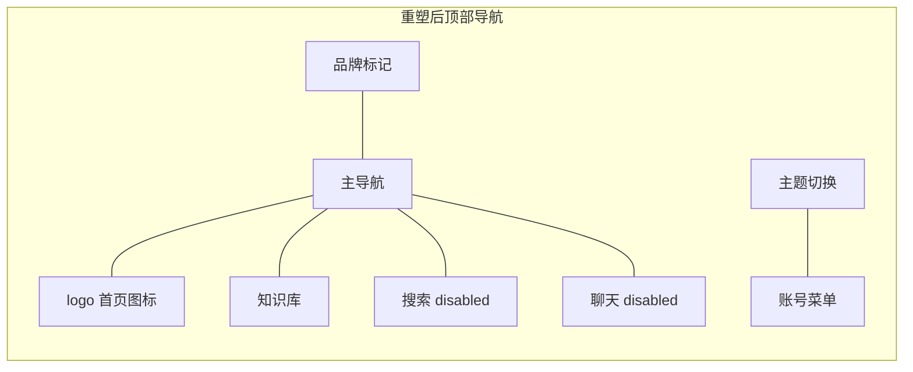
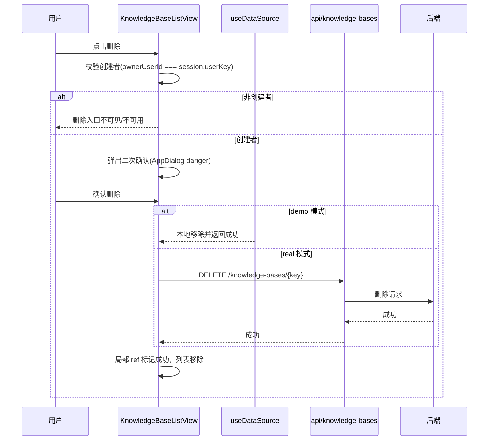
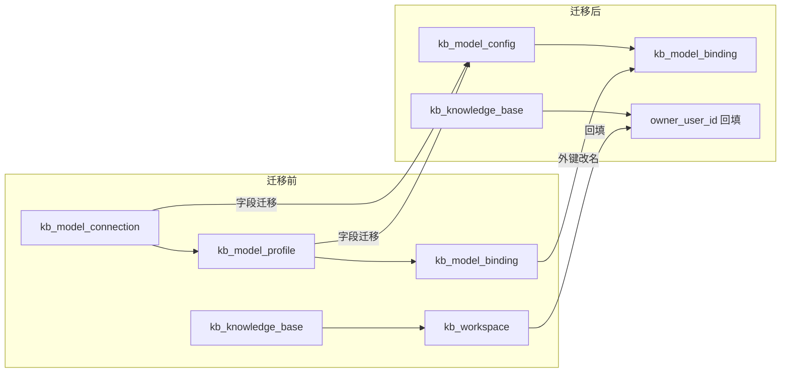
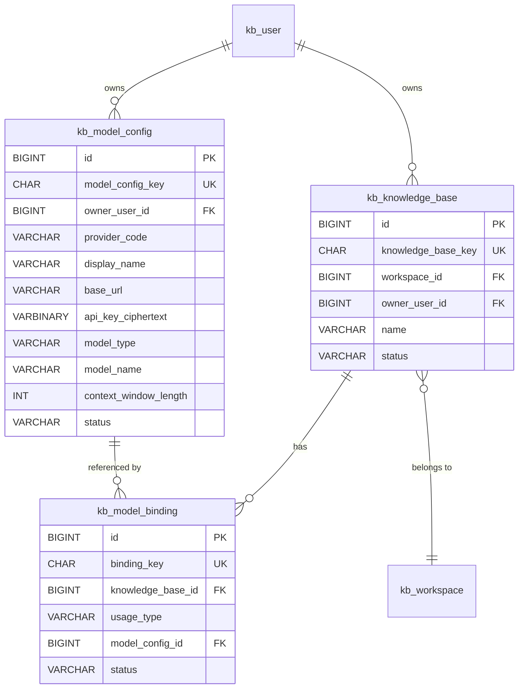
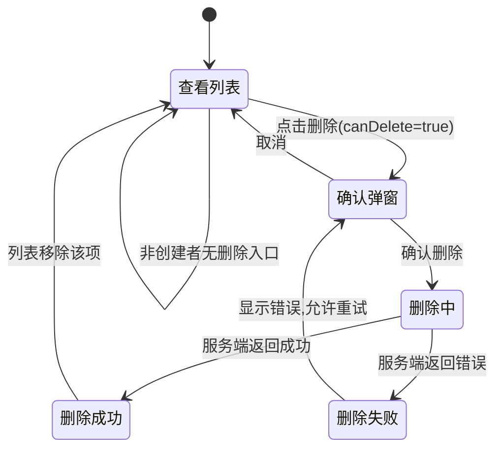
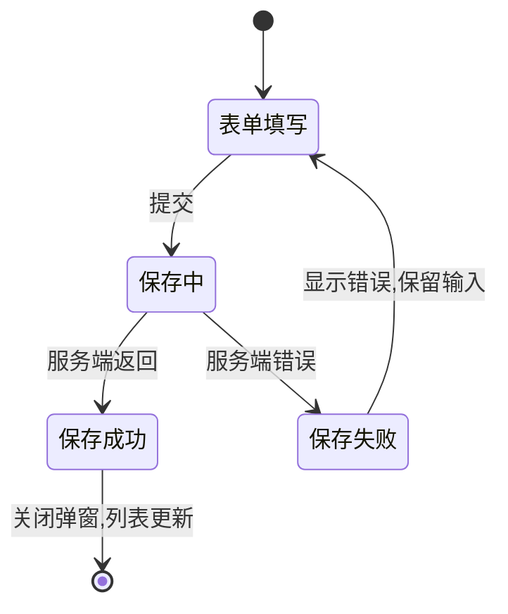

# 前端交互体系重设计技术设计说明书

> 功能标识：`frontend-interaction-redesign`
> 版本：V1.0.0
> 文档状态：已确认
> 创建日期：2026-08-07
> 更新日期：2026-08-07
> SDD 等级：S2
> 关联需求说明书：`spec/features/20260807/前端交互体系重设计-需求说明书.md`

## 1. 设计概要

### 1.1 设计目标

基于已确认的 16 条 REQ 与 25 条 AC，把 Rag2OKF 前端从"左侧轨道处理阶段语义当导航 + 右侧抽屉 + 页面级反馈 + 卡片稀疏"的现状，重塑为"顶部导航 + 中央弹窗 + 局部反馈 + 合理密度"的交互体系，并在交互需要时扩展后端模型表结构、知识库管理 API、文档管理 API（源文件预览+删除）。

四个重塑维度对应的设计落点：

| 维度 | 现状问题 | 设计落点 |
| --- | --- | --- |
| 操作流割裂 | 知识库→文档→详情 3 级跳转、配置跨页、动作分散 | 顶部导航单一入口；知识库列表原地管理；文档工作台树状目录；详情页动作归属化 |
| 反馈不清晰 | 全局 submitting 锁、页面级错误、轮询固定 4s | 局部 loading/error/success ref；轮询指数退避+终态停止+单飞+卸载清理 |
| 信息架构混乱 | evidence-rail 与 contextbar 职责重叠、占位失效、面包屑静态 | 废弃 evidence-rail 与 contextbar；顶部导航真实化；面包屑动态反映层级 |
| 视觉与信息密度 | 3 列卡片内容少、行按钮模拟列表、详情卡内容极少 | 按数据特征选择卡片/表格/列表；文档列表改树状；详情页信息聚合 |

### 1.2 SDD 等级判定

判定为 **S2**，理由：

- 涉及数据库结构变更：`kb_model_connection` 与 `kb_model_profile` 合并为 `kb_model_config` 单表；`kb_knowledge_base` 新增 `owner_user_id` 字段。
- 涉及公共 API 变更：模型设置 API 从两步（connection + profile）合并为单步；新增知识库删除 API。
- 跨核心模块：前端体系级重塑覆盖外壳、9 个视图、6 个组件，并触发后端模型域与知识库域接口扩展。
- 兼容性风险：模型表合并需迁移存量数据并调整 `kb_model_binding` 外键；知识库删除为不可逆操作。

### 1.3 技术栈与交付画像

| 画像项 | 结论 | 依据 |
| --- | --- | --- |
| 项目形态 | 前端应用 + 后端服务（混合） | [fons4ai-rag2okf-ui](file:///c:/hongqy/code/cloud/fons4ai-rag2okf/fons4ai-rag2okf-ui) 与 [fons4ai-rag2okf-service](file:///c:/hongqy/code/cloud/fons4ai-rag2okf/fons4ai-rag2okf-service) 并存 |
| 主要语言/运行时 | 前端 TypeScript + Vue 3 + Vite；后端 Java | [main.ts](file:///c:/hongqy/code/cloud/fons4ai-rag2okf/fons4ai-rag2okf-ui/src/main.ts)、[sql/](file:///c:/hongqy/code/cloud/fons4ai-rag2okf/fons4ai-rag2okf-service/sql) |
| 构建入口 | `fons4ai-rag2okf-ui` Vite 构建 | 仓库目录结构 |
| 测试入口 | Vitest（`__tests__/` 目录与 `.spec.ts`） | 各视图与 utils 下均有 `__tests__` |
| 独立可运行服务 | 否，原因：本次不新增独立服务，后端变更为既有服务扩展 | [init-schema.sql](file:///c:/hongqy/code/cloud/fons4ai-rag2okf/fons4ai-rag2okf-service/sql/init-schema.sql) |
| 页面/交互型交付物 | 是 | 前端 9 个视图重塑 |
| 数据结构变更 | 是 | 模型表合并、知识库创建者字段 |

### 1.4 范围边界

- 本次设计覆盖前端交互体系重塑与必要的后端数据结构/API 扩展设计。
- 后端 DDL 变更与 API 实现归入后端阶段，本设计只输出非执行型结构详设。
- 前端先行用演示数据走通交互，提供演示数据与真实接口可切换机制。
- 不改变知识库文档生命周期的业务状态机（上传/解析/发布/重新分块规则不变）。

## 2. 架构与调用链路

### 2.1 前端分层现状与重塑方向

现有前端分层：`views → composables → api → stores`，本次不改变分层，仅重塑各层内部实现。

```
views/               # 视图层：9 个视图重塑
  auth/              # 登录/注册（本次不动业务，仅弹窗模式对齐）
  knowledge-bases/   # 知识库列表（新增管理操作）、设置（弹窗化）
  documents/         # 文档工作台（树状目录）、详情（反馈归属化）
  settings/          # 模型设置（合并表单）
  profile/           # 个人中心
composables/         # 组合式：新增 useTaskPolling、useDataSource、useContextMenu
api/                 # API 层：models.ts 合并、knowledge-bases.ts 新增 delete
  http.ts            # 请求封装（envelope + token，本次不动）
stores/              # Pinia：session、workspace（本次不动）
components/ui/       # 基础组件：AppDialog 升级、新增 TreeMenu/ContextMenu/ConfirmDialog
layouts/             # 外壳：Rag2OkfAppShell 重塑为顶部导航
```

### 2.2 导航模型重塑

**现状**：三层壳（evidence-rail 78px + topbar 64px + contextbar 47px），evidence-rail 把"源文件/解析/分块/发布/OKF"处理阶段语义当主导航，contextbar 承载页面切换，两者职责重叠且 8 个占位失效。

**目标**：废弃 evidence-rail 与 contextbar，保留并改造 topbar 为顶部导航栏。



导航项真实化规则：

| 导航项 | 状态 | 路由 |
| --- | --- | --- |
| logo 首页图标 | 真实可用 | `/`（重定向到 `knowledge-bases`） |
| 知识库 | 真实可用 | `/knowledge-bases` |
| 搜索 | 禁用占位（本次不纳入） | 无路由，`disabled` |
| 聊天 | 禁用占位（本次不纳入） | 无路由，`disabled` |

### 2.3 核心调用链路

以"知识库删除"为例（含前端先行切换）：



## 3. API / RPC / 消息契约设计

### 3.1 模型设置 API 合并

**现状**（[models.ts](file:///c:/hongqy/code/cloud/fons4ai-rag2okf/fons4ai-rag2okf-ui/src/api/models.ts)）：两步式 API

- `POST /model-connections` 创建连接
- `POST /model-profiles` 创建档案（依赖 connectionKey）
- `POST /model-profiles/{key}/test` 测试

**目标**：单步式 API，一个模型配置包含连接信息 + 档案信息 + 高级参数。

| 操作 | 方法与路径 | 请求体 | 响应 |
| --- | --- | --- | --- |
| 列出模型配置 | `GET /model-configs` | - | `ModelConfig[]` |
| 创建模型配置 | `POST /model-configs` | `SaveModelConfigInput` | `ModelConfig` |
| 更新模型配置 | `PATCH /model-configs/{modelConfigKey}` | `SaveModelConfigInput` | `ModelConfig` |
| 测试模型配置 | `POST /model-configs/{modelConfigKey}/test` | - | `TestResult` |
| 替换 API Key | `PATCH /model-configs/{modelConfigKey}/api-key` | `{ apiKey: string }` | `{ apiKeyMask: string }` |

`ModelConfig` 类型契约（前端）：

```typescript
/** 合并后的单一模型配置概念，包含连接信息、档案信息与高级参数。 */
export interface ModelConfig {
  modelConfigKey: string
  /** 基础信息 */
  providerCode: string
  providerName: string
  displayName: string
  baseUrl: string
  /** API Key 只返回掩码，不回显原值（延续 BR-019） */
  apiKeyMask: string
  apiKeyConfigured: boolean
  /** 模型档案信息 */
  modelType: 'CHAT' | 'EMBEDDING'
  modelName: string
  dimensions: number | null
  /** 高级参数 */
  contextWindowLength: number | null
  timeoutSeconds: number
  temperature: number | null
  /** 状态 */
  status: 'ACTIVE' | 'DISABLED'
  lastTestStatus: string
  lastTestAt: string | null
  updated: string
}

export interface SaveModelConfigInput {
  providerCode: string
  providerName: string
  displayName: string
  baseUrl: string
  /** 仅创建或替换时提交，更新其他字段时不提交 */
  apiKey?: string
  modelType: 'CHAT' | 'EMBEDDING'
  modelName: string
  dimensions?: number | null
  contextWindowLength?: number | null
  timeoutSeconds?: number
  temperature?: number | null
  status?: 'ACTIVE' | 'DISABLED'
}
```

### 3.2 知识库管理 API 扩展

**现状**（[knowledge-bases.ts](file:///c:/hongqy/code/cloud/fons4ai-rag2okf/fons4ai-rag2okf-ui/src/api/knowledge-bases.ts)）：只有 `list / create / get / update`，无 `delete`。

**目标**：新增删除接口；重命名复用 `update`；列表响应新增 `ownerUserId` 用于前端权限判断。

| 操作 | 方法与路径 | 说明 |
| --- | --- | --- |
| 列出知识库 | `GET /workspaces/{key}/knowledge-bases` | 响应每项新增 `ownerUserKey`、`canDelete` |
| 重命名 | `PATCH /knowledge-bases/{key}` | 复用现有 update，仅提交 `name` |
| 删除 | `DELETE /knowledge-bases/{key}` | 服务端校验创建者；非创建者返回 403 |

`KnowledgeBaseSummary` 扩展字段：

```typescript
export interface KnowledgeBaseSummary {
  knowledgeBaseKey: string
  name: string
  description: string
  autoParse: boolean
  autoPublish: boolean
  updated: string
  /** 新增：创建者用户标识，用于前端判断删除权限 */
  ownerUserKey: string
  /** 新增：前端删除入口可见性（服务端根据成员关系与角色计算） */
  canDelete: boolean
}
```

### 3.3 文档管理 API 扩展

**现状**（[documents.ts](file:///c:/hongqy/code/cloud/fons4ai-rag2okf/fons4ai-rag2okf-ui/src/api/documents.ts)）：有 `listDocuments / getDocument / uploadDocument / triggerParse / triggerPublish / getChunkPreview / getParsePreview / rechunkDocument / retryTask / updateDocumentFile`，无源文件预览和文档删除接口。

**目标**：新增源文件内容预览接口和文档删除接口（单个+批量）。

| 操作 | 方法与路径 | 说明 |
| --- | --- | --- |
| 获取源文件内容 | `GET /documents/{key}/source-content` | 返回源文件流或预览 URL；根据 contentType 由前端选择渲染组件 |
| 删除单个文档 | `DELETE /documents/{key}` | 软删除文档记录；同步删除已发布 ES 索引和解析结果 |
| 批量删除文档 | `POST /documents:batch-delete` | 请求体 `{ documentKeys: string[] }`；逐个软删除+同步清理 ES 索引 |

`documents.ts` 新增函数：

```typescript
/** 获取源文件预览内容（blob URL 或流） */
export function getSourceContent(documentKey: string): Promise<{ blobUrl: string; contentType: string; filename: string }>

/** 删除单个文档（软删除+同步清理 ES 索引和解析结果） */
export function deleteDocument(documentKey: string): Promise<void>

/** 批量删除文档 */
export function batchDeleteDocuments(documentKeys: string[]): Promise<{ deleted: string[]; failed: { key: string; error: string }[] }>
```

源文件预览渲染策略：

| contentType | 渲染组件 | 说明 |
| --- | --- | --- |
| `image/png`、`image/jpeg`、`image/gif`、`image/webp` | `` 标签 | 浏览器原生渲染，blob URL 直接加载 |
| `application/pdf` | `<iframe :src="blobUrl">` | 浏览器内置 PDF Viewer 渲染 |
| `text/markdown` | `markdown-it` 渲染 HTML | 引入 `markdown-it`（~30KB），渲染后用 `v-html` 展示 |
| `text/plain` | `<pre>` 标签 | 纯文本直接展示，大文件限制前 100KB |
| `application/vnd.openxmlformats-officedocument.wordprocessingml.document`（DOCX） | `mammoth.js` 转 HTML | 引入 `mammoth.js`（~100KB），`convertToHtml` 后 `v-html` 展示，复杂排版可能有损 |
| 其他 | 下载链接 | 不支持的格式提供"下载原文件"链接 |

### 3.4 演示数据切换契约

设计 `useDataSource` composable，通过环境变量 `VITE_RAG2OKF_DATA_SOURCE`（`demo` | `real`，默认 `real`）控制数据来源。

```typescript
/** 演示数据与真实接口切换机制。demo 模式下 api 层拦截到本地 mock。 */
export function useDataSource(): {
  mode: ComputedRef<'demo' | 'real'>
  isDemo: ComputedRef<boolean>
}
```

切换规则：

- `demo` 模式：`api/` 层各函数检测到 demo 模式时返回本地 mock 数据（`api/mock/` 目录），不发起网络请求。
- `real` 模式：走真实 `http.request`。
- 切换时不污染真实数据：demo mock 完全在内存，不写入 localStorage 真实 key。
- 运行时可通过账号菜单的"演示模式"开关临时切换，刷新后回归环境变量默认值。

## 4. 数据模型与 DDL 影响

### 4.1 数据影响判断

| 检查项 | 命中 | 说明 |
| --- | --- | --- |
| 持久化结构变化 | 是 | 模型表合并、知识库新增创建者字段 |
| 字段映射 | 是 | 模型配置合并后字段映射变化；`kb_model_binding` 外键调整 |
| 敏感数据 | 是 | API Key 加密存储延续（`api_key_ciphertext` + `api_key_nonce` + `key_version`） |
| 跨系统流转 | 否 | 本次不涉及外部数据流转 |

### 4.2 字段映射契约

模型表合并涉及字段从两张表映射到一张表，关键字段映射如下：

| 来源字段 | 来源表 | 目标字段 | 目标表 | 转换规则 | 空值/异常规则 | 确认状态 |
| --- | --- | --- | --- | --- | --- | --- |
| owner_user_id | kb_model_connection | owner_user_id | kb_model_config | 直接映射，取 connection 的所有者 | 非空 | 已确认 |
| provider_code | kb_model_connection | provider_code | kb_model_config | 直接映射 | 非空 | 已确认 |
| provider_name | kb_model_connection | provider_name | kb_model_config | 直接映射 | 非空 | 已确认 |
| display_name | kb_model_connection | display_name | kb_model_config | 直接映射；多 profile 共享同名 connection 冲突时追加 `-{model_type}` 后缀 | 非空 | 已确认 |
| protocol_type | kb_model_connection | protocol_type | kb_model_config | 直接映射 | 非空，默认 OPENAI_COMPATIBLE | 已确认 |
| base_url | kb_model_connection | base_url | kb_model_config | 直接映射 | 非空 | 已确认 |
| api_key_ciphertext | kb_model_connection | api_key_ciphertext | kb_model_config | 直接迁移密文，不解密重加密 | 非空 | 已确认 |
| api_key_nonce | kb_model_connection | api_key_nonce | kb_model_config | 直接迁移 | 非空 | 已确认 |
| key_version | kb_model_connection | key_version | kb_model_config | 直接迁移 | 非空 | 已确认 |
| api_key_mask | kb_model_connection | api_key_mask | kb_model_config | 直接迁移 | 非空 | 已确认 |
| status | connection+profile | status | kb_model_config | 取 connection 与 profile 的更严格状态 | 非空 | 已确认 |
| last_test_* | kb_model_profile | last_test_* | kb_model_config | 取 profile 的测试结果（更精确） | 可空 | 已确认 |
| created | connection+profile | created | kb_model_config | 取 min(connection.created, profile.created) | 非空 | 已确认 |
| updated | connection+profile | updated | kb_model_config | 取 max(connection.updated, profile.updated) | 非空 | 已确认 |
| profile_key | kb_model_profile | model_config_key | kb_model_config | 重新生成 ULID | 非空 | 已确认 |
| model_type | kb_model_profile | model_type | kb_model_config | 直接映射 | 非空 | 已确认 |
| model_name | kb_model_profile | model_name | kb_model_config | 直接映射 | 非空 | 已确认 |
| dimensions | kb_model_profile | dimensions | kb_model_config | 直接映射 | 可空 | 已确认 |
| parameters_json | kb_model_profile | timeout_seconds, temperature | kb_model_config | 从 JSON 提取到独立字段 | 提取失败取默认值（timeout=60, temperature=NULL） | 已确认 |
| -（新增） | - | context_window_length | kb_model_config | 新增字段，从 parameters_json 提取或 NULL | 可空 | 已确认 |
| model_profile_id | kb_model_binding | model_config_id | kb_model_binding | 按 profile→config 映射回填 | 非空 | 已确认 |
| -（新增） | - | owner_user_id | kb_knowledge_base | 从 workspace.owner_user_id 回填 | 非空 | 已确认 |

### 4.3 数据流设计

本次结构变更的数据流为单向迁移流，不涉及跨系统流转：



数据流说明：
- 迁移方向：`kb_model_connection` + `kb_model_profile` → `kb_model_config`（合并写入，非运行时）
- 迁移触发：部署人员执行迁移 SQL，非运行时自动触发
- 数据校验：迁移后校验 config 记录数 = profile 记录数；binding 外键全部指向有效 config
- 无跨系统流转：本次变更不涉及外部数据入库、出库或同步
- 运行时数据流不变：前端 API 请求 → 后端 Service → Repository → kb_model_config，与原两步式流程相比仅减少一次 JOIN

### 4.4 数据安全与合规设计

| 安全项 | 设计 | 确认状态 |
| --- | --- | --- |
| API Key 传输安全 | 前端到后端走 HTTPS；API Key 只在创建或替换时提交，更新其他字段不提交 | 已确认 |
| API Key 存储加密 | 延续 AES-GCM 加密（`api_key_ciphertext` + `api_key_nonce` + `key_version`），迁移时直接搬运密文不解密 | 已确认 |
| API Key 展示脱敏 | 后端只返回 `apiKeyMask` 不可逆掩码；前端不回显原值，取消/卸载时 `clearSensitiveFields` 清理 | 已确认 |
| API Key 日志脱敏 | 日志中不记录 API Key 原值，只记录 mask；迁移日志不输出密文 | 已确认 |
| 知识库删除权限 | 前端 `canDelete` + 服务端 `owner_user_id` 双重校验；软删除不物理删除 | 已确认 |
| 数据保留期限 | 软删除的知识库保留 `deleted=1` 标记，不自动清理；物理清理策略待后端阶段确认 | 待确认 |
| 审计追踪 | 知识库删除操作记录操作人、时间、目标（延续现有审计设计） | 已确认 |

### 4.5 结构变更详设

**结构变更总览**：

| 变更项 | 类型 | 影响表 |
| --- | --- | --- |
| 模型表合并 | 合并 | `kb_model_connection` + `kb_model_profile` → `kb_model_config` |
| 模型绑定外键调整 | 修改 | `kb_model_binding.model_profile_id` → `model_config_id` |
| 知识库创建者字段 | 新增字段 | `kb_knowledge_base.owner_user_id` |

#### 4.5.1 现状结构证据

**证据来源**（L3 Gate Evidence）：[init-schema.sql](file:///c:/hongqy/code/cloud/fons4ai-rag2okf/fons4ai-rag2okf-service/sql/init-schema.sql) 第 26-93 行。

现状两张表：

- `kb_model_connection`：Provider 连接（owner_user_id, provider_code, provider_name, display_name, protocol_type, base_url, api_key_ciphertext, api_key_nonce, key_version, api_key_mask, status, last_test_*）
- `kb_model_profile`：模型档案（owner_user_id, connection_id, model_type, model_name, dimensions, parameters_json, status, last_test_*）
- 关系：`kb_model_profile.connection_id` → `kb_model_connection.id`（N:1）
- `kb_model_binding.model_profile_id` → `kb_model_profile.id`

现状问题：用户配置一个模型需要两步（先建连接再建档案），交互割裂；需求 REQ-004 要求合并为单一概念。

#### 4.5.2 目标结构定义：`kb_model_config`

合并后的单表，每个模型配置自包含连接信息 + 档案信息 + 高级参数。

| 字段名 | 业务含义 | 类型 | 必填 | 默认值 | 主键/唯一/索引/外键 | 来源/写入方 | 迁移或初始化方式 | 安全级别 | 确认状态 |
| --- | --- | --- | --- | --- | --- | --- | --- | --- | --- |
| id | 自增主键 | BIGINT AUTO_INCREMENT | 是 | - | PK | 系统 | 自增 | 公开 | 已确认 |
| model_config_key | 不可枚举模型配置业务标识 | CHAR(26) | 是 | - | UNIQUE uk_kb_model_config_key | 系统 | 应用生成 ULID | 公开 | 已确认 |
| owner_user_id | 配置所有者本地用户主键 | BIGINT | 是 | - | IDX (owner_user_id, status, updated) | 应用 | 从 session 获取 | 内部 | 已确认 |
| provider_code | 内置模板或 CUSTOM 厂商代码 | VARCHAR(40) | 是 | - | - | 用户表单 | 迁移自 connection.provider_code | 公开 | 已确认 |
| provider_name | 用户可识别的厂商名称 | VARCHAR(80) | 是 | - | - | 用户表单 | 迁移自 connection.provider_name | 公开 | 已确认 |
| display_name | 当前用户下唯一的配置展示名称 | VARCHAR(80) | 是 | - | UNIQUE uk (owner_user_id, display_name) | 用户表单 | 迁移自 connection.display_name | 公开 | 已确认 |
| protocol_type | 调用协议类型 | VARCHAR(32) | 是 | 'OPENAI_COMPATIBLE' | - | 系统 | 迁移自 connection.protocol_type | 公开 | 已确认 |
| base_url | 模型 API 根地址，运行时 SSRF 校验 | VARCHAR(512) | 是 | - | - | 用户表单 | 迁移自 connection.base_url | 内部 | 已确认 |
| api_key_ciphertext | AES-GCM 加密后的 API Key 密文 | VARBINARY(2048) | 是 | - | - | 应用加密层 | 迁移自 connection | 敏感-加密 | 已确认 |
| api_key_nonce | 每次加密生成的随机 nonce | VARBINARY(32) | 是 | - | - | 应用加密层 | 迁移自 connection | 敏感-加密 | 已确认 |
| key_version | 部署主密钥版本，不保存主密钥 | VARCHAR(32) | 是 | - | - | 应用配置 | 迁移自 connection | 内部 | 已确认 |
| api_key_mask | 仅供界面识别的不可逆固定掩码 | VARCHAR(32) | 是 | - | - | 应用 | 迁移自 connection | 公开 | 已确认 |
| model_type | 模型调用类型：CHAT 或 EMBEDDING | VARCHAR(24) | 是 | - | - | 用户表单 | 迁移自 profile.model_type | 公开 | 已确认 |
| model_name | 厂商实际模型 ID | VARCHAR(160) | 是 | - | UNIQUE uk (owner_user_id, model_type, model_name) | 用户表单 | 迁移自 profile.model_name | 公开 | 已确认 |
| dimensions | Embedding 输出维度提示 | INT | 否 | NULL | - | 用户表单或测试回填 | 迁移自 profile.dimensions | 公开 | 已确认 |
| context_window_length | 高级参数：上下文窗口长度 | INT | 否 | NULL | - | 用户表单 | 新增字段 | 公开 | 已确认 |
| timeout_seconds | 超时秒数 | INT | 是 | 60 | - | 用户表单 | 迁移自 profile.parameters_json | 公开 | 已确认 |
| temperature | 温度参数 | DECIMAL(3,2) | 否 | NULL | - | 用户表单 | 迁移自 profile.parameters_json | 公开 | 已确认 |
| status | 配置状态：ACTIVE 或 DISABLED | VARCHAR(20) | 是 | 'ACTIVE' | - | 用户操作 | 取 connection 与 profile 的更严格状态 | 公开 | 已确认 |
| last_test_status | 最近一次测试状态 | VARCHAR(20) | 否 | NULL | - | 测试任务 | 迁移自 profile.last_test_status | 公开 | 已确认 |
| last_test_at | 最近一次测试时间 | DATETIME(3) | 否 | NULL | - | 测试任务 | 迁移自 profile.last_test_at | 公开 | 已确认 |
| last_test_error_code | 最近一次测试错误码 | VARCHAR(64) | 否 | NULL | - | 测试任务 | 迁移自 profile.last_test_error_code | 公开 | 已确认 |
| created | 创建时间 | DATETIME(3) | 是 | CURRENT_TIMESTAMP(3) | - | 系统 | 取 connection.created | 公开 | 已确认 |
| updated | 更新时间 | DATETIME(3) | 是 | CURRENT_TIMESTAMP(3) ON UPDATE | - | 系统 | 取 max(connection.updated, profile.updated) | 公开 | 已确认 |
| deleted | 逻辑删除标记 | TINYINT(1) | 是 | 0 | - | 系统 | 0 | 公开 | 已确认 |
| version | 乐观锁版本 | INT | 是 | 0 | - | 系统 | 取 max(connection.version, profile.version) | 公开 | 已确认 |

**唯一约束设计说明**：合并后唯一约束从 `(owner_user_id, connection_id, model_type, model_name)` 调整为 `(owner_user_id, model_type, model_name)`，因为 connection 概念已内化。同时保留 `(owner_user_id, display_name)` 唯一约束，确保用户下展示名不重复。

#### 4.5.3 `kb_model_binding` 外键调整

| 字段 | 现状 | 目标 | 迁移方式 |
| --- | --- | --- | --- |
| model_profile_id | BIGINT NOT NULL，指向 kb_model_profile.id | 改名为 model_config_id，指向 kb_model_config.id | 迁移时按 profile→config 映射回填 |

唯一约束 `uk_kb_model_binding_knowledge_usage (knowledge_base_id, usage_type)` 不变。

#### 4.5.4 `kb_knowledge_base` 新增创建者字段

| 字段名 | 业务含义 | 类型 | 必填 | 默认值 | 索引 | 来源 | 迁移方式 | 安全级别 | 确认状态 |
| --- | --- | --- | --- | --- | --- | --- | --- | --- | --- |
| owner_user_id | 知识库创建者用户主键，用于删除权限判断 | BIGINT | 是 | - | IDX (owner_user_id, status) | 创建时从 session 获取 | 存量回填：按 workspace.owner_user_id 回填 | 内部 | 已确认 |

**存量回填策略**：现有 `kb_knowledge_base` 无创建者字段。由于当前仅个人工作空间（`workspace_type=PERSONAL`），存量知识库的 `owner_user_id` 回填为所属工作空间的 `owner_user_id`。企业工作空间场景后续设计完整权限模型时再调整。

#### 4.5.5 关系图



### 4.6 数据迁移与回填

#### 4.6.1 模型表合并迁移

迁移思路（非执行脚本，交付物为迁移 SQL 文件，由部署人员执行）：

1. 创建 `kb_model_config` 表（按 4.5.2 目标结构）。
2. 从 `kb_model_connection` 与 `kb_model_profile` 联合查询，每个 profile 生成一条 config 记录：
   - 连接字段来自 connection
   - 档案字段来自 profile
   - `context_window_length` 初始为 NULL（存量 profile.parameters_json 中若有则提取）
   - `timeout_seconds`、`temperature` 从 `profile.parameters_json` 提取
   - 时间取 `min(connection.created, profile.created)` 与 `max(connection.updated, profile.updated)`
3. 建立 `profile.profile_key → config.model_config_key` 映射表。
4. 更新 `kb_model_binding.model_profile_id` 为对应 `model_config_id`（改名）。
5. 校验数据完整性后，删除旧表 `kb_model_profile`、`kb_model_connection`。

**多 profile 共享同一 connection 的处理**：合并后每个 config 自包含连接字段，原共享 connection 的字段被复制到每条 config。唯一约束 `(owner_user_id, display_name)` 可能冲突（原 display_name 在 connection 级唯一，合并后多个 profile 可能指向同名 connection）。冲突处理：迁移时对冲突 display_name 追加 `-{model_type}` 后缀，并记录迁移日志供人工核对。

#### 4.6.2 知识库创建者回填

```sql
-- 参考回填语句（非执行脚本，由迁移 SQL 文件交付）
UPDATE kb_knowledge_base kb
JOIN kb_workspace ws ON kb.workspace_id = ws.id
SET kb.owner_user_id = ws.owner_user_id
WHERE kb.owner_user_id IS NULL;
```

### 4.7 兼容与回滚影响

| 变更 | 兼容性 | 回滚思路 |
| --- | --- | --- |
| 模型表合并 | 前端 API 契约变化（两步→单步），需前后端同步发布；`kb_model_binding` 外键改名 | 回滚迁移 SQL：从 `kb_model_config` 反向重建 connection + profile，恢复 binding 外键 |
| 知识库创建者字段 | 新增字段，向后兼容；存量回填后老代码无影响 | DROP COLUMN owner_user_id（回滚前需确认无删除权限依赖） |
| 知识库删除 API | 新增接口，不影响现有 | 移除接口即可 |

**回滚门禁**：模型表合并非向后兼容，回滚需停机执行反向迁移；建议在预发环境完整验证后再生产执行。

### 4.8 证据状态

| 结构变更 | 证据来源 | 证据等级 | 状态 |
| --- | --- | --- | --- |
| kb_model_connection 现状 | [init-schema.sql#L26-L51](file:///c:/hongqy/code/cloud/fons4ai-rag2okf/fons4ai-rag2okf-service/sql/init-schema.sql) | L3 | 已确认 |
| kb_model_profile 现状 | [init-schema.sql#L53-L74](file:///c:/hongqy/code/cloud/fons4ai-rag2okf/fons4ai-rag2okf-service/sql/init-schema.sql) | L3 | 已确认 |
| kb_model_binding 现状 | [init-schema.sql#L76-L93](file:///c:/hongqy/code/cloud/fons4ai-rag2okf/fons4ai-rag2okf-service/sql/init-schema.sql) | L3 | 已确认 |
| kb_knowledge_base 现状 | [init-schema.sql#L126-L144](file:///c:/hongqy/code/cloud/fons4ai-rag2okf/fons4ai-rag2okf-service/sql/init-schema.sql) | L3 | 已确认 |
| kb_model_config 目标结构 | 本设计 4.5.2 | L3 设计建议 | 待评审 |
| kb_knowledge_base.owner_user_id | 本设计 4.5.4 | L3 设计建议 | 待评审 |

### 4.9 运行初始化 DML / Seed 数据

不适用，原因：本次不新增需要初始化的种子数据。模型厂商模板由前端 `listModelProviderTemplates` 接口提供（已有），不涉及 DML Seed。

## 5. 核心逻辑设计

### 5.1 导航模型重塑

**改造对象**：[Rag2OkfAppShell.vue](file:///c:/hongqy/code/cloud/fons4ai-rag2okf/fons4ai-rag2okf-ui/src/layouts/Rag2OkfAppShell.vue)

**改造逻辑**：

1. 移除 `aside.evidence-rail` 整块（第 70-88 行），包括 rail-nav、evidence-steps。
2. 移除 `div.contextbar` 整块（第 103-115 行），包括 workspace-select、context-nav。
3. 改造 `header.topbar`：
   - 左侧：品牌标记 + 主导航（logo 首页图标 RouterLink、知识库 RouterLink、搜索 disabled button、聊天 disabled button）
   - 右侧：主题切换（独立按钮，localStorage 持久化）+ 账号菜单（保留现有实现，移除个人偏好入口）
4. `workspace-main` 占据剩余空间，不再有左侧轨道挤压。

**导航选中态**：通过 `route.name` 匹配，知识库相关路由（`knowledge-bases`、`documents`、`document-detail`、`knowledge-base-settings`）均高亮"知识库"导航项；logo 首页图标不参与选中态（始终为品牌入口）。

**主题切换本地持久化**：

`useTheme` composable 改造为 localStorage 持久化，不再依赖后端 `preferenceJson`：

```typescript
// useTheme.ts 改造要点
const STORAGE_KEY = 'rag2okf.theme'
type Theme = 'light' | 'dark' | 'system'

// 初始化时从 localStorage 读取，无缓存则默认 'system'
function loadTheme(): Theme {
  const stored = localStorage.getItem(STORAGE_KEY)
  return stored === 'light' || stored === 'dark' || stored === 'system' ? stored : 'system'
}

// setTheme 时同步写入 localStorage
function setTheme(theme: Theme) {
  currentTheme.value = theme
  localStorage.setItem(STORAGE_KEY, theme)
  applyThemeToDocument(theme)
}
```

改造要点：
- `loadTheme` 在 composable 初始化时从 localStorage 读取，无缓存默认 `system`。
- `setTheme` 切换时同步写入 localStorage 键 `rag2okf.theme`。
- 移除 `PersonalSettingsView.vue` 及路由 `/settings/personal`。
- topbar 主题切换按钮直接调用 `setTheme` 循环切换 `light → dark → system`。
- 不再调用后端 `PUT /users/me/preference` 保存主题。
- 默认分块大小和默认重叠量配置移除，创建知识库时使用系统默认值。

```typescript
// 顶部导航选中态计算
const activeNav = computed(() => {
  const name = route.name as string
  if (name?.startsWith('knowledge-base') || name?.startsWith('document')) return 'knowledge-bases'
  if (name === 'profile' || name?.startsWith('settings')) return 'settings'
  return ''
})
```

### 5.2 中央弹窗统一

**现状**：[AppDialog.vue](file:///c:/hongqy/code/cloud/fons4ai-rag2okf/fons4ai-rag2okf-ui/src/components/ui/AppDialog.vue) 已实现中央弹窗（焦点陷阱、Esc、焦点返回），但各视图未使用它，而是各自实现 `drawer-backdrop` + `settings-drawer`/`upload-panel`（右侧抽屉样式）。

**改造**：

1. 升级 `AppDialog`：增加 `size` prop（`sm | md | lg`），控制弹窗宽度；增加 `persistent` prop（破坏性操作时不允许点击遮罩关闭）。
2. 各视图移除自实现的 `drawer-backdrop`，统一用 `<AppDialog v-model="visible" :title="..." size="md">`。
3. 涉及视图：`KnowledgeBaseListView`（创建/重命名）、`DocumentsView`（上传）、`ModelSettingsView`（模型配置）、`KnowledgeBaseSettingsView`（设置编辑）、`DocumentDetailView`（替换文件/重新分块确认）。

**破坏性操作确认**：新增 `ConfirmDialog` 组件（基于 AppDialog，`danger` 样式 + `persistent`），用于知识库删除、重新分块等破坏性操作的二次确认。

### 5.3 操作反馈归属化

**现状**：`DocumentDetailView` 用单一 `submitting` ref 锁住所有按钮；`ModelSettingsView` 用单一 `errorMessage`/`savedMessage` 共享给所有操作。

**改造**：每个操作独立 ref 状态，反馈停留在触发位置。

```typescript
// 操作反馈状态模式（伪代码）
interface ActionState {
  loading: boolean
  error: string
  success: string
}

// 每个动作独立状态，互不影响
const parseAction = ref<ActionState>({ loading: false, error: '', success: '' })
const publishAction = ref<ActionState>({ loading: false, error: '', success: '' })
const rechunkAction = ref<ActionState>({ loading: false, error: '', success: '' })

// 禁用只锁当前动作按钮，不锁整页
// :disabled="parseAction.loading" 而非 :disabled="submitting"
```

### 5.4 异步任务局部刷新

**现状**（[DocumentDetailView.vue](file:///c:/hongqy/code/cloud/fons4ai-rag2okf/fons4ai-rag2okf-ui/src/views/documents/DocumentDetailView.vue)）：`setInterval(4000)` 固定轮询，无退避，不区分终态，刷新只更新 document 不更新 chunk/parse 预览。

**改造**：新增 `useTaskPolling` composable。

```typescript
/**
 * 异步任务轮询组合式函数。
 * - 指数退避：首次 2s，每次 ×1.5，上限 15s
 * - 终态停止：status 为 SUCCEEDED/FAILED 时停止
 * - 单飞：重叠请求时复用进行中的 Promise
 * - 卸载清理：onBeforeUnmount 清理定时器
 * - 局部刷新：回调只更新传入的 ref，不遮蔽整页
 */
export function useTaskPolling(options: {
  fetcher: () => Promise<TaskSummary | undefined>
  isActive: () => boolean
  onUpdate: (task: TaskSummary) => void
  intervalMs?: number
  maxIntervalMs?: number
  backoffFactor?: number
}): {
  start: () => void
  stop: () => void
}
```

轮询生命周期：

- 启动条件：任务进入 `QUEUED` 或 `RUNNING` 态时 `start()`。
- 停止条件：任务进入 `SUCCEEDED` 或 `FAILED` 态、用户离开页面（`onBeforeUnmount`）、切换文档（`watch(documentKey)` 触发 `stop()`）。
- 刷新范围：`onUpdate` 回调更新 document + chunk preview + parse preview 三个 ref，不再只更新 document。

### 5.5 文档详情页改造（源文件预览 + 分块并排 + 解析进度）

**现状**（[DocumentDetailView.vue](file:///c:/hongqy/code/cloud/fons4ai-rag2okf/fons4ai-rag2okf-ui/src/views/documents/DocumentDetailView.vue)）：详情页只显示文件名、contentType、size，不展示源文件内容；chunk preview 区域只显示分块数量统计，不展示分块内容；解析进度显示在 task-card 中（`{{ progress }}% · {{ stage }}`），但解析按钮在解析中只靠 `submitting` 锁防重复，没有基于 `parseStatus` 的禁用。

**改造**：

1. **源文件预览区（左侧）**：
   - 新增 `SourceFilePreview` 组件，根据 `document.currentFile.contentType` 选择渲染策略（见 §3.3 渲染策略表）。
   - 进入详情页时调用 `getSourceContent(documentKey)` 获取 blob URL。
   - 图片：`` 直接渲染。
   - PDF：`<iframe :src="blobUrl" frameborder="0" width="100%" height="100%" />` 嵌入浏览器 PDF Viewer。
   - Markdown：`markdownit.render(text)` 转 HTML 后 `v-html` 展示。
   - TXT：`<pre>{{ text }}</pre>`，限制前 100KB。
   - DOCX：`mammoth.convertToHtml({ arrayBuffer })` 转 HTML 后 `v-html` 展示。
   - 不支持的格式：显示"该格式不支持在线预览"+ 下载链接。

2. **分块详情区（右侧）**：
   - 改造 `getChunkPreview` 返回结构，新增分块内容列表（`chunks: { index, content, parentIndex?, sourceLocation? }[]`）。
   - 右侧展示分块列表，每个分块可展开查看内容和来源定位。
   - 左右分栏布局：`display: grid; grid-template-columns: 1fr 1fr;`，窄屏降级为上下堆叠。

3. **解析进度条**：
   - 解析按钮 `disabled` 条件从 `submitting` 改为 `parseStatus === 'QUEUED' || parseStatus === 'RUNNING'`。
   - 解析中显示进度条：有 `progress > 0` 时显示 `<progress :value="progress" max="100" />` + `{{ progress }}% · {{ stage }}`；无 progress 数据时显示"解析中…"文案。
   - 解析失败（`parseStatus === 'FAILED'`）后解析按钮恢复可用，用户可再次点击发起解析（重新触发 `triggerParse`）。

4. **解析失败可重试**：
   - 前端交互层面：`parseStatus === 'FAILED'` 时不禁用解析按钮，用户点击重新触发 `triggerParse(documentKey)`。
   - 不深究后端状态机是否阻塞，前端先按"失败可重试"实现；若后端实际阻塞，在后端阶段修复。

### 5.6 知识库目录结构管理

**现状**（[DocumentsView.vue](file:///c:/hongqy/code/cloud/fons4ai-rag2okf/fons4ai-rag2okf-ui/src/views/documents/DocumentsView.vue)）：文件夹扁平列表（左侧 sidebar），`+ 新建文件夹` 按钮触发输入框，localStorage 暂存。

**改造**：

1. **树状展示**：新增 `TreeMenu` 组件，递归渲染目录层级。从文档 `folderPath` 聚合 + localStorage 暂存构建树。
2. **右键创建目录**：新增 `ContextMenu` 组件，在目录树区域右键弹出"新建目录"选项。
3. **暂存方式不变**：继续用 `localStorage` key `rag2okf_folders_{kbKey}`，不新增后端目录表（延续 BR-005）。
4. **路径聚合规则不变**：`folderTree` computed 从文档 `folderPath` 去重聚合 ∪ localStorage 暂存。

```typescript
// 树状结构构建（伪代码）
interface FolderNode {
  name: string
  path: string
  children: FolderNode[]
  documentCount: number
}

function buildFolderTree(folderPaths: string[]): FolderNode[] {
  // 将扁平路径如 '/合规材料/2024年报' 构建为嵌套树
  // 根节点 path='/', children 为一级目录
}
```

### 5.7 知识库列表管理操作

**现状**（[KnowledgeBaseListView.vue](file:///c:/hongqy/code/cloud/fons4ai-rag2okf/fons4ai-rag2okf-ui/src/views/knowledge-bases/KnowledgeBaseListView.vue)）：3 列卡片，footer 仅"管理设置 →"跳转，无重命名/删除。

**改造**：

1. 卡片右上角新增操作菜单（`ContextMenu` 或三点按钮）：重命名、删除（仅 `canDelete` 为 true 时可见）。
2. **重命名**：弹出 `AppDialog`（size sm），单个 name 字段，提交 `PATCH /knowledge-bases/{key}`（仅 name）。
3. **删除**：弹出 `ConfirmDialog`（danger + persistent），输入知识库名称确认（防止误删），确认后 `DELETE /knowledge-bases/{key}`。
4. **权限判断**：前端根据列表响应的 `canDelete` 字段控制删除入口可见性；服务端二次校验创建者。

### 5.8 模型设置合并表单

**现状**（[ModelSettingsView.vue](file:///c:/hongqy/code/cloud/fons4ai-rag2okf/fons4ai-rag2okf-ui/src/views/settings/ModelSettingsView.vue)）：左侧连接列表 + 右侧连接详情 + 档案列表，新增连接和新增档案是两个独立 drawer。

**改造**：

1. **单列表 + 单表单**：左侧模型配置列表（合并后），右侧或中央弹窗表单。
2. **统一表单**：一个 `AppDialog` 包含所有字段，分组呈现：
   - 基础信息：模板选择、厂商名称、显示名称、Base URL、API Key、模型类型、模型名称
   - 高级参数（折叠区域）：上下文窗口长度、超时秒数、温度、向量维度（EMBEDDING 时）
3. **测试按钮**：表单内或列表项内，测试结果归属到对应配置。
4. **API Key 处理**：新增时必填，编辑时不显示原值（只显示 mask），通过"替换 Key"独立入口提交新值。

### 5.9 视觉与信息密度

| 页面 | 现状模式 | 目标模式 | 依据 |
| --- | --- | --- | --- |
| 知识库列表 | 3 列卡片，内容少 | 2-3 列卡片 + 右上操作菜单 | 字段少（name/desc/2 toggle/时间），卡片合适但需增加操作密度 |
| 文档工作台 | 行按钮模拟列表 | 树状目录 + 表格行 | 需要展示目录层级，树+表格组合 |
| 文档详情 | 2 列卡片内容极少 | 信息聚合卡片 + 操作区 | 减少卡片数量，聚合状态与操作 |
| 模型设置 | 双栏 + 堆叠档案 | 单列表 + 中央弹窗表单 | 合并后配置项单一，列表+弹窗更清晰 |

### 5.10 文档列表管理操作（删除）

**现状**（[DocumentsView.vue](file:///c:/hongqy/code/cloud/fons4ai-rag2okf/fons4ai-rag2okf-ui/src/views/documents/DocumentsView.vue)）：文档列表无管理操作，无删除能力。

**改造**：

1. **文档列表管理化**：每个文档行/卡片新增操作菜单（删除）；列表顶部新增批量操作栏（勾选后显示"批量删除"按钮）。
2. **勾选机制**：每行新增 checkbox，顶部全选 checkbox；勾选状态用 `selectedKeys: Set<string>` 管理。
3. **单个删除**：操作菜单点击"删除"→ 弹出 `ConfirmDialog`（danger + persistent）→ 确认后调用 `deleteDocument(key)`。
4. **批量删除**：勾选多个后点击"批量删除"→ 弹出 `ConfirmDialog` 显示选中数量 → 确认后调用 `batchDeleteDocuments(keys)`。
5. **删除反馈**：删除操作独立 `ActionState`（loading/error/success），失败时反馈停留在触发位置；成功后从列表移除。
6. **后端删除语义**：`DELETE /documents/{key}` 软删除文档记录（`deleted=1`），同步删除已发布 ES 索引和解析结果（ChunkRevision）；批量删除逐个执行，返回成功和失败列表。

```typescript
// 文档列表管理状态（伪代码）
const selectedKeys = ref<Set<string>>(new Set())
const deleteAction = ref<ActionState>({ loading: false, error: '', success: false })

async function confirmDeleteSingle(key: string) {
  // 弹出 ConfirmDialog，确认后：
  deleteAction.value.loading = true
  try {
    await deleteDocument(key)
    documents.value = documents.value.filter(d => d.documentKey !== key)
  } catch (e) { deleteAction.value.error = '删除失败' }
  finally { deleteAction.value.loading = false }
}

async function confirmDeleteBatch() {
  // 弹出 ConfirmDialog（显示选中数量），确认后：
  const keys = Array.from(selectedKeys.value)
  const result = await batchDeleteDocuments(keys)
  documents.value = documents.value.filter(d => !result.deleted.includes(d.documentKey))
  selectedKeys.value.clear()
}
```

## 6. 领域建模与业务规则落地

### 6.1 业务规则落地映射

| 业务规则 | 技术落地点 | 验证方式 |
| --- | --- | --- |
| BR-001 导航只展示真实可用能力或明确的不可用状态 | 顶部导航 logo 首页、知识库可用，搜索/聊天 `disabled` 占位 | AC-001 |
| BR-002 删除仅创建者可执行 | 前端 `canDelete` 控制可见性 + 服务端 `owner_user_id` 校验 | AC-004、AC-005 |
| BR-003 中央弹窗统一 | `AppDialog` 替换所有 `drawer-backdrop`；`ConfirmDialog` 用于破坏性操作 | AC-006、AC-007 |
| BR-004 模型配置合并 | 单表 `kb_model_config` + 单步 API + 单表单 | AC-008、AC-009 |
| BR-005 目录前端暂存 | `localStorage` key 不变，新增树状 UI | AC-010、AC-011 |
| BR-006 前端先行 | `useDataSource` demo/real 切换 | AC-015 |
| BR-007 业务状态机不变 | 不修改 `kb_source_document.parse_status`/`publish_status` 状态枚举与流转 | AC-018 |
| BR-008 反馈归属 | 每个动作独立 `ActionState` ref | AC-012 |
| BR-009 搜索和聊天不纳入 | 顶部搜索和聊天 `disabled` 占位 | AC-001 |
| BR-011 移除个人偏好页面，主题 localStorage 持久化 | 移除 PersonalSettingsView 和路由，useTheme 改 localStorage | AC-019 |
| BR-012 源文件按格式分组件渲染 | SourceFilePreview 组件 + getSourceContent API + 渲染策略表 | AC-020 |
| BR-013 解析中禁用按钮+失败可重试 | parseStatus 驱动 disabled + FAILED 时恢复可用 | AC-022、AC-023 |
| BR-014 文档删除二次确认+同步删 ES | ConfirmDialog + deleteDocument/batchDeleteDocuments API + 后端软删除+ES 清理 | AC-024、AC-025 |
| BR-010 权限协作不纳入 | 仅实现创建者删除，不实现成员邀请 | AC-005 |

### 6.2 知识库删除权限校验

```typescript
// 前端权限判断（伪代码）
function canDeleteKnowledgeBase(kb: KnowledgeBaseSummary, sessionUserKey: string): boolean {
  // 前端基于响应的 canDelete 字段（服务端已计算）
  return kb.canDelete
}

// 服务端校验（伪代码，后端阶段实现）
function assertCanDelete(kb: KnowledgeBase, userId: Long) {
  if (!kb.ownerUserId.equals(userId)) {
    throw new ForbiddenException("仅知识库创建者可删除")
  }
  // 软删除：设置 deleted=1，不物理删除
}
```

### 6.3 模型配置合并的业务语义

合并后一个 `ModelConfig` 等价于原一个 `ModelProfile`（自包含其 connection 信息）。原"一个 connection 多个 profile"的场景变为"多个独立 config"，每个 config 独立维护连接字段。这改变了复用语义：原修改 connection baseUrl 会影响所有关联 profile，合并后需逐个 config 修改。

**补偿设计**：前端提供"批量编辑"入口（可选，P1），允许用户选择多个同厂商 config 批量修改 baseUrl。P0 不实现批量编辑，用户需逐个修改。

## 7. 状态流转设计

### 7.1 知识库删除流转



- 前置条件：`canDelete === true`（前端）+ `owner_user_id === session.userId`（服务端）
- 失败处理：保留弹窗，显示错误，允许重试
- 幂等要求：删除已软删除的知识库返回成功（幂等）

### 7.2 模型配置保存流转



- API Key 处理：新增时必填，编辑时不提交（除非通过"替换 Key"入口）
- 幂等要求：更新操作带 `version` 乐观锁，冲突时返回 409

### 7.3 业务状态机不变声明

本次重设计不修改以下状态枚举与流转（延续知识库文档生命周期需求）：

- `kb_source_document.parse_status`：`NOT_STARTED / QUEUED / RUNNING / SUCCEEDED / FAILED`
- `kb_source_document.publish_status`：`UNPUBLISHED / PUBLISHING / PUBLISHED / PUBLISH_FAILED`
- `kb_processing_task.status`：任务状态流转不变
- 重新分块的确认→重建→重新发布流程不变

## 8. 异常、安全、事务与性能

### 8.1 异常处理

| 场景 | 处理策略 |
| --- | --- |
| 知识库删除失败（非创建者） | 服务端返回 403，前端在触发位置显示错误 |
| 模型配置保存冲突（乐观锁） | 服务端返回 409，前端提示"配置已被修改，请刷新后重试" |
| 模型测试失败 | 测试结果归属到对应配置行，显示 `modelTestLabel` |
| 异步任务刷新失败 | 不影响现有展示，下次轮询自动重试 |
| 演示数据切换异常 | demo 模式纯内存，无网络异常；切换不污染真实数据 |

### 8.2 安全

| 安全项 | 设计 |
| --- | --- |
| API Key 存储 | 延续 `api_key_ciphertext` + `api_key_nonce` + `key_version` AES-GCM 加密（BR-019） |
| API Key 展示 | 只返回 `apiKeyMask`，不回显原值；前端 `clearSensitiveFields` 在取消/卸载时清理（CR-015 AC-046） |
| API Key 替换 | 独立入口提交新值，完整替换；不支持找回原 Key |
| 知识库删除权限 | 前端 `canDelete` + 服务端 `owner_user_id` 双重校验 |
| SSRF 防护 | `base_url` 运行时 SSRF 安全校验（延续现有设计） |
| 演示数据隔离 | demo mock 纯内存，不写入 localStorage 真实 key，不发起网络请求 |

### 8.3 事务

| 事务场景 | 设计 |
| --- | --- |
| 模型配置创建/更新 | 单表事务，无跨表协作 |
| 知识库删除 | 软删除事务：更新 `kb_knowledge_base.deleted=1`；关联文档/任务的清理策略待后端阶段确认 |
| 模型表合并迁移 | 迁移脚本独立事务，建议分批提交（每批 100 条） |

### 8.4 性能

| 性能项 | 设计 |
| --- | --- |
| 轮询退避 | 指数退避 2s→15s，减少无效请求 |
| 单飞 | 重叠请求复用 Promise，避免并发 |
| 局部刷新 | 只更新相关 ref，不触发整页重渲染 |
| 目录树渲染 | 文档量大时虚拟滚动（P1，P0 暂不实现） |

### 8.5 兼容性

| 兼容项 | 设计 |
| --- | --- |
| 业务状态机 | 不变（AC-018） |
| CR-014 目录方案 | 不推翻，延续 localStorage 暂存 |
| CR-015 组件基座 | T055 基础组件作为本次重设计基座，T056-T061 改造点被本次覆盖或升级 |
| 三主题 | 延续 `useTheme` light/dark/system，所有新组件遵循 tokens.css；主题持久化改为 localStorage（键 `rag2okf.theme`），不再走后端 preferenceJson |
| 响应式 | 桌面与移动端，窄屏降级（导航折叠、树状目录横向滚动） |

### 8.6 迁移与回滚

| 变更 | 迁移位置 | 回滚思路 |
| --- | --- | --- |
| 模型表合并 | `fons4ai-rag2okf-service/sql/migrations/` 新增迁移 SQL | 反向迁移：从 config 重建 connection+profile |
| 知识库创建者字段 | 同上迁移 SQL | DROP COLUMN（回滚前确认无依赖） |
| 前端 API 契约 | 前后端同步发布 | 前端回滚到两步式 API |

## 9. 技术决策

### 9.1 顶部导航 vs 左侧轨道

**决策**：采用顶部导航，废弃 evidence-rail 与 contextbar。

**原因**：

- evidence-rail 把处理阶段语义（源文件/解析/分块/发布/OKF）当主导航，与实际页面切换职责不符。
- contextbar 与 evidence-rail 职责重叠，8 个占位失效降低信任。
- 顶部导航是同类知识库产品（如 RAGFlow）的成熟范式，用户预期一致。
- 导航项精简为 logo 首页、知识库、搜索（disabled）、聊天（disabled），移除 OKF/问答/评测占位，避免无后端能力的普通占位降低信任。

**替代方案**：保留 evidence-rail 但去除处理阶段语义。否决理由：78px 左侧轨道在桌面端浪费空间，且与顶部导航并存仍有职责重叠风险。

### 9.2 中央弹窗 vs 右侧抽屉

**决策**：统一中央弹窗（AppDialog），废弃右侧抽屉。

**原因**：

- 用户明确要求"在页面中间弹出窗口新增"。
- 中央弹窗聚焦注意力，适合表单填写；右侧抽屉易与主内容混淆。
- 现有 AppDialog 已实现可访问性（焦点陷阱、Esc、焦点返回），只需推广使用。

### 9.3 模型表合并 vs 保留两层

**决策**：合并为单表 `kb_model_config`。

**原因**：

- 用户明确要求"合并为单表(含DDL)"。
- 单表单表单交互更连贯，避免两步割裂。
- 合并后失去"一个 connection 多 profile"的复用，但 P0 场景下用户模型数量少，复用价值低于交互简化价值。

**替代方案**：保留两表但前端合并表单（后端维持 connection+profile）。否决理由：前端需维护两步提交逻辑，且用户已确认含 DDL 变更。

### 9.4 演示数据切换机制

**决策**：`useDataSource` composable + 环境变量 + 运行时开关。

**原因**：

- 环境变量控制默认模式，部署时可固定。
- 运行时开关允许演示时临时切换，刷新回归默认。
- api 层拦截避免侵入视图层逻辑。

### 9.5 目录树右键创建 vs 按钮创建

**决策**：支持右键创建目录，保留按钮入口作为补充。

**原因**：

- 用户明确要求"右键就可以创建文件夹"。
- 右键上下文操作更符合桌面端习惯。
- 移动端无右键，保留按钮入口兼容触屏。

## 10. 验证策略、AC 映射与风险

### 10.1 AC 映射表

| AC | 设计落点 | 验证方式 |
| --- | --- | --- |
| AC-001 顶部导航真实可用 | 5.1 导航模型重塑 | 视觉检查：顶部导航项为 logo 首页、知识库、搜索 disabled、聊天 disabled，无 OKF/问答/评测占位 |
| AC-002 导航选中态一致 | 5.1 activeNav 计算 | 路由切换后导航高亮匹配 |
| AC-003 知识库重命名 | 5.6 重命名弹窗 | 原位或弹窗重命名，列表即时更新 |
| AC-004 删除二次确认 | 5.6 ConfirmDialog | 删除弹窗确认，取消不删除 |
| AC-005 非创建者无删除入口 | 5.6 canDelete 控制 | 非创建者卡片无删除菜单项 |
| AC-006 中央弹窗统一 | 5.2 AppDialog 推广 | 所有新增/编辑用 AppDialog |
| AC-007 弹窗可访问性 | 5.2 AppDialog 升级 | Esc 关闭、焦点返回、未保存提示 |
| AC-008 模型单表单 | 5.7 合并表单 | 一个弹窗填完所有字段 |
| AC-009 高级参数分组 | 5.7 折叠区域 | 高级参数与基础信息分组 |
| AC-010 右键创建目录 | 5.5 ContextMenu | 右键出现创建目录选项 |
| AC-011 文档树状展示 | 5.5 TreeMenu | 文档列表树状层级，可展开收起 |
| AC-012 反馈归属 | 5.3 ActionState | 操作反馈在触发位置，不冻结整页 |
| AC-013 局部刷新 | 5.4 useTaskPolling | 只更新相关区域，终态停止 |
| AC-014 信息密度合理 | 5.8 模式选择 | 按数据特征选择卡片/表格/列表 |
| AC-015 演示数据切换 | 3.3 useDataSource | demo 走通交互，切换不残留 |
| AC-016 三主题一致 | 8.5 兼容性 | 三主题下信息层级与状态语义一致 |
| AC-019 主题 localStorage 持久化、移除个人偏好 | 5.1 useTheme 改造 | 切换主题后 localStorage 有缓存；刷新沿用；个人偏好页面及路由不存在 |
| AC-020 源文件内容预览 | 5.5 SourceFilePreview + 3.3 getSourceContent API | 按格式渲染图片/PDF/MD/TXT/DOCX，不支持格式提供下载链接 |
| AC-021 分块详情并排展示 | 5.5 分块详情区 + getChunkPreview 扩展 | 右侧并排展示分块列表和内容，与源文件对照 |
| AC-022 解析中禁用+进度条 | 5.5 解析进度条 + parseStatus 驱动 | 解析中按钮禁用，显示进度条或"解析中"文案 |
| AC-023 解析失败可重试 | 5.5 解析失败可重试 | FAILED 时解析按钮可用，可再次发起解析 |
| AC-024 文档删除二次确认 | 5.10 文档列表管理 + ConfirmDialog | 单个/批量删除弹确认，确认后执行删除 |
| AC-025 删除同步清理 ES 索引 | 3.3 deleteDocument API + 后端软删除+ES 清理 | 删除已发布文档时后端同步删 ES 索引和解析结果 |
| AC-017 键盘可访问 | 5.2 AppDialog 焦点 | Tab/Enter 完成主要操作 |
| AC-018 业务状态机不变 | 7.3 不变声明 | 上传/解析/发布/重新分块结果不变 |

### 10.2 验证策略

| 验证类型 | 策略 |
| --- | --- |
| 单元测试 | Vitest 覆盖 `useTaskPolling`（退避/终态/单飞）、`useDataSource`（切换）、`buildFolderTree`（树构建）、权限判断函数 |
| 组件测试 | AppDialog 焦点陷阱、ConfirmDialog 确认流程、TreeMenu 递归渲染 |
| 视图测试 | KnowledgeBaseListView 删除流程、ModelSettingsView 合并表单、DocumentsView 树状目录 |
| 集成测试 | demo 模式走通完整交互流（导航→列表→文档→详情→模型设置） |
| 回归测试 | 业务状态机不变（AC-018）：上传/解析/发布/重新分块流程与重设计前一致 |
| 视觉回归 | 三主题（light/dark/system）下所有页面视觉一致 |

### 10.3 风险与回滚

| 风险 | 等级 | 缓解措施 |
| --- | --- | --- |
| 模型表合并迁移失败导致已有配置丢失 | 高 | 迁移前备份；预发环境完整验证；提供反向迁移回滚 SQL |
| 知识库删除权限判断失效导致误删 | 高 | 前端 canDelete + 服务端 owner_user_id 双重校验；二次确认输入名称；软删除不物理删除 |
| 演示数据与真实接口行为偏差 | 中 | demo mock 忠实模拟真实接口响应结构；切换后回归测试 |
| 导航模型大改导致三主题/移动端回退 | 中 | 视觉回归测试覆盖三主题与窄屏 |
| 模型表合并失去 connection 复用 | 低 | P0 接受逐个修改；P1 可补批量编辑 |
| 前端先行后端滞后导致 demo 残留 | 低 | useDataSource 切换机制隔离；上线前确认 real 模式 |

### 10.4 知识同步影响

| 知识项 | 影响 |
| --- | --- |
| SQL 当前结构快照 | 模型表合并后需同步更新 `.specify/sql/` 快照（后端阶段执行） |
| 项目数据架构文档 | 模型配置概念合并、知识库创建者字段需同步（知识汇总阶段） |
| CR-014 目录方案 | 不推翻，交互体验升级需记录 |
| CR-015 组件基座 | T055 基础上升级，T056-T061 覆盖点需记录 |

## 证据清单

| 关键结论 | 证据来源 | 证据等级 | 状态 |
| --- | --- | --- | --- |
| 现有路由 10 个，sectionLabel 驱动面包屑 | [router/index.ts](file:///c:/hongqy/code/cloud/fons4ai-rag2okf/fons4ai-rag2okf-ui/src/router/index.ts) | L2 | 已确认 |
| 外壳三层结构（evidence-rail + topbar + contextbar） | [Rag2OkfAppShell.vue](file:///c:/hongqy/code/cloud/fons4ai-rag2okf/fons4ai-rag2okf-ui/src/layouts/Rag2OkfAppShell.vue) | L2 | 已确认 |
| evidence-rail 4 个 muted 占位、contextbar 4 个 span 占位 | [Rag2OkfAppShell.vue#L76-L79](file:///c:/hongqy/code/cloud/fons4ai-rag2okf/fons4ai-rag2okf-ui/src/layouts/Rag2OkfAppShell.vue#L76-L79)、#L112 | L2 | 已确认 |
| 模型设置两步式 API（connection + profile） | [models.ts](file:///c:/hongqy/code/cloud/fons4ai-rag2okf/fons4ai-rag2okf-ui/src/api/models.ts) | L2 | 已确认 |
| 知识库 API 无 delete | [knowledge-bases.ts](file:///c:/hongqy/code/cloud/fons4ai-rag2okf/fons4ai-rag2okf-ui/src/api/knowledge-bases.ts) | L2 | 已确认 |
| AppDialog 已实现中央弹窗可访问性 | [AppDialog.vue](file:///c:/hongqy/code/cloud/fons4ai-rag2okf/fons4ai-rag2okf-ui/src/components/ui/AppDialog.vue) | L2 | 已确认 |
| 各视图自实现 drawer-backdrop 未用 AppDialog | [KnowledgeBaseListView#L152](file:///c:/hongqy/code/cloud/fons4ai-rag2okf/fons4ai-rag2okf-ui/src/views/knowledge-bases/KnowledgeBaseListView.vue#L152)、[DocumentsView#L319](file:///c:/hongqy/code/cloud/fons4ai-rag2okf/fons4ai-rag2okf-ui/src/views/documents/DocumentsView.vue#L319)、[ModelSettingsView#L217](file:///c:/hongqy/code/cloud/fons4ai-rag2okf/fons4ai-rag2okf-ui/src/views/settings/ModelSettingsView.vue#L217) | L2 | 已确认 |
| DocumentDetailView 全局 submitting 锁 | [DocumentDetailView.vue#L44-L49](file:///c:/hongqy/code/cloud/fons4ai-rag2okf/fons4ai-rag2okf-ui/src/views/documents/DocumentDetailView.vue#L44-L49) | L2 | 已确认 |
| 轮询固定 4s 无退避 | [DocumentDetailView.vue#L62-L67](file:///c:/hongqy/code/cloud/fons4ai-rag2okf/fons4ai-rag2okf-ui/src/views/documents/DocumentDetailView.vue#L62-L67) | L2 | 已确认 |
| 文档夹 localStorage 暂存 | [DocumentsView.vue#L38-L107](file:///c:/hongqy/code/cloud/fons4ai-rag2okf/fons4ai-rag2okf-ui/src/views/documents/DocumentsView.vue#L38-L107) | L2 | 已确认 |
| kb_model_connection 现状结构 | [init-schema.sql#L26-L51](file:///c:/hongqy/code/cloud/fons4ai-rag2okf/fons4ai-rag2okf-service/sql/init-schema.sql) | L3 | 已确认 |
| kb_model_profile 现状结构 | [init-schema.sql#L53-L74](file:///c:/hongqy/code/cloud/fons4ai-rag2okf/fons4ai-rag2okf-service/sql/init-schema.sql) | L3 | 已确认 |
| kb_model_binding 现状结构 | [init-schema.sql#L76-L93](file:///c:/hongqy/code/cloud/fons4ai-rag2okf/fons4ai-rag2okf-service/sql/init-schema.sql) | L3 | 已确认 |
| kb_knowledge_base 无 owner_user_id | [init-schema.sql#L126-L144](file:///c:/hongqy/code/cloud/fons4ai-rag2okf/fons4ai-rag2okf-service/sql/init-schema.sql) | L3 | 已确认 |
| kb_model_config 目标结构 | 本设计 4.3.2 | L3 设计建议 | 待评审 |
| kb_knowledge_base.owner_user_id 目标 | 本设计 4.3.5 | L3 设计建议 | 待评审 |
| CR-014 已合并 kb_document_version | [20260806-cr014-merge-version-and-folder.sql](file:///c:/hongqy/code/cloud/fons4ai-rag2okf/fons4ai-rag2okf-service/sql/migrations/20260806-cr014-merge-version-and-folder.sql) | L3 | 已确认 |
| 三主题机制 | [useTheme.ts](file:///c:/hongqy/code/cloud/fons4ai-rag2okf/fons4ai-rag2okf-ui/src/composables/useTheme.ts) | L2 | 已确认 |
| FormFeedback 已支持 page/action/field 三级 | [FormFeedback.vue](file:///c:/hongqy/code/cloud/fons4ai-rag2okf/fons4ai-rag2okf-ui/src/components/ui/FormFeedback.vue) | L2 | 已确认 |

## 版本修订记录

| 日期 | 版本 | 说明 |
| --- | --- | --- |
| 2026-08-07 | V1.0.0 | 初始化技术设计说明书；基于已确认需求说明书生成，覆盖 10 节结构，包含模型表合并与知识库创建者字段结构变更详设 |
| 2026-08-07 | V1.1.0 | 补充字段映射契约（§4.2）、数据流设计（§4.3）、数据安全与合规设计（§4.4）章节；重编号数据模型子章节；修正 §3/§8/§10 标题间距；重命名 §10.3 为风险与回滚、§10.4 为知识同步影响 |
| 2026-08-08 | V1.2.0 | 导航项调整为 logo 首页、知识库、搜索（disabled）、聊天（disabled），移除 OKF/问答/评测占位；新增 useTheme localStorage 持久化改造（§5.1）；移除个人偏好页面与路由；新增 AC-019 映射；更新 BR 映射和技术决策 |
| 2026-08-08 | V1.3.0 | 新增 §3.3 文档管理 API（源文件预览+删除+批量删除）；新增 §5.5 文档详情改造（源文件预览+分块并排+解析进度+失败可重试）；新增 §5.10 文档列表管理操作（删除）；新增 BR-012~014、AC-020~025 映射；引入 markdown-it 和 mammoth.js 依赖 |
| 2026-08-08 | V1.3.1 | T001 UI 设计确认完成：用户逐项确认 8 个维度（顶部导航布局、中央弹窗模式、知识库列表、文档工作台、文档详情、模型设置、知识库设置、信息密度规则）均可行，方案作为后续页面实现基线 |
