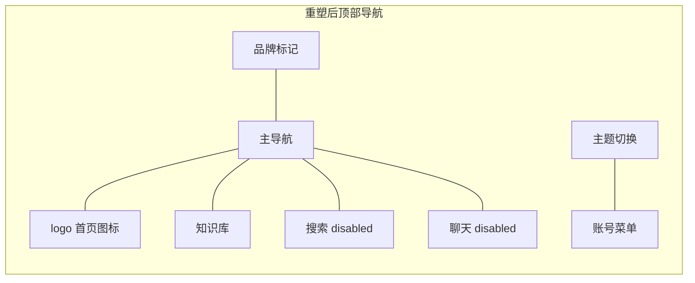
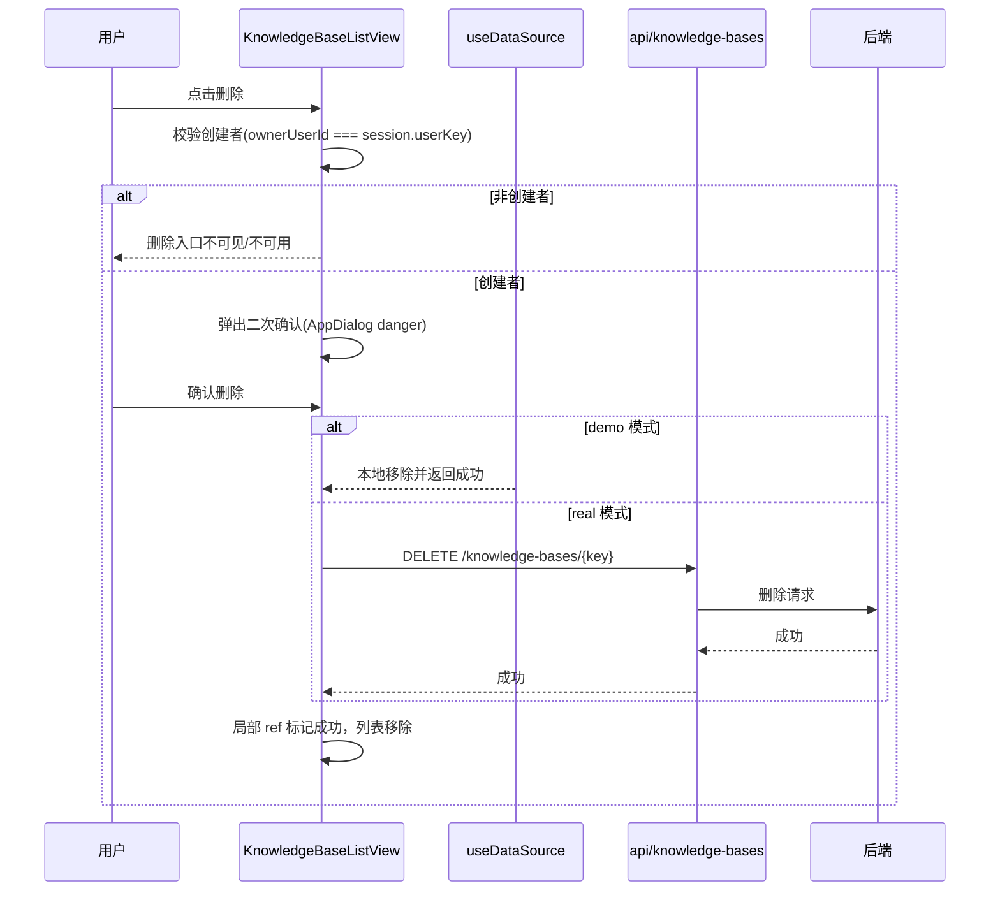
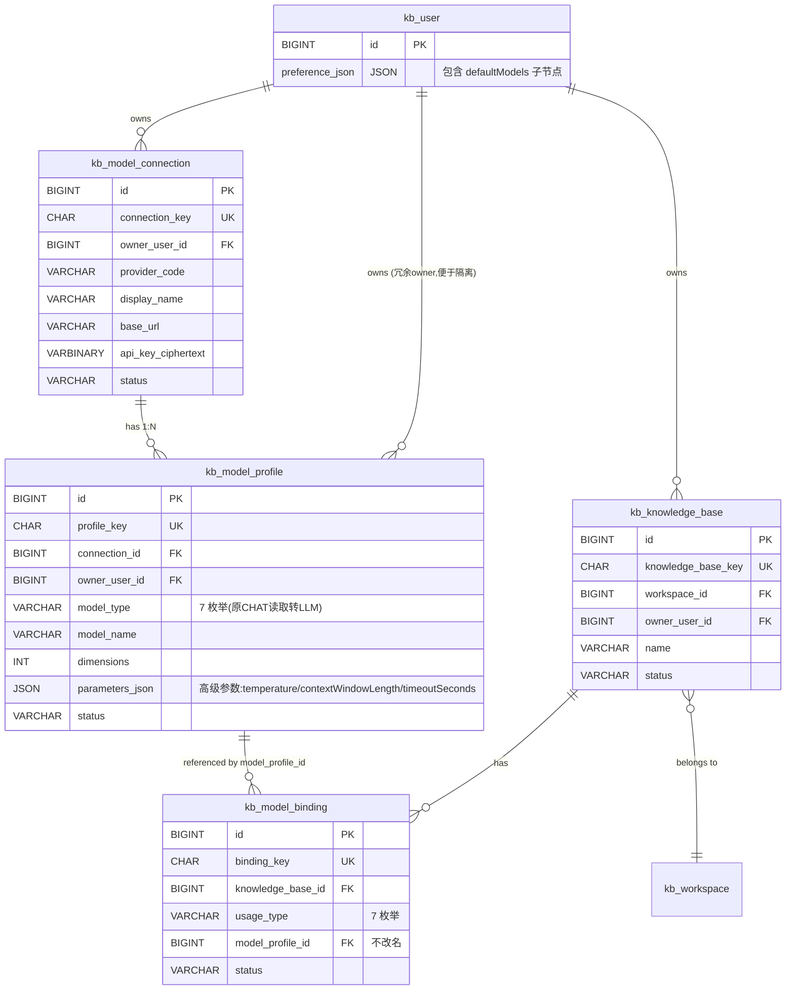
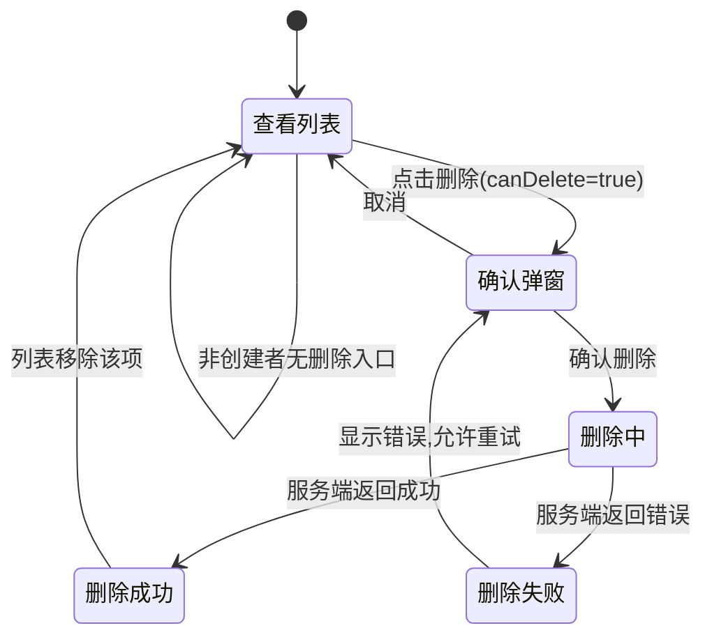
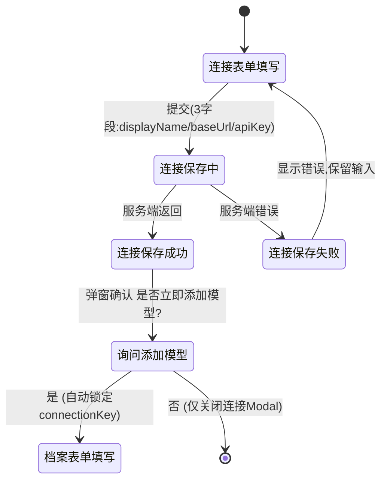
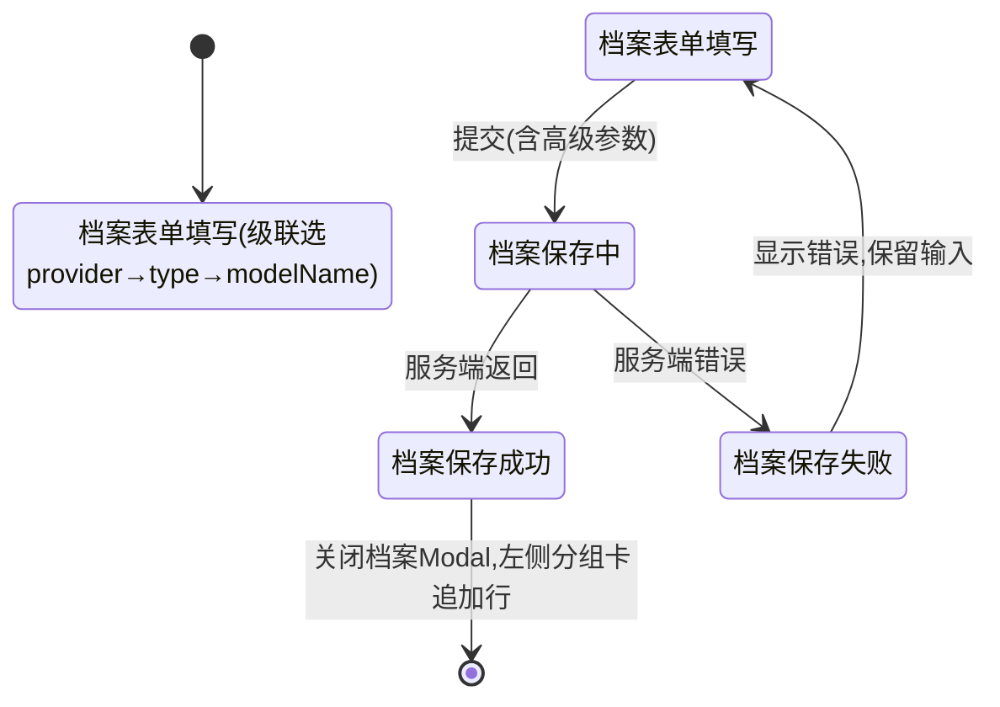

# 前端交互体系重设计技术设计说明书

> 功能标识：`frontend-interaction-redesign`
> 版本：V1.5.0
> 文档状态：已确认
> 创建日期：2026-08-07
> 更新日期：2026-08-10
> SDD 等级：S2
> 关联需求说明书：`spec/features/20260807/前端交互体系重设计-需求说明书.md`

## 1. 设计概要

### 1.1 设计目标

基于已确认的 16 条 REQ 与 25 条 AC，把 Rag2OKF 前端从"左侧轨道处理阶段语义当导航 + 右侧抽屉 + 页面级反馈 + 卡片稀疏"的现状，重塑为"顶部导航 + 中央弹窗 + 局部反馈 + 合理密度"的交互体系，并在交互需要时扩展后端模型表结构、知识库管理 API、文档管理 API（源文件预览+删除）。

四个重塑维度对应的设计落点：

| 维度 | 现状问题 | 设计落点 |
| --- | --- | --- |
| 操作流割裂 | 知识库→文档→详情 3 级跳转、配置跨页、动作分散 | 顶部导航单一入口；知识库列表原地管理；文档工作台树状目录；详情页动作归属化 |
| 反馈不清晰 | 全局 submitting 锁、页面级错误、轮询固定 4s | 局部 loading/error/success ref；轮询指数退避+终态停止+单飞+卸载清理 |
| 信息架构混乱 | evidence-rail 与 contextbar 职责重叠、占位失效、面包屑静态 | 废弃 evidence-rail 与 contextbar；顶部导航真实化；面包屑动态反映层级 |
| 视觉与信息密度 | 3 列卡片内容少、行按钮模拟列表、详情卡内容极少 | 按数据特征选择卡片/表格/列表；文档列表改树状；详情页信息聚合 |

### 1.2 SDD 等级判定

判定为 **S2**，理由：

- **（CR-001 调整，2026-08-08）** 数据库结构变更：模型域不再合并表，还原两张表结构；仅涉及枚举白名单扩展（7 类型）和存量 CHAT 值的应用层别名兼容（无需强制 DDL）；`kb_knowledge_base` 仍新增 `owner_user_id` 字段。
- 涉及公共 API 变更：模型设置 API 从原计划的单步合并恢复为两步式（/model-connections + /model-profiles）；新增只读 /model-catalog 模型市场目录接口；复用 PATCH /users/me 读写 preferenceJson.defaultModels；新增知识库删除 API。
- 跨核心模块：前端体系级重塑覆盖外壳、9 个视图、6 个组件，其中 ModelSettingsTab 约 80% 重写为 Ragflow 式左右双栏；触发后端模型域（目录接口+7 枚举）与知识库域接口扩展。
- 兼容性风险：存量 CHAT 值需应用层别名映射为 LLM；preferenceJson 局部合并不覆盖其他偏好；知识库删除为不可逆操作。

### 1.3 技术栈与交付画像

| 画像项 | 结论 | 依据 |
| --- | --- | --- |
| 项目形态 | 前端应用 + 后端服务（混合） | [fons4ai-rag2okf-ui](file:///c:/hongqy/code/cloud/fons4ai-rag2okf/fons4ai-rag2okf-ui) 与 [fons4ai-rag2okf-service](file:///c:/hongqy/code/cloud/fons4ai-rag2okf/fons4ai-rag2okf-service) 并存 |
| 主要语言/运行时 | 前端 TypeScript + Vue 3 + Vite；后端 Java | [main.ts](file:///c:/hongqy/code/cloud/fons4ai-rag2okf/fons4ai-rag2okf-ui/src/main.ts)、[sql/](file:///c:/hongqy/code/cloud/fons4ai-rag2okf/fons4ai-rag2okf-service/sql) |
| 构建入口 | `fons4ai-rag2okf-ui` Vite 构建 | 仓库目录结构 |
| 测试入口 | Vitest（`__tests__/` 目录与 `.spec.ts`） | 各视图与 utils 下均有 `__tests__` |
| 独立可运行服务 | 否，原因：本次不新增独立服务，后端变更为既有服务扩展 | [init-schema.sql](file:///c:/hongqy/code/cloud/fons4ai-rag2okf/fons4ai-rag2okf-service/sql/init-schema.sql) |
| 页面/交互型交付物 | 是 | 前端 9 个视图重塑 |
| 数据结构变更 | 是 | 模型表合并、知识库创建者字段 |

### 1.4 范围边界

- 本次设计覆盖前端交互体系重塑与必要的后端数据结构/API 扩展设计。
- 后端 DDL 变更与 API 实现归入后端阶段，本设计只输出非执行型结构详设。
- 前端先行用演示数据走通交互，提供演示数据与真实接口可切换机制。
- 不改变知识库文档生命周期的业务状态机（上传/解析/发布/重新分块规则不变）。

## 2. 架构与调用链路

### 2.1 前端分层现状与重塑方向

现有前端分层：`views → composables → api → stores`，本次不改变分层，仅重塑各层内部实现。

```
views/               # 视图层：9 个视图重塑
  auth/              # 登录/注册（本次不动业务，仅弹窗模式对齐）
  knowledge-bases/   # 知识库列表（新增管理操作）、设置（弹窗化）
  documents/         # 文档工作台（树状目录）、详情（反馈归属化）
  settings/          # 模型设置（合并表单）
  profile/           # 个人中心
composables/         # 组合式：新增 useTaskPolling、useDataSource、useContextMenu
api/                 # API 层：models.ts 合并、knowledge-bases.ts 新增 delete
  http.ts            # 请求封装（envelope + token，本次不动）
stores/              # Pinia：session、workspace（本次不动）
components/ui/       # 基础组件：AppDialog 升级、新增 TreeMenu/ContextMenu/ConfirmDialog
layouts/             # 外壳：Rag2OkfAppShell 重塑为顶部导航
```

### 2.2 导航模型重塑

**现状**：三层壳（evidence-rail 78px + topbar 64px + contextbar 47px），evidence-rail 把"源文件/解析/分块/发布/OKF"处理阶段语义当主导航，contextbar 承载页面切换，两者职责重叠且 8 个占位失效。

**目标**：废弃 evidence-rail 与 contextbar，保留并改造 topbar 为顶部导航栏。



导航项真实化规则：

| 导航项 | 状态 | 路由 |
| --- | --- | --- |
| logo 首页图标 | 真实可用 | `/`（重定向到 `knowledge-bases`） |
| 知识库 | 真实可用 | `/knowledge-bases` |
| 搜索 | 禁用占位（本次不纳入） | 无路由，`disabled` |
| 聊天 | 禁用占位（本次不纳入） | 无路由，`disabled` |

### 2.3 核心调用链路

以"知识库删除"为例（含前端先行切换）：



## 3. API / RPC / 消息契约设计

### 3.1 模型设置 API：两步式 + 模型市场目录 + 默认模型偏好

**（CR-001 整节替换，2026-08-08）方向撤销：不再合并为单步 API，恢复并复用后端已实现的两步式结构（连接 + 档案），同时新增只读模型市场目录和默认模型偏好读写。**

#### 3.1.1 恢复启用：两步式模型连接与档案 API

后端 Controller 已实现此结构（[ModelConfigurationController.java](file:///d:/hongqy/code/cloud/fons4ai-rag2okf/fons4ai-rag2okf-service/src/main/java/com/fons/cloud/ai/rag2okf/controller/ModelConfigurationController.java#L36-L80)），前端重新对齐使用。

| 操作 | 方法与路径 | 请求体 | 响应 | 说明 |
| --- | --- | --- | --- | --- |
| 列出提供商连接 | `GET /model-connections` | - | `ModelProviderConnection[]` | 当前用户所有连接 |
| 创建提供商连接 | `POST /model-connections` | `SaveConnectionInput`（3 字段） | `ModelProviderConnection` | 仅 displayName/baseUrl/apiKey，不含模型信息 |
| 更新提供商连接 | `PATCH /model-connections/{connectionKey}` | `SaveConnectionInput`（apiKey 可选） | `ModelProviderConnection` | 更新不含 apiKey 时不修改密钥 |
| 替换 API Key | `PATCH /model-connections/{connectionKey}/api-key` | `{ apiKey: string }` | `{ apiKeyMask: string }` | 独立替换密钥入口 |
| 删除提供商连接 | `DELETE /model-connections/{connectionKey}` | - | `void` | 级联处理其下档案策略由后端定 |
| 列出模型档案 | `GET /model-profiles?connectionKey=` | connectionKey（可选过滤） | `ModelProfile[]` | 可按连接过滤或全量 |
| 创建模型档案 | `POST /model-profiles` | `SaveProfileInput` | `ModelProfile` | 依赖 connectionKey；modelName 手填（CR-002 修订） |
| 更新模型档案 | `PATCH /model-profiles/{profileKey}` | `SaveProfileInput` | `ModelProfile` | 高级参数按类型动态 |
| 测试模型档案 | `POST /model-profiles/{profileKey}/test` | - | `TestResult` | 行内测试，归属化反馈 |
| 删除模型档案 | `DELETE /model-profiles/{profileKey}` | - | `void` | 行内删除 |

**两步式前端类型契约：**

```typescript
/** 模型提供商（连接层）：1 owner → 多条连接；3 字段新建表单 */
export interface ModelProviderConnection {
  connectionKey: string
  providerCode: string
  providerName: string
  displayName: string        // 用户可改显示名
  protocolType: string
  baseUrl: string
  apiKeyMask: string
  apiKeyConfigured: boolean
  status: 'ACTIVE' | 'DISABLED'
  lastTestStatus?: string
  lastTestAt?: string | null
  updated: string
}

/** 新建连接仅 3 字段（providerCode/providerName 从模板预填，用户仍可覆盖 displayName/baseUrl） */
export interface SaveConnectionInput {
  providerCode: string
  providerName: string
  displayName: string
  baseUrl: string
  apiKey?: string           // 新建必填，PATCH 更新时可选
  status?: 'ACTIVE' | 'DISABLED'
}

/** 模型档案（档案层）：1 连接 → 多条档案；7 类型枚举 + 级联模型名选择 */
export type ModelType = 'LLM' | 'EMBEDDING' | 'RERANK' | 'TTS' | 'ASR' | 'VLM' | 'OCR'

export interface ModelProfile {
  profileKey: string
  connectionKey: string       // 所属连接
  connectionDisplayName?: string // 方便视图分组 JOIN（后端可选聚合）
  providerCode: string        // 冗余，方便级联过滤
  modelType: ModelType
  modelName: string
  dimensions: number | null   // EMBEDDING
  contextWindowLength: number | null  // LLM / VLM
  timeoutSeconds: number
  temperature: number | null  // LLM / VLM
  status: 'ACTIVE' | 'DISABLED'
  lastTestStatus?: string
  lastTestAt?: string | null
  updated: string
}

export interface SaveProfileInput {
  connectionKey: string
  modelType: ModelType
  modelName: string           // 非 CUSTOM 时必须从 catalog 级联选择
  dimensions?: number | null
  contextWindowLength?: number | null
  timeoutSeconds?: number
  temperature?: number | null
  status?: 'ACTIVE' | 'DISABLED'
}
```

#### 3.1.2 ~~新增：只读模型市场目录 API `/model-catalog`~~ **（CR-002 撤销，2026-08-10）**

> **CR-002 撤销说明**：原 §3.1.2 设计的 `/model-catalog` 端点（含 `providers[].models[]` 和 `typeCounts`）已由 CR-002 撤销。右侧模型市场回归使用 `/model-provider-templates` 一统数据源，`ModelProviderTemplateResponse` 新增 `officialUrl` 字段供 ProviderCard「官方跳转↗」使用。模型名称由用户手填，服务端不维护模型清单。
>
> **撤销原因**：用户重新评估后认为服务端不需要关注厂商下支持哪些模型；模型清单维护成本高且容易过时。一个厂商下用户可添加多个模型（已有两层表支持），同一厂商可配置多个连接只要名称不同即可（已有唯一约束支持）。
>
> **替代方案**：`GET /model-provider-templates` 响应从 3 字段扩展为 4 字段（`code`/`providerName`/`defaultBaseUrl`/`officialUrl`），完全替代原 `/model-catalog` 的市场数据源职责。`ModelProviderTemplate` 枚举补充 `DEEPSEEK` 和 `OPENAI` 两个值（与原 `model-catalog.yaml` 对齐）。

```typescript
/** 提供商模板（CR-002 扩展 officialUrl） */
export interface ModelProviderTemplate {
  code: string
  providerName: string
  defaultBaseUrl: string | null
  officialUrl: string | null   // 官方跳转↗链接（CR-002 新增）
}
```

#### 3.1.3 复用：默认模型偏好通过 `PATCH /users/me` 读写 `preferenceJson`

复用现有 `kb_user.preference_json` 字段（[UserProfileController.java](file:///d:/hongqy/code/cloud/fons4ai-rag2okf/fons4ai-rag2okf-service/src/main/java/com/fons/cloud/ai/rag2okf/controller/UserProfileController.java#L48-L55) 已支持），**不新增表**。

- **读取**：`GET /users/me` → 解析 `preferenceJson.defaultModels` 子节点。
- **写入**：`PATCH /users/me` → 提交 `{ preferenceJson }`，后端执行 **局部 JSON 合并**（只改动 `defaultModels` 子节点，保留其他偏好如 language/theme 不变）。

```typescript
/** 默认模型配置结构（preferenceJson.defaultModels） */
export interface DefaultModelSettings {
  defaults: Partial<Record<ModelType, string>>  // key = 模型类型，value = profileKey
  // 后续可扩展其他全局偏好
}

// GET /users/me 响应中应返回：
// { ..., preferenceJson: { defaultModels?: { defaults: { LLM: "pk_xxx", EMBEDDING: "pk_yyy" } } } }
```

> 关键约束：后端 `PATCH /users/me` 不得整字段覆盖 `preference_json`，必须先解析现有 JSON → 局部更新 → 再整体写回，防止用户其他偏好丢失。

### 3.2 知识库管理 API 扩展

**现状**（[knowledge-bases.ts](file:///c:/hongqy/code/cloud/fons4ai-rag2okf/fons4ai-rag2okf-ui/src/api/knowledge-bases.ts)）：只有 `list / create / get / update`，无 `delete`。

**目标**：新增删除接口；重命名复用 `update`；列表响应新增 `ownerUserId` 用于前端权限判断。

| 操作 | 方法与路径 | 说明 |
| --- | --- | --- |
| 列出知识库 | `GET /workspaces/{key}/knowledge-bases` | 响应每项新增 `ownerUserKey`、`canDelete` |
| 重命名 | `PATCH /knowledge-bases/{key}` | 复用现有 update，仅提交 `name` |
| 删除 | `DELETE /knowledge-bases/{key}` | 服务端校验创建者；非创建者返回 403 |

`KnowledgeBaseSummary` 扩展字段：

```typescript
export interface KnowledgeBaseSummary {
  knowledgeBaseKey: string
  name: string
  description: string
  autoParse: boolean
  autoPublish: boolean
  updated: string
  /** 新增：创建者用户标识，用于前端判断删除权限 */
  ownerUserKey: string
  /** 新增：前端删除入口可见性（服务端根据成员关系与角色计算） */
  canDelete: boolean
}
```

### 3.3 文档管理 API 扩展

**现状**（[documents.ts](file:///c:/hongqy/code/cloud/fons4ai-rag2okf/fons4ai-rag2okf-ui/src/api/documents.ts)）：有 `listDocuments / getDocument / uploadDocument / triggerParse / triggerPublish / getChunkPreview / getParsePreview / rechunkDocument / retryTask / updateDocumentFile`，无源文件预览和文档删除接口。

**目标**：新增源文件内容预览接口和文档删除接口（单个+批量）。

| 操作 | 方法与路径 | 说明 |
| --- | --- | --- |
| 获取源文件内容 | `GET /documents/{key}/source-content` | 返回源文件流或预览 URL；根据 contentType 由前端选择渲染组件 |
| 删除单个文档 | `DELETE /documents/{key}` | 软删除文档记录；同步删除已发布 ES 索引和解析结果 |
| 批量删除文档 | `POST /documents:batch-delete` | 请求体 `{ documentKeys: string[] }`；逐个软删除+同步清理 ES 索引 |

`documents.ts` 新增函数：

```typescript
/** 获取源文件预览内容（blob URL 或流） */
export function getSourceContent(documentKey: string): Promise<{ blobUrl: string; contentType: string; filename: string }>

/** 删除单个文档（软删除+同步清理 ES 索引和解析结果） */
export function deleteDocument(documentKey: string): Promise<void>

/** 批量删除文档 */
export function batchDeleteDocuments(documentKeys: string[]): Promise<{ deleted: string[]; failed: { key: string; error: string }[] }>
```

源文件预览渲染策略：

| contentType | 渲染组件 | 说明 |
| --- | --- | --- |
| `image/png`、`image/jpeg`、`image/gif`、`image/webp` | `` 标签 | 浏览器原生渲染，blob URL 直接加载 |
| `application/pdf` | `<iframe :src="blobUrl">` | 浏览器内置 PDF Viewer 渲染 |
| `text/markdown` | `markdown-it` 渲染 HTML | 引入 `markdown-it`（~30KB），渲染后用 `v-html` 展示 |
| `text/plain` | `<pre>` 标签 | 纯文本直接展示，大文件限制前 100KB |
| `application/vnd.openxmlformats-officedocument.wordprocessingml.document`（DOCX） | `mammoth.js` 转 HTML | 引入 `mammoth.js`（~100KB），`convertToHtml` 后 `v-html` 展示，复杂排版可能有损 |
| 其他 | 下载链接 | 不支持的格式提供"下载原文件"链接 |

### 3.4 演示数据切换契约

设计 `useDataSource` composable，通过环境变量 `VITE_RAG2OKF_DATA_SOURCE`（`demo` | `real`，默认 `real`）控制数据来源。

```typescript
/** 演示数据与真实接口切换机制。demo 模式下 api 层拦截到本地 mock。 */
export function useDataSource(): {
  mode: ComputedRef<'demo' | 'real'>
  isDemo: ComputedRef<boolean>
}
```

切换规则：

- `demo` 模式：`api/` 层各函数检测到 demo 模式时返回本地 mock 数据（`api/mock/` 目录），不发起网络请求。
- `real` 模式：走真实 `http.request`。
- 切换时不污染真实数据：demo mock 完全在内存，不写入 localStorage 真实 key。
- 运行时可通过账号菜单的"演示模式"开关临时切换，刷新后回归环境变量默认值。

## 4. 数据模型与 DDL 影响

### 4.1 数据影响判断

| 检查项 | 命中 | 说明 |
| --- | --- | --- |
| 持久化结构变化 | 是 | 模型表合并、知识库新增创建者字段 |
| 字段映射 | 是 | 模型配置合并后字段映射变化；`kb_model_binding` 外键调整 |
| 敏感数据 | 是 | API Key 加密存储延续（`api_key_ciphertext` + `api_key_nonce` + `key_version`） |
| 跨系统流转 | 否 | 本次不涉及外部数据流转 |

### 4.2 字段映射契约：还原两张表 + 7 类型枚举兼容 + preferenceJson

**（CR-001 整节替换，2026-08-08）方向撤销：不再执行 connection+profile → config 合并。** 现有两张表字段保持不变，关键字段变化集中在三方面：① `model_type`/`usage_type` 的枚举白名单从 2 类扩展为 7 类 + 存量 CHAT 兼容映射；② `parameters_json` 中拆出的高级参数仍保留独立字段语义（不强制 DDL，前端契约独立）；③ `kb_user.preference_json` 新增 `defaultModels` 子节点的 JSON 结构约定。

#### 4.2.1 现有两表的应用层字段映射（不变更 DDL）

| 领域对象 | 来源表 | 关键字段 | 类型 / 枚举 | 写入校验 | 读取兼容 | 确认状态 |
| --- | --- | --- | --- | --- | --- | --- |
| 模型提供商连接 | `kb_model_connection` | display_name, provider_code, provider_name, base_url, api_key_ciphertext/nonce/key_version/mask, status, last_test_* | VARCHAR + VARBINARY | 新建必填 3 字段（displayName/baseUrl/apiKey）；apiKey 仅创建或替换时提交 | 无历史兼容问题 | 已确认 |
| 模型档案 | `kb_model_profile` | connection_id, model_type, model_name, dimensions, parameters_json, status, last_test_* | model_type = VARCHAR(24) | **写入白名单：仅允许 7 值** LLM/EMBEDDING/RERANK/TTS/ASR/VLM/OCR；拒绝 CHAT 返回 400；modelName 非 CUSTOM 必须命中 catalog | **读取别名：若 model_type='CHAT'，应用层 DTO 转换为 'LLM' 返回前端** | 已确认 |
| 知识库模型绑定 | `kb_model_binding` | usage_type, model_profile_id | usage_type = VARCHAR(40) | **写入白名单：7 值同上；拒绝 CHAT** | **读取别名：CHAT → LLM** | 已确认 |

> DDL 无需变更：`model_type VARCHAR(24)` 和 `usage_type VARCHAR(40)` 均为字符串类型，足以容纳新枚举，无需 ALTER TABLE。若后续希望数据库层面强制校验，可追加 CHECK 约束（非 P0，可选）。

#### 4.2.2 存量 CHAT → LLM 兼容映射详设

| 场景 | 位置 | 处理方式 |
| --- | --- | --- |
| 读取 kb_model_profile | 后端 Response DTO 层 | `if (modelType == "CHAT") dto.setModelType("LLM")`；可选同时返回 `rawModelType = "CHAT"` 以便排查 |
| 读取 kb_model_binding | 同上 | usage_type 别名映射 |
| 写入 / 创建档案 | 后端 Controller 校验 | 提交 `modelType == "CHAT"` 时抛 400 BadRequest：「模型类型值已升级，请使用 LLM」 |
| 写入 / 创建知识库 binding | 同上 | usage_type 同校验 |
| 前端偏好下拉展示 | 前端 useModelCatalog/useDefaultModels | 只展示 7 类型，不出现 CHAT 选项；若读取旧 preferenceJson.defaultModels 中存在 CHAT 键，读取时转换为 LLM 槽 |

#### 4.2.3 parameters_json 与独立高级参数的双写兼容

`kb_model_profile.parameters_json` 现仍为 JSON 列，高级参数（timeoutSeconds、temperature、contextWindowLength、dimensions）语义如下：

- `dimensions`：物理列存在，与 parameters_json 中若同时存在以物理列优先。
- `timeoutSeconds / temperature / contextWindowLength`：**应用层写入时同步写 parameters_json + 前端独立字段契约**，读取时从 parameters_json 提取回填前端字段，避免强制 DDL 新增列（若数据库已存在独立列则以物理列优先）。

> 此策略保证无需强制 DDL 即可向前兼容，后续若需查询性能再补 ALTER TABLE 新增列（非 P0）。

#### 4.2.4 kb_user.preference_json.defaultModels 子节点结构（见 §4.8）

见新增章节 §4.8「默认模型偏好 JSON 结构详设」。

### 4.3 数据流设计

**（CR-001 重写，2026-08-08）** 模型域不再合并表，**运行时数据流保持原有 connection 1:N profile 两层 JOIN 关系不变**。新增数据流为：模型市场目录从配置资源文件 → 后端只读缓存 → 前端 localStorage 缓存；默认模型偏好从用户前端选择 → PATCH /users/me → kb_user.preference_json 局部合并写入。

```mermaid
flowchart LR
  subgraph 模型域运行时（保持两层不变）
    A[kb_model_connection 1] -->|1:N| B[kb_model_profile N]
    B -->|被引用| C[kb_model_binding usage_type=7 枚举]
  end
  subgraph 新增只读目录流
    D[model-catalog.yaml 配置资源] --> E[后端 ModelCatalogService 解析 + 10min 本地缓存]
    E -->|GET /model-catalog| F[前端 localStorage 缓存 30min]
    F --> G[右侧市场渲染 + 级联选择过滤]
  end
  subgraph 新增默认模型偏好流
    H[前端左侧 默认模型 7 下拉选择] -->|PATCH /users/me 局部合并| I[kb_user.preference_json.defaultModels]
    I -->|GET /users/me 读取| J[前端回显 + 新建知识库时从 defaults 取]
  end
  subgraph 知识库 owner 回填（不变）
    K[kb_workspace.owner_user_id] -->|SQL 回填| L[kb_knowledge_base.owner_user_id]
  end
```

数据流说明：
- **模型域运行时**：无合并迁移，前端使用两步式 API 分别请求 connections 与 profiles，视图层 LEFT JOIN 聚合为分组卡片。
- **模型市场目录**：后端从 YAML/JSON 配置资源文件加载 catalog，本地轻量缓存 10 分钟；前端拉取后 localStorage 缓存 30 分钟；刷新按钮支持强制清缓存重拉。
- **默认模型偏好**：采用 JSON Patch 风格局部合并不覆盖原则，防止丢失用户其他偏好节点；前端每次保存时仅提交 `defaultModels` 子节点修改。
- **知识库 owner 回填**：与原设计一致，不再赘述。

### 4.4 数据安全与合规设计

| 安全项 | 设计 | 确认状态 |
| --- | --- | --- |
| API Key 传输安全 | 前端到后端走 HTTPS；API Key 只在创建或替换时提交，更新其他字段不提交 | 已确认 |
| API Key 存储加密 | 延续 AES-GCM 加密（`api_key_ciphertext` + `api_key_nonce` + `key_version`），迁移时直接搬运密文不解密 | 已确认 |
| API Key 展示脱敏 | 后端只返回 `apiKeyMask` 不可逆掩码；前端不回显原值，取消/卸载时 `clearSensitiveFields` 清理 | 已确认 |
| API Key 日志脱敏 | 日志中不记录 API Key 原值，只记录 mask；迁移日志不输出密文 | 已确认 |
| 知识库删除权限 | 前端 `canDelete` + 服务端 `owner_user_id` 双重校验；软删除不物理删除 | 已确认 |
| 数据保留期限 | 软删除的知识库保留 `deleted=1` 标记，不自动清理；物理清理策略待后端阶段确认 | 待确认 |
| 审计追踪 | 知识库删除操作记录操作人、时间、目标（延续现有审计设计） | 已确认 |

### 4.5 结构变更详设

**（CR-001 整节替换，2026-08-08）结构变更总览**：

| 变更项 | 类型 | 影响表 / 影响对象 |
| --- | --- | --- |
| 模型表方向撤销 | 不执行合并 | `kb_model_connection` + `kb_model_profile` **保持现状不变**；原 T014/T015/T020/T021 停止 |
| 模型枚举白名单扩展 | 应用层枚举 + 可选执行 SQL | `kb_model_profile.model_type`、`kb_model_binding.usage_type` 白名单扩展为 7 类（LLM/EMBEDDING/RERANK/TTS/ASR/VLM/OCR）；**无需强制 DDL** |
| 存量 CHAT 别名兼容 | 应用层 DTO 映射 + 可选执行 UPDATE SQL | 读取时 `CHAT → LLM`；写入拒绝 CHAT；可选物理转换脚本（非 P0） |
| 默认模型偏好 JSON 子节点 | 新增 JSON 结构约定（无 DDL） | `kb_user.preference_json` 现有字段新增 `defaultModels` 子节点；复用 PATCH /users/me |
| 知识库创建者字段 | 新增字段（保持原设计不变） | `kb_knowledge_base.owner_user_id` 新增 + 存量回填 |

#### 4.5.1 现状结构证据（保持确认）

**证据来源**（L3 Gate Evidence）：[init-schema.sql](file:///d:/hongqy/code/cloud/fons4ai-rag2okf/fons4ai-rag2okf-service/sql/init-schema.sql) 第 26-93 行、第 126-144 行。

- `kb_model_connection`（L26-L51）：保持现有结构不变；新建连接表单仅暴露其中 3 个用户可写字段（display_name/base_url/api_key）。
- `kb_model_profile`（L53-L74）：保持现有结构不变；**application 层新增 7 枚举白名单校验**。`parameters_json` 继续使用 JSON 列承载高级参数，前端契约拆为独立字段（见 §4.2.3）。
- `kb_model_binding`（L76-L93）：保持 model_profile_id 外键不变，**不改名**。`usage_type` application 层新增 7 枚举白名单。
- `kb_user.preference_json`（用户表第 13 列）：JSON 类型，已存在，不新增列。
- `kb_knowledge_base`（L126-L144）：保持原设计新增 owner_user_id，不随 CR-001 变更。

> **关键事实**：CR-001 确认 T014/T015 的 `kb_model_config` 建表与合并从未执行，init-schema.sql 仍为两张表结构 ✔️。后端 ModelConfigurationController 也仍实现 /model-connections + /model-profiles 两步式 API ✔️。

#### 4.5.2 7 类型枚举：应用层白名单集中维护 + 存量 CHAT 兼容

**不新增 DDL**，通过常量文件统一维护白名单，覆盖 3 处写入校验：

1. 创建/编辑模型档案（kb_model_profile.model_type）
2. 创建知识库 binding（kb_model_binding.usage_type）
3. 前端创建/编辑表单下拉与前端展示

| 位置 | 处理方式 |
| --- | --- |
| Java 应用层 | `common.constants.ModelType.java` 集中定义 7 值常量 + CHAT 别名方法。所有 3 处写入校验走此常量类，拒绝 `CHAT`。 |
| 读取 DTO 层 | 统一 CHAT → LLM 转换。可选在 DTO 中保留 rawModelType 字段供排查。 |
| 前端 TS 层 | `types/model.ts` 导出 `ModelType = 'LLM' | 'EMBEDDING' | 'RERANK' | 'TTS' | 'ASR' | 'VLM' | 'OCR'` 联合类型 + `ALL_MODEL_TYPES` 常量数组。下拉与高级参数动态渲染走数组。 |
| 可选执行 SQL（数据一致性，非阻塞上线） | 把存量 CHAT 物理转为 LLM，见 §4.6.1。 |

#### 4.5.3 `kb_user.preference_json` 新增 `defaultModels` 子节点（见 §4.8）

不新增表/列，仅约定 JSON Schema，见 §4.8。

#### 4.5.4 `kb_knowledge_base` 新增创建者字段（保持原设计不变）

保持 V1.3 设计：新增 owner_user_id 列 + 存量回填。内容同原 §4.5.4，略。

#### 4.5.5 关系图（还原两张表）



### 4.6 数据迁移与回填（CR-001 调整，模型域只剩可选脚本）

#### 4.6.1 可选：存量 CHAT → LLM 物理 UPDATE SQL（非阻塞上线）

方向：只改 model_type/usage_type 的值，不改变表结构；应用层读取别名也可兼容，不执行也能上线。

- 建议路径：`spec/features/20260807/ddl-changes/CR-001-rag2okf-kb_model_profile-chat-to-llm.sql`
- 内容（建议性，用户或 DBA 手动执行，**不执行也不阻塞上线**）：

```sql
-- =============================================
-- CR-001 可选执行：存量 CHAT → LLM 物理转换
-- 若不执行：应用层读取别名 CHAT→LLM 仍可生效
-- 执行前建议先备份
-- =============================================
-- 1. 模型档案表
UPDATE kb_model_profile
SET model_type = 'LLM'
WHERE model_type = 'CHAT';

-- 2. 知识库绑定表
UPDATE kb_model_binding
SET usage_type = 'LLM'
WHERE usage_type = 'CHAT';
```

- 反向回滚（若误执行后需恢复）：`UPDATE ... SET ... = 'CHAT' WHERE ... = 'LLM'`（建议执行前先备份）。由于应用层双向兼容，来回切换不影响业务读写。

#### 4.6.2 知识库创建者回填（保持原设计不变）

```sql
UPDATE kb_knowledge_base kb
JOIN kb_workspace ws ON kb.workspace_id = ws.id
SET kb.owner_user_id = ws.owner_user_id
WHERE kb.owner_user_id IS NULL;
```

### 4.7 兼容与回滚影响（CR-001 调整）

| 变更 | 兼容性 | 回滚思路 |
| --- | --- | --- |
| 模型域还原两张表 + 两步式 API | **高度兼容**：后端 DDL/Controller 从未执行过合并；前端只需撤销 T006/T011 的合并代码（Git 历史保留），恢复两步式调用即可 | 前端 Git revert 本次 T025~T031 改动，恢复 T006/T011 旧合并表单（或反向） |
| 7 枚举白名单扩展 | 向后兼容：VARCHAR 列足够容纳；写入拒绝 CHAT 是严格模式，历史旧值不影响读取 | 回滚 Java 常量类，重新允许 CHAT 写入即可（数据库无物理改动） |
| CHAT → LLM 别名映射 | 无破坏性：只改读取表现，不影响存储 | 移除应用层 DTO 别名转换代码即可恢复原始显示 |
| 默认模型 preferenceJson 局部合并 | 兼容：只新增子节点，不破坏现有偏好 | 回滚时清空 defaultModels 键即可，其他偏好节点不受影响 |
| 知识库创建者字段（不变更） | 新增字段兼容 | 同原设计：DROP COLUMN（回滚前确认无删除权限依赖） |
| 知识库删除 API（不变更） | 新增接口兼容 | 移除接口即可 |
| 新增 /model-catalog 只读接口 | 纯新增，不影响现有 | 直接下线 Controller，无数据影响 |

**回滚门禁**：
1. 模型域回滚零停机（不涉及 DDL），风险低。
2. 新左右双栏交互上线前，T013 demo 模式集成必须通过，避免上线后用户体验问题需要回滚代码。
3. preferenceJson 局部合并且逻辑走代码审查，确认不会整体覆盖其他偏好节点，再进入 real 模式联调。

### 4.8 默认模型偏好 JSON 结构详设（CR-001 新增）

> 复用 `kb_user.preference_json` 现有 JSON 列，**不新增表/列**。后端 PATCH /users/me 必须执行局部 JSON 合并不覆盖。

#### 4.8.1 JSON Schema 约定

```jsonc
// kb_user.preference_json 存储内容示例
{
  "defaultModels": {
    "defaults": {
      "LLM": "pk_01j5x9abcdefghijkmnpqrstu",        // profile_key
      "EMBEDDING": "pk_01j5x9zyxwvutsrqponmlkji",
      "RERANK": null,           // 未指定表示无默认
      "TTS": null,
      "ASR": null,
      "VLM": null,
      "OCR": null
    }
  }
  // 其他偏好节点（主题、语言等已存在或后续新增的都保留）
  // "theme": "dark",
  // "language": "zh-CN"
}
```

- 根节点下的 `defaultModels` 与其他偏好节点**同级**，互不影响。
- 7 个槽位严格按枚举名 key；空槽省略或写 null 等价（前端默认展示空）。
- 读取兼容旧偏好：若存在历史 key 叫 `CHAT`，前端 `useDefaultModels` 读取时**自动迁移**为 `LLM`，并在下次保存时清理 `CHAT` key。

#### 4.8.2 后端局部合并伪代码（PATCH /users/me）

```java
// UserProfileService.patchMe(userId, patchDto) 关键逻辑
User user = userRepository.findById(userId).orElseThrow();
Map<String, Object> existingPref = parseJson(user.getPreferenceJson());

// 只合并 patchDto 中提交的子节点（如 defaultModels），不覆盖其他 key
Map<String, Object> toMerge = patchDto.getPreferenceJson();
for (Map.Entry<String, Object> e : toMerge.entrySet()) {
  existingPref.put(e.getKey(), e.getValue());   // 浅合并，defaultModels 整体替换其中一个顶层 key 即可
}
user.setPreferenceJson(toJson(existingPref));
userRepository.save(user);
```

> 关键质量门禁：禁止后端直接 `user.setPreferenceJson(patchDto.preferenceJson)` 整体赋值；必须先读再局部合。否则会清除用户其他偏好（如主题/语言）。

#### 4.8.3 前端默认值使用（知识库 binding 继承）

新建知识库或知识库设置页加载时：

1. 若知识库存在显式 binding（非空），优先使用显式 binding。
2. 若某 usage_type 的 binding 为空，从 GET /users/me → preferenceJson.defaultModels.defaults[usage_type] 取对应 profileKey 预填。
3. 用户修改知识库设置保存后，binding 写入知识库，不再跟随全局默认模型变更（BR-016：覆盖后与知识库绑定独立）。

### 4.9 证据状态（CR-001 更新 kb_model_config 状态为「方向撤销不执行」）

| 结构变更 | 证据来源 | 证据等级 | 状态 |
| --- | --- | --- | --- |
| kb_model_connection 现状（保持不变） | [init-schema.sql#L26-L51](file:///d:/hongqy/code/cloud/fons4ai-rag2okf/fons4ai-rag2okf-service/sql/init-schema.sql) | L3 | 已确认 |
| kb_model_profile 现状（保持不变） | [init-schema.sql#L53-L74](file:///d:/hongqy/code/cloud/fons4ai-rag2okf/fons4ai-rag2okf-service/sql/init-schema.sql) | L3 | 已确认 |
| kb_model_binding 现状（保持 model_profile_id 不改名） | [init-schema.sql#L76-L93](file:///d:/hongqy/code/cloud/fons4ai-rag2okf/fons4ai-rag2okf-service/sql/init-schema.sql) | L3 | 已确认 |
| kb_knowledge_base 现状 | [init-schema.sql#L126-L144](file:///d:/hongqy/code/cloud/fons4ai-rag2okf/fons4ai-rag2okf-service/sql/init-schema.sql) | L3 | 已确认 |
| **kb_model_config 目标结构（CR-001 方向撤销）** | 原设计 V1.3 §4.5.2 | L3 设计建议 | **不执行，T014/T015/T020/T021 停止** |
| kb_knowledge_base.owner_user_id 新增 | 本设计 4.5.4（保持原设计不变） | L3 设计建议 | 待评审 |
| preferenceJson.defaultModels JSON 结构（新增） | 本设计 §4.8 | L2 设计建议 | 已确认 |
| 7 枚举白名单 + CHAT 别名方案 | 本设计 §4.2 + §4.5.2 | L2 设计建议 | 已确认 |
| 模型目录 /model-catalog（新增只读） | 本设计 §3.1.2 | L2 设计建议 | 已确认 |

### 4.10 运行初始化 DML / Seed 数据

- **模型市场目录初始化**：新增后端资源文件 `classpath:model-catalog.yaml`（或 json），作为 `/model-catalog` 接口的种子数据源；不写数据库。
- **知识库 owner 回填**：与原设计一致，为 DDL 迁移 SQL（非 seed）。
- 其他：无新增 DML Seed。

## 5. 核心逻辑设计

### 5.1 导航模型重塑

**改造对象**：[Rag2OkfAppShell.vue](file:///c:/hongqy/code/cloud/fons4ai-rag2okf/fons4ai-rag2okf-ui/src/layouts/Rag2OkfAppShell.vue)

**改造逻辑**：

1. 移除 `aside.evidence-rail` 整块（第 70-88 行），包括 rail-nav、evidence-steps。
2. 移除 `div.contextbar` 整块（第 103-115 行），包括 workspace-select、context-nav。
3. 改造 `header.topbar`：
   - 左侧：品牌标记 + 主导航（logo 首页图标 RouterLink、知识库 RouterLink、搜索 disabled button、聊天 disabled button）
   - 右侧：主题切换（独立按钮，localStorage 持久化）+ 账号菜单（保留现有实现，移除个人偏好入口）
4. `workspace-main` 占据剩余空间，不再有左侧轨道挤压。

**导航选中态**：通过 `route.name` 匹配，知识库相关路由（`knowledge-bases`、`documents`、`document-detail`、`knowledge-base-settings`）均高亮"知识库"导航项；logo 首页图标不参与选中态（始终为品牌入口）。

**主题切换本地持久化**：

`useTheme` composable 改造为 localStorage 持久化，不再依赖后端 `preferenceJson`：

```typescript
// useTheme.ts 改造要点
const STORAGE_KEY = 'rag2okf.theme'
type Theme = 'light' | 'dark' | 'system'

// 初始化时从 localStorage 读取，无缓存则默认 'system'
function loadTheme(): Theme {
  const stored = localStorage.getItem(STORAGE_KEY)
  return stored === 'light' || stored === 'dark' || stored === 'system' ? stored : 'system'
}

// setTheme 时同步写入 localStorage
function setTheme(theme: Theme) {
  currentTheme.value = theme
  localStorage.setItem(STORAGE_KEY, theme)
  applyThemeToDocument(theme)
}
```

改造要点：
- `loadTheme` 在 composable 初始化时从 localStorage 读取，无缓存默认 `system`。
- `setTheme` 切换时同步写入 localStorage 键 `rag2okf.theme`。
- 移除 `PersonalSettingsView.vue` 及路由 `/settings/personal`。
- topbar 主题切换按钮直接调用 `setTheme` 循环切换 `light → dark → system`。
- 不再调用后端 `PUT /users/me/preference` 保存主题。
- 默认分块大小和默认重叠量配置移除，创建知识库时使用系统默认值。

```typescript
// 顶部导航选中态计算
const activeNav = computed(() => {
  const name = route.name as string
  if (name?.startsWith('knowledge-base') || name?.startsWith('document')) return 'knowledge-bases'
  if (name === 'profile' || name?.startsWith('settings')) return 'settings'
  return ''
})
```

### 5.2 中央弹窗统一

**现状**：[AppDialog.vue](file:///c:/hongqy/code/cloud/fons4ai-rag2okf/fons4ai-rag2okf-ui/src/components/ui/AppDialog.vue) 已实现中央弹窗（焦点陷阱、Esc、焦点返回），但各视图未使用它，而是各自实现 `drawer-backdrop` + `settings-drawer`/`upload-panel`（右侧抽屉样式）。

**改造**：

1. 升级 `AppDialog`：增加 `size` prop（`sm | md | lg`），控制弹窗宽度；增加 `persistent` prop（破坏性操作时不允许点击遮罩关闭）。
2. 各视图移除自实现的 `drawer-backdrop`，统一用 `<AppDialog v-model="visible" :title="..." size="md">`。
3. 涉及视图：`KnowledgeBaseListView`（创建/重命名）、`DocumentsView`（上传）、`ModelSettingsView`（模型配置）、`KnowledgeBaseSettingsView`（设置编辑）、`DocumentDetailView`（替换文件/重新分块确认）。

**破坏性操作确认**：新增 `ConfirmDialog` 组件（基于 AppDialog，`danger` 样式 + `persistent`），用于知识库删除、重新分块等破坏性操作的二次确认。

### 5.3 操作反馈归属化

**现状**：`DocumentDetailView` 用单一 `submitting` ref 锁住所有按钮；`ModelSettingsView` 用单一 `errorMessage`/`savedMessage` 共享给所有操作。

**改造**：每个操作独立 ref 状态，反馈停留在触发位置。

```typescript
// 操作反馈状态模式（伪代码）
interface ActionState {
  loading: boolean
  error: string
  success: string
}

// 每个动作独立状态，互不影响
const parseAction = ref<ActionState>({ loading: false, error: '', success: '' })
const publishAction = ref<ActionState>({ loading: false, error: '', success: '' })
const rechunkAction = ref<ActionState>({ loading: false, error: '', success: '' })

// 禁用只锁当前动作按钮，不锁整页
// :disabled="parseAction.loading" 而非 :disabled="submitting"
```

### 5.4 异步任务局部刷新

**现状**（[DocumentDetailView.vue](file:///c:/hongqy/code/cloud/fons4ai-rag2okf/fons4ai-rag2okf-ui/src/views/documents/DocumentDetailView.vue)）：`setInterval(4000)` 固定轮询，无退避，不区分终态，刷新只更新 document 不更新 chunk/parse 预览。

**改造**：新增 `useTaskPolling` composable。

```typescript
/**
 * 异步任务轮询组合式函数。
 * - 指数退避：首次 2s，每次 ×1.5，上限 15s
 * - 终态停止：status 为 SUCCEEDED/FAILED 时停止
 * - 单飞：重叠请求时复用进行中的 Promise
 * - 卸载清理：onBeforeUnmount 清理定时器
 * - 局部刷新：回调只更新传入的 ref，不遮蔽整页
 */
export function useTaskPolling(options: {
  fetcher: () => Promise<TaskSummary | undefined>
  isActive: () => boolean
  onUpdate: (task: TaskSummary) => void
  intervalMs?: number
  maxIntervalMs?: number
  backoffFactor?: number
}): {
  start: () => void
  stop: () => void
}
```

轮询生命周期：

- 启动条件：任务进入 `QUEUED` 或 `RUNNING` 态时 `start()`。
- 停止条件：任务进入 `SUCCEEDED` 或 `FAILED` 态、用户离开页面（`onBeforeUnmount`）、切换文档（`watch(documentKey)` 触发 `stop()`）。
- 刷新范围：`onUpdate` 回调更新 document + chunk preview + parse preview 三个 ref，不再只更新 document。

### 5.5 文档详情页改造（源文件预览 + 分块并排 + 解析进度）

**现状**（[DocumentDetailView.vue](file:///c:/hongqy/code/cloud/fons4ai-rag2okf/fons4ai-rag2okf-ui/src/views/documents/DocumentDetailView.vue)）：详情页只显示文件名、contentType、size，不展示源文件内容；chunk preview 区域只显示分块数量统计，不展示分块内容；解析进度显示在 task-card 中（`{{ progress }}% · {{ stage }}`），但解析按钮在解析中只靠 `submitting` 锁防重复，没有基于 `parseStatus` 的禁用。

**改造**：

1. **源文件预览区（左侧）**：
   - 新增 `SourceFilePreview` 组件，根据 `document.currentFile.contentType` 选择渲染策略（见 §3.3 渲染策略表）。
   - 进入详情页时调用 `getSourceContent(documentKey)` 获取 blob URL。
   - 图片：`` 直接渲染。
   - PDF：`<iframe :src="blobUrl" frameborder="0" width="100%" height="100%" />` 嵌入浏览器 PDF Viewer。
   - Markdown：`markdownit.render(text)` 转 HTML 后 `v-html` 展示。
   - TXT：`<pre>{{ text }}</pre>`，限制前 100KB。
   - DOCX：`mammoth.convertToHtml({ arrayBuffer })` 转 HTML 后 `v-html` 展示。
   - 不支持的格式：显示"该格式不支持在线预览"+ 下载链接。

2. **分块详情区（右侧）**：
   - 改造 `getChunkPreview` 返回结构，新增分块内容列表（`chunks: { index, content, parentIndex?, sourceLocation? }[]`）。
   - 右侧展示分块列表，每个分块可展开查看内容和来源定位。
   - 左右分栏布局：`display: grid; grid-template-columns: 1fr 1fr;`，窄屏降级为上下堆叠。

3. **解析进度条**：
   - 解析按钮 `disabled` 条件从 `submitting` 改为 `parseStatus === 'QUEUED' || parseStatus === 'RUNNING'`。
   - 解析中显示进度条：有 `progress > 0` 时显示 `<progress :value="progress" max="100" />` + `{{ progress }}% · {{ stage }}`；无 progress 数据时显示"解析中…"文案。
   - 解析失败（`parseStatus === 'FAILED'`）后解析按钮恢复可用，用户可再次点击发起解析（重新触发 `triggerParse`）。

4. **解析失败可重试**：
   - 前端交互层面：`parseStatus === 'FAILED'` 时不禁用解析按钮，用户点击重新触发 `triggerParse(documentKey)`。
   - 不深究后端状态机是否阻塞，前端先按"失败可重试"实现；若后端实际阻塞，在后端阶段修复。

### 5.6 知识库目录结构管理

**现状**（[DocumentsView.vue](file:///c:/hongqy/code/cloud/fons4ai-rag2okf/fons4ai-rag2okf-ui/src/views/documents/DocumentsView.vue)）：文件夹扁平列表（左侧 sidebar），`+ 新建文件夹` 按钮触发输入框，localStorage 暂存。

**改造**：

1. **树状展示**：新增 `TreeMenu` 组件，递归渲染目录层级。从文档 `folderPath` 聚合 + localStorage 暂存构建树。
2. **右键创建目录**：新增 `ContextMenu` 组件，在目录树区域右键弹出"新建目录"选项。
3. **暂存方式不变**：继续用 `localStorage` key `rag2okf_folders_{kbKey}`，不新增后端目录表（延续 BR-005）。
4. **路径聚合规则不变**：`folderTree` computed 从文档 `folderPath` 去重聚合 ∪ localStorage 暂存。

```typescript
// 树状结构构建（伪代码）
interface FolderNode {
  name: string
  path: string
  children: FolderNode[]
  documentCount: number
}

function buildFolderTree(folderPaths: string[]): FolderNode[] {
  // 将扁平路径如 '/合规材料/2024年报' 构建为嵌套树
  // 根节点 path='/', children 为一级目录
}
```

### 5.7 知识库列表管理操作

**现状**（[KnowledgeBaseListView.vue](file:///c:/hongqy/code/cloud/fons4ai-rag2okf/fons4ai-rag2okf-ui/src/views/knowledge-bases/KnowledgeBaseListView.vue)）：3 列卡片，footer 仅"管理设置 →"跳转，无重命名/删除。

**改造**：

1. 卡片右上角新增操作菜单（`ContextMenu` 或三点按钮）：重命名、删除（仅 `canDelete` 为 true 时可见）。
2. **重命名**：弹出 `AppDialog`（size sm），单个 name 字段，提交 `PATCH /knowledge-bases/{key}`（仅 name）。
3. **删除**：弹出 `ConfirmDialog`（danger + persistent），输入知识库名称确认（防止误删），确认后 `DELETE /knowledge-bases/{key}`。
4. **权限判断**：前端根据列表响应的 `canDelete` 字段控制删除入口可见性；服务端二次校验创建者。

### 5.8 模型设置页面 Ragflow 式左右双栏重写（CR-001 整节替换，2026-08-08）

**改造对象**：[ModelSettingsTab.vue](file:///d:/hongqy/code/cloud/fons4ai-rag2okf/fons4ai-rag2okf-ui/src/views/settings/ModelSettingsTab.vue)

**整体布局骨架**（Ragflow 范式）：`a-layout` 左右双栏，左侧占 ≈2/3，右侧占 ≈1/3；窄屏（<992px）自动降级为上下堆叠。

```
┌─────────────────────────────────────────────────────────────────────────┐
│  ModelSettingsTab.vue                                                   │
│  ┌──────────────────────────────────────────────────┬───────────────────┐ │
│  │  左侧 2/3 栏                                      │  右侧 1/3 栏      │ │
│  │  ┌─────────────────────────────────────────────┐ │  ┌───────────────┐ │ │
│  │  │ [设置默认模型] Card (7 下拉 x 类型)         │ │  │ 🔍 搜索框       │ │ │
│  │  │ LLM: [模型▼]  EMBEDDING: [模型▼]  ...OCR  │ │  │               │ │ │
│  │  │ [保存默认]                                   │ │  │ All LLM(25)   │ │ │
│  │  └─────────────────────────────────────────────┘ │  │ Embedding ... │ │ │
│  │                                                  │  │ 8 类型标签栏   │ │ │
│  │  ┌─────────────────────────────────────────────┐ │  ├───────────────┤ │ │
│  │  │ Provider: 通义千问        [▼更多模型] [🗑] │ │  │ Provider 卡片  │ │ │
│  │  │ ├ model: qwen-plus      [LLM] [状态] [操作] │ │  │ [Tongyi       │ │ │
│  │  │ ├ model: text-embedding [EMBED] [状态] [...]│ │  │  Qianwen]     │ │ │
│  │  │ └ ...                                        │ │  │ Logo 名称↗   │ │ │
│  │  └─────────────────────────────────────────────┘ │  │ [支持的类型Tag]│ │ │
│  │  ┌─────────────────────────────────────────────┐ │  │ (整卡点击)    │ │ │
│  │  │ Provider: DeepSeek         [▼更多模型] [🗑] │ │  └───────────────┘ │ │
│  │  │ ├ model: deepseek-chat   [LLM] [状态] [...] │ │  ┌───────────────┐ │ │
│  │  │ └ ...                                        │ │  │ ProviderCard2 │ │ │
│  │  └─────────────────────────────────────────────┘ │  └───────────────┘ │ │
│  │  (a-empty 空状态提示 尚无模型 请从右侧市场添加)    │  │  ...网格...    │ │ │
│  └──────────────────────────────────────────────────┴───────────────────┘ │
└─────────────────────────────────────────────────────────────────────────┘
```

#### 5.8.1 右侧模型市场实现

| 区块 | 组件/逻辑 | 关键说明 |
| --- | --- | --- |
| 搜索框 | `a-input-search` debounce 200ms | 同时匹配 providerName、providerCode、旗下 modelName；不区分大小写 |
| 类型标签栏 | `a-radio-group` 自定义 8 个按钮（All + 7 类型） | 每个按钮显示 `类型名 (count)`，count 来自 catalog.typeCounts；按类型过滤后仅保留含该类型模型的 provider |
| ProviderCard 网格 | `a-row a-col` 响应式（2 列/1 列窄屏） | 每张卡：Logo（按 providerCode 映射 ant-design icon）、名称、官方跳转 ↗a 标签 target="_blank"、支持的模型类型 Tag 列表；**整张卡点击触发添加**，官方↗用 `@click.stop` 防冒泡避免触发整张卡事件 |
| 点击整张卡事件 | `openCreateProvider(providerCode)` → 打开连接 Modal 预填代码/名称/Base URL | 从 catalog.providers 取 defaultBaseUrl 和 providerName，填入连接表单的 3 字段中；CUSTOM 提供商入口单独固定在市场底部「＋ 添加自定义提供商」 |

缓存策略：首次加载 catalog 后写入 localStorage，键 = `rag2okf.modelCatalog`，过期 30 分钟；提供手动刷新按钮（↻）清除缓存并重新拉取。

#### 5.8.2 左侧默认模型配置 + 按提供商分组卡片

| 区块 | 组件/逻辑 | 关键说明 |
| --- | --- | --- |
| 默认模型 7 下拉 | `a-form-model` 7 行 `a-select`；每行前缀 Tag 颜色区分（LLM=蓝/EMBED=绿/...） | 下拉选项来源：当前用户 profiles 按 modelType 过滤后的列表；选项 label = `profile.modelName (profile.connectionDisplayName)`；空类型显示 `a-empty` 子项「尚无该类型模型，请从右侧市场添加」 |
| 保存默认模型 | `useDefaultModels.saveAll()` → `PATCH /users/me preferenceJson.defaultModels` | 成功后 `a-message.success` 提示「默认模型已保存」 |
| Provider 分组卡片 | connections LEFT JOIN profiles，按 connectionKey 分组；每个分组一张 `a-card` | 卡头：providerName + displayName 副标题 + 「展示更多模型▼ 添加」按钮 + 「删除连接」按钮；卡体：每个档案一行（modelName/类型Tag/状态Tag/最近测试结果 + 行内操作菜单：编辑 / 测试 / 删除） |
| 行内测试操作 | `POST /model-profiles/{key}/test` → 结果直接更新该行状态 Tag 和 lastTestAt | loading/error/success 状态独立，行级反馈归属化，不整页 loading；成功绿 Tag「成功」，失败橙 Tag「失败 + tooltip 错误码」 |
| 替换 API Key | 不在档案行出现；入口放在 Provider 卡头操作菜单（⋮）→「替换 API Key」 → 独立小 Modal 仅一个密码输入框 + 确认 → `PATCH /model-connections/{key}/api-key` | 独立替换延续安全策略：只替换不回显，关闭时清理输入 |
| 「展示更多模型▼ 添加」按钮 | 打开档案 Modal 并锁定所属 provider（connectionKey 预填不可改）→ 让用户选择模型类型 → catalog 手填模型名 | 见下节 5.8.3 |

#### 5.8.3 两级 Modal 交互（连接 3 字段表单 → 档案手填表单）

**① 提供商连接 Modal（三字段）**：
- 字段：displayName（a-input，新建时从 catalog.providerName 预填 + 可改）、baseUrl（a-input，从 catalog.defaultBaseUrl 预填 + 可改）、apiKey（a-input-password，新建必填；编辑模式下不显示、走「替换 Key」独立入口）。
- 校验：`useModelProviderForm` 校验 3 字段必填；baseUrl 使用 URL 正则；新建连接保存成功后 `a-modal.confirm` 询问「是否立即在该提供商下添加模型？」；点击是 → 自动关闭连接 Modal 并打开档案 Modal（connectionKey 锁定）；点击否 → 仅关闭。
- 编辑连接：不提供 apiKey 字段，只提供 displayName 和 baseUrl 修改；替换密钥走卡头独立入口。

**② 模型档案 Modal（手填模型名 + 高级参数动态）**（CR-002 修订：级联 -> 手填）：
- 字段：provider 下拉（锁定时禁用不可改）→ modelType 单选（7 选 1 Radio.Group）→ modelName Input（手填输入框，所有 provider 一视同仁；必填 + 长度校验 ≤160）
- 高级参数折叠区（`a-collapse`）：按 modelType 动态渲染字段组：
  - LLM / VLM：contextWindowLength（a-input-number，默认 NULL）、temperature（a-slider 0-2 步长 0.1 或 a-input-number，默认 NULL）、timeoutSeconds（a-input-number，默认 60）
  - EMBEDDING：dimensions（a-input-number，如 1536/1024）、timeoutSeconds
  - RERANK / TTS / ASR / OCR：仅 timeoutSeconds
- 保存：`useModelProfileForm.validate() → createModelProfile(input)`；行内级反馈归属化。

**③ 通用 Modal 行为**：
- 统一使用 `<AppDialog>` 中央弹窗；离开前检查 form dirty 未保存时提示；Esc/遮罩关闭 + 焦点返回（同 T003 规范）；取消/关闭/卸载时 `clearSensitiveFields` 清理 apiKey 输入。
- 两个 Modal 状态互斥，不允许同时打开。

#### 5.8.4 顶部账号菜单「设置」直达入口

**改造对象**：[Rag2OkfAppShell.vue](file:///d:/hongqy/code/cloud/fons4ai-rag2okf/fons4ai-rag2okf-ui/src/layouts/Rag2OkfAppShell.vue) 账号菜单的「设置」菜单项。

点击行为：`router.push({ path: '/settings', query: { tab: 'model-providers' } })`

设置页路由接收：读取 `route.query.tab`，映射为激活 Tab。默认值：若 query.tab 不存在则激活「模型提供商」Tab（与 Ragflow 一致）。

### 5.9 视觉与信息密度

| 页面 | 现状模式 | 目标模式 | 依据 |
| --- | --- | --- | --- |
| 知识库列表 | 3 列卡片，内容少 | 2-3 列卡片 + 右上操作菜单 | 字段少（name/desc/2 toggle/时间），卡片合适但需增加操作密度 |
| 文档工作台 | 行按钮模拟列表 | 树状目录 + 表格行 | 需要展示目录层级，树+表格组合 |
| 文档详情 | 2 列卡片内容极少 | 信息聚合卡片 + 操作区 | 减少卡片数量，聚合状态与操作 |
| 模型设置 | **双栏 + 堆叠档案（旧）** | **Ragflow 式左右双栏（左：默认模型+Provider 分组卡 / 右：模型市场）** | 新交互更贴合「先选厂商 → 再挂模型」的实际接入心智，1 凭证多模型复用 |

### 5.10 文档列表管理操作（删除）

**现状**（[DocumentsView.vue](file:///c:/hongqy/code/cloud/fons4ai-rag2okf/fons4ai-rag2okf-ui/src/views/documents/DocumentsView.vue)）：文档列表无管理操作，无删除能力。

**改造**：

1. **文档列表管理化**：每个文档行/卡片新增操作菜单（删除）；列表顶部新增批量操作栏（勾选后显示"批量删除"按钮）。
2. **勾选机制**：每行新增 checkbox，顶部全选 checkbox；勾选状态用 `selectedKeys: Set<string>` 管理。
3. **单个删除**：操作菜单点击"删除"→ 弹出 `ConfirmDialog`（danger + persistent）→ 确认后调用 `deleteDocument(key)`。
4. **批量删除**：勾选多个后点击"批量删除"→ 弹出 `ConfirmDialog` 显示选中数量 → 确认后调用 `batchDeleteDocuments(keys)`。
5. **删除反馈**：删除操作独立 `ActionState`（loading/error/success），失败时反馈停留在触发位置；成功后从列表移除。
6. **后端删除语义**：`DELETE /documents/{key}` 软删除文档记录（`deleted=1`），同步删除已发布 ES 索引和解析结果（ChunkRevision）；批量删除逐个执行，返回成功和失败列表。

```typescript
// 文档列表管理状态（伪代码）
const selectedKeys = ref<Set<string>>(new Set())
const deleteAction = ref<ActionState>({ loading: false, error: '', success: false })

async function confirmDeleteSingle(key: string) {
  // 弹出 ConfirmDialog，确认后：
  deleteAction.value.loading = true
  try {
    await deleteDocument(key)
    documents.value = documents.value.filter(d => d.documentKey !== key)
  } catch (e) { deleteAction.value.error = '删除失败' }
  finally { deleteAction.value.loading = false }
}

async function confirmDeleteBatch() {
  // 弹出 ConfirmDialog（显示选中数量），确认后：
  const keys = Array.from(selectedKeys.value)
  const result = await batchDeleteDocuments(keys)
  documents.value = documents.value.filter(d => !result.deleted.includes(d.documentKey))
  selectedKeys.value.clear()
}
```

## 6. 领域建模与业务规则落地

### 6.1 业务规则落地映射

| 业务规则 | 技术落地点 | 验证方式 |
| --- | --- | --- |
| BR-001 导航只展示真实可用能力或明确的不可用状态 | 顶部导航 logo 首页、知识库可用，搜索/聊天 `disabled` 占位 | AC-001 |
| BR-002 删除仅创建者可执行 | 前端 `canDelete` 控制可见性 + 服务端 `owner_user_id` 校验 | AC-004、AC-005 |
| BR-003 中央弹窗统一 | `AppDialog` 替换所有 `drawer-backdrop`；`ConfirmDialog` 用于破坏性操作 | AC-006、AC-007 |
| BR-004（CR-001 已替换为 BR-015/016/017） 模型域还原两步式：连接 + 档案 + 模型市场 + 默认模型偏好 | 两表 `kb_model_connection` + `kb_model_profile` 保持不变 + /model-connections + /model-profiles + /model-catalog 只读 + PATCH /users/me 读写 preferenceJson.defaultModels + Ragflow 式左右双栏交互 | AC-008（新）、AC-009（新）、AC-026、AC-027、AC-028、AC-029、AC-030、AC-031、AC-032 |
| BR-005 目录前端暂存 | `localStorage` key 不变，新增树状 UI | AC-010、AC-011 |
| BR-006 前端先行 | `useDataSource` demo/real 切换 | AC-015 |
| BR-007 业务状态机不变 | 不修改 `kb_source_document.parse_status`/`publish_status` 状态枚举与流转 | AC-018 |
| BR-008 反馈归属 | 每个动作独立 `ActionState` ref | AC-012 |
| BR-009 搜索和聊天不纳入 | 顶部搜索和聊天 `disabled` 占位 | AC-001 |
| BR-011 移除个人偏好页面，主题 localStorage 持久化 | 移除 PersonalSettingsView 和路由，useTheme 改 localStorage | AC-019 |
| BR-012 源文件按格式分组件渲染 | SourceFilePreview 组件 + getSourceContent API + 渲染策略表 | AC-020 |
| BR-013 解析中禁用按钮+失败可重试 | parseStatus 驱动 disabled + FAILED 时恢复可用 | AC-022、AC-023 |
| BR-014 文档删除二次确认+同步删 ES | ConfirmDialog + deleteDocument/batchDeleteDocuments API + 后端软删除+ES 清理 | AC-024、AC-025 |
| BR-010 权限协作不纳入 | 仅实现创建者删除，不实现成员邀请 | AC-005 |

### 6.2 知识库删除权限校验

```typescript
// 前端权限判断（伪代码）
function canDeleteKnowledgeBase(kb: KnowledgeBaseSummary, sessionUserKey: string): boolean {
  // 前端基于响应的 canDelete 字段（服务端已计算）
  return kb.canDelete
}

// 服务端校验（伪代码，后端阶段实现）
function assertCanDelete(kb: KnowledgeBase, userId: Long) {
  if (!kb.ownerUserId.equals(userId)) {
    throw new ForbiddenException("仅知识库创建者可删除")
  }
  // 软删除：设置 deleted=1，不物理删除
}
```

### 6.3（CR-001 替换）模型域两步式 + 模型市场 + 默认模型偏好的业务语义

**两步式保持原业务语义不变**：一个 `ModelProviderConnection`（连接）可拥有多个 `ModelProfile`（档案），修改连接的 baseUrl/API Key 会影响其下所有档案——这正是真实接入场景的心智（一套凭证接入厂商后挂多个模型）。

**新增模型市场的业务语义**：
- `/model-catalog` 为所有用户共享的只读厂商模板目录，驱动级联选择和搜索，不写入用户数据。
- 前端 localStorage 缓存 30 分钟，减少重复拉取；手动刷新按钮支持强制清缓存。

**新增默认模型偏好的业务语义**：
- `preferenceJson.defaultModels` 是**用户级全局默认**，用于新建知识库时当 binding 为空的预填值。
- 一旦知识库有显式 binding（用户手动在知识库设置中选择了模型），该知识库的 binding 独立保存，不再跟随全局默认变更（BR-016）。
- 若旧偏好 JSON 中存在 `CHAT` key，前端读取时自动迁移为 `LLM`，下次保存时清理 `CHAT` 键。

## 7. 状态流转设计

### 7.1 知识库删除流转



- 前置条件：`canDelete === true`（前端）+ `owner_user_id === session.userId`（服务端）
- 失败处理：保留弹窗，显示错误，允许重试
- 幂等要求：删除已软删除的知识库返回成功（幂等）

### 7.2（CR-001 重写）模型配置保存流转（连接 + 档案两级）

**① 提供商连接保存流转**：


**② 模型档案保存流转**：


- API Key 处理：新建连接时必填；编辑连接时不提供 apiKey 字段，走 Provider 卡头「替换 API Key」独立入口（`PATCH /model-connections/{key}/api-key`）
- 7 类型写入校验：前后端白名单仅允许 LLM/EMBEDDING/RERANK/TTS/ASR/VLM/OCR，拒绝 CHAT 返回 400
- 存量兼容：读取时若 model_type='CHAT' 应用层自动别名为 'LLM' 返回前端

### 7.3 业务状态机不变声明

本次重设计不修改以下状态枚举与流转（延续知识库文档生命周期需求）：

- `kb_source_document.parse_status`：`NOT_STARTED / QUEUED / RUNNING / SUCCEEDED / FAILED`
- `kb_source_document.publish_status`：`UNPUBLISHED / PUBLISHING / PUBLISHED / PUBLISH_FAILED`
- `kb_processing_task.status`：任务状态流转不变
- 重新分块的确认→重建→重新发布流程不变

## 8. 异常、安全、事务与性能

### 8.1 异常处理

| 场景 | 处理策略 |
| --- | --- |
| 知识库删除失败（非创建者） | 服务端返回 403，前端在触发位置显示错误 |
| 模型配置保存冲突（乐观锁） | 服务端返回 409，前端提示"配置已被修改，请刷新后重试" |
| 模型测试失败 | 测试结果归属到对应配置行，显示 `modelTestLabel` |
| 异步任务刷新失败 | 不影响现有展示，下次轮询自动重试 |
| 演示数据切换异常 | demo 模式纯内存，无网络异常；切换不污染真实数据 |

### 8.2 安全

| 安全项 | 设计 |
| --- | --- |
| API Key 存储 | 延续 `api_key_ciphertext` + `api_key_nonce` + `key_version` AES-GCM 加密（BR-019） |
| API Key 展示 | 只返回 `apiKeyMask`，不回显原值；前端 `clearSensitiveFields` 在取消/卸载时清理（CR-015 AC-046） |
| API Key 替换 | 独立入口提交新值，完整替换；不支持找回原 Key |
| 知识库删除权限 | 前端 `canDelete` + 服务端 `owner_user_id` 双重校验 |
| SSRF 防护 | `base_url` 运行时 SSRF 安全校验（延续现有设计） |
| 演示数据隔离 | demo mock 纯内存，不写入 localStorage 真实 key，不发起网络请求 |

### 8.3 事务

| 事务场景 | 设计 |
| --- | --- |
| 模型配置创建/更新 | 单表事务，无跨表协作 |
| 知识库删除 | 软删除事务：更新 `kb_knowledge_base.deleted=1`；关联文档/任务的清理策略待后端阶段确认 |
| 模型表合并迁移 | 迁移脚本独立事务，建议分批提交（每批 100 条） |

### 8.4 性能

| 性能项 | 设计 |
| --- | --- |
| 轮询退避 | 指数退避 2s→15s，减少无效请求 |
| 单飞 | 重叠请求复用 Promise，避免并发 |
| 局部刷新 | 只更新相关 ref，不触发整页重渲染 |
| 目录树渲染 | 文档量大时虚拟滚动（P1，P0 暂不实现） |

### 8.5 兼容性

| 兼容项 | 设计 |
| --- | --- |
| 业务状态机 | 不变（AC-018） |
| CR-014 目录方案 | 不推翻，延续 localStorage 暂存 |
| CR-015 组件基座 | T055 基础组件作为本次重设计基座，T056-T061 改造点被本次覆盖或升级 |
| 三主题 | 延续 `useTheme` light/dark/system，所有新组件遵循 tokens.css；主题持久化改为 localStorage（键 `rag2okf.theme`），不再走后端 preferenceJson |
| 响应式 | 桌面与移动端，窄屏降级（导航折叠、树状目录横向滚动） |

### 8.6（CR-001 调整）迁移与回滚

| 变更 | 迁移位置 | 回滚思路 |
| --- | --- | --- |
| **模型域还原两步式** | **不执行迁移**（init-schema.sql 仍为两表结构，后端 Controller 已实现两步式 API；前端只撤销 T006/T011 合并代码，恢复两步式调用） | Git revert 本次 T025~T031 改动，恢复 T006/T011 旧合并表单（或反向） |
| **7 枚举白名单扩展 + CHAT 别名兼容** | **不强制 DDL**（VARCHAR 列足够容纳；应用层常量类集中维护白名单） | 回滚 Java 常量类和前端 TS 类型，重新允许 CHAT 写入（数据库无物理改动） |
| **可选：存量 CHAT → LLM 物理转换** | `spec/features/20260807/ddl-changes/CR-001-rag2okf-kb_model_profile-chat-to-llm.sql`（建议性，用户手动执行，不阻塞上线） | 反向 UPDATE：`SET model_type = 'CHAT' WHERE model_type = 'LLM'`，由于应用层双向兼容，来回切换不影响业务读写 |
| **默认模型 preferenceJson.defaultModels 子节点** | **不新增表/列**（复用 kb_user.preference_json 现有 JSON 列；PATCH /users/me 局部合并） | 清空 preferenceJson 中 defaultModels 键即可，其他偏好节点不受影响 |
| **知识库创建者字段**（保持原设计不变） | `fons4ai-rag2okf-service/sql/migrations/` 新增迁移 SQL | DROP COLUMN（回滚前确认无依赖） |
| **新增 /model-catalog 只读接口**（纯新增） | 下线 Controller 即可 | 不影响现有，直接移除 |
| **前端模型设置改左右双栏**（UI 重写） | 前后端同步发布模型 API 契约对齐版本 | 前端 Git revert 到旧布局即可 |

## 9. 技术决策

### 9.1 顶部导航 vs 左侧轨道

**决策**：采用顶部导航，废弃 evidence-rail 与 contextbar。

**原因**：

- evidence-rail 把处理阶段语义（源文件/解析/分块/发布/OKF）当主导航，与实际页面切换职责不符。
- contextbar 与 evidence-rail 职责重叠，8 个占位失效降低信任。
- 顶部导航是同类知识库产品（如 RAGFlow）的成熟范式，用户预期一致。
- 导航项精简为 logo 首页、知识库、搜索（disabled）、聊天（disabled），移除 OKF/问答/评测占位，避免无后端能力的普通占位降低信任。

**替代方案**：保留 evidence-rail 但去除处理阶段语义。否决理由：78px 左侧轨道在桌面端浪费空间，且与顶部导航并存仍有职责重叠风险。

### 9.2 中央弹窗 vs 右侧抽屉

**决策**：统一中央弹窗（AppDialog），废弃右侧抽屉。

**原因**：

- 用户明确要求"在页面中间弹出窗口新增"。
- 中央弹窗聚焦注意力，适合表单填写；右侧抽屉易与主内容混淆。
- 现有 AppDialog 已实现可访问性（焦点陷阱、Esc、焦点返回），只需推广使用。

### 9.3（CR-001 重写）模型域：还原两步式 + 模型市场 + 默认模型偏好（替代原"合并单表"决策）

**决策**：还原为两张表（`kb_model_connection` + `kb_model_profile`）保持现状不变，前端恢复两步式 API 调用；新增只读 `/model-catalog` 模型市场目录和 `preferenceJson.defaultModels` 默认模型偏好；模型设置页面重写为 Ragflow 式左右双栏交互。

**原因**：

- 用户明确要求"改造为模型提供商，还原原本两张表的配置"并采用 Ragflow 的交互方式。
- 两表的 connection 1:N profile 关系更贴合真实接入心智：一套凭证（baseUrl + apiKey）接入厂商后可复用挂多个模型，修改凭证影响其下所有模型，这是实际场景的常见需求。
- Ragflow 式左右双栏（左：默认模型 + 分组卡 / 右：模型市场）的用户体验优于单表单：市场驱动选型、提供商分组一目了然、默认模型配置独立管理。
- 后端 DDL 和 Controller 从未执行过合并，反向成本为零；init-schema.sql 仍为两表结构，ModelConfigurationController 仍实现 `/model-connections` + `/model-profiles` 两步式接口。
- 7 类型枚举扩展（LLM/EMBEDDING/RERANK/TTS/ASR/VLM/OCR）仅需应用层常量类白名单，VARCHAR 列足够容纳，无需强制 ALTER TABLE，变更风险可控。
- 默认模型偏好复用现有 `kb_user.preference_json` 列 + 已有 `PATCH /users/me` 接口，不新增表，后端改动量极小。

**替代方案评估**：

| 方案 | 优点 | 缺点 | 结论 |
| --- | --- | --- | --- |
| A. 还原两表 + Ragflow UI（最终决策） | 结构符合真实接入心智、UI 体验成熟、后端零迁移成本、复用凭证连接 | 需重写前端模型设置页面约 80% 代码、新增 model-catalog 接口 | ✅ 选定 |
| B. 合并单表 + 单表单（原 V1.3 决策） | 单步 API 简单 | 破坏 1 凭证多模型复用、强制 DDL 迁移风险高、与用户最新明确要求冲突 | ❌ 否决 |

### 9.4 演示数据切换机制

**决策**：`useDataSource` composable + 环境变量 + 运行时开关。

**原因**：

- 环境变量控制默认模式，部署时可固定。
- 运行时开关允许演示时临时切换，刷新回归默认。
- api 层拦截避免侵入视图层逻辑。

### 9.5 目录树右键创建 vs 按钮创建

**决策**：支持右键创建目录，保留按钮入口作为补充。

**原因**：

- 用户明确要求"右键就可以创建文件夹"。
- 右键上下文操作更符合桌面端习惯。
- 移动端无右键，保留按钮入口兼容触屏。

## 10. 验证策略、AC 映射与风险

### 10.1 AC 映射表

| AC | 设计落点 | 验证方式 |
| --- | --- | --- |
| AC-001 顶部导航真实可用 | 5.1 导航模型重塑 | 视觉检查：顶部导航项为 logo 首页、知识库、搜索 disabled、聊天 disabled，无 OKF/问答/评测占位 |
| AC-002 导航选中态一致 | 5.1 activeNav 计算 | 路由切换后导航高亮匹配 |
| AC-003 知识库重命名 | 5.6 重命名弹窗 | 原位或弹窗重命名，列表即时更新 |
| AC-004 删除二次确认 | 5.6 ConfirmDialog | 删除弹窗确认，取消不删除 |
| AC-005 非创建者无删除入口 | 5.6 canDelete 控制 | 非创建者卡片无删除菜单项 |
| AC-006 中央弹窗统一 | 5.2 AppDialog 推广 | 所有新增/编辑用 AppDialog |
| AC-007 弹窗可访问性 | 5.2 AppDialog 升级 | Esc 关闭、焦点返回、未保存提示 |
| AC-008 模型单表单 | 5.7 合并表单 | 一个弹窗填完所有字段 |
| AC-009 高级参数分组 | 5.7 折叠区域 | 高级参数与基础信息分组 |
| AC-010 右键创建目录 | 5.5 ContextMenu | 右键出现创建目录选项 |
| AC-011 文档树状展示 | 5.5 TreeMenu | 文档列表树状层级，可展开收起 |
| AC-012 反馈归属 | 5.3 ActionState | 操作反馈在触发位置，不冻结整页 |
| AC-013 局部刷新 | 5.4 useTaskPolling | 只更新相关区域，终态停止 |
| AC-014 信息密度合理 | 5.8 模式选择 | 按数据特征选择卡片/表格/列表 |
| AC-015 演示数据切换 | 3.3 useDataSource | demo 走通交互，切换不残留 |
| AC-016 三主题一致 | 8.5 兼容性 | 三主题下信息层级与状态语义一致 |
| AC-019 主题 localStorage 持久化、移除个人偏好 | 5.1 useTheme 改造 | 切换主题后 localStorage 有缓存；刷新沿用；个人偏好页面及路由不存在 |
| AC-020 源文件内容预览 | 5.5 SourceFilePreview + 3.3 getSourceContent API | 按格式渲染图片/PDF/MD/TXT/DOCX，不支持格式提供下载链接 |
| AC-021 分块详情并排展示 | 5.5 分块详情区 + getChunkPreview 扩展 | 右侧并排展示分块列表和内容，与源文件对照 |
| AC-022 解析中禁用+进度条 | 5.5 解析进度条 + parseStatus 驱动 | 解析中按钮禁用，显示进度条或"解析中"文案 |
| AC-023 解析失败可重试 | 5.5 解析失败可重试 | FAILED 时解析按钮可用，可再次发起解析 |
| AC-024 文档删除二次确认 | 5.10 文档列表管理 + ConfirmDialog | 单个/批量删除弹确认，确认后执行删除 |
| AC-025 删除同步清理 ES 索引 | 3.3 deleteDocument API + 后端软删除+ES 清理 | 删除已发布文档时后端同步删 ES 索引和解析结果 |
| AC-017 键盘可访问 | 5.2 AppDialog 焦点 | Tab/Enter 完成主要操作 |
| AC-018 业务状态机不变 | 7.3 不变声明 | 上传/解析/发布/重新分块结果不变 |

### 10.2 验证策略

| 验证类型 | 策略 |
| --- | --- |
| 单元测试 | Vitest 覆盖 `useTaskPolling`（退避/终态/单飞）、`useDataSource`（切换）、`buildFolderTree`（树构建）、权限判断函数 |
| 组件测试 | AppDialog 焦点陷阱、ConfirmDialog 确认流程、TreeMenu 递归渲染 |
| 视图测试 | KnowledgeBaseListView 删除流程、ModelSettingsView 合并表单、DocumentsView 树状目录 |
| 集成测试 | demo 模式走通完整交互流（导航→列表→文档→详情→模型设置） |
| 回归测试 | 业务状态机不变（AC-018）：上传/解析/发布/重新分块流程与重设计前一致 |
| 视觉回归 | 三主题（light/dark/system）下所有页面视觉一致 |

### 10.3 风险与回滚

| 风险 | 等级 | 缓解措施 |
| --- | --- | --- |
| 模型表合并迁移失败导致已有配置丢失 | 高 | 迁移前备份；预发环境完整验证；提供反向迁移回滚 SQL |
| 知识库删除权限判断失效导致误删 | 高 | 前端 canDelete + 服务端 owner_user_id 双重校验；二次确认输入名称；软删除不物理删除 |
| 演示数据与真实接口行为偏差 | 中 | demo mock 忠实模拟真实接口响应结构；切换后回归测试 |
| 导航模型大改导致三主题/移动端回退 | 中 | 视觉回归测试覆盖三主题与窄屏 |
| 模型表合并失去 connection 复用 | 低 | P0 接受逐个修改；P1 可补批量编辑 |
| 前端先行后端滞后导致 demo 残留 | 低 | useDataSource 切换机制隔离；上线前确认 real 模式 |

### 10.4 知识同步影响

| 知识项 | 影响 |
| --- | --- |
| SQL 当前结构快照 | 模型表合并后需同步更新 `.specify/sql/` 快照（后端阶段执行） |
| 项目数据架构文档 | 模型配置概念合并、知识库创建者字段需同步（知识汇总阶段） |
| CR-014 目录方案 | 不推翻，交互体验升级需记录 |
| CR-015 组件基座 | T055 基础上升级，T056-T061 覆盖点需记录 |

## 证据清单

| 关键结论 | 证据来源 | 证据等级 | 状态 |
| --- | --- | --- | --- |
| 现有路由 10 个，sectionLabel 驱动面包屑 | [router/index.ts](file:///c:/hongqy/code/cloud/fons4ai-rag2okf/fons4ai-rag2okf-ui/src/router/index.ts) | L2 | 已确认 |
| 外壳三层结构（evidence-rail + topbar + contextbar） | [Rag2OkfAppShell.vue](file:///c:/hongqy/code/cloud/fons4ai-rag2okf/fons4ai-rag2okf-ui/src/layouts/Rag2OkfAppShell.vue) | L2 | 已确认 |
| evidence-rail 4 个 muted 占位、contextbar 4 个 span 占位 | [Rag2OkfAppShell.vue#L76-L79](file:///c:/hongqy/code/cloud/fons4ai-rag2okf/fons4ai-rag2okf-ui/src/layouts/Rag2OkfAppShell.vue#L76-L79)、#L112 | L2 | 已确认 |
| 模型设置两步式 API（connection + profile） | [models.ts](file:///c:/hongqy/code/cloud/fons4ai-rag2okf/fons4ai-rag2okf-ui/src/api/models.ts) | L2 | 已确认 |
| 知识库 API 无 delete | [knowledge-bases.ts](file:///c:/hongqy/code/cloud/fons4ai-rag2okf/fons4ai-rag2okf-ui/src/api/knowledge-bases.ts) | L2 | 已确认 |
| AppDialog 已实现中央弹窗可访问性 | [AppDialog.vue](file:///c:/hongqy/code/cloud/fons4ai-rag2okf/fons4ai-rag2okf-ui/src/components/ui/AppDialog.vue) | L2 | 已确认 |
| 各视图自实现 drawer-backdrop 未用 AppDialog | [KnowledgeBaseListView#L152](file:///c:/hongqy/code/cloud/fons4ai-rag2okf/fons4ai-rag2okf-ui/src/views/knowledge-bases/KnowledgeBaseListView.vue#L152)、[DocumentsView#L319](file:///c:/hongqy/code/cloud/fons4ai-rag2okf/fons4ai-rag2okf-ui/src/views/documents/DocumentsView.vue#L319)、[ModelSettingsView#L217](file:///c:/hongqy/code/cloud/fons4ai-rag2okf/fons4ai-rag2okf-ui/src/views/settings/ModelSettingsView.vue#L217) | L2 | 已确认 |
| DocumentDetailView 全局 submitting 锁 | [DocumentDetailView.vue#L44-L49](file:///c:/hongqy/code/cloud/fons4ai-rag2okf/fons4ai-rag2okf-ui/src/views/documents/DocumentDetailView.vue#L44-L49) | L2 | 已确认 |
| 轮询固定 4s 无退避 | [DocumentDetailView.vue#L62-L67](file:///c:/hongqy/code/cloud/fons4ai-rag2okf/fons4ai-rag2okf-ui/src/views/documents/DocumentDetailView.vue#L62-L67) | L2 | 已确认 |
| 文档夹 localStorage 暂存 | [DocumentsView.vue#L38-L107](file:///c:/hongqy/code/cloud/fons4ai-rag2okf/fons4ai-rag2okf-ui/src/views/documents/DocumentsView.vue#L38-L107) | L2 | 已确认 |
| kb_model_connection 现状结构 | [init-schema.sql#L26-L51](file:///c:/hongqy/code/cloud/fons4ai-rag2okf/fons4ai-rag2okf-service/sql/init-schema.sql) | L3 | 已确认 |
| kb_model_profile 现状结构 | [init-schema.sql#L53-L74](file:///c:/hongqy/code/cloud/fons4ai-rag2okf/fons4ai-rag2okf-service/sql/init-schema.sql) | L3 | 已确认 |
| kb_model_binding 现状结构 | [init-schema.sql#L76-L93](file:///c:/hongqy/code/cloud/fons4ai-rag2okf/fons4ai-rag2okf-service/sql/init-schema.sql) | L3 | 已确认 |
| kb_knowledge_base 无 owner_user_id | [init-schema.sql#L126-L144](file:///c:/hongqy/code/cloud/fons4ai-rag2okf/fons4ai-rag2okf-service/sql/init-schema.sql) | L3 | 已确认 |
| kb_model_config 目标结构 | 本设计 4.3.2 | L3 设计建议 | 待评审 |
| kb_knowledge_base.owner_user_id 目标 | 本设计 4.3.5 | L3 设计建议 | 待评审 |
| CR-014 已合并 kb_document_version | [20260806-cr014-merge-version-and-folder.sql](file:///c:/hongqy/code/cloud/fons4ai-rag2okf/fons4ai-rag2okf-service/sql/migrations/20260806-cr014-merge-version-and-folder.sql) | L3 | 已确认 |
| 三主题机制 | [useTheme.ts](file:///c:/hongqy/code/cloud/fons4ai-rag2okf/fons4ai-rag2okf-ui/src/composables/useTheme.ts) | L2 | 已确认 |
| FormFeedback 已支持 page/action/field 三级 | [FormFeedback.vue](file:///c:/hongqy/code/cloud/fons4ai-rag2okf/fons4ai-rag2okf-ui/src/components/ui/FormFeedback.vue) | L2 | 已确认 |

## 版本修订记录

| 日期 | 版本 | 说明 |
| --- | --- | --- |
| 2026-08-07 | V1.0.0 | 初始化技术设计说明书；基于已确认需求说明书生成，覆盖 10 节结构，包含模型表合并与知识库创建者字段结构变更详设 |
| 2026-08-07 | V1.1.0 | 补充字段映射契约（§4.2）、数据流设计（§4.3）、数据安全与合规设计（§4.4）章节；重编号数据模型子章节；修正 §3/§8/§10 标题间距；重命名 §10.3 为风险与回滚、§10.4 为知识同步影响 |
| 2026-08-08 | V1.2.0 | 导航项调整为 logo 首页、知识库、搜索（disabled）、聊天（disabled），移除 OKF/问答/评测占位；新增 useTheme localStorage 持久化改造（§5.1）；移除个人偏好页面与路由；新增 AC-019 映射；更新 BR 映射和技术决策 |
| 2026-08-08 | V1.3.0 | 新增 §3.3 文档管理 API（源文件预览+删除+批量删除）；新增 §5.5 文档详情改造（源文件预览+分块并排+解析进度+失败可重试）；新增 §5.10 文档列表管理操作（删除）；新增 BR-012~014、AC-020~025 映射；引入 markdown-it 和 mammoth.js 依赖 |
| 2026-08-08 | V1.3.1 | T001 UI 设计确认完成：用户逐项确认 8 个维度（顶部导航布局、中央弹窗模式、知识库列表、文档工作台、文档详情、模型设置、知识库设置、信息密度规则）均可行，方案作为后续页面实现基线 |
| 2026-08-08 | V1.4.0 | **CR-001 变更生效**：§3.1 模型设置 API 整节替换为两步式 + 模型目录 + 默认模型偏好；§4.2 字段映射契约整节替换为两张表的 7 类型映射；新增 §4.8 默认模型偏好 JSON 结构详设；§5.7 模型设置页面交互详设整节重写为 Ragflow 双栏 |
| 2026-08-10 | V1.5.0 | **CR-002 变更生效：撤销 /model-catalog**。§3.1.2 整节替换为撤销说明 + /model-provider-templates 扩展 officialUrl；§5.8.3 档案 Modal modelName 从级联 Select 改为手填 Input；§5.8.2「展示更多模型」按钮描述改为手填；创建模型档案表说明改为手填 |
