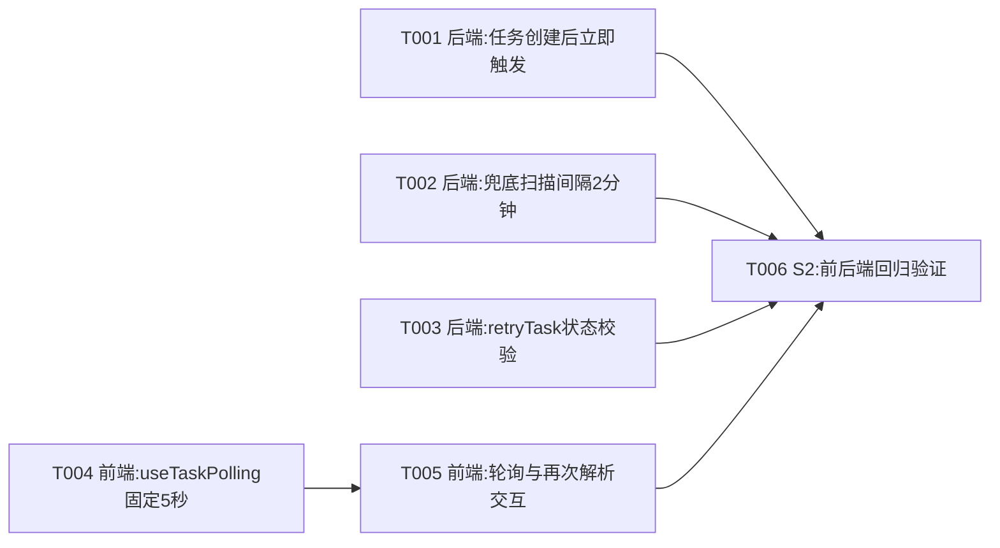

# 任务调度与轮询优化任务规划

> 功能标识：`task-scheduling-polling-optimization`
> 规划模式：`single-file`
> SDD 等级：`S2`
> 来源需求：`spec/features/20260810/任务调度与轮询优化-需求说明书.md`
> 来源技术设计：`spec/features/20260810/任务调度与轮询优化-技术设计说明书.md`
> 文档状态：pending
> 创建日期：2026-08-10
> 更新日期：2026-08-11
> 实现确认状态：`pending`

## 1. 任务概览

- 总任务数：6
- 核心路径：T001 → T005 → T006（后端立即触发 → 前端轮询与交互 → 回归验证）
- 风险任务：T006（S2 回归验证，覆盖前后端协同场景）
- 阻塞任务：无
- 可并行分组：T001 / T002 / T003 / T004 可并行（不修改同一文件，无依赖关系）
- Mock/临时实现闭环：无
- 可运行服务闭环：无（改造现有服务内部逻辑，不新增独立服务）
- DDL/数据结构任务：无（不新增表/字段/索引）
- 运行初始化 DML/Seed 任务：无
- 数据设计与治理任务：无
- 拆分评估：未命中，任务数少且单一交付边界，使用 V1 单文件

### 1.1 任务依赖图

## 2. 实现确认门禁

- 状态：等待用户确认
- 规划产物不等于实现授权。
- 生成本任务规划文档后必须暂停，等待用户确认后才能进入业务代码实现。
- 用户确认执行且未指定任务 ID 时，默认执行全部未完成任务。
- 用户指定任务 ID 时，例如 `执行 T001,T002`，只执行指定任务。
- 不明确指令，例如 `看看`、`下一步是什么`、`继续看`，不得视为实现确认。
- 实现确认状态：`pending`

## 3. 任务列表

任务按依赖顺序排列。每个实现任务默认按 RED -> GREEN -> REFACTOR 执行，不再单独生成"编写单元测试"任务。

- [ ] T001 [P] 后端：任务创建后立即触发执行
  - 通俗解释: 完成后用户提交解析/发布等任务后秒级开始执行，不再等待60秒定时扫描。
  - AC: AC-001, AC-003
  - 来源: 技术设计说明书 §4.1.1、§1.1 决策 D-001
  - Files: fons4ai-rag2okf-service/src/main/java/com/fons/cloud/ai/rag2okf/application/task/TaskApplicationService.java; fons4ai-rag2okf-service/src/main/java/com/fons/cloud/ai/rag2okf/application/task/TaskCreatedEvent.java(新增); fons4ai-rag2okf-service/src/main/java/com/fons/cloud/ai/rag2okf/infrastructure/task/TaskCreatedEventListener.java(新增); fons4ai-rag2okf-service/src/test/java/.../TaskApplicationServiceTest.java
  - Depends: 无
  - Verification: 给定 createTask 创建新任务（非幂等命中），当事务提交后，TaskCreatedEventListener 异步调用 executeLocked(taskKey)，任务从 QUEUED 进入 RUNNING；给定幂等命中旧任务，不发布事件不触发执行；给定立即触发时锁被占用，静默跳过不抛异常，任务保持 QUEUED。
  - Quality: 确认 @TransactionalEventListener(phase=AFTER_COMMIT) 确保事务提交后才触发；确认 @Async 不阻塞创建接口返回；确认幂等命中时不发布事件；确认异常静默处理由兜底扫描补偿；确认方法长度和命名遵循项目规范；DDD-lite/领域建模检查：TaskCreatedEvent 为简单 POJO 事件记录，不引入新抽象层，ProcessingTask 状态流转方法不变。
  - 专业工作流: 无
  - Done: createTask 新任务创建后发布 TaskCreatedEvent；事件监听器 afterCommit + @Async 调用 executeLocked；单元测试覆盖新任务触发、幂等命中不触发、锁冲突静默跳过三个场景。

- [ ] T002 [P] 后端：兜底扫描间隔调整为2分钟
  - 通俗解释: 完成后兜底扫描从60秒/30秒统一为2分钟，因为正常任务创建后已立即触发，兜底扫描只需补偿漏网情况。
  - AC: AC-002
  - 来源: 技术设计说明书 §4.1.2、§1.1 决策 D-002
  - Files: fons4ai-rag2okf-service/src/main/java/com/fons/cloud/ai/rag2okf/infrastructure/task/TaskCandidateScheduler.java; fons4ai-rag2okf-service/src/main/java/com/fons/cloud/ai/rag2okf/infrastructure/task/OutboxDispatchScheduler.java
  - Depends: 无
  - Verification: 给定 TaskCandidateScheduler.scanAndExecute 的 @Scheduled fixedDelayString 默认值为 120000；给定 scanAndRecover 的 fixedDelayString 默认值为 120000；给定 OutboxDispatchScheduler.scanAndDispatch 的 fixedDelayString 默认值为 120000；注释与实际配置一致。
  - Quality: 确认保留 @Value 可配置性，仅修改默认值；确认修正"固定延迟5秒"注释为"固定延迟2分钟"；DDD-lite/领域建模检查：仅修改 @Value 默认值和注释，不改变领域对象和状态流转逻辑。
  - 专业工作流: 无
  - Done: 三个 @Scheduled 方法的 fixedDelayString 默认值均为 120000；注释与实际一致；回归测试通过。

- [ ] T003 [P] 后端：retryTask 新增原任务状态校验
  - 通俗解释: 完成后只有失败状态的任务才能被重试，避免误重试正在执行或已成功的任务。
  - AC: AC-008
  - 来源: 技术设计说明书 §4.1.4、§1.1 决策 D-004
  - Files: fons4ai-rag2okf-service/src/main/java/com/fons/cloud/ai/rag2okf/application/parsing/ParseApplicationService.java; fons4ai-rag2okf-service/src/test/java/.../ParseApplicationServiceTest.java
  - Depends: 无
  - Verification: 给定原任务状态为 FAILED，retryTask 正常创建新任务返回新 taskKey；给定原任务状态为 QUEUED/RUNNING/SUCCEEDED/RETRY_WAIT，retryTask 抛出 TASK_NOT_RETRYABLE 异常，不创建新任务。
  - Quality: 确认异常消息包含当前状态口径信息；确认不改变 retryTask 的幂等键生成和 payload 复用逻辑；确认方法长度和命名遵循项目规范；DDD-lite/领域建模检查：状态校验在 ProcessingTask 领域对象之外的应用服务层执行，不改变 ProcessingTask 已有状态流转方法。
  - 专业工作流: 无
  - Done: retryTask 仅允许 FAILED 状态重试；非 FAILED 状态抛出 TASK_NOT_RETRYABLE；单元测试覆盖 FAILED 可重试和其他状态不可重试场景。

- [ ] T004 [P] 前端：useTaskPolling 改为固定5秒间隔
  - 通俗解释: 完成后前端轮询固定5秒查询一次，不再指数退避，降低服务端压力且保证一致的刷新体验。
  - AC: AC-004, AC-006
  - 来源: 技术设计说明书 §4.1.3、§1.1 决策 D-003
  - Files: fons4ai-rag2okf-ui/src/composables/useTaskPolling.ts; fons4ai-rag2okf-ui/src/composables/__tests__/useTaskPolling.spec.ts
  - Depends: 无
  - Verification: 给定 useTaskPolling 启动后，setTimeout 间隔固定为 5000ms，不随轮询次数递增；给定 isActive 返回 false，轮询立即停止；给定轮询进行中（inFlight），重叠请求被跳过。
  - Quality: 确认删除 backoffFactor 和 maxIntervalMs 选项及 currentInterval 递增逻辑；确认 intervalMs 默认值改为 5000；确认 start/stop/inFlight 单飞逻辑保持不变；确认 TypeScript 类型定义同步更新；确认调用方（DocumentDetailView）的 useTaskPolling 调用参数需同步移除退避参数；DDD-lite/领域建模检查：useTaskPolling 为前端 composable，不涉及领域对象变更。
  - 专业工作流: 无
  - Done: useTaskPolling 使用固定 intervalMs（默认5000），无退避逻辑；UseTaskPollingOptions 接口删除 backoffFactor 和 maxIntervalMs；单元测试覆盖固定间隔、isActive 停止、单飞三个场景。

- [ ] T005 前端：DocumentDetailView 轮询生命周期与再次解析交互
  - 通俗解释: 完成后离开文档详情页轮询正确停止（含 keep-alive 场景），解析失败区域显示"再次解析"按钮可直接重试。
  - AC: AC-004, AC-005, AC-006, AC-007, AC-008, AC-009
  - 来源: 技术设计说明书 §4.1.3、§4.1.4、§1.1 决策 D-005、D-006
  - Files: fons4ai-rag2okf-ui/src/views/documents/DocumentDetailView.vue; fons4ai-rag2okf-ui/src/views/documents/__tests__/DocumentDetailView.spec.ts
  - Depends: T004
  - Verification: 给定 isParseActive = QUEUED/RUNNING/RETRY_WAIT，onMounted 查询一次后启动5秒轮询；给定 isParseActive = SUCCEEDED/FAILED，onMounted 只查询一次不启动轮询；给定路由切换离开（onBeforeUnmount 或 onDeactivated），stopPolling 被调用；给定 keep-alive 场景 onDeactivated 触发 stopPolling，onActivated 条件恢复 startPolling；给定解析失败状态，解析失败区域显示"再次解析"按钮；给定点击"再次解析"，调用 retryTask 后 refreshStatus + startPolling。
  - Quality: 确认 isParseActive 去掉 PENDING（后端 TaskStatus 无此状态口径），改为 QUEUED||RUNNING||RETRY_WAIT，前后端状态口径对齐；确认 useTaskPolling 调用移除退避参数（依赖 T004）；确认 onDeactivated/onActivated 从 vue 导入；确认解析失败区域"再次解析"按钮复用现有 retryLatestTask 方法；确认按钮样式与现有"重试任务"按钮一致；确认 data-test 属性为 reparse-btn；DDD-lite/领域建模检查：isParseActive 逻辑简洁，无多余状态判断。
  - 专业工作流: 无
  - Done: isParseActive 不含 PENDING；onDeactivated 停止轮询、onActivated 条件恢复；解析失败区域有"再次解析"按钮调用 retryLatestTask；无处理中任务时不启动轮询；单元测试覆盖上述场景。

- [ ] T006 S2：前后端回归验证
  - 通俗解释: 完成后可以确认任务立即触发、兜底扫描、前端轮询和再次解析的整体协同行为符合预期，无回归问题。
  - AC: AC-001, AC-002, AC-003, AC-004, AC-005, AC-006, AC-007, AC-008, AC-009
  - 来源: 技术设计说明书 §7.1、§7.3
  - Files: 无
  - Depends: T001, T002, T003, T004, T005
  - Verification: 后端运行 mvn test 确认 TaskApplicationService、ParseApplicationService、TaskCandidateScheduler 相关测试通过；前端运行 npm run test:unit 确认 useTaskPolling、DocumentDetailView 相关测试通过；验证 isParseActive 不含 PENDING 且前端测试中无 PENDING 相关断言残留。
  - Quality: 确认回归覆盖后端 TaskApplicationService、ParseApplicationService、TaskCandidateScheduler 相关测试；确认回归覆盖前端 useTaskPolling、DocumentDetailView 相关测试；确认状态口径全局一致性；确认不引入新测试框架或依赖；确认回归测试覆盖立即触发成功/失败、兜底扫描补偿、retryTask 状态校验、固定5秒轮询、keep-alive 场景、再次解析全流程；DDD-lite/领域建模检查：回归测试不改变领域对象和状态流转逻辑，确认任务状态口径前后端一致。
  - 专业工作流: 无
  - Done: 后端 mvn test 通过；前端 npm run test:unit 通过；9 个 AC 全部有对应验证覆盖；无 PENDING 状态残留。

## 4. AC 追踪表

| AC | 覆盖任务 | 验证方式 |
| --- | --- | --- |
| AC-001 | T001, T006 | T001 单元测试验证 createTask 后 executeLocked 被调用；T006 回归测试 |
| AC-002 | T002, T006 | T002 配置检查验证 fixedDelay 默认值；T006 回归测试 |
| AC-003 | T001, T006 | T001 单元测试验证锁冲突静默跳过；T006 回归测试 |
| AC-004 | T004, T005, T006 | T004 单元测试验证固定5秒间隔；T005 验证 onMounted 查询+启动轮询；T006 回归测试 |
| AC-005 | T005, T006 | T005 单元测试验证 onBeforeUnmount/onDeactivated 停止轮询；T006 回归测试 |
| AC-006 | T004, T005, T006 | T004 单元测试验证 isActive false 时停止；T005 验证 isParseActive 去掉 PENDING；T006 回归测试 |
| AC-007 | T005, T006 | T005 单元测试验证无处理中任务时不启动轮询；T006 回归测试 |
| AC-008 | T003, T005, T006 | T003 单元测试验证 retryTask 状态校验；T005 验证"再次解析"按钮；T006 回归测试 |
| AC-009 | T005, T006 | T005 单元测试验证 retryLatestTask 后 startPolling；T006 回归测试 |

## 5. 按需任务

以下章节只在技术设计说明书明确触发时生成。

### 5.6 S2 风险与回归任务

S2 风险与回归任务已合并到 T006 中，不单独生成额外风险任务。T006 覆盖以下 S2 风险门禁：

| 风险类型 | 验证内容 | 对应 AC |
| --- | --- | --- |
| 兼容性 | 兜底扫描机制保留，不破坏已有任务处理逻辑 | AC-002, AC-003 |
| 事务一致性 | @TransactionalEventListener afterCommit 确保事务提交后触发 | AC-001 |
| 并发控制 | @DistributeLock + isExecutable 保证多实例幂等执行 | AC-003 |
| 前端资源泄漏 | onDeactivated + onBeforeUnmount 双重清理轮询 | AC-005 |
| 状态一致性 | isParseActive 去掉 PENDING，前后端状态对齐 | AC-006 |
| 回归 | 前后端全量测试通过 | 全部 AC |

### 5.7 页面/交互型交付物设计确认

技术设计说明书已将"页面/交互型交付物"标记为"是"，但本次前端改动较小（解析失败区域增加按钮 + 轮询参数调整），用户在前序对话中已明确"前端样式直接修改即可"，跳过独立 UI 设计确认任务。UI 调整在 T005 中直接实现并验证。决策证据记录于此。

> 确认执行后默认执行全部未完成任务；如需指定范围，请回复：执行 T001,T002。
