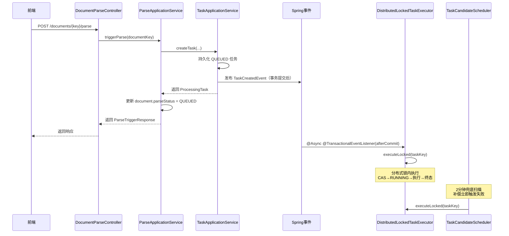

# 任务调度与轮询优化技术设计说明书

> 功能标识：`task-scheduling-polling-optimization`
> SDD 等级：`S2`
> 来源需求：`spec/features/20260810/任务调度与轮询优化-需求说明书.md`
> 文档状态：已确认
> 设计确认状态：`approved`
> 创建日期：2026-08-10
> 更新日期：2026-08-11
>
> **更新时间维护规则**：任何正文修改必须同步更新 `更新日期`，并在版本修订记录中追加说明。

## 1. 设计摘要与关键决策

- 功能目标：将业务任务从纯定时扫描驱动改为创建后立即触发+2分钟兜底补偿；将前端轮询从2秒指数退避改为5秒固定并严格绑定页面生命周期；在解析失败区域增加"再次解析"入口复用原文件重新解析。对应 REQ-001~REQ-006 / AC-001~AC-009。
- 设计范围：后端任务调度层（TaskCandidateScheduler、OutboxDispatchScheduler、DistributedLockedTaskExecutor、TaskApplicationService）、后端解析触发层（ParseApplicationService）、前端轮询层（useTaskPolling）、前端文档详情页（DocumentDetailView）。
- 非目标：不引入消息队列或时间轮等新中间件；不新增数据库表或字段；不改变任务状态机本身（QUEUED→RUNNING→SUCCEEDED/RETRY_WAIT/FAILED 保持不变）；不新增领域对象。
- SDD 等级理由：涉及核心异步任务调度机制改造（从纯 pull 改为 push+pull 混合）、公共任务执行契约变化（创建后立即触发）、前端轮询生命周期管理，属于跨核心模块改造，回滚需要前后端协同。
- 交付画像：混合（后端服务 + 前端应用）
- 独立可运行服务：否，原因：改造现有 Spring Boot 服务内部调度逻辑，不新增独立服务
- 页面/交互型交付物：是，原因：DocumentDetailView 页面交互和 useTaskPolling 轮询策略调整，但改动较小（解析失败区域增加按钮 + 轮询参数调整），用户已明确跳过独立 UI 设计确认
- 数据结构变更：否，原因：不新增表/字段/索引，仅调整配置默认值和代码逻辑
- 规划建议：V1 单文件，原因：任务数少（6 个）、单一交付边界、无需分批评审

### 1.1 关键决策

| 决策 | 选择 | 原因 | 替代方案 | 影响 | 需用户确认 |
| --- | --- | --- | --- | --- | --- |
| D-001 立即触发实现方式 | Spring 事务事件 + @Async（@TransactionalEventListener(afterCommit) + @Async 调用 executeLocked） | 复用 Spring 内置能力，不引入 RabbitMQ/Kafka 等新中间件；事务提交后触发避免脏读；异步不阻塞创建接口 | A) createTask 内直接 @Async 调用 executeLocked（无事务提交保证，可能读到未提交数据）；B) 引入 RabbitMQ 消息队列（过重，项目当前无 MQ 基础设施）；C) 时间轮（需引入 Netty 或 Resilience4j 依赖） | 进程崩溃时事件丢失，由2分钟兜底扫描补偿，可接受 | 否 |
| D-002 兜底扫描统一2分钟（含 Outbox） | scanAndExecute、scanAndRecover、scanAndDispatch 全部默认2分钟 | 立即触发后正常情况不需要高频兜底；统一间隔简化配置 | A) stale 恢复保持30秒（更快的异常恢复，但增加扫描压力）；B) Outbox 保持独立60秒（不统一） | 异常任务恢复从30秒延长到2分钟，可接受（立即触发已覆盖正常路径）；同时关闭需求说明书两个待确认项 | 否 |
| D-003 前端轮询策略 | 固定5秒间隔，删除 backoffFactor 和 maxIntervalMs | 用户明确要求5秒固定；退避策略导致长任务后期间隔过长（15秒），用户体验差 | 保留退避但缩短范围（2s→5s，差距太小不值得保留退避逻辑） | 长任务轮询频率略高于退避策略，但5秒固定可接受 | 否 |
| D-004 再次解析实现 | 在解析失败区域增加"再次解析"按钮，调用现有 POST /tasks/{taskKey}/retry | retryTask 已复用原 payload（含 fileToken），语义等同"复用原文件再次解析"；新增端点无必要 | 新增 POST /documents/{documentKey}/reparse 端点（与 retryTask 逻辑重复） | 后端 retryTask 新增状态校验（仅 FAILED 可重试），前端新增按钮入口 | 否 |
| D-005 keep-alive 场景处理 | 新增 onDeactivated(stopPolling) + onActivated(条件恢复 startPolling) | onBeforeUnmount 在 keep-alive 缓存时不触发，可能导致轮询泄漏 | A) 禁用 keep-alive（影响其他页面缓存体验）；B) 用路由守卫全局管理（过重） | keep-alive 场景下离开文档详情页轮询正确停止 | 否 |
| D-006 isParseActive 状态口径 | 去掉 PENDING（后端无此状态），改为 `QUEUED \|\| RUNNING \|\| RETRY_WAIT` | 后端 TaskStatus 枚举无 PENDING，前端 PENDING 是历史遗留；RETRY_WAIT 时任务仍在重试中，前端应继续轮询 | 去掉 RETRY_WAIT（导致重试期间轮询中断后恢复，体验不佳） | 前后端状态口径对齐 | 否 |

- 新增依赖：否
- 新增抽象：否（TaskCreatedEvent 是简单 POJO 事件，不算新抽象层）
- 不采用方案：消息队列（项目当前无 MQ 基础设施，引入成本过高）、时间轮（需新依赖）、全局路由守卫管理轮询（过重）

### 1.2 设计确认 Gate

- Gate 是否适用：是，原因：S2 跨核心模块改造（任务调度机制从纯 pull 改为 push+pull 混合）
- 设计确认状态：`approved`
- 用户需确认的关键点：立即触发采用 Spring 事务事件而非 MQ、兜底扫描统一2分钟（含 Outbox 和 stale 恢复）、前端固定5秒轮询、再次解析复用 retryTask
- 确认证据：用户在需求澄清中已确认立即触发+2分钟兜底的语义、解析失败后复用原文件重试；技术设计中 Outbox 纳入2分钟和 stale 恢复调整到2分钟的待确认项已由 D-002 决策关闭

## 2. 系统边界、模块与调用链

### 2.1 模块与职责

| 模块/组件 | 职责 | 输入 | 输出 | 依赖 | 影响 AC |
| --- | --- | --- | --- | --- | --- |
| TaskApplicationService | 任务应用服务，创建任务后发布事件 | 任务创建请求 | ProcessingTask + TaskCreatedEvent | Spring ApplicationEventPublisher | AC-001 |
| TaskCreatedEvent | 任务创建事件（简单 POJO） | taskKey | taskKey | 无 | AC-001 |
| TaskCreatedEventListener | 事件监听器，事务提交后异步触发执行 | TaskCreatedEvent | executeLocked 调用 | DistributedLockedTaskExecutor | AC-001, AC-003 |
| TaskCandidateScheduler | 兜底扫描调度器 | @Scheduled 触发 | scanAndExecute + scanAndRecover | DistributedLockedTaskExecutor | AC-002 |
| OutboxDispatchScheduler | Outbox 事件分发调度器 | @Scheduled 触发 | scanAndDispatch | 无 | AC-002 |
| DistributedLockedTaskExecutor | 通用任务执行器（已有，不变） | taskKey | 任务终态 | @DistributeLock | AC-003 |
| ParseApplicationService | 解析应用服务，retryTask 新增状态校验 | taskKey | 新任务 taskKey | TaskApplicationService | AC-008, AC-009 |
| useTaskPolling | 前端轮询 composable | fetcher, isActive, intervalMs | 轮询控制 | 无 | AC-004, AC-006 |
| DocumentDetailView | 前端文档详情页 | document.parseStatus | isParseActive + 轮询生命周期 + 再次解析交互 | useTaskPolling | AC-004~AC-009 |

- 涉及入口：DocumentParseController（解析触发）、TaskController（任务重试）、DocumentDetailView（前端页面）
- 涉及领域对象：ProcessingTask（任务领域模型，状态流转不变）、TaskStatus（状态枚举，不新增状态）
- 涉及数据访问：KbProcessingTaskEntity、KbSourceDocumentEntity
- 外部依赖：Redisson 分布式锁（@DistributeLock，已有）

### 2.2 调用链、服务形态与运行态设计

- 启动入口：不适用，原因：本次改造不新增独立可运行服务，仅调整现有 Spring Boot 服务内部的调度逻辑和前端轮询策略
- 配置来源：@Value 注解默认值（application.yml 不显式定义，使用 @Value 默认值）
- 注册发现与路由：不适用
- 健康检查与核心运行验证：不适用

调用链路（任务创建后立即触发 + 兜底扫描补偿）：



> 立即触发走 Spring 事务事件（afterCommit + @Async），兜底扫描保留现有定时调度机制。

## 3. 接口、消息与外部契约

只记录新增或变更契约。

### 3.1 契约清单

| 契约 | 类型 | 标识/路径 | 鉴权 | 兼容策略 | 错误处理 | AC |
| --- | --- | --- | --- | --- | --- | --- |
| 触发解析 | HTTP | POST /documents/{documentKey}/parse | 知识库管理员权限 | 不改变请求/响应格式，仅改变后端创建任务后的行为（新增立即触发） | 无新增错误码 | AC-001 |
| 重试任务 | HTTP | POST /tasks/{taskKey}/retry | 知识库管理员权限 | 新增后端状态校验（仅 FAILED 状态可重试），前端无感知 | 新增 `TASK_NOT_RETRYABLE`（原任务非 FAILED 状态时不允许重试） | AC-008 |
| 查询文档 | HTTP | GET /documents/{documentKey} | 知识库用户权限 | 不变 | 无新增 | AC-004 |
| 任务创建事件 | 内部事件 | TaskCreatedEvent（Spring ApplicationEvent） | 内部事件，无鉴权 | 新增事件，仅进程内消费 | 事件处理异常静默记录日志，由兜底扫描补偿 | AC-001 |

### 3.2 详细契约

#### 触发解析

- 路径/标识：`POST /documents/{documentKey}/parse`
- 鉴权要求：知识库管理员权限
- 请求参数：`parseMode`（可选，默认 PARSE）
- 兼容性：不改变请求/响应格式，仅改变后端创建任务后的行为（新增立即触发）
- 错误码：无新增
- 契约文件：无

#### 重试任务

- 路径/标识：`POST /tasks/{taskKey}/retry`
- 鉴权要求：知识库管理员权限
- 请求参数：无（路径参数 taskKey）
- 成功响应：`{ "code": 200, "data": "<新taskKey>" }`
- 兼容性：新增后端状态校验（仅 FAILED 状态可重试），前端无感知
- 错误码：新增 `TASK_NOT_RETRYABLE`（原任务非 FAILED 状态时不允许重试）
- 契约文件：无

> 前端"再次解析"按钮复用此端点。现有 retryTask 后端不校验原任务状态，本次新增校验。

#### 任务创建事件

- 路径/标识：`TaskCreatedEvent`（Spring ApplicationEvent，携带 taskKey）
- 鉴权要求：内部事件，无鉴权
- 调用时机：createTask 事务提交后（@TransactionalEventListener AFTER_COMMIT）
- 默认实现：@Async 异步调用 executeLocked
- 兼容性：新增事件，仅进程内消费
- 契约文件：无

## 4. 核心业务、领域规则与状态流转

### 4.1 核心流程

#### 4.1.1 任务创建后立即触发执行

- 触发条件：TaskApplicationService.createTask 成功创建新任务（非幂等命中）
- 输入：新创建的 ProcessingTask（taskKey）
- 处理步骤：
  1. createTask 事务内持久化任务后，发布 TaskCreatedEvent（携带 taskKey）
  2. 事件监听器在事务提交后（@TransactionalEventListener afterCommit）异步执行（@Async）
  3. 调用 DistributedLockedTaskExecutor.executeLocked(taskKey) 立即触发执行
  4. 若异步触发失败（锁被占用、异常等），任务保持 QUEUED，等待兜底扫描补偿
- 输出：任务进入执行态或保持 QUEUED
- 异常分支：异步触发异常不影响创建接口返回；幂等命中旧任务时不发布事件
- 幂等要求：executeLocked 内部已有状态机校验（isExecutable），重复触发安全

```text
// TaskApplicationService.createTask 改造伪代码
@Transactional
public ProcessingTask createTask(...) {
    // 1. 幂等查询
    existing = findByIdempotencyKey(...)
    if (existing != null) {
        return new ProcessingTask(existing)  // 幂等命中，不发布事件
    }
    // 2. 持久化新任务
    entity = new KbProcessingTaskEntity(...)
    entity.setStatus("QUEUED")
    save(entity)
    // 3. 发布事件（事务提交后异步触发）
    applicationEventPublisher.publishEvent(new TaskCreatedEvent(entity.getTaskKey()))
    return new ProcessingTask(entity)
}

// 事件监听器
@Async
@TransactionalEventListener(phase = AFTER_COMMIT)
public void onTaskCreated(TaskCreatedEvent event) {
    try {
        taskExecutor.executeLocked(event.taskKey())
    } catch (DistributeLockException e) {
        log.debug("Immediate trigger lock conflict, will be picked up by fallback scan: {}", event.taskKey())
    } catch (Exception e) {
        log.error("Immediate trigger failed, will be picked up by fallback scan: {}", event.taskKey(), e)
    }
}
```

> 使用 @TransactionalEventListener(afterCommit) 确保事务提交后才触发，避免读到未提交数据。@Async 避免阻塞创建接口返回。

#### 4.1.2 兜底扫描间隔调整

- 触发条件：@Scheduled 定时触发
- 输入：无
- 处理步骤：
  1. scanAndExecute 的 fixedDelay 从 60000ms 改为 120000ms（2分钟）
  2. scanAndRecover 的 fixedDelay 从 30000ms 改为 120000ms（2分钟）
  3. 修正注释（"固定延迟 5 秒" → "固定延迟 2 分钟"）
  4. OutboxDispatchScheduler.scanAndDispatch 的 fixedDelay 从 60000ms 改为 120000ms（2分钟），统一兜底扫描节奏
- 输出：兜底扫描每2分钟执行一次
- 异常分支：无
- 幂等要求：executeLocked 和 recoverStale 内部已有状态机校验

```text
// TaskCandidateScheduler 改造
@Scheduled(fixedDelayString = "${rag2okf.task.scan-interval-ms:120000}", initialDelayString = "10000")
public void scanAndExecute() { ... }

@Scheduled(fixedDelayString = "${rag2okf.task.recovery-interval-ms:120000}", initialDelayString = "30000")
public void scanAndRecover() { ... }

// OutboxDispatchScheduler 改造
@Scheduled(fixedDelayString = "${rag2okf.outbox.scan-interval-ms:120000}", initialDelayString = "15000")
public void scanAndDispatch() { ... }
```

> 保留 @Value 可配置性，仅修改默认值。application.yml 仍不显式定义，使用 @Value 默认值。同时关闭需求说明书中关于 Outbox 和 stale 恢复间隔的两个待确认项。

#### 4.1.3 前端轮询策略优化

- 触发条件：进入文档详情页且有处理中任务
- 输入：文档 parseStatus
- 处理步骤：
  1. useTaskPolling 去掉指数退避，改为固定5秒间隔
  2. isParseActive 去掉 PENDING（后端无此状态），改为 `QUEUED || RUNNING || RETRY_WAIT`
  3. onMounted 时查询一次，仅当 isParseActive 为 true 时启动轮询
  4. onBeforeUnmount 时停止轮询（已有，保持）
  5. 新增 onDeactivated 钩子处理 keep-alive 场景：组件停用时停止轮询；onActivated 恢复
- 输出：固定5秒轮询，离开页面或任务终态时停止
- 异常分支：轮询请求失败时保持轮询（网络抖动不应终止轮询）
- 幂等要求：useTaskPolling 已有单飞机制

```text
// useTaskPolling 改造伪代码
export function useTaskPolling(options) {
  const {
    fetcher, isActive, onUpdate,
    intervalMs = 5000,       // 改为固定5秒
    // 删除 maxIntervalMs 和 backoffFactor
  } = options

  let timerId = null
  let running = false

  function scheduleNext() {
    if (!running) return
    if (!isActive()) { stop(); return }
    timerId = setTimeout(poll, intervalMs)  // 固定间隔，不退避
  }

  async function poll() {
    timerId = null
    if (!running || !isActive()) { stop(); return }
    // ... fetcher 调用逻辑保持不变
    scheduleNext()
  }
  // start/stop 逻辑保持不变
}

// DocumentDetailView isParseActive 改造
const isParseActive = computed(() => {
  const status = document.value?.parseStatus
  return status === 'QUEUED' || status === 'RUNNING' || status === 'RETRY_WAIT'
})
```

#### 4.1.4 解析失败后再次解析

- 触发条件：文档解析状态为 FAILED，用户点击"再次解析"
- 输入：原任务 taskKey
- 处理步骤：
  1. 在解析失败区域增加"再次解析"按钮（与现有任务卡片的"重试任务"按钮并行）
  2. 点击后调用 retryTask(taskKey)（复用现有端点）
  3. 后端 retryTask 新增状态校验：仅 FAILED 状态可重试
  4. 重试成功后前端 refreshStatus + startPolling
- 输出：新解析任务创建并立即触发执行
- 异常分支：原任务非 FAILED 状态返回 TASK_NOT_RETRYABLE 错误
- 幂等要求：retryTask 幂等键 `RETRY:taskKey:timestamp`，天然防重复

```text
// ParseApplicationService.retryTask 改造伪代码
public String retryTask(String taskKey) {
    var originalTask = taskApplicationService.findByKey(taskKey)
    if (originalTask == null) throw new TaskExecutionException("Task not found: " + taskKey)
    // 新增：仅 FAILED 状态可重试
    if (originalTask.status() != TaskStatus.FAILED) {
        throw new TaskExecutionException("TASK_NOT_RETRYABLE",
            "仅失败状态的任务可重试，当前状态: " + originalTask.status())
    }
    // ... 权限校验、创建新任务（复用原 payload）、更新 parseStatus = QUEUED
    // 新任务创建后会自动发布 TaskCreatedEvent 立即触发
    return retryTask.taskKey()
}
```

### 4.2 规则落地

| 业务规则/行为 | 归属模块或对象 | 数据依赖 | 事务边界 | 扩展点 | 验证方式 |
| --- | --- | --- | --- | --- | --- |
| BR-001 任务创建后立即触发 | TaskApplicationService | 无 | createTask @Transactional | TaskCreatedEvent 事件发布 | 单元测试：创建任务后验证 executeLocked 被调用 |
| BR-002 兜底扫描2分钟间隔 | TaskCandidateScheduler | 无 | 无 | @Scheduled fixedDelay 默认值 | 配置检查 |
| BR-003 分布式锁保证幂等执行 | DistributedLockedTaskExecutor | 无 | @DistributeLock 锁内 | 无（已有机制） | 回归测试 |
| BR-004 前端固定5秒轮询 | useTaskPolling | 无 | 无 | intervalMs 固定5000 | 单元测试 |
| BR-005 轮询绑定页面生命周期 | DocumentDetailView | 无 | 无 | onBeforeUnmount + onDeactivated 停止；onMounted + onActivated 恢复 | 单元测试 |
| BR-006 仅处理中状态轮询 | DocumentDetailView | document.parseStatus | 无 | isParseActive = QUEUED \|\| RUNNING \|\| RETRY_WAIT | 单元测试 |
| BR-007 再次解析复用原文件 | ParseApplicationService | 无 | retryTask @Transactional | 复用原 payload（含 fileToken） | 单元测试 |
| BR-008 再次解析后状态更新 | ParseApplicationService | KbSourceDocumentEntity | retryTask @Transactional | 更新 parseStatus = QUEUED，新任务立即触发 | 单元测试 |

- DDD-lite 判断：本次改造以应用服务编排和基础设施调度为主，不新增领域对象。
- 核心领域对象：ProcessingTask（已有，状态流转不变）、TaskStatus（已有，不新增状态）。
- 应用服务职责：TaskApplicationService 新增事件发布；ParseApplicationService.retryTask 新增状态校验。
- 贫血模型例外：不适用，ProcessingTask 已有丰富的状态流转方法。
- 基础设施依赖边界：Spring 事件机制（@TransactionalEventListener + @Async）为 Spring 内置能力，不引入新依赖。

### 4.3 状态流转

本次不改变任务状态机本身（QUEUED→RUNNING→SUCCEEDED/RETRY_WAIT/FAILED 保持不变），仅改变状态流转的触发时机和重试校验。

| 当前状态 | 触发动作 | 前置条件 | 目标状态 | 失败处理 | 幂等 |
| --- | --- | --- | --- | --- | --- |
| QUEUED | 立即触发 executeLocked | 事务提交后 TaskCreatedEvent | RUNNING | 异步触发失败保持 QUEUED，等兜底扫描 | isExecutable 校验 |
| QUEUED | 兜底扫描 executeLocked | 2分钟 fixedDelay | RUNNING | 锁冲突跳过，等下次扫描 | isExecutable 校验 |
| FAILED | retryTask | 原任务状态为 FAILED | 新任务 QUEUED | 非 FAILED 返回 TASK_NOT_RETRYABLE | 幂等键 RETRY:taskKey:timestamp |

> 状态机本身不变，仅新增触发路径和校验规则。

## 5. 数据结构、迁移与初始化

### 5.1 数据影响判断

| 检查项 | 是否涉及 | 设计结论 |
| --- | --- | --- |
| 持久化数据或数据服务结构 | 否 | 不新增表/字段/索引，仅调整配置默认值和代码逻辑 |
| 外部数据入库、出库、同步、对账或报表 | 否 | 不涉及 |
| 字段映射、金额、日期、状态、流水号或客户标识 | 否 | 不涉及，任务状态流转使用已有状态值 |
| 敏感数据、权限、脱敏、加密、审计或保留期限 | 否 | 不涉及 |
| 跨系统、跨服务、跨库或第三方数据流转 | 否 | 不涉及 |

### 5.2 字段映射与数据流

不适用，原因：本次不涉及文件入库、接口入库、数据同步、对账、报表、迁移或跨系统数据流转。

### 5.3 结构变更详设

不适用，原因：本次不涉及新增表、修改表、删除/重命名字段、修改字段类型/默认值/约束、调整索引/唯一约束/外键/分区，或变更 Redis、Elasticsearch、MongoDB、对象存储、消息 Topic 等数据服务结构。

- SQL 当前结构快照：无
- 迁移位置：不适用
- 执行型变更 DDL：不适用
- 回填/清理：不适用
- 回滚：不适用

> 设计阶段不生成可执行 SQL。

### 5.4 运行初始化 DML / Seed 数据

- 是否涉及：否
- 初始化对象：不适用
- 脚本交付路径：不适用
- 执行责任方：不适用
- 占位变量：无
- 幂等与回滚：不适用
- 执行后复核：不适用

### 5.5 数据安全与生命周期

| 检查项 | 设计结论 | 验证方式 |
| --- | --- | --- |
| 传输与存储安全 | 不适用，原因：不改变现有传输安全机制，不涉及存储变更 | 复用现有机制 |
| 展示/日志脱敏 | 不适用，原因：不涉及敏感数据 | 不涉及 |
| 数据权限与审计 | 不适用，原因：复用现有权限校验，任务执行日志保持现有级别 | 复用现有机制 |
| 保留、删除与归档 | 不适用，原因：不涉及 | 不涉及 |

## 6. 横切质量设计

| 主题 | 设计结论 | 验证方式 |
| --- | --- | --- |
| 异常与错误码 | 立即触发锁被占用静默跳过（DEBUG 日志）；立即触发异常静默跳过（ERROR 日志）；retryTask 非 FAILED 状态返回 TASK_NOT_RETRYABLE（WARN 日志）；前端轮询请求失败保持轮询（静默处理） | 单元测试：锁冲突静默跳过、异常静默跳过、retryTask 状态校验 |
| 鉴权与应用安全 | 复用现有 SaToken 鉴权机制，不新增认证逻辑；retryTask 复用现有权限校验（currentUserContext + workspace 校验）；retryTask 新增原任务状态校验（仅 FAILED 可重试） | 复用现有测试 |
| 事务与一致性 | createTask 保持现有 @Transactional；retryTask 保持现有事务边界；TaskCreatedEvent 使用 @TransactionalEventListener(afterCommit)，确保事务提交后才触发执行；@DistributeLock(waitTime=0) 保证多实例下同一任务只有一个执行；Spring 事件为进程内事件，进程崩溃时事件丢失由兜底扫描补偿 | 单元测试：事务边界验证 |
| 并发、缓存与消息 | @DistributeLock(waitTime=0) 保证多实例幂等执行；不涉及缓存和 MQ；@Async 线程池满时立即触发排队，兜底扫描补偿 | 分布式锁保证 |
| 性能与限流 | 不新增查询，兜底扫描查询保持现有 scanCandidates 逻辑；无索引影响；任务执行延迟从最长60秒降低到秒级；前端轮询请求量降低约60%（从2秒退避到5秒固定） | 性能可感知改善 |
| 兼容与迁移 | 兜底扫描机制保留，不破坏已有任务处理逻辑；多实例分布式锁机制保持不变；retryTask 新增状态校验与前端已有 FAILED 限制一致；isParseActive 去掉 PENDING 与后端口径对齐 | 回归测试：前后端全量测试通过 |
| 日志、指标与追踪 | 立即触发失败记录 DEBUG/ERROR 日志；retryTask 状态校验失败记录 WARN 日志；不新增指标 | 日志级别验证 |

## 7. AC、验证、风险与回滚

### 7.1 AC 设计矩阵

| REQ/AC | 设计落点 | 验证方式 | 风险 | 回滚/降级 |
| --- | --- | --- | --- | --- |
| REQ-001 / AC-001 任务创建后立即触发 | D-001 TaskApplicationService.createTask 发布 TaskCreatedEvent，@TransactionalEventListener @Async 触发 executeLocked | 后端单元测试：mock executeLocked，验证 createTask 后被调用 | 低 | 移除事件发布 |
| REQ-002 / AC-002 兜底扫描2分钟 | D-002 TaskCandidateScheduler @Scheduled fixedDelay 默认值改为120000 | 配置检查：@Scheduled 注解默认值验证 | 低 | 恢复原默认值 |
| REQ-001 / AC-003 分布式锁互斥 | @DistributeLock(waitTime=0) + isExecutable 状态校验（已有，不变） | 回归测试 | 低 | 不适用 |
| REQ-003 / AC-004 进入页面查询+5秒轮询 | D-003, D-006 useTaskPolling intervalMs=5000 固定；DocumentDetailView onMounted 查询一次后条件启动 | 前端单元测试 | 低 | 恢复退避策略 |
| REQ-004 / AC-005 离开页面停止轮询 | D-005 DocumentDetailView onBeforeUnmount + onDeactivated 调用 stopPolling | 前端单元测试 | 低 | 移除 onDeactivated |
| REQ-005 / AC-006 终态停止轮询 | D-006 useTaskPolling isActive 返回 false 时 stop；isParseActive 去掉 PENDING | 前端单元测试 | 低 | 恢复 PENDING |
| REQ-003 / AC-007 无处理中任务不轮询 | D-006 DocumentDetailView onMounted 时 isParseActive false 则不 startPolling | 前端单元测试 | 低 | 不适用 |
| REQ-006 / AC-008 再次解析复用原文件 | D-004 ParseApplicationService.retryTask 复用原 payload；前端解析失败区域新增"再次解析"按钮调用 retryTask | 后端+前端单元测试 | 低 | 移除按钮 |
| REQ-006 / AC-009 再次解析后启动轮询 | D-004 retryTask 后端更新 parseStatus=QUEUED；前端 retryLatestTask 后 refreshStatus + startPolling | 后端+前端单元测试 | 低 | 不适用 |

### 7.2 知识同步影响

- 是否需要知识同步：是
- 影响类型：业务规则（文档域任务调度机制从纯 pull 改为 push+pull 混合）、接口契约（retryTask 新增状态校验、新增 TaskCreatedEvent 内部事件）
- 影响位置：文档域（document）的任务调度机制和解析重试规则
- 知识同步方式：实现验证后由 `fons4ai-knowledge-summary` 技能负责更新文档域知识文档和知识卡片，不在 SDD 任务中处理
- SQL/DDL 影响：不涉及持久化结构变化，无需更新 `.specify/sql/` 快照
- Knowledge Sync Needed: yes

### 7.3 风险与回滚

| 风险 | 影响 | 缓解措施 | 回滚方式 |
| --- | --- | --- | --- |
| R-001 立即触发失败时任务延迟2分钟执行 | 用户等待感增加 | 兜底扫描保证最终执行；立即触发失败概率低（仅在锁冲突或进程崩溃时） | 接受 |
| R-002 @Async 线程池满时立即触发排队 | 立即触发延迟 | 排队后仍会执行，且兜底扫描补偿；必要时可配置线程池 | 接受 |
| R-003 keep-alive 场景 onDeactivated 未正确触发 | 轮询泄漏 | 前端单元测试覆盖 onDeactivated 场景 | 移除 onDeactivated |
| R-004 retryTask 新增状态校验影响已有调用方 | 已有重试功能异常 | 前端已有 FAILED 限制，后端校验与前端一致 | 移除状态校验 |
| R-005 前后端状态不一致（PENDING） | 修复后不影响 | isParseActive 去掉 PENDING，后端无此状态 | 已修复 |

## 附录 A. 证据清单

| 关键结论 | 证据来源 | 证据等级 | 状态 |
| --- | --- | --- | --- |
| createTask 无立即触发，仅持久化 QUEUED | TaskApplicationService.java L52-L85 源码 | L2 | 已验证 |
| 兜底扫描默认60秒/30秒 | TaskCandidateScheduler.java L41/L69 @Value 注解 | L2 | 已验证 |
| 注释"5秒"与实际60秒不一致 | TaskCandidateScheduler.java L40 注释 vs L41 @Value | L2 | 已验证 |
| retryTask 已存在，复用原 payload | ParseApplicationService.java L262-L295 源码 | L2 | 已验证 |
| retryTask 后端不校验原任务状态 | ParseApplicationService.java L262-L295 源码 | L2 | 已验证 |
| 前端 isParseActive 含 PENDING | DocumentDetailView.vue L65-L68 源码 | L2 | 已验证 |
| 后端 TaskStatus 枚举无 PENDING | TaskStatus.java L17-L32 源码 | L2 | 已验证 |
| useTaskPolling 指数退避 2s→15s | useTaskPolling.ts L41-L43 源码 | L2 | 已验证 |
| onBeforeUnmount 已有 stopPolling | DocumentDetailView.vue L233-L237 源码 | L2 | 已验证 |
| @DistributeLock(waitTime=0) 确保幂等执行 | DistributedLockedTaskExecutor.java L76 源码 | L2 | 已验证 |
| application.yml 无 task 配置项 | application.yml 源码 | L2 | 已验证 |
| OutboxDispatchScheduler 默认60秒 | OutboxDispatchScheduler.java L40 @Value | L2 | 已验证 |
| 设计确认状态 approved | 用户在需求澄清中确认立即触发+2分钟兜底+复用原文件重试 | L2 | 已验证 |

## 附录 B. 版本修订记录

| 日期 | 版本 | 说明 |
| --- | --- | --- |
| 2026-08-10 | V1.0.0 | 初始化技术设计，包含任务立即触发、兜底扫描2分钟、前端轮询优化、再次解析四项设计 |
| 2026-08-11 | V1.1.0 | 迁移到 V2 七核心章节结构，补设计确认 Gate、证据清单和版本修订记录附录，关闭需求说明书两个待确认项 |
