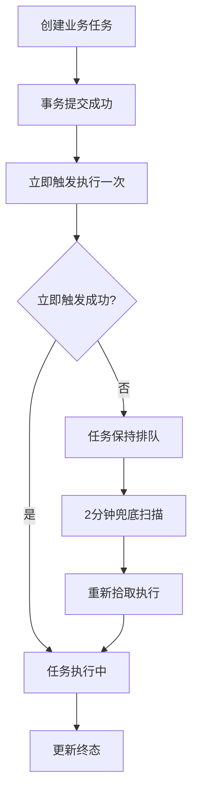

# 任务调度与轮询优化需求说明书

> 功能标识：`task-scheduling-polling-optimization`
> 版本：V1.1.0
> 文档状态：已确认
> 创建日期：2026-08-10
> 更新日期：2026-08-11
>
> **更新时间维护规则**：任何正文修改必须同步更新 `更新日期` 为本次修改日期，并在 `版本修订记录` 中追加变更记录。不得正文已变更而更新日期仍停留在旧日期。

## 一句话说明

将业务任务从定时扫描驱动改为创建后立即触发、2分钟兜底补偿；将前端轮询从2秒退避改为5秒固定并严格绑定页面生命周期；支持解析失败后复用原文件再次解析，降低服务端压力并改善用户体验。

## 需求就绪摘要

> 需求成熟度：`ready`
> 就绪结论：阻塞维度已关闭，可以进入技术设计。
>
> 这里只记录确认后的业务结论和非阻塞待确认项，不记录完整问答日志或内部推理。

### 就绪覆盖

| 维度 | 状态 | 结论摘要 |
| --- | --- | --- |
| 业务目标与价值 | 已确认 | 任务创建后秒级触发执行、2分钟兜底补偿；前端轮询固定5秒并严格绑定页面生命周期；解析失败后复用原文件一键再次解析 |
| 参与角色 | 已确认 | 知识库管理员（触发解析、查看进度、失败重试）、普通用户（查看解析结果） |
| 范围与非范围 | 已确认 | 本次包含任务立即触发+2分钟兜底、前端轮询优化、解析失败后再次解析；不包含任务调度底层技术选型（设计阶段决定）、Outbox 改造（设计阶段已纳入2分钟统一）、知识库/文档列表全局刷新、发布任务前端轮询接入 |
| 核心流程 | 已确认 | 任务调度流程（创建→立即触发→执行→兜底补偿）、前端轮询流程（进入查询→条件启动5秒轮询→离开/终态停止）、再次解析流程（失败→点击再次解析→复用原文件创建新任务→启动轮询） |
| 规则、异常与边界 | 已确认 | BR-001~BR-008 覆盖立即触发、2分钟兜底、分布式锁幂等、固定5秒轮询、页面生命周期绑定、仅处理中状态轮询、复用原文件、状态更新 |
| 验收信号 | 已确认 | AC-001~AC-009 覆盖立即触发、2分钟兜底、分布式锁互斥、进入页面查询+轮询、离开页面停止、终态停止、无处理中任务不轮询、再次解析复用原文件、再次解析后启动轮询 |
| 数据、安全与集成约束 | 已确认 | 不新增表/字段，仅调整配置默认值和代码逻辑；不涉及敏感数据、跨系统流转；复用现有 SaToken 鉴权和分布式锁机制 |

### 已确认内容

| 序号 | 已确认结论 | 影响范围 | 证据来源 |
| --- | --- | --- | --- |
| 1 | 创建后立即触发执行一次；2分钟是兜底扫描间隔，仅处理立即触发失败、进程崩溃恢复、stale 任务恢复等漏网情况 | 需求/流程/验收/业务规则 | 用户确认 |
| 2 | 解析失败后复用已存储的原始文件重新创建解析任务，用户无需重新上传；幂等键冲突由设计阶段解决 | 需求/流程/验收/业务规则 | 用户确认 |
| 3 | Outbox 事件分发调度纳入2分钟统一间隔（设计阶段 D-002 决策关闭） | 需求/范围 | 技术设计说明书 §1.1 D-002 |
| 4 | stale 任务恢复扫描从30秒调整为2分钟（设计阶段 D-002 决策关闭） | 需求/范围 | 技术设计说明书 §1.1 D-002 |

### 待确认内容

- 无

## 背景与目标

- 背景：当前业务任务（解析、重新分块、发布等）由定时调度器每60秒扫描 QUEUED 任务驱动执行，用户提交解析后最长等待60秒才开始执行；前端文档详情页轮询从2秒起步指数退避，且页面切换时轮询清理不彻底，导致服务端承受不必要的轮询压力；文档解析失败后页面无再次解析入口，用户必须重新上传文件才能重试。
- 当前问题：任务执行延迟高（最长60秒）、前端轮询频率过高且生命周期管理不严、解析失败后无法便捷重试。
- 目标：任务创建后秒级触发执行、2分钟兜底补偿；前端轮询固定5秒、严格绑定页面生命周期、仅跟踪处理中状态；解析失败后复用原文件一键再次解析。
- 不做会怎样：任务执行延迟和前端轮询压力持续存在，影响用户体验和服务端稳定性；解析失败后用户体验差。

## 需求范围

### 本次包含

- 业务任务（解析、重新分块、发布等）创建成功后立即触发执行一次，2分钟兜底扫描补偿漏网任务。
- 前端轮询改为固定5秒间隔，进入需要任务状态的页面时查询一次并启动轮询，离开页面关闭定时器，仅针对处理中状态轮询。
- 文档解析失败后，用户可在文档详情页点击"再次解析"，复用已存储的原始文件重新创建解析任务。

### 本次不包含

- 任务调度底层实现技术的选型（时间轮、消息队列等），由设计阶段决定。
- Outbox 事件分发调度的改造（待设计阶段确认是否纳入范围）。
- 知识库列表、文档列表的全局定时刷新（当前无定时刷新，本次不新增）。
- 发布任务的前端轮询接入（当前发布后不轮询，本次不扩展）。

## 角色与场景

| 角色或参与方 | 使用场景 | 触发条件 | 期望结果 |
| --- | --- | --- | --- |
| 知识库管理员 | 上传文档后触发解析 | 文档上传成功且解析模式非跳过 | 解析任务创建后立即开始执行，无需等待60秒 |
| 知识库管理员 | 查看文档解析进度 | 进入文档详情页且文档有处理中任务 | 页面显示最新状态，5秒刷新一次，离开页面后停止刷新 |
| 知识库管理员 | 解析失败后重试 | 文档解析状态为失败 | 点击"再次解析"按钮，系统复用原文件重新解析，无需重新上传 |

## 需求列表

| 需求编号 | 需求内容 | 优先级 | 关联场景 | 关联验收 |
| --- | --- | --- | --- | --- |
| REQ-001 | 业务任务创建成功后，系统立即触发该任务执行一次，不等待定时扫描 | P0 | 任务执行 | AC-001, AC-003 |
| REQ-002 | 兜底扫描间隔调整为2分钟，补偿立即触发失败、进程崩溃恢复和 stale 任务恢复 | P0 | 任务执行 | AC-002 |
| REQ-003 | 前端进入需要任务状态的页面时，立即查询一次，若有处理中任务则启动固定5秒轮询 | P0 | 查看进度 | AC-004, AC-007 |
| REQ-004 | 前端离开需要任务状态的页面时，立即关闭定时器停止轮询 | P0 | 查看进度 | AC-005 |
| REQ-005 | 前端轮询仅针对处理中状态（解析中、发布中等非终态），终态或异常状态不轮询 | P0 | 查看进度 | AC-006 |
| REQ-006 | 文档解析失败后，用户可在文档详情页点击"再次解析"，系统复用已存储的原始文件重新创建解析任务 | P0 | 解析失败重试 | AC-008, AC-009 |

## 业务规则

| 规则编号 | 规则内容 | 适用场景 | 例外或边界 |
| --- | --- | --- | --- |
| BR-001 | 业务任务创建事务提交成功后，必须立即触发该任务执行一次 | 任务创建 | 立即触发失败时由兜底扫描补偿 |
| BR-002 | 兜底扫描间隔为2分钟，扫描处于排队或异常停滞状态的任务并重新拾取执行 | 任务补偿 | 不重复执行已进入终态的任务 |
| BR-003 | 多实例环境下，同一任务被立即触发和兜底扫描同时拾取时，通过分布式锁保证只有一个实例执行 | 任务执行 | 锁被占用时静默跳过，等下次扫描 |
| BR-004 | 前端轮询固定5秒间隔，不退避、不加速 | 前端轮询 | 无 |
| BR-005 | 前端轮询仅在文档详情页且有处理中任务时启动；离开文档详情页或任务进入终态时立即停止 | 前端轮询 | 页面不可见时也停止 |
| BR-006 | 前端轮询仅跟踪处理中状态（排队中、执行中），终态（成功、失败）或异常状态不轮询 | 前端轮询 | 无 |
| BR-007 | 解析失败后再次解析，必须复用已存储的原始文件，不要求用户重新上传 | 解析重试 | 文件已更新（fileToken 变化）时走更新文件流程，不是再次解析 |
| BR-008 | 再次解析创建新解析任务后，文档解析状态更新为排队中，前端启动轮询跟踪新任务 | 解析重试 | 无 |

## 业务流程

### 主要流程

#### 任务调度流程

1. 系统创建业务任务（如解析任务），事务提交成功。
2. 系统立即触发该任务执行一次（异步，不阻塞创建接口返回）。
3. 若立即触发成功，任务进入执行态，完成后更新为终态。
4. 若立即触发失败或任务因异常停滞，2分钟后兜底扫描重新拾取并尝试执行。

#### 前端轮询流程

1. 用户进入文档详情页，前端立即查询一次文档状态。
2. 若文档有处理中任务（解析中、发布中等），启动固定5秒轮询。
3. 若文档无处理中任务（已终态或未触发任务），不启动轮询。
4. 用户离开文档详情页（路由切换），立即关闭定时器停止轮询。
5. 轮询过程中任务进入终态，立即停止轮询。

#### 解析失败后再次解析流程

1. 文档解析失败，文档详情页显示"再次解析"入口。
2. 用户点击"再次解析"，系统复用已存储的原始文件创建新的解析任务。
3. 新任务创建后立即触发执行，文档解析状态更新为排队中。
4. 前端启动5秒轮询跟踪新任务进度，直到进入终态。

### 异常或分支

- 立即触发失败：任务保持排队状态，等待2分钟兜底扫描补偿，不影响用户其他操作。
- 兜底扫描时分布式锁被占用：静默跳过，等待下一次扫描。
- 再次解析时原文件不存在（MinIO 异常）：返回错误提示，不创建任务。
- 再次解析时文档已被更新（fileToken 变化）：提示用户文件已更新，需确认是否基于新文件解析。

### 流程图

## 业务数据口径

只记录用户或业务方需要理解的数据含义，不记录表名、字段名、DDL、存储方案或技术模型。

### 数据影响判断

| 检查项 | 是否涉及 | 说明 |
| --- | --- | --- |
| 新增、修改、删除或查询持久化数据 | 否 | 本次不新增数据库表或字段，不改变数据结构，仅调整任务调度配置和前端轮询策略 |
| 外部数据入库、出库、同步、对账或报表 | 否 | 不涉及 |
| 字段映射、金额、日期、状态、流水号或客户标识 | 否 | 不涉及，任务状态流转使用已有状态值 |
| 手机号、证件号、银行卡、合同、地址、交易流水等敏感数据 | 否 | 不涉及 |
| 跨系统、跨服务、跨库或第三方数据流转 | 否 | 不涉及 |

### 关键数据口径

| 业务对象/数据项 | 用户能理解的含义 | 来源或产生方式 | 单位/格式/状态口径 | 本次是否变化 | 是否关键 | 确认状态 |
| --- | --- | --- | --- | --- | --- | --- |
| 任务调度间隔 | 兜底扫描拾取排队或停滞任务的频率 | 系统配置 | 分钟（本次从60秒/30秒调整为120秒） | 是 | 是 | 已确认 |
| 前端轮询间隔 | 前端查询任务状态的频率 | 前端配置 | 秒（本次从2秒退避改为5秒固定） | 是 | 是 | 已确认 |
| 解析任务幂等键 | 防止重复创建解析任务的标识 | 基于文件令牌生成 | 字符串（再次解析需解决冲突，设计阶段确认） | 是 | 是 | 待确认 |

> 解析任务幂等键的冲突解决方案属于技术设计范畴，不阻塞当前需求说明书。需求层面已确认"再次解析复用原文件"的业务语义。

## 影响说明

| 影响对象 | 影响说明 |
| --- | --- |
| 任务调度机制 | 从纯定时扫描驱动改为立即触发+2分钟兜底，降低任务执行延迟 |
| 前端轮询策略 | 从2秒退避改为5秒固定，严格绑定页面生命周期，降低服务端压力 |
| 文档详情页交互 | 解析失败后新增"再次解析"入口，改善重试体验 |
| 多实例部署 | 立即触发与兜底扫描并存，依赖分布式锁保证幂等执行 |
| 既有任务处理 | 向后兼容，兜底扫描机制保留，不破坏已有任务处理逻辑 |

## 验收标准

- AC-001：Given 一个业务任务（如解析任务）被创建，When 创建任务的事务提交成功后，Then 系统立即异步触发该任务执行一次，用户无需等待定时扫描即可看到任务进入执行态。关联需求：REQ-001。
- AC-002：Given 任务因立即触发失败、进程崩溃或其他异常未被正常执行，When 距离上次兜底扫描过去2分钟，Then 兜底扫描重新拾取该任务并尝试执行。关联需求：REQ-002。
- AC-003：Given 多实例部署环境，When 同一任务被立即触发和兜底扫描同时拾取，Then 通过分布式锁保证只有一个实例执行，其他实例静默跳过，不产生重复执行。关联需求：REQ-001。
- AC-004：Given 用户进入文档详情页且该文档有处理中任务（排队中、执行中），When 页面加载完成，Then 立即查询一次任务状态，并启动固定5秒间隔的轮询。关联需求：REQ-003。
- AC-005：Given 用户离开文档详情页（路由切换到其他页面），When 组件不再可见，Then 立即关闭定时器停止轮询，不再调用后端任务状态接口。关联需求：REQ-004。
- AC-006：Given 文档任务已进入终态（成功、失败）或明显异常状态，When 轮询检查到状态变化，Then 立即停止轮询，不再继续查询。关联需求：REQ-005。
- AC-007：Given 用户进入文档详情页但该文档没有处理中任务（已终态或未触发任务），When 页面加载完成，Then 只查询一次当前状态，不启动定时轮询。关联需求：REQ-003。
- AC-008：Given 文档解析状态为失败，When 用户在文档详情页点击"再次解析"，Then 系统使用已存储的原始文件重新创建解析任务，不要求用户重新上传文件。关联需求：REQ-006。
- AC-009：Given 文档解析失败后用户点击"再次解析"，When 新解析任务创建成功，Then 文档解析状态更新为排队中，前端启动5秒轮询跟踪新任务进度。关联需求：REQ-006。

## 质量要求

- 性能：任务创建后立即触发，执行延迟从最长60秒降低到秒级；前端轮询从2秒退避改为5秒固定，轮询请求量降低约60%。
- 安全：不涉及新增权限或认证变化；再次解析复用已有权限校验。
- 兼容：兜底扫描机制保留，不破坏已有任务处理逻辑；多实例分布式锁机制保持不变。
- 可用性：立即触发失败不影响系统可用性，兜底扫描保证最终执行；前端轮询生命周期管理避免资源泄漏。

## 风险与待确认

### 风险

- 立即触发失败后最坏情况任务延迟2分钟执行（兜底扫描间隔），需评估是否可接受。
- 解析失败后再次解析的幂等键冲突需要设计阶段解决，可能涉及幂等键生成规则调整。
- 前端轮询离开页面时停止依赖路由切换正确触发组件卸载或停用，需验证 keep-alive 等场景。

### 假设

- 兜底扫描机制保留现有分布式锁互斥逻辑，不改变多实例安全模型。
- 再次解析的权限校验复用现有文档操作权限，不新增权限。
- 前端轮询仅限文档详情页，其他页面不引入新的轮询。

### 待确认

- Outbox 事件分发调度是否纳入2分钟统一间隔：设计阶段确认。
- stale 任务恢复扫描是否从30秒调整为2分钟：设计阶段确认。
- 立即触发的底层实现技术选型（时间轮、消息队列等）：设计阶段确认。

## 版本修订记录

| 日期 | 版本 | 说明 |
| --- | --- | --- |
| 2026-08-10 | V1.0.0 | 初始化需求说明书，包含任务立即触发与兜底扫描、前端轮询优化、解析失败后再次解析三项需求 |
| 2026-08-11 | V1.1.0 | 升级为「需求就绪摘要」结构（含成熟度/就绪结论/就绪覆盖维度表）；关闭 Outbox 和 stale 恢复间隔两个待确认项（设计阶段 D-002 决策已纳入2分钟统一） |
