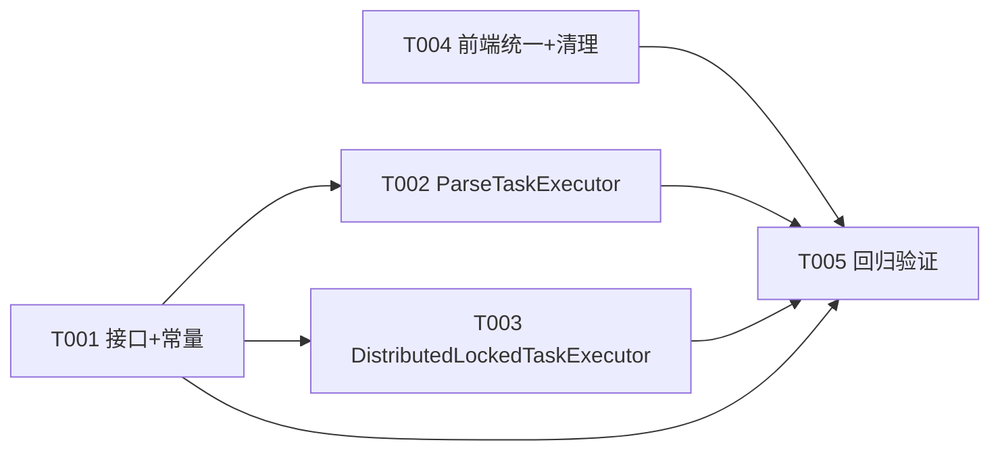

# 解析状态口径统一任务规划

> 功能标识：`parse-status-contract-unification`
> 规划模式：`single-file`
> SDD 等级：`S2`
> 来源需求：`spec/features/20260811/解析状态口径统一-需求说明书.md`
> 来源技术设计：`spec/features/20260811/解析状态口径统一-技术设计说明书.md`
> 文档状态：pending
> 创建日期：2026-08-11
> 更新日期：2026-08-11
> 实现确认状态：`pending`

## 1. 任务概览

- 总任务数：5
- 核心路径：T001 -> T002 -> T005；T001 -> T003 -> T005；T004 -> T005
- 风险任务：T005（历史脏数据回归验证）
- 阻塞任务：无
- 可并行分组：T001 与 T004 可并行（无文件冲突、无依赖）；T002 与 T003 可并行（都依赖 T001，但修改不同文件）
- Mock/临时实现闭环：无
- 可运行服务闭环：无
- DDL/数据结构任务：无
- 运行初始化 DML/Seed 任务：无
- 数据设计与治理任务：无
- 拆分评估：未命中，任务数少且单一交付边界，使用 V1 单文件

### 1.1 任务依赖图

## 2. 实现确认门禁

- 状态：等待用户确认
- 规划产物不等于实现授权。
- 生成本任务规划文档后必须暂停，等待用户确认后才能进入业务代码实现。
- 用户确认执行且未指定任务 ID 时，默认执行全部未完成任务。
- 用户指定任务 ID 时，例如 `执行 T001,T002`，只执行指定任务。
- 不明确指令，例如 `看看`、`下一步是什么`、`继续看`，不得视为实现确认。
- 实现确认状态：`pending`

## 3. 任务列表

任务按依赖顺序排列。每个实现任务默认按 RED -> GREEN -> REFACTOR 执行，不再单独生成"编写单元测试"任务。

- [ ] T001 [P] TaskExecutionPort 新增 onTerminalFailure 回调方法 + ParseApplicationService 补齐 RUNNING/FAILED 状态常量
  - 通俗解释: 为任务执行器接口增加"终态失败回调"能力，让执行器在任务最终失败时有机会更新业务级状态；同时在解析应用服务中补齐 RUNNING 和 FAILED 两个状态常量，统一 parseStatus 五态口径。
  - AC: AC-001, AC-003
  - 来源: 技术设计说明书 §4.1.1、§4.1.3、§4.2 BR-001
  - Files: fons4ai-rag2okf-service/src/main/java/com/fons/cloud/ai/rag2okf/common/dto/TaskExecutionPort.java; fons4ai-rag2okf-service/src/main/java/com/fons/cloud/ai/rag2okf/application/parsing/ParseApplicationService.java
  - Depends: 无
  - Verification: 给定 TaskExecutionPort 接口，when 编译项目，then 新增的 `default void onTerminalFailure(ProcessingTask task, String errorCode, String errorMessage)` 方法编译通过且默认空实现。给定 ParseApplicationService，when 检查状态常量，then 存在 PARSE_STATUS_NOT_STARTED、PARSE_STATUS_QUEUED、PARSE_STATUS_RUNNING、PARSE_STATUS_SUCCEEDED、PARSE_STATUS_FAILED 五个常量。
  - Quality: 确认 onTerminalFailure 方法有完整 Javadoc 注释说明调用时机和默认行为；确认状态常量命名与现有 PARSE_STATUS_QUEUED、PARSE_STATUS_NOT_STARTED 风格一致；DDD-lite 检查：状态常量归属应用服务合理（不放入领域对象）；确认不使用全限定类名。
  - 专业工作流: 无
  - Done: TaskExecutionPort 新增 onTerminalFailure default 方法且有 Javadoc；ParseApplicationService 新增 PARSE_STATUS_RUNNING 和 PARSE_STATUS_FAILED 常量；mvn compile 通过。

- [ ] T002 ParseTaskExecutor 补齐 RUNNING 写入 + 实现 onTerminalFailure 写 FAILED
  - 通俗解释: 解析任务开始执行时将文档解析状态更新为"执行中"（RUNNING），任务最终失败时通过回调将文档解析状态更新为"处理失败"（FAILED），确保前端轮询有正确的状态依据。
  - AC: AC-002, AC-003
  - 来源: 技术设计说明书 §4.1.3、§4.3
  - Files: fons4ai-rag2okf-service/src/main/java/com/fons/cloud/ai/rag2okf/infrastructure/task/ParseTaskExecutor.java; fons4ai-rag2okf-service/src/test/java/com/fons/cloud/ai/rag2okf/infrastructure/task/ParseTaskExecutorTest.java
  - Depends: T001
  - Verification: 给定 parseStatus = QUEUED 的文档和已创建的解析任务，when ParseTaskExecutor.execute() 被调用，then 文档 parseStatus 更新为 RUNNING（通过 mock sourceDocumentDomainService 验证 setParseStatus("RUNNING") 被调用）。给定 parseStatus = RUNNING 的文档，when onTerminalFailure(task, "PARSE_ARTIFACT_ERROR", "msg") 被调用，then 文档 parseStatus 更新为 FAILED。给定 execute() 中 markParseRunning 抛异常，then 异常被捕获记录 WARN 日志且解析继续执行不中断。
  - Quality: 确认 markParseRunning 和 onTerminalFailure 通过 self 代理调用（@Lazy 自引用）使 @Transactional 生效，与现有 persistParseResult 模式一致；确认 markParseRunning 在 payload 反序列化成功后调用（需要 sourceDocumentId）；确认 onTerminalFailure 中 sourceDocumentId 为 null 时安全返回；方法长度不超过 15 行；DDD-lite 检查：状态更新归属执行器合理（执行器负责业务级状态同步）；确认状态口径使用 ParseApplicationService 的常量而非硬编码字符串。
  - 专业工作流: 无
  - Done: ParseTaskExecutor.execute() 开头调用 self.markParseRunning()；ParseTaskExecutor 覆写 onTerminalFailure 更新 parseStatus = FAILED；markParseRunning 和 onTerminalFailure 有 @Transactional 注解；单元测试覆盖 RUNNING 写入、FAILED 写入、异常不中断三个场景；mvn test 通过。

- [ ] T003 DistributedLockedTaskExecutor 终态失败时调用 onTerminalFailure 回调
  - 通俗解释: 任务调度执行器在任务最终失败（达到最大重试次数或不可重试致命错误）时，通知业务执行器更新业务级状态，确保 parseStatus 在任务终态失败时正确流转为 FAILED。
  - AC: AC-003
  - 来源: 技术设计说明书 §4.1.2、§6 异常与错误码
  - Files: fons4ai-rag2okf-service/src/main/java/com/fons/cloud/ai/rag2okf/infrastructure/task/DistributedLockedTaskExecutor.java; fons4ai-rag2okf-service/src/test/java/com/fons/cloud/ai/rag2okf/infrastructure/task/DistributedLockedTaskExecutorTest.java
  - Depends: T001
  - Verification: 给定 RetryableFailure 结果且 attempt >= maxAttempts，when executeLocked 执行状态更新，then port.onTerminalFailure 被调用且参数包含 errorCode 和 errorMessage。给定 FatalFailure 结果，when executeLocked 执行状态更新，then port.onTerminalFailure 被调用。给定 RetryableFailure 结果且 attempt < maxAttempts（willRetry=true），then port.onTerminalFailure 不被调用。给定 onTerminalFailure 抛异常，then 异常被捕获记录 WARN 日志且 taskApplicationService.updateTask 仍被调用。
  - Quality: 确认回调在 updateTask 之前调用（任务状态已在内存中标记为终态）；确认回调异常 try-catch 不影响任务状态持久化；确认 NO_EXECUTOR 场景也调用回调；确认 Succeeded 不调用回调；DDD-lite 检查：DistributedLockedTaskExecutor 仅负责调用回调，不耦合文档解析状态；方法长度和命名合理。
  - 专业工作流: 无
  - Done: executeLocked 中 markRetryableFailure willRetry=false 时调用 port.onTerminalFailure；markFailed 时调用 port.onTerminalFailure；回调异常 try-catch 记录 WARN；单元测试覆盖 willRetry=false、FatalFailure、willRetry=true、回调异常四个场景；mvn test 通过。

- [ ] T004 [P] 前端 isParseActive 统一为 QUEUED || RUNNING + mock 清理 PENDING
  - 通俗解释: 前端轮询依据统一为文档解析状态字段，仅在"已入队"和"执行中"时轮询；清理模拟数据中后端不存在的 PENDING 状态值，统一为 NOT_STARTED。
  - AC: AC-004, AC-006
  - 来源: 技术设计说明书 §4.1.4、§4.1.5
  - Files: fons4ai-rag2okf-ui/src/views/documents/DocumentDetailView.vue; fons4ai-rag2okf-ui/src/api/mock/documents.ts; fons4ai-rag2okf-ui/src/views/documents/__tests__/DocumentDetailView.spec.ts
  - Depends: 无
  - Verification: 给定 parseStatus = QUEUED，when 检查 isParseActive，then 返回 true。给定 parseStatus = RUNNING，when 检查 isParseActive，then 返回 true。给定 parseStatus = NOT_STARTED/SUCCEEDED/FAILED，when 检查 isParseActive，then 返回 false。给定 mock 上传文档，when 检查返回的 parseStatus，then 为 NOT_STARTED（非 PENDING）。全局搜索前端 src 目录，确认无 'PENDING' 字符串出现在 parseStatus 相关代码中。
  - Quality: 确认 isParseActive 注释同步更新（去掉 PENDING 描述）；确认 mock 中 mockUploadDocument、mockBatchUploadDocuments、mockUpdateDocumentFile 三处动态写入和 doc-demo-004 静态种子的 PENDING 全部改为 NOT_STARTED；确认测试中 isParseActive 的 QUEUED 和 RUNNING 用例存在；DDD-lite 检查：isParseActive 逻辑简洁，无多余状态判断。
  - 专业工作流: 无
  - Done: DocumentDetailView.vue isParseActive 改为 `QUEUED || RUNNING`；mock/documents.ts 中所有 PENDING 改为 NOT_STARTED；DocumentDetailView.spec.ts 补充 QUEUED 和 RUNNING 的 isParseActive 测试用例；npm run test:unit 通过。

- [ ] T005 全量回归验证
  - 通俗解释: 确保前后端所有现有测试通过，状态口径统一改造不引入回归。
  - AC: AC-001, AC-002, AC-003, AC-004, AC-005, AC-006
  - 来源: 技术设计说明书 §7.1
  - Files: 无
  - Depends: T001, T002, T003, T004
  - Verification: 给定全部任务已完成，when 执行后端 mvn test，then 所有测试通过。给定全部任务已完成，when 执行前端 npm run test:unit，then 所有测试通过。给定代码库，when 全局搜索 parseStatus 的所有写入点（后端 setParseStatus + 前端 parseStatus =），then 仅使用 NOT_STARTED、QUEUED、RUNNING、SUCCEEDED、FAILED 五种值。给定前端代码，when 全局搜索 'PENDING'，then 无结果。
  - Quality: 确认回归覆盖后端 ParseTaskExecutor、DistributedLockedTaskExecutor、ParseApplicationService 相关测试；确认回归覆盖前端 DocumentDetailView、mock/documents.ts、formatters.ts 相关测试；确认状态口径全局一致性；DDD-lite/领域建模检查：确认 parseStatus 状态流转不破坏 ProcessingTask 现有状态机，确认 onTerminalFailure 回调不引入领域对象职责越界。
  - 专业工作流: 无
  - Done: 后端 mvn test 全部通过；前端 npm run test:unit 全部通过；全局搜索确认 parseStatus 仅含五态、前端无 PENDING。

## 4. AC 追踪表

| AC | 覆盖任务 | 验证方式 |
| --- | --- | --- |
| AC-001 | T001, T005 | 运行 T001 的 mvn compile 确认常量齐备；T005 全局搜索确认 parseStatus 仅含五态 |
| AC-002 | T002, T005 | 运行 T002 的单元测试验证 execute() 后 parseStatus = RUNNING |
| AC-003 | T001, T002, T003, T005 | 运行 T002/T003 的单元测试验证终态失败时 parseStatus = FAILED |
| AC-004 | T004, T005 | 运行 T004 的单元测试验证 isParseActive 对各状态的返回值 |
| AC-005 | T004, T005 | 运行 T004 中 DocumentDetailView.spec.ts 的 FAILED 场景验证失败显示和重试按钮 |
| AC-006 | T004, T005 | 运行 T005 全局搜索确认前端无 PENDING |

## 5. 按需任务

以下章节只在技术设计说明书明确触发时生成。

### 5.6 S2 风险与回归任务

SDD 等级为 S2，风险任务已纳入 §3 任务列表的 T005 全量回归验证。风险对照表：

| 风险 | 对应任务 | 验证方式 |
| --- | --- | --- |
| TaskExecutionPort 接口变更影响其他执行器 | T001 | default 方法编译兼容性检查 |
| onTerminalFailure 回调异常影响任务状态持久化 | T003 | 单元测试：回调抛异常时 updateTask 仍被调用 |
| markParseRunning 异常中断解析 | T002 | 单元测试：markParseRunning 抛异常时解析继续执行 |
| 前端 PENDING 清理遗漏 | T004 | 全局搜索确认无 PENDING |
| 历史脏数据（QUEUED 但实际已失败） | T005 | 记录为已知风险，由兜底扫描自然修复 |

### 5.7 页面/交互型交付物设计确认

技术设计说明书已将"页面/交互型交付物"标记为"否"，本次改造不涉及页面布局、信息架构、操作流或视觉设计变化，仅调整 isParseActive 判断逻辑（去掉 PENDING）和清理 mock 数据。用户跳过 UI 设计确认，决策证据记录于此。
