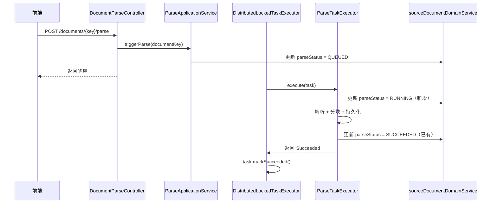
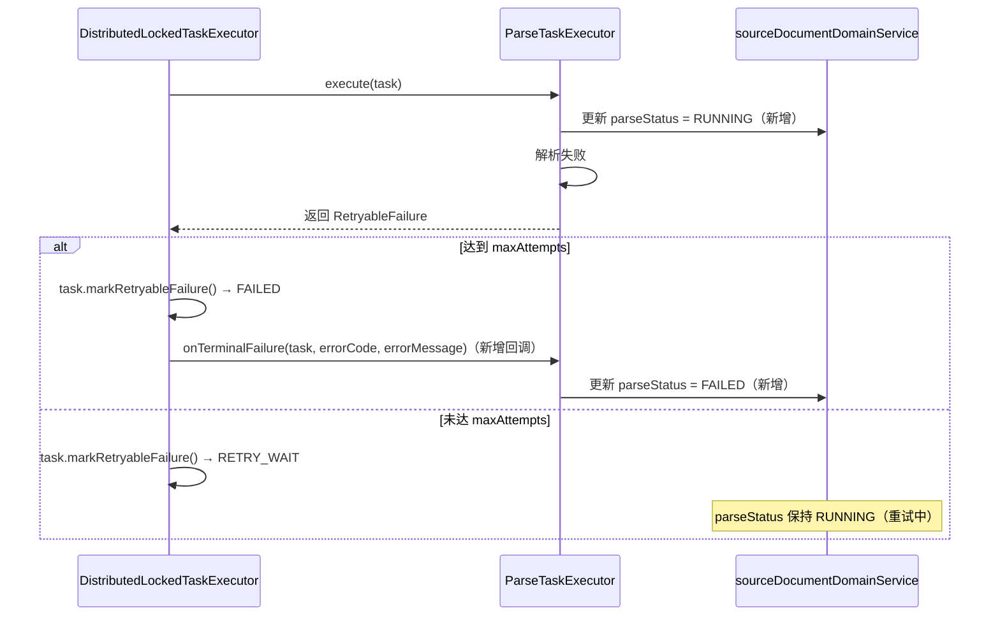
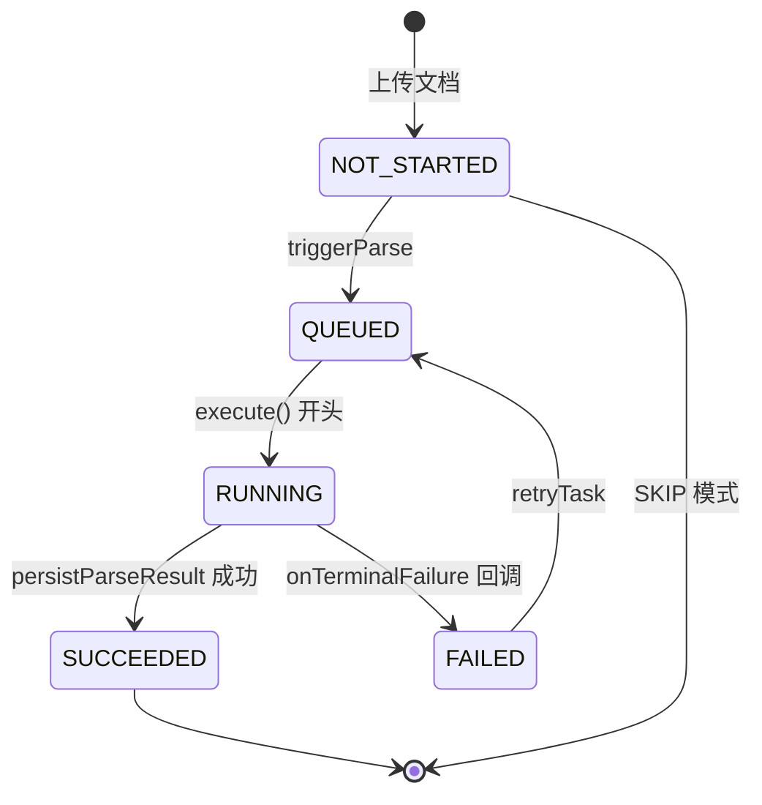

# 解析状态口径统一技术设计说明书

> 功能标识：`parse-status-contract-unification`
> SDD 等级：`S2`
> 来源需求：`spec/features/20260811/解析状态口径统一-需求说明书.md`
> 文档状态：已确认
> 设计确认状态：`approved`
> 创建日期：2026-08-11
> 更新日期：2026-08-11
>
> **更新时间维护规则**：任何正文修改必须同步更新 `更新日期`，并在版本修订记录中追加说明。

## 1. 设计摘要与关键决策

- 功能目标：将文档解析状态（parseStatus）从当前三态（NOT_STARTED、QUEUED、SUCCEEDED）统一为五态（NOT_STARTED、QUEUED、RUNNING、SUCCEEDED、FAILED），后端补齐 RUNNING 和 FAILED 的写入时机，前端轮询依据统一为 parseStatus 字段，清理无效状态值 PENDING。对应 REQ-001~REQ-006 / AC-001~AC-006。
- 设计范围：后端任务执行器（DistributedLockedTaskExecutor、ParseTaskExecutor）、后端任务执行端口契约（TaskExecutionPort）、后端解析应用服务（ParseApplicationService）、前端文档详情页（DocumentDetailView）、前端模拟数据（mock/documents.ts）、前端测试。
- 非目标：不改变任务状态机本身（QUEUED→RUNNING→SUCCEEDED/RETRY_WAIT/FAILED 保持不变）；不新增数据库表或字段；不改变前端轮询间隔和页面生命周期管理（由"任务调度与轮询优化"feature 负责）。
- SDD 等级理由：涉及公共契约变更（TaskExecutionPort 接口新增方法）、前后端跨模块状态语义统一、需要回归测试确保现有执行器不受影响，属于公共契约变更和跨核心模块改造，回滚需要前后端协同。
- 交付画像：混合（后端服务 + 前端应用）
- 独立可运行服务：否，原因：改造现有 Spring Boot 服务内部逻辑，不新增独立服务
- 页面/交互型交付物：否，原因：仅调整 isParseActive 判断逻辑和清理 mock 数据，不涉及页面布局、信息架构或交互流变化
- 数据结构变更：否，原因：不新增表/字段/索引，仅统一已有字段的枚举值
- 规划建议：V1 单文件，原因：任务数少（5 个）、单一交付边界、无需分批评审

### 1.1 关键决策

| 决策 | 选择 | 原因 | 替代方案 | 影响 | 需用户确认 |
| --- | --- | --- | --- | --- | --- |
| D-001 RUNNING 写入位置 | ParseTaskExecutor.execute() 开头通过 self.markParseRunning() 写入 | DistributedLockedTaskExecutor 是通用执行器，不应耦合文档解析状态；ParseTaskExecutor 负责业务级状态更新符合职责分离 | A) DistributedLockedTaskExecutor 在 markRunning 后写 parseStatus（耦合业务状态，违反职责分离）；B) 通过 Spring 事件通知（引入异步复杂性，不必要） | ParseTaskExecutor 新增 markParseRunning 方法 | 否 |
| D-002 FAILED 写入机制 | TaskExecutionPort 新增 onTerminalFailure default 方法，DistributedLockedTaskExecutor 在终态失败时调用 | ParseTaskExecutor 只返回 RetryableFailure/FatalFailure，最终是否转为 FAILED 由 DistributedLockedTaskExecutor 决定（取决于 maxAttempts）；ParseTaskExecutor 无法在 catch 块中判断是否达到最大重试次数 | A) ParseTaskExecutor 在 catch 块中判断 attempt >= maxAttempts（耦合重试逻辑，不可靠）；B) Spring 事件通知（引入异步复杂性） | TaskExecutionPort 接口新增 default 方法（公共契约变更，S2）；DistributedLockedTaskExecutor 新增回调调用 | 否 |
| D-003 RETRY_WAIT 时 parseStatus | 保持 RUNNING，onTerminalFailure 仅在终态 FAILED 时调用 | 从用户视角看，解析仍在进行中（退避重试中），前端应继续轮询；如果 RETRY_WAIT 时改为 QUEUED 会导致前端先停止再重新启动轮询，体验不佳 | RETRY_WAIT 时改回 QUEUED（轮询中断后恢复，体验不佳） | 无需额外代码，自然行为 | 否 |
| D-004 前端 PENDING 改造方向 | 改为 NOT_STARTED | 后端 DocumentApplicationService 上传后设置 parseStatus = NOT_STARTED，PENDING 是前端自创的状态值；上传后未触发解析前应与后端口径一致 | 改为 QUEUED（语义错误，QUEUED 表示已触发解析等待执行） | mock 数据和测试更新 | 否 |

### 1.2 设计确认 Gate

- Gate 是否适用：是，原因：S2 公共契约变更（TaskExecutionPort 接口扩展）
- 设计确认状态：`approved`
- 用户需确认的关键点：五态枚举口径、RUNNING/FAILED 写入时机、onTerminalFailure 回调设计
- 确认证据：用户在需求澄清中已确认前端轮询依赖 parseStatus 字段，轮询触发值为 QUEUED/RUNNING，终态值停止轮询；设计方案基于已确认需求生成，关键决策已记录于 §1.1

## 2. 系统边界、模块与调用链

### 2.1 模块与职责

| 模块/组件 | 职责 | 输入 | 输出 | 依赖 | 影响 AC |
| --- | --- | --- | --- | --- | --- |
| DistributedLockedTaskExecutor | 通用任务执行器，管理任务状态机和重试 | ProcessingTask | 任务终态 + onTerminalFailure 回调调用 | TaskExecutionPort | AC-003 |
| ParseTaskExecutor | 解析任务执行器，负责解析+分块+业务级状态同步 | ProcessingTask（含 sourceDocumentId） | parseStatus 流转 + TaskExecutionResult | sourceDocumentDomainService | AC-002, AC-003 |
| TaskExecutionPort | 任务执行端口契约 | ProcessingTask | TaskExecutionResult + 终态失败回调 | 无 | AC-001, AC-003 |
| ParseApplicationService | 解析应用服务，持有 parseStatus 状态常量 | 解析触发请求 | parseStatus = QUEUED | 无 | AC-001 |
| DocumentDetailView | 前端文档详情页 | document.parseStatus | isParseActive / isParseFailed | 无 | AC-004, AC-005 |
| mock/documents.ts | 前端模拟数据 | 无 | 文档列表（含 parseStatus） | 无 | AC-006 |

- 涉及入口：DocumentParseController（解析触发）、DocumentDetailView（前端页面）
- 涉及领域对象：ProcessingTask（任务领域模型，状态流转不变）、KbSourceDocumentEntity（文档实体，parseStatus 字段）
- 涉及数据访问：KbSourceDocumentEntity（通过 sourceDocumentDomainService 更新 parseStatus）
- 外部依赖：无新增

### 2.2 调用链、服务形态与运行态设计

- 启动入口：不适用，原因：本次改造不新增独立可运行服务，仅调整现有 Spring Boot 服务内部的状态写入逻辑和前端轮询依据
- 配置来源：不适用
- 注册发现与路由：不适用
- 健康检查与核心运行验证：不适用

调用链路（解析成功路径）：



调用链路（解析失败终态路径）：



> RUNNING 由 ParseTaskExecutor.execute() 开头直接写入；FAILED 由 DistributedLockedTaskExecutor 在终态失败时通过 onTerminalFailure 回调驱动写入。RETRY_WAIT 时 parseStatus 保持 RUNNING（从用户角度看解析仍在进行中）。

## 3. 接口、消息与外部契约

只记录新增或变更契约。

### 3.1 契约清单

| 契约 | 类型 | 标识/路径 | 鉴权 | 兼容策略 | 错误处理 | AC |
| --- | --- | --- | --- | --- | --- | --- |
| 查询文档 | HTTP | GET /documents/{documentKey} | 知识库用户权限 | 新增 RUNNING 和 FAILED 两个值，前端需同步适配；旧前端遇到 RUNNING 走 isParseActive=false 分支（不轮询），遇到 FAILED 走 isParseFailed=false 分支（不显示失败），属于降级行为而非崩溃 | 无新增错误码 | AC-001, AC-004 |
| 任务终态失败回调 | 内部接口 | TaskExecutionPort.onTerminalFailure | 内部接口，仅由 DistributedLockedTaskExecutor 在分布式锁内调用 | 新增 default 方法，现有实现类无需修改即可编译 | 回调内异常捕获并记录 WARN 日志，不影响任务状态持久化 | AC-003 |

### 3.2 详细契约

#### 查询文档

- 路径/标识：`GET /documents/{documentKey}`
- 鉴权要求：知识库用户权限
- 响应字段 `parseStatus` 取值变更：从三态（NOT_STARTED、QUEUED、SUCCEEDED）扩展为五态（NOT_STARTED、QUEUED、RUNNING、SUCCEEDED、FAILED）
- 兼容性：新增 RUNNING 和 FAILED 两个值，前端需同步适配；旧前端遇到 RUNNING 会走 isParseActive=false 分支（不轮询），遇到 FAILED 会走 isParseFailed=false 分支（不显示失败），属于降级行为而非崩溃
- 错误码：无新增
- 契约文件：无

#### 任务终态失败回调

- 路径/标识：`TaskExecutionPort.onTerminalFailure(ProcessingTask task, String errorCode, String errorMessage)`
- 鉴权要求：内部接口，仅由 DistributedLockedTaskExecutor 在分布式锁内调用
- 调用时机：任务最终失败时（markRetryableFailure 返回 willRetry=false 或 markFailed 时）
- 默认实现：空方法（不破坏其他执行器，如未来的 PublishTaskExecutor）
- 兼容性：新增 default 方法，现有实现类无需修改即可编译
- 契约文件：无

## 4. 核心业务、领域规则与状态流转

### 4.1 核心流程

#### 4.1.1 TaskExecutionPort 接口新增 onTerminalFailure 回调

- 触发条件：任务最终失败（达到最大重试次数或不可重试致命错误）
- 输入：ProcessingTask（含 taskKey、sourceDocumentId）、errorCode、errorMessage
- 处理步骤：
  1. 在 TaskExecutionPort 接口新增 `default void onTerminalFailure(ProcessingTask task, String errorCode, String errorMessage) {}`
  2. 默认空实现，不影响其他执行器（如未来的 PublishTaskExecutor）
  3. ParseTaskExecutor 覆写该方法，更新 parseStatus = FAILED
- 输出：业务级状态更新（parseStatus = FAILED）
- 异常分支：回调内异常不影响任务状态机（任务已为终态 FAILED，回滚不需要）
- 幂等要求：onTerminalFailure 可能被多次调用（如 recoverStale 后再次失败），parseStatus = FAILED 是幂等的

```text
// TaskExecutionPort 接口变更
public interface TaskExecutionPort {
    TaskType supportedType();
    TaskExecutionResult execute(ProcessingTask task);

    /**
     * 任务终态失败回调。
     * 当任务达到最大重试次数或发生不可重试错误时，由 DistributedLockedTaskExecutor 调用。
     * 执行器可在此更新业务级状态（如文档解析状态）。
     * 默认空实现，不影响其他执行器。
     */
    default void onTerminalFailure(ProcessingTask task, String errorCode, String errorMessage) {
        // 默认空实现
    }
}
```

> 新增 default 方法不破坏现有实现类，符合 Java 8+ 接口兼容性原则。

#### 4.1.2 DistributedLockedTaskExecutor 在终态失败时调用回调

- 触发条件：任务状态流转至终态 FAILED
- 输入：ProcessingTask、TaskExecutionResult
- 处理步骤：
  1. 在 `markRetryableFailure` 返回 `willRetry=false`（达到 maxAttempts）时，调用 `port.onTerminalFailure(task, r.errorCode(), r.errorMessage())`
  2. 在 `markFailed`（FatalFailure）时，调用 `port.onTerminalFailure(task, f.errorCode(), f.errorMessage())`
  3. 在 `markFailed`（NO_EXECUTOR）时，调用 `port.onTerminalFailure(task, "NO_EXECUTOR", ...)`
  4. RETRY_WAIT 和 SUCCEEDED 不调用回调
- 输出：执行器通过回调更新业务级状态
- 异常分支：回调内异常捕获并记录 WARN 日志，不影响任务状态持久化
- 幂等要求：回调在状态已持久化为 FAILED 后调用，异常不影响终态

```text
// DistributedLockedTaskExecutor.executeLocked 改造伪代码（状态更新部分）
switch (result) {
    case TaskExecutionResult.Succeeded s -> {
        task.markSucceeded(completedAt);
    }
    case TaskExecutionResult.RetryableFailure r -> {
        boolean willRetry = task.markRetryableFailure(r.errorCode(), r.errorMessage(), completedAt);
        if (!willRetry) {
            // 达到最大重试次数，终态 FAILED → 调用回调
            try {
                port.onTerminalFailure(task, r.errorCode(), r.errorMessage());
            } catch (Exception e) {
                log.warn("onTerminalFailure callback failed: taskKey={}", taskKey, e);
            }
        }
    }
    case TaskExecutionResult.FatalFailure f -> {
        task.markFailed(f.errorCode(), f.errorMessage(), completedAt);
        // 不可重试致命错误 → 调用回调
        try {
            port.onTerminalFailure(task, f.errorCode(), f.errorMessage());
        } catch (Exception e) {
            log.warn("onTerminalFailure callback failed: taskKey={}", taskKey, e);
        }
    }
}
taskApplicationService.updateTask(task);
```

> 回调在 updateTask 之前调用，确保任务状态已在内存中标记为 FAILED；回调异常不影响 updateTask 持久化。

#### 4.1.3 ParseTaskExecutor 补齐 RUNNING 和 FAILED 写入

- 触发条件：execute() 开始执行 / onTerminalFailure 回调
- 输入：ProcessingTask（含 sourceDocumentId）
- 处理步骤：
  1. execute() 方法开头（payload 反序列化成功后），通过 self 代理调用 `markParseRunning(payload.sourceDocumentId())` 更新 parseStatus = RUNNING
  2. persistParseResult 成功时设置 parseStatus = SUCCEEDED（已有逻辑，不变）
  3. onTerminalFailure 回调中，通过 self 代理调用 `markParseFailed(task.entity().getSourceDocumentId(), errorCode, errorMessage)` 更新 parseStatus = FAILED
- 输出：parseStatus 正确流转
- 异常分支：markParseRunning 失败时记录 WARN 日志但不中断解析（parseStatus 更新失败不应阻塞任务执行）；markParseFailed 失败时记录 WARN 日志（任务已终态，不影响一致性）
- 幂等要求：parseStatus 更新为幂等操作

```text
// ParseTaskExecutor 改造伪代码

@Override
public TaskExecutionResult execute(ProcessingTask task) {
    ParseTaskPayload payload;
    try {
        payload = objectMapper.readValue(task.entity().getPayloadJson(), ParseTaskPayload.class);
    } catch (Exception e) {
        // payload 反序列化失败为 FatalFailure，此时无法获取 sourceDocumentId
        return new TaskExecutionResult.FatalFailure("PAYLOAD_INVALID", "任务输入快照解析失败");
    }

    // 新增：标记解析中
    try {
        self.markParseRunning(payload.sourceDocumentId());
    } catch (Exception e) {
        log.warn("Failed to mark parse running: taskKey={}", task.taskKey(), e);
    }

    // ... 现有解析逻辑不变 ...
}

@Transactional(rollbackFor = Exception.class)
public void markParseRunning(Long sourceDocumentId) {
    KbSourceDocumentEntity document = sourceDocumentDomainService.getById(sourceDocumentId);
    if (document != null) {
        document.setParseStatus("RUNNING");
        sourceDocumentDomainService.updateById(document);
    }
}

@Override
@Transactional(rollbackFor = Exception.class)
public void onTerminalFailure(ProcessingTask task, String errorCode, String errorMessage) {
    Long sourceDocumentId = task.entity().getSourceDocumentId();
    if (sourceDocumentId == null) return;
    KbSourceDocumentEntity document = sourceDocumentDomainService.getById(sourceDocumentId);
    if (document != null) {
        document.setParseStatus("FAILED");
        sourceDocumentDomainService.updateById(document);
    }
    log.warn("Parse task terminal failure: taskKey={}, errorCode={}", task.taskKey(), errorCode);
}
```

> markParseRunning 和 onTerminalFailure 通过 self 代理调用（@Lazy 自引用），确保 @Transactional 生效。与现有 persistParseResult 模式一致。

#### 4.1.4 前端 isParseActive 统一为 QUEUED || RUNNING

- 触发条件：进入文档详情页 / 轮询刷新
- 输入：document.parseStatus
- 处理步骤：
  1. isParseActive 去掉 PENDING，改为 `status === 'QUEUED' || status === 'RUNNING'`
  2. isParseFailed 保持 `status === 'FAILED'`（不变）
  3. 状态标签映射（formatters.ts PARSE_STATUS_LABELS）已有五态映射，无需修改
  4. DocumentStatusRail.vue 内部 label() 已有五态映射，无需修改
- 输出：前端轮询依据统一为 QUEUED 和 RUNNING
- 异常分支：无
- 幂等要求：无

```text
// DocumentDetailView.vue isParseActive 改造
const isParseActive = computed(() => {
  const status = document.value?.parseStatus
  return status === 'QUEUED' || status === 'RUNNING'  // 去掉 PENDING
})
```

#### 4.1.5 前端模拟数据清理 PENDING

- 触发条件：无（代码修改）
- 输入：无
- 处理步骤：
  1. mock/documents.ts 中静态种子数据 doc-demo-004 的 `parseStatus: 'PENDING'` 改为 `'NOT_STARTED'`（上传后未触发解析前应为 NOT_STARTED）
  2. mockUploadDocument、mockBatchUploadDocuments、mockUpdateDocumentFile 中 `parseStatus: parseMode === 'SKIP' ? 'NOT_STARTED' : 'PENDING'` 改为 `'NOT_STARTED'`（上传后未触发解析前统一为 NOT_STARTED，触发解析后由 mockTriggerParse 设为 QUEUED）
  3. 检查所有测试文件中对 PENDING 的依赖，如有则更新为 NOT_STARTED 或 QUEUED
- 输出：前端代码和模拟数据中不再出现 PENDING 值
- 异常分支：无
- 幂等要求：无

```text
// mock/documents.ts 改造
// 静态种子
{ documentKey: 'doc-demo-004', parseStatus: 'NOT_STARTED', ... }  // PENDING → NOT_STARTED

// 动态写入
parseStatus: 'NOT_STARTED'  // 上传后统一为 NOT_STARTED（去掉 PENDING 三元分支）
```

> PENDING 是前端模拟数据中自创的状态值，后端从未产生。上传后未触发解析前的正确状态是 NOT_STARTED（与后端 DocumentApplicationService 一致）。

### 4.2 规则落地

| 业务规则/行为 | 归属模块或对象 | 数据依赖 | 事务边界 | 扩展点 | 验证方式 |
| --- | --- | --- | --- | --- | --- |
| BR-001 parseStatus 五态枚举 | ParseApplicationService | 无 | 无 | 定义 PARSE_STATUS_NOT_STARTED、PARSE_STATUS_QUEUED、PARSE_STATUS_RUNNING、PARSE_STATUS_SUCCEEDED、PARSE_STATUS_FAILED 常量 | 单元测试：验证所有 parseStatus 写入点使用五态之一 |
| BR-002 解析开始写 RUNNING | ParseTaskExecutor | KbSourceDocumentEntity | markParseRunning 方法事务 | 无 | 单元测试：execute 调用后验证 parseStatus = RUNNING |
| BR-003 终态失败写 FAILED | ParseTaskExecutor | KbSourceDocumentEntity | onTerminalFailure 方法事务 | onTerminalFailure 回调 | 单元测试：onTerminalFailure 调用后验证 parseStatus = FAILED |
| BR-004 RETRY_WAIT 保持 RUNNING | ParseTaskExecutor | 无 | 无 | onTerminalFailure 仅在终态 FAILED 时调用 | 单元测试：markRetryableFailure willRetry=true 时不调用 onTerminalFailure |
| BR-005 前端轮询依据统一 | DocumentDetailView | document.parseStatus | 无 | isParseActive 计算属性 | 单元测试：验证各状态下 isParseActive 的返回值 |
| BR-006 清理 PENDING | mock/documents.ts | 无 | 无 | 无 | 单元测试：验证 mock 数据中无 PENDING |
| BR-007 回调不影响任务状态机 | DistributedLockedTaskExecutor | 无 | 回调异常 try-catch | 无 | 单元测试：回调抛异常时任务状态仍正确持久化 |

- DDD-lite 判断：本次改造以应用服务编排和基础设施回调为主，不新增领域对象。
- 核心领域对象：ProcessingTask（已有，状态流转不变）、KbSourceDocumentEntity（已有，parseStatus 字段枚举值扩展）。
- 应用服务职责：ParseTaskExecutor 新增 markParseRunning 和 onTerminalFailure 方法。
- 贫血模型例外：不适用，ProcessingTask 已有丰富的状态流转方法（markRunning、markSucceeded、markRetryableFailure、markFailed）。
- 基础设施依赖边界：TaskExecutionPort 接口扩展为 Spring 内置接口机制，不引入新依赖。

### 4.3 状态流转

本次不改变任务状态机本身（QUEUED→RUNNING→SUCCEEDED/RETRY_WAIT/FAILED 保持不变），仅新增 parseStatus 的状态流转触发路径。

| 当前状态 | 触发动作 | 前置条件 | 目标状态 | 失败处理 | 幂等 |
| --- | --- | --- | --- | --- | --- |
| NOT_STARTED | triggerParse | 用户触发解析 | QUEUED | 已有逻辑，不变 | 已有幂等键 |
| QUEUED | ParseTaskExecutor.execute() 开头 | 任务开始执行 | RUNNING | 更新失败记录 WARN，不中断解析 | 幂等 |
| RUNNING | persistParseResult 成功 | 解析+分块成功 | SUCCEEDED | 已有逻辑，不变 | 幂等 |
| RUNNING | onTerminalFailure 回调 | 任务终态 FAILED | FAILED | 更新失败记录 WARN | 幂等 |
| FAILED | retryTask | 用户再次解析 | QUEUED | 已有逻辑，不变 | 已有幂等键 |

parseStatus 与 task.status 的对应关系：

| task.status | parseStatus | 说明 |
| --- | --- | --- |
| QUEUED | QUEUED | 任务已入队，文档解析状态同步 |
| RUNNING | RUNNING | 任务执行中，文档解析状态同步 |
| RETRY_WAIT | RUNNING | 任务退避等待中，文档解析状态保持 RUNNING（用户视角解析仍在进行） |
| SUCCEEDED | SUCCEEDED | 任务成功，文档解析状态同步 |
| FAILED | FAILED | 任务终态失败，文档解析状态同步 |

> RETRY_WAIT 时 parseStatus 保持 RUNNING 是设计决策：从用户视角看，解析仍在进行中（只是暂时退避重试），前端应继续轮询。



## 5. 数据结构、迁移与初始化

### 5.1 数据影响判断

| 检查项 | 是否涉及 | 设计结论 |
| --- | --- | --- |
| 持久化数据或数据服务结构 | 否 | 不新增表/字段/索引，仅统一已有字段 parseStatus 的枚举值 |
| 外部数据入库、出库、同步、对账或报表 | 否 | 不涉及 |
| 字段映射、金额、日期、状态、流水号或客户标识 | 否 | 不涉及，仅扩展状态枚举值 |
| 敏感数据、权限、脱敏、加密、审计或保留期限 | 否 | 不涉及 |
| 跨系统、跨服务、跨库或第三方数据流转 | 否 | 不涉及 |

### 5.2 字段映射与数据流

不适用，原因：本次不涉及文件入库、接口入库、数据同步、对账、报表、迁移或跨系统数据流转。

### 5.3 结构变更详设

不适用，原因：本次不涉及新增表、修改表、删除/重命名字段、修改字段类型/默认值/约束、调整索引/唯一约束/外键/分区，或变更 Redis、Elasticsearch、MongoDB、对象存储、消息 Topic 等数据服务结构。

- SQL 当前结构快照：无
- 迁移位置：不适用
- 执行型变更 DDL：不适用
- 回填/清理：不适用
- 回滚：不适用

> 设计阶段不生成可执行 SQL。

### 5.4 运行初始化 DML / Seed 数据

- 是否涉及：否
- 初始化对象：不适用
- 脚本交付路径：不适用
- 执行责任方：不适用
- 占位变量：无
- 幂等与回滚：不适用
- 执行后复核：不适用

### 5.5 数据安全与生命周期

| 检查项 | 设计结论 | 验证方式 |
| --- | --- | --- |
| 传输与存储安全 | 不适用，原因：不改变现有传输安全机制，不涉及存储变更 | 复用现有机制 |
| 展示/日志脱敏 | 不适用，原因：不涉及敏感数据 | 不涉及 |
| 数据权限与审计 | 不适用，原因：复用现有权限校验，任务执行日志保持现有级别 | 复用现有机制 |
| 保留、删除与归档 | 不适用，原因：不涉及 | 不涉及 |

## 6. 横切质量设计

| 主题 | 设计结论 | 验证方式 |
| --- | --- | --- |
| 异常与错误码 | markParseRunning 更新失败记录 WARN 不中断解析（parseStatus 停留 QUEUED，前端仍轮询）；onTerminalFailure 更新失败记录 WARN（任务已终态）；回调异常捕获不影响 updateTask；前端轮询请求失败保持轮询 | 单元测试：回调抛异常时 updateTask 仍被调用；markParseRunning 抛异常时解析继续执行 |
| 鉴权与应用安全 | 复用现有 SaToken 鉴权机制，不新增认证逻辑；onTerminalFailure 为内部回调，仅在分布式锁内由执行器调用，无权限校验需求；parseStatus 更新前检查 document 是否存在 | 复用现有测试 |
| 事务与一致性 | markParseRunning 和 onTerminalFailure 通过 self 代理调用，@Transactional 生效，与现有 persistParseResult 模式一致；parseStatus 更新与任务状态更新不在同一事务中，两者最终一致；onTerminalFailure 在 updateTask 之前调用，确保回调失败不影响任务状态持久化 | 单元测试：事务边界验证 |
| 并发、缓存与消息 | onTerminalFailure 在分布式锁内调用，无并发问题；markParseRunning 在 execute() 内调用，也在分布式锁内；不涉及缓存和 MQ | 分布式锁保证 |
| 性能与限流 | 单次解析任务增加两次轻量级单表更新（markParseRunning、onTerminalFailure），对整体性能无可感知影响；不新增查询，无索引影响 | 性能无可感知变化 |
| 兼容与迁移 | TaskExecutionPort 新增 default 方法，现有实现类无需修改；前端旧版本遇到 RUNNING/FAILED 新值属于降级行为而非崩溃；历史脏数据（QUEUED 但实际已失败）由兜底扫描自然修复 | 回归测试：现有执行器测试全部通过 |
| 日志、指标与追踪 | 回调异常记录 WARN 日志，包含 taskKey 和 errorCode；不新增指标 | 日志级别验证 |

## 7. AC、验证、风险与回滚

### 7.1 AC 设计矩阵

| REQ/AC | 设计落点 | 验证方式 | 风险 | 回滚/降级 |
| --- | --- | --- | --- | --- |
| REQ-001 / AC-001 parseStatus 仅含五态 | D-001, D-004 ParseApplicationService 常量 + 前端清理 PENDING | 全局搜索 parseStatus 写入点，确认仅使用五态 | 低 | 移除常量、恢复 PENDING |
| REQ-002 / AC-002 解析开始写 RUNNING | D-001 ParseTaskExecutor.execute() 开头 markParseRunning | 单元测试：execute() 调用后验证 parseStatus = RUNNING | 低 | 移除 markParseRunning 调用 |
| REQ-003 / AC-003 终态失败写 FAILED | D-002 DistributedLockedTaskExecutor 调用 onTerminalFailure | 单元测试：markRetryableFailure willRetry=false 时验证 onTerminalFailure 被调用且 parseStatus = FAILED | 中 | 移除回调调用 |
| REQ-004 / AC-004 前端轮询依据统一 | D-001 DocumentDetailView isParseActive | 单元测试：isParseActive 对 QUEUED/RUNNING 返回 true，对 NOT_STARTED/SUCCEEDED/FAILED 返回 false | 低 | 恢复 PENDING 判断 |
| REQ-005 / AC-005 失败显示和重试 | D-002 DocumentDetailView FAILED 场景 | 已有测试：DocumentDetailView.spec.ts 中 FAILED 场景验证失败显示和重试按钮 | 低 | 不适用 |
| REQ-006 / AC-006 清理 PENDING | D-004 mock/documents.ts | 全局搜索前端代码确认无 PENDING；mock 测试验证上传后 parseStatus = NOT_STARTED | 低 | 恢复 PENDING |

### 7.2 知识同步影响

- 是否需要知识同步：是
- 影响类型：业务规则（文档域解析状态流转规则）、接口契约（parseStatus 取值扩展）
- 影响位置：文档域（document）的解析状态流转规则、前端轮询依据
- 知识同步方式：实现验证后由 `fons4ai-knowledge-summary` 技能负责更新文档域知识文档和知识卡片，不在 SDD 任务中处理
- SQL/DDL 影响：不涉及持久化结构变化，无需更新 `.specify/sql/` 快照
- Knowledge Sync Needed: yes

### 7.3 风险与回滚

| 风险 | 影响 | 缓解措施 | 回滚方式 |
| --- | --- | --- | --- |
| TaskExecutionPort 接口变更影响其他执行器 | 低 | 新增 default 方法，现有实现类无需修改 | 移除 onTerminalFailure 方法 |
| 历史脏数据（QUEUED 但实际已失败） | 中 | 上线后兜底扫描重新执行，自然流转为 SUCCEEDED 或 FAILED | 无需回滚，自然修复 |
| onTerminalFailure 回调失败导致 parseStatus 停留在 RUNNING | 低 | 兜底扫描 recoverStale 后任务回到 QUEUED，重新执行时正确流转 | 无需回滚，自然修复 |
| 前端旧版本遇到 RUNNING/FAILED 新值 | 低 | 旧前端 isParseActive 不含 RUNNING（不轮询），isParseFailed 已含 FAILED（显示失败）；属于降级行为 | 前后端同步发布 |

## 附录 A. 证据清单

| 关键结论 | 证据来源 | 证据等级 | 状态 |
| --- | --- | --- | --- |
| parseStatus 当前为三态（NOT_STARTED、QUEUED、SUCCEEDED） | 需求说明书背景 + 仓库源码 ParseTaskExecutor | L2 | 已验证 |
| 前端检查 PENDING/RUNNING 但后端不产生 | 需求说明书背景 + 前端源码 DocumentDetailView | L2 | 已验证 |
| TaskExecutionPort 接口新增 default 方法兼容现有实现 | Java 8+ 接口兼容性原则 + 仓库源码 | L2 | 已验证 |
| DistributedLockedTaskExecutor 状态机含 RETRY_WAIT | 仓库源码 DistributedLockedTaskExecutor | L2 | 已验证 |
| ProcessingTask 已有丰富状态流转方法 | 仓库源码 ProcessingTask | L2 | 已验证 |
| 兜底扫描间隔为 2 分钟 | "任务调度与轮询优化"feature 技术设计 | L2 | 已验证 |
| 不涉及数据结构变更 | 需求说明书业务数据口径确认 | L2 | 已验证 |
| 设计确认状态 approved | 用户在需求澄清中确认五态枚举和轮询依据 | L2 | 已验证 |

## 附录 B. 版本修订记录

| 日期 | 版本 | 说明 |
| --- | --- | --- |
| 2026-08-11 | V1.0.0 | 初始化技术设计，迁移到 V2 七核心章节结构，补设计确认 Gate、证据清单和版本修订记录附录 |
