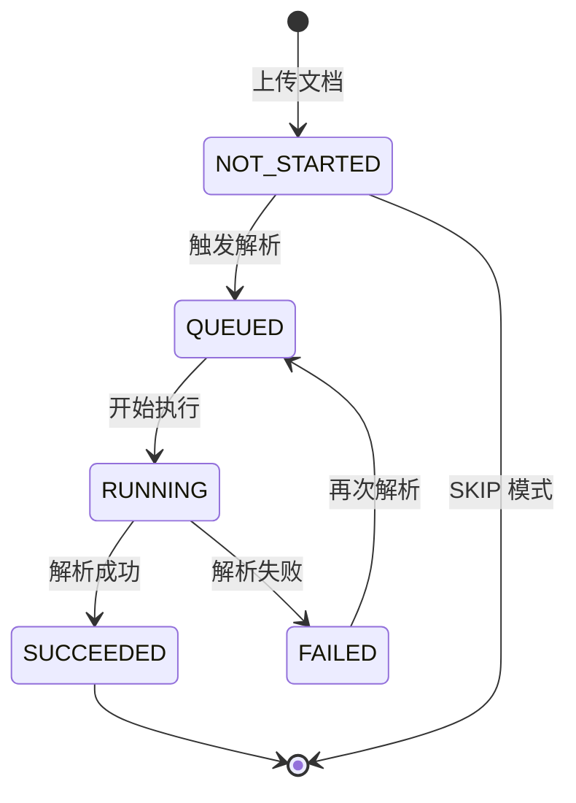

# 解析状态口径统一需求说明书

> 功能标识：`parse-status-contract-unification`
> 版本：V1.0.0
> 文档状态：已确认
> 创建日期：2026-08-11
> 更新日期：2026-08-11
>
> **更新时间维护规则**：任何正文修改必须同步更新 `更新日期` 为本次修改日期，并在 `版本修订记录` 中追加变更记录。不得正文已变更而更新日期仍停留在旧日期。

## 一句话说明

统一文档解析状态的前后端口径，补齐"执行中"和"失败"两个状态，让前端轮询有明确依据，并在解析失败后正确停止轮询、允许重试。

## 需求就绪摘要

> 需求成熟度：`ready`
> 就绪结论：阻塞维度已关闭，可以进入技术设计。
>
> 这里只记录确认后的业务结论和非阻塞待确认项，不记录完整问答日志或内部推理。

### 就绪覆盖

| 维度 | 状态 | 结论摘要 |
| --- | --- | --- |
| 业务目标与价值 | 已确认 | 统一文档解析状态前后端口径，补齐 RUNNING 和 FAILED，让前端轮询有明确依据并在失败后正确停止、允许重试 |
| 参与角色 | 已确认 | 知识库管理员（触发解析、查看进度、失败重试）、普通用户（查看解析结果） |
| 范围与非范围 | 已确认 | 本次包含 parseStatus 五态统一、RUNNING/FAILED 写入、前端轮询依据统一、PENDING 清理；不包含任务调度机制和前端轮询间隔（已在另一 feature 处理） |
| 核心流程 | 已确认 | NOT_STARTED→QUEUED→RUNNING→SUCCEEDED/FAILED，FAILED 可经重试回到 QUEUED |
| 规则、异常与边界 | 已确认 | BR-001~BR-005 覆盖五态枚举、状态流转方向、轮询触发值、失败必须写 FAILED、重试仅 FAILED 可用 |
| 验收信号 | 已确认 | AC-001~AC-006 覆盖五态枚举、RUNNING 写入、FAILED 写入、轮询依据、失败显示重试、PENDING 清理 |
| 数据、安全与集成约束 | 已确认 | 不新增表/字段，仅统一已有 parseStatus 枚举值；不涉及敏感数据、跨系统流转 |

### 已确认内容

| 序号 | 已确认结论 | 影响范围 | 证据来源 |
| --- | --- | --- | --- |
| 1 | 前端轮询依赖文档解析状态字段，扩展为五态枚举（NOT_STARTED、QUEUED、RUNNING、SUCCEEDED、FAILED），轮询触发值为 QUEUED 和 RUNNING，终态值停止轮询 | 需求/流程/验收/范围 | 用户确认 |

### 待确认内容

- 无

## 背景与目标

- 背景：当前文档解析状态前后端口径不一致。后端只产生三种状态值（NOT_STARTED、QUEUED、SUCCEEDED），而前端检查的状态值（RUNNING、PENDING）后端从不产生，前端期望的 FAILED 状态后端也从不写入。
- 当前问题：
  1. 解析执行中时，文档解析状态仍为 QUEUED，前端无法区分"排队"和"执行中"
  2. 解析失败时，后端不更新文档解析状态，导致状态停留在 QUEUED，前端持续轮询不停
  3. 前端轮询依据不明确，检查了后端不存在的状态值，与"任务调度与轮询优化"技术设计中描述的状态值不一致
  4. 前端模拟数据和测试中使用了后端不产生的状态值（PENDING），口径混乱
- 目标：统一文档解析状态为五态枚举，后端在解析开始时写入"执行中"、失败时写入"失败"，前端依据统一后的状态值进行轮询和展示，确保终态正确停止轮询。
- 不做会怎样：解析失败后前端死循环轮询，用户无法看到失败原因和重试入口，服务器承受无意义轮询压力。

## 需求范围

### 本次包含

- 统一文档解析状态枚举为五态：NOT_STARTED、QUEUED、RUNNING、SUCCEEDED、FAILED
- 后端解析执行开始时将文档解析状态更新为 RUNNING
- 后端解析失败时将文档解析状态更新为 FAILED
- 前端轮询依据统一为文档解析状态字段，轮询触发值为 QUEUED 和 RUNNING
- 前端解析失败时正确显示失败原因并允许再次解析
- 清理前端模拟数据和测试中的无效状态值（PENDING）

### 本次不包含

- 任务调度机制改造（创建后立即触发、兜底扫描间隔调整，已在"任务调度与轮询优化"feature 中处理）
- 前端轮询间隔和页面生命周期管理（已在"任务调度与轮询优化"feature 中处理）
- 新增数据库表或字段（parseStatus 是已有字段，仅统一枚举值）
- 任务状态机本身的变化（QUEUED→RUNNING→SUCCEEDED/RETRY_WAIT/FAILED 保持不变）

## 角色与场景

| 角色或参与方 | 使用场景 | 触发条件 | 期望结果 |
| --- | --- | --- | --- |
| 知识库管理员 | 触发文档解析 | 上传文档后选择解析 | 文档解析状态从"已入队"变为"执行中"，完成后变为"已完成"或"处理失败" |
| 知识库管理员 | 查看解析进度 | 解析执行中 | 页面显示"执行中"状态，定时刷新进度 |
| 知识库管理员 | 解析失败后重试 | 解析状态为"处理失败" | 页面显示失败原因，提供"再次解析"入口，点击后状态回到"已入队" |
| 普通用户 | 查看解析结果 | 解析已完成 | 页面显示"已完成"状态，可查看解析和分块预览 |

## 需求列表

| 需求编号 | 需求内容 | 优先级 | 关联场景 | 关联验收 |
| --- | --- | --- | --- | --- |
| REQ-001 | 统一文档解析状态为五态枚举（尚未解析、已入队、执行中、已完成、处理失败），前后端使用相同的状态值 | P0 | 全部场景 | AC-001 |
| REQ-002 | 后端在解析任务开始执行时，将文档解析状态更新为"执行中"（RUNNING） | P0 | 管理员触发解析 | AC-002 |
| REQ-003 | 后端在解析任务失败时，将文档解析状态更新为"处理失败"（FAILED），不再停留在"已入队" | P0 | 解析失败 | AC-003 |
| REQ-004 | 前端轮询依据文档解析状态字段，仅当状态为"已入队"或"执行中"时继续轮询，其余状态停止轮询 | P0 | 查看解析进度 | AC-004 |
| REQ-005 | 前端在文档解析状态为"处理失败"时，显示失败原因并提供"再次解析"入口 | P0 | 解析失败后重试 | AC-005 |
| REQ-006 | 清理前端模拟数据和测试中的无效状态值（PENDING），统一为五态枚举 | P1 | 开发与测试 | AC-006 |

## 业务规则

| 规则编号 | 规则内容 | 适用场景 | 例外或边界 |
| --- | --- | --- | --- |
| BR-001 | 文档解析状态只能取五态之一：NOT_STARTED、QUEUED、RUNNING、SUCCEEDED、FAILED | 全部场景 | 无 |
| BR-002 | 状态流转方向：NOT_STARTED → QUEUED → RUNNING → SUCCEEDED 或 FAILED；FAILED 可经重试回到 QUEUED | 全部场景 | 无 |
| BR-003 | 前端轮询仅在 QUEUED 和 RUNNING 状态下进行，其余状态（含 NOT_STARTED、SUCCEEDED、FAILED）必须停止轮询 | 查看解析进度 | 网络请求失败时保持轮询，不因网络抖动终止 |
| BR-004 | 解析失败时必须将状态更新为 FAILED，不得停留在 QUEUED 或 RUNNING | 解析失败 | 无 |
| BR-005 | "再次解析"仅在 FAILED 状态下可用，其他状态不可重试 | 解析失败后重试 | 无 |

## 业务流程

### 主要流程

1. 知识库管理员上传文档，文档解析状态为"尚未解析"（NOT_STARTED）
2. 管理员触发解析，状态变为"已入队"（QUEUED），前端开始轮询
3. 后端任务执行器开始执行解析，状态变为"执行中"（RUNNING）
4. 解析成功，状态变为"已完成"（SUCCEEDED），前端停止轮询
5. 解析失败，状态变为"处理失败"（FAILED），前端停止轮询并显示失败原因
6. 管理员点击"再次解析"，状态回到"已入队"（QUEUED），前端重新开始轮询

### 异常或分支

- 解析执行中网络断开：前端轮询请求失败时保持轮询，网络恢复后继续刷新
- 解析执行中页面关闭：前端停止轮询，重新进入页面后根据当前状态决定是否恢复轮询
- 历史脏数据：上线前已存在的状态为 QUEUED 但实际已失败的文档，由兜底扫描重新执行后自然流转为 SUCCEEDED 或 FAILED

### 流程图

## 业务数据口径

### 数据影响判断

| 检查项 | 是否涉及 | 说明 |
| --- | --- | --- |
| 新增、修改、删除或查询持久化数据 | 否 | 不新增表/字段，仅统一已有状态字段的枚举值 |
| 外部数据入库、出库、同步、对账或报表 | 否 | 不涉及 |
| 字段映射、金额、日期、状态、流水号或客户标识 | 是 | 涉及文档解析状态枚举口径统一 |
| 手机号、证件号、银行卡、合同、地址、交易流水等敏感数据 | 否 | 不涉及 |
| 跨系统、跨服务、跨库或第三方数据流转 | 否 | 不涉及 |

### 关键数据口径

| 业务对象/数据项 | 用户能理解的含义 | 来源或产生方式 | 单位/格式/状态口径 | 本次是否变化 | 是否关键 | 确认状态 |
| --- | --- | --- | --- | --- | --- | --- |
| 文档解析状态 | 文档当前的解析进度 | 后端解析流程写入 | 五态枚举：NOT_STARTED（尚未解析）、QUEUED（已入队）、RUNNING（执行中）、SUCCEEDED（已完成）、FAILED（处理失败） | 是 | 是 | 已确认 |

## 影响说明

| 影响对象 | 影响说明 |
| --- | --- |
| 后端解析执行流程 | 新增 RUNNING 和 FAILED 状态写入时机 |
| 前端文档详情页 | 轮询依据和状态展示统一为五态枚举 |
| 前端模拟数据与测试 | 清理无效状态值（PENDING），统一为五态 |
| 前端状态标签格式化 | 确认五态标签映射完整 |
| "任务调度与轮询优化"feature | 该 feature 的技术设计 §5.3 前端轮询策略中 isParseActive 的状态值需以本 feature 统一后的五态为准 |

## 验收标准

- AC-001：Given 前后端代码库，when 检查文档解析状态的所有写入和读取点，then 使用的状态值仅包含 NOT_STARTED、QUEUED、RUNNING、SUCCEEDED、FAILED 五种，不存在 PENDING 或其他非法值。关联需求：REQ-001、REQ-006。
- AC-002：Given 文档解析状态为 QUEUED，when 后端任务执行器开始执行解析，then 文档解析状态更新为 RUNNING。关联需求：REQ-002。
- AC-003：Given 文档解析任务执行失败，when 后端处理失败分支，then 文档解析状态更新为 FAILED（不得停留在 QUEUED 或 RUNNING）。关联需求：REQ-003。
- AC-004：Given 前端文档详情页已打开，when 文档解析状态为 QUEUED 或 RUNNING，then 前端以固定间隔轮询；when 状态变为 NOT_STARTED、SUCCEEDED 或 FAILED，then 前端停止轮询。关联需求：REQ-004。
- AC-005：Given 文档解析状态为 FAILED，when 管理员查看文档详情页，then 页面显示失败原因和"再次解析"按钮；when 点击"再次解析"，then 状态回到 QUEUED 并恢复轮询。关联需求：REQ-005。
- AC-006：Given 前端模拟数据和测试代码，when 检查所有 parseStatus 取值，then 不存在 PENDING 值，所有取值均为五态之一。关联需求：REQ-006。

## 质量要求

- 性能：不适用，原因：不改变查询逻辑和数据量，仅统一状态枚举值
- 安全：不适用，原因：不改变权限校验和敏感数据处理
- 兼容：需要确认历史脏数据（状态为 QUEUED 但实际已失败）的兜底处理，由现有兜底扫描机制自然流转
- 可用性：解析失败后必须正确显示 FAILED 状态并提供重试入口，不得死循环轮询

## 风险与待确认

### 风险

- 历史脏数据风险：上线前已存在的 QUEUED 状态但实际已失败的文档，在新逻辑上线前仍会导致前端轮询。缓解措施：上线后由兜底扫描重新执行，自然流转为 SUCCEEDED 或 FAILED。

### 假设

- 兜底扫描机制（2分钟间隔）能覆盖历史脏数据的重新执行
- 前端轮询间隔和页面生命周期管理由"任务调度与轮询优化"feature 负责，本 feature 只负责轮询依据的状态值统一

### 待确认

- 无

## 版本修订记录

| 日期 | 版本 | 说明 |
| --- | --- | --- |
| 2026-08-11 | V1.0.0 | 初始化需求说明书，统一文档解析状态为五态枚举 |
