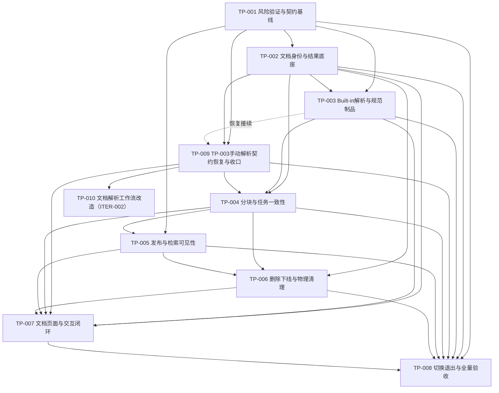

# 文档处理流水线重构任务索引

> 功能标识：`document-processing-refactor`  
> 规划模式：`task-pack`  
> SDD 等级：`S2`  
> 来源需求：`spec/features/20260817/document-processing-refactor/文档处理流水线重构-需求说明书.md`（V2.1.2）
> 来源技术设计：`spec/features/20260817/document-processing-refactor/文档处理流水线重构-技术设计说明书.md`（V2.1.4，approved）
> 当前活动任务包：无（TP-010 已完成）
> 实现确认状态：TP-010 的 T032～T037 已完成；official OCR 与 MinIO 真实连通性为独立外部暂缓 Gate
> 任务包地图确认状态：approved  
> FeatureLifecycle：implementing
> ExternalizedBaseline：no
> CurrentRevision：ITER-002
> 创建日期：2026-08-17  
> 更新日期：2026-09-01（T037：两仓聚焦回归通过，TP-010 完成；外部 OCR/MinIO Gate 暂缓）

## 1. 任务包地图

| TaskPack | 名称 | 目标 | AC | DependsOn | 预计任务数 | PackStatus | ApprovalStatus | 文件 |
| --- | --- | --- | --- | --- | --- | --- | --- | --- |
| TP-001 | 风险验证与契约基线 | 关闭 Built-in 样本能力、模型协议和目标分层等前置风险，冻结后续实现使用的公共契约 | AC-003～AC-004、AC-007～AC-012、AC-020、AC-030、AC-033～AC-034 | 无 | 6 | done | approved | `tasks/TP-001-风险验证与契约基线.md` |
| TP-002 | 文档身份与结果底座 | 建立 3 表目标数据结构（`kb_document`/`kb_document_result`/`kb_processing_task`）、MinIO source 对象、普通上传、批量上传和详情能力 | AC-001～AC-008、AC-025、AC-027、AC-032～AC-034 | TP-001 | 8 | done | approved | `tasks/TP-002-文档身份与结果底座.md` |
| TP-003 | Built-in解析与规范制品 | 实现启用格式的确定性提取、按需模型增强、统一 ParsedDocument 以及 MinerU 禁用骨架 | AC-006～AC-017、AC-034 | TP-001、TP-002 | 7 | superseded | approved | `tasks/TP-003-Built-in解析与规范制品.md` |
| TP-004 | 分块与任务一致性 | 实现两维分块、首次分块 stage 推进、重新分块、任务观察、重试和旧任务防覆盖 | AC-013～AC-019、AC-027、AC-030、AC-034 | TP-002、TP-009 | 6 | superseded | approved（历史） | `tasks/TP-004-分块与任务一致性.md` |
| TP-005 | 发布与检索可见性 | 实现 Embedding fail-closed、ES writeProjection+validateWrite、发布失败回退到 PARSED、检索可见性靠文档状态过滤 | AC-020～AC-022、AC-026、AC-030、AC-032、AC-034 | TP-001、TP-004 | 5～7 | draft | pending | `tasks/TP-005-发布与检索可见性.md` |
| TP-006 | 删除下线与物理清理 | 实现业务软删除、立即退出检索、按 `kb_document_result` 枚举 MinIO objectKey 进行 ES/MinIO 全量幂等清理 | AC-025～AC-032 | TP-002、TP-004、TP-005 | 5～7 | draft | pending | `tasks/TP-006-删除下线与物理清理.md` |
| TP-007 | 文档页面与交互闭环 | 先完成 UI 设计确认，再适配列表、详情、处理操作、状态反馈、删除确认和可访问性 | AC-001～AC-033 | TP-002、TP-003、TP-004、TP-005、TP-006 | 6～8 | draft | pending | `tasks/TP-007-文档页面与交互闭环.md` |
| TP-008 | 切换退出与全量验收 | 完成数据清空重建 Gate、前后端单链切换、旧代码与旧 SDD 退出、全量回归和回滚演练 | AC-031、AC-033～AC-034 | TP-001、TP-002、TP-003、TP-004、TP-005、TP-006、TP-007 | 6～8 | draft | pending | `tasks/TP-008-切换退出与全量验收.md` |
| TP-009 | TP-003手动解析契约恢复与收口 | 恢复手动解析正式 HTTP 契约、新结果版本事务、失败重发追溯，并接续 TP-003 未闭合验证 | AC-005～AC-014、AC-017、AC-029～AC-030、AC-034 | TP-001、TP-002 | 4 | done | approved | `tasks/TP-009-TP-003手动解析契约恢复与收口.md` |
| TP-010 | 文档解析工作流改造 | 保留 T032 解析基线、T033 官方页级 OCR 与 T036 独立 PARSE/CHUNK 工作流；ITER-002 重开 T035，以 Fons4AI LangChain4j SDK 优先的方式实现可追溯分块 | AC-015～AC-017、AC-035～AC-040 | TP-001、TP-002、TP-009 | 6 | done | approved | `tasks/TP-010-文档解析工作流改造.md` |

## 2. 实现确认门禁

- 任务包地图已经用户确认；`TP-001`、`TP-002`、`TP-009` 已完成；`TP-003` 作为被恢复包接续的批准历史标记为 `superseded`。
- TP-004 已由 CR-001 的 TP-010 替代，保留已批准历史但不得继续实施。
- TP-010 在未验收、未外部化的实现期按 ITER-002 原地修订：T032～T037 已完成；T035 的旧 Evidence 已失效，现已由 SDK 优先分块 Evidence 取代。official OCR 与 MinIO 的真实连通性未配置隔离凭据，作为独立外部暂缓 Gate，不影响代码/契约完成状态且不代表部署就绪。
- TP-009 已关闭，无需重复执行。
- 跨包执行必须明确回复：`执行全部活动任务包`。
- 任务索引或 Task Pack 的存在不等于实现授权。

## 3. 依赖与执行顺序

执行原则：TP-001 先关闭高风险技术假设（Built-in 样本能力、模型协议、目标分层）；TP-002～TP-006 按事实、处理、发布和删除依赖递进；TP-007 在后端契约和状态稳定后完成 UI 闭环；TP-008 只在所有实现包完成后执行不可逆清理、单链切换和旧规格退出。

## 4. 状态摘要

- 活动任务包：无；TP-010（done，ApprovalStatus=approved，CurrentRevision=ITER-002）的 T032～T037 已完成；TP-004 已 superseded；TP-009 已完成。
- 已完成任务包：TP-001、TP-002；TP-002 的 T007～T014 全部完成，DDL 与 SQL 快照 Gate 已关闭，当前源码树 43 项测试通过显式 Surefire 3.5.4 验证。
- 阻塞任务包：TP-005～TP-008 尚未展开并批准。
- 延期任务包：MinerU 真实接入不在本 Feature，不创建 Task Pack；后续独立 Feature 处理。
- 已替代/归档任务包：TP-003 已由 TP-009 接续替代；T015～T019 的候选实现由 T024 复核，T020～T021 由 T022～T025 替代。
- 当前变更：TP-009 已恢复 `POST /documents/{documentKey}/parse`、新结果版本与新任务同事务创建、失败重发追溯和显式 Surefire 收口；TP-004 已由 TP-010 替代。
- 当前变更：T033 已交付 `paddleocr-official` 页级 Markdown/图片 URL 与 `PAGE` 锚点输入；ITER-001 仅为流式读取边界兼容调整其内部请求载体，不重做 Provider、配置或页级返回语义。
- 当前变更：用户已否定 T034 的 PDF 特化识别和 `Path` 入口。ITER-001 将 ParseRecognizer 限定为已校验文件事实的意图识别，PDF probe 归 PDF 策略内部，所有源文件读取从 MinIO 的可重复打开输入流开始。
- 当前变更：用户确认 RAG 分块优先使用 LangChain4j SDK。ITER-002 将公开策略收敛为 `RECURSIVE/MARKDOWN_HEADER/SEMANTIC`，以 `FLAT/PARENT_CHILD` 表达层级；Fons4AI 只补 SDK 的父子/追溯缺口，Rag2OKF 负责来源 Metadata 与确定性 Manifest 映射。
- DDL 外部 Gate：用户已确认移除 `snapshot_version` 的迁移已执行；TP-010 的实现阶段仍须记录真实 MinIO/模型运行态 Gate。
- 知识影响：实现验证后由独立 `fons4ai-knowledge-summary` 工作流处理，不拆入本任务索引。

## 5. AC 覆盖

| AC | 覆盖 TaskPack | 状态 |
| --- | --- | --- |
| AC-001 | TP-002、TP-007 | planned |
| AC-002 | TP-002、TP-007 | planned |
| AC-003 | TP-001、TP-002、TP-007 | planned |
| AC-004 | TP-001、TP-002、TP-007 | planned |
| AC-005 | TP-002、TP-003、TP-007 | planned |
| AC-006 | TP-002、TP-003 | planned |
| AC-007 | TP-001、TP-002、TP-003 | planned |
| AC-008 | TP-001、TP-002、TP-003、TP-007 | planned |
| AC-009 | TP-001、TP-003 | planned |
| AC-010 | TP-001、TP-003、TP-007 | planned |
| AC-011 | TP-001、TP-003 | planned |
| AC-012 | TP-001、TP-003、TP-007 | planned |
| AC-013 | TP-003、TP-007 | planned |
| AC-014 | TP-003、TP-007 | planned |
| AC-015 | TP-010/ITER-002/T035 | implemented（T035；T037 两仓聚焦回归通过） |
| AC-016 | TP-010/ITER-002/T035 | implemented（T035；T037 两仓聚焦回归通过） |
| AC-017 | TP-010/ITER-002/T035、TP-007 | implemented（T035；T037 两仓聚焦回归通过） |
| AC-018 | TP-004、TP-007 | planned |
| AC-019 | TP-004、TP-007 | planned |
| AC-020 | TP-001、TP-005、TP-007 | planned |
| AC-021 | TP-005、TP-007 | planned |
| AC-022 | TP-005、TP-007 | planned |
| AC-023 | TP-005、TP-007 | planned |
| AC-024 | TP-005、TP-007 | planned |
| AC-025 | TP-002、TP-005、TP-006、TP-007 | planned |
| AC-026 | TP-002、TP-005、TP-006 | planned |
| AC-027 | TP-002、TP-004、TP-006、TP-007 | planned |
| AC-028 | TP-006、TP-007 | planned |
| AC-029 | TP-006、TP-007 | planned |
| AC-030 | TP-001、TP-005、TP-006 | planned |
| AC-031 | TP-002、TP-006、TP-008 | planned |
| AC-032 | TP-002、TP-006、TP-007 | planned |
| AC-033 | TP-001、TP-002、TP-008 | planned |
| AC-034 | TP-001、TP-002、TP-003、TP-005、TP-006、TP-008 | planned |
| AC-035 | TP-010/ITER-002/T036 | implemented（T036；T037 聚焦回归通过） |
| AC-036 | TP-010/ITER-002/T036 | implemented（T036；T037 聚焦回归通过） |
| AC-037 | TP-010/ITER-002/T036 | implemented（T036；T037 聚焦回归通过） |
| AC-038 | TP-010/T033、T035 | implemented（T033/T035；T037 页级 URL 与 PAGE 来源契约回归通过；真实 official Gate 暂缓） |
| AC-039 | TP-010/T034 | implemented（T037 解析意图与 PDF probe 聚焦回归通过） |
| AC-040 | TP-010/T032、T034～T036 | implemented（T035 空行与 T037 分块来源回归通过） |

## 6. 拆分决定

- 使用 Task Pack 的原因：该 S2 Feature 跨越公共契约、MySQL/MinIO/Elasticsearch、用户模型调用、异步任务、Vue 页面和不可逆切换，预计超过 30 个任务，需要分批评审、批准和执行。
- 拆分方式：按同一文档生命周期中的可验证实施切片拆包，而不是机械按 controller/service/frontend 技术层拆包。
- 是否应进一步拆成独立 Feature：否。上传、解析、分块、发布、删除和切换共享文档身份、`kb_document_result` stage、任务快照和文档状态机，拆成独立 Feature 会重新引入并行规格和半成品状态。MinerU 真实接入已明确作为后续独立 Feature。
- 技术设计确认：approved；证据为用户在 V2.0.0 中明确要求压缩为 3 表、删除替换、发布改为 BM25+向量化原子操作、检索可见性靠文档状态过滤，并要求"直接改现有 SDD 文档三件套，不要走 CR 变更"。
- 任务包地图确认：approved；证据为用户在地图生成后明确要求"继续生成 TP001"。

## 7. 后续展开规则

- 已完成 `TP-001 风险验证与契约基线` 与 `TP-002 文档身份与结果底座`；TV-DOC-001、TV-MODEL-001、目标分层/契约基线及 TP-002 DDL Gate 已关闭；TV-ES-001 已在 V2.0.0 中删除，不再阻塞 TP-005。TP-003 及后续包必须在依赖和用户指定满足后逐包展开。
- TP-007 的首个任务必须是 UI 设计确认，覆盖页面信息架构、页面清单、主要布局、关键操作流、状态反馈、敏感信息展示和验收口径；页面实现任务必须依赖该任务。
- TP-002/TP-008 必须包含执行型变更 DDL 草案、用户/DBA 执行状态确认、只读结构复核、`.specify/sql/mysql/document-processing.sql` 当前结构快照同步及白名单清理验证任务。
- 每个实现任务先完成 Test Decision Gate，再按覆盖缺口选择复用、更新或新增测试；不把"补单元测试"机械拆成独立任务。
- 每个 Task Pack 单独进入 `ready → approved → in-progress → done`，未批准包不得实现。
