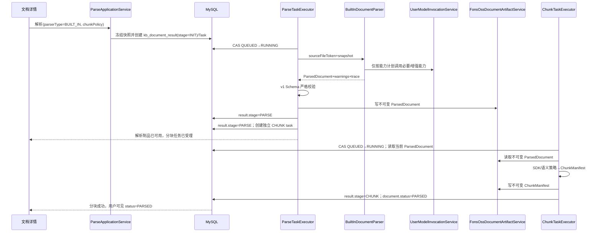
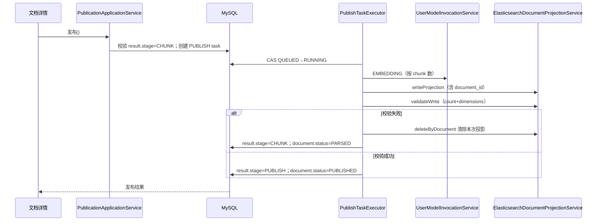
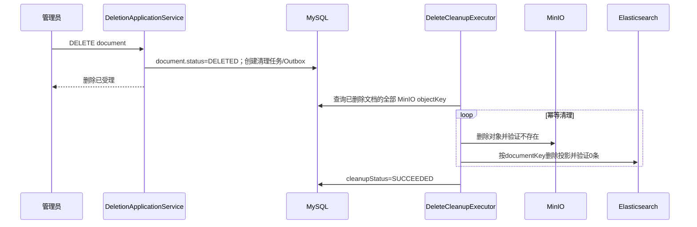
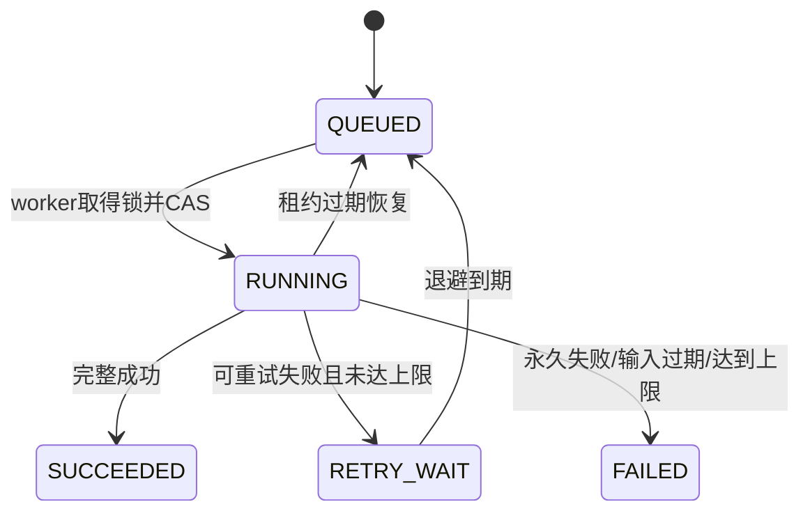
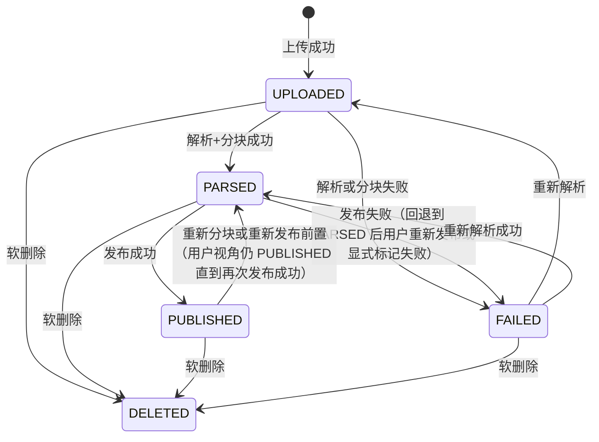
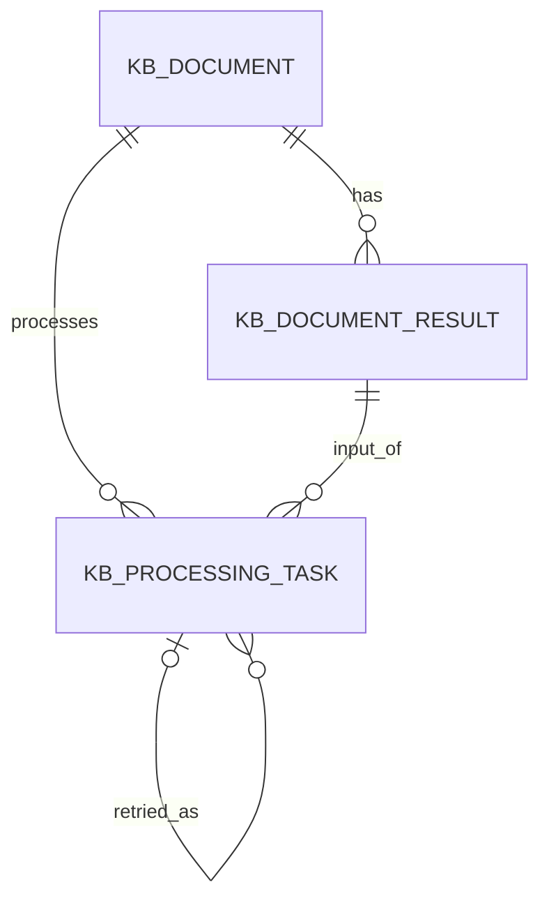

# 文档处理流水线重构技术设计说明书

> 功能标识：`document-processing-refactor`  
> SDD 等级：`S2`  
> 来源需求：`spec/features/20260817/document-processing-refactor/文档处理流水线重构-需求说明书.md`（V2.1.2）  
> 设计版本：V2.1.5  
> 文档状态：正式设计-已确认  
> 设计确认状态：approved  
> 创建日期：2026-08-17  
> 更新日期：2026-09-02

## 1. 设计摘要与关键决策

- 功能目标：实现 REQ-001～REQ-017、AC-001～AC-034，以新目标模型整体替换现有文档管理、Built-in 解析、分块、任务、发布和删除链路。
- 设计范围：后端文档域分层重构、文档 HTTP/UI 契约、Built-in 解析工作流、MinerU 不可用扩展骨架、规范解析与分块制品、异步任务、发布投影、跨存储删除、必要前端适配和旧规格退出设计。
- 非目标：MinerU 真实连接/API Key/远端协议、文件夹管理、模型资源管理页面、检索问答与 OKF、替换源文件、版本管理；本设计只消费用户域授权/模型资源和知识库域默认策略/模型用途绑定。
- SDD 等级理由：涉及公共 HTTP 契约、MySQL/MinIO/Elasticsearch 结构、跨资源最终一致性、权限与敏感内容、前后端同步切换和大范围领域重构，符合 S2。
- 交付画像：混合交付，包括 Spring Boot 后端服务、Vue 前端应用、MySQL 初始化结构、MinIO 对象结构和 Elasticsearch 可重建投影。
- 独立可运行服务：否。本功能进入既有 `fons4ai-rag2okf-service`，不新增部署单元。
- 页面/交互型交付物：是。调整文档列表、详情、上传、状态轨迹、分块预览和删除确认，不重做全局视觉体系。
- 数据结构变更：是。文档域表结构压缩为 3 表（文档表、文档结果表、异步任务表），删除 Revision 表和 Artifact 登记表，调整 MinIO 对象键和 ES 投影 Schema。
- 规划建议：V2 Task Pack。建议按“领域与契约基线、数据与制品、Built-in 与分块、任务与发布、删除、前端、切换与退出”拆包，避免一次性大爆炸修改。

### 1.1 关键决策

| 决策 | 选择 | 原因 | 替代方案 | 影响 | 需用户确认 |
| --- | --- | --- | --- | --- | --- |
| D-001 运行形态 | 在既有单体服务内按用户域、知识库域现行 DDD-lite 风格重构：`application` 编排，`domain` 只保留 `entity/mapper/service/service.impl`，基础设施归入 `infrastructure/adapter|client|support`；不设置 `domain/port` | 保持同一项目的包结构、命名和依赖习惯一致，避免文档域独立引入一套六边形 Port 架构 | 新建解析服务；保留 `domain/port`；继续沿用散落包结构 | 后端包结构、依赖方向、测试 | 是 |
| D-002 MinerU 本期边界 | `MINERU` 保留公共枚举、解析契约和禁用适配器；任何请求返回 `PARSER_NOT_AVAILABLE`，不创建任务、不调用远端、不回退 | 用户已确认暂缓真实接入，同时需保留未来扩展点 | 删除 MinerU 所有痕迹；建设真实连接 | API 错误、解析器注册表、测试 | 是 |
| D-003 Built-in 解析 | 使用“解析意图识别→唯一 Parser 路由→Built-in 文件类型策略→能力计划→按需模型调用→规范化→Schema 校验”工作流；Built-in 内部按 PDF、图片、Markdown、纯文本、Word、音频策略分派 | 将文件识别、Parser 选择和文件格式提取解耦；策略可保留格式结构与页级事实，同时把资源缺失转为显式结果 | 单一通用解析调用；按厂商编写模型 Adapter | 解析策略、模型边界、错误语义 | 是 |
| D-004 模型接入 | 文档应用服务通过用户域 `UserModelInvocationService` 按能力调用模型；该服务复用 `UserModelResolver`、凭证解密和现有 LangChain4j Client Factory，按协议能力适配，不按厂商适配 | 降低多厂商开发成本、保持凭证和模型调用责任在用户域，并避免在文档领域层新增 Gateway/Port | 每厂商 Adapter；文档解析器直接调用模型 SDK；新增领域 Gateway | 用户域/知识库域应用协作、能力测试 | 是 |
| D-005 规范解析事实 | `ParsedDocument` JSON 是 MinIO 中不可变事实；Markdown 仅为可选派生 | 分块和预览不依赖解析器私有格式，可兼容演进 | 只存 Markdown；每解析器保存私有响应 | MinIO 结构、解析/预览/分块 | 是 |
| D-006 解析与首次分块（历史） | 原 `PARSE` 任务串联首次分块的结论已被 D-016 替代；仅保留历史追溯，不得作为新实现依据 | 历史设计记录 | D-016 的独立 PARSE/CHUNK 工作流 | 无 | 否 |
| D-007 分块模型 | 边界 `RECURSIVE/MARKDOWN_HEADER/SEMANTIC` 与层级 `FLAT/PARENT_CHILD` 正交；默认 `RECURSIVE+PARENT_CHILD` | 递归重叠和 Markdown 标题首先复用 LangChain4j SDK；父子关系可表达真实标题上下文或算法构造的上下文 | 保留 `LENGTH/STRUCTURE` 自实现；以 SDK `TextSegment` 作为持久化制品 | 公共策略枚举、Manifest、前端表单 | 是 |
| D-008 快照 | 任务只冻结当前输入标识、有效策略、非秘密模型档案引用和自动发布意图 | 保证重试确定性且保持数据结构简约 | 复制完整 KB/模型配置；运行时重读全部当前设置 | `payload_json`、安全、重试 | 是 |
| D-009 数据结构压缩 | 文档域数据结构压缩为 3 表：`kb_document`（文档身份+当前源文件+用户可见状态）、`kb_document_result`（解析分块发布结果+stage 生命周期）、`kb_processing_task`（异步任务+失败原因）；删除 Revision 表和 Artifact 登记表 | 用户明确要求简化表结构，不关心过程表；失败信息归任务表，结果表靠 stage 驱动重推 | 保留 6 表+Artifact 登记表 | MySQL、MinIO、清理任务 | 是 |
| D-010 用户可见状态机 | 文档用户可见状态为 4 个：UPLOADED/PARSED/PUBLISHED/FAILED；系统内部靠 `kb_document_result.stage` 表达已成功推进到的阶段（INIT/PARSE/CHUNK/PUBLISH） | 用户不关心解析和分块的中间态，只关心最终结果 | 继续多状态分离暴露给用户 | 列表/详情 DTO、状态机 | 是 |
| D-011 发布原子操作 | 发布等于 BM25 索引写入加向量化；两者都成功才算发布成功；失败时删除本次 ES 投影并回退到 PARSED；检索可见性靠 ES 分块携带 document_id，RAG 重排序批量查文档状态过滤 | 用户明确要求发布是原子操作，无降级；检索可见性靠文档状态过滤而非 ES staging/alias | 缺模型降级 BM25-only；ES stage/validate/activate | 发布 Saga、ES 基础设施服务、检索边界 | 是 |
| D-012 删除 | MySQL 事务软删除文档（status=DELETED）并创建 `DELETE_CLEANUP`；后台幂等物理删除全部 MinIO 制品和 ES 投影 | 用户立即不可见，外部清理失败仍可重试且不恢复 | 同步跨存储删除；只软删不清内容 | 删除 API、任务、ES | 是 |
| D-013 迁移 | 不迁移旧文档数据；保留用户域和知识库域数据，受控清空旧文档表/对象前缀/ES 投影后启用新模型 | 用户已确认项目尚无必须保留的生产文档 | 双读迁移；逐条转换旧文档 | 上线、回滚、DDL | 是 |
| D-014 API 切换 | 前后端同版本切换到新契约，不保留与目标冲突的兼容入口；URL 尽量稳定，删除 folderPath 和替换源文件入口等错误语义 | 避免新旧处理链并存，同时降低路由改造量 | 新增 `/v2` 长期双栈；原样兼容旧参数 | Controller、UI、E2E | 是 |
| D-015 知识与旧 SDD | 本 Feature 实现验证后再执行知识汇总和旧规格清理；本阶段只给出精确退出清单，不删除历史文件 | 防止设计目标提前写成已验证事实或误删跨域内容 | 设计阶段立即删除旧 SDD/改知识库 | SDD 治理、知识治理 | 是 |
| D-016 解析与分块解耦 | PARSE 仅产出校验后的 ParsedDocument；CHUNK/RECHUNK 独立消费解析制品并产出 ChunkManifest | 避免解析阶段隐式分块，允许同一解析事实被不同分块策略复用 | 在 PARSE 中串联首次分块 | 任务、制品、状态与后续 Task Pack 前置条件 | 是 |
| D-017 页级官方 OCR | `ParseRecognizer` 仅根据已校验文件事实产出唯一 Parser 意图，`ParserRouter` 选择唯一 Parser；PDF 策略内部通过页级 probe 生成 OCR 计划，PDF/图片策略再经位于 `infrastructure` 的 OcrGateway 调用显式选择的 `paddleocr-official`。Gateway 透传按页 Markdown、Markdown 图片 URL 和可视化图片 URL；页序 `index + 1` 映射为 `PAGE` SourceAnchor | 将 Parser 选择、OCR 是否需要、按格式如何提取分别归属，页级定位已满足当前解析、分块和预览链路，避免伪造区域坐标、置信度、阅读顺序或块类型 | Java 管理模型进程；从 Markdown 推断区域；下载、持久化或改写官方图片 URL | 解析器、SourceAnchor、运行轨迹与失败语义 | 是 |
| D-018 SDK 优先分块适配 | Rag2OKF 的 CHUNK 任务把已保存 `ParsedDocument` 一次投影为携带来源 Metadata 的 LangChain4j `Document` 后调用 Fons4AI LangChain4j splitter；SDK 不足的父子和来源追溯能力只在 Fons4AI LangChain4j 适配层扩展，最终由 Rag2OKF 映射为可追溯的 `ChunkManifest` | 避免重复实现递归、重叠和 Markdown 标题算法，也避免把 LangChain4j `Document` 作为持久化或领域模型 | 新建框架无关分块核心；Rag2OKF 自行复制 SDK 算法；`ParsedDocument→Document→ParsedDocument` 往返 | Fons4AI RAG LangChain4j 模块、Rag2OKF 分块策略/清单和回归 | 是 |

### 1.2 设计确认 Gate

- Gate 是否适用：是。该 Feature 为 S2，涉及跨域公共契约、数据结构、权限安全、复杂状态和多个 Task Pack。
- 设计确认状态：`approved`。
- 用户需确认的关键点：D-001～D-015，重点是 Built-in 初始文件能力与阈值、3 表数据结构压缩、用户可见 4 状态机、发布原子操作、检索可见性靠文档状态过滤、无旧数据迁移及 MinerU 禁用边界。
- 确认证据：用户在 2026-08-17 明确确认删除替换功能、压缩为 3 表、发布改为 BM25 加向量化原子操作、检索可见性靠文档状态过滤等核心变更，作为 V2.0.0 整体设计确认依据。

## 2. 系统边界、模块与调用链

### 2.1 模块与职责

目标包结构直接对齐用户域和知识库域。文档域可以按用例拆分多个应用服务，但不额外创造 `domain/port`、`gateway` 或 `repository` 层：

```text
controller/document/
application/document/
common/constants/document/
common/model/document/
common/request/document/
common/response/document/
common/exception/document/
domain/entity/document/
domain/mapper/document/
domain/service/document/
domain/service/document/impl/
infrastructure/adapter/document/
infrastructure/support/document/
```

其中 `domain/service/document` 与用户域、知识库域相同，放置面向文档实体持久化和领域查询的 `Kb*DomainService` 接口；`domain/service/document/impl` 使用 MyBatis-Plus `ServiceImpl` 实现。解析编排、分块编排和解析器注册属于 `application/document`，MinIO、Elasticsearch、文件格式提取等技术实现属于 `infrastructure/adapter/document`。本期没有文档域出站 Client，因此不创建 `infrastructure/client/document`；未来接入真实 MinerU 时再按用户域 `infrastructure/client/user` 的风格增加。

领域概念与 Java 类型统一映射为：Document → `KbDocument`、DocumentResult → `KbDocumentResult`、ProcessingTask → `KbProcessingTask`。对应持久化服务均采用同名 `*DomainService` / `*DomainServiceImpl`，不再引入 Repository 或 Port 命名。

| 模块/组件 | 职责 | 输入 | 输出 | 依赖 | 影响 AC |
| --- | --- | --- | --- | --- | --- |
| `controller/document` | HTTP 参数转换、鉴权上下文入口、统一响应；不放业务规则 | multipart/JSON/path/query | `R<T>`、下载流、202 受理结果 | 文档应用服务 | AC-001～AC-007、AC-018、AC-023～AC-030 |
| `DocumentApplicationService` | 上传、批量上传、详情、下载 | 文件、KB/document key | 文档视图 | 权限边界、MinIO、`KbDocumentDomainService` | AC-001～AC-002、AC-023～AC-024 |
| `DocumentParseApplicationService` | 解析命令、快照冻结、预览查询 | parserType、chunkPolicy、文件 token | PARSE task/result.stage | KB 策略、模型引用、Task | AC-005～AC-014、AC-018～AC-019 |
| `DocumentChunkApplicationService` | 首次分块、重新分块命令和预览 | 当前 result.version、策略 | CHUNK/RECHUNK task/result.stage | Chunk 策略、MinIO | AC-015～AC-019、AC-036～AC-037 |
| `DocumentPublicationApplicationService` | 发布门禁、快照、发布状态查询 | 当前 result.stage=CHUNK | PUBLISH task/result.stage=PUBLISH | 用户模型调用服务、ES 投影服务 | AC-020～AC-022 |
| `DocumentDeletionApplicationService` | 软删除、下线、创建清理任务、清理状态查询 | document keys | 删除受理和 cleanup task | 文档 DomainService、Fons OSS、ES 投影服务 | AC-025～AC-028 |
| `KbDocument` 聚合 | 文档身份不变量、用户可见状态机（UPLOADED/PARSED/PUBLISHED/FAILED）、软删除 | 领域命令 | 新状态 | result.stage | AC-001、AC-013～AC-014、AC-019、AC-022～AC-028 |
| `KbDocumentResult` | stage 生命周期（INIT/PARSE/CHUNK/PUBLISH）、解析与分块统计、指针（source_file_token/manifest_object_key 等） | 任务事件 | 新 stage/统计 | MinIO objectKey | AC-013～AC-022 |
| 文档 `Kb*DomainService` 系列 | 按实体提供持久化、受限查询和 CAS 更新；实现风格与 `KbKnowledgeBaseDomainService` 一致 | Entity/业务键/查询条件 | Entity/分页/更新结果 | Mapper、MyBatis-Plus `ServiceImpl` | AC-001～AC-034 |
| `DocumentParserRegistry` | 应用层解析策略注册；返回启用解析器或明确不可用，禁止 fallback | `ParserType` | `DocumentParser`/错误 | Built-in、MinerU 骨架 | AC-006～AC-010 |
| `ParseRecognizer` | 基于已校验扩展名、服务端 MIME 和魔数/容器结论生成可解释的唯一 Parser 意图；不读取源流、不执行 PDF probe | 上传预检文件事实 | `ParseIntent`（文件类型、目标 Parser、能力候选、依据）/安全错误 | 文件能力清单 | AC-006、AC-039 |
| `ParserRouter` | 按 `ParseIntent` 选择唯一且启用的 Parser；未知类型或不可用 Parser 明确失败，禁止 fallback | `ParseIntent` | `DocumentParser`/错误 | `DocumentParserRegistry` | AC-006～AC-010、AC-039 |
| `BuiltInDocumentParser` | Built-in 编排器；按已识别文件类型选择唯一 `DocumentParseStrategy`，协调必要/增强能力，不承担文件类型判断 | `ParseIntent`、可重复读取源制品 | `RawParseResult`、warning、trace | 文件类型策略、用户模型调用服务 | AC-008～AC-009、AC-011～AC-012、AC-039 |
| `DocumentParseStrategy` 系列 | 每种文件类型的确定性提取策略：PDF、图片、Markdown、纯文本、Word、音频；策略保留该格式可证明的结构和定位事实 | `ParseIntent`、受控源读取器 | `RawParseResult` | LangChain4j/Tika/PDFBox 等内部实现、按需 OcrGateway | AC-008～AC-012、AC-038～AC-040 |
| `ParsedDocumentValidator` | v1 Schema、不变量、锚点和大小限制校验 | ParsedDocument | 通过/结构错误 | Java 校验逻辑 | AC-011～AC-014 |
| `DocumentChunkProcessor` | 基础设施分块协调组件；按策略调用 Fons4AI LangChain4j splitter 或语义策略，将结果组织并校验为 Manifest | ParsedDocument、ChunkPolicy | ChunkManifest | Fons4AI LangChain4j splitter、语义模型调用服务 | AC-015～AC-017、AC-036 |
| `DocumentTaskExecutor` 系列 | PARSE/CHUNK/RECHUNK/PUBLISH/DELETE_CLEANUP 执行、心跳、失败分类 | ProcessingTask snapshot | result.stage 推进、任务终态、失败 code/message | 现有分布式锁/调度骨架 | AC-015～AC-022、AC-025～AC-027、AC-035～AC-037 |
| `FonsOssDocumentArtifactService` | MinIO 制品不可变写入、读取、存在校验和物理删除 | Artifact 命令 | ArtifactRef/内容流 | 现有 Fons OSS/MinIO | AC-001～AC-004、AC-011～AC-014、AC-025～AC-028 |
| `UserModelInvocationService`（用户域） | 按能力解析档案、解密当前调用凭证、调用协议 Client、统一结果/错误 | capability、profileRef、输入 | 结构结果、usage、trace | 用户域模型资源与 Client Factory | AC-008～AC-009、AC-016、AC-020～AC-021、AC-030 |
| `ElasticsearchDocumentProjectionService` | 直接写入、校验、按文档删除 ES 投影 | PublicationProjection | ProjectionRef/校验结果 | Elasticsearch Client | AC-020～AC-022、AC-025～AC-028 |
| 文档前端页面 | 当前源文件、操作区、解析/分块、发布状态、任务和清理反馈 | 文档 API | 可访问交互 | Vue/Pinia/Ant Design Vue | AC-001～AC-007、AC-018、AC-022～AC-029 |

依赖规则：Controller 只依赖 application；application 与用户域、知识库域现状一致，可编排本域 `DomainService`、跨域应用/领域服务以及明确的基础设施组件；`DomainService` 只服务实体持久化和领域查询，不包装 MinIO、ES 或模型 SDK。实体不依赖 Controller、MinIO、ES 或模型 SDK。通用任务锁、用户域模型解析/解密和 Workspace 授权不搬入文档域。

### 2.2 调用链、服务形态与运行态设计

- 入口：既有 `Rag2OkfApplication`，HTTP 端口默认 8080；前端通过现有 API 客户端访问。
- 核心调用链：Controller → 文档应用服务 → 文档实体/DomainService；需要外部技术能力时，由应用服务或 TaskExecutor 直接编排 Fons OSS、用户模型调用服务和 Elasticsearch 投影服务。异步任务由现有事件立即触发和候选调度兜底共同执行。
- 外部依赖：MySQL、Fons OSS/MinIO、Elasticsearch、Redis/Redisson、用户配置的模型 Provider。本期没有 MinerU 出站依赖。
- 启动入口：`com.fons.cloud.ai.rag2okf.Rag2OkfApplication`；后端构建 `mvn -f fons4ai-rag2okf-service/pom.xml test/package`，前端构建 `npm --prefix fons4ai-rag2okf-ui run build`。
- 配置来源：`application.yml`、环境变量和用户/知识库业务配置；新增阈值使用 `rag2okf.document.*`，不得写死在 Controller。
- 注册发现与路由：复用既有 Spring Boot/FonsCloud 运行边界，不新增服务标识；服务名保持 `fons4ai-rag2okf-service`。
- 健康检查与核心运行验证：复用 `/actuator/health`、`/actuator/health/liveness`、`/actuator/health/readiness`；readiness 至少验证 MySQL，MinIO/ES/模型依赖通过独立诊断和业务契约测试验证，不让一个用户模型连接拖垮全局健康状态。

#### PARSE 成功链路



#### 发布链路



#### 删除链路



## 3. 接口、消息与外部契约

### 3.1 契约清单

所有管理写操作要求知识库 `ADMIN`，读取源文件/解析/分块至少要求知识库可读权限。服务端从文档→知识库→Workspace 关系鉴权，不信任客户端传入 Workspace 信息。

| 契约 | 类型 | 标识/路径 | 鉴权 | 兼容策略 | 错误处理 | AC |
| --- | --- | --- | --- | --- | --- | --- |
| 文档列表 | HTTP | `GET /knowledge-bases/{knowledgeBaseKey}/documents` | USER/ADMIN | 保留路径；删除 `folderPath` | 分页/权限错误 | AC-001、AC-023、AC-029 |
| 上传新文档 | HTTP multipart | `POST /knowledge-bases/{knowledgeBaseKey}/documents` | ADMIN | 保留路径；新请求字段 | 文件/策略/权限错误 | AC-001、AC-003～AC-007、AC-029 |
| 批量上传 | HTTP multipart | `POST /knowledge-bases/{knowledgeBaseKey}/documents/batch` | ADMIN | 删除 relativePaths/目录语义 | 每项独立结果 | AC-002、AC-003～AC-007 |
| 文档详情/下载 | HTTP | `GET /documents/{documentKey}`、`GET /documents/{documentKey}/file` | USER/ADMIN | 响应改为状态+stage；不返回 objectKey | 删除/权限/文件不存在 | AC-023、AC-028～AC-029 |
| 发起解析 | HTTP JSON | `POST /documents/{documentKey}/parse` | ADMIN | query 改 JSON；不兼容旧 parseMode 字符串 | parser/策略/资源错误 | AC-005～AC-014、AC-029～AC-030 |
| 解析/分块预览 | HTTP | `GET /documents/{key}/parse-preview`、`GET /documents/{key}/chunks` | USER/ADMIN | Schema v1 | 当前结果不存在/已删除 | AC-011、AC-014～AC-017、AC-028 |
| 重新分块 | HTTP JSON | `POST /documents/{documentKey}/rechunk` | ADMIN | 明确 expectedResultVersion 和两维策略 | CAS/Embedding/策略错误 | AC-015～AC-019 |
| 发布 | HTTP JSON | `POST /documents/{documentKey}/publish` | ADMIN | 保留路径；trigger 进 body | 发布门禁/投影错误 | AC-020～AC-022 |
| 任务查询 | HTTP | `GET /documents/{key}/tasks/{taskKey}` | ADMIN | 查看任务进度与失败原因 | 任务不匹配/权限 | AC-018～AC-019 |
| 清理重试 | HTTP | `POST /documents/{key}/cleanup-retry` | ADMIN | DELETE_CLEANUP 终态失败后人工重试入口 | 任务不匹配/不可重试 | AC-027 |
| 删除/批量删除 | HTTP | `DELETE /documents/{key}`、`POST /documents/batch-delete` | ADMIN | 新增 | 已删除幂等、权限错误 | AC-025～AC-029 |
| Parser 扩展契约 | Java 应用策略 | `DocumentParser` / `DocumentParserRegistry` | 内部 | Built-in 启用；MinerU 禁用骨架 | `PARSER_NOT_AVAILABLE` | AC-006～AC-012 |
| 模型能力协作 | 跨域应用服务 | `UserModelInvocationService` | 用户/KB 资源边界 | 复用现有连接、用途绑定、解析器和 Client Factory | fail-closed/安全错误 | AC-008～AC-009、AC-016、AC-020～AC-021、AC-030 |
| 发布投影协作 | 基础设施服务 | `ElasticsearchDocumentProjectionService` | 服务内部 | 旧 ES 三段式切换重构为 writeProjection/validateWrite/deleteByDocument | 外部错误分类 | AC-020～AC-022、AC-025～AC-027 |
| 领域事件 | Outbox | `PUBLISHED`、`DOCUMENT_DELETED` | 内部 | 复用 `kb_outbox_event` | 有界重试/幂等 | AC-022～AC-027 |

### 3.2 详细 HTTP 契约

#### 上传

- `processingMode`：`DEFAULT | PARSE | SKIP`。`DEFAULT` 在提交时解析知识库默认的 `autoParse/autoPublish`，然后写入任务快照；运行时不重读。
- `parserType`：可省略；本期有效值只有 `BUILT_IN`。传 `MINERU` 返回 `PARSER_NOT_AVAILABLE`，HTTP 业务错误，不创建文档后的解析任务，也不调用 Built-in。
- `chunkPolicy`：可省略；缺省使用知识库默认，未配置时使用 `RECURSIVE+PARENT_CHILD`。非法值必须拒绝，不做默认回退；旧 `LENGTH/STRUCTURE` 不兼容值明确返回策略错误。
- 上传接口不接收幂等键。普通上传和批量上传中的每个合法文件均视为独立操作；即使同名、同 hash，也创建新文档。
- 本期不支持替换源文件：用户如需更换文件，必须删除文档后重新上传；不提供 `POST /documents/{documentKey}/files` 入口。
- 响应至少包含 `documentKey/currentFileToken/displayName/processingMode/taskKey?`，不返回数据库 id、objectKey、凭证或历史文件列表。

#### 解析请求

```json
{
  "parserType": "BUILT_IN",
  "chunkPolicy": {
    "boundaryType": "RECURSIVE",
    "hierarchyType": "PARENT_CHILD",
    "parameters": {}
  },
  "publishAfterSuccess": false
}
```

- `publishAfterSuccess` 是本次意图；上传 `DEFAULT` 从知识库默认解析得到，手动解析可显式覆盖。
- 创建任务前做 parser 可用性、策略语法和引用权限预检；内容相关必要模型能力在执行期由能力计划确定。
- 解析响应返回 `taskKey/resultStage/parserType/status`。每次调用 `POST /parse` 都创建新结果和新任务；原任务终态失败时，新任务设置 `retry_of_task_id` 关联原失败任务用于追溯，不改写旧终态任务。

#### 重新分块请求

```json
{
  "expectedResultVersion": 3,
  "boundaryType": "SEMANTIC",
  "hierarchyType": "FLAT",
  "parameters": {
    "chunkSize": 800,
    "parentChunkSize": 1400,
    "overlap": 80,
    "semanticThreshold": 0.72
  }
}
```

- 必须存在当前成功 `kb_document_result`（stage ≥ PARSE）；执行期再次核对 `kb_document_result.version`，旧任务完成时返回 `TASK_INPUT_SUPERSEDED`，不能覆盖新结果。
- `parameters` 使用白名单和上下限校验；未知字段拒绝。`RECURSIVE` 使用 `chunkSize/parentChunkSize/overlap`，`MARKDOWN_HEADER` 额外使用 `titleLevel`，`SEMANTIC` 必须冻结 EMBEDDING profile 引用；策略之间不读取或静默忽略对方的关键参数。

#### 文档详情响应语义

```text
documentKey            文档业务标识
displayName            文档展示名称
currentFile            当前源文件安全元数据和 fileToken
status                 用户可见状态：UPLOADED/PARSED/PUBLISHED/FAILED
stage                  结果生命周期阶段：INIT/PARSE/CHUNK/PUBLISH（仅管理查询可见）
parse                  解析状态、warnings
chunk                  分块策略、数量
publication            发布状态、最近发布任务摘要
cleanup                cleanupStatus（仅管理查询可见）
latestTasks[]          每种任务类型最近一条安全摘要
availableActions[]     服务端按权限/状态计算的动作，不暴露内部错误堆栈
```

本期不支持替换源文件，因此不存在 `publication.isStale` 语义；文档状态由 `kb_document.status` 表达，发布回退只改状态和 result.stage，不依赖活动指针比较。

### 3.3 Parser、模型与投影内部协作

#### Parser 契约

```text
DocumentParser
  ParserType type()
  ParserAvailability availability()
  RawParseResult parse(ParseExecutionContext context)

DocumentParserRegistry.requireEnabled(type)
  BUILT_IN -> BuiltInDocumentParser
  MINERU   -> throw ParserNotAvailableException("PARSER_NOT_AVAILABLE")
```

`DocumentParser` 与 `DocumentParserRegistry` 位于 `application/document`，它们是解析器多实现所需的普通应用策略，不构成独立 Port 层。`BuiltInDocumentParser` 位于 `application/document`；`MinerUDocumentParserAdapter` 位于 `infrastructure/adapter/document`，只实现类型和 `DISABLED` 可用性，`parse` 必须在任何 IO 前失败。本期禁止出现 MinerU URL、API Key 字段、HTTP Client、远端 DTO、轮询/回调或连接表。

#### UserModelInvocationService 协作契约

```text
invoke(capability, profileRef, input, outputSchema, executionPolicy)
  -> CapabilityResult(content, structuredData, usage, traceId, warnings)
```

- 能力：`LLM/EMBEDDING/RERANK/ASR/VLM/OCR`；本期工作流实际使用 LLM、EMBEDDING、ASR、VLM、OCR，RERANK 仅保留可扩展能力，不进入必需步骤。
- 绑定：复用知识库 `ANSWER_GENERATION` 作为基础 LLM 用途、`EMBEDDING` 作为语义分块和发布用途；可扩展 `ASR/VLM/OCR/RERANK` 用途，不改变已有两类绑定数据。管理页面扩展不在本 Feature。
- 协议：LLM/VLM/OCR 使用多模态聊天/结构输出协议 Handler，EMBEDDING 使用向量协议 Handler，ASR 使用转写协议 Handler；能力不由厂商名称决定。某连接协议不支持所需能力时返回 `MODEL_CAPABILITY_PROTOCOL_UNSUPPORTED`。
- OCR 与 VLM 是两个能力语义，允许同一兼容 Profile 被绑定到多个用途，但不得在运行时把一个用途静默替代另一个用途。
- 结构化输出优先级：原生 JSON Schema → JSON Object → 提示词 JSON；无论哪种路径，系统都执行相同本地 Schema 校验。
- 归属：接口与实现位于 `application/user`，复用 `UserModelResolver`、`AesGcmCredentialCipher` 和 `infrastructure/client/user/LangChain4jModelClientFactory`；文档域不重复建设模型档案解析、凭证解密或厂商 Client。
- 凭证：任务快照仅保存 profileKey/绑定版本；执行时由用户域安全解析并校验 ACTIVE/归属，明文 Key 不进入文档表、Artifact、响应或日志。

#### ElasticsearchDocumentProjectionService 协作契约

```text
writeProjection(projection) -> ProjectionRef
validateWrite(ref, expectedCount, expectedDimensions) -> ValidationResult
deleteByDocument(documentKey) -> DeleteResult
countByDocument(documentKey) -> long
```

- `writeProjection` 直接写入 ES 分块，每个分块携带 `document_id`；`validateWrite` 校验写入数量与向量维度，失败即视为本次发布失败。
- 不使用 ES stage/validate/activate 三段式切换、不依赖 alias/原子可见机制；检索可见性完全由文档状态过滤，而非 ES 侧的活动指针。
- 检索可见性实现：ES 分块携带 `document_id`；RAG 重排序阶段批量查 `kb_document.status`，过滤非 `PUBLISHED` 的分块；文档软删除后立即不返回内容，即使 ES 物理清理尚未完成。
- 发布失败回退：本次发布写入的 ES 投影全部 `deleteByDocument` 清除，`kb_document.status` 回退到 `PARSED`，`kb_document_result.stage` 回退到 `CHUNK`，等待重新发布。
- ES 精确 index/analyzer/similarity 在实现首个技术验证 Task 中确定，不提前锁定 ES 版本；本期默认同一索引直接写入，不做 alias 切换。

### 3.4 错误码与安全摘要

| 错误码 | 是否重试 | 用户语义 |
| --- | --- | --- |
| `DOCUMENT_UNSUPPORTED_FILE_TYPE` | 否 | 文件类型尚不支持 |
| `DOCUMENT_FILE_SECURITY_REJECTED` | 否 | 文件未通过安全校验 |
| `DOCUMENT_FILE_LIMIT_EXCEEDED` | 否 | 文件、页数或时长超过限制 |
| `DOCUMENT_CURRENT_FILE_CONFLICT` | 刷新后重新发起 | 当前文件已变化 |
| `PARSER_NOT_AVAILABLE` | 否 | MinerU 等解析器暂未开放 |
| `MODEL_CAPABILITY_MISSING` | 配置后重新发起 | 缺少必要模型能力 |
| `MODEL_CAPABILITY_CALL_FAILED` | 按分类有界重试 | 模型能力调用失败 |
| `PARSED_DOCUMENT_INVALID` | 有界重试/修复后重新发起 | 解析结果不符合规范 |
| `CHUNK_POLICY_INVALID` | 否 | 分块参数不合法 |
| `SEMANTIC_EMBEDDING_UNAVAILABLE` | 配置后重新发起 | 语义分块向量能力不可用 |
| `TASK_INPUT_SUPERSEDED` | 否 | 任务输入已不是当前内容 |
| `PUBLICATION_EMBEDDING_UNAVAILABLE` | 配置后重新发起 | 发布所需向量能力不可用 |
| `PUBLICATION_PROJECTION_FAILED` | 是 | 检索投影失败，旧发布仍可用 |
| `DOCUMENT_DELETED` | 否 | 文档已删除 |
| `DOCUMENT_CLEANUP_FAILED` | 是/清理重试入口 | 内容清理未完成，文档仍不可见 |

错误响应只包含错误码、安全摘要和 traceId；不得拼接文件正文、模型响应全文、objectKey、连接 URL 或凭证。

## 4. 核心业务、领域规则与状态流转

### 4.1 核心领域对象与规则落地

| 业务规则/行为 | 归属模块或对象 | 数据依赖 | 事务边界 | 扩展点 | 验证方式 |
| --- | --- | --- | --- | --- | --- |
| 普通上传无条件创建新文档 | `DocumentApplicationService`、`KbDocument.create` | KB/Workspace、MinIO | MinIO 先写+MySQL 事务+失败补偿 | FileCapabilityCatalog | 同名/同 hash 集成测试 |
| 解析器不可回退 | `DocumentParserRegistry` | Parser availability | 创建任务前/执行期双检 | 新 Parser 应用策略 | MINERU 禁用、Built-in 失败测试 |
| 必要/增强能力 | `BuiltInCapabilityPlanner` | 文件类别、模型绑定 | Task 执行边界 | capability rule | 参数化能力矩阵测试 |
| ParsedDocument 规范 | Normalizer/Validator | RawParseResult | MinIO 写入前 | 文档身份和结构约束 | 结构/属性测试 |
| result.stage 推进 | `KbDocumentResult`、Task Executor | fileToken、manifest_object_key | 单 MySQL 事务+version CAS | 无 | 分块失败/旧任务测试 |
| SDK 优先的两维分块 | Fons4AI LangChain4j splitter 适配、Rag2OKF 策略/Manifest 映射 | ParsedDocument、policy、来源 Metadata | result.stage 由 PARSE→CHUNK | 3+2 策略 | 递归重叠、Markdown 标题、语义 fail-closed、父子来源追溯测试 |
| 发布 fail-closed | `KbDocumentResult`、Publish Executor | EMBEDDING、ES | ES writeProjection+validateWrite 失败即回退 | Elasticsearch 投影服务 | 故障注入/维度测试 |
| 检索可见性过滤 | RAG 重排序阶段 | ES 分块携带 document_id、kb_document.status | 不使用 ES alias/活动指针 | 无 | 删除/软删除后检索立即不可见测试 |
| 删除业务下线 | `KbDocument.softDelete` | status、task | 单 MySQL 事务 | Outbox | 查询/检索资格测试 |
| 跨存储物理清理 | DeleteCleanupExecutor | MinIO objectKey、ES 投影 | 每项幂等，最终汇总 | Fons OSS/Elasticsearch 基础设施服务 | 部分失败/重复执行测试 |

- DDD-lite 判断：`KbDocument` 承载用户可见状态和软删除不变量，`KbDocumentResult` 承载 stage 生命周期，`KbProcessingTask` 承载异步任务和失败原因；策略对象承担解析/分块差异。列表/预览查询可使用专用 QueryService，不强行通过聚合加载。
- 应用编排职责：权限、幂等、事务、跨域资源解析、任务创建、补偿和 DTO 转换。
- 基础设施边界：MinIO、ES、文件提取和锁实现放在 `infrastructure/adapter|support`；模型 Client 继续放在用户域 `infrastructure/client/user`；MyBatis Mapper 和 `ServiceImpl` 按用户域、知识库域现行方式放在 `domain/mapper` 与 `domain/service/impl`。本项目不追求纯净领域层，不为形式上的依赖倒置增加 Port。
- 贫血模型例外：不可变 Manifest DTO、查询响应和模型协议 DTO 只承载数据，不放业务行为。

### 4.2 Built-in 文件能力与解析计划

#### 初始启用文件清单

只有出现在 `BuiltInFileCapabilityCatalog` 且存在样本契约测试的类型才允许上传。扩展格式必须先增加基础提取器或明确必要模型能力，再更新 Catalog；不能先允许上传后在解析器里随意返回“不支持”。

| 类别 | 扩展名 | MIME 白名单 | 基础提取 | 必要能力 | 增强能力 |
| --- | --- | --- | --- | --- | --- |
| 纯文本 | `txt` | `text/plain` | UTF-8/受控编码文本 | 无 | LLM 结构整理 |
| Markdown | `md`,`markdown` | `text/markdown`,`text/x-markdown` | 标题、列表、代码、表格 | 无 | LLM 结构修复 |
| PDF | `pdf` | `application/pdf` | 文本、页、基础布局 | 扫描页/低文本覆盖时 OCR | VLM 图表说明、LLM 结构整理 |
| Word | `docx` | OOXML Word MIME | 标题、段落、表格、图片引用 | 图像文字为主时 OCR | VLM/LLM 增强 |
| 图片 | `png`,`jpg`,`jpeg`,`webp` | `image/png`,`image/jpeg`,`image/webp` | 媒体元数据和原图锚点 | OCR | VLM 图像语义、LLM 整理 |
| 音频 | `wav`,`mp3`,`m4a` | `audio/wav`,`audio/x-wav`,`audio/mpeg`,`audio/mp4`,`audio/x-m4a` | 容器元数据 | ASR | LLM 分段/标点整理 |

初始安全默认值（均可通过 `rag2okf.document.*` 收紧，放宽必须有样本和容量证据）：单文件 100 MiB；单批 50 文件且总计 500 MiB；PDF 1000 页；音频 120 分钟；文件名 255 字符；PARSE 30 分钟、RECHUNK/PUBLISH 15 分钟、DELETE_CLEANUP 60 分钟。超过限制在上传预检或任务早期明确失败，不消耗模型调用。

文件校验顺序：文件名净化→扩展名白名单→服务端 MIME 探测→魔数/容器检查→压缩炸弹/页数/时长限制→恶意宏/可执行内容拒绝→写入流式 SHA-256。客户端 MIME 只作提示。

#### 解析意图、路由与文件类型策略

`ParseRecognizer` 只消费上传预检已经确认的扩展名、服务端 MIME 和魔数/容器校验结论；它不读取源流、不调用模型、不下载 OCR 图片，也不产生最终 `ParsedDocument`。识别成功后生成不可变 `ParseIntent`，至少包含：文件类别、唯一目标 `ParserType`、必要/增强能力候选和不含正文、对象键、凭证的判定依据；`ParseIntent` 不包含 `OcrPlan`。

`ParserRouter` 按 `ParseIntent` 选择唯一且启用的 Parser。当前已受理类型只路由到 `BUILT_IN`；`MINERU` 继续保持显式禁用；未知类型、MIME/魔数/扩展名冲突或目标 Parser 不可用时直接失败，不得改派其他 Parser。

`BuiltInDocumentParser` 是编排器而非通用提取器。它按 `ParseIntent` 从策略注册表取得唯一的 `DocumentParseStrategy`：

| 策略 | 确定性原料 | OCR 计划语义 |
| --- | --- | --- |
| PDF 策略 | 逐页原生文本、页数和可证明的页级事实 | 在策略内部通过 `PdfPageProbe` 生成 `NONE`、`PAGE_SELECTIVE`、`REQUIRED` 计划；只接收计划页的 official OCR 结果 |
| 图片策略 | 原图媒体事实和原图锚点 | 始终 `REQUIRED`，由后续 official OCR 产生页级 Markdown |
| Markdown/纯文本策略 | 标题、列表、代码、段落等文本结构 | `NONE` |
| Word 策略 | 标题、段落、表格、图片引用等 OOXML 结构 | 根据策略可证明的图像文字需求产生能力计划，不猜测页级 OCR |
| 音频策略 | 容器元数据和原始媒体锚点 | 不使用 OCR，按能力计划使用 ASR |

策略内部可以把 LangChain4j `Document` 用作 Tika/解析 Facade 的临时载体，但不得作为文档域稳定契约或跨策略输出。一个源文件对应一个 `RawParseResult`；多个页、段落、表格或媒体以有序 `RawParseBlock` 表达，再由 Normalizer 统一转为 `ParsedDocument`。这避免 LangChain4j 模型泄漏到文档制品、分块和预览边界。

PDF 页级 probe 只提取决定 OCR 计划所需的页面指标并记录页码与安全化原因，不保存页正文。它必须使用可重复打开的受控源读取器或受控临时文件；不得把最高 100 MiB 的源文件整体复制为 `byte[]`，也不得消费后续文件策略唯一可用的 `InputStream`。低文本质量的具体阈值作为 T034 实现前待用户确认的配置口径。

#### 能力计划伪代码

```text
intent = parseRecognizer.recognize(verifiedSourceFacts, sourceReader)
parser = parserRouter.require(intent)
base = parser.parse(intent, sourceReader)
plan = capabilityPlanner.plan(intent, base.features)

for required in plan.requiredCapabilities:
    profile = bindingSnapshot.require(required)
    result = userModelInvocationService.invoke(required, profile, base.inputFor(required))
    if result.failed: fail current PARSE

for enhancement in plan.enhancementCapabilities:
    if binding exists:
        try invoke and merge
        catch safe error -> append warning, keep base result

parsed = normalizer.normalize(base, capabilityResults)
validator.validate(parsed)
```

不存在“返回原文件即解析成功”的路径。仅保存原文件由 `SKIP` 表达；一旦创建 PARSE 任务，无法形成合格 ParsedDocument 就必须失败。

### 4.3 ParsedDocument 与 ChunkManifest

#### ParsedDocument

```json
{
  "documentKey": "01...",
  "resultVersion": 3,
  "source": {
    "fileToken": "01...",
    "filename": "合同.pdf",
    "contentType": "application/pdf",
    "sha256": "..."
  },
  "parser": {
    "type": "BUILT_IN",
    "workflow": "builtin"
  },
  "metadata": {
    "title": "...",
    "language": "zh-CN",
    "pageCount": 12,
    "durationMs": null
  },
  "blocks": [],
  "warnings": [],
  "trace": { "steps": [] }
}
```

Block 使用扁平有序结构，避免递归深度和局部更新歧义：

| 属性 | 规则 |
| --- | --- |
| `blockId` | 当前 result 版本内唯一、不可变；由规范化顺序和内容 hash 派生，不跨 result 版本承诺相同 |
| `ordinal` | 从 0 连续递增 |
| `type` | `TITLE/HEADING/PARAGRAPH/LIST_ITEM/TABLE/IMAGE/AUDIO_TRANSCRIPT/CODE/PAGE_BREAK` |
| `parentBlockId` | 可空；只能指向同一文档中更早且允许成为父级的 block |
| `text` | 文本型块必填；纯媒体/PageBreak 可空 |
| `level` | 仅 HEADING 使用，范围 1～6 |
| `table` | 行列、单元格文本、rowSpan/colSpan；不得用不可解析 Markdown 字符串替代 |
| `media` | 媒体类型、可选 MinIO 引用、alt/description；不保存公开 URL |
| `anchor` | `PAGE/PARAGRAPH/REGION/TIME_RANGE/NONE` 联合结构；REGION 坐标归一化到 0～1 |
| `attributes` | 仅允许 Schema 白名单标量，禁止任意对象透传模型/厂商响应 |

`NONE` 只允许确定性提取确实无法定位时使用，并必须附 `SOURCE_ANCHOR_UNAVAILABLE` warning；不得像当前实现一样对全部 block 默认 NONE。Trace 只记录 step、capability、profileKey、状态、耗时和外部 traceId，不记录 prompt、全文响应或凭证。

#### ChunkManifest v1

```text
documentKey, resultVersion
policy { boundaryType, hierarchyType, parameters, embeddingProfileKey? }
chunks[] {
  chunkId, ordinal, role(FLAT|PARENT|CHILD), parentChunkId?,
  content, displayText, sourceBlockIds[], anchorRefs[], tokenEstimate, contentHash, skipEmbedding
}
```

- `FLAT`：所有块 `role=FLAT`，`parentChunkId=null`，默认 `skipEmbedding=false`。
- `PARENT_CHILD`：Parent 保存较完整上下文，Child 保存精确检索文本；Parent 默认 `skipEmbedding=true`，Child 为 false。Markdown 标题的 Parent 来自真实标题范围；递归策略的 Parent 是按 `parentChunkSize` 构造的上下文窗口。ES 仍可保存 Parent 文本用于关系回填，但不得把缺失 Child 向量视为发布成功。
- `RECURSIVE` 通过 LangChain4j `DocumentByParagraphSplitter` 提供递归边界与 overlap；`MARKDOWN_HEADER` 通过 Fons4AI 的 LangChain4j Markdown splitter 保留标题上下文；两者不得按空行作为 RAG 边界。
- `SEMANTIC` 对候选结构单元批量向量化；profile 缺失、调用失败或维度不一致均失败，不切换 `RECURSIVE/MARKDOWN_HEADER`。
- `sourceBlockIds` 和 `anchorRefs` 必须从输入 `ParsedDocument` 的块 Metadata 映射而来；跨块结果保留全部可证明来源。SDK 未返回足以无歧义还原来源的结果时不得猜测，须在 Fons4AI LangChain4j 适配层补充追溯包装。

### 4.4 任务快照与幂等

`ParseTaskSnapshot` 只包含：

```text
workspaceKey, knowledgeBaseKey, documentKey
sourceFileToken
parserType=BUILT_IN, parserOptions
chunkPolicy { boundaryType, hierarchyType, parameters }
modelProfileRefs { ANSWER_GENERATION, EMBEDDING, ASR, VLM, OCR, RERANK }
publishAfterSuccess
requestedBy, requestedAt
```

Profile 引用只冻结业务 key 和可验证版本/维度提示，不复制 Base URL、API Key 或连接密文。运行时若引用被停用/撤销则 fail-closed；"配置变化不追溯"不优先于安全撤销。

任务不接收也不存储幂等键，每次合法请求都创建独立任务。PARSE/RECHUNK/PUBLISH 终态失败后通过重新发起新任务（`POST /parse`、`/rechunk`、`/publish`），DELETE_CLEANUP 通过 `POST /cleanup-retry`；新任务设置 `retry_of_task_id` 关联原失败任务用于追溯，避免把已完成任务改回运行态。任务执行前和结果提交前都检查快照：输入已过期时以 `TASK_INPUT_SUPERSEDED` 终止，不更新 `kb_document_result` 的 stage。

### 4.5 状态流转

#### ProcessingTask



PARSE/RECHUNK/PUBLISH 默认最多 3 次，DELETE_CLEANUP 默认 10 次；终态失败后 PARSE/RECHUNK/PUBLISH 通过重新发起创建新任务，DELETE_CLEANUP 通过清理重试入口。通用执行器只管理任务状态，文档业务状态由对应执行器在校验输入仍当前后更新，不能把所有任务重试错误路由到解析服务。

#### KbDocument 用户可见状态机



| 当前状态 | 触发动作 | 前置条件 | 目标状态 | 失败处理 | 幂等 |
| --- | --- | --- | --- | --- | --- |
| `UPLOADED` | 创建 PARSE | parser 启用、策略合法 | `UPLOADED`（用户可见不变，result.stage=PARSE/CHUNK 推进） | 任务 FAILED 时 status=FAILED | 每次请求新建任务 |
| `UPLOADED` | PARSE+首次分块成功 | fileToken 仍当前、两制品存在且校验通过 | `PARSED`（result.stage=CHUNK） | CAS 失败标记任务过期，stage 不变 | version CAS |
| `PARSED` | RECHUNK 成功 | result.version 未变 | `PARSED`（result.stage=CHUNK 新版本） | 保留旧 result | version CAS |
| `PARSED` | PUBLISH 创建/开始 | result.stage=CHUNK | `PARSED`（result.stage=PUBLISH 推进中） | 不变 | task+version |
| `PARSED` | 发布成功 | ES writeProjection+validateWrite 全部成功 | `PUBLISHED`（result.stage=PUBLISH） | 失败回退：result.stage=CHUNK；ES deleteByDocument | version CAS |
| `PUBLISHED` | 删除 | ADMIN、确认 | `DELETED` | 外部清理失败不恢复 | 删除幂等 |
| 任意未删除 | 删除 | ADMIN、确认 | `DELETED`、cleanup `PENDING` | 外部清理失败不恢复 | 删除幂等 |

发布可见性不依赖活动指针：检索阶段通过 `kb_document.status` 过滤，只有 `PUBLISHED` 的文档对应 ES 分块可返回；其他状态的分块在 RAG 重排序阶段被丢弃。

#### 关键 CAS 伪代码

```text
advanceStage(documentId, expectedResultVersion, fromStage, toStage, newFields):
  UPDATE kb_document_result
     SET stage=toStage, version=version+1, <newFields>
   WHERE document_id=documentId AND version=expectedResultVersion
     AND stage=fromStage AND deleted=0
  require affectedRows == 1

publishSuccess(documentId, expectedResultVersion):
  advanceStage(documentId, expectedResultVersion, 'PUBLISH', 'PUBLISH', <projection meta>)
  UPDATE kb_document SET status='PUBLISHED' WHERE id=documentId AND deleted=0

publishFailure(documentId, expectedResultVersion):
  UPDATE kb_document_result
     SET stage='CHUNK', version=version+1
   WHERE document_id=documentId AND version=expectedResultVersion
     AND stage='PUBLISH' AND deleted=0
  require affectedRows == 1
```

同样地，RECHUNK 额外核对 expected result.version，DELETE_CLEANUP 查询时允许 `kb_document.deleted=1`。任何旧任务不得用无条件 `updateById` 覆盖当前 result。

### 4.6 前端交互落地

- `DocumentsView`：移除文档域文件夹筛选、目录上传和同名覆盖提示；普通/批量上传每项显示独立成功/失败；本期解析器只显示 Built-in，不提供可点选 MinerU。
- `DocumentDetailView`：保留现有替换入口，改为“替换当前源文件”，提交 CAS token；替换后展示“当前文件已更新，在线发布仍来自旧内容”。
- 解析区：展示 Built-in 工作流阶段、warnings 和来源锚点；MinerU API 错误使用“解析器暂未开放”文案。
- 分块区：边界与层级两个表单维度；高级参数按策略显隐；失败保留原预览。
- 发布区：同时显示活动发布与最新发布操作；旧发布可用、新发布失败和发布滞后不能合并为一个颜色标签。
- 删除：二次确认明确“业务记录保留但源文件、解析内容、分块和检索数据将不可恢复地清除”；提交后立即离开详情，管理状态入口可看清理失败和重试。
- 任务轮询：按 taskKey 单飞；`QUEUED/RUNNING/RETRY_WAIT` 继续轮询，终态停止并只刷新受影响区域；组件卸载清理定时器。
- 可访问性：Dialog/Drawer 管理焦点、Esc 和焦点返回；状态使用文本+图标，不只用颜色；失败摘要与操作按钮建立可读关联。

## 5. 数据结构、迁移与初始化

### 5.1 数据影响判断

| 检查项 | 是否涉及 | 设计结论 |
| --- | --- | --- |
| 持久化数据或数据服务结构 | 是 | 重建 3 张文档事实表（`kb_document`/`kb_document_result`/`kb_processing_task`），删除 Revision 表和 Artifact 登记表；调整 MinIO/ES Schema |
| 外部数据入库、出库、同步、对账或报表 | 是 | 用户文件入 MinIO，模型结果规范化入 MinIO，发布入 ES；本期不向 MinerU 出站 |
| 字段映射、日期、状态、流水号或客户标识 | 是 | document/file/result/task key、status/stage 和 trace 均有稳定映射 |
| 敏感数据、权限、脱敏、加密、审计或保留期限 | 是 | 文件、OCR、ASR、模型结果可能含敏感内容；凭证不进入文档域；删除需物理清理内容 |
| 跨系统、跨服务、跨库或第三方数据流转 | 是 | MySQL、MinIO、模型 Provider、Elasticsearch；MinerU 不适用 |

### 5.2 字段映射与数据流

| 来源项 | 来源格式/单位 | 目标项 | 转换规则 | 空值/异常规则 | 安全要求 | 状态 |
| --- | --- | --- | --- | --- | --- | --- |
| 上传文件名 | multipart UTF-8 | `kb_document.display_name` | 去路径、控制字符，最长 255 | 空/非法拒绝 | 不作 objectKey 唯一性来源 | 已确认 |
| 文件内容 | stream | MinIO source 对象 | 流式写入并计算 size/SHA-256，objectKey 含 fileToken | 写失败补偿；0 字节拒绝 | 私有 bucket，不记录正文 | 已确认 |
| 客户端 MIME | 字符串 | `kb_document_result.source_content_type` | 仅提示；以服务端探测+魔数为准 | 不一致拒绝 | 防伪装上传 | 已确认 |
| parserType | `BUILT_IN/MINERU` | ParseSnapshot | 枚举严格解析；MINERU 本期拒绝 | 空按有效默认；未知拒绝 | 不回退 | 已确认 |
| KB 模型绑定 | usage→profileKey | capability profile refs | 创建任务时冻结非秘密引用；运行时复核 ACTIVE/归属 | 必要缺失失败；增强缺失 warning | 不复制连接/Key | 已确认 |
| RawParseResult | Java 内部结果 | ParsedDocument | Normalizer 白名单映射、Validator 严格校验 | 不合格不得成功入库 | 丢弃厂商原始秘密字段 | 已确认 |
| ParsedDocument blocks | JSON | ChunkManifest chunks | Boundary 后 Hierarchy，聚合 anchors | 空结果失败 | 内容保持私有 | 已确认 |
| ChunkManifest | JSON | ES ProjectionSchemaV1 | 映射文本、关系、锚点、向量和 document_id | 需向量块缺向量则发布失败 | 不写 MinIO objectKey/凭证 | 已确认 |
| 删除 documentKey | CHAR(26) | MinIO/ES 清理范围 | 从 `kb_document_result` 枚举 MinIO objectKey，按 documentKey 删除 ES 投影 | 每项不存在视为幂等成功 | 必须校验文档归属 | 已确认 |

数据流：MySQL 保存业务身份（`kb_document`）、结果生命周期（`kb_document_result`）、异步任务和失败原因（`kb_processing_task`）；MinIO 保存不可变内容；ES 只保存可重建投影。任何对象存储或 ES 内容都不能反向成为当前 result.stage 事实。

### 5.3 结构变更详设

#### 结构变更总览和证据

| 数据源/对象 | 变更类型 | 现状证据 | 目标状态 | AC | 风险 |
| --- | --- | --- | --- | --- | --- |
| MySQL `kb_document` | 重建 | `fons4ai-rag2okf-service/sql/init-schema.sql` 中 `kb_source_document` 真实 DDL | 去除 folder_path/object_key/original_filename 等文件元数据字段；只保留文档身份+当前源文件指针+用户可见 4 状态机+软删除 | AC-001～AC-002、AC-022～AC-028 | 高 |
| MySQL `kb_document_result` | 重建 | 现有 `kb_parse_revision`/`kb_chunk_revision`/`kb_publication_revision` 三表合并 | 一张表承载解析/分块/发布全生命周期，靠 `stage` 推进；保存 MinIO objectKey 指针和解析/分块统计；不存失败原因 | AC-006～AC-022 | 高 |
| MySQL `kb_processing_task` | 修改 | 同上 | 新增 `DELETE_CLEANUP`、`retry_of_task_id`；保留失败 code/message；保持锁/租约字段 | AC-018～AC-019、AC-025～AC-027 | 中 |
| MySQL `kb_outbox_event` | 仅扩展事件值 | 同上 | 表结构不变，新增事件语义（`PUBLISHED`、`DOCUMENT_DELETED`） | AC-022～AC-027 | 低 |
| MinIO document prefix | 重建 | 当前 `FonsOssDocumentArtifactStore` | sources 使用 fileToken；派生物使用 resultKey；不再依赖 RevisionKey | AC-001～AC-002、AC-011～AC-014、AC-025～AC-028 | 高 |
| Elasticsearch ProjectionSchemaV1 | 重建 | 当前 `ElasticsearchPublicationProjection` 源码 | 携带 document_id；支持按 documentKey 物理删除；向量必填 | AC-020～AC-022、AC-025～AC-028 | 高 |

现状 DDL 证据等级为 L3。目标结构是设计结论，设计阶段不生成可执行 SQL。项目为手工初始化 SQL，应用启动不执行 DDL。

#### MySQL 通用字段约定

除特别说明，表使用 `id BIGINT AUTO_INCREMENT` 主键、业务 key `CHAR(26)` 唯一、`created/updated DATETIME(3)`、`deleted TINYINT(1) DEFAULT 0`、`version INT DEFAULT 0`；沿用 utf8mb4/InnoDB，不新增数据库外键，关系由应用层和索引约束保证。沿用 `kb_source_document`/`kb_processing_task` 现有命名风格与列顺序。

#### `kb_document` 目标字段

| 字段/属性 | 业务含义 | 目标类型 | 必填/默认 | 主键/索引/约束 | 来源/写入方 | 迁移方式 | 安全级别 | 状态 |
| --- | --- | --- | --- | --- | --- | --- | --- | --- |
| `id` | 内部主键 | BIGINT | 必填/自增 | PK | DB | 重建 | 普通 | 已确认 |
| `document_key` | 稳定业务标识 | CHAR(26) | 必填 | UNIQUE | 上传应用服务 | 新生成 | 普通 | 已确认 |
| `knowledge_base_id` | 所属知识库 | BIGINT | 必填 | INDEX(`knowledge_base_id`,`deleted`,`updated`) | KB 边界 | 保留 KB 数据后新写 | 普通 | 已确认 |
| `display_name` | 文档展示名称 | VARCHAR(255) | 必填 | 无 | 上传文件名 | 新写 | 敏感可能 | 已确认 |
| `status` | 用户可见状态 | VARCHAR(20) | `UPLOADED` | 白名单 INDEX | 状态机驱动 | 初始默认 | 普通 | 已确认 |
| `cleanup_status` | 内容清理状态 | VARCHAR(20) | `NOT_REQUIRED` | INDEX | 删除/清理任务 | 初始默认 | 普通 | 已确认 |
| `deleted_by`,`deleted_at` | 删除审计 | BIGINT/DATETIME(3) | 可空 | 无 | 删除服务 | 初始空 | 普通 | 已确认 |
| 通用审计字段 | 创建/更新/逻辑删除/CAS | 通用约定 | 必填 | 见约定 | 应用/DB | 新结构 | 普通 | 已确认 |

`status` 白名单：`UPLOADED/PARSED/PUBLISHED/FAILED/DELETED`。`cleanup_status` 白名单：`NOT_REQUIRED/PENDING/SUCCEEDED/FAILED`。

删除现状字段：`folder_path/object_key/original_filename/content_type/file_extension/size_bytes/sha256/file_token/upload_actor_id/current_parse_revision_id/current_chunk_revision_id/active_publication_revision_id/parse_status/publish_status`。文件元数据和指针全部迁到 `kb_document_result`；当前源文件信息由 `kb_document_result` 最新 stage=INIT 的记录表达。没有旧文档数据回填。

#### `kb_document_result` 目标字段

| 字段/属性 | 业务含义 | 目标类型 | 必填/默认 | 主键/索引/约束 | 来源/写入方 | 迁移方式 | 安全级别 | 状态 |
| --- | --- | --- | --- | --- | --- | --- | --- | --- |
| `id` | 内部主键 | BIGINT | 必填/自增 | PK | DB | 重建 | 普通 | 已确认 |
| `result_key` | 结果业务标识 | CHAR(26) | 必填 | UNIQUE | 应用服务 | 每次新建 result 时生成 | 普通 | 已确认 |
| `document_id` | 所属文档 | BIGINT | 必填 | INDEX(`document_id`,`deleted`,`stage`) | 上传/解析/重分块应用服务 | 新写 | 普通 | 已确认 |
| `source_file_token` | 当前源文件 CAS | CHAR(26) | 必填 | INDEX | 上传时生成 | 新生成 | 普通 | 已确认 |
| `source_object_key` | 当前源文件 MinIO 键 | VARCHAR(512) | 必填 | UNIQUE | FonsOssDocumentArtifactService | 新写 | 机密引用 | 已确认 |
| `source_original_filename` | 上传时原始文件名 | VARCHAR(255) | 必填 | 无 | 上传 | 新写 | 敏感可能 | 已确认 |
| `source_content_type` | 服务端 MIME | VARCHAR(128) | 必填 | 无 | 校验 | 新写 | 普通 | 已确认 |
| `source_size_bytes` | 源文件字节数 | BIGINT | 必填 | 无 | 流式写入 | 新写 | 普通 | 已确认 |
| `source_sha256` | 源文件 SHA-256 | CHAR(64) | 必填 | 无 | 流式写入 | 新写 | 摘要敏感 | 已确认 |
| `source_upload_actor_id` | 上传用户主键 | BIGINT | 必填 | 无 | 当前用户 | 新写 | 普通 | 已确认 |
| `stage` | 结果生命周期阶段 | VARCHAR(20) | `INIT` | 白名单 INDEX | Task Executor 推进 | 初始默认 | 普通 | 已确认 |
| `parser_type` | 解析器类型 | VARCHAR(20) | 可空 | 白名单 | PARSE 任务 | INIT 时空 | 普通 | 已确认 |
| `parser_snapshot_json` | 解析器、模型引用和非秘密参数 | JSON | 可空 | 无 | 任务创建时冻结 | 受限 | 已确认 |
| `parsed_document_object_key` | ParsedDocument JSON 对象键 | VARCHAR(512) | 可空 | UNIQUE | Schema 校验并写入成功后 | 机密引用 | 已确认 |
| `parsed_markdown_object_key` | 可选 Markdown 对象键 | VARCHAR(512) | 可空 | UNIQUE | 派生成功后 | 机密引用 | 已确认 |
| `block_count`,`warning_count` | 结构块/警告计数 | INT | `0` | 非负 | 解析完成写入 | 普通 | 已确认 |
| `boundary_type` | 分块边界策略 | VARCHAR(20) | 可空 | 白名单 | ChunkPolicy | PARSE 后写入 | 普通 | 已确认 |
| `hierarchy_type` | 分块层级策略 | VARCHAR(20) | 可空 | 白名单 | ChunkPolicy | PARSE 后写入 | 普通 | 已确认 |
| `policy_snapshot_json` | 分块参数与语义模型引用 | JSON | 可空 | 无 | 任务创建时冻结 | 受限 | 已确认 |
| `chunk_manifest_object_key` | ChunkManifest 对象键 | VARCHAR(512) | 可空 | UNIQUE | Manifest 校验写入后 | 机密引用 | 已确认 |
| `parent_count`,`child_count`,`total_count` | 分块统计 | INT | `0` | 非负 | DocumentChunkProcessor | 普通 | 已确认 |
| `content_hash` | 规范分块集合摘要 | CHAR(64) | 可空 | 无 | 成功时计算 | 受限 | 已确认 |
| `embedding_profile_key` | 向量模型档案引用 | CHAR(26) | 可空 | 无 | EMBEDDING 绑定 | 受限 | 已确认 |
| `embedding_dimensions` | 实际验证维度 | INT | 可空 | 正数 | 模型返回校验 | 普通 | 已确认 |
| `projection_ref_json` | ES 投影安全引用 | JSON | 可空 | 无 | writeProjection 成功后 | 受限 | 已确认 |
| `projection_count` | 投影文档数 | INT | `0` | 非负 | validateWrite 成功后 | 普通 | 已确认 |
| `published_at` | 发布成功时间 | DATETIME(3) | 可空 | 无 | 发布成功后 | 普通 | 已确认 |
| 通用审计字段 | 创建/更新/逻辑删除/CAS | 通用约定 | 必填 | 见约定 | 应用/DB | 新结构 | 普通 | 已确认 |

`stage` 白名单：`INIT/PARSE/CHUNK/PUBLISH`。语义：

- `INIT`：上传完成，源文件指针已写入，未开始解析。
- `PARSE`：解析成功，ParsedDocument 已写入 MinIO；分块尚未完成。
- `CHUNK`：分块成功，ChunkManifest 已写入 MinIO；尚未发布。
- `PUBLISH`：发布成功，ES 投影已 writeProjection+validateWrite 通过。

该表不存失败原因、错误码或错误消息：失败信息归 `kb_processing_task` 表；result 表只依赖 `stage` 推进驱动重推。

#### `kb_processing_task` 差异

保留现有 `task_key/workspace_id/knowledge_base_id/source_document_id/task_type/status/stage/progress/attempt/max_attempts/next_run_at/execution_owner/heartbeat_at/execution_deadline/error_code/error_message/version` 等字段；变更如下：

| 变更 | 目标 |
| --- | --- |
| `task_type` | 扩展 `DELETE_CLEANUP`；严格枚举，不接受未知类型默认 PARSE |
| `payload_json` | 语义改为 `snapshot_json`，保存最小快照；新系统无旧数据，可直接重命名 |
| `retry_of_task_id` | 新增 BIGINT NULL，索引；重新发起或清理重试时关联原失败任务，用于追溯 |
| `input_revision_key` | 重命名为 `input_result_key`，关联 `kb_document_result.result_key` |
| 字段与约束删除 | 删除 `idempotency_key` 及唯一约束 `(source_document_id,task_type,idempotency_key)`；保留 `task_key` 唯一约束 |
| 查询索引 | 保留 `(status,next_run_at)` 和 `(source_document_id,created)`，增加 `(retry_of_task_id)` 用于追溯查询 |

任务表保留 `error_code/error_message`，作为安全化失败原因事实源；result 表不复制。

#### MinIO 对象结构

```text
workspaces/{workspaceKey}/knowledge-bases/{kbKey}/documents/{documentKey}/
  sources/{fileToken}/{sanitizedFilename}
  parses/{resultKey}/parsed-document.v1.json
  parses/{resultKey}/parsed-document.md
  chunks/{resultKey}/chunk-manifest.v1.json
  publications/{resultKey}/publication-manifest.v1.json
  temporary/{taskKey}/{objectKey}
```

所有路径段由系统业务 key 构造；文件名只出现在末段且净化。上传、重新解析和同名文件不会共享 objectKey。所有 MinIO 对象键（source_object_key/parsed_document_object_key/chunk_manifest_object_key 等）登记在 `kb_document_result` 对应字段；删除时按 `document_id` 查询 result 表枚举 objectKey 集合进行物理清理。

#### Elasticsearch ProjectionSchemaV1

| 字段 | 目标语义 | 约束 |
| --- | --- | --- |
| `workspaceKey/knowledgeBaseKey/documentKey` | 隔离和删除范围 | keyword，必填 |
| `documentId` | 用于检索可见性过滤的文档主键 | keyword，必填；RAG 重排序批量查 `kb_document.status` |
| `resultKey` | 可追溯 result 版本 | keyword，必填 |
| `chunkId/parentChunkId/role` | 分块身份和父子关系 | keyword；parent 可空 |
| `displayName` | 文档展示名称 | text+keyword 设计候选 |
| `content/displayText` | 检索文本 | analyzer 在实现期确定 |
| `anchors` | 页/段/区域/时间定位 | 受控对象，不保存 objectKey |
| `contentHash` | 投影校验/幂等 | keyword |
| `vector` | dense vector | 需要向量的块必填；dims 与冻结 profile 一致 |

精确 index/analyzer/similarity 在实现首个技术验证 Task 中确定，不提前锁定 ES 版本。本期硬约束：ES 分块必须携带 `documentId`；发布失败时按 `documentKey` 清除本次投影并验证为 0；不做 alias/stage/activate 三段式切换。

#### 关系图



#### 迁移、清理和回滚

- SQL 当前结构快照：仓库尚无 `.specify/sql/` 文档域快照；L3 现状来自 `fons4ai-rag2okf-service/sql/init-schema.sql`。
- 迁移位置：项目无 Flyway，执行结构仍在 `fons4ai-rag2okf-service/sql/init-schema.sql`；实现阶段提供受控的文档域清空/重建脚本，候选路径为本 Feature 的 `ddl-changes/INIT-mysql-document-processing.sql`，必须由用户/DBA 审核执行。
- 执行型变更 DDL：本设计不生成。实现阶段根据已批准 Task Pack 生成，不能自动执行生产 DDL。
- 回填：不适用。旧文档、Revision、task 和投影不迁移。
- 清理范围：只清理文档域表行（`kb_document/kb_document_result/kb_processing_task`）、`documents/{documentKey}` 对象前缀和对应 ES 投影；`kb_user/kb_workspace/kb_workspace_member/kb_knowledge_base/kb_model_*` 不得清理。删除现状文档域表：`kb_source_document/kb_parse_revision/kb_chunk_revision/kb_publication_revision`。
- 回滚：切换前备份/确认用户与知识库数据；若新版本失败，停止新任务、回滚前后端构建和初始化结构。由于用户确认不保留旧文档数据，回滚不承诺恢复被物理删除的旧内容。
- SQL 知识同步：实现和 DDL 验证后由 `fons4ai-knowledge-summary` 新增或更新 `.specify/sql/mysql/document-processing.sql`，并同步文档域数据文档；本设计阶段不写真理源。

### 5.4 运行初始化 DML / Seed 数据

- 是否涉及：否。
- 初始化对象：不创建默认文档、默认 MinerU 连接、默认模型档案或示例 API Key。
- 配置默认值由应用配置类提供并在启动时校验，不通过数据库 Seed。
- 脚本交付路径、执行责任方、占位变量、回滚：不适用。
- 执行后复核：新环境文档表为空；用户/Workspace/知识库/模型表按原数据保留；健康检查和空列表通过。

### 5.5 数据安全与生命周期

| 检查项 | 设计结论 | 验证方式 |
| --- | --- | --- |
| 传输与存储安全 | 上传和模型出站使用受控 TLS；MinIO 私有 bucket；模型凭证由用户域加密持有；本期无 MinerU 出站 | 配置审查、SSRF/TLS 契约测试、无 MinerU HTTP client 扫描 |
| 展示/日志脱敏 | 不返回 objectKey、模型 Key、prompt/原始响应全文；文件名按权限显示；错误只含安全摘要/traceId | DTO 快照、日志扫描、故障测试 |
| 数据权限与审计 | 每个入口校验 Workspace/KB 权限；记录 actor/task/revision/profileRef/trace，不记录秘密 | 越权集成测试、审计字段检查 |
| 保留、删除与归档 | 业务表软删除保留审计；所有源/解析/分块/临时/发布内容和 ES 文本/向量物理删除；无恢复入口 | 删除故障注入、MinIO exists=false、ES count=0 |

## 6. 横切质量设计

| 主题 | 设计结论 | 验证方式 |
| --- | --- | --- |
| 异常与错误码 | 统一文档异常包和结果码；未知 parser/strategy/task type 必须拒绝，禁止默认回退；技术异常映射安全摘要 | Controller 契约、枚举穷举、日志测试 |
| 鉴权与应用安全 | 复用 WorkspaceAccessPolicy；任务查询与清理重试也校验任务所属 document/KB；对象引用不接受客户端直传 | 越权、IDOR、伪造 key 测试 |
| 事务与一致性 | MySQL 保存事实；Artifact 写入使用显式补偿；PARSE 联合激活、PUBLISH pointer switch、DELETE soft-delete+task 分别单事务；外部资源最终一致 | 事务回滚、CAS、故障注入 |
| 并发、缓存与消息 | 复用 taskKey 分布式锁、DB version CAS、Outbox；本期活动发布资格不引入缓存，避免删除后旧缓存泄漏 | 双管理员、旧任务晚到、重复 Outbox 测试 |
| 性能与限流 | 列表批量查询 current Artifact/latest tasks，避免 N+1；模型/向量批处理；每 Workspace 默认并发 PARSE=3、PUBLISH=3、DELETE=2，均可配置 | SQL 查询计数、批处理、容量测试 |
| 超时与重试 | 仅瞬时网络/5xx/限流类重试；输入错误、缺绑定、维度、Schema、MinerU 未开放不重试；指数退避并有上限 | 错误分类参数化测试 |
| 兼容与迁移 | 前后端同版本发布；不双读旧文档结构；URL 尽量稳定但删除错误参数/字段；用户/KB 数据不变 | 旧参数拒绝、部署清单、数据核对 |
| 日志、指标与追踪 | 指标含 task type/status/stage/duration、parser type、capability、warning、Artifact cleanup、projection；标签不得含文件名/Key/正文 | 指标标签审查、trace 串联测试 |
| 可测试性 | 先为现有关键行为建立 characterization test，再迁移；领域/策略单测不依赖真实 MinIO/ES/模型；基础设施用契约测试 | 后端单测/集成、前端 Vitest、Playwright |
| 注释与维护性 | 新增/实质修改的公共类型、接口、方法、请求响应、配置、关键字段和复杂分支补职责/边界注释；修正 `exeception` 等命名 | 编译、静态检查和人工注释审查 |

实现验证入口：

```text
mvn -f fons4ai-rag2okf-service/pom.xml test
npm --prefix fons4ai-rag2okf-ui run typecheck
npm --prefix fons4ai-rag2okf-ui run test:unit
npm --prefix fons4ai-rag2okf-ui run test:e2e
npm --prefix fons4ai-rag2okf-ui run build
```

样本文档集至少覆盖每个启用扩展名、文本/扫描/混合 PDF、复杂表格、图片文字、无语音/有语音音频、损坏/伪装/超限文件。测试文件必须使用脱敏或合成内容。

## 7. AC、验证、风险与回滚

### 7.1 AC 设计矩阵

| REQ/AC | 设计落点 | 验证方式 | 风险 | 回滚/降级 |
| --- | --- | --- | --- | --- |
| REQ-001 / AC-001～AC-002 | 新建文档命令、文档身份不变量、display_name 同名并存、`kb_document.status`、MinIO fileToken key、批量逐项结果、每次请求独立创建 | 同名/同 hash/重复调用/批量部分失败集成+E2E；上传后状态、删除后状态、详情查询测试 | 重复请求产生独立文档、状态漂移 | 回滚新上传契约，不恢复同名覆盖；修正状态机，回退非法写入 |
| REQ-002 / AC-003～AC-004 | BuiltInFileCapabilityCatalog、安全预检、资源检查延后到 parse | 格式矩阵/伪装/缺模型上传测试 | 能力清单失真 | 收紧 Catalog，不放宽到未验证格式 |
| REQ-003 / AC-005～AC-007 | ProcessingMode、DocumentParserRegistry、冻结 snapshot、禁止 fallback | 默认变化、Built-in 失败、MINERU 请求测试 | 默认策略引用未启用 parser | 明确失败，不切 Built-in |
| REQ-004 / AC-008～AC-009 | BuiltInCapabilityPlanner、UserModelInvocationService、warning | 必要/增强能力组合和协议故障测试 | 能力必要性误判 | 调整规则版本，新任务生效；不篡改旧 result |
| REQ-005 / AC-010 | MinerU disabled adapter skeleton，无 Remote/Key | API、registry、静态依赖和"未调用 Built-in"测试 | 骨架误出站 | 移除注册；保留枚举错误 |
| REQ-006 / AC-011～AC-012 | ParsedDocument、Normalizer/Validator、MinIO 制品 | 结构、锚点、表/图片/音频、非法结果测试 | 结构过早僵化 | 以兼容字段演进；已有制品保持可读 |
| REQ-007 / AC-013～AC-014 | PARSE 串联 Chunk、result.stage 推进 | 解析成功分块失败、成功推进、旧任务晚到 | 半成功制品残留 | 制品留作清理，stage 不切 |
| REQ-008 / AC-015～AC-017 | D-007、D-018；SDK 递归重叠/Markdown 标题分块、语义 Embedding fail-close、可追溯 Parent/Child Manifest、RECHUNK | 递归 overlap、Markdown 标题、真实/构造父子、缺模型/维度、重分块不调用 parser 测试 | SDK 输出丢失来源、父子文本重复或参数语义漂移 | 停止新策略任务；保留已登记 ParsedDocument 和旧 Manifest |
| REQ-009 / AC-018～AC-019 | 4 类 Task、snapshot、重新发起/清理重试、按类型 executor、CAS | 状态/重新发起/租约/错路由/过期任务测试 | 通用任务与业务状态漂移 | 暂停 scheduler，人工恢复任务事实 |
| REQ-010 / AC-020～AC-021 | 发布门禁、Embedding required、writeProjection+validateWrite | 无绑定/调用/维度/首次失败测试 | 发布半成功 | 失败立即 deleteByDocument 清理本次投影并回退到 PARSED |
| REQ-011 / AC-022 | 文档状态机驱动发布可见性、status 过滤 | 重分块/失败/成功切换 E2E | UI 状态合并误导 | 只展示 status=PUBLISHED 事实，关闭新发布入口 |
| REQ-012 / AC-023～AC-024 | 分离 Detail DTO、状态轨迹、局部反馈和可访问表单 | Vitest/Playwright/键盘测试 | 状态文案爆炸 | 保留只读详情，逐个恢复动作 |
| REQ-013 / AC-025、AC-026、AC-027、AC-028 | soft delete、DELETE_CLEANUP、ES delete、按 result 表枚举 MinIO objectKey | 跨存储部分失败/重复/引用访问测试 | 清理越界或遗漏 | 立即停止清理 executor；业务删除不回滚，按 result 修复 |
| REQ-014 / AC-029～AC-030 | Workspace/KB policy、profileRef、无凭证/MinIO key 输出 | ADMIN/USER/跨空间/日志扫描 | IDOR/凭证泄漏 | 关闭写入口并轮换暴露凭证（若发生） |
| REQ-015 / AC-031 | 文档域清空重建、不双读、用户/KB 保留清单 | DDL dry-run、行数/对象/索引核对 | 清理范围错误不可逆 | 执行前备份和白名单；失败回滚构建，不承诺旧内容恢复 |
| REQ-016 / AC-032 | document 包无 folder 实体/path/CRUD；可消费不透明容器引用 | 包依赖/API/前端扫描 | 旧 folder 参数残留 | 拒绝旧参数，移除残留入口 |
| REQ-017 / AC-033～AC-034 | 目标包结构、领域对象、异常/枚举、characterization+目标测试、旧链路退出 | 架构测试、全量回归、入口扫描 | 新旧链路并行 | 切换 Gate 前不开放新链；失败整体回滚版本 |
| REQ-007 / AC-035 | D-016；PARSE 工作流只规范化、校验并提交不可变 ParsedDocument，CHUNK 任务单独创建 | PARSE 成功后只存在 ParsedDocument 与 `stage=PARSE` 的集成测试；静态扫描 PARSE 路径不写 ChunkManifest | 解析与分块重新耦合、制品半成功 | 关闭新工作流入口；保留已提交的解析制品，不恢复 TP-004 |
| REQ-007、REQ-008 / AC-036 | D-016；DocumentChunkApplicationService 只读取已校验 ParsedDocument 并提交 ChunkManifest | 创建、重试和重新分块均不调用 parser/OCR 的集成测试 | 分块绕过解析制品或重复 OCR | 停止 CHUNK executor；保留 ParsedDocument 供重试 |
| REQ-007、REQ-009 / AC-037 | D-016；解析制品与分块制品分开保存，提交前后以 result.version CAS 校验 | 分块失败、旧任务晚到和独立重试的故障注入测试 | 失败覆盖新结果或损坏解析制品 | 标记 `TASK_INPUT_SUPERSEDED`，清理孤儿分块制品 |
| REQ-004、REQ-006 / AC-038 | D-017；OcrGateway 仅返回 engine、version 和有序 pages；每页包含 Markdown、Markdown 图片 URL 与可视化图片 URL，Normalizer 以页序 `index + 1` 映射 `PAGE` SourceAnchor | OCR 契约测试覆盖成功、超时与安全错误映射、页序和图片 URL 透传；错误不改派 Parser | 凭据、正文或图片 URL 被错误记录；页序丢失 | 必要 OCR 失败当前 PARSE；关闭对应 Provider 引用；图片是否下载由调用方决定 |
| REQ-004、REQ-006 / AC-039 | D-017；ParseRecognizer、ParserRouter 决定唯一 Parser，PDF 策略内的页级 probe 决定 NONE、PAGE_SELECTIVE、REQUIRED OCR 计划 | MIME/魔数/扩展名冲突、未知类型、文本层质量与 PDF 页级计划测试 | 未知类型默认回退、OCR 范围不可解释 | 拒绝未知类型；停止解析任务，不切换 Parser |
| REQ-006、REQ-017 / AC-040 | D-016；RawParseResult 保留文件结构原料，RAG 分块边界仅由独立 ChunkPolicy/DocumentChunkProcessor 决定 | 扫描 `BuiltInBaseExtractor` 的空行切分旧点；PARSE 不调用 chunk 的架构测试与样本回归 | 空行切分继续充当 RAG 分块边界 | 保留旧实现为历史基线，不将其作为新工作流入口 |

### 7.2 技术验证 Gate

| Gate | 必须产出 | 通过条件 | 未通过处理 |
| --- | --- | --- | --- |
| TV-DOC-001 Built-in 样本能力 | 每种白名单格式样本和能力计划报告 | 基础提取/必要能力/Schema/锚点全部可重复验证 | 从 Catalog 移除该格式或补实现，不得假成功 |
| TV-MODEL-001 能力协议 | LLM/Embedding/ASR/VLM/OCR 协议契约测试 | 请求、响应、超时、结构输出和错误映射可验证 | 对应能力不可配置/调用，必要场景失败 |
| TV-DATA-001 文档域重建 | 隔离数据库/MinIO/ES dry-run | 用户/KB 数据不变，文档数据和内容只在白名单范围清理 | 禁止执行正式切换 |
| TV-UI-001 状态与动作 | V4 页面回归/键盘路径 | 同名上传、滞后、失败、删除清理均可识别 | 仅开放已验证动作 |

### 7.3 旧规格与旧链路退出清单

本阶段不删除文件。新 Feature 实现和验证完成后，按以下清单处理并保留 Git 历史：

| 旧产物/实现 | 退出动作 | 保留内容 |
| --- | --- | --- |
| `spec/features/20260731/知识库文档生命周期-需求说明书.md` | 移除旧 REQ-003～REQ-012、AC-005～AC-024 及文档流程/数据/风险对应段落，改为引用本 Feature | 用户、Workspace、知识库和模型资源相关 REQ/AC |
| `spec/features/20260731/知识库文档生命周期-技术设计说明书.md` | 移除旧 Document/Parse/Chunk/Publication/Task 文档域设计、旧对象键、BM25 降级、folder_path 和旧状态契约，改为引用本设计 | 服务/前端运行形态、认证、用户域、知识库域、模型资源通用设计 |
| `spec/features/20260731/知识库文档生命周期-任务规划.md` | 旧 T008～T016、T018、T040～T054、T058～T059 的文档域职责退出活动规划；可复用基础实现只作代码证据 | T001 等项目骨架、用户/KB/模型和通用运行任务历史 |
| `spec/features/20260731/changes/CR-012-*`、CR-013、CR-014 文档变更 | 标记被本 Feature 替代并移出活动入口；CR-014 的 folder 归属不进入文档域 | 历史决策和 Git 记录 |
| `spec/features/20260811/解析状态口径统一-*` | 整体被新的独立 parse/chunk/publication/cleanup 状态模型替代 | Git 历史 |
| `spec/features/20260810/任务调度与轮询优化-*` | 保留通用“事件立即触发+调度兜底”，移除解析专用重试/状态所有权并引用本设计 | 通用 Task 调度结论 |
| `spec/features/20260807/前端交互体系重设计-*` | 保留全局视觉/交互基线，文档列表/详情业务状态和动作改引用本 Feature | V4 视觉、通用可访问性组件 |
| 现有文档 Java 包 | 新包/新测试就绪后一次切换入口；删除 root entity/service、`common/dto` 文档业务对象、旧 parsing/task adapter 和错误拼写包 | 通用 DistributedLock、Task 调度、OSS SDK、模型安全解析和 ES client 基础 |
| 现有前端 document API/mock/pages | 契约测试通过后整体切换；删除 folder/relativePaths、旧 parser profile、单一 publishStatus 和静默默认逻辑 | 页面布局和通用交互组件 |

不得在新旧 ApplicationService/Controller/TaskExecutor 之间保留双路由开关。切换采用“新实现先在测试中完成→停止文档写入→数据清空/结构重建→前后端同版本发布→验证→恢复写入”。

### 7.4 风险与回滚

| 风险 | 等级 | 控制 | 回滚/处置 |
| --- | --- | --- | --- |
| Built-in 格式声明大于真实能力 | 高 | Catalog 必须绑定样本契约测试 | 移除未验证格式，绝不上传后静默成功 |
| 模型协议对 OCR/ASR/VLM 支持不一致 | 高 | 按能力协议测试，不按厂商猜测 | 能力标为不可用；必要场景明确失败 |
| ParsedDocument 表达不足 | 高 | 样本评审与兼容读取验证 | 以兼容字段演进，不改写既有制品 |
| 发布半成功（writeProjection 后 validateWrite 失败） | 高 | 发布失败立即 `deleteByDocument` 清理本次投影，status 回退 PARSED | 不开放新发布；旧 ES 投影清理失败转人工重试 |
| 删除清理越界 | 极高 | 只从 `kb_document_result` 按 `document_id` 枚举 MinIO objectKey；禁止用户路径和宽前缀删除；dry-run | 停止 executor、人工审计；业务软删除不自动回滚 |
| 旧任务晚到覆盖新 result | 高 | 执行前+提交前快照校验、result.version CAS | 标记 `TASK_INPUT_SUPERSEDED`，清理孤儿制品 |
| 大范围重构回归 | 高 | characterization tests、按包迁移、单入口切换、架构测试 | 前后端整体回滚；不启用双链 |
| 无旧文档迁移导致不可逆数据丢失 | 高但已接受 | 切换前范围清单、备份/确认、仅测试文档 | 回滚不承诺恢复已物理删除内容 |

## 知识同步影响

- 是否需要知识同步：是，但必须在实现与验证完成后执行。
- 影响类型：业务规则、技术方案、数据结构、接口契约、适配状态和治理规则。
- 影响位置：`.specify/memory/domains/document/`；知识库域模型用途绑定适配；`.specify/memory/index.md` 中 MinerU/文件共同能力的阶段状态；`.specify/sql/mysql/document-processing.sql`。
- 同步原则：长期目标仍保留 MinerU 解析器，但必须把“本 Feature 仅禁用骨架、真实接入延后”记录为阶段状态，不能把骨架写成已验证外部能力。
- Knowledge Sync Needed: `yes`，由 `fons4ai-knowledge-summary` 处理，不在设计阶段直接修改。

## 附录 A. 证据清单

| 关键结论 | 证据来源 | 证据等级 | 状态 |
| --- | --- | --- | --- |
| 需求范围、34 个 AC、无旧文档迁移、删除口径、3 表压缩、发布原子操作、检索可见性靠文档状态过滤 | `文档处理流水线重构-需求说明书.md` V2.0.0 | L2 | 已验证 |
| MinerU 本期只做骨架、不验收真实链路 | 2026-08-17 用户确认、需求 V2.0.0 AC-010 | L2 | 已验证 |
| 用户域、知识库域采用 application 编排、domain entity/mapper/service/impl、基础设施 adapter/client/support，且没有 domain/port | `application/user`、`application/knowledgebase`、`domain/service/user`、`domain/service/knowledgebase`、`infrastructure/adapter/user`、`infrastructure/client/user` | L2 | 已验证，作为本次分层基准 |
| 文档目标边界、解析/分块/发布标准 | `.specify/memory/domains/document/` 主文档、适配矩阵和适配说明 | L2 | 已验证；MinerU 实际能力按本期需求延后 |
| 当前 MySQL 表、字段、索引和手工初始化方式 | `fons4ai-rag2okf-service/sql/init-schema.sql` | L3 | 已验证 |
| 当前源文件 objectKey 会按 document+filename 定位 | `FonsOssDocumentArtifactStore.java` | L2 | 已验证，作为差距证据 |
| 当前文件格式仅 txt/md/pdf/docx | `FileValidationPolicy.java` | L2 | 已验证，作为差距证据 |
| 当前解析未知 profile 回退、锚点为 NONE | `Fons4AiDocumentParserAdapter.java` | L2 | 已验证，作为差距证据 |
| 当前分块只有 recursive/markdown-header 且重分块删除旧 Manifest | `ParsingChunkProfile.java`、`LangChain4jChunkerAdapter.java`、`RechunkTaskExecutor.java` | L2 | 已验证，作为差距证据 |
| 当前发布无 Embedding 绑定会 BM25-only | `EmbeddingProjectionService.java`、`PublicationTaskExecutor.java` | L2 | 已验证，作为差距证据 |
| 可复用任务状态机与分布式锁 | `ProcessingTask.java`、`DistributedLockedTaskExecutor.java` | L2 | 已验证 |
| 后端 Java 21/Spring Boot 3.5.8，前端 Vue/TS/Vite | service `pom.xml`、UI `package.json` | L2 | 已验证 |
| 现有服务启动和 health probes | `Rag2OkfApplication.java`、`application.yml` | L2 | 已验证 |
| ES 精确版本、Analyzer、拓扑 | 当前仓库未提供已验证契约 | L1 | 实现期确定；不依赖 alias/原子可见机制 |
| OpenAI-compatible 的 ASR/VLM/OCR 公共协议子集 | 当前客户端只完整覆盖 Chat/Embedding | L1 | 待 TV-MODEL-001；对应能力实现 Gate |

## 附录 B. 版本修订记录

| 日期 | 版本 | 说明 |
| --- | --- | --- |
| 2026-08-17 | V1.0.0 | 初始化 S2 技术设计；定义领域重构、Built-in 工作流、MinerU 禁用骨架、规范制品、数据结构、任务/发布/删除和旧规格退出方案 |
| 2026-08-17 | V1.1.0 | 按用户域和知识库域现行 DDD-lite 风格重构分层设计；删除 domain/port，改为应用服务编排 DomainService、跨域用户模型服务和具体基础设施组件 |
| 2026-08-17 | V1.2.0 | 根据用户"继续生成任务规划"的明确指令，将设计确认状态更新为 approved；设计内容不变 |
| 2026-08-17 | V2.0.0 | 按用户明确要求简化表结构和发布口径：删除替换源文件、版本管理；数据结构压缩为 3 表（`kb_document`/`kb_document_result`/`kb_processing_task`），删除 Revision 表和 Artifact 登记表；发布改为 BM25+向量化原子操作（writeProjection+validateWrite），失败回退到 PARSED；检索可见性靠 ES 分块携带 `document_id`，RAG 重排序批量查文档状态过滤；删除 TV-ES-001，不再依赖 ES alias/stage/activate 三段式切换 |
| 2026-08-17 | V2.0.1 | 按用户确认方案 A 简化任务重试接口：删除通用 `POST /tasks/{taskKey}/retry` 接口；PARSE/RECHUNK/PUBLISH 终态失败后统一通过重新发起（`POST /parse`、`/rechunk`、`/publish`）创建新任务；DELETE_CLEANUP 保留独立清理重试入口 `POST /cleanup-retry`；`retry_of_task_id` 保留为追溯字段，语义改为"重新发起或清理重试时关联原失败任务" |
| 2026-08-19 | V2.0.2 | 修复 AC 追踪错位：§7.1 矩阵按需求说明书 V2.0.0 实际 REQ-001～017 / AC-001～034 重编号（删除旧 REQ-018 / AC-035～038 错位行，文档身份与状态内容并入 REQ-001 行）；§2.1 模块表、§3.1 契约清单、§5.3 结构变更表的 AC 列同步按新编号修正；附录 A 中"38 个 AC"更正为 34 个、MinerU 骨架证据引用由 AC-013 更正为 AC-010 |
| 2026-08-28 | V2.1.0 | CR-001：新增 D-016、D-017；旧 D-006 的 PARSE 串联首次分块结论由 TP-010 替代，解析/OCR/分块的具体新调用链、状态和契约以 CR-001 与 TP-010 为准。 |
| 2026-08-28 | V2.1.1 | 补齐 CR-001 的 AC-035～AC-040 设计矩阵；明确 T032 只冻结现状基线，PARSE 不调用 chunk 的最终验证由 T036 承担。 |
| 2026-08-28 | V2.1.2 | 用户直接调整 TP-010/T033：D-017 与 AC-038 改为 `paddleocr-official` 页级 Markdown/图片 URL 契约及 `PAGE` 锚点；不在 Rag2OKF 或 Fons4AI 伪造区域结构。 |
| 2026-08-31 | V2.1.3 | 用户纠正 Built-in 解析内部架构：ParseRecognizer 先产出解析意图并由 ParserRouter 选择唯一 Parser；Built-in 按文件类型委派策略，LangChain4j Document 仅作内部临时载体，统一以 RawParseResult 作为文档域原料边界；补充 PDF probe 的可重复受控读取约束。 |
| 2026-09-01 | V2.1.4 | ITER-002：用户确认分块优先使用 LangChain4j SDK；D-007 改为 `RECURSIVE/MARKDOWN_HEADER/SEMANTIC`，新增 D-018 规定 Fons4AI LangChain4j 适配优先、可追溯 Metadata 映射及仅对 SDK 缺口扩展。 |
| 2026-09-02 | V2.1.5 | 独立评审纠正 D-017、§2.1、§4.2 和 AC-039 矩阵中的职责口径：ParseRecognizer 只识别唯一 Parser，PDF 策略内部生成 OCR 计划；不改变需求、AC 或外部契约。 |
