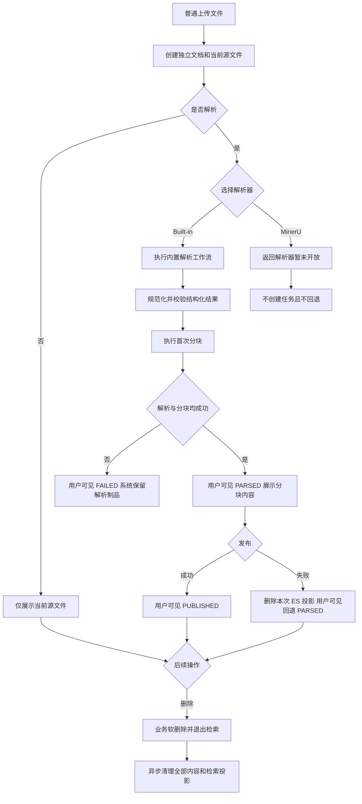

# 文档处理流水线重构需求说明书

> 功能标识：`document-processing-refactor`
> 版本：V2.1.3
> 文档状态：已确认
> SDD 等级：S2
> 创建日期：2026-08-17
> 更新日期：2026-09-03

## 一句话说明

为知识管理员重建统一、可追溯且失败行为明确的文档处理流水线，使每次上传、解析、发布和删除都有清晰的业务语义与可观察结果；以 3 表数据结构承载文档身份、结果生命周期和异步任务。

## 需求就绪摘要

> 需求成熟度：`ready`
> 就绪结论：业务目标、角色、范围、主要流程、异常规则、数据删除、兼容策略和验收边界均已确认，可以进入技术设计。

### 就绪覆盖

| 维度 | 状态 | 结论摘要 |
| --- | --- | --- |
| 业务目标与价值 | 已确认 | 以文档域目标模型重建完整处理流水线，消除当前实现与目标规则的系统性偏差 |
| 参与角色 | 已确认 | 知识管理员发起管理操作，知识用户只消费成功发布的知识，用户域和知识库域提供授权及配置边界 |
| 范围与非范围 | 已确认 | 包含 Built-in 实际解析、MinerU 扩展骨架、源文件、分块、任务、发布、删除及必要前端适配；不包含替换源文件、版本管理、MinerU 真实接入、文件夹、模型资源管理、检索问答和 OKF |
| 核心流程 | 已确认 | 普通上传新增文档；解析串联首次分块；发布等于 BM25 加向量化原子写入；删除先业务下线再异步清理内容 |
| 规则、异常与边界 | 已确认 | 同名不合并、解析器不回退、必要资源缺失失败、发布失败回退到已解析状态、删除清理可重试 |
| 验收信号 | 已确认 | 以用户可见状态、内容预览、失败原因、检索可用性、删除不可见性和后台清理结果验收 |
| 数据、安全与集成约束 | 已确认 | 不迁移旧文档数据；凭证不复制；业务记录软删除，内容与检索投影物理清理 |

### 已确认内容

| 序号 | 已确认结论 | 影响范围 | 证据来源 |
| --- | --- | --- | --- |
| 1 | 新 Feature 独立承载完整文档域目标，并取代旧 SDD 中的文档域部分 | 规格边界、兼容 | 用户确认 |
| 2 | 普通上传即使同名也始终创建新文档，不自动查找、合并或覆盖 | 上传、文档身份 | 用户确认 |
| 3 | 本期不支持替换当前源文件；用户如需更换文件，删除文档后重新上传 | 上传、文档身份 | 用户确认 |
| 4 | 本期不做版本管理，不保留历史源文件制品；文档只保留当前源文件 | 数据结构、删除 | 用户确认 |
| 5 | 文档域数据结构压缩为 3 张表：文档表、文档结果表、异步任务表 | 数据结构 | 用户确认 |
| 6 | 用户可见状态为 4 个：UPLOADED、PARSED、PUBLISHED、FAILED；解析和分块在用户视角合并为"解析" | 状态机、前端 | 用户确认 |
| 7 | 发布等于 BM25 索引写入加向量化，两者都成功才算发布成功；发布是原子操作，失败时删除本次投影并回退到 PARSED | 发布、检索 | 用户确认 |
| 8 | 检索可见性靠 ES 分块携带 document_id，RAG 重排序阶段批量查文档状态过滤；不依赖 MySQL 活动指针或 ES staging/alias | 检索、删除 | 用户确认 |
| 9 | 不迁移现有文档域数据及内容制品；用户域和知识库域数据保留 | 数据兼容 | 用户确认 |
| 10 | 包含必要的文档前端适配，复用现有页面结构，不做整体视觉重设计 | 交付边界 | 用户确认与现有页面评估 |
| 11 | 删除后业务数据软删除，全部内容制品及检索投影物理删除 | 删除、安全 | 用户确认 |
| 12 | 删除先对用户生效，再通过可重试后台任务完成内容清理；清理失败不恢复文档可见性 | 删除、一致性 | 用户确认 |
| 13 | 本期只有 Built-in 进入真实解析链路；MinerU 仅保留扩展契约和适配器骨架，不开放选择、不调用远端服务、不纳入完整流程验收 | 解析器范围、验收 | 用户确认 |
| 14 | 本 Feature 必须包含原文档域代码的整体重构，并统一为与用户域、知识库域一致的领域组织风格 | 工程交付、验收 | 用户确认 |

### 待确认内容

- 无阻塞待确认项。Built-in 精确文件格式清单、容量阈值和规范结构 Schema 进入技术设计与技术验证；MinerU 协议细节延后到后续真实接入 Feature。

## 背景与目标

- 背景：现有文档功能已具备上传、解析、分块、发布和任务骨架，但当前实现只代表现状，不代表目标业务规则。解析器、结构制品、分块策略、删除清理和领域边界需要按已确认目标统一重建。
- 当前问题：同名上传与替换语义容易混淆；解析器和分块策略表达不足；失败存在静默回退风险；当前发布与检索可见性关系不够清晰；文档删除后的内容清理缺少完整口径；旧 SDD 与新目标可能形成并行规格；现有 6 张表存在冗余设计。
- 目标：形成唯一、清晰、可验收的文档处理业务规格，让管理员能够看见源文件、解析结果、分块内容、处理任务、发布状态和删除清理结果；以 3 表数据结构简化数据底座。
- 不做会怎样：后续重构可能继续复制当前偏差，造成文件覆盖、错误解析器兜底、发布知识不完整、旧任务覆盖新结果或敏感内容删除不彻底。

## 需求范围

### 本次包含

- 文档普通上传、批量上传、列表、详情、源文件查看与下载。
- Built-in 解析器的用户选择、执行结果和失败反馈。
- MinerU 解析器扩展契约和不可用适配器骨架；本期不开放用户选择，不调用 MinerU 远端服务。
- 统一规范解析结果、首次分块、重新分块及预览。
- 解析、分块、发布、删除清理任务的状态、进度、失败原因和重试。
- 基于当前成功分块的 RAG 知识发布；发布等于 BM25 索引加向量化，原子操作。
- 单个和批量文档删除、业务下线及内容物理清理。
- 检索可见性靠 ES 分块携带 document_id，重排序批量查文档状态过滤。
- 文档列表与详情的必要交互适配，不进行整体视觉重设计。
- 对现有文档域实现进行整体重构，覆盖文档管理、解析、分块、任务、发布、删除、制品和检索投影相关代码，不只新增外围适配层。
- 统一文档域的职责分层、领域命名、状态与异常语义、公共契约、注释和测试基线，使其与用户域、知识库域的项目风格保持一致。
- 新文档域规格生效后，移除旧"知识库文档生命周期"SDD 中重复或冲突的文档域部分。

### 本次不包含

- 文档详情内替换当前源文件；用户如需更换文件，删除文档后重新上传。
- 源文件版本列表、历史版本回退或文档恢复入口。
- 文件夹实体、目录树、路径规则和文件夹管理；如页面继续展示文件夹，由知识库域提供其业务能力。
- 用户模型连接、模型档案、知识库模型绑定和 MinerU 凭证的管理页面与所有权调整。
- MinerU 的真实服务连接、API Key 配置、远端请求响应适配、能力清单验证和端到端解析验收。
- 在线检索、知识问答、重排序、答案生成和引用页面的功能扩展。
- OKF 构建、审核和发布。
- 现有文档域业务数据、任务历史和内容制品迁移。
- 应用整体导航、主题、视觉体系和通用组件重设计。

## 角色与场景

| 角色或参与方 | 使用场景 | 触发条件 | 期望结果 |
| --- | --- | --- | --- |
| 知识管理员 | 上传、解析、分块、发布和删除文档 | 对目标知识库具有管理权限 | 操作含义明确，结果和失败原因可见，可安全重试 |
| 知识用户 | 使用已成功发布的知识 | 对目标知识库具有使用权限 | 只使用 PUBLISHED 状态文档的发布内容 |
| 用户域 | 提供用户授权和模型资源 | 文档操作需要权限或模型能力 | 文档域只引用授权结果和安全资源，不复制凭证 |
| 知识库域 | 提供知识库归属、默认处理策略和模型用途绑定 | 上传或处理任务创建 | 本次任务使用创建时确定的有效策略，后续设置变化不追溯 |
| 后台清理任务 | 清理删除文档的内容与检索投影 | 文档业务软删除成功 | 最终清除全部内容，可重试且结果可观察 |

## 需求列表

| 需求编号 | 需求内容 | 优先级 | 关联场景 | 关联验收 |
| --- | --- | --- | --- | --- |
| REQ-001 | 普通上传每个文件都必须创建独立文档，同一知识库允许多个同名文档并存 | P0 | 普通/批量上传 | AC-001、AC-002 |
| REQ-002 | 平台只允许上传本期已启用解析器 Built-in 可受理且通过安全校验的文件；未来启用 MinerU 时再按全部启用解析器的共同能力收紧上传范围 | P0 | 上传预检 | AC-003、AC-004 |
| REQ-003 | 用户能够选择是否解析；本期实际解析器只能是 Built-in，任务创建后选择被冻结，失败不得切换解析器 | P0 | 上传、手动解析 | AC-005～AC-007 |
| REQ-004 | Built-in 根据内容需要使用已绑定的文本、向量、语音和视觉等模型能力；必要能力失败则解析失败，增强能力失败可带警告完成 | P0 | Built-in 解析 | AC-008、AC-009 |
| REQ-005 | 本期必须预留 MinerU 解析器扩展契约和适配器骨架，但不得开放真实解析；任何 MinerU 请求都必须明确返回未开放且不得回退 Built-in | P1 | 解析器扩展边界 | AC-010 |
| REQ-006 | 所有解析器必须生成同一规范、可校验且不可变的结构化解析结果，并尽可能保留页、段、区域或时间等来源定位 | P0 | 解析结果与预览 | AC-011、AC-012 |
| REQ-007 | 解析任务只生成、校验和保存不可变 ParsedDocument；独立分块任务消费该制品生成 ChunkManifest，用户界面分别展示两类处理结果 | P0 | 解析、分块、重新分块 | AC-035、AC-036、AC-037 |
| REQ-008 | 分块必须支持递归重叠、Markdown 标题和语义三种边界策略，以及平铺和父子两种层级策略；重新分块复用当前解析结果 | P0 | 首次分块、重新分块 | AC-015～AC-017 |
| REQ-009 | 文档处理任务必须展示排队、执行、等待重试、成功和失败，按任务类型安全重试并防止旧任务覆盖新结果 | P0 | 任务观察与重试 | AC-018、AC-019 |
| REQ-010 | 发布等于 BM25 索引写入加向量化；两者都成功才算发布成功；失败时删除本次 ES 投影并回退到 PARSED 状态 | P0 | RAG 发布 | AC-020、AC-021 |
| REQ-011 | 检索可见性靠 ES 分块携带 document_id，RAG 重排序阶段批量查文档状态过滤非 PUBLISHED 的分块；删除文档后检索立即不返回该文档内容 | P0 | 检索可见性 | AC-022 |
| REQ-012 | 文档列表和详情必须清楚展示当前源文件、解析结果、分块内容、任务状态、发布状态及可操作入口 | P1 | 文档管理页面 | AC-023、AC-024 |
| REQ-013 | 删除文档后业务记录软删除并立即对用户不可见，全部内容制品和检索投影通过可重试清理流程物理删除 | P0 | 单个/批量删除 | AC-025～AC-028 |
| REQ-014 | 文档管理和处理操作必须遵循现有 Workspace 与知识库权限，凭证、源文件和解析内容不得跨用户或空间泄露 | P0 | 权限与安全 | AC-029、AC-030 |
| REQ-015 | 本 Feature 不兼容迁移旧文档数据；新文档模型启用时保留用户和知识库数据，文档测试数据重新上传 | P1 | 上线切换 | AC-031 |
| REQ-016 | 文档能力必须保持清晰领域边界和一致的公共语义，文件夹管理不得由文档能力实现 | P1 | 领域治理 | AC-032 |
| REQ-017 | 现有文档域代码必须按新目标整体重构为与用户域、知识库域一致的组织风格，统一职责、命名、状态、异常、公共契约和测试，并移除与新规则冲突的旧处理链路 | P0 | 工程重构 | AC-033、AC-034 |

## 业务规则

| 规则编号 | 规则内容 | 适用场景 | 例外或边界 |
| --- | --- | --- | --- |
| BR-001 | 普通上传不以文件名作为文档唯一性判断 | 普通/批量上传 | 无 |
| BR-002 | 本期不支持替换当前源文件；用户如需更换文件，删除文档后重新上传 | 上传 | 未来版本可能支持替换 |
| BR-003 | 不建立用户可见的源文件版本列表、历史回退或恢复入口 | 全流程 | 文档只保留当前源文件 |
| BR-004 | 平台允许上传的文件必须位于所有已启用解析器的共同受理范围；本期只有 Built-in 启用 | 上传 | MinerU 真实启用后必须重新验证并收紧共同能力清单 |
| BR-005 | 本次显式选择优先于知识库默认策略，任务运行中不重读后来修改的默认设置 | 解析任务 | 用户可显式创建新任务使用新选择 |
| BR-006 | 任何解析器失败或不可用都不得自动调用另一解析器 | 解析 | 本期不能改选 MinerU；未来启用后可由用户重新发起并主动改选 |
| BR-007 | Built-in 必要能力缺失或失败使任务失败；增强能力缺失或失败可带可见警告完成 | Built-in | 必要与增强由内容分类和工作流判定 |
| BR-008 | 规范解析结果为不可变结构化事实；可读 Markdown 只是可选派生内容 | 解析产物 | 不承诺模型重跑后字节完全一致 |
| BR-009 | 解析与分块是独立工作流；PARSE 成功只表示 ParsedDocument 已校验并保存，分块失败不得改变解析制品或重新调用解析器 | PARSE、CHUNK | 分块可基于同一解析制品独立重试 |
| BR-010 | 默认分块为递归重叠加父子层级；Markdown 标题策略保留真实标题上下文，递归策略可构造父子上下文；语义分块缺少有效向量能力时失败，不静默切换策略 | 分块 | 不支持旧 LENGTH/STRUCTURE 策略的静默兼容或回退；父块仅承载上下文，子块才是默认向量检索单元 |
| BR-011 | 发布等于 BM25 索引写入加向量化；两者都成功才算发布成功；失败时删除本次 ES 投影并回退到 PARSED | 发布 | 原子操作，无降级 |
| BR-012 | 检索可见性靠 ES 分块携带 document_id，重排序批量查文档状态过滤；删除后 status=DELETED 立即生效 | 检索、删除 | 无空窗期 |
| BR-013 | 删除先让文档在业务上不可见，再异步物理清理内容和检索投影 | 删除 | 清理失败不恢复文档可见性 |
| BR-014 | 删除清理必须覆盖源文件、规范解析结果、派生内容、分块制品、临时制品以及全部文本和向量投影 | 删除 | 业务与审计记录软删除保留 |
| BR-015 | 删除后的历史引用最多保留名称等快照，不能继续打开原文或分块 | 删除、历史引用 | 无 |
| BR-016 | 文档域不实现文件夹实体、路径、目录树和文件夹 CRUD | 全流程 | 可消费知识库域提供的不透明容器引用 |
| BR-017 | 重构完成后，新旧文档处理链路不得并行承载同一业务能力；被新目标替代的旧入口和旧实现必须退出有效运行路径 | 工程重构、切换 | 可复用且符合新边界的通用基础能力可以保留 |

## 业务流程

### 主要流程

1. 知识管理员在知识库内普通上传一个或多个文件，系统为每个文件创建独立文档。
2. 管理员选择只保存、使用知识库默认策略或立即解析；本期实际解析只能使用 Built-in。
3. 解析任务冻结本次有效选择，执行解析、规范化和校验，并保存不可变 ParsedDocument。
4. 独立分块任务基于已校验 ParsedDocument 生成 ChunkManifest；页面分别展示解析制品和分块结果。
5. 人工发布或任务冻结的自动发布意图触发发布；发布等于 BM25 加向量化，两者都成功后用户可见状态为 PUBLISHED。
6. 管理员可以基于当前解析结果重新分块。
7. 管理员删除文档后，文档立即不可见且退出检索，后台继续清理全部内容制品和检索投影。

### 异常或分支

- 上传失败：不生成可见的成功文档，并展示格式、安全或资源限制原因。
- 同名上传：仍创建独立文档，不提示覆盖旧文档。
- Built-in 必要资源不可用：当前解析失败并提示需要配置的能力，不切换 MinerU。
- MinerU 请求：系统明确提示该解析器暂未开放，不创建解析任务且不切换到 Built-in。
- 分块失败：保留已校验解析制品，分块重试不重新调用解析器。
- 重新分块失败：保留原当前分块，用户可见状态仍为 PARSED。
- 发布失败：删除本次 ES 投影，用户可见状态回退为 PARSED 并展示失败原因，用户可重试。
- 删除清理失败：文档继续保持不可见，后台记录失败原因并重试。

### 流程图

## 业务数据口径

### 数据影响判断

| 检查项 | 是否涉及 | 说明 |
| --- | --- | --- |
| 新增、修改、删除或查询持久化数据 | 是 | 重建文档、结果、任务三表；删除 Revision 表和 Artifact 登记表 |
| 外部数据入库、出库、同步、对账或报表 | 是 | 用户文件进入平台，发布结果进入检索服务，删除时跨存储清理；本期不向 MinerU 传输数据 |
| 字段映射、金额、日期、状态、流水号或客户标识 | 是 | 文档身份、当前文件标识、结果阶段、任务状态和清理状态均需稳定口径 |
| 手机号、证件号、银行卡、合同、地址、交易流水等敏感数据 | 是 | 源文件、OCR、语音转写和解析文本可能包含企业或个人敏感内容 |
| 跨系统、跨服务、跨库或第三方数据流转 | 是 | 涉及对象存储、模型服务和检索服务；MinerU 真实数据流转延后 |

### 关键数据口径

| 业务对象/数据项 | 用户能理解的含义 | 来源或产生方式 | 单位/格式/状态口径 | 本次是否变化 | 是否关键 | 确认状态 |
| --- | --- | --- | --- | --- | --- | --- |
| 文档身份 | 知识库内一份可独立管理的文档 | 普通上传创建 | 与文件名无关；同名可并存 | 是 | 是 | 已确认 |
| 当前源文件 | 文档详情当前展示和后续处理使用的文件 | 初次上传 | 文档只保留当前源文件，不保留历史 | 是 | 是 | 已确认 |
| 文档显示名称 | 列表和详情展示的当前名称 | 当前源文件名 | 与文件名一致 | 是 | 是 | 已确认 |
| 用户可见状态 | 文档当前处于的处理阶段 | 上传、解析、发布、删除触发 | UPLOADED/PARSED/PUBLISHED/FAILED/DELETED | 是 | 是 | 已确认 |
| 结果生命周期阶段 | 系统内部已成功推进到的阶段 | 解析、分块、发布推进 | INIT/PARSE/CHUNK/PUBLISH | 是 | 是 | 已确认 |
| 解析器选择 | 本次解析使用的解析器 | 知识库默认或用户显式选择 | 本期仅 Built-in 可用；任务创建后冻结；失败不回退 | 是 | 是 | 已确认 |
| 规范解析结果 | 所有解析器统一输出的结构化文档内容 | 解析、规范化和校验产生 | 固定 Schema、生成后不可变、携带来源定位与警告；不保存第三方 OCR 图片 URL | 是 | 是 | 已确认 |
| 分块结果 | 用于预览和后续发布的内容片段集合 | 首次分块或重新分块产生 | 边界与层级策略组合；成功后成为当前结果 | 是 | 是 | 已确认 |
| 发布结果 | BM25 投影加向量投影的发布产物 | 发布成功后产生 | 两者都成功才算发布成功 | 是 | 是 | 已确认 |
| 处理任务 | 解析、分块、发布和清理的进度事实 | 用户操作或自动策略触发 | 排队、执行、等待重试、成功、失败 | 是 | 是 | 已确认 |
| 删除状态 | 文档已从业务视图下线及内容清理进度 | 管理员删除触发 | 业务删除立即生效；内容清理异步完成或失败待重试 | 是 | 是 | 已确认 |
| 模型资源引用 | Built-in 调用模型能力所需的安全资源标识 | 用户域和知识库域提供 | 文档处理中不复制或回显凭证 | 是 | 是 | 已确认 |

## 影响说明

| 影响对象 | 影响说明 |
| --- | --- |
| 知识管理员 | 获得语义明确的新增上传、解析器选择、解析、分块、发布、删除及失败重试流程 |
| 知识用户 | 始终使用 PUBLISHED 状态文档的发布内容；文档删除后相关知识退出检索 |
| 文档列表 | 允许同名文档并存；删除后立即不可见；文件夹能力不再由文档域定义 |
| 文档详情 | 复用现有结构，增加解析器选择、任务反馈和发布状态提示；移除替换入口 |
| 既有文档数据 | 不迁移，实施切换时受控清理并重新上传测试文档 |
| 旧 SDD | 新 Feature 生效后删除其中重复或冲突的文档域需求、设计和任务内容，Git 历史保留 |
| 用户域 | 继续拥有授权和模型资源；MinerU 安全连接能力延后到真实接入 Feature |
| 知识库域 | 继续拥有默认处理策略、模型用途绑定和文件夹能力 |
| 对象存储与检索服务 | 对象键和制品保持独立；删除文档时物理清理全部内容和检索投影 |
| 现有文档域代码 | 不是局部补丁或仅新增适配器，而是按新领域目标整体重构；可复用通用基础能力，但必须清除冲突职责和并行旧链路 |
| 长期知识库 | 文档域业务、技术、数据文档和相关知识卡片在实现验证后需要知识治理同步 |

## 重构交付要求

- 重构范围必须覆盖当前文档管理、解析、分块、任务、发布、删除、内容制品和检索投影相关实现，不得只完成新接口或新解析器而保留核心旧流程。
- 代码组织应沿用用户域、知识库域已经形成的项目风格：领域归属清晰，应用编排与领域规则分离，请求响应和公共语义有明确边界，基础设施实现不冒充业务标准。
- 字符串化且容易产生歧义的解析器、策略、状态和异常口径应统一为受约束的公共语义；具体类型和落点由技术设计确定。
- 现有可复用的任务执行、分布式锁、对象存储、模型资源解析和检索投影基础能力可以保留，但必须通过清晰边界被文档域使用。
- 与文件夹管理、未知解析器回退、策略静默回退、无向量降级发布以及旧任务覆盖新结果相关的旧逻辑必须退出有效运行路径。
- 重构必须先建立现有行为保护和目标规则测试，再分阶段迁移；详细代码范围、依赖顺序和 Task Pack 在技术设计与任务规划中展开。
- 重构完成的定义不仅是功能可用，还包括旧链路退出、目标 AC 通过、领域边界检查通过以及新增或实质修改的公共契约和关键逻辑具备有效注释。

## 验收标准

- AC-001：Given 知识库中已经存在名为 `合同.pdf` 的文档，when 管理员通过普通上传再次提交同名文件，then 系统创建另一个独立文档，原文档身份和内容不变。关联需求：REQ-001。
- AC-002：Given 管理员批量上传多个文件且其中存在同名文件，when 上传完成，then 每个成功文件分别产生可访问文档，失败项单独显示原因。关联需求：REQ-001。
- AC-003：Given 文件不在本期 Built-in 受理范围或未通过文件安全校验，when 管理员上传，then 系统拒绝并给出明确原因，不生成可见成功文档。关联需求：REQ-002。
- AC-004：Given 文件通过共同能力和安全校验，when 管理员上传，then 系统不因当前缺少解析资源而拒绝保存文件，后续解析按资源规则明确成功或失败。关联需求：REQ-002。
- AC-005：Given 管理员选择仅保存、使用默认策略或立即解析，when 文件上传成功，then 系统只执行本次选择对应的处理动作。关联需求：REQ-003。
- AC-006：Given 本次解析任务已选择 Built-in，when 知识库默认处理策略后来变化，then 已创建任务仍按创建时冻结的 Built-in 策略执行。关联需求：REQ-003。
- AC-007：Given 选定解析器执行失败，when 任务结束，then 页面显示该解析器的失败原因且系统不调用另一解析器；管理员可创建新任务主动改选。关联需求：REQ-003。
- AC-008：Given Built-in 判断当前文件需要必要的 OCR、ASR、VLM、LLM 或其他已定义能力，when 所需能力未配置或调用失败，then 解析任务失败并提示需要处理的资源。关联需求：REQ-004。
- AC-009：Given Built-in 的基础与必要处理成功但增强能力不可用，when 结果仍通过规范校验，then 任务可继续完成并向用户展示警告。关联需求：REQ-004。
- AC-010：Given 前端、API 或知识库默认策略请求使用 MinerU，when 系统处理该请求，then 明确返回"解析器暂未开放"，不创建解析任务、不调用远端服务且不使用 Built-in 兜底；代码中存在可独立扩展的 MinerU 契约与适配器骨架。关联需求：REQ-005。
- AC-011：Given 任一解析器返回结果，when 规范化和校验成功，then 页面可查看统一结构内容、来源定位和警告，后续分块不依赖解析器私有格式。关联需求：REQ-006。
- AC-012：Given 解析结果不符合规范结构或缺少必要来源信息，when 校验失败，then 不保存为成功解析结果且不进入首次分块。关联需求：REQ-006。
- AC-013、AC-014：由 CR-001 的 AC-035～AC-037 替代；旧“首次解析串联分块”验收不再用于新实现。关联需求：REQ-007。
- AC-035：Given 一个 PARSE 任务成功，when 解析结果提交，then 已校验 ParsedDocument 作为唯一解析制品保存，且该任务不生成 ChunkManifest。关联需求：REQ-007。
- AC-036：Given 当前存在已校验 ParsedDocument，when 创建或重试分块任务，then 任务只消费该制品生成 ChunkManifest，不重新调用文件解析器或 OCR。关联需求：REQ-007、REQ-008。
- AC-037：Given 分块任务失败，when 任务结束，then ParsedDocument 保持可用，失败不覆盖新结果，后续可独立重新分块。关联需求：REQ-007、REQ-009。
- AC-038：Given PDF 或图片需要 OCR，when `paddleocr-official` 返回有序页面 Markdown 及页面图片 URL，then Gateway 仅在本次受控调用中透传该 URL；规范化后保存的解析结果只以页面顺序 `index + 1` 保留页面 Markdown 与 `PAGE` SourceAnchor，不保存图片 URL，且 OCR 失败不回退其他解析器；本期不伪造区域坐标、置信度、阅读顺序或块类型。关联需求：REQ-004、REQ-006。
- AC-039：Given PDF 含文本层，when 页级质量探测完成，then OCR 计划明确为 NONE、PAGE_SELECTIVE 或 REQUIRED，并记录可解释依据。关联需求：REQ-004、REQ-006。
- AC-040：Given 新解析工作流启用，when 任意 parser 输出结果，then 不得使用按空行切分作为 RAG 分块边界。关联需求：REQ-006、REQ-017。
- AC-015：Given 管理员选择递归重叠、Markdown 标题或语义边界及平铺或父子层级，when 分块成功，then 页面显示与所选组合一致的分块结果；递归与 Markdown 策略复用 LangChain4j SDK 或其 Fons4AI LangChain4j 扩展。关联需求：REQ-008。
- AC-016：Given 管理员选择语义分块但有效向量能力缺失、调用失败或维度不兼容，when 执行分块，then 任务失败且不自动切换为长度或结构分块。关联需求：REQ-008。
- AC-017：Given 文档已有成功解析结果，when 管理员重新分块，then 系统复用当前解析结果且不重新调用解析器；失败时保留原当前分块。关联需求：REQ-008。
- AC-018：Given 解析、重新分块、发布或清理任务正在处理，when 管理员查看详情或任务状态，then 可以看到任务类型、当前阶段、进度、重试等待或失败原因。关联需求：REQ-009。
- AC-019：Given 旧任务晚于新任务完成或管理员重试非解析任务，when 系统提交结果，then 旧任务不能覆盖新当前结果，重试也不能错误改变无关处理状态。关联需求：REQ-009。
- AC-020：Given 当前成功分块需要进入检索，when 缺少有效向量能力、模型调用失败或维度不兼容，then 发布失败且不生成降级发布。关联需求：REQ-010。
- AC-021：Given 发布执行中 BM25 成功但向量化失败，when 任务结束，then 删除本次已写入的 ES 投影，用户可见状态回退为 PARSED 并展示失败原因；用户可重试整个发布流程。关联需求：REQ-010。
- AC-022：Given 文档已成功发布且在 ES 中有投影，when RAG 检索召回该文档分块，then 重排序阶段批量查文档状态为 PUBLISHED 才返回内容；文档被删除后检索立即不返回该文档内容。关联需求：REQ-011。
- AC-023：Given 文档处于任一处理状态，when 管理员打开列表或详情，then 能区分当前源文件、解析、发布和删除清理状态，不直接暴露内部状态代码。关联需求：REQ-012。
- AC-024：Given 管理员执行解析、重新分块或发布，when 操作成功、失败或发生并发冲突，then 反馈显示在对应操作区域，输入和上下文按安全规则保留或清理。关联需求：REQ-012。
- AC-025：Given 管理员确认删除文档，when 业务删除成功，then 文档立即从列表、详情和检索中不可用，后续处理操作被拒绝，并向用户显示"删除已受理"。关联需求：REQ-013。
- AC-026：Given 删除已受理，when 后台清理执行，then 当前源文件、规范解析结果、派生内容、分块与临时制品以及文本和向量投影最终全部删除。关联需求：REQ-013。
- AC-027：Given 内容清理部分失败，when 管理员或运维查看清理结果，then 可以看到失败状态和原因并继续重试，文档不会重新对普通用户可见。关联需求：REQ-013。
- AC-028：Given 文档已经删除，when 用户通过历史引用尝试查看原文或分块，then 只能看到允许保留的名称等快照信息，不能读取已删除内容。关联需求：REQ-013。
- AC-029：Given 用户没有目标知识库管理权限，when 尝试上传、解析、分块、发布或删除，then 管理入口不可用且服务端拒绝操作。关联需求：REQ-014。
- AC-030：Given 文档处理需要用户模型资源，when 任务执行、失败、记录日志或返回结果，then 不复制、回显或记录模型凭证，且不能使用其他用户或其他空间的资源；本期不接收或保存 MinerU API Key。关联需求：REQ-014。
- AC-031：Given 新文档模型准备启用，when 执行环境切换，then 用户与知识库数据保留，旧文档业务数据和内容制品按受控范围清理，测试文档在新模型下重新上传且不启用双读兼容。关联需求：REQ-015。
- AC-032：Given 用户在文档页面使用文件夹相关功能，when 功能需要创建、重命名、移动或删除文件夹，then 该能力由知识库域提供，文档处理只消费归属结果而不实现路径和层级规则。关联需求：REQ-016。
- AC-033：Given 文档域重构完成，when 对代码组织、职责、命名、状态、异常、公共契约和测试进行工程验收，then 其组织风格与用户域、知识库域保持一致，文档相关能力均具有明确归属且不存在职责散落。关联需求：REQ-017。
- AC-034：Given 新文档处理流水线已经启用，when 执行目标业务验收和回归检查，then 所有文档操作只通过新规则生效，与新目标冲突的旧入口、静默回退和并行处理链路不再可执行。关联需求：REQ-017。

## 质量要求

- 性能：上传和所有异步任务必须及时返回已受理状态；精确文件大小、页数、超时、并发和批量限制由技术设计提出并在实现验证后校准。
- 安全：源文件及解析内容可能包含企业或个人敏感信息，必须按 Workspace 和知识库权限隔离；API Key 与第三方 OCR 图片 URL 不得进入文档制品、任务快照、前端持久化或日志；删除必须覆盖所有内容副本和检索投影。
- 兼容：不兼容迁移旧文档数据，不引入旧结构双读；用户域和知识库域既有业务数据保留；新 Feature 是文档域唯一有效规格。
- 可用性：解析、分块、发布和删除清理均可观察、可重试；任何失败不得静默切换解析器、分块策略或发布方式。
- 一致性：新结果只有完整成功且仍对应当前输入时才能成为当前结果；删除业务下线后不能因外部清理失败重新可见。
- 可访问性：新增或调整的上传、解析器选择、警告和失败反馈应支持键盘操作，并通过文本表达状态，不只依赖颜色。
- 可维护性：文档能力的业务边界、代码组织风格、公共术语、状态与异常语义、注释和测试基线应与用户域、知识库域保持一致；具体代码范围、依赖方向和迁移步骤由技术设计及任务规划确定。
- 可追溯性：管理员能够区分当前源文件、规范解析结果、分块、发布结果、任务和删除清理状态，并关联外部解析流水而不暴露秘密。

## 风险与待确认

### 风险

- Built-in 文件能力清单若与实际解析工作流不一致，会造成上传后无法解析；MinerU 启用时还必须重新验证共同能力并收紧上传范围。
- 规范结构 Schema 会直接影响跨解析器兼容、来源定位、预览、分块和后续演进，设计不完整将造成再次重构。
- Built-in 涉及多种模型能力，必要与增强分类错误可能导致不必要失败或低质量成功。
- 删除采用业务软删除加跨存储物理清理，必须防止清理遗漏、重复执行和删除范围越界。
- 删除全部内容后历史引用不能再打开原文，这是用户确认的不可逆行为，需要在删除确认中明确提示。
- 旧 SDD 同时包含多个领域，移除文档域部分时可能破坏跨领域 REQ/AC 引用，设计阶段必须先形成迁移清单。
- 原文档域实现分散且包含多条相互依赖的处理链路，若只迁移部分入口，可能造成新旧状态、任务和制品并行生效；设计阶段必须给出分阶段切换与旧链路退出方案。
- 发布失败回退到 PARSED 后，用户必须重试整个发布流程（BM25 加向量化），无法只重试失败的部分。

### 假设

- 当前项目仍处于设计开发阶段，没有必须迁移保留的生产文档数据。
- 用户域现有 Workspace 授权和模型资源能力、知识库域默认策略和模型用途绑定继续作为外部业务边界使用。
- 现有文档列表与详情页面可以作为局部适配基础，不需要整体视觉重设计。
- 数据库、对象存储、模型服务和检索服务的真实连接验证在设计和实现阶段执行，不阻塞需求就绪；MinerU 真实连接不属于本期。

### 待确认

- Built-in 受理的精确扩展名、MIME 和文件版本清单，由技术设计结合实际工作流验证；MinerU 共同能力验证延后。
- 单文件大小、页数、音视频时长、批量数量、任务超时和并发阈值，由技术设计提出候选并通过实现验证校准。
- 规范解析结果 v1 Schema、来源锚点、表格、图片、音频和警告结构，由技术设计定义。
- MinerU 的部署方式、请求路径、鉴权、同步/异步响应、错误映射和 API Key 管理全部延后到后续真实接入 Feature。
- 删除后台清理的重试次数、告警阈值和运维入口由技术设计确定，但不得改变业务下线与全部内容物理清理规则。

## 版本修订记录

| 日期 | 版本 | 说明 |
| --- | --- | --- |
| 2026-08-17 | V1.0.0 | 初始化正式需求说明书，确认文档域完整替代范围、上传与替换语义、处理流水线、删除清理及兼容策略 |
| 2026-08-17 | V1.1.0 | 增加原文档域代码整体重构范围、项目风格对齐、旧链路退出和工程验收要求 |
| 2026-08-17 | V1.2.0 | 暂缓 MinerU 真实接入，本期仅保留扩展契约与适配器骨架，实际解析链路和验收范围收敛为 Built-in |
| 2026-08-17 | V2.0.0 | 删除替换源文件功能和无版本管理；数据结构压缩为 3 表；用户可见状态合并为 4 状态；发布改为 BM25 加向量化原子操作；检索可见性改为文档状态过滤；删除 TV-ES-001 相关 AC |
| 2026-08-28 | V2.1.0 | CR-001 将解析与分块解耦；新增结构化 OCR、PDF 页级探测与禁止隐式分块的验收标准。 |
| 2026-08-28 | V2.1.1 | 用户直接调整 TP-010/T033：AC-038 收敛为 `paddleocr-official` 的页级 Markdown/图片 URL 与 `PAGE` 锚点；区域坐标、置信度、阅读顺序和块类型延后至独立结构化 OCR 能力。 |
| 2026-09-01 | V2.1.2 | ITER-002：用户确认分块优先复用 LangChain4j SDK；将策略口径调整为递归重叠、Markdown 标题和语义，父子层级适用于真实标题结构及算法构造上下文，旧 LENGTH/STRUCTURE 不再静默兼容。 |
| 2026-09-03 | V2.1.3 | ITER-003：确认官方 OCR 图片 URL 仅为本次 Gateway 调用的临时传输数据；AC-038 收敛为保存页面 Markdown 与 PAGE 来源锚点、禁止将 URL 写入解析制品、任务快照或日志。 |
